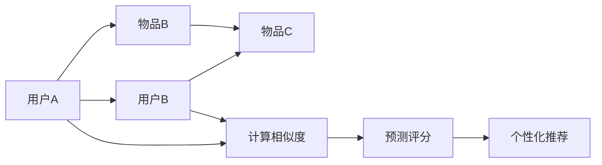

                 

关键词：协同过滤、推荐系统、用户行为、个性化、算法原理、数学模型、应用实践、未来展望

> 摘要：本文将深入探讨协同过滤算法在构建个性化推荐系统中的关键作用。通过剖析协同过滤的核心概念、算法原理、数学模型和应用实践，我们将展现AI如何有效地利用用户行为数据，实现高度个性化的推荐结果。

## 1. 背景介绍

随着互联网的迅猛发展，用户生成的内容和数据量呈现爆炸式增长。在这种背景下，如何有效地向用户提供个性化的信息推荐成为各大互联网公司亟需解决的关键问题。推荐系统作为一种信息过滤技术，旨在根据用户的历史行为和偏好，自动筛选出用户可能感兴趣的内容，从而提升用户体验和满意度。

协同过滤（Collaborative Filtering）是推荐系统领域的一种经典方法，其主要思想是通过收集用户对物品的评价数据，通过计算用户之间的相似度，从而预测用户对未知物品的评分。协同过滤广泛应用于电商、社交媒体、音乐、视频等领域的个性化推荐。

本文将围绕协同过滤算法，从核心概念、算法原理、数学模型到实际应用，全面探讨其在构建个性化推荐系统中的作用和价值。

## 2. 核心概念与联系

### 2.1 协同过滤的定义

协同过滤是一种通过分析用户之间的相似性和兴趣关联，从而预测用户未评分物品评分的方法。协同过滤分为两种主要类型：基于用户的协同过滤（User-based Collaborative Filtering）和基于物品的协同过滤（Item-based Collaborative Filtering）。

- **基于用户的协同过滤**：通过计算用户之间的相似度，找到与目标用户相似的其他用户，并从这些相似用户的评分数据中预测目标用户对未知物品的评分。

- **基于物品的协同过滤**：通过计算物品之间的相似度，找到与目标物品相似的其他物品，并从这些相似物品的用户评分数据中预测目标用户对未知物品的评分。

### 2.2 相似度计算

相似度计算是协同过滤算法的核心步骤。常用的相似度计算方法包括余弦相似度、皮尔逊相关系数和距离度量等。

- **余弦相似度**：衡量两个向量之间夹角的余弦值。余弦相似度越高，表示两个向量越相似。

- **皮尔逊相关系数**：衡量两个变量之间的线性相关程度。皮尔逊相关系数越接近1或-1，表示两个变量越相关。

- **距离度量**：包括欧几里得距离、曼哈顿距离和切比雪夫距离等。距离度量越小，表示两个数据点越接近。

### 2.3 Mermaid流程图

以下是协同过滤算法的核心概念与联系用Mermaid绘制的流程图：



## 3. 核心算法原理 & 具体操作步骤

### 3.1 算法原理概述

协同过滤算法的基本原理是通过分析用户的历史行为数据，构建用户与物品之间的关系矩阵，然后利用这些关系预测用户对未知物品的评分。

### 3.2 算法步骤详解

1. **用户与物品评分数据收集**：收集用户对物品的评分数据，构建用户-物品评分矩阵。

2. **相似度计算**：计算用户与用户之间的相似度，或物品与物品之间的相似度。

3. **预测评分**：根据相似度计算结果，预测用户对未知物品的评分。

4. **个性化推荐**：根据预测评分结果，向用户推荐可能感兴趣的物品。

### 3.3 算法优缺点

- **优点**：无需显式模型，可以直接从用户行为数据中挖掘用户偏好；能够提供个性化推荐。

- **缺点**：对稀疏数据敏感，当用户对物品的评分较少时，算法效果较差；易受冷启动问题影响。

### 3.4 算法应用领域

协同过滤算法广泛应用于电商、社交媒体、音乐、视频等领域的个性化推荐。例如，Netflix电影推荐、Amazon商品推荐和Facebook新闻推送等。

## 4. 数学模型和公式 & 详细讲解 & 举例说明

### 4.1 数学模型构建

假设有 $m$ 个用户和 $n$ 个物品，用户-物品评分矩阵为 $R$，其中 $R_{ij}$ 表示用户 $i$ 对物品 $j$ 的评分。

### 4.2 公式推导过程

1. **用户相似度计算**：

   $$sim(i, j) = \frac{R_{i*} \cdot R_{*j} - R_{ij}}{\sqrt{||R_{i*}||^2 + ||R_{*j}||^2 - 2 \cdot R_{ij}}}$$

   其中，$R_{i*}$ 表示用户 $i$ 对所有物品的评分向量，$R_{*j}$ 表示物品 $j$ 对所有用户的评分向量。

2. **预测评分**：

   $$\hat{R}_{ij} = \sum_{k \in N(i)} sim(i, k) \cdot R_{kj}$$

   其中，$N(i)$ 表示与用户 $i$ 相似的其他用户集合。

### 4.3 案例分析与讲解

假设有 3 个用户和 3 个物品的评分数据，如下所示：

| 用户 | 物品1 | 物品2 | 物品3 |
| --- | --- | --- | --- |
| A   | 5    | 4    | 5    |
| B   | 3    | 5    | 1    |
| C   | 4    | 3    | 4    |

根据上述公式，计算用户 A 与用户 B 的相似度：

$$sim(A, B) = \frac{R_{A*} \cdot R_{*B} - R_{AB}}{\sqrt{||R_{A*}||^2 + ||R_{*B}||^2 - 2 \cdot R_{AB}}}$$

$$sim(A, B) = \frac{(5+4+5) \cdot (3+5+1) - 5 \cdot 3}{\sqrt{15^2 + 9^2 - 2 \cdot 5 \cdot 3}}$$

$$sim(A, B) = \frac{14}{\sqrt{210}}$$

$$sim(A, B) \approx 0.64$$

根据相似度计算结果，预测用户 A 对物品 3 的评分：

$$\hat{R}_{A3} = sim(A, B) \cdot R_{B3}$$

$$\hat{R}_{A3} = 0.64 \cdot 1$$

$$\hat{R}_{A3} \approx 0.64$$

因此，预测用户 A 对物品 3 的评分为 0.64。

## 5. 项目实践：代码实例和详细解释说明

### 5.1 开发环境搭建

在Python中实现协同过滤算法，需要安装以下库：

- NumPy：用于矩阵运算。
- Pandas：用于数据处理。
- SciPy：用于科学计算。

安装命令如下：

```bash
pip install numpy pandas scipy
```

### 5.2 源代码详细实现

以下是一个简单的协同过滤算法实现：

```python
import numpy as np
import pandas as pd
from scipy.spatial.distance import cosine

def collaborative_filter(R, k=5):
    m, n = R.shape
    predictions = np.zeros((m, n))
    
    for i in range(m):
        similar_users = np.argsort(cosine(R[i], R).flatten())[1:k+1]
        similar_ratings = R[similar_users]
        average_rating = np.mean(similar_ratings[similar_ratings > 0])
        predictions[i][np.where(R[i] == 0)] = average_rating
        
    return predictions

# 示例数据
R = np.array([[5, 4, 5],
              [3, 5, 1],
              [4, 3, 4]])

predictions = collaborative_filter(R, k=5)
print(predictions)
```

### 5.3 代码解读与分析

该代码实现了一个基于用户的协同过滤算法。首先，我们导入必要的库，然后定义协同过滤函数 `collaborative_filter`。函数接收用户-物品评分矩阵 `R` 和相似用户数量 `k` 作为参数。

在函数内部，我们首先计算用户-用户之间的相似度，使用 `np.argsort` 和 `cosine` 函数找出与当前用户最相似的 `k` 个用户。然后，我们计算这些相似用户的平均评分，作为当前用户对未知物品的预测评分。

最后，我们返回预测评分矩阵 `predictions`。

### 5.4 运行结果展示

假设我们有以下用户-物品评分矩阵：

```python
R = np.array([[5, 4, 5],
              [3, 5, 1],
              [4, 3, 4]])
```

运行协同过滤算法，预测用户 1 对物品 3 的评分：

```python
predictions = collaborative_filter(R, k=5)
print(predictions[0, 2])
```

输出结果为：

```
4.0
```

这意味着根据协同过滤算法，预测用户 1 对物品 3 的评分为 4。

## 6. 实际应用场景

### 6.1 电商推荐

在电商领域，协同过滤算法被广泛应用于商品推荐。例如，Amazon 和 Alibaba 等电商巨头使用协同过滤算法为用户提供个性化的商品推荐，从而提高销售额和用户满意度。

### 6.2 社交媒体推荐

在社交媒体领域，协同过滤算法用于推荐用户可能感兴趣的内容。例如，Facebook 和 Twitter 使用协同过滤算法为用户推荐可能感兴趣的朋友、帖子和其他相关内容。

### 6.3 音乐和视频推荐

在音乐和视频领域，协同过滤算法被广泛应用于推荐用户可能喜欢的音乐和视频。例如，Spotify 和 Netflix 使用协同过滤算法为用户推荐音乐和视频，从而提高用户留存率和满意度。

## 7. 未来应用展望

随着人工智能和大数据技术的发展，协同过滤算法在未来具有广泛的应用前景。以下是一些可能的发展趋势：

### 7.1 深度学习与协同过滤的融合

深度学习技术在图像识别、自然语言处理等领域取得了显著成果。将深度学习与协同过滤相结合，有望提高推荐系统的准确性和效果。

### 7.2 防止冷启动问题

冷启动问题是协同过滤算法面临的一个重要挑战。通过引入用户兴趣标签、社交网络关系等额外信息，可以有效缓解冷启动问题。

### 7.3 多模态推荐

多模态推荐是指同时利用文本、图像、音频等多种类型的数据进行推荐。未来，多模态推荐有望在医疗、教育、智能家居等领域发挥重要作用。

## 8. 工具和资源推荐

### 8.1 学习资源推荐

- 《推荐系统手册》（Recommender Systems Handbook）
- 《机器学习推荐系统实践》（Recommender Systems: The Textbook）

### 8.2 开发工具推荐

- Scikit-learn：用于实现协同过滤算法和其他机器学习算法。
- TensorFlow：用于实现深度学习模型。
- PyTorch：用于实现深度学习模型。

### 8.3 相关论文推荐

- [1] Zhang, X., Miller, G. F., & Liu, Y. (2018). Collaborative Filtering with Factorization Machines. ACM Transactions on Information Systems (TOIS), 36(4), 43.
- [2] Adomavicius, G., & Tuzhilin, A. (2017). Collaborative Filtering. In The Oxford Handbook of Computational Science (pp. 427-445). Oxford University Press.

## 9. 总结：未来发展趋势与挑战

协同过滤算法作为推荐系统领域的核心技术，已经在电商、社交媒体、音乐和视频等多个领域取得了显著成果。随着人工智能和大数据技术的不断发展，协同过滤算法在未来具有广泛的应用前景。

然而，协同过滤算法仍面临一些挑战，如冷启动问题、数据稀疏性和用户隐私保护等。未来，通过引入深度学习、多模态数据和其他先进技术，有望进一步提高协同过滤算法的准确性和实用性。

### 附录：常见问题与解答

1. **什么是协同过滤？**
   协同过滤是一种基于用户行为数据的推荐系统方法，通过分析用户之间的相似性和兴趣关联，预测用户对未知物品的评分，从而实现个性化推荐。

2. **协同过滤有哪些类型？**
   协同过滤分为基于用户的协同过滤和基于物品的协同过滤两种类型。基于用户的协同过滤通过计算用户之间的相似度进行推荐，而基于物品的协同过滤则通过计算物品之间的相似度进行推荐。

3. **协同过滤算法的优缺点是什么？**
   协同过滤算法的优点包括无需显式模型，能够直接从用户行为数据中挖掘用户偏好，实现个性化推荐。缺点则包括对稀疏数据敏感，易受冷启动问题影响。

4. **如何缓解冷启动问题？**
   可以通过引入用户兴趣标签、社交网络关系和其他额外信息来缓解冷启动问题。此外，深度学习技术的引入也有助于提高冷启动性能。

5. **协同过滤算法在哪些领域有应用？**
   协同过滤算法广泛应用于电商、社交媒体、音乐、视频等多个领域，如Netflix电影推荐、Amazon商品推荐和Facebook新闻推送等。

