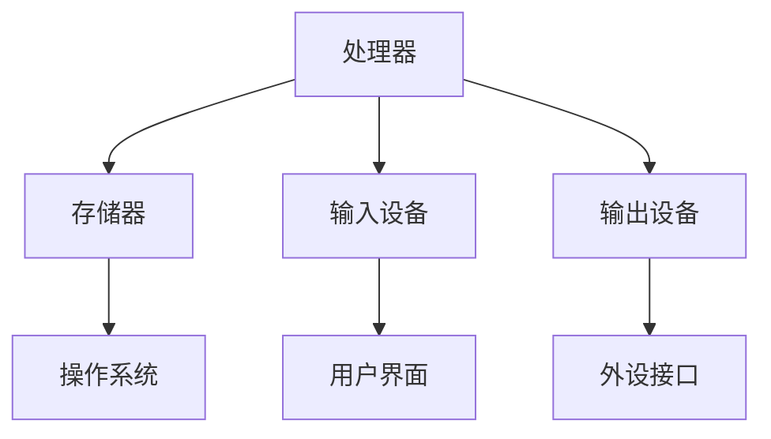

                 

关键词：单板计算机、Raspberry Pi、Arduino、开源硬件、嵌入式系统、物联网

摘要：本文将探讨单板计算机的两种重要实现方式——Raspberry Pi和Arduino，详细介绍它们的核心概念、原理、操作步骤、应用领域以及未来发展趋势。通过本文的阅读，读者将对这两种单板计算机有更深入的理解，并能够更好地应用于实际项目中。

## 1. 背景介绍

单板计算机是一种小型、低成本、易于使用的计算机，它具备完整的计算机功能，可以用于各种应用场景。随着物联网（IoT）和嵌入式系统的发展，单板计算机在智能家居、智能穿戴、机器人控制、无人机等领域得到了广泛应用。Raspberry Pi和Arduino是两种最著名的单板计算机，它们各具特色，适用于不同的应用场景。

### 1.1 Raspberry Pi

Raspberry Pi是由英国慈善基金会Raspberry Pi Foundation于2012年推出的一款单板计算机。它的目标是将计算能力带到更多人手中，促进计算机科学教育。Raspberry Pi具有高性能、低功耗、易于扩展等特点，可用于教学、开发、家庭娱乐等多种场景。

### 1.2 Arduino

Arduino是由Massimo Banzi、David Cuartielles等人于2005年创立的一款开源硬件平台，主要用于电子设备和机器人控制。Arduino具有简单易用、灵活性高、社区支持强等特点，适用于各种创意项目和实用应用。

## 2. 核心概念与联系

单板计算机的核心概念包括处理器、存储器、输入输出设备等。下面是单板计算机的基本架构及其核心概念的Mermaid流程图。



### 2.1 处理器

处理器是单板计算机的核心，负责执行程序指令、处理数据等操作。Raspberry Pi采用Broadcom公司设计的ARM处理器，而Arduino则采用AVR或PIC系列处理器。两者在性能上存在差异，但都能满足嵌入式系统的需求。

### 2.2 存储器

存储器用于存储操作系统、应用程序和数据。Raspberry Pi配备SD卡作为存储介质，而Arduino则使用内置闪存或外部存储设备。在选择存储介质时，需要考虑容量、速度和耐用性等因素。

### 2.3 输入输出设备

输入输出设备用于与用户和外部设备进行交互。Raspberry Pi提供了丰富的输入输出接口，如USB、HDMI、GPIO等，而Arduino则具备多个GPIO引脚、模拟输入输出等。这些接口可以连接各种传感器、执行器、显示屏等。

### 2.4 操作系统

Raspberry Pi和Arduino都运行在操作系统之上。Raspberry Pi通常使用Linux系统，如Raspbian或Ubuntu，而Arduino则使用Arduino IDE内置的轻量级操作系统。

## 3. 核心算法原理 & 具体操作步骤

### 3.1 算法原理概述

单板计算机的算法原理主要涉及嵌入式系统编程和物联网通信。在Raspberry Pi和Arduino平台上，常见的算法包括传感器数据处理、通信协议实现、图像识别等。

### 3.2 算法步骤详解

#### 3.2.1 传感器数据处理

传感器数据处理是嵌入式系统中的常见任务。以下是一个简单的传感器数据处理算法步骤：

1. 初始化传感器模块。
2. 读取传感器数据。
3. 对传感器数据进行滤波和预处理。
4. 根据预处理后的数据执行相应的操作。

#### 3.2.2 通信协议实现

通信协议是实现设备间通信的重要手段。以下是一个简单的TCP通信协议实现步骤：

1. 初始化网络通信模块。
2. 监听指定端口的连接请求。
3. 建立连接。
4. 收发数据。
5. 断开连接。

#### 3.2.3 图像识别

图像识别是物联网应用中的一个重要领域。以下是一个简单的图像识别算法步骤：

1. 加载图像数据。
2. 对图像进行预处理。
3. 使用卷积神经网络进行图像分类。
4. 输出识别结果。

### 3.3 算法优缺点

传感器数据处理算法的优点是简单易用，缺点是数据处理速度较慢；通信协议实现算法的优点是稳定可靠，缺点是开发难度较大；图像识别算法的优点是功能强大，缺点是计算资源消耗大。

### 3.4 算法应用领域

传感器数据处理算法广泛应用于智能家居、环境监测、健康护理等领域；通信协议实现算法广泛应用于物联网设备通信、远程控制等领域；图像识别算法广泛应用于人脸识别、安防监控、自动驾驶等领域。

## 4. 数学模型和公式 & 详细讲解 & 举例说明

### 4.1 数学模型构建

在单板计算机的应用中，常见的数学模型包括线性回归、神经网络等。以下是一个简单的线性回归模型构建过程：

1. 建立线性回归方程：\( y = wx + b \)
2. 计算损失函数：\( J(w, b) = \frac{1}{2m} \sum_{i=1}^{m} (wx_i + b - y_i)^2 \)
3. 求导数：\( \frac{\partial J}{\partial w} = \frac{1}{m} \sum_{i=1}^{m} (wx_i + b - y_i)x_i \)，\( \frac{\partial J}{\partial b} = \frac{1}{m} \sum_{i=1}^{m} (wx_i + b - y_i) \)
4. 更新参数：\( w = w - \alpha \frac{\partial J}{\partial w} \)，\( b = b - \alpha \frac{\partial J}{\partial b} \)

### 4.2 公式推导过程

以下是一个简单的神经网络前向传播和反向传播的推导过程：

1. 前向传播：
   - 输入层到隐藏层的激活函数：\( z_i = \sum_{j=1}^{n} w_{ij}x_j + b_i \)，\( a_i = \sigma(z_i) \)
   - 隐藏层到输出层的激活函数：\( z_j = \sum_{i=1}^{m} w_{ji}a_i + b_j \)，\( y_j = \sigma(z_j) \)
2. 反向传播：
   - 输出层误差计算：\( \delta_j = (y_j - t_j) \odot \sigma'(z_j) \)
   - 隐藏层误差计算：\( \delta_i = \sum_{j=1}^{k} w_{ji}\delta_j \odot \sigma'(z_i) \)
   - 参数更新：\( w_{ji} = w_{ji} - \alpha \delta_j a_i \)，\( b_j = b_j - \alpha \delta_j \)，\( b_i = b_i - \alpha \delta_i \)

### 4.3 案例分析与讲解

以下是一个使用线性回归模型进行温度预测的案例：

1. 数据准备：收集一组温度数据，包括时间戳和对应的温度值。
2. 数据预处理：对时间数据进行归一化处理。
3. 模型训练：使用线性回归模型进行训练。
4. 模型评估：使用测试集对模型进行评估，计算预测误差。
5. 模型应用：使用训练好的模型进行温度预测。

## 5. 项目实践：代码实例和详细解释说明

### 5.1 开发环境搭建

在Raspberry Pi和Arduino平台上进行开发，需要安装相应的开发环境和工具。以下是一个简单的开发环境搭建步骤：

1. Raspberry Pi：
   - 安装Raspbian操作系统。
   - 安装Python、C++等编程语言。
   - 安装Eclipse、VS Code等集成开发环境。
2. Arduino：
   - 安装Arduino IDE。
   - 连接Arduino板到计算机。
   - 安装对应的板子驱动程序。

### 5.2 源代码详细实现

以下是一个简单的使用Raspberry Pi和Arduino进行传感器数据采集和通信的项目示例：

1. Raspberry Pi：
```python
import time
import serial

# 初始化串口
ser = serial.Serial('/dev/ttyUSB0', 9600)

while True:
    # 读取传感器数据
    data = ser.readline().decode().strip()
    print(data)
    time.sleep(1)
```

2. Arduino：
```cpp
void setup() {
    // 初始化串口
    Serial.begin(9600);
}

void loop() {
    // 读取模拟传感器数据
    int sensorValue = analogRead(A0);
    // 发送数据到Raspberry Pi
    Serial.println(sensorValue);
    delay(100);
}
```

### 5.3 代码解读与分析

1. Raspberry Pi代码：
   - 使用Python编写，通过串口读取Arduino发送的数据。
   - 每隔1秒读取一次数据，并打印到控制台。

2. Arduino代码：
   - 使用C++编写，通过模拟引脚读取传感器数据。
   - 将传感器数据通过串口发送给Raspberry Pi。

### 5.4 运行结果展示

运行上述代码后，Raspberry Pi将不断接收Arduino发送的传感器数据，并在控制台打印出来。这表明Raspberry Pi和Arduino之间的通信已经成功建立。

## 6. 实际应用场景

### 6.1 智能家居

智能家居是单板计算机应用最为广泛的领域之一。通过Raspberry Pi和Arduino，用户可以实现智能灯光控制、智能门锁、智能安防等应用。以下是一个智能灯光控制系统的应用实例：

1. 使用Arduino控制继电器，实现灯光的开关。
2. 使用Raspberry Pi作为控制中心，通过Web界面远程控制灯光。
3. 结合传感器（如光敏传感器、温度传感器等），实现智能灯光调节。

### 6.2 智能穿戴

智能穿戴设备是另一个重要的应用领域。通过Raspberry Pi和Arduino，用户可以实现健康监测、运动跟踪、心率监测等功能。以下是一个健康监测系统的应用实例：

1. 使用Arduino连接传感器，如心率传感器、加速度传感器等。
2. 使用Raspberry Pi对传感器数据进行处理和分析。
3. 通过Web界面或手机APP展示健康数据。

### 6.3 机器人控制

机器人控制是单板计算机的另一个重要应用领域。通过Raspberry Pi和Arduino，用户可以实现各种机器人的控制，如无人车、无人机、机器人手臂等。以下是一个无人车的应用实例：

1. 使用Arduino控制无人车的电机驱动。
2. 使用Raspberry Pi进行路径规划和导航。
3. 通过传感器（如GPS、摄像头等）实现无人车的自主导航。

## 7. 工具和资源推荐

### 7.1 学习资源推荐

1. 《Raspberry Pi入门手册》
2. 《Arduino入门教程》
3. 《单板计算机应用实例集》

### 7.2 开发工具推荐

1. Raspberry Pi：
   - Raspbian操作系统
   - Python、C++等编程语言
   - Eclipse、VS Code等集成开发环境
2. Arduino：
   - Arduino IDE
   - C++编程语言
   - PlatformIO等开发平台

### 7.3 相关论文推荐

1. "Raspberry Pi: A Tiny Computer That Can Change the World"
2. "Arduino: A Comprehensive Overview"
3. "IoT Applications Using Single-Board Computers"

## 8. 总结：未来发展趋势与挑战

### 8.1 研究成果总结

近年来，单板计算机在性能、功耗、易用性等方面取得了显著进展。Raspberry Pi和Arduino等单板计算机在开源社区的支持下，不断发展壮大，为嵌入式系统开发提供了强大的支持。

### 8.2 未来发展趋势

未来，单板计算机将在以下几个方面继续发展：

1. 性能提升：随着硬件技术的进步，单板计算机的性能将不断提高，满足更多复杂应用的需求。
2. 能耗降低：单板计算机的能耗将继续降低，有利于其在物联网等领域的应用。
3. 开放性增强：单板计算机将更加开放，支持更多编程语言和开发工具，降低开发门槛。
4. 应用领域扩展：单板计算机将在智能家居、医疗健康、工业自动化等领域得到更广泛的应用。

### 8.3 面临的挑战

尽管单板计算机在发展中取得了显著成果，但仍面临一些挑战：

1. 安全性：随着单板计算机在关键领域的应用，确保其安全性变得尤为重要。
2. 标准化：单板计算机需要建立统一的标准，以提高兼容性和互操作性。
3. 社区支持：开源社区的支持是单板计算机发展的重要保障，需要不断吸引更多开发者加入。

### 8.4 研究展望

未来，单板计算机将继续在性能、功耗、易用性等方面取得突破，为嵌入式系统开发带来更多可能性。同时，研究人员应关注单板计算机在安全性、标准化、社区支持等方面的研究，为单板计算机的可持续发展奠定基础。

## 9. 附录：常见问题与解答

### 9.1 如何选择Raspberry Pi和Arduino？

- 如果您需要高性能、多功能的计算机，建议选择Raspberry Pi。
- 如果您需要简单易用、灵活的开源硬件平台，建议选择Arduino。

### 9.2 如何连接Raspberry Pi和Arduino？

- 使用串口通信：将Raspberry Pi和Arduino的串口连接起来，通过串口传输数据。
- 使用I2C通信：使用I2C通信协议，连接Raspberry Pi和Arduino的I2C接口。
- 使用SPI通信：使用SPI通信协议，连接Raspberry Pi和Arduino的SPI接口。

### 9.3 如何在Raspberry Pi和Arduino上编程？

- Raspberry Pi：使用Python、C++等编程语言进行编程，通过Raspberry Pi的集成开发环境进行开发。
- Arduino：使用C++编程语言进行编程，通过Arduino IDE进行开发。

## 作者署名

作者：禅与计算机程序设计艺术 / Zen and the Art of Computer Programming
----------------------------------------------------------------

以上就是本文的完整内容。希望这篇文章能够帮助读者更好地了解单板计算机的相关知识，并在实际项目中充分发挥其作用。如果您有任何疑问或建议，请随时留言讨论。感谢您的阅读！

