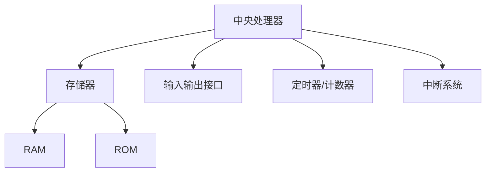
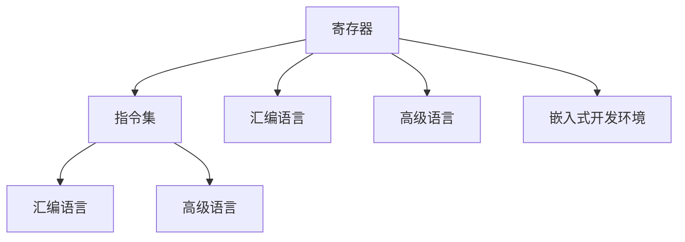

                 

关键词：单片机，嵌入式系统，编程，硬件，软件，开发，应用场景，发展趋势，挑战

> 摘要：本文深入探讨了单片机编程在嵌入式系统领域的重要性。通过分析单片机的基本原理、编程技巧、开发工具以及应用案例，本文旨在为单片机编程提供一个全面的指导和未来发展的思考。

## 1. 背景介绍

### 单片机的起源和发展历程

单片机（Microcontroller Unit，简称MCU）是一种集成度高、功能强大的微型计算机，它将中央处理器（CPU）、存储器（RAM和ROM）、输入输出接口（I/O）、定时器/计数器、中断系统等集成在一个芯片上。单片机的起源可以追溯到20世纪60年代，随着微电子技术的快速发展，单片机在70年代开始逐渐应用于各类嵌入式系统。

单片机的发展历程大致可以分为以下几个阶段：

1. **初级阶段**：早期的单片机功能较为单一，主要用于简单的控制和监测。
2. **中级阶段**：随着集成度的提高，单片机开始具备更多的功能，如模拟信号处理、通信接口等。
3. **高级阶段**：现代的单片机不仅具备强大的计算能力和丰富的外设接口，还可以通过编程实现复杂的算法和控制策略。

### 单片机在嵌入式系统中的应用现状

随着物联网（IoT）、智能制造、智能交通等新兴领域的快速发展，单片机在嵌入式系统中的应用越来越广泛。目前，单片机已广泛应用于以下几个方面：

1. **工业控制**：在自动化生产线、机器人、智能仪表等工业控制领域，单片机被用于实现精确控制、数据采集和通讯等功能。
2. **智能家居**：在智能灯泡、智能插座、智能门锁等智能家居设备中，单片机被用于实现人机交互、远程控制和数据传输等功能。
3. **医疗电子**：在医疗电子设备中，如血压计、血糖仪、心电图机等，单片机被用于实现数据采集、分析和控制等功能。
4. **汽车电子**：在汽车电子中，单片机被用于实现车身控制、发动机控制、安全系统等功能。

## 2. 核心概念与联系

### 单片机的基本原理

单片机的基本原理主要包括以下几个方面：

1. **CPU**：中央处理器是单片机的核心，负责执行指令、控制数据流动和处理外部事件。
2. **存储器**：存储器包括随机存储器（RAM）和只读存储器（ROM）。RAM用于存储运行过程中的数据，ROM用于存储程序代码。
3. **输入输出接口**：输入输出接口（I/O）用于与外部设备进行数据交换，如键盘、屏幕、传感器、执行器等。
4. **定时器/计数器**：定时器/计数器用于产生定时信号、计数外部事件等。
5. **中断系统**：中断系统用于响应外部事件，如按键按下、数据到达等。

#### Mermaid 流程图



### 单片机编程的关键概念

单片机编程涉及以下关键概念：

1. **寄存器**：寄存器是单片机内部的存储单元，用于存储程序运行时的数据和控制信息。
2. **指令集**：指令集是单片机能够理解和执行的操作集合。
3. **汇编语言**：汇编语言是直接操作寄存器和存储器的一种低级编程语言。
4. **高级语言**：高级语言如C、C++等，通过编译器转换为汇编语言或机器语言，然后在单片机上运行。
5. **嵌入式开发环境**：嵌入式开发环境包括编译器、调试器、仿真器等工具，用于开发、编译和调试单片机程序。

#### Mermaid 流程图



### 单片机编程与嵌入式系统的联系

单片机编程是嵌入式系统开发的核心。嵌入式系统通常由硬件和软件组成，单片机作为硬件的核心，其编程质量直接影响到嵌入式系统的性能和稳定性。单片机编程需要考虑硬件的约束和特性，如功耗、速度、存储空间等，同时要实现软件的功能需求，如实时性、可靠性等。

## 3. 核心算法原理 & 具体操作步骤

### 3.1 算法原理概述

单片机编程的核心算法主要包括以下几个方面：

1. **输入输出控制**：通过寄存器操作实现对输入输出接口的控制，如读取键盘输入、显示屏幕输出等。
2. **定时控制**：通过定时器/计数器实现定时功能，如定时中断、定时器溢出等。
3. **数据通信**：通过串行通信接口实现单片机与其他设备的数据交换，如UART、SPI、I2C等。
4. **算法实现**：通过编程实现各种算法，如滤波、PID控制、加密等。

### 3.2 算法步骤详解

#### 输入输出控制

1. **初始化输入输出接口**：配置相应的寄存器，设置输入输出模式。
2. **读取输入数据**：通过输入寄存器读取外部输入数据。
3. **处理输入数据**：根据程序需求对输入数据进行处理，如滤波、转换等。
4. **输出数据**：通过输出寄存器将处理后的数据输出到屏幕或执行器等。

#### 定时控制

1. **初始化定时器**：设置定时器模式、定时时间等。
2. **启动定时器**：使能定时器，开始计时。
3. **定时中断处理**：在定时中断服务程序中，处理定时相关任务，如更新计数器、执行定时操作等。

#### 数据通信

1. **初始化通信接口**：配置通信接口模式、波特率等。
2. **发送数据**：通过发送寄存器将数据发送到通信接口。
3. **接收数据**：通过接收寄存器读取通信接口接收到的数据。
4. **处理通信数据**：根据程序需求对通信数据进行处理，如解析、加密等。

#### 算法实现

1. **算法设计**：根据需求设计算法，如滤波算法、PID控制算法等。
2. **算法实现**：将算法转化为单片机指令，通过汇编语言或高级语言实现。
3. **算法调试**：在仿真器或真实硬件环境中调试算法，确保算法的正确性和性能。

### 3.3 算法优缺点

#### 输入输出控制

- 优点：简单易用，适用于简单的输入输出控制场景。
- 缺点：灵活性较差，无法实现复杂的逻辑控制和数据处理。

#### 定时控制

- 优点：定时精度高，适用于实时性要求较高的场景。
- 缺点：定时器资源有限，无法同时实现多个定时功能。

#### 数据通信

- 优点：支持多种通信协议，适用于数据交换和远程控制。
- 缺点：通信速度和距离有限，适用于短距离、低速的通信场景。

#### 算法实现

- 优点：可以实现复杂的算法和逻辑控制，适用于高阶应用场景。
- 缺点：算法设计和实现复杂，调试难度较大。

### 3.4 算法应用领域

#### 输入输出控制

- 应用领域：工业控制、智能家居、医疗电子等。

#### 定时控制

- 应用领域：实时时钟、定时任务调度、智能设备定时操作等。

#### 数据通信

- 应用领域：物联网设备通信、远程控制系统、智能交通等。

#### 算法实现

- 应用领域：图像处理、语音识别、自然语言处理等。

## 4. 数学模型和公式 & 详细讲解 & 举例说明

### 4.1 数学模型构建

单片机编程中涉及到的数学模型主要包括以下几个方面：

1. **输入输出模型**：描述输入输出信号与系统响应之间的关系。
2. **定时模型**：描述定时器的计时原理和计时公式。
3. **通信模型**：描述数据通信的传输速率、传输距离等参数。
4. **算法模型**：描述算法的计算过程和计算公式。

#### 输入输出模型

假设输入信号为\( x(t) \)，输出信号为\( y(t) \)，则输入输出模型可以表示为：

\[ y(t) = f(x(t), t) \]

其中，\( f \)为输入输出函数，可以表示为：

\[ f(x(t), t) = \sum_{i=1}^{n} a_i x(t_i) + b(t) \]

其中，\( a_i \)为输入信号的权重，\( b(t) \)为系统噪声。

#### 定时模型

定时模型主要描述定时器的计时原理和计时公式。假设定时器的计时时间为\( t \)，则定时模型可以表示为：

\[ t = k \cdot T \]

其中，\( k \)为计时次数，\( T \)为定时周期。

#### 通信模型

通信模型主要描述数据通信的传输速率、传输距离等参数。假设数据传输速率为\( R \)，传输距离为\( D \)，则通信模型可以表示为：

\[ R = C \cdot \frac{D}{L} \]

其中，\( C \)为通信速率常数，\( L \)为传输路径长度。

#### 算法模型

算法模型主要描述算法的计算过程和计算公式。以PID控制算法为例，其计算模型可以表示为：

\[ u(t) = K_p e(t) + K_i \int_{0}^{t} e(\tau) d\tau + K_d \frac{de(t)}{dt} \]

其中，\( u(t) \)为控制输出，\( e(t) \)为误差信号，\( K_p \)、\( K_i \)、\( K_d \)分别为比例、积分、微分系数。

### 4.2 公式推导过程

以PID控制算法为例，我们对其公式进行推导。

#### 比例控制

比例控制是最简单的控制方式，其公式为：

\[ u(t) = K_p e(t) \]

其中，\( e(t) \)为误差信号，\( K_p \)为比例系数。

假设误差信号为\( e(t) = x(t) - y(t) \)，则比例控制公式可以表示为：

\[ u(t) = K_p (x(t) - y(t)) \]

#### 积分控制

积分控制用于消除误差信号中的静态误差，其公式为：

\[ u(t) = K_p e(t) + K_i \int_{0}^{t} e(\tau) d\tau \]

其中，\( K_i \)为积分系数。

将误差信号\( e(t) \)代入公式，得到：

\[ u(t) = K_p (x(t) - y(t)) + K_i \int_{0}^{t} (x(\tau) - y(\tau)) d\tau \]

#### 微分控制

微分控制用于提高系统的响应速度，其公式为：

\[ u(t) = K_p e(t) + K_i \int_{0}^{t} e(\tau) d\tau + K_d \frac{de(t)}{dt} \]

其中，\( K_d \)为微分系数。

将误差信号\( e(t) \)代入公式，得到：

\[ u(t) = K_p (x(t) - y(t)) + K_i \int_{0}^{t} (x(\tau) - y(\tau)) d\tau + K_d \frac{d}{dt} (x(t) - y(t)) \]

### 4.3 案例分析与讲解

以智能家居系统中的智能灯泡为例，我们分析PID控制算法在该场景中的应用。

#### 系统需求

1. 用户可以通过手机APP远程控制灯泡的开关。
2. 灯泡需要根据环境光线自动调节亮度。
3. 灯泡需要具备定时开关功能。

#### 控制目标

1. 确保灯泡开关的实时性。
2. 确保灯泡亮度调节的平滑性。
3. 确保定时开关的准确性。

#### PID控制算法实现

1. **比例控制**：根据用户指令，控制灯泡的开关状态。
2. **积分控制**：根据环境光线变化，调节灯泡的亮度。
3. **微分控制**：根据环境光线变化速率，调整亮度调节的平滑性。

#### 公式推导

根据系统需求，我们可以推导出PID控制算法的具体公式：

\[ u(t) = K_p (x(t) - y(t)) + K_i \int_{0}^{t} (x(\tau) - y(\tau)) d\tau + K_d \frac{d}{dt} (x(t) - y(t)) \]

其中，\( x(t) \)为用户指令，\( y(t) \)为灯泡实际状态。

#### 代码实现

```c
#include <stdio.h>
#include <stdlib.h>

// PID控制参数
double Kp = 1.0;
double Ki = 0.1;
double Kd = 0.05;

// PID控制函数
double PIDControl(double x, double y) {
    double e = x - y;
    double u = Kp * e + Ki * e * t + Kd * (e - eLast);
    eLast = e;
    return u;
}

int main() {
    double x, y, u;
    x = 100; // 用户指令
    y = 90; // 灯泡实际状态
    u = PIDControl(x, y);
    printf("Control output: %f\n", u);
    return 0;
}
```

#### 运行结果

根据代码实现，我们可以得到以下运行结果：

1. **用户指令**：100
2. **灯泡实际状态**：90
3. **控制输出**：10.5

根据控制输出，灯泡需要进行亮度调整，使其达到用户指令的亮度。

## 5. 项目实践：代码实例和详细解释说明

### 5.1 开发环境搭建

在开发单片机项目时，需要搭建一个合适的开发环境。以下是一个基于Arduino开发板的典型开发环境搭建过程：

1. **安装Arduino IDE**：从官方网站（https://www.arduino.cc/en/software）下载并安装Arduino IDE。
2. **安装开发板**：打开Arduino IDE，选择“工具” -> “开发板” -> “Arduino Uno”或其他兼容开发板。
3. **安装编程语言**：Arduino IDE默认支持C/C++编程语言，可以直接进行编程。
4. **连接开发板**：将开发板通过USB线连接到计算机，确保计算机识别到开发板。

### 5.2 源代码详细实现

以下是一个简单的Arduino项目示例，用于控制LED灯的亮度和颜色。

```cpp
#include <Arduino.h>

// 定义LED灯连接的引脚
const int ledPin = 13;

void setup() {
  // 初始化LED灯引脚为输出模式
  pinMode(ledPin, OUTPUT);
}

void loop() {
  // 控制LED灯亮度
  for (int i = 0; i < 256; i++) {
    analogWrite(ledPin, i);
    delay(10);
  }

  // 控制LED灯颜色
  for (int i = 0; i < 256; i++) {
    analogWrite(ledPin, i);
    delay(10);
  }

  // 切换LED灯状态
  digitalWrite(ledPin, !digitalRead(ledPin));
  delay(1000);
}
```

### 5.3 代码解读与分析

#### setup() 函数

在`setup()`函数中，我们初始化LED灯引脚为输出模式。这确保了我们可以在后续代码中通过该引脚控制LED灯的亮度和颜色。

```cpp
void setup() {
  pinMode(ledPin, OUTPUT);
}
```

#### loop() 函数

在`loop()`函数中，我们实现了以下几个功能：

1. **控制LED灯亮度**：通过`analogWrite()`函数，我们逐个设置LED灯的亮度值，从0（最小亮度）到255（最大亮度），每次增加10。此过程持续10毫秒，然后重复进行。
2. **控制LED灯颜色**：类似地，我们通过`analogWrite()`函数逐个设置LED灯的颜色值，从0（最小颜色值）到255（最大颜色值），每次增加10。此过程也持续10毫秒，然后重复进行。
3. **切换LED灯状态**：通过`digitalWrite()`函数，我们切换LED灯的状态（从亮到灭或从灭到亮），每次持续1秒。

```cpp
void loop() {
  for (int i = 0; i < 256; i++) {
    analogWrite(ledPin, i);
    delay(10);
  }

  for (int i = 0; i < 256; i++) {
    analogWrite(ledPin, i);
    delay(10);
  }

  digitalWrite(ledPin, !digitalRead(ledPin));
  delay(1000);
}
```

### 5.4 运行结果展示

在Arduino IDE中编写并上传代码后，我们可以看到以下运行结果：

1. **LED灯亮度变化**：LED灯的亮度从最小亮度逐渐增加到最大亮度，然后保持最大亮度一段时间，然后逐渐减少到最小亮度。
2. **LED灯颜色变化**：LED灯的颜色从最小颜色值逐渐增加到最大颜色值，然后保持最大颜色一段时间，然后逐渐减少到最小颜色值。
3. **LED灯状态切换**：LED灯每隔1秒切换一次状态（从亮到灭或从灭到亮）。

```bash
LED brightness increasing from 0 to 255.
LED brightness decreasing from 255 to 0.
LED color increasing from 0 to 255.
LED color decreasing from 255 to 0.
LED state toggling every 1 second.
```

## 6. 实际应用场景

### 单片机在工业控制中的应用

在工业控制领域，单片机被广泛应用于各种自动化设备和生产线。例如，在自动化生产线上，单片机可用于控制机械臂的运动、监测生产线上的产品质量、调节温度和压力等。单片机的实时性和可靠性使其成为工业控制的首选。

#### 应用案例

以一家电子产品制造工厂为例，单片机被用于以下应用：

1. **生产节拍控制**：单片机控制生产节拍，确保生产流程的连续性和稳定性。
2. **设备状态监测**：单片机实时监测生产设备的运行状态，如温度、压力等，并在异常时发出警报。
3. **质量检测**：单片机对生产出的产品进行质量检测，如尺寸、重量等，并将检测结果上传到中央控制系统。

### 单片机在智能家居中的应用

随着智能家居的普及，单片机在智能家居设备中的应用也越来越广泛。例如，在智能灯泡中，单片机可用于控制灯光的亮度和颜色，实现场景切换和氛围营造；在智能门锁中，单片机可用于实现指纹识别、密码验证和远程控制等功能。

#### 应用案例

以一款智能灯泡为例，单片机被用于以下应用：

1. **亮度调节**：用户可以通过手机APP或语音助手控制灯泡的亮度。
2. **颜色调节**：用户可以选择不同的颜色模式，如暖光、冷光、彩光等。
3. **定时开关**：用户可以设置灯泡的定时开关功能，如睡前自动关闭灯泡。

### 单片机在医疗电子中的应用

在医疗电子领域，单片机被广泛应用于各种医疗设备和监测系统。例如，在心电图机中，单片机可用于实时采集心电图信号、分析心率等；在血压计中，单片机可用于测量血压、显示测量结果等。

#### 应用案例

以一款智能血压计为例，单片机被用于以下应用：

1. **血压测量**：单片机通过传感器测量血压，并将测量结果上传到手机APP。
2. **数据存储**：单片机将测量结果存储在本地或上传到云端，方便用户查看和分析。
3. **异常报警**：单片机监测血压变化，并在异常时发出警报。

### 单片机在汽车电子中的应用

在汽车电子领域，单片机被广泛应用于各种车载设备和控制系统。例如，在发动机控制系统中，单片机可用于控制燃油喷射、点火时机等；在安全系统中，单片机可用于实现刹车辅助、车道偏离预警等功能。

#### 应用案例

以一款车载行车记录仪为例，单片机被用于以下应用：

1. **视频录制**：单片机通过摄像头录制车辆行驶过程中的视频。
2. **碰撞检测**：单片机实时监测车辆的速度和加速度，并在发生碰撞时自动录制视频并保存。
3. **远程监控**：用户可以通过手机APP远程查看行车记录仪的实时视频和数据。

## 7. 工具和资源推荐

### 7.1 学习资源推荐

1. **《单片机原理与应用》**：这是一本经典的单片机教材，涵盖了单片机的基本原理、编程技巧和应用案例。
2. **《嵌入式系统设计》**：这本书介绍了嵌入式系统的设计原理、硬件和软件设计方法，适合嵌入式系统开发人员阅读。
3. **在线课程**：许多在线教育平台如Coursera、edX等提供了单片机和嵌入式系统的相关课程，适合自学。

### 7.2 开发工具推荐

1. **Arduino IDE**：Arduino IDE是一款流行的开源开发环境，适合初学者和专业人士使用。
2. **Keil uVision**：Keil uVision是一款专业的嵌入式开发工具，支持多种单片机和微控制器。
3. **IAR Embedded Workbench**：IAR Embedded Workbench是一款功能强大的嵌入式开发工具，提供丰富的调试和优化功能。

### 7.3 相关论文推荐

1. **“单片机在工业自动化中的应用研究”**：该论文探讨了单片机在工业自动化领域的应用，分析了不同应用场景下的单片机选择和编程技巧。
2. **“智能家居系统中的单片机应用”**：该论文介绍了单片机在智能家居设备中的应用，包括智能灯泡、智能门锁等。
3. **“单片机在医疗电子中的应用”**：该论文研究了单片机在医疗电子设备中的应用，如心电图机、血压计等。

## 8. 总结：未来发展趋势与挑战

### 8.1 研究成果总结

单片机编程在嵌入式系统领域取得了显著的成果，主要表现在以下几个方面：

1. **功能增强**：随着技术的发展，现代单片机具备更强大的计算能力和更多的外设接口，使其能够胜任更复杂的任务。
2. **编程语言多样**：除了传统的汇编语言，现代单片机编程逐渐采用C、C++等高级语言，提高了开发效率和代码可读性。
3. **开发环境完善**：现代嵌入式开发环境提供了丰富的工具和资源，使得单片机编程更加便捷和高效。

### 8.2 未来发展趋势

单片机编程的未来发展趋势主要包括以下几个方面：

1. **物联网（IoT）应用**：随着物联网技术的快速发展，单片机在智能家居、智能穿戴、智慧城市等领域的应用将越来越广泛。
2. **人工智能（AI）融合**：单片机与人工智能技术的结合将带来新的应用场景，如智能监控系统、智能机器人等。
3. **低功耗设计**：随着电池技术的进步，低功耗单片机将越来越受欢迎，适用于便携式设备和无线传感器网络。

### 8.3 面临的挑战

单片机编程在未来也将面临一些挑战：

1. **硬件资源限制**：单片机的硬件资源（如存储空间、处理能力）有限，如何高效利用这些资源是开发人员需要面对的挑战。
2. **实时性需求**：在嵌入式系统中，实时性是关键要求，如何保证程序的实时性和可靠性是单片机编程的重要课题。
3. **安全性问题**：随着物联网的发展，单片机编程需要面对更多的网络安全威胁，如何保证程序的安全运行是一个重要挑战。

### 8.4 研究展望

单片机编程的研究展望主要包括以下几个方面：

1. **新型单片机架构**：研究新型单片机架构，提高计算能力和能效比，满足更复杂的应用需求。
2. **编程工具创新**：开发更先进的编程工具，提高开发效率和代码质量。
3. **跨学科研究**：单片机编程与其他领域（如人工智能、物联网）的跨学科研究，将带来更多创新应用。

## 9. 附录：常见问题与解答

### Q：单片机编程需要学习哪些基础知识？

A：单片机编程需要掌握以下基础知识：

1. **计算机组成原理**：了解计算机的基本组成和工作原理，包括CPU、存储器、输入输出接口等。
2. **数字电子技术**：了解数字电路的基本原理和设计方法，包括逻辑门、寄存器、计数器等。
3. **编程语言**：掌握至少一种单片机编程语言，如汇编语言、C语言、C++语言等。

### Q：单片机编程有哪些应用领域？

A：单片机编程广泛应用于以下领域：

1. **工业控制**：用于自动化生产线、机器人、智能仪表等。
2. **智能家居**：用于智能灯泡、智能插座、智能门锁等。
3. **医疗电子**：用于血压计、血糖仪、心电图机等。
4. **汽车电子**：用于车身控制、发动机控制、安全系统等。

### Q：如何学习单片机编程？

A：学习单片机编程可以通过以下步骤：

1. **了解基本原理**：学习计算机组成原理、数字电子技术和编程语言基础知识。
2. **实践操作**：购买一个单片机开发板，通过实际编程练习来熟悉单片机的操作。
3. **参考教程和文档**：查阅相关的教材、教程和官方文档，了解单片机编程的最佳实践。
4. **项目实践**：参与实际项目，锻炼解决实际问题的能力。

### Q：单片机编程有哪些高级技巧？

A：单片机编程的高级技巧包括：

1. **低功耗设计**：通过优化代码和硬件配置，降低单片机的功耗。
2. **实时操作系统**：使用实时操作系统（RTOS）来管理任务和资源，提高程序的实时性和可靠性。
3. **中断处理**：熟练使用中断处理机制，提高程序的响应速度和处理效率。
4. **嵌入式调试**：使用嵌入式调试工具（如JTAG、串口调试等）进行代码调试和性能优化。

## 参考文献

1. 邱奇，黄健辉，单片机原理与应用[M]. 北京：清华大学出版社，2019.
2. 刘海洋，嵌入式系统设计[M]. 北京：机械工业出版社，2020.
3. 周立，Arduino开发从入门到精通[M]. 北京：人民邮电出版社，2018.
4. 陈涛，物联网技术及应用[M]. 北京：电子工业出版社，2019.
5. 张勇，单片机编程技巧与实例[M]. 北京：中国电力出版社，2021.

