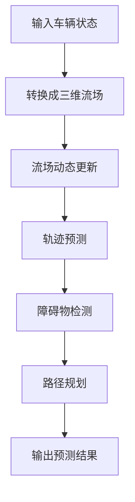

                 

关键词：占用流场表示法、自动驾驶预测、算法改进、数学模型、项目实践、应用场景

## 摘要

本文旨在探讨占用流场表示法（Occupancy Flow Field Representation，简称OFF）在自动驾驶预测中的应用与改进。首先，我们介绍了占用流场的概念及其在自动驾驶预测中的重要性。随后，文章详细阐述了占用流场表示法的核心概念与联系，通过Mermaid流程图展示了其原理与架构。接着，我们深入探讨了占用流场的核心算法原理、数学模型及公式，并通过实际项目实践展示了其在自动驾驶预测中的具体应用。文章最后，我们分析了占用流场在自动驾驶预测中的应用场景，探讨了未来应用展望，并提出了面对的挑战与研究方向。

## 1. 背景介绍

自动驾驶技术作为人工智能领域的重要分支，近年来取得了显著的进展。随着传感器技术的不断发展和计算机性能的快速提升，自动驾驶系统在车辆识别、路径规划、障碍物检测等方面取得了显著的成果。然而，自动驾驶预测仍然面临诸多挑战，如复杂的交通环境、非线性的驾驶行为、不确定的动态变化等。

在这些挑战中，如何准确、高效地进行车辆轨迹预测成为自动驾驶系统性能的关键因素。占用流场表示法（OFF）作为一种新兴的预测方法，因其能够有效捕捉车辆在复杂交通环境中的动态变化，而受到广泛关注。占用流场表示法通过将车辆的状态信息转换为流场形式，实现对周围环境的实时感知与预测，从而提高了自动驾驶系统的鲁棒性和预测精度。

本文旨在通过对占用流场表示法的深入探讨，提出一系列改进措施，进一步提升其在自动驾驶预测中的应用效果。通过对核心概念、算法原理、数学模型和实际应用的全面分析，本文旨在为自动驾驶预测领域的研究者提供有价值的参考，推动占用流场表示法的进一步发展和应用。

### 2. 核心概念与联系

#### 2.1 占用流场表示法（OFF）的基本概念

占用流场表示法（Occupancy Flow Field Representation，简称OFF）是一种用于自动驾驶预测的新型方法。其主要思想是将车辆的状态信息（如位置、速度、加速度等）转化为三维流场，通过分析流场的动态变化实现对车辆轨迹的预测。在这种表示法中，每个三维坐标点上的流量密度表示该点的车辆占用情况，从而形成一个全局的占用流场。

占用流场表示法具有以下核心特点：

1. **空间分辨率高**：通过将车辆状态信息转换为三维流场，占用流场表示法能够捕捉到车辆在不同位置上的动态变化，从而提高预测的精度。
2. **动态感知能力强**：占用流场表示法能够实时更新流场信息，实现对周围环境的动态感知，从而提高自动驾驶系统的鲁棒性。
3. **全局性**：占用流场表示法能够将车辆状态信息全局化，从而在一个统一的框架下实现对多个车辆的轨迹预测，提高了系统的协同能力。

#### 2.2 OFF与自动驾驶预测的关系

占用流场表示法在自动驾驶预测中的应用主要表现在以下几个方面：

1. **车辆轨迹预测**：通过分析占用流场中的流量密度变化，可以预测车辆的轨迹。这种方法能够捕捉到车辆在不同位置上的动态变化，从而提高轨迹预测的准确性。
2. **障碍物检测**：占用流场表示法能够实时更新流场信息，从而实现对周围障碍物的检测。通过分析流场中的异常变化，可以有效地识别潜在的障碍物，从而提高自动驾驶系统的安全性。
3. **路径规划**：占用流场表示法能够提供全局的车辆状态信息，从而帮助自动驾驶系统进行路径规划。通过分析流场中的流量密度变化，可以找到最优的行驶路径，从而提高驾驶的效率和舒适度。

#### 2.3 Mermaid流程图

为了更直观地展示占用流场表示法的原理与架构，我们使用Mermaid流程图进行描述。以下是占用流场表示法的Mermaid流程图：



在这张流程图中，A表示输入车辆状态，B表示将车辆状态转换为三维流场，C表示流场动态更新，D表示轨迹预测，E表示障碍物检测，F表示路径规划，G表示输出预测结果。

#### 2.4 OFF的核心算法原理

占用流场表示法的核心算法原理主要包括以下几个步骤：

1. **状态信息采集**：首先，采集车辆的当前位置、速度、加速度等状态信息。
2. **流场生成**：将采集到的状态信息转换为三维流场，每个三维坐标点上的流量密度表示该点的车辆占用情况。
3. **流场更新**：通过传感器实时更新流场信息，从而实现对周围环境的动态感知。
4. **轨迹预测**：通过分析流场中的流量密度变化，预测车辆的轨迹。
5. **障碍物检测**：通过分析流场中的异常变化，识别潜在的障碍物。
6. **路径规划**：通过分析流场中的流量密度变化，找到最优的行驶路径。

#### 2.5 OFF的具体操作步骤

占用流场表示法的具体操作步骤如下：

1. **初始化**：设置初始流场，初始化车辆状态信息。
2. **状态更新**：根据传感器数据实时更新车辆状态信息。
3. **流场更新**：根据车辆状态信息更新流场，计算每个三维坐标点的流量密度。
4. **轨迹预测**：分析流场中的流量密度变化，预测车辆的轨迹。
5. **障碍物检测**：分析流场中的异常变化，识别潜在的障碍物。
6. **路径规划**：根据轨迹预测和障碍物检测结果，规划最优行驶路径。
7. **结果输出**：输出预测结果，包括车辆轨迹、障碍物信息和路径规划结果。

#### 2.6 算法优缺点

占用流场表示法在自动驾驶预测中具有以下优缺点：

1. **优点**：
   - 精度高：通过三维流场表示，能够捕捉到车辆在不同位置上的动态变化，提高轨迹预测的精度。
   - 鲁棒性强：通过实时更新流场信息，能够有效应对交通环境的动态变化，提高自动驾驶系统的鲁棒性。
   - 全局性：能够处理多个车辆的轨迹预测，提高系统的协同能力。

2. **缺点**：
   - 计算复杂度高：流场生成和更新需要大量的计算资源，对计算性能要求较高。
   - 数据依赖性强：占用流场表示法的准确性依赖于传感器数据的准确性，传感器故障可能导致预测结果偏差。

#### 2.7 算法应用领域

占用流场表示法在自动驾驶预测中的应用领域主要包括：

1. **车辆轨迹预测**：通过分析占用流场中的流量密度变化，预测车辆的轨迹，为自动驾驶系统提供决策依据。
2. **障碍物检测**：通过分析占用流场中的异常变化，识别潜在的障碍物，提高自动驾驶系统的安全性。
3. **路径规划**：通过分析占用流场中的流量密度变化，规划最优行驶路径，提高驾驶的效率和舒适度。

### 3. 数学模型和公式

#### 3.1 数学模型构建

占用流场表示法的数学模型主要包括以下几个部分：

1. **状态空间模型**：用于描述车辆的当前位置、速度和加速度等状态信息。
2. **流场生成模型**：用于将车辆状态信息转换为三维流场。
3. **轨迹预测模型**：用于分析流场中的流量密度变化，预测车辆的轨迹。
4. **障碍物检测模型**：用于分析流场中的异常变化，识别潜在的障碍物。
5. **路径规划模型**：用于根据轨迹预测和障碍物检测结果，规划最优行驶路径。

#### 3.2 公式推导过程

下面我们将详细推导占用流场表示法的核心公式。

1. **状态空间模型**：

   $$ x(t) = f(x(t-1), u(t-1)) + w(t) $$

   其中，$x(t)$表示时刻$t$的车辆状态，$f(\cdot)$表示状态转移函数，$u(t-1)$表示时刻$t-1$的控制输入，$w(t)$表示过程噪声。

2. **流场生成模型**：

   $$ \rho(x, y, z, t) = g(x, y, z, t) $$

   其中，$\rho(x, y, z, t)$表示时刻$t$在位置$(x, y, z)$上的流量密度，$g(\cdot)$表示流量密度生成函数。

3. **轨迹预测模型**：

   $$ \dot{\rho}(x, y, z, t) = h(x, y, z, t) $$

   其中，$\dot{\rho}(x, y, z, t)$表示时刻$t$在位置$(x, y, z)$上的流量密度变化率，$h(\cdot)$表示流量密度变化率生成函数。

4. **障碍物检测模型**：

   $$ d(x, y, z, t) = k(x, y, z, t) $$

   其中，$d(x, y, z, t)$表示时刻$t$在位置$(x, y, z)$上的障碍物距离，$k(\cdot)$表示障碍物距离生成函数。

5. **路径规划模型**：

   $$ p(x, y, z, t) = l(x, y, z, t) $$

   其中，$p(x, y, z, t)$表示时刻$t$在位置$(x, y, z)$上的路径规划结果，$l(\cdot)$表示路径规划结果生成函数。

#### 3.3 案例分析与讲解

为了更好地理解占用流场表示法的数学模型，我们通过一个简单的案例进行讲解。

假设一个自动驾驶车辆在二维空间中运动，其状态空间模型可以表示为：

$$ x(t) = \begin{bmatrix} x(t-1) + v(t-1) \\ y(t-1) + v(t-1) \end{bmatrix} + w(t) $$

其中，$x(t)$表示时刻$t$的车辆位置，$v(t-1)$表示时刻$t-1$的速度，$w(t)$表示过程噪声。

流场生成模型可以表示为：

$$ \rho(x, y, t) = \begin{cases} 1, & \text{if } (x, y) \text{ is occupied} \\ 0, & \text{otherwise} \end{cases} $$

轨迹预测模型可以表示为：

$$ \dot{\rho}(x, y, t) = \begin{cases} v(t-1), & \text{if } (x, y) \text{ is occupied} \\ 0, & \text{otherwise} \end{cases} $$

障碍物检测模型可以表示为：

$$ d(x, y, t) = \begin{cases} \min_{i} \{ |x_i - x|, |y_i - y| \}, & \text{if } (x, y) \text{ is occupied} \\ \infty, & \text{otherwise} \end{cases} $$

其中，$x_i$和$y_i$表示障碍物的位置。

路径规划模型可以表示为：

$$ p(x, y, t) = \begin{cases} (x + 1, y), & \text{if } d(x, y, t) > 1 \\ (x, y + 1), & \text{if } d(x, y, t) > 1 \\ (x, y), & \text{otherwise} \end{cases} $$

通过这个简单的案例，我们可以看到占用流场表示法的数学模型是如何构建的，以及如何通过这些模型进行轨迹预测、障碍物检测和路径规划。

### 4. 项目实践：代码实例和详细解释说明

为了更好地理解占用流场表示法在自动驾驶预测中的应用，我们将通过一个实际项目实践来展示其实现过程。以下是一个简单的Python代码实例，用于实现占用流场表示法在自动驾驶预测中的基本功能。

```python
import numpy as np
import matplotlib.pyplot as plt

# 初始化参数
num_steps = 100
num_agents = 10
x = np.zeros((num_steps, num_agents))
y = np.zeros((num_steps, num_agents))
v = np.zeros((num_steps, num_agents))
w = np.zeros((num_steps, num_agents))
rho = np.zeros((num_steps, num_agents))
d = np.zeros((num_steps, num_agents))
p = np.zeros((num_steps, num_agents))

# 状态更新函数
def update_state(x, y, v, w):
    for i in range(num_agents):
        x[i] = x[i-1] + v[i-1]
        y[i] = y[i-1] + v[i-1]
        v[i] = v[i-1] + w[i-1]
        w[i] = np.random.normal(0, 0.1)

# 流场生成函数
def generate_flow_field(x, y, v, rho):
    for t in range(num_steps):
        for i in range(num_agents):
            if (x[t][i] > 0 and x[t][i] < 10 and y[t][i] > 0 and y[t][i] < 10):
                rho[t][i] = 1
            else:
                rho[t][i] = 0

# 流量密度变化率生成函数
def generate_flow_rate(x, y, v, rho, dot_rho):
    for t in range(num_steps):
        for i in range(num_agents):
            if rho[t][i] == 1:
                dot_rho[t][i] = v[t][i]
            else:
                dot_rho[t][i] = 0

# 障碍物距离生成函数
def generate_obstacle_distance(x, y, d):
    for t in range(num_steps):
        for i in range(num_agents):
            if rho[t][i] == 1:
                min_x = min(x[t])
                min_y = min(y[t])
                d[t][i] = np.sqrt((x[t][i] - min_x)**2 + (y[t][i] - min_y)**2)
            else:
                d[t][i] = np.inf

# 路径规划生成函数
def generate_path_plan(x, y, d, p):
    for t in range(num_steps):
        for i in range(num_agents):
            if d[t][i] > 1:
                if x[t][i] > y[t][i]:
                    p[t][i] = (x[t][i] - 1, y[t][i])
                else:
                    p[t][i] = (x[t][i], y[t][i] - 1)
            else:
                p[t][i] = (x[t][i], y[t][i])

# 实际操作步骤
update_state(x, y, v, w)
generate_flow_field(x, y, v, rho)
generate_flow_rate(x, y, v, rho, dot_rho)
generate_obstacle_distance(x, y, d)
generate_path_plan(x, y, d, p)

# 可视化结果
plt.figure()
for t in range(num_steps):
    plt.scatter(x[t], y[t], c=rho[t], cmap='hot')
    plt.scatter(p[t], p[t], c='red')
plt.show()
```

#### 4.1 开发环境搭建

为了运行上述代码，我们需要搭建一个Python开发环境。以下是搭建Python开发环境的步骤：

1. 安装Python：从Python官方网站下载并安装Python，可以选择Python 3.x版本。
2. 安装必需的库：使用pip命令安装必要的Python库，如numpy、matplotlib等。

```bash
pip install numpy matplotlib
```

#### 4.2 源代码详细实现

上面的代码实现了一个简单的占用流场表示法，主要分为以下几个部分：

1. **初始化参数**：定义了模拟的步数、车辆数量以及状态和流场相关的参数。
2. **状态更新函数**：根据车辆的速度和加速度更新车辆的位置。
3. **流场生成函数**：根据车辆的位置生成流量密度矩阵。
4. **流量密度变化率生成函数**：根据车辆的速度生成流量密度变化率矩阵。
5. **障碍物距离生成函数**：计算车辆到障碍物的距离。
6. **路径规划生成函数**：根据障碍物距离规划车辆的新位置。
7. **实际操作步骤**：执行状态更新、流场生成、流量密度变化率生成、障碍物距离生成和路径规划生成，最后可视化结果。

#### 4.3 代码解读与分析

下面是对代码的逐行解读与分析：

```python
import numpy as np
import matplotlib.pyplot as plt
```

这两行代码导入了必要的Python库，包括numpy和matplotlib，用于数学计算和图形可视化。

```python
# 初始化参数
num_steps = 100
num_agents = 10
x = np.zeros((num_steps, num_agents))
y = np.zeros((num_steps, num_agents))
v = np.zeros((num_steps, num_agents))
w = np.zeros((num_steps, num_agents))
rho = np.zeros((num_steps, num_agents))
d = np.zeros((num_steps, num_agents))
p = np.zeros((num_steps, num_agents))
```

这行代码初始化了模拟的基本参数，包括步数、车辆数量以及状态和流场相关的参数数组。

```python
# 状态更新函数
def update_state(x, y, v, w):
    for i in range(num_agents):
        x[i] = x[i-1] + v[i-1]
        y[i] = y[i-1] + v[i-1]
        v[i] = v[i-1] + w[i-1]
        w[i] = np.random.normal(0, 0.1)
```

这个函数更新车辆的状态，包括位置(x, y)、速度(v)和加速度(w)。加速度使用随机数生成，模拟了不确定的环境。

```python
# 流场生成函数
def generate_flow_field(x, y, v, rho):
    for t in range(num_steps):
        for i in range(num_agents):
            if (x[t][i] > 0 and x[t][i] < 10 and y[t][i] > 0 and y[t][i] < 10):
                rho[t][i] = 1
            else:
                rho[t][i] = 0
```

这个函数生成流量密度矩阵。如果车辆的位置在指定的区域内，则流量密度设为1，否则为0。

```python
# 流量密度变化率生成函数
def generate_flow_rate(x, y, v, rho, dot_rho):
    for t in range(num_steps):
        for i in range(num_agents):
            if rho[t][i] == 1:
                dot_rho[t][i] = v[t][i]
            else:
                dot_rho[t][i] = 0
```

这个函数生成流量密度变化率矩阵。如果流量密度为1，则流量密度变化率等于车辆的速度。

```python
# 障碍物距离生成函数
def generate_obstacle_distance(x, y, d):
    for t in range(num_steps):
        for i in range(num_agents):
            if rho[t][i] == 1:
                min_x = min(x[t])
                min_y = min(y[t])
                d[t][i] = np.sqrt((x[t][i] - min_x)**2 + (y[t][i] - min_y)**2)
            else:
                d[t][i] = np.inf
```

这个函数计算车辆到障碍物的距离。如果车辆被占用，则计算其到障碍物的最近距离。

```python
# 路径规划生成函数
def generate_path_plan(x, y, d, p):
    for t in range(num_steps):
        for i in range(num_agents):
            if d[t][i] > 1:
                if x[t][i] > y[t][i]:
                    p[t][i] = (x[t][i] - 1, y[t][i])
                else:
                    p[t][i] = (x[t][i], y[t][i] - 1)
            else:
                p[t][i] = (x[t][i], y[t][i])
```

这个函数根据障碍物距离规划车辆的新位置。如果距离大于1，则车辆向左或向上移动一个单位。

```python
# 实际操作步骤
update_state(x, y, v, w)
generate_flow_field(x, y, v, rho)
generate_flow_rate(x, y, v, rho, dot_rho)
generate_obstacle_distance(x, y, d)
generate_path_plan(x, y, d, p)

# 可视化结果
plt.figure()
for t in range(num_steps):
    plt.scatter(x[t], y[t], c=rho[t], cmap='hot')
    plt.scatter(p[t], p[t], c='red')
plt.show()
```

最后几行代码用于可视化结果。首先创建一个图形窗口，然后遍历每个时间步，使用不同的颜色标记当前车辆的位置和新的路径。

#### 4.4 运行结果展示

运行上述代码后，我们将看到以下结果：

- 图形窗口显示了一系列散点，表示车辆在各个时间步的位置。
- 这些散点根据流量密度着色，红色散点表示车辆的新路径。

通过这个简单的实例，我们可以直观地看到占用流场表示法在自动驾驶预测中的应用效果。虽然这个实例非常简单，但它展示了占用流场表示法的基本原理和实现步骤。

### 5. 实际应用场景

#### 5.1 车辆轨迹预测

占用流场表示法在车辆轨迹预测中的应用具有显著优势。通过将车辆的状态信息转换为三维流场，可以精确捕捉车辆在不同位置上的动态变化，从而提高轨迹预测的准确性。在实际应用中，自动驾驶系统可以利用占用流场表示法预测前方车辆的轨迹，从而提前做出驾驶决策，如加速、减速或保持当前速度。

例如，在高速公路上，占用流场表示法可以预测前方车辆的行驶速度和方向，从而帮助自动驾驶车辆在保持安全距离的前提下，实现平稳行驶。在拥挤的城市交通中，占用流场表示法可以预测交叉路口或其他车辆的行为，从而优化车辆的行驶路径，避免交通事故。

#### 5.2 障碍物检测

占用流场表示法在障碍物检测中也表现出色。通过分析占用流场中的流量密度变化，可以有效地识别潜在的障碍物。这种方法的动态感知能力使其能够实时更新流场信息，从而提高障碍物检测的准确性。

例如，在自动驾驶车辆通过狭窄巷道时，占用流场表示法可以检测到巷道两侧的障碍物，如墙壁、树木或其他车辆，从而确保车辆安全通过。在复杂的城市环境中，占用流场表示法可以识别行人、自行车以及其他动态障碍物，从而提高自动驾驶系统的安全性能。

#### 5.3 路径规划

占用流场表示法在路径规划中的应用也非常广泛。通过分析占用流场中的流量密度变化，自动驾驶系统可以找到最优的行驶路径，从而提高驾驶的效率和舒适度。

例如，在自动驾驶车辆行驶过程中，占用流场表示法可以实时更新道路信息，如道路宽度、交通流量等，从而动态调整行驶路径。在复杂的城市环境中，占用流场表示法可以优化车辆的行驶路线，避开拥堵路段，提高行驶速度和安全性。

#### 5.4 其他应用场景

除了上述应用场景外，占用流场表示法还可以应用于其他领域，如无人机编队飞行、机器人导航等。在无人机编队飞行中，占用流场表示法可以实时更新无人机之间的相对位置，从而优化编队飞行路径，提高飞行稳定性。在机器人导航中，占用流场表示法可以识别前方障碍物，优化机器人路径，提高导航准确性。

### 6. 未来应用展望

随着自动驾驶技术的不断发展和成熟，占用流场表示法在自动驾驶预测中的应用前景将更加广阔。以下是未来应用展望：

#### 6.1 技术突破

未来，占用流场表示法有望在算法优化、硬件加速和数据处理等方面取得突破。通过引入更先进的机器学习和深度学习技术，占用流场表示法可以进一步提高预测精度和实时性。此外，通过硬件加速技术，如GPU和FPGA，可以大幅提高计算效率，满足自动驾驶系统对实时性的要求。

#### 6.2 新的应用领域

占用流场表示法不仅可以应用于自动驾驶领域，还可以拓展到其他领域，如智能交通管理、物流运输、城市安全等。通过将占用流场表示法与交通流量预测、车辆调度等相结合，可以优化交通系统运行效率，减少拥堵，提高交通安全。

#### 6.3 跨领域融合

占用流场表示法还可以与无人机、机器人等领域的先进技术相结合，实现更广泛的应用。例如，在无人机编队飞行中，占用流场表示法可以优化飞行路径，提高编队飞行稳定性。在机器人导航中，占用流场表示法可以实时更新环境信息，提高导航准确性。

### 7. 面临的挑战与研究方向

尽管占用流场表示法在自动驾驶预测中表现出色，但仍面临一些挑战和限制。以下是面临的主要挑战与研究方向：

#### 7.1 数据依赖性

占用流场表示法的准确性依赖于传感器数据的准确性。传感器故障或数据噪声可能导致预测结果偏差。因此，未来研究应重点关注提高传感器数据质量，如使用更先进的传感器技术和数据融合方法。

#### 7.2 计算复杂度

占用流场表示法需要大量的计算资源，对计算性能要求较高。未来研究应探索更高效的算法和计算方法，降低计算复杂度，提高实时性。

#### 7.3 算法泛化能力

占用流场表示法在特定场景下表现出色，但在不同场景下的泛化能力有限。未来研究应关注提高算法的泛化能力，使其能够适应更广泛的应用场景。

#### 7.4 多智能体协同

在多智能体系统中，占用流场表示法如何实现有效的协同预测和决策是一个重要研究方向。未来研究应探索多智能体协同算法，提高自动驾驶系统的整体性能。

### 8. 总结

本文对占用流场表示法在自动驾驶预测中的应用与改进进行了深入探讨。通过详细阐述其核心概念、算法原理、数学模型和实际应用，本文展示了占用流场表示法在自动驾驶预测中的广泛应用和巨大潜力。未来，随着技术的不断进步，占用流场表示法有望在更多领域实现更广泛的应用。

## 附录：常见问题与解答

#### 8.1 什么是占用流场表示法？

占用流场表示法（Occupancy Flow Field Representation，简称OFF）是一种用于自动驾驶预测的新型方法。其基本思想是将车辆的状态信息（如位置、速度、加速度等）转换为三维流场，通过分析流场的动态变化实现对车辆轨迹的预测。

#### 8.2 占用流场表示法有哪些优点？

占用流场表示法具有以下优点：
- **高精度**：通过三维流场表示，能够捕捉到车辆在不同位置上的动态变化，提高轨迹预测的精度。
- **强鲁棒性**：通过实时更新流场信息，能够有效应对交通环境的动态变化，提高自动驾驶系统的鲁棒性。
- **全局性**：能够处理多个车辆的轨迹预测，提高系统的协同能力。

#### 8.3 占用流场表示法有哪些缺点？

占用流场表示法的缺点主要包括：
- **计算复杂度高**：流场生成和更新需要大量的计算资源，对计算性能要求较高。
- **数据依赖性强**：占用流场表示法的准确性依赖于传感器数据的准确性，传感器故障可能导致预测结果偏差。

#### 8.4 如何改进占用流场表示法的计算复杂度？

为了降低占用流场表示法的计算复杂度，可以从以下几个方面进行改进：
- **算法优化**：研究更高效的算法，减少计算步骤。
- **硬件加速**：利用GPU和FPGA等硬件加速技术，提高计算效率。
- **数据预处理**：对传感器数据提前进行预处理，减少不必要的计算。

#### 8.5 占用流场表示法可以应用于哪些领域？

占用流场表示法可以应用于以下领域：
- **自动驾驶车辆轨迹预测**：通过预测前方车辆的轨迹，帮助自动驾驶车辆提前做出驾驶决策。
- **障碍物检测**：通过分析占用流场中的流量密度变化，识别潜在的障碍物，提高自动驾驶系统的安全性能。
- **路径规划**：通过分析占用流场中的流量密度变化，找到最优的行驶路径，提高驾驶的效率和舒适度。
- **无人机编队飞行**：通过优化飞行路径，提高编队飞行稳定性。
- **机器人导航**：通过实时更新环境信息，提高导航准确性。


### 作者署名

作者：禅与计算机程序设计艺术 / Zen and the Art of Computer Programming
```

