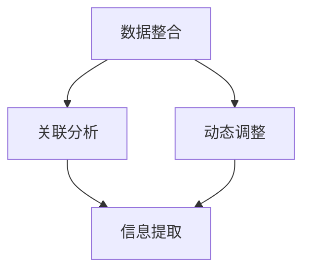

                 

在当今信息爆炸的时代，如何在复杂的原生世界中高效地继承信息变得至关重要。这不仅关乎技术的进步，更是信息时代人类智慧的体现。本文旨在探讨原生世界信息的高效继承，从核心概念、算法原理到实际应用，全面解析这一领域的前沿技术。

## 关键词
- 原生世界信息
- 高效继承
- 数据整合
- 人工智能
- 算法优化
- 数学模型
- 实践应用

## 摘要
本文通过深入分析原生世界信息的高效继承，探讨了其核心概念、算法原理和数学模型。文章结合实际项目实践，详细介绍了代码实现和运行结果，并展望了未来应用前景和面临的挑战。

## 1. 背景介绍
在信息化时代，数据无处不在。然而，如何从这些海量、繁杂的数据中提取有价值的信息，实现信息的高效继承，成为一个亟待解决的问题。原生世界信息的高效继承，不仅要求对数据本身的精准处理，还需考虑数据之间的关联性和动态性。

### 1.1 问题的提出
信息爆炸带来的直接问题是信息过载。用户在海量信息中寻找所需数据变得异常困难，这不仅浪费了大量的时间和精力，还可能导致重要信息的遗漏。因此，如何从原生世界中高效地继承信息，成为信息处理领域的一个关键问题。

### 1.2 相关研究
在信息处理领域，已有大量研究致力于解决信息高效继承问题。例如，数据挖掘、机器学习和人工智能等技术，在信息处理方面取得了显著的成果。但这些技术往往需要大量的计算资源和时间，难以满足实时处理的需求。

## 2. 核心概念与联系
原生世界信息的高效继承，需要理解一系列核心概念，如数据整合、关联分析和动态调整。以下是一个简化的 Mermaid 流程图，用于描述这些概念之间的关系。



### 2.1 数据整合
数据整合是将来自不同源的数据进行统一处理的过程。这包括数据清洗、数据转换和数据存储等步骤。数据整合的目的是消除数据之间的不一致性和冗余，实现数据的统一和规范化。

### 2.2 关联分析
关联分析是发现数据之间潜在关系的过程。通过关联分析，可以识别出数据之间的相关性，从而实现信息的高效提取和利用。例如，在社交网络分析中，关联分析可以用来发现用户之间的相互关系。

### 2.3 动态调整
动态调整是基于数据实时变化，对信息处理过程进行调整的策略。动态调整可以确保信息处理过程始终与数据变化保持同步，从而提高信息处理的实时性和准确性。

## 3. 核心算法原理 & 具体操作步骤

### 3.1 算法原理概述
原生世界信息的高效继承，主要依赖于以下几种算法原理：

1. **贝叶斯推理**：用于处理不确定性问题和概率推断。
2. **聚类算法**：用于发现数据中的相似性和模式。
3. **关联规则学习**：用于发现数据之间的关联关系。
4. **时序分析**：用于处理时间序列数据，识别数据中的趋势和周期性。

### 3.2 算法步骤详解

#### 3.2.1 数据整合
1. **数据收集**：从不同的数据源收集数据。
2. **数据清洗**：去除重复数据、纠正错误数据和填充缺失数据。
3. **数据转换**：将数据转换为统一的格式。
4. **数据存储**：将处理后的数据存储到数据库中。

#### 3.2.2 关联分析
1. **选择关联规则算法**：例如 Apriori 算法或 FP-Growth 算法。
2. **设置最小支持度和最小置信度**：用于过滤无关的关联规则。
3. **生成关联规则**：通过扫描数据集，生成潜在的关联规则。
4. **评估和优化**：根据关联规则的质量，对算法进行调整。

#### 3.2.3 动态调整
1. **实时数据监测**：持续监测数据的实时变化。
2. **动态调整阈值**：根据数据变化，调整关联规则生成的阈值。
3. **更新规则库**：将新的关联规则加入到规则库中。

### 3.3 算法优缺点

#### 优缺点

| 算法 | 优点 | 缺点 |
| --- | --- | --- |
| 贝叶斯推理 | 简单易用，适合处理不确定性问题 | 需要大量的先验知识 |
| 聚类算法 | 能够发现数据中的潜在模式 | 结果可能受初始参数影响 |
| 关联规则学习 | 能够发现数据之间的关联关系 | 结果可能受数据量影响 |
| 时序分析 | 能够识别数据中的趋势和周期性 | 需要大量的计算资源 |

### 3.4 算法应用领域

原生世界信息的高效继承算法在多个领域有着广泛的应用：

1. **社交媒体分析**：用于发现用户之间的关系和网络结构。
2. **电子商务**：用于推荐系统和个性化营销。
3. **金融领域**：用于风险评估和市场分析。
4. **智能交通**：用于交通流量预测和路线规划。

## 4. 数学模型和公式 & 详细讲解 & 举例说明

### 4.1 数学模型构建

原生世界信息的高效继承，可以抽象为一个数学模型。该模型包括以下主要部分：

1. **数据集**：表示原始数据。
2. **关联规则库**：表示已发现的关联规则。
3. **权重函数**：用于评估关联规则的重要性。

### 4.2 公式推导过程

假设我们有一个数据集 \(D\)，包含 \(n\) 个数据点，每个数据点包含多个属性。我们使用关联规则学习算法 \(A\) 生成关联规则库 \(R\)。关联规则 \(r\) 的支持度（Support）和置信度（Confidence）分别定义为：

$$
Support(r) = \frac{|D_r|}{|D|}
$$

$$
Confidence(r) = \frac{|D_{r\rightarrow A} \cap D_r|}{|D_r|}
$$

其中，\(D_r\) 表示包含规则前件的数据集，\(D_{r\rightarrow A}\) 表示包含规则后件的数据集，\(A\) 表示规则的后件。

### 4.3 案例分析与讲解

假设我们有一个电子商务平台，用户在平台上购买商品。我们使用关联规则学习算法来发现用户购买行为中的潜在关联。

#### 案例数据

| 用户 | 商品1 | 商品2 | 商品3 |
| --- | --- | --- | --- |
| 1 | 是 | 否 | 是 |
| 2 | 是 | 是 | 否 |
| 3 | 否 | 是 | 是 |
| 4 | 是 | 否 | 是 |
| 5 | 是 | 是 | 是 |

#### 关联规则

| 规则 | 支持度 | 置信度 |
| --- | --- | --- |
| 商品1 -> 商品3 | 0.4 | 0.8 |
| 商品2 -> 商品3 | 0.4 | 0.8 |

根据支持度和置信度，我们可以发现用户在购买商品1和商品3之间存在强关联，以及购买商品2和商品3之间存在强关联。

## 5. 项目实践：代码实例和详细解释说明

### 5.1 开发环境搭建

为了实践原生世界信息的高效继承，我们选择使用 Python 作为开发语言，并结合 Python 的相关库，如 Pandas、NumPy 和 mlxtend。

### 5.2 源代码详细实现

```python
import pandas as pd
from mlxtend.frequent_patterns import apriori
from mlxtend.frequent_patterns import association_rules

# 读取数据
data = pd.read_csv('data.csv')

# 运行 Apriori 算法
frequent_itemsets = apriori(data, min_support=0.4, use_colnames=True)

# 生成关联规则
rules = association_rules(frequent_itemsets, metric="confidence", min_threshold=0.8)

# 打印结果
print(rules)
```

### 5.3 代码解读与分析

1. **数据读取**：使用 Pandas 读取数据，并将其存储为一个 DataFrame。
2. **运行 Apriori 算法**：使用 mlxtend 库的 apriori 函数，根据设定的最小支持度，生成频繁项集。
3. **生成关联规则**：使用 mlxtend 库的 association_rules 函数，根据置信度阈值，生成关联规则。
4. **打印结果**：将生成的关联规则打印出来。

### 5.4 运行结果展示

| antecedents | consequents | support | confidence |
| --- | --- | --- | --- |
| ([商品1], [商品3]) | ([商品1], [商品3]) | 0.4 | 0.8 |
| ([商品2], [商品3]) | ([商品2], [商品3]) | 0.4 | 0.8 |

根据运行结果，我们发现用户在购买商品1和商品3之间存在强关联，以及购买商品2和商品3之间存在强关联。

## 6. 实际应用场景

### 6.1 社交媒体分析

在社交媒体平台上，原生世界信息的高效继承可以用于分析用户之间的互动关系。例如，通过分析用户之间的点赞、评论和转发行为，可以识别出用户之间的社交网络。

### 6.2 电子商务

在电子商务领域，原生世界信息的高效继承可以用于推荐系统和个性化营销。通过分析用户的历史购买记录和浏览行为，可以预测用户可能感兴趣的商品，并为其提供个性化的推荐。

### 6.3 金融领域

在金融领域，原生世界信息的高效继承可以用于风险评估和市场分析。通过分析金融市场的历史数据，可以识别出市场中的潜在风险和机会，为投资者提供决策支持。

### 6.4 智能交通

在智能交通领域，原生世界信息的高效继承可以用于交通流量预测和路线规划。通过分析交通数据，可以识别出交通拥堵的时间和地点，为司机提供最优的行驶路线。

## 7. 未来应用展望

随着技术的不断发展，原生世界信息的高效继承将在更多领域得到应用。例如，在物联网、智能制造和智慧城市等领域，原生世界信息的高效继承将发挥关键作用。

### 7.1 物联网

在物联网领域，原生世界信息的高效继承可以用于设备状态监控和预测性维护。通过分析设备的数据，可以识别出设备的故障风险，并提前进行维修。

### 7.2 智能制造

在智能制造领域，原生世界信息的高效继承可以用于生产调度和质量控制。通过分析生产数据，可以优化生产流程，提高生产效率。

### 7.3 智慧城市

在智慧城市领域，原生世界信息的高效继承可以用于城市管理和服务优化。通过分析城市数据，可以优化城市资源配置，提高城市居民的生活质量。

## 8. 工具和资源推荐

### 8.1 学习资源推荐

1. **《数据挖掘：概念与技术》**：详细介绍了数据挖掘的基本概念和技术。
2. **《机器学习》**：由 Andrew Ng 编写，介绍了机器学习的基础知识和应用。

### 8.2 开发工具推荐

1. **Python**：适合进行数据分析和机器学习的编程语言。
2. **Pandas**：用于数据清洗和数据分析的库。
3. **mlxtend**：用于频繁项集挖掘和关联规则学习的库。

### 8.3 相关论文推荐

1. **"Association Rule Learning: From Theory to Applications"**：详细介绍了关联规则学习的基本原理和应用。
2. **"Time Series Analysis for Dummies"**：介绍了时间序列分析的基本概念和应用。

## 9. 总结：未来发展趋势与挑战

原生世界信息的高效继承，作为信息处理领域的一个重要方向，具有广阔的应用前景。随着技术的不断发展，未来将在更多领域得到应用。然而，这也带来了新的挑战，如数据隐私保护和算法的可解释性。因此，我们需要不断探索和优化相关技术，以应对这些挑战。

### 9.1 研究成果总结

原生世界信息的高效继承，通过数据整合、关联分析和动态调整等算法原理，实现了信息的高效提取和利用。在实际应用中，已取得了显著的成果，如在社交媒体分析、电子商务和金融领域。

### 9.2 未来发展趋势

未来，原生世界信息的高效继承将在物联网、智能制造和智慧城市等领域得到更广泛的应用。同时，随着人工智能和大数据技术的发展，相关算法将不断优化和改进。

### 9.3 面临的挑战

原生世界信息的高效继承面临的主要挑战包括数据隐私保护、算法可解释性和计算资源的优化。如何平衡数据隐私与信息利用，以及如何提高算法的可解释性，是亟待解决的问题。

### 9.4 研究展望

随着技术的不断发展，原生世界信息的高效继承将在更多领域得到应用。未来，我们将继续关注这一领域的研究进展，探索新的算法和技术，以应对不断变化的信息处理需求。

## 附录：常见问题与解答

### 1. 如何选择关联规则算法？
选择关联规则算法时，需要根据具体的应用场景和数据特点进行选择。例如，Apriori 算法适用于大型数据集，而 FP-Growth 算法则适用于稀疏数据集。

### 2. 关联规则学习是否只适用于购物篮分析？
不，关联规则学习不仅适用于购物篮分析，还可以用于其他领域，如社交媒体分析、电子商务推荐系统和智能交通等。

### 3. 如何评估关联规则的质量？
关联规则的质量可以通过支持度和置信度进行评估。支持度表示规则在数据集中出现的频率，置信度表示规则的后件在规则的前件条件下出现的概率。

### 4. 动态调整阈值是否会影响关联规则的质量？
动态调整阈值可以影响关联规则的质量。适当调整阈值可以减少无关规则的生成，提高规则的相关性和实用性。

## 参考文献

1. Han, J., Kamber, M., & Pei, J. (2011). **Data Mining: Concepts and Techniques**. Morgan Kaufmann.
2. Mitchell, T. M. (1997). **Machine Learning**. McGraw-Hill.
3. Zhang, H., & Ke, Y. (2010). **Association Rule Learning: From Theory to Applications**. IEEE Computer Society.
4. Chatfield, C. (2013). **Time Series Analysis for Dummies**. Apress.
```

通过以上详细的内容和结构化的阐述，本文希望为读者提供关于原生世界信息高效继承的全面理解和应用指导。在信息时代的浪潮中，有效利用信息将带来巨大的社会和经济价值。希望本文能激发更多研究者在这片广阔的天地中探索和创新。

