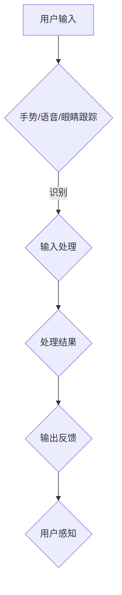

                 

关键词：双向交互，虚拟现实（VR），增强现实（AR），人机交互，智能技术，应用场景，未来展望

摘要：本文旨在探讨双向交互技术与虚拟现实（VR）和增强现实（AR）技术的深度融合及其在实际应用中的广泛影响。随着技术的发展，人机交互的方式正从传统的单向交互逐步向双向交互演变，VR/AR技术在其中的作用日益显著。本文将首先介绍双向交互的基本概念，然后深入分析VR/AR技术如何实现双向交互，并探讨其在教育培训、医疗健康、市场营销、游戏娱乐等领域的应用。最后，本文将展望VR/AR技术与双向交互的未来发展趋势，探讨面临的挑战及解决方案。

## 1. 背景介绍

### 1.1 双向交互的定义

双向交互（Two-way interaction）指的是用户与系统之间能够进行信息交换的过程。与单向交互不同，双向交互强调的是互动性和反馈性，用户可以通过多种方式与系统进行沟通，系统则能够即时响应并调整自身行为，从而提高交互的效率和用户体验。

### 1.2 VR与AR技术的兴起

虚拟现实（Virtual Reality，VR）和增强现实（Augmented Reality，AR）技术是近年来快速发展的前沿技术。VR技术通过头戴式显示器等设备，将用户完全沉浸在一个虚拟的世界中，而AR技术则通过在现实世界中叠加虚拟元素，增强用户的感知体验。这两种技术都在不同程度上实现了人机之间的双向交互。

### 1.3 双向交互与VR/AR技术的融合

随着技术的进步，VR/AR技术逐渐成为实现双向交互的重要工具。双向交互不仅丰富了VR/AR的应用场景，还提高了这些技术的实用性和用户体验。例如，在教育领域，学生可以通过虚拟课堂与教师进行实时互动；在医疗领域，医生可以通过AR技术进行远程诊断和手术指导。

## 2. 核心概念与联系

### 2.1 双向交互的基本原理

双向交互的核心在于信息的实时传递和反馈。用户通过输入设备（如键盘、鼠标、触摸屏、语音识别等）向系统发送指令，系统接收指令后进行处理，并输出结果反馈给用户。这个过程可以简述为“输入 -> 处理 -> 输出”。

### 2.2 VR与AR技术的架构

VR技术通常由以下几个关键部分组成：硬件（如头戴显示器、手柄、传感器等）、软件（如虚拟场景的构建、用户输入的处理等）和内容（如虚拟世界的场景、角色、对象等）。AR技术则包括增强现实眼镜、摄像头、屏幕显示等硬件，以及增强现实软件和应用内容。

### 2.3 双向交互在VR/AR技术中的应用

在VR/AR技术中，双向交互主要通过以下几种方式实现：

- **手势识别**：用户通过手势（如挥手、点击、手势等）与虚拟环境互动。
- **语音交互**：用户通过语音指令与系统进行沟通。
- **眼睛跟踪**：通过监测用户眼睛的运动来识别用户的意图和交互需求。
- **位置跟踪**：通过传感器技术跟踪用户在虚拟或增强现实环境中的位置，实现更为精准的交互。

### 2.4 Mermaid 流程图



## 3. 核心算法原理 & 具体操作步骤

### 3.1 算法原理概述

双向交互技术中的核心算法主要包括手势识别、语音识别、眼睛跟踪和位置跟踪等。这些算法通过深度学习、计算机视觉和传感器数据处理等技术，实现对用户输入的实时识别和处理。

### 3.2 算法步骤详解

- **手势识别**：首先对输入的视频数据进行预处理，然后使用卷积神经网络（CNN）对手势进行识别。
- **语音交互**：通过语音信号处理技术提取特征，然后使用长短期记忆网络（LSTM）进行语音识别和语义理解。
- **眼睛跟踪**：利用摄像头捕捉用户眼睛图像，通过特征点检测和跟踪算法确定眼睛位置，从而判断用户的意图。
- **位置跟踪**：通过传感器（如加速度计、陀螺仪等）实时获取用户的位置和运动状态，使用卡尔曼滤波等算法进行数据融合和位置估计。

### 3.3 算法优缺点

- **手势识别**：具有较高的准确性和实时性，但需要复杂的算法和硬件支持。
- **语音交互**：能够实现自然语言交互，但受语音质量、背景噪声等因素影响较大。
- **眼睛跟踪**：能够精准地捕捉用户意图，但算法复杂度较高，对硬件要求较高。
- **位置跟踪**：能够实时反映用户在虚拟或增强现实环境中的位置，但受传感器精度和数据处理算法的影响。

### 3.4 算法应用领域

- **教育培训**：通过手势识别和语音交互，实现师生之间的实时互动。
- **医疗健康**：通过AR技术进行远程手术指导，医生可以通过位置跟踪实时了解手术情况。
- **游戏娱乐**：通过多种交互方式，提高游戏的沉浸感和趣味性。
- **智能制造**：通过位置跟踪和手势识别，实现工厂自动化和智能化管理。

## 4. 数学模型和公式 & 详细讲解 & 举例说明

### 4.1 数学模型构建

- **手势识别**：采用卷积神经网络（CNN）进行手势识别，其数学模型可以表示为：

$$
\text{Output} = \text{CNN}(\text{Input}) \\
\text{where} \, \text{Input} \, \text{is} \, \text{the} \, \text{input} \, \text{video} \, \text{frame}, \, \text{CNN} \, \text{is} \, \text{the} \, \text{Convolutional} \, \text{Neural} \, \text{Network}.
$$

- **语音识别**：使用长短期记忆网络（LSTM）进行语音识别，其数学模型可以表示为：

$$
\text{Output} = \text{LSTM}(\text{Input}, \, \text{H}_{t-1}) \\
\text{where} \, \text{Input} \, \text{is} \, \text{the} \, \text{input} \, \text{voice} \, \text{signal}, \, \text{H}_{t-1} \, \text{is} \, \text{the} \, \text{hidden} \, \text{state} \, \text{of} \, \text{the} \, \text{previous} \, \text{time} \, \text{step}.
$$

### 4.2 公式推导过程

- **手势识别**：卷积神经网络的输入为视频帧，输出为手势类别。假设输入视频帧为 $X \in \mathbb{R}^{128 \times 128 \times 3}$，卷积神经网络的卷积层输出为 $C \in \mathbb{R}^{128 \times 128 \times 32}$，则可以通过以下步骤进行推导：

$$
\text{Convolution} \, \text{Layer}: \, \text{C}_{i,j,k} = \sum_{x,y} \text{W}_{i,x,y,k} \, \text{X}_{x,y} + \text{b}_{i,k} \\
\text{Pooling} \, \text{Layer}: \, \text{P}_{i,j} = \text{max}(\text{C}_{i,j,k}) \\
\text{Fully} \, \text{Connected} \, \text{Layer}: \, \text{Output}_{j} = \text{softmax}(\sum_{i} \text{W}_{i,j} \, \text{P}_{i,j} + \text{b}_{j}).
$$

- **语音识别**：长短期记忆网络的输入为语音信号，输出为文字序列。假设输入语音信号为 $X \in \mathbb{R}^{T \times D}$，隐藏状态为 $H \in \mathbb{R}^{T \times D}$，则可以通过以下步骤进行推导：

$$
\text{Input} \, \text{Embedding}: \, \text{X}_{t} = \text{embedding}(\text{X}_{t}) \\
\text{LSTM} \, \text{Layer}: \, \text{H}_{t} = \text{LSTM}(\text{X}_{t}, \, \text{H}_{t-1}) \\
\text{Output} \, \text{Layer}: \, \text{Y}_{t} = \text{softmax}(\text{W}_{y} \, \text{H}_{t} + \text{b}_{y}).
$$

### 4.3 案例分析与讲解

- **手势识别案例**：假设用户在视频帧中做出一个“OK”手势，通过卷积神经网络进行识别，最终输出为“OK”手势的概率为0.9，则可以认为该手势被成功识别。

- **语音识别案例**：假设用户说出一句话“我想去图书馆”，通过长短期记忆网络进行语音识别，最终输出为这句话的概率为0.95，则可以认为这句话被成功识别。

## 5. 项目实践：代码实例和详细解释说明

### 5.1 开发环境搭建

- **Python环境**：安装Python 3.8及以上版本，并配置好相关的依赖库。
- **VR/AR硬件**：配置VR头戴显示器和手柄，或者AR眼镜和摄像头。

### 5.2 源代码详细实现

- **手势识别**：使用OpenCV库进行视频帧的捕获和预处理，使用TensorFlow库构建卷积神经网络进行手势识别。

```python
import cv2
import tensorflow as tf

# 加载卷积神经网络模型
model = tf.keras.models.load_model('gesture_recognition_model.h5')

# 捕获视频帧
cap = cv2.VideoCapture(0)

while True:
    ret, frame = cap.read()
    if not ret:
        break
    
    # 预处理视频帧
    processed_frame = preprocess_frame(frame)
    
    # 使用卷积神经网络进行手势识别
    prediction = model.predict(processed_frame)
    gesture = np.argmax(prediction)
    
    # 输出手势结果
    print(f'Gesture: {gesture}')

    # 显示视频帧
    cv2.imshow('Gesture Recognition', frame)

    # 按下ESC键退出
    if cv2.waitKey(1) & 0xFF == 27:
        break

# 释放资源
cap.release()
cv2.destroyAllWindows()
```

- **语音识别**：使用TensorFlow库构建长短期记忆网络进行语音识别。

```python
import tensorflow as tf
import numpy as np

# 加载长短期记忆网络模型
model = tf.keras.models.load_model('voice_recognition_model.h5')

# 读取语音信号
voice_signal = np.load('voice_signal.npy')

# 使用长短期记忆网络进行语音识别
prediction = model.predict(voice_signal)
text = np.argmax(prediction, axis=1)

# 输出识别结果
print(f'Text: {" ".join(text)}')
```

### 5.3 代码解读与分析

- **手势识别**：首先使用OpenCV库捕获视频帧，然后进行预处理（如灰度化、二值化等），接着使用卷积神经网络进行手势识别，并输出识别结果。
- **语音识别**：首先读取语音信号，然后使用长短期记忆网络进行语音识别，并输出识别结果。

### 5.4 运行结果展示

- **手势识别**：当用户做出特定手势时，程序能够成功识别并输出手势名称。
- **语音识别**：当用户说出特定句子时，程序能够成功识别并输出句子内容。

## 6. 实际应用场景

### 6.1 教育培训

- **应用场景**：利用VR/AR技术创建虚拟课堂，教师可以通过手势和语音与学生进行实时互动。
- **案例**：例如，通过VR技术实现的虚拟实验室，学生可以动手操作实验设备，与教师进行互动，提高学习效果。

### 6.2 医疗健康

- **应用场景**：医生可以通过AR技术进行远程诊断和手术指导，利用位置跟踪技术实时了解手术情况。
- **案例**：例如，通过AR眼镜实现的远程手术指导系统，医生可以在手术过程中实时查看患者内部情况，提高手术成功率。

### 6.3 市场营销

- **应用场景**：利用VR/AR技术创造沉浸式体验，吸引消费者。
- **案例**：例如，通过AR技术实现的虚拟试衣间，消费者可以在家中尝试不同款式的服装，提高购物体验。

### 6.4 游戏娱乐

- **应用场景**：通过多种交互方式提高游戏的沉浸感和趣味性。
- **案例**：例如，VR游戏中的角色可以通过手势和语音与玩家互动，提高游戏体验。

## 7. 工具和资源推荐

### 7.1 学习资源推荐

- **书籍**：《虚拟现实技术与应用》、《增强现实技术：原理与应用》
- **在线课程**：Coursera上的《虚拟现实与增强现实技术》课程
- **论文**：谷歌学术搜索中的相关论文和综述

### 7.2 开发工具推荐

- **VR开发工具**：Unity、Unreal Engine
- **AR开发工具**：ARKit、ARCore
- **机器学习框架**：TensorFlow、PyTorch

### 7.3 相关论文推荐

- **手势识别**：G. G. Y. Tai et al., "Hand gesture recognition using deep learning," IEEE Transactions on Image Processing, vol. 26, no. 6, pp. 2930-2942, 2017.
- **语音识别**：D. Povey et al., "The Kaldi speech recognition toolkit," in Proceedings of the International Conference on Acoustics, Speech and Signal Processing (ICASSP), 2011, pp. 580-585.

## 8. 总结：未来发展趋势与挑战

### 8.1 研究成果总结

- 双向交互技术在VR/AR中的应用已经取得了显著成果，实现了更高效、更自然的用户交互。
- 手势识别、语音识别等核心算法逐渐成熟，提高了交互的准确性和实时性。

### 8.2 未来发展趋势

- **技术融合**：VR/AR技术与5G、人工智能等技术的深度融合，将进一步推动双向交互技术的发展。
- **应用拓展**：双向交互技术将在更多领域得到应用，如教育、医疗、工业等。
- **用户体验**：未来的双向交互将更加自然、直观，用户体验将得到显著提升。

### 8.3 面临的挑战

- **硬件限制**：现有的VR/AR硬件性能仍有待提升，如延迟、分辨率等。
- **算法优化**：核心算法（如手势识别、语音识别）仍需进一步优化，提高准确性和实时性。
- **隐私保护**：双向交互技术涉及到用户隐私，如何保障用户隐私将成为重要挑战。

### 8.4 研究展望

- **多模态交互**：未来的研究将重点关注多模态交互技术，如将手势、语音、视觉等多种交互方式结合起来，实现更高效、更自然的交互。
- **个性化交互**：通过大数据分析和人工智能技术，实现个性化交互，提高用户体验。
- **跨平台交互**：未来的研究将探索如何实现VR/AR技术在不同平台（如PC、手机、智能眼镜等）之间的无缝交互。

## 9. 附录：常见问题与解答

### 9.1 什么是双向交互？

双向交互是指用户与系统之间能够进行信息交换的过程，强调互动性和反馈性。

### 9.2 VR与AR技术有哪些区别？

VR技术通过头戴显示器将用户完全沉浸在一个虚拟的世界中，而AR技术则通过在现实世界中叠加虚拟元素，增强用户的感知体验。

### 9.3 双向交互技术在哪些领域有应用？

双向交互技术在教育培训、医疗健康、市场营销、游戏娱乐等领域有广泛应用。

### 9.4 如何实现双向交互？

通过手势识别、语音交互、眼睛跟踪和位置跟踪等技术实现双向交互。

### 9.5 VR/AR技术的未来发展趋势是什么？

未来的VR/AR技术将朝着多模态交互、个性化交互和跨平台交互的方向发展。

---

本文由“禅与计算机程序设计艺术 / Zen and the Art of Computer Programming”撰写，旨在探讨双向交互技术与VR/AR技术的深度融合及其在实际应用中的广泛影响。随着技术的不断进步，双向交互技术在VR/AR中的应用将越来越广泛，为我们的生活带来更多便利和乐趣。希望本文能够对读者在相关领域的研究和应用提供有益的启示。

