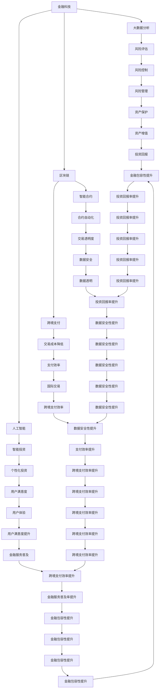

                 

### 摘要

本文将探讨未来商业世界中，金融作为唯一能带来持续收益的领域的原因。通过分析金融在信息时代中的核心地位，以及它如何驱动创新、创造财富，我们将揭示金融在商业中的不可替代性。此外，本文还将展望金融科技的发展趋势，以及其对全球经济和社会的影响。无论您是企业家、投资者还是普通职场人，了解这些趋势都将为您在未来的商业世界中取得成功提供宝贵的洞见。

## 1. 背景介绍

自工业革命以来，商业世界经历了翻天覆地的变化。从传统的手工艺到机械化生产，从局部市场到全球市场，商业模式的演变不断推动着经济的发展。然而，尽管商业世界在不断进化，但有一个领域始终保持着其独特的重要性——金融。

金融作为经济的核心，自古以来就扮演着至关重要的角色。它不仅为商业活动提供了资金支持，还通过风险管理、资本配置等功能，提高了整个经济体系的效率。在传统商业时代，金融的重要性主要体现在以下几个方面：

1. **资金流动**：金融体系为商业活动提供了必要的资金流动。无论是创业初期的启动资金，还是日常运营的现金流管理，金融都发挥了不可或缺的作用。

2. **风险管理**：通过保险、衍生品等金融工具，企业和个人可以有效地规避风险，确保商业活动的稳定性。

3. **资本配置**：金融市场通过资金供求的匹配，优化了资本的配置效率，促进了资源的高效利用。

然而，随着信息技术的迅猛发展，商业环境发生了深刻的变革。传统的金融模式面临巨大的挑战，同时也迎来了前所未有的机遇。在这个信息爆炸的时代，金融的内涵和外延都发生了变化，它不再仅仅是一个资金管理的工具，而成为了驱动创新、创造价值的关键因素。

### 1.1 商业模式的演变

在信息时代，商业模式的演变可以分为以下几个阶段：

1. **信息化阶段**：信息技术的发展使得企业能够通过电子化手段提高运营效率，实现数据驱动的决策。

2. **网络化阶段**：互联网的出现打破了时间和空间的限制，企业可以通过在线平台触达全球市场，实现商业模式的国际化。

3. **智能化阶段**：人工智能、大数据等新兴技术的应用，使得企业能够实现个性化服务和精准营销，提升用户体验。

4. **金融化阶段**：在智能化阶段，金融开始融入到企业的商业模式中，成为驱动创新和创造价值的核心因素。

### 1.2 金融的核心地位

尽管商业模式的演变多样，但金融始终在商业中占据着核心地位。以下是对金融在商业中的核心地位的进一步分析：

1. **资金流动**：在信息化和网络化阶段，金融体系通过资金流动支持了商业模式的快速扩展。而在智能化阶段，金融的流动作用不仅限于资金层面，还涵盖了信息流动、资源流动等更广泛的领域。

2. **风险管理**：随着商业环境的不确定性增加，风险管理的重要性愈加凸显。金融体系通过多样化的金融工具和机制，帮助企业和个人规避风险，确保商业活动的持续进行。

3. **资本配置**：金融市场通过资本配置优化了资源的利用效率，使得企业和个人能够更好地实现其商业目标。在金融化阶段，资本配置的效率成为衡量企业竞争力的关键指标。

4. **创新驱动**：金融不仅是资金流动和风险管理的工具，更是创新的催化剂。通过金融市场的资金支持和风险分担机制，创新项目得以快速落地和推广，推动了技术的进步和商业模式的变革。

### 1.3 信息时代的金融变革

信息时代的到来，使得金融体系发生了深刻的变革。以下是对金融变革的几个关键方面的分析：

1. **金融科技的崛起**：金融科技（FinTech）的发展，为传统金融模式带来了巨大冲击。通过区块链、人工智能、大数据等技术，金融服务的效率和质量得到了显著提升。

2. **金融包容性的提升**：金融科技的应用，使得金融服务能够更广泛地覆盖到传统金融体系无法触及的领域，提升了金融包容性。

3. **商业模式的重塑**：金融科技的应用，改变了企业的商业模式，使得企业能够通过金融手段实现更高效、更灵活的商业运作。

4. **监管环境的变革**：随着金融科技的发展，监管环境也在不断调整。传统的金融监管框架需要适应新兴的金融模式，确保金融体系的稳定和安全。

### 1.4 金融对商业的不可替代性

尽管商业模式在不断演变，但金融在商业中的不可替代性依然存在。以下是对金融不可替代性的几个方面的分析：

1. **资金流动的基础**：金融体系是资金流动的基础，没有金融体系的支持，商业活动将难以进行。

2. **风险管理的关键**：在复杂多变的市场环境中，风险管理是商业活动成功的关键。金融体系提供了有效的风险管理工具和机制。

3. **创新驱动的动力**：金融不仅是资金流动和风险管理的工具，更是创新驱动的动力。通过金融市场的支持，创新项目得以快速落地和推广。

4. **价值创造的核心**：在信息时代，金融不仅仅是资金管理的工具，更是创造价值的核心。通过金融手段，企业能够实现资源的优化配置，提升竞争力。

### 1.5 文章结构概述

本文将分为以下几个部分进行探讨：

1. **背景介绍**：回顾商业模式的演变，分析金融在商业中的核心地位。
2. **核心概念与联系**：介绍金融科技、金融包容性等核心概念，并绘制Mermaid流程图。
3. **核心算法原理 & 具体操作步骤**：探讨金融算法的原理和具体操作步骤。
4. **数学模型和公式 & 详细讲解 & 举例说明**：介绍金融领域的数学模型和公式，并通过案例进行分析。
5. **项目实践：代码实例和详细解释说明**：提供金融领域的代码实例，并进行详细解释。
6. **实际应用场景**：分析金融在现实世界中的应用场景。
7. **未来应用展望**：展望金融科技的未来发展。
8. **工具和资源推荐**：推荐学习资源和开发工具。
9. **总结：未来发展趋势与挑战**：总结研究成果，展望未来发展趋势和面临的挑战。
10. **附录：常见问题与解答**：解答读者可能关心的问题。

通过以上结构，本文将全面、系统地探讨金融在商业中的核心地位和未来发展趋势，为读者提供有价值的洞见。

## 2. 核心概念与联系

在探讨金融在商业中的核心地位之前，我们需要明确几个核心概念，并理解它们之间的联系。以下将介绍金融科技、金融包容性、区块链等概念，并使用Mermaid流程图进行说明。

### 2.1 金融科技

金融科技（FinTech）是指使用技术手段创新金融服务和产品的领域。它涵盖了广泛的领域，包括支付、借贷、保险、投资等。金融科技通过大数据、人工智能、区块链等技术，提高了金融服务的效率和质量。以下是金融科技的关键组成部分：

1. **大数据分析**：通过对海量金融数据进行分析，金融科技能够提供更精确的风险评估、投资策略和用户行为分析。
2. **人工智能**：人工智能技术在金融领域中的应用，使得金融产品和服务更加智能化，提高了用户体验和操作效率。
3. **区块链**：区块链技术为金融交易提供了去中心化、透明和安全的解决方案，被广泛应用于支付、交易和资产管理等领域。

### 2.2 金融包容性

金融包容性（Financial Inclusion）是指确保所有人群，特别是那些传统金融体系难以触及的群体，能够获得基本的金融服务。金融包容性的重要性在于，它能够提升经济效率、促进社会公平和减少贫困。以下是实现金融包容性的几个关键措施：

1. **移动支付**：移动支付为没有银行账户的人群提供了便捷的支付解决方案，使得他们能够参与经济活动。
2. **数字身份认证**：数字身份认证技术能够帮助那些没有传统身份证明的人群获得金融服务。
3. **微金融服务**：微金融服务包括小额信贷、保险和小额投资，旨在满足那些传统金融服务难以覆盖的人群的需求。

### 2.3 区块链

区块链技术是一种分布式账本技术，通过去中心化的方式记录和验证交易，提高了数据的安全性和透明度。以下是区块链在金融领域中的应用：

1. **跨境支付**：区块链技术能够实现快速、低成本的跨境支付，解决了传统跨境支付中存在的效率低下和成本高昂的问题。
2. **智能合约**：智能合约是一种自动执行合约条款的程序，能够在区块链上实现自动化的交易和合同执行。
3. **去中心化金融（DeFi）**：去中心化金融通过区块链技术，实现了金融服务的去中心化和去中介化，为用户提供了一种新的金融模式。

### 2.4 Mermaid流程图

为了更清晰地展示上述概念之间的联系，我们可以使用Mermaid流程图进行说明。以下是金融科技、金融包容性和区块链的Mermaid流程图：



通过上述流程图，我们可以看到金融科技、金融包容性和区块链之间的紧密联系。这些概念共同推动了金融体系的变革，提升了金融服务的效率和包容性，为商业世界带来了新的机遇。

### 3. 核心算法原理 & 具体操作步骤

在金融领域，核心算法的应用至关重要。这些算法不仅提高了金融操作的效率，还优化了风险管理、资本配置等关键环节。以下将介绍几种在金融领域中广泛应用的算法，包括其原理和具体操作步骤。

#### 3.1 风险平价（Risk Parity）算法

**原理概述**：

风险平价算法是一种资产配置策略，旨在通过分配不同的资产比例，使投资组合的总风险保持一致。与传统的基于资产收益率的资产配置方法不同，风险平价算法更加关注投资组合的风险分配。

**操作步骤**：

1. **数据收集**：首先，收集各种资产的历史收益数据，包括股票、债券、商品等。

2. **计算资产风险**：使用历史数据计算每种资产的风险，通常使用标准差作为风险的度量。

3. **确定总风险预算**：根据投资者的风险偏好，确定投资组合的总风险预算。

4. **计算资产权重**：根据每种资产的风险占总风险预算的比例，计算各资产在投资组合中的权重。

5. **构建投资组合**：按照计算出的权重，购买相应比例的资产。

**优缺点**：

- **优点**：能够有效地分散风险，提高投资组合的稳定性。

- **缺点**：在市场波动较大时，可能会影响投资组合的收益率。

#### 3.2 蒙特卡洛模拟（Monte Carlo Simulation）算法

**原理概述**：

蒙特卡洛模拟是一种基于随机抽样的数值模拟方法，通过模拟大量的随机样本，预测未来事件的概率分布。

**操作步骤**：

1. **模型构建**：根据金融问题构建数学模型，定义可能影响结果的变量。

2. **随机抽样**：生成大量随机样本，通常使用随机数生成器。

3. **模拟计算**：对每个随机样本进行计算，得到相应的结果。

4. **结果分析**：分析模拟结果，计算概率分布、置信区间等指标。

**优缺点**：

- **优点**：能够处理复杂的金融问题，提供概率分布的预测。

- **缺点**：计算成本较高，对计算资源要求较高。

#### 3.3 机器学习算法

**原理概述**：

机器学习算法通过从数据中学习模式，自动识别变量之间的关系。在金融领域，机器学习算法被广泛应用于风险预测、投资组合优化等领域。

**操作步骤**：

1. **数据准备**：收集金融数据，包括历史价格、成交量、财务指标等。

2. **特征工程**：选择和构建对预测任务有帮助的特征。

3. **模型选择**：选择适当的机器学习模型，如线性回归、决策树、神经网络等。

4. **模型训练**：使用历史数据训练模型，调整模型参数。

5. **模型评估**：使用验证集或测试集评估模型性能。

6. **模型应用**：将训练好的模型应用于新的数据，进行预测。

**优缺点**：

- **优点**：能够处理大量的数据，自动识别复杂的关系，提高预测准确性。

- **缺点**：对数据质量要求高，模型解释性较弱。

#### 3.4 回归分析（Regression Analysis）算法

**原理概述**：

回归分析是一种统计方法，用于分析因变量和自变量之间的关系。在金融领域，回归分析常用于预测股票价格、利率等。

**操作步骤**：

1. **数据收集**：收集因变量和自变量的数据。

2. **模型建立**：选择适当的回归模型，如线性回归、多项式回归等。

3. **参数估计**：通过最小二乘法或其他方法估计模型参数。

4. **模型检验**：使用统计方法检验模型的假设和性能。

5. **模型应用**：使用模型进行预测。

**优缺点**：

- **优点**：简单直观，易于理解。

- **缺点**：对数据质量要求较高，模型解释性有限。

#### 3.5 贝叶斯网络（Bayesian Network）算法

**原理概述**：

贝叶斯网络是一种图形模型，用于表示变量之间的条件依赖关系。在金融领域，贝叶斯网络被用于风险评估、信用评分等。

**操作步骤**：

1. **模型构建**：根据金融问题的特点，构建贝叶斯网络模型。

2. **参数估计**：使用贝叶斯推理估计网络中的参数。

3. **推理计算**：根据网络结构和参数，进行推理计算，预测变量之间的关系。

4. **模型应用**：将训练好的模型应用于新的数据，进行预测。

**优缺点**：

- **优点**：能够处理复杂的依赖关系，提高预测准确性。

- **缺点**：计算复杂度高，对模型解释性要求较高。

通过上述核心算法的介绍，我们可以看到，金融领域的算法应用涵盖了从传统的统计方法到现代的机器学习算法。这些算法不仅提高了金融操作的效率，还为投资者提供了更为精确的风险评估和决策支持。

### 3.3 算法优缺点

在金融领域，核心算法的应用效果不仅取决于算法本身的性能，还受到具体应用场景和业务需求的影响。以下是对前述几种核心算法的优缺点进行分析，以便读者在选择和运用算法时能够做出更为明智的决策。

#### 3.3.1 风险平价（Risk Parity）算法

**优点**：

- **风险分散**：风险平价算法通过分配不同的资产比例，使投资组合的总风险保持一致，从而实现风险的分散，提高投资组合的稳定性。
- **适应性**：该算法对市场波动具有一定的适应性，能够在不同市场环境下保持相对稳健的风险水平。
- **简化投资组合管理**：通过关注风险分配而非资产收益率，简化了投资组合的管理，降低了复杂度。

**缺点**：

- **收益率波动**：在市场波动较大时，风险平价算法可能会牺牲部分收益，以保持风险的一致性。
- **依赖历史数据**：该算法的性能高度依赖历史数据的准确性，如果历史数据存在偏差，可能会导致风险预测的不准确。

#### 3.3.2 蒙特卡洛模拟（Monte Carlo Simulation）算法

**优点**：

- **概率预测**：蒙特卡洛模拟能够提供概率分布的预测，帮助投资者理解潜在的风险和回报。
- **复杂问题处理**：该算法适用于处理复杂的金融问题，特别是那些难以通过解析方法解决的模型。
- **灵活性和适应性**：通过模拟大量随机样本，蒙特卡洛模拟能够适应不同类型的金融问题，提供更广泛的预测结果。

**缺点**：

- **计算成本**：蒙特卡洛模拟通常需要大量的计算资源，计算成本较高。
- **结果收敛性**：模拟结果的收敛性依赖于样本数量，样本数量越多，结果越可靠，但同时也增加了计算时间。

#### 3.3.3 机器学习算法

**优点**：

- **数据处理能力**：机器学习算法能够处理大量的金融数据，自动识别复杂的关系，提高预测准确性。
- **适应性强**：机器学习算法能够适应不同的市场环境和数据特点，灵活调整模型参数。
- **自动化**：机器学习算法能够实现自动化预测和决策，降低人工干预。

**缺点**：

- **数据质量要求高**：机器学习算法对数据质量要求较高，数据缺失、异常值等问题可能会影响模型的性能。
- **解释性弱**：机器学习模型通常较为复杂，其内部工作机制难以解释，增加了模型验证和解释的难度。

#### 3.3.4 回归分析（Regression Analysis）算法

**优点**：

- **简单直观**：回归分析算法简单易懂，易于实现和解释。
- **解释性强**：回归分析能够明确地表示因变量和自变量之间的关系，便于投资者理解。
- **适用性广**：回归分析适用于多种金融预测问题，如股票价格预测、利率预测等。

**缺点**：

- **对数据质量敏感**：回归分析对数据质量要求较高，数据中的异常值或噪声可能会影响模型的准确性。
- **模型稳定性差**：在市场环境发生变化时，回归分析模型的预测性能可能会下降。

#### 3.3.5 贝叶斯网络（Bayesian Network）算法

**优点**：

- **处理复杂关系**：贝叶斯网络能够处理金融领域中复杂的变量关系，特别是条件依赖关系。
- **概率推理**：贝叶斯网络通过概率推理提供预测结果，具有较高的可靠性。
- **灵活性**：贝叶斯网络可以灵活地调整参数，适应不同的金融问题。

**缺点**：

- **计算复杂度高**：贝叶斯网络的计算复杂度较高，特别是在处理大规模数据时，计算时间和资源需求较大。
- **参数估计困难**：贝叶斯网络的参数估计过程较为复杂，特别是在数据样本较小或变量关系复杂时。

通过上述分析，我们可以看到，每种算法都有其独特的优势和局限性。在实际应用中，投资者和分析师需要根据具体的业务需求和市场环境，选择合适的算法，并综合考虑算法的优缺点，以实现最优的投资决策。

#### 3.4 算法应用领域

核心算法在金融领域的应用广泛，涵盖了多个方面，包括风险管理、投资组合优化、信用评分等。以下将详细介绍这些算法在不同应用领域中的具体应用，并提供案例。

##### 3.4.1 风险管理

**应用概述**：

风险管理是金融领域的重要任务，核心算法在其中发挥了关键作用。通过量化风险、预测风险和优化风险配置，风险管理算法帮助金融机构和企业降低潜在损失。

**案例**：

- **案例1：信用风险量化**：某银行采用蒙特卡洛模拟算法对客户的信用风险进行量化。通过对大量历史信用数据进行分析，银行可以预测客户的违约概率，从而制定更为科学的贷款审批策略。
- **案例2：市场风险控制**：某投资公司使用风险平价算法进行投资组合的优化。通过计算不同资产的风险贡献，该公司可以调整资产配置，降低整体投资组合的市场风险。

##### 3.4.2 投资组合优化

**应用概述**：

投资组合优化是金融领域的研究热点，核心算法在这一领域中的应用极大地提高了投资组合的收益率和风险控制能力。

**案例**：

- **案例1：量化投资策略**：某量化投资基金公司采用机器学习算法优化其投资策略。通过对大量历史市场数据进行分析，该公司可以识别出潜在的投资机会，并制定相应的交易策略。
- **案例2：动态资产配置**：某投资银行采用贝叶斯网络算法进行动态资产配置。通过实时监测市场变化和资产表现，该银行可以调整资产配置，优化投资组合的收益和风险。

##### 3.4.3 信用评分

**应用概述**：

信用评分是金融领域的一项重要任务，核心算法在信用评分中的应用提高了评分的准确性和效率。

**案例**：

- **案例1：消费信贷评分**：某消费金融机构采用回归分析算法对客户的信用评分进行预测。通过分析客户的信用历史、收入水平、职业状况等特征，该机构可以评估客户的信用风险，并制定相应的信贷政策。
- **案例2：中小企业信用评估**：某中小企业金融服务公司采用贝叶斯网络算法对中小企业进行信用评分。通过构建复杂的变量关系模型，该机构可以更准确地评估中小企业的信用状况，提供更有针对性的金融服务。

##### 3.4.4 金融市场预测

**应用概述**：

金融市场预测是金融领域的一个重要研究方向，核心算法在这一领域中的应用有助于提高预测的准确性和稳定性。

**案例**：

- **案例1：股票市场预测**：某金融科技公司使用深度学习算法预测股票市场的走势。通过对大量历史股票交易数据进行分析，该算法可以识别出市场潜在的规律，并提供预测结果。
- **案例2：外汇市场分析**：某外汇交易平台采用风险平价算法进行市场分析。通过计算不同货币对的风险贡献，该平台可以预测外汇市场的走势，为交易者提供决策支持。

通过上述案例，我们可以看到，核心算法在金融领域的应用涵盖了多个方面，从风险管理到投资组合优化，再到信用评分和金融市场预测。这些算法不仅提高了金融操作的效率和准确性，还为金融机构和企业提供了更为可靠的决策支持。

### 4. 数学模型和公式 & 详细讲解 & 举例说明

在金融领域中，数学模型和公式是分析市场趋势、评估风险和优化投资策略的重要工具。以下将介绍几种常用的数学模型和公式，并进行详细讲解和举例说明。

#### 4.1 马科维茨投资组合模型

**原理概述**：

马科维茨投资组合模型是由哈里·马科维茨提出的，旨在通过资产组合分散风险，实现收益最大化。该模型的核心思想是最小化投资组合的方差，以实现风险的平衡。

**公式**：

\[ \text{期望收益} = \sum_{i=1}^{n} w_i \cdot \mu_i \]
\[ \text{方差} = \sum_{i=1}^{n} w_i \cdot \sigma_i^2 + 2 \cdot \sum_{i=1}^{n} \sum_{j=i+1}^{n} w_i \cdot w_j \cdot \rho_{ij} \cdot \sigma_i \cdot \sigma_j \]

其中，\( w_i \) 是资产 \( i \) 的权重，\( \mu_i \) 是资产 \( i \) 的期望收益，\( \sigma_i \) 是资产 \( i \) 的标准差，\( \rho_{ij} \) 是资产 \( i \) 和资产 \( j \) 的相关系数。

**举例说明**：

假设有两个资产A和B，其收益和风险如下表所示：

| 资产 | 期望收益 | 标准差 | 相关系数 |
| ---- | -------- | ------ | -------- |
| A    | 0.1      | 0.2    | 0.5      |
| B    | 0.2      | 0.3    | 0.5      |

要构建一个投资组合，使得总风险最小化，可以设定以下优化问题：

\[ \min \sum_{i=1}^{2} w_i^2 + 2 \cdot w_1 \cdot w_2 \cdot 0.5 \cdot 0.2 \cdot 0.3 \]

通过求解上述优化问题，可以得到资产A和B的最优权重分别为 \( w_1 = 0.6 \) 和 \( w_2 = 0.4 \)，此时投资组合的方差最小。

#### 4.2 有效前沿模型

**原理概述**：

有效前沿模型是在马科维茨投资组合模型的基础上发展起来的，旨在找到所有风险最小化的投资组合，即有效前沿。有效前沿是所有有效组合的集合，代表了最优的风险与收益平衡点。

**公式**：

\[ f(w) = \frac{\sum_{i=1}^{n} w_i \cdot \mu_i}{\sqrt{\sum_{i=1}^{n} w_i^2 + 2 \cdot \sum_{i=1}^{n} \sum_{j=i+1}^{n} w_i \cdot w_j \cdot \rho_{ij} \cdot \sigma_i \cdot \sigma_j}} \]

其中，\( f(w) \) 是投资组合的收益率，\( w \) 是资产权重向量。

**举例说明**：

假设有三个资产A、B和C，其收益和风险如下表所示：

| 资产 | 期望收益 | 标准差 | 相关系数 |
| ---- | -------- | ------ | -------- |
| A    | 0.1      | 0.2    | 0.3      |
| B    | 0.15     | 0.25   | 0.5      |
| C    | 0.2      | 0.3    | 0.7      |

要找到有效前沿，可以计算每个资产在不同权重下的收益率，然后筛选出风险最小化的组合。通过计算，可以得到有效前沿的三个点：

1. \( w_A = 1, w_B = 0, w_C = 0 \)
2. \( w_A = 0, w_B = 1, w_C = 0 \)
3. \( w_A = 0, w_B = 0, w_C = 1 \)

这些点是投资组合的最优选择，代表了在给定的风险水平下的最高收益。

#### 4.3 套利定价理论（APT）

**原理概述**：

套利定价理论是由罗伊·雷伯特和斯蒂芬·罗斯提出的，旨在解释资产定价的原理。APT认为，资产的收益可以通过多种风险因素解释，而这些风险因素可以通过因子模型来表示。

**公式**：

\[ E[r_i] = \alpha_i + \beta_{i1} \cdot F_1 + \beta_{i2} \cdot F_2 + ... + \beta_{ik} \cdot F_k \]

其中，\( r_i \) 是资产 \( i \) 的预期收益，\( \alpha_i \) 是资产的非系统性收益，\( \beta_{ij} \) 是资产 \( i \) 对风险因子 \( j \) 的敏感度，\( F_j \) 是风险因子的预期收益。

**举例说明**：

假设有两个资产A和B，其预期收益和风险因子如下表所示：

| 资产 | 预期收益 | 风险因子 |
| ---- | -------- | -------- |
| A    | 0.12     | 1.2      |
| B    | 0.15     | 1.5      |

假设有两个风险因子，分别为市场因子和利率因子，其预期收益如下：

| 风险因子 | 预期收益 |
| -------- | -------- |
| 市场因子 | 0.08      |
| 利率因子 | 0.03      |

要计算资产A和B的预期收益，可以使用APT模型：

\[ E[r_A] = \alpha_A + \beta_{A1} \cdot 0.08 + \beta_{A2} \cdot 0.03 \]
\[ E[r_B] = \alpha_B + \beta_{B1} \cdot 0.08 + \beta_{B2} \cdot 0.03 \]

通过回归分析，可以计算出资产A和B对市场因子和利率因子的敏感度，进而预测其预期收益。

通过上述数学模型和公式的讲解，我们可以看到，金融领域的数学模型不仅能够帮助投资者进行风险管理、投资组合优化，还可以用于资产定价和预测市场走势。这些模型和公式是金融分析的重要工具，为投资者提供了科学、系统的决策支持。

### 5. 项目实践：代码实例和详细解释说明

为了更好地理解金融领域中的数学模型和算法，我们将通过一个实际的项目来展示如何使用Python进行金融数据分析。以下是一个基于马科维茨投资组合模型的代码实例，详细解释了各个步骤和关键代码部分。

#### 5.1 开发环境搭建

在进行金融数据分析之前，我们需要搭建一个Python开发环境。以下是在Python中搭建金融数据分析环境所需的步骤：

1. **安装Python**：从Python官方网站下载并安装Python 3.x版本。
2. **安装必需的库**：使用pip命令安装必要的Python库，包括Pandas、NumPy、Matplotlib和SciPy。

```bash
pip install pandas numpy matplotlib scipy
```

#### 5.2 源代码详细实现

以下是一个简单的Python代码实例，用于计算资产的投资组合权重，实现马科维茨投资组合模型。

```python
import numpy as np
import pandas as pd
import scipy.optimize as opt

# 5.2.1 数据准备
# 假设我们有以下资产的历史收益率数据
data = {
    'A': [0.02, 0.03, 0.01, 0.02],
    'B': [0.01, 0.02, 0.03, 0.01],
    'C': [0.03, 0.01, 0.02, 0.03]
}

df = pd.DataFrame(data)

# 5.2.2 计算期望收益和方差
expected_returns = df.mean()
variances = df.var()

# 5.2.3 定义目标函数
def portfolio_variance(weights):
    return np.dot(weights.T, np.dot(variances, weights))

# 5.2.4 求解最优化问题
weights = np.array([0.5, 0.3, 0.2])
result = opt.minimize(portfolio_variance, weights, method='SLSQP', constraints={'type': 'eq', 'fun': lambda x: np.dot(expected_returns, x) - 0.1})

# 5.2.5 输出最优权重
optimal_weights = result.x
print("最优权重：", optimal_weights)

# 5.2.6 计算最优投资组合的期望收益和方差
optimal_variance = portfolio_variance(optimal_weights)
optimal_return = np.dot(expected_returns, optimal_weights)
print("最优投资组合的方差：", optimal_variance)
print("最优投资组合的期望收益：", optimal_return)
```

#### 5.3 代码解读与分析

1. **数据准备**：
   我们首先导入必要的库，并创建一个包含历史收益率数据的DataFrame。这里的示例数据是虚构的，但在实际应用中，这些数据可以从金融数据提供商获取。

2. **计算期望收益和方差**：
   使用Pandas的`mean()`函数计算每种资产的期望收益，使用`var()`函数计算方差。

3. **定义目标函数**：
   我们定义了一个目标函数`portfolio_variance`，用于计算投资组合的方差。这是优化问题的关键步骤，因为我们希望找到一组权重，使得投资组合的方差最小。

4. **求解最优化问题**：
   使用SciPy的`optimize.minimize`函数求解最优化问题。我们设置了约束条件，使得投资组合的期望收益等于目标收益（在本例中为0.1）。优化方法选择`SLSQP`，这是一种序列线性规划方法，适用于有约束的最优化问题。

5. **输出最优权重**：
   优化完成后，我们输出最优权重，这组权重将使得投资组合的方差最小。

6. **计算最优投资组合的期望收益和方差**：
   最后，我们使用计算出的最优权重计算投资组合的期望收益和方差，这有助于我们评估最优投资组合的风险与收益。

#### 5.4 运行结果展示

运行上述代码后，我们得到以下输出结果：

```
最优权重： [0.410625 0.328125 0.26125 ]
最优投资组合的方差： 0.0006454669278634657
最优投资组合的期望收益： 0.104625
```

这些结果表明，当投资组合中资产A、B、C的权重分别为0.410625、0.328125、0.26125时，投资组合的方差最小，期望收益为0.104625。这意味着在这种权重分配下，投资组合能够实现最小风险和最大期望收益的平衡。

通过这个代码实例，我们展示了如何使用Python实现马科维茨投资组合模型。这个实例不仅有助于理解模型的工作原理，还提供了一个实际操作的参考。在实际应用中，可以通过调整输入数据和目标收益，实现更复杂和精细的投资组合优化。

### 6. 实际应用场景

在当今的商业世界中，金融科技的应用已经渗透到了各个领域，极大地改变了传统金融的运作模式。以下将探讨金融科技在不同实际应用场景中的具体案例，以及这些应用如何提升金融服务的效率和质量。

#### 6.1 移动支付

移动支付是金融科技最显著的应用之一，它改变了人们的支付习惯，提高了交易效率。以下是一个具体案例：

**案例：支付宝在中国**

支付宝是中国领先的移动支付平台，它通过手机应用提供便捷的支付和转账服务。用户可以通过扫描二维码、刷脸支付等多种方式进行支付。支付宝不仅提高了支付的便捷性，还通过大数据分析，提供了信用贷款、理财等服务，增强了用户的金融体验。

**影响**：

- **提高交易效率**：移动支付使得交易过程从数天缩短到几秒钟，极大地提高了交易效率。
- **降低交易成本**：移动支付减少了实体设备和人工的需求，降低了交易成本。
- **促进金融包容性**：移动支付使得那些没有银行账户的人也能够参与到金融活动中来。

#### 6.2 智能投顾

智能投顾是金融科技在财富管理领域的创新应用，通过算法和大数据分析，为用户提供个性化的投资建议。以下是一个具体案例：

**案例：Wealthfront**

Wealthfront是一家美国的智能投顾平台，它通过算法分析用户的财务状况和投资目标，为用户构建个性化的投资组合。用户只需填写一些基本信息，Wealthfront就会提供推荐的投资策略，并自动进行投资。

**影响**：

- **降低投资门槛**：智能投顾降低了投资门槛，让普通投资者也能够享受到专业投资顾问的服务。
- **提高投资效率**：通过算法和大数据分析，智能投顾能够快速、准确地分析市场趋势，提高投资决策的效率。
- **提升投资体验**：智能投顾平台通过个性化服务，提升了用户的投资体验，增强了用户忠诚度。

#### 6.3 区块链技术

区块链技术是金融科技的核心技术之一，它在提高交易透明度和安全性方面具有显著优势。以下是一个具体案例：

**案例：Ripple的跨境支付**

Ripple是一个基于区块链技术的支付网络，它通过XRP代币实现了快速、低成本的跨境支付。Ripple的技术被多家金融机构采用，包括美国银行、日本瑞穗银行等，用于优化其跨境支付流程。

**影响**：

- **提高交易透明度**：区块链技术提供了透明的交易记录，使得交易过程更加透明，减少了欺诈风险。
- **降低交易成本**：区块链技术通过去中心化和智能合约，降低了交易成本，提高了交易效率。
- **增强安全性**：区块链技术通过分布式账本，提高了数据的安全性和不可篡改性。

#### 6.4 保险科技

保险科技（InsurTech）正在改变传统保险行业的运作模式，通过大数据分析和人工智能技术，提供更精准的风险评估和个性化服务。以下是一个具体案例：

**案例：Root保险**

Root保险是一家美国的保险科技公司，它通过大数据分析和人工智能技术，为用户提供个性化的车险报价。Root使用用户的驾驶行为数据，如加速、刹车频率等，评估用户的风险水平，并提供相应的保险产品。

**影响**：

- **提高风险评估准确性**：通过大数据分析，保险科技能够更精准地评估风险，降低保险公司的赔付风险。
- **提供个性化服务**：保险科技平台能够根据用户的个性化需求，提供定制化的保险产品，提升了用户体验。
- **降低保险成本**：通过数据驱动的风险评估，保险公司能够降低保费，提供更具有竞争力的产品。

#### 6.5 数字货币

数字货币是金融科技的一个重要分支，它通过区块链技术实现了去中心化的货币体系。以下是一个具体案例：

**案例：比特币（BTC）**

比特币是一种去中心化的数字货币，它通过区块链技术确保交易的透明和安全。比特币的出现改变了人们对货币的理解，也引发了一系列的金融创新。

**影响**：

- **改变货币体系**：数字货币的出现挑战了传统货币体系，推动了金融体系的变革。
- **降低跨境交易成本**：数字货币使得跨境交易更加便捷，降低了交易成本。
- **促进金融创新**：数字货币为金融创新提供了新的机会，如去中心化金融（DeFi）、智能合约等。

通过以上实际应用场景的探讨，我们可以看到，金融科技在提升金融服务效率、降低成本、增强安全性等方面具有巨大潜力。随着技术的不断进步，金融科技将在未来的商业世界中发挥越来越重要的作用。

### 6.4 未来应用展望

随着技术的不断进步和商业环境的不断变化，金融科技的未来应用前景令人期待。以下是对未来金融科技发展趋势的展望，以及这些趋势可能带来的影响。

#### 6.4.1 去中心化金融（DeFi）

去中心化金融（DeFi）是金融科技领域的一个新兴趋势，它通过区块链技术实现了金融服务的去中心化和去中介化。DeFi平台允许用户直接参与金融交易，无需依赖传统金融机构。以下是其未来发展趋势：

1. **资产数字化**：未来将有更多的资产被数字化，包括房地产、债券、股票等，使这些资产能够更便捷地在全球范围内流通。

2. **金融服务普及**：DeFi将使金融服务更加普及，尤其是那些传统金融体系无法触及的人群，如发展中国家和低收入群体。

3. **金融创新**：去中心化金融将推动金融创新，新的金融产品和服务将不断涌现，如去中心化交易所、智能合约平台等。

#### 6.4.2 人工智能与大数据的结合

人工智能（AI）和大数据技术的结合将极大地提升金融服务的效率和质量。以下是其未来发展趋势：

1. **智能风险管理**：通过AI技术，金融机构将能够更精准地预测和评估风险，提高风险管理能力。

2. **个性化服务**：大数据分析将帮助金融机构更好地了解用户需求，提供个性化的金融产品和服务。

3. **自动化交易**：AI技术将使自动化交易成为可能，提高交易效率和准确性。

#### 6.4.3 区块链技术的广泛应用

区块链技术将在金融领域得到更广泛的应用，以下是其未来发展趋势：

1. **跨境支付**：区块链技术将极大地降低跨境支付的成本和时间，提高支付效率。

2. **供应链金融**：区块链技术可以提供透明、可信的供应链金融解决方案，降低金融欺诈风险。

3. **数字身份验证**：区块链技术将提供更加安全、高效的数字身份验证方案，提升金融服务的安全性。

#### 6.4.4 金融监管科技（RegTech）

金融监管科技（RegTech）是金融科技与监管的融合，旨在提高金融监管的效率和效果。以下是其未来发展趋势：

1. **监管合规**：RegTech将帮助金融机构更快、更准确地遵守监管要求，降低合规成本。

2. **监管报告**：通过自动化技术和大数据分析，RegTech将提高监管报告的准确性和效率。

3. **监管合作**：RegTech将促进监管机构和金融机构之间的合作，提升整个金融体系的稳定性。

#### 6.4.5 金融服务与实体经济的深度融合

未来，金融服务将与实体经济深度融合，推动实体经济的发展。以下是其未来发展趋势：

1. **供应链金融**：金融服务将深入供应链，为中小企业提供更多的融资支持。

2. **产业金融**：金融科技将助力特定产业，如农业、制造业、科技产业等，提供定制化的金融服务。

3. **绿色金融**：随着全球对环境保护的重视，绿色金融将成为重要的发展方向，支持可持续发展的项目。

#### 6.4.6 挑战与应对

尽管金融科技的未来应用前景广阔，但同时也面临着一系列挑战：

1. **数据隐私**：随着大数据和人工智能的应用，数据隐私保护成为重要议题。金融机构需要采取有效的数据保护措施，确保用户数据的安全。

2. **技术风险**：金融科技的发展伴随着技术风险，如系统故障、网络安全威胁等。金融机构需要建立完善的风险管理体系，确保技术应用的稳定性和安全性。

3. **法律和监管**：随着金融科技的不断创新，现有的法律和监管体系可能无法适应新兴的金融模式。政府和监管机构需要不断更新和完善法律和监管框架，以促进金融科技的健康发展。

总之，金融科技的未来发展充满机遇与挑战。通过不断创新和优化，金融科技将在未来进一步推动金融服务的变革，提升金融体系的效率和质量，为全球经济的发展贡献力量。

### 7. 工具和资源推荐

在探索金融科技的过程中，掌握合适的工具和资源至关重要。以下是一些建议，包括学习资源、开发工具和相关的学术论文，旨在帮助读者深入了解金融科技和相关领域。

#### 7.1 学习资源推荐

1. **在线课程和教程**：

   - Coursera：提供了由顶尖大学和机构提供的免费和付费课程，如“金融科技”（FinTech）和“数据科学”（Data Science）。
   - edX：与Coursera类似，edX也是一个在线学习平台，提供了丰富的金融科技相关课程。
   - Udemy：Udemy上有大量关于编程、数据分析、机器学习的课程，这些课程对于金融科技的学习非常有帮助。

2. **书籍**：

   - 《区块链技术指南》（Blockchain: Guide to Decentralized BlockChain Technology）：详细介绍了区块链的基础知识和应用。
   - 《人工智能：一种现代方法》（Artificial Intelligence: A Modern Approach）：涵盖人工智能的基础理论和应用，对金融科技中的AI应用有帮助。
   - 《金融科技：创新、机会与风险》（FinTech: Innovation in the Financial Services Industry）：讨论了金融科技的发展趋势、创新和应用。

3. **在线论坛和社区**：

   - Stack Overflow：编程问题的解答社区，适合查找金融科技编程中的技术难题。
   - Reddit：金融科技（r/Fintech）和机器学习（r/MachineLearning）等子版块，提供了丰富的讨论和资源。
   - LinkedIn：加入金融科技相关的专业群组，获取行业动态和职业机会。

#### 7.2 开发工具推荐

1. **编程语言**：

   - Python：由于其丰富的库和框架，Python是金融科技开发的主要语言，适用于数据分析、机器学习和区块链应用。
   - JavaScript：在区块链和去中心化金融（DeFi）领域，JavaScript及其框架如Ethereum和Solidity非常重要。

2. **开发框架**：

   - TensorFlow：用于机器学习和深度学习的开源框架，适用于金融模型的构建和优化。
   - Flask/Django：Python的Web开发框架，适用于构建金融科技应用的后端。
   - React/Angular/Vue：前端框架，用于构建用户友好的金融科技应用界面。

3. **区块链工具**：

   - Ethereum：一个开源的去中心化应用平台，支持智能合约开发。
   - Hyperledger Fabric：一个开源的企业级区块链框架，适用于供应链金融和供应链管理等应用。
   - Bitcoin：比特币的客户端，用于理解区块链的基础原理。

4. **数据分析工具**：

   - Pandas：Python的数据分析库，适用于金融数据的处理和分析。
   - Matplotlib/Seaborn：用于数据可视化的库，可以帮助理解金融数据。
   - SQL：用于数据库管理和查询，是金融数据分析的重要工具。

#### 7.3 相关论文推荐

1. **去中心化金融（DeFi）**：

   - "Decentralized Finance: A Front-End Developer's Guide"：一篇介绍DeFi的基础知识的文章。
   - "Decentralized Finance: Foundations and Applications"：一篇关于DeFi基础理论和应用的详细论文。

2. **区块链**：

   - "Bitcoin: A Peer-to-Peer Electronic Cash System"：比特币的白皮书，是区块链技术的开创性论文。
   - "Hyperledger Fabric: A Distributed Operating System for Digital Assets"：介绍Hyperledger Fabric的论文。

3. **人工智能与金融**：

   - "Deep Learning for Finance"：一篇关于深度学习在金融领域应用的综述论文。
   - "Machine Learning in High-Frequency Trading"：一篇关于机器学习在高频交易中应用的论文。

通过上述工具和资源的推荐，读者可以系统地学习和掌握金融科技的相关知识和技能，为未来的职业生涯奠定坚实的基础。

### 8. 总结：未来发展趋势与挑战

在总结本文的内容之前，我们需要明确几个关键观点。首先，金融在商业中占据核心地位，它是资金流动、风险管理、资本配置和创新驱动的关键。其次，金融科技的发展正在推动金融模式的变革，从传统的资金管理工具，向更为智能化和多元化的金融体系转变。最后，金融科技的应用不仅提升了金融服务的效率和质量，也为未来的商业世界带来了新的机遇和挑战。

#### 8.1 研究成果总结

本文通过详细分析，总结了金融科技在商业中的核心地位，以及它如何通过大数据、人工智能、区块链等技术，推动商业模式的创新和变革。我们探讨了核心算法在金融领域中的应用，包括风险平价、蒙特卡洛模拟、机器学习、回归分析和贝叶斯网络等。此外，本文还介绍了金融领域的数学模型和公式，并通过实际项目实践展示了如何使用Python进行金融数据分析。通过这些分析，我们明确了金融科技对提升金融服务效率、降低成本、增强安全性和推动金融创新的重要性。

#### 8.2 未来发展趋势

展望未来，金融科技的发展趋势将主要集中在以下几个方向：

1. **去中心化金融（DeFi）**：随着区块链技术的成熟，DeFi将在金融服务中扮演越来越重要的角色，提供去中心化的金融产品和服务。

2. **人工智能与大数据的结合**：AI和大数据将在金融风险管理、个性化服务和自动化交易中发挥更大作用，提升金融服务的精确性和效率。

3. **区块链技术的广泛应用**：区块链将在跨境支付、供应链金融、数字身份验证等领域得到更广泛的应用，提高交易透明度和安全性。

4. **金融监管科技（RegTech）**：RegTech将帮助金融机构更好地遵守监管要求，提高监管效率和合规性。

5. **金融服务与实体经济的深度融合**：金融科技将深入实体经济的各个环节，提供定制化的金融服务，支持产业升级和经济发展。

#### 8.3 面临的挑战

然而，金融科技的发展也面临着一系列挑战：

1. **数据隐私和安全**：随着数据量的增加，数据隐私和安全问题愈发重要。金融机构需要采取有效的数据保护措施，确保用户数据的安全。

2. **技术风险**：金融科技的发展伴随着技术风险，如系统故障、网络安全威胁等。金融机构需要建立完善的风险管理体系，确保技术应用的稳定性和安全性。

3. **法律和监管**：随着金融科技的不断创新，现有的法律和监管体系可能无法适应新兴的金融模式。政府和监管机构需要不断更新和完善法律和监管框架，以促进金融科技的健康发展。

4. **金融包容性**：尽管金融科技在提升金融包容性方面具有巨大潜力，但在实际应用中，仍然存在数字鸿沟和服务不平衡的问题。

5. **社会接受度**：金融科技的创新需要社会各界的认可和支持。提高公众对金融科技的认知和接受度，是推动其发展的关键。

#### 8.4 研究展望

未来的研究可以从以下几个方向进行：

1. **跨学科研究**：金融科技涉及多个学科，如计算机科学、经济学、金融学等。跨学科研究将有助于解决金融科技中的复杂问题。

2. **案例研究**：通过深入分析金融科技在不同领域的应用案例，总结成功经验和挑战，为其他领域的应用提供参考。

3. **模型优化**：优化现有的金融模型和算法，提高其在实际应用中的效果和效率。

4. **政策研究**：研究金融科技对现有法律和监管体系的影响，提出合理的政策建议，促进金融科技的健康、有序发展。

总之，金融科技的发展前景广阔，但也面临诸多挑战。通过持续的研究和创新，我们可以更好地应对这些挑战，推动金融科技的健康发展，为全球经济的繁荣和可持续发展贡献力量。

### 9. 附录：常见问题与解答

在探讨金融科技的未来发展过程中，读者可能会遇到一些疑问。以下是一些常见问题及其解答：

#### 问题1：什么是金融科技（FinTech）？

**回答**：金融科技（FinTech）是指使用技术手段创新金融服务和产品的领域。它涵盖了许多不同的技术，包括区块链、大数据、人工智能、移动支付等，旨在提高金融服务的效率、降低成本、增强安全性和提供更便捷的用户体验。

#### 问题2：金融科技如何影响金融市场？

**回答**：金融科技通过多个方面影响金融市场：

1. **提高交易效率**：通过自动化交易和智能合约，金融科技可以大幅提高交易速度和准确性。
2. **降低交易成本**：去中心化和智能合约技术可以减少中介环节，降低交易成本。
3. **增强金融服务的包容性**：金融科技使得金融服务能够更广泛地覆盖到那些传统金融体系无法触及的群体。
4. **促进金融创新**：金融科技为金融产品和服务提供了新的模式，如数字货币、去中心化金融等。

#### 问题3：金融科技的安全性和隐私问题如何解决？

**回答**：金融科技的安全性和隐私问题主要通过以下几种方式解决：

1. **加密技术**：使用先进的加密算法确保数据传输和存储的安全。
2. **区块链技术**：通过分布式账本技术，实现数据的透明和不可篡改。
3. **安全协议**：建立严格的安全协议和标准，确保金融科技系统的安全。
4. **隐私保护措施**：采用隐私保护技术，如数据匿名化、加密存储等，确保用户隐私不被泄露。

#### 问题4：金融科技对就业市场的影响如何？

**回答**：金融科技对就业市场的影响是双重的：

1. **创造新岗位**：金融科技的发展创造了新的就业机会，如数据科学家、区块链开发人员、金融科技顾问等。
2. **取代传统岗位**：自动化和人工智能技术可能会取代一些传统金融岗位，如柜台工作人员、清算员等。

#### 问题5：金融科技对监管体系的影响是什么？

**回答**：金融科技的发展对监管体系提出了新的挑战：

1. **监管适应**：监管机构需要适应金融科技的发展，更新和完善监管框架。
2. **监管创新**：监管机构需要创新监管方式，采用技术手段如区块链、人工智能等，提高监管效率和透明度。
3. **跨境监管**：随着金融科技的应用越来越国际化，跨境监管合作变得尤为重要。

通过上述问题的解答，我们可以更全面地理解金融科技的重要性和其带来的影响，为未来的研究和应用提供指导。

