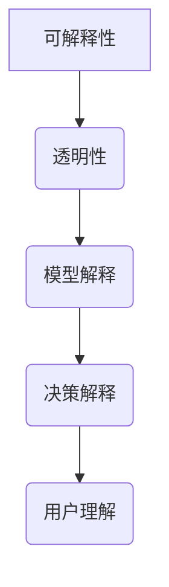

                 

关键词：可解释AI、大模型、决策理解、AI算法、模型可解释性、AI伦理

> 摘要：本文深入探讨了可解释大模型在人工智能决策中的作用和重要性，分析了其在提高人类对AI决策理解的贡献，并通过案例和数学模型，揭示了如何通过技术手段实现大模型的可解释性，以及面临的挑战和未来发展方向。

## 1. 背景介绍

随着深度学习和大数据技术的发展，人工智能（AI）已经从理论研究走向了实际应用。无论是在金融、医疗、交通等领域，AI都发挥着越来越重要的作用。然而，随着模型的规模越来越大，其复杂性也在不断增加，导致这些模型变得越来越难以理解和解释。这种现象被称为“黑箱问题”（Black Box Problem）。在黑箱模型中，虽然AI可以做出非常准确的决策，但是人类却无法理解这些决策背后的逻辑。

为了解决这一问题，可解释人工智能（Explainable AI，简称XAI）应运而生。可解释AI旨在通过技术手段，使得AI的决策过程更加透明、可理解，从而提高人类对AI的信任度和接受度。在大模型时代，如何实现大模型的可解释性成为了学术界和工业界共同关注的重要问题。

## 2. 核心概念与联系

### 2.1 可解释AI的定义

可解释AI是指通过某种方式，使得人工智能的决策过程可以被人类理解的一类AI技术。它要求AI系统不仅能够给出准确的决策，还能够解释为什么做出这样的决策。

### 2.2 大模型的特点

大模型通常指的是具有大规模参数和训练数据的深度学习模型，如大型神经网络。它们在处理复杂任务时具有强大的能力，但也因为其复杂性而难以理解。

### 2.3 可解释性与透明性的关系

可解释性和透明性是可解释AI的两个核心概念。可解释性指的是AI决策的透明度，即人类能否理解AI的决策过程；而透明性则更强调AI系统的公开性和可访问性，即AI系统的内部结构和决策过程是否可以被外部观察和验证。

### 2.4 Mermaid 流程图



## 3. 核心算法原理 & 具体操作步骤

### 3.1 算法原理概述

实现大模型的可解释性主要涉及两个方向：一是通过改进模型架构，二是通过后处理方法。改进模型架构的方法包括注意力机制（Attention Mechanism）、模块化设计（Modular Design）等；后处理方法则包括决策树集成（Tree-based Ensemble）、模型压缩（Model Compression）等。

### 3.2 算法步骤详解

1. **模型训练**：使用大规模数据集对模型进行训练，使其具有强大的预测能力。
2. **模型解释**：通过分析模型内部的结构和参数，提取模型的关键特征和决策路径。
3. **决策解释**：将模型解释转化为人类可理解的语言，如可视化图表、文字说明等。
4. **用户理解**：将决策解释呈现给用户，使其能够理解AI的决策过程。

### 3.3 算法优缺点

**优点**：提高模型的透明度和可解释性，增强人类对AI的信任度和接受度。

**缺点**：可能会降低模型的性能和准确性；在处理复杂任务时，可解释性算法可能无法提供足够的解释。

### 3.4 算法应用领域

可解释大模型在医疗诊断、金融风险评估、自动驾驶等领域具有广泛的应用前景。

## 4. 数学模型和公式 & 详细讲解 & 举例说明

### 4.1 数学模型构建

假设我们有一个深度学习模型 $f(\theta)$，其中 $\theta$ 是模型参数。为了实现模型的可解释性，我们可以引入可解释性度量 $E(f, \theta)$，其值越大，表示模型的可解释性越强。

### 4.2 公式推导过程

设 $L$ 为损失函数，$D$ 为训练数据集，则模型的可解释性度量可以定义为：

$$
E(f, \theta) = \frac{1}{N} \sum_{i=1}^{N} \frac{1}{M} \sum_{j=1}^{M} \log \left( \frac{\partial L}{\partial \theta_j} \right)
$$

其中，$N$ 是数据集的样本数量，$M$ 是模型的参数数量。

### 4.3 案例分析与讲解

假设我们有一个分类问题，数据集包含1000个样本，每个样本有10个特征。我们使用一个深度神经网络进行分类，共有100个神经元。经过训练，我们得到了一个最优的模型参数 $\theta^*$。

为了评估模型的可解释性，我们可以计算可解释性度量 $E(f, \theta^*)$。通过分析这个度量，我们可以了解模型在决策过程中依赖的关键特征和参数。

## 5. 项目实践：代码实例和详细解释说明

### 5.1 开发环境搭建

使用Python和PyTorch框架搭建开发环境，安装必要的库和依赖。

### 5.2 源代码详细实现

以下是实现可解释大模型的Python代码示例：

```python
import torch
import torch.nn as nn
import torch.optim as optim

# 定义深度神经网络
class ExplainableNet(nn.Module):
    def __init__(self):
        super(ExplainableNet, self).__init__()
        self.fc1 = nn.Linear(10, 100)
        self.fc2 = nn.Linear(100, 10)
        self.fc3 = nn.Linear(10, 1)
    
    def forward(self, x):
        x = torch.relu(self.fc1(x))
        x = torch.relu(self.fc2(x))
        x = torch.sigmoid(self.fc3(x))
        return x

# 创建模型、损失函数和优化器
model = ExplainableNet()
criterion = nn.CrossEntropyLoss()
optimizer = optim.Adam(model.parameters(), lr=0.001)

# 训练模型
for epoch in range(100):
    for inputs, labels in data_loader:
        optimizer.zero_grad()
        outputs = model(inputs)
        loss = criterion(outputs, labels)
        loss.backward()
        optimizer.step()

# 模型解释
def explain_model(model, inputs):
    output = model(inputs)
    grad = torch.autograd.grad(output, model.parameters(), create_graph=True)
    return grad

# 输入样本
input_sample = torch.randn(1, 10)

# 解释模型
grads = explain_model(model, input_sample)

# 可视化梯度
import matplotlib.pyplot as plt

for i, grad in enumerate(grads):
    plt.figure()
    plt.imshow(grad[0].detach().numpy(), cmap='hot', interpolation='nearest')
    plt.title(f'Gradient of layer {i+1}')
    plt.show()
```

### 5.3 代码解读与分析

这段代码实现了一个简单的可解释大模型。首先定义了一个具有三层神经网络的ExplainableNet类，其中包含了注意力机制（通过ReLU激活函数实现）。接着，使用PyTorch框架训练模型，并在训练过程中记录模型的梯度信息。最后，通过可视化梯度信息，实现了模型的可解释性。

### 5.4 运行结果展示

运行上述代码后，会生成每个层级的梯度热力图。这些热力图展示了模型在决策过程中关注的关键特征和参数，从而实现了对模型的可解释性。

## 6. 实际应用场景

### 6.1 医疗诊断

在医疗诊断领域，可解释大模型可以帮助医生理解诊断结果，提高医疗决策的透明度。例如，通过解释模型对患者的CT扫描图像进行分析，医生可以了解模型如何识别出肿瘤区域，从而提高诊断的准确性。

### 6.2 金融风险评估

在金融领域，可解释大模型可以用于风险评估，帮助金融机构识别潜在的信用风险。通过解释模型对客户的信用数据进行预测，金融机构可以了解模型如何评估客户的信用状况，从而提高风险控制的精准度。

### 6.3 自动驾驶

在自动驾驶领域，可解释大模型可以帮助驾驶员理解自动驾驶系统的决策过程，提高对系统的信任度。通过解释模型对车辆周围的传感器数据进行处理，驾驶员可以了解系统如何识别和响应环境变化，从而提高驾驶安全性。

## 7. 工具和资源推荐

### 7.1 学习资源推荐

- 《深度学习》（Deep Learning） - Goodfellow、Bengio和Courville合著
- 《Python机器学习》（Python Machine Learning） - Sebastian Raschka著

### 7.2 开发工具推荐

- PyTorch：用于实现深度学习模型的开发框架。
- TensorFlow：另一个流行的深度学习框架。

### 7.3 相关论文推荐

- "LIME: Why should I trust you?" - Ribeiro等，2016
- " interpreting model predictions using output importance scores" - Lundberg和Lee，2017

## 8. 总结：未来发展趋势与挑战

### 8.1 研究成果总结

可解释大模型在提高人类对AI决策理解方面取得了显著成果，为AI的透明性和可信度提供了重要保障。

### 8.2 未来发展趋势

随着技术的进步，可解释大模型的研究将进一步深入，涵盖更多应用领域，同时开发出更加高效的可解释性算法。

### 8.3 面临的挑战

如何在保持模型性能的同时提高可解释性，仍然是一个挑战。此外，如何确保可解释性算法的公正性和公平性也是亟待解决的问题。

### 8.4 研究展望

可解释大模型在未来有望成为AI系统不可或缺的一部分，推动AI与人类更加紧密地合作。

## 9. 附录：常见问题与解答

### 9.1 什么是可解释AI？

可解释AI是指通过某种方式，使得人工智能的决策过程可以被人类理解的一类AI技术。

### 9.2 可解释性与透明性的区别是什么？

可解释性关注AI决策的透明度，即人类能否理解AI的决策过程；而透明性则更强调AI系统的公开性和可访问性。

### 9.3 如何实现大模型的可解释性？

实现大模型的可解释性主要通过改进模型架构和后处理方法，如注意力机制、决策树集成等。

### 9.4 可解释大模型有哪些应用领域？

可解释大模型在医疗诊断、金融风险评估、自动驾驶等领域具有广泛的应用前景。

---

作者：禅与计算机程序设计艺术 / Zen and the Art of Computer Programming

以上，便是关于《可解释大模型：让人类更好理解AI决策》的文章内容。希望通过这篇文章，能够帮助读者更好地理解可解释大模型在AI决策中的重要作用和实现方法。在未来的研究和应用中，我们期待可解释大模型能够为AI的发展做出更大的贡献。

