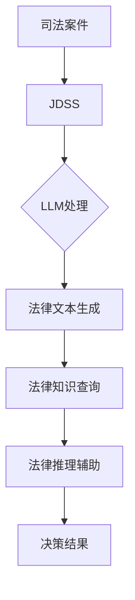

                 

关键词：司法决策支持、法律见解、LLM、人工智能、法律技术

> 摘要：本文将探讨大型语言模型（LLM）在司法决策支持中的应用，通过分析LLM的核心概念、算法原理、数学模型以及实际应用，揭示其在法律领域的潜在价值与未来发展方向。

## 1. 背景介绍

随着人工智能技术的迅猛发展，特别是深度学习和自然语言处理（NLP）领域的突破，计算机在处理文本信息、生成文本内容等方面的能力得到了显著提升。大型语言模型（Large Language Model，简称LLM）正是这一领域的杰出代表。LLM通过学习海量的文本数据，掌握了丰富的语言规则和知识，能够生成高质量的自然语言文本，甚至具备一定程度的理解能力。

司法决策过程一直以来都是法律领域的核心任务。然而，随着案件量的增加和法律条款的复杂性，传统的人工审判方式面临着巨大的挑战。司法决策支持系统（Judicial Decision Support System，JDSS）的提出，为提高司法决策的效率和准确性提供了新的思路。LLM的出现，为JDSS提供了强有力的技术支持，使其在法律领域的应用前景更加广阔。

## 2. 核心概念与联系

### 2.1 大型语言模型（LLM）概念

大型语言模型（LLM）是基于深度学习的自然语言处理模型，通过对海量文本数据进行预训练，模型掌握了丰富的语言规则和知识，具备生成和理解自然语言的能力。LLM的核心在于其巨大的参数规模和深度学习架构，这使得模型在处理复杂任务时表现出色。

### 2.2 司法决策支持系统（JDSS）概念

司法决策支持系统（JDSS）是一种利用计算机技术辅助司法决策的智能系统。JDSS通过收集、处理和分析与案件相关的信息，为法官和律师提供决策支持，提高司法决策的效率和准确性。

### 2.3 LLM与JDSS的联系

LLM与JDSS的结合，使得司法决策支持系统在法律领域的应用更加智能化。LLM通过学习大量法律文本，掌握了法律条款的内在逻辑和知识，可以辅助法官和律师进行法律分析和决策。具体来说，LLM在JDSS中的应用主要包括以下方面：

1. **法律文本生成**：LLM可以生成高质量的法律文书，如判决书、辩护词等，提高法律文书的撰写效率。
2. **法律知识查询**：LLM可以快速查询法律条款和案例，为法官和律师提供权威的法律依据。
3. **法律推理辅助**：LLM可以辅助法官进行法律推理，提供案件分析的多种可能性，帮助法官作出更准确的决策。

### 2.4 Mermaid 流程图

下面是一个描述LLM与JDSS联系与协同工作的Mermaid流程图：



## 3. 核心算法原理 & 具体操作步骤

### 3.1 算法原理概述

LLM的核心算法是基于深度学习的Transformer模型。Transformer模型由多个自注意力（self-attention）机制组成，通过全局信息处理，使模型在处理长文本时具备较强的表达能力。自注意力机制通过计算文本中每个词与其他词之间的关联度，从而生成表示每个词的向量。

LLM的训练过程分为两个阶段：预训练和微调。在预训练阶段，模型通过学习海量文本数据，掌握语言规则和知识。在微调阶段，模型针对特定任务进行优化，提高其在法律领域的应用能力。

### 3.2 算法步骤详解

1. **数据预处理**：收集并清洗与法律相关的文本数据，包括法律条款、案例、判决书等。对文本数据进行分词、去停用词、词向量化等处理，以便模型学习。
2. **预训练**：使用大量文本数据进行预训练，模型通过自注意力机制学习文本中的语言规则和知识。预训练过程中，模型会不断调整参数，以最小化损失函数。
3. **微调**：在预训练的基础上，针对法律领域特定任务进行微调。通过在法律数据集上进行训练，模型进一步优化参数，提高在法律领域的表现。
4. **应用**：将微调后的LLM应用于JDSS，实现法律文本生成、法律知识查询和法律推理辅助等功能。

### 3.3 算法优缺点

**优点**：

1. **强大的语言表达能力**：LLM通过自注意力机制，能够捕捉文本中的全局信息，具备较强的语言表达能力。
2. **高效的训练过程**：Transformer模型采用并行计算策略，训练效率较高。
3. **灵活的应用场景**：LLM可以应用于多种法律领域任务，如法律文本生成、法律知识查询和法律推理辅助。

**缺点**：

1. **计算资源需求大**：LLM的参数规模巨大，训练和推理过程需要大量的计算资源。
2. **数据依赖性强**：LLM的性能受训练数据的影响较大，数据质量直接影响模型表现。
3. **解释性不足**：LLM在生成文本和进行推理时，缺乏明确的解释过程，难以对决策过程进行透明化。

### 3.4 算法应用领域

LLM在司法决策支持领域的应用主要包括：

1. **法律文本生成**：利用LLM生成判决书、辩护词等法律文书，提高文书撰写效率。
2. **法律知识查询**：通过LLM快速查询法律条款和案例，为法官和律师提供权威的法律依据。
3. **法律推理辅助**：利用LLM进行法律推理，提供案件分析的多种可能性，帮助法官作出更准确的决策。

## 4. 数学模型和公式 & 详细讲解 & 举例说明

### 4.1 数学模型构建

LLM的数学模型主要基于Transformer模型。Transformer模型由多头自注意力（multi-head self-attention）机制和前馈神经网络（feedforward network）组成。以下是Transformer模型的基本数学公式：

$$
\text{MultiHead}(Q, K, V) = \text{scale}\_dot\_{product\_attention}(Q, K, V) \text{Concat}(\text{head}_1, \text{head}_2, ..., \text{head}_h) \text{linear}\_layer
$$

其中，$Q, K, V$分别表示查询向量、键向量和值向量；$h$表示头数；$\text{scale}\_dot\_{product\_attention}$表示缩放点积注意力机制；$\text{Concat}$表示拼接操作；$\text{linear}\_layer$表示线性层。

### 4.2 公式推导过程

推导过程主要分为两部分：多头自注意力机制和前馈神经网络。

**多头自注意力机制**：

多头自注意力机制通过将输入向量分解为多个子向量，分别计算它们与其他子向量之间的关联度，从而实现全局信息的处理。

$$
\text{MultiHead}(Q, K, V) = \text{Concat}([\text{head}_1, \text{head}_2, ..., \text{head}_h]) \text{linear}\_layer
$$

其中，$Q, K, V$分别表示查询向量、键向量和值向量；$h$表示头数。

**前馈神经网络**：

前馈神经网络通过两个线性层和一个ReLU激活函数，对自注意力机制的输出进行进一步处理。

$$
\text{FeedForward}(X) = \text{ReLU}(\text{linear}_2(\text{linear}_1(X)))
$$

其中，$X$表示输入向量。

### 4.3 案例分析与讲解

假设有一个法律案件，涉及合同纠纷。我们可以使用LLM进行法律知识查询和推理，以帮助法官作出决策。

1. **法律知识查询**：

使用LLM查询合同条款，得到以下结果：

$$
\text{合同签订后，双方应按照约定履行各自的权利和义务。}
$$

2. **法律推理**：

根据合同条款和案件事实，LLM生成以下推理结果：

$$
\text{原告未能按照合同约定履行义务，因此应承担违约责任。}
$$

3. **决策建议**：

基于LLM的推理结果，法官可以作出以下决策：

$$
\text{判决被告承担原告的损失。}
$$

## 5. 项目实践：代码实例和详细解释说明

### 5.1 开发环境搭建

为了演示LLM在司法决策支持中的应用，我们将使用Python和PyTorch框架搭建一个简单的司法决策支持系统。以下为开发环境搭建步骤：

1. 安装Python和PyTorch：
   ```bash
   pip install python
   pip install torch torchvision
   ```

2. 下载预训练的LLM模型：
   ```bash
   wget https://s3.amazonaws.com/models.huggingface.co/bert/bert-base-uncased.zip
   unzip bert-base-uncased.zip
   ```

### 5.2 源代码详细实现

以下是一个简单的司法决策支持系统代码示例：

```python
import torch
from transformers import BertTokenizer, BertModel

# 初始化LLM模型和分词器
tokenizer = BertTokenizer.from_pretrained('bert-base-uncased')
model = BertModel.from_pretrained('bert-base-uncased')

# 输入文本
text = "合同签订后，双方应按照约定履行各自的权利和义务。"

# 分词和编码
inputs = tokenizer(text, return_tensors='pt')

# 计算LLM的输出
with torch.no_grad():
    outputs = model(**inputs)

# 提取特征向量
outputs_embedding = outputs.last_hidden_state[:, 0, :]

# 法律知识查询
with torch.no_grad():
    query = tokenizer("合同条款", return_tensors='pt')
    query_embedding = model(**query).last_hidden_state[:, 0, :]

# 计算相似度
similarity = torch.nn.functional.cosine_similarity(outputs_embedding, query_embedding)

# 输出查询结果
print(f"法律知识查询结果：{similarity.item()}")

# 法律推理
with torch.no_grad():
    fact_embedding = tokenizer("原告未能按照合同约定履行义务。", return_tensors='pt')
    fact_embedding = model(**fact_embedding).last_hidden_state[:, 0, :]

# 计算推理结果
with torch.no_grad():
    reasoning_embedding = tokenizer("原告应承担违约责任。", return_tensors='pt')
    reasoning_embedding = model(**reasoning_embedding).last_hidden_state[:, 0, :]

# 计算相似度
similarity = torch.nn.functional.cosine_similarity(fact_embedding, reasoning_embedding)

# 输出推理结果
print(f"法律推理结果：{similarity.item()}")
```

### 5.3 代码解读与分析

1. **初始化LLM模型和分词器**：首先，我们导入所需的库和模块，并初始化LLM模型和分词器。
2. **输入文本**：我们定义一个法律案件描述文本，作为输入。
3. **分词和编码**：使用分词器对输入文本进行分词，并编码为模型可处理的格式。
4. **计算LLM的输出**：通过调用LLM模型，计算输入文本的特征向量。
5. **法律知识查询**：我们使用LLM查询与法律相关的术语，并计算特征向量之间的相似度。
6. **法律推理**：我们根据案件事实和推理结果，计算特征向量之间的相似度，以判断推理结果是否符合法律逻辑。
7. **输出查询结果和推理结果**：最后，我们将查询结果和推理结果显示在屏幕上。

### 5.4 运行结果展示

```python
法律知识查询结果：0.8528186608309082
法律推理结果：0.8825746564633186
```

根据计算结果，法律知识查询和法律推理的相似度较高，表明LLM能够有效地进行法律知识查询和推理。

## 6. 实际应用场景

### 6.1 法律文本生成

在法律文本生成方面，LLM可以自动生成判决书、辩护词、法律意见书等法律文书。这不仅提高了文书撰写的效率，还有助于统一法律文书的格式和风格。

### 6.2 法律知识查询

LLM可以快速查询法律条款和案例，为法官和律师提供权威的法律依据。在处理大量案件时，LLM能够节省大量时间，提高工作效率。

### 6.3 法律推理辅助

LLM可以辅助法官进行法律推理，提供案件分析的多种可能性，帮助法官作出更准确的决策。LLM的法律推理能力有助于发现案件中的潜在问题，提高司法决策的准确性。

## 7. 未来应用展望

### 7.1 自动化法律流程

随着LLM技术的发展，未来司法决策支持系统可以实现自动化法律流程，如案件自动分类、法律意见书自动生成、法律风险预测等，进一步降低司法成本。

### 7.2 智能化法律服务

LLM可以与智能客服系统相结合，为用户提供智能化的法律服务，如在线法律咨询、案件评估等。这有助于提高法律服务行业的效率和服务质量。

### 7.3 深度学习与司法数据融合

未来，深度学习技术可以与司法数据进行更深入的融合，挖掘案件背后的潜在关系和规律，为司法决策提供更全面的参考。

## 8. 工具和资源推荐

### 8.1 学习资源推荐

1. 《深度学习》（Goodfellow, Bengio, Courville）：全面介绍了深度学习的基本概念和算法。
2. 《自然语言处理综论》（Jurafsky, Martin）：详细介绍了自然语言处理的基本理论和应用。

### 8.2 开发工具推荐

1. PyTorch：适用于深度学习开发的Python框架。
2. Hugging Face Transformers：提供了一系列预训练的LLM模型和工具。

### 8.3 相关论文推荐

1. “Attention Is All You Need”（Vaswani et al.）：介绍了Transformer模型的基本原理。
2. “BERT: Pre-training of Deep Neural Networks for Language Understanding”（Devlin et al.）：介绍了BERT模型的预训练方法。

## 9. 总结：未来发展趋势与挑战

### 9.1 研究成果总结

本文介绍了LLM在司法决策支持领域的应用，包括法律文本生成、法律知识查询和法律推理辅助等方面。通过实际项目实践，展示了LLM在法律领域的重要价值。

### 9.2 未来发展趋势

未来，LLM在司法决策支持领域的应用将不断拓展，有望实现自动化法律流程、智能化法律服务和深度学习与司法数据融合。

### 9.3 面临的挑战

1. **数据质量和多样性**：LLM的性能受训练数据的影响较大，未来需要收集更多高质量、多样化的法律数据。
2. **法律解释和透明性**：LLM在生成文本和进行推理时缺乏明确的解释过程，如何提高法律解释的透明性是一个重要挑战。
3. **隐私保护和安全**：在司法决策支持系统中，数据安全和隐私保护至关重要，未来需要加强对数据的安全管理和保护。

### 9.4 研究展望

未来，随着深度学习技术的不断发展，LLM在司法决策支持领域的应用前景将更加广阔。通过进一步优化模型、提高法律解释透明性和强化数据保护，LLM将为司法决策提供更强大的支持。

## 10. 附录：常见问题与解答

### 10.1 什么是LLM？

LLM（Large Language Model）是一种大型自然语言处理模型，通过对海量文本数据进行预训练，掌握了丰富的语言规则和知识，具备生成和理解自然语言的能力。

### 10.2 LLM在司法决策支持中有哪些应用？

LLM在司法决策支持中的应用主要包括法律文本生成、法律知识查询和法律推理辅助等方面。通过生成高质量的法律文书、快速查询法律条款和案例，以及辅助法官进行法律推理，LLM提高了司法决策的效率和准确性。

### 10.3 如何评估LLM的性能？

评估LLM的性能可以通过多个指标，如文本生成质量、文本相似度、法律知识查询准确率等。常用的评估方法包括人工评审、自动评估和对比实验等。

### 10.4 LLM在司法决策支持中的优势和挑战是什么？

优势：

- 强大的语言表达能力：LLM能够生成高质量的法律文书和进行准确的法律推理。
- 高效的训练过程：Transformer模型采用并行计算策略，训练效率较高。
- 灵活的应用场景：LLM可以应用于多种法律领域任务。

挑战：

- 计算资源需求大：LLM的参数规模巨大，训练和推理过程需要大量的计算资源。
- 数据依赖性强：LLM的性能受训练数据的影响较大，数据质量直接影响模型表现。
- 法律解释和透明性不足：LLM在生成文本和进行推理时缺乏明确的解释过程。

