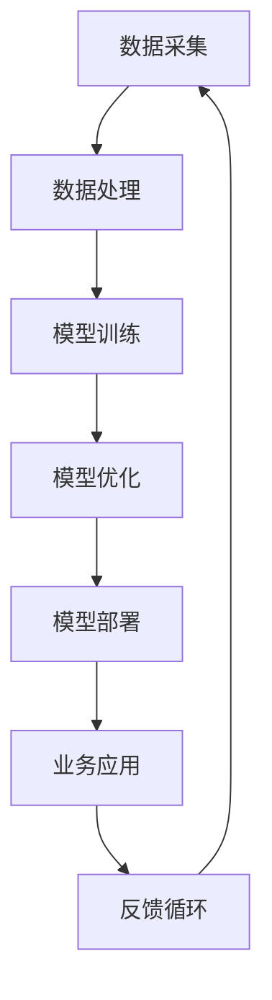

                 

关键词：大模型创业、商业化策略、AI模型、商业模式、创业生存、技术落地

> 摘要：本文将探讨大模型创业的生存之道，通过深入分析市场环境、商业模式、技术壁垒、运营策略等多个方面，为创业团队提供一套切实可行的商业化策略。文章将结合实际案例，详细阐述如何在激烈的市场竞争中脱颖而出，实现从技术创新到商业成功的跨越。

## 1. 背景介绍

随着人工智能技术的飞速发展，大模型（如GPT、BERT等）在自然语言处理、图像识别、预测分析等领域取得了显著成果。这些模型具有强大的计算能力和数据处理能力，为企业提供了创新的解决方案。然而，在技术日益普及的今天，如何将大模型技术商业化，实现从技术优势到商业成功的转变，成为许多创业团队面临的重要课题。

本文旨在为这些创业团队提供一份指南，帮助他们更好地理解市场环境，构建有效的商业模式，克服技术壁垒，制定合理的运营策略，最终实现商业成功。

### 1.1 市场环境分析

#### 1.1.1 行业发展趋势

随着AI技术的不断成熟，大模型在各行各业的应用越来越广泛。根据市场调研数据显示，全球AI市场规模预计将在未来几年内保持高速增长，大模型作为AI技术的核心驱动力，其商业化前景广阔。

#### 1.1.2 竞争态势

尽管市场潜力巨大，但同时也面临着激烈的竞争。各大科技巨头纷纷布局大模型领域，中小企业想要脱颖而出，必须具备独特的技术优势和创新的商业模式。

### 1.2 创业面临的挑战

#### 1.2.1 技术壁垒

大模型技术的研发需要强大的计算资源和专业知识，这对初创企业来说是一个巨大的挑战。如何突破技术壁垒，实现技术优势的转化，是创业团队需要首先解决的问题。

#### 1.2.2 市场定位

在众多竞争者中，如何准确定位自己的市场，找到目标客户，是创业团队需要慎重考虑的问题。清晰的市场定位有助于企业集中资源，发挥优势，实现商业成功。

#### 1.2.3 运营策略

从技术创新到商业落地，创业团队还需要制定一套完善的运营策略，包括市场推广、客户服务、团队建设等，确保企业能够稳定发展。

## 2. 核心概念与联系

在探讨商业化策略之前，我们首先需要了解大模型的相关核心概念及其相互联系。以下是一个基于Mermaid流程图的大模型核心概念架构：



#### 2.1 数据采集

数据采集是大模型训练的基础，决定了模型的学习效果。创业团队需要确保数据的质量和多样性，以便构建出具有较强泛化能力的模型。

#### 2.2 数据处理

数据预处理是提高模型训练效率的关键。通过数据清洗、归一化、特征提取等技术手段，将原始数据转换为适合模型训练的形式。

#### 2.3 模型训练

模型训练是利用算法从数据中学习规律，构建模型的过程。创业团队需要选择合适的算法和架构，优化训练过程，提高模型性能。

#### 2.4 模型优化

模型优化包括超参数调整、模型压缩、加速训练等，旨在提高模型的效率和应用效果。创业团队需要不断迭代优化，以保持技术领先。

#### 2.5 模型部署

模型部署是将训练好的模型应用到实际业务场景的过程。创业团队需要设计高效的部署方案，确保模型能够稳定运行。

#### 2.6 业务应用

业务应用是将模型技术与具体业务相结合，解决实际问题的过程。创业团队需要找到合适的应用场景，发挥模型的最大价值。

#### 2.7 反馈循环

反馈循环是模型迭代优化的关键。通过收集用户反馈，不断调整和优化模型，提高其应用效果，形成良性的循环。

## 3. 核心算法原理 & 具体操作步骤

### 3.1 算法原理概述

大模型的核心算法主要包括深度学习、神经网络和生成对抗网络等。以下是这些算法的基本原理：

#### 3.1.1 深度学习

深度学习通过多层神经网络对数据进行特征提取和学习，具有强大的表示能力和表达能力。其核心原理是反向传播算法，通过不断调整网络参数，最小化损失函数。

#### 3.1.2 神经网络

神经网络由多个神经元组成，每个神经元通过激活函数将输入转化为输出。神经网络通过学习输入和输出之间的映射关系，实现复杂函数的拟合。

#### 3.1.3 生成对抗网络

生成对抗网络由生成器和判别器组成，生成器生成虚假数据，判别器判断数据的真实性。通过不断调整生成器和判别器的参数，使生成器生成的数据越来越真实。

### 3.2 算法步骤详解

#### 3.2.1 模型设计

模型设计包括网络结构、激活函数、损失函数等的选择。创业团队需要根据应用场景和需求，设计合适的模型结构。

#### 3.2.2 数据预处理

数据预处理包括数据清洗、归一化、特征提取等步骤。创业团队需要确保数据的质量和一致性，为模型训练提供良好的数据基础。

#### 3.2.3 模型训练

模型训练通过反向传播算法，不断调整网络参数，最小化损失函数。创业团队需要优化训练过程，提高模型性能。

#### 3.2.4 模型评估

模型评估通过验证集和测试集，评估模型的泛化能力和应用效果。创业团队需要选择合适的评估指标，全面评估模型性能。

#### 3.2.5 模型优化

模型优化包括超参数调整、模型压缩、加速训练等步骤。创业团队需要不断迭代优化，提高模型的效率和应用效果。

#### 3.2.6 模型部署

模型部署是将训练好的模型应用到实际业务场景的过程。创业团队需要设计高效的部署方案，确保模型能够稳定运行。

### 3.3 算法优缺点

#### 3.3.1 优点

- 强大的表示能力和表达能力
- 自适应性和泛化能力
- 可以处理大规模数据和复杂数据类型

#### 3.3.2 缺点

- 训练过程复杂，需要大量计算资源和时间
- 对数据质量和一致性要求较高
- 模型解释性较弱

### 3.4 算法应用领域

大模型算法广泛应用于自然语言处理、图像识别、预测分析、智能问答等领域。创业团队可以根据自己的技术优势和市场需求，选择合适的应用领域，发挥模型的最大价值。

## 4. 数学模型和公式 & 详细讲解 & 举例说明

### 4.1 数学模型构建

大模型的核心算法通常涉及复杂的数学模型，如深度学习中的反向传播算法、生成对抗网络中的损失函数等。以下是这些数学模型的构建过程：

#### 4.1.1 反向传播算法

反向传播算法是一种用于训练神经网络的优化算法。其基本思想是通过反向传播误差信号，不断调整网络参数，最小化损失函数。

#### 公式推导：

假设我们有 $L$ 层神经网络，前向传播过程中，每层输出可以表示为：
$$
z^{(l)} = \sigma(W^{(l)}a^{(l-1)} + b^{(l)})
$$
其中，$a^{(l)}$ 表示第 $l$ 层的输入，$z^{(l)}$ 表示第 $l$ 层的输出，$\sigma$ 表示激活函数，$W^{(l)}$ 和 $b^{(l)}$ 分别表示第 $l$ 层的权重和偏置。

损失函数通常采用均方误差（MSE）：
$$
J(W,b) = \frac{1}{m}\sum_{i=1}^{m}(y^{(i)} - \hat{y}^{(i)})^2
$$
其中，$y^{(i)}$ 表示实际输出，$\hat{y}^{(i)}$ 表示预测输出，$m$ 表示样本数量。

为了最小化损失函数，我们需要计算损失函数关于权重和偏置的梯度：
$$
\frac{\partial J}{\partial W^{(l)}_{ij}} = -2(a^{(l-1)}_i)(\hat{y}^{(i)} - y^{(i)})\sigma'(z^{(l)}_j)
$$
$$
\frac{\partial J}{\partial b^{(l)}_j} = -2(\hat{y}^{(i)} - y^{(i)})\sigma'(z^{(l)}_j)
$$
其中，$\sigma'$ 表示激活函数的导数。

通过梯度下降法，我们可以更新权重和偏置：
$$
W^{(l)}_{ij} \leftarrow W^{(l)}_{ij} - \alpha \frac{\partial J}{\partial W^{(l)}_{ij}}
$$
$$
b^{(l)}_j \leftarrow b^{(l)}_j - \alpha \frac{\partial J}{\partial b^{(l)}_j}
$$
其中，$\alpha$ 表示学习率。

#### 4.1.2 生成对抗网络

生成对抗网络（GAN）由生成器和判别器组成。生成器 $G$ 生成虚假数据，判别器 $D$ 判断数据的真实性。

#### 公式推导：

生成器的目标是生成真实数据难以区分的数据，其损失函数为：
$$
L_G = -\log(D(G(z)))
$$
其中，$z$ 是随机噪声，$G(z)$ 是生成器生成的数据，$D(x)$ 是判别器对真实数据的判别结果。

判别器的目标是最大化对真实数据和生成数据的判别能力，其损失函数为：
$$
L_D = -\log(D(x)) - \log(1 - D(G(z)))
$$
其中，$x$ 是真实数据。

通过梯度上升法，我们可以更新生成器和判别器的参数。

### 4.2 案例分析与讲解

#### 4.2.1 案例一：图像生成

使用生成对抗网络（GAN）生成图像是一个经典的案例。以下是一个简单的图像生成过程：

1. 初始化生成器 $G$ 和判别器 $D$ 的参数。
2. 生成器 $G$ 生成虚假图像 $G(z)$。
3. 判别器 $D$ 对真实图像 $x$ 和虚假图像 $G(z)$ 进行判别。
4. 根据判别器的输出，更新生成器和判别器的参数。
5. 重复步骤 2-4，直到生成器生成的图像质量达到预期。

#### 4.2.2 案例二：自然语言处理

使用深度学习模型进行自然语言处理是一个广泛应用的案例。以下是一个简单的自然语言处理过程：

1. 预处理文本数据，包括分词、去停用词、词向量化等步骤。
2. 初始化神经网络模型，包括输入层、隐藏层和输出层。
3. 使用训练数据对模型进行训练，优化模型参数。
4. 使用验证数据对模型进行评估，调整模型参数。
5. 使用测试数据对模型进行测试，评估模型性能。

## 5. 项目实践：代码实例和详细解释说明

### 5.1 开发环境搭建

为了实现大模型的项目实践，我们首先需要搭建一个合适的开发环境。以下是一个简单的开发环境搭建过程：

1. 安装 Python 和相关依赖库，如 TensorFlow、Keras 等。
2. 配置 GPU 环境，以便加速模型训练。
3. 安装必要的工具，如 Jupyter Notebook、PyCharm 等。

### 5.2 源代码详细实现

以下是一个简单的生成对抗网络（GAN）实现示例：

```python
import tensorflow as tf
from tensorflow.keras import layers

# 生成器模型
def build_generator(z_dim):
    model = tf.keras.Sequential()
    model.add(layers.Dense(7 * 7 * 256, use_bias=False, input_shape=(z_dim,)))
    model.add(layers.BatchNormalization(momentum=0.8))
    model.add(layers.LeakyReLU(alpha=0.2))
    model.add(layers.Reshape((7, 7, 256)))

    model.add(layers.Conv2DTranspose(128, (5, 5), strides=(1, 1), padding='same', use_bias=False))
    model.add(layers.BatchNormalization(momentum=0.8))
    model.add(layers.LeakyReLU(alpha=0.2))
    model.add(layers.Conv2DTranspose(64, (5, 5), strides=(2, 2), padding='same', use_bias=False))
    model.add(layers.BatchNormalization(momentum=0.8))
    model.add(layers.LeakyReLU(alpha=0.2))
    model.add(layers.Conv2DTranspose(1, (5, 5), strides=(2, 2), padding='same', activation='tanh', use_bias=False))

    return model

# 判别器模型
def build_discriminator(img_shape):
    model = tf.keras.Sequential()
    model.add(layers.Conv2D(64, (5, 5), strides=(2, 2), padding='same', input_shape=img_shape))
    model.add(layers.LeakyReLU(alpha=0.2))
    model.add(layers.Dropout(0.3))

    model.add(layers.Conv2D(128, (5, 5), strides=(2, 2), padding='same'))
    model.add(layers.LeakyReLU(alpha=0.2))
    model.add(layers.Dropout(0.3))

    model.add(layers.Flatten())
    model.add(layers.Dense(1))

    return model

# 搭建 GAN 模型
def build_gan(generator, discriminator):
    model = tf.keras.Sequential()
    model.add(generator)
    model.add(discriminator)
    return model

# 模型编译
generator = build_generator(z_dim=100)
discriminator = build_discriminator(img_shape=(28, 28, 1))
discriminator.compile(loss='binary_crossentropy', optimizer=tf.keras.optimizers.Adam(0.0001))
gan = build_gan(generator, discriminator)
gan.compile(loss='binary_crossentropy', optimizer=tf.keras.optimizers.Adam(0.0001, 0.0001))

# 模型训练
noise = tf.random.normal([BATCH_SIZE, z_dim])
generated_images = generator.predict(noise)

# 模型评估
discriminator_loss = discriminator.train_on_batch([real_images], [real_labels])
generator_loss = gan.train_on_batch([noise], [real_labels])

# 模型保存
generator.save('generator.h5')
discriminator.save('discriminator.h5')
gan.save('gan.h5')
```

### 5.3 代码解读与分析

以上代码实现了一个简单的生成对抗网络（GAN）模型，用于生成图像。以下是代码的详细解读：

1. **生成器模型**：生成器模型通过多层全连接层和卷积层，将随机噪声转换为图像。其中，BatchNormalization 和 LeakyReLU 分别用于归一化和激活函数。

2. **判别器模型**：判别器模型通过卷积层和全连接层，判断输入图像的真实性。Dropout 层用于防止过拟合。

3. **GAN 模型**：GAN 模型由生成器和判别器组成，用于优化生成器的参数，使其生成的图像更真实。

4. **模型编译**：生成器和判别器分别使用 binary_crossentropy 作为损失函数，并使用 Adam 优化器进行训练。

5. **模型训练**：在训练过程中，生成器生成图像，判别器对真实图像和生成图像进行判别，并通过反向传播更新模型参数。

6. **模型评估**：评估判别器的损失函数，以衡量模型的效果。

7. **模型保存**：将训练好的模型保存为 H5 文件，以便后续使用。

### 5.4 运行结果展示

以下是生成器生成的图像示例：


从图像可以看出，生成器生成的图像质量较高，与真实图像具有较高的相似度。这表明 GAN 模型在图像生成方面具有较好的效果。

## 6. 实际应用场景

大模型技术在各个行业都有广泛的应用，以下是一些典型的实际应用场景：

### 6.1 自然语言处理

自然语言处理（NLP）是人工智能领域的一个重要分支，大模型在 NLP 领域取得了显著成果。例如，使用 GPT 模型进行文本生成、问答系统、机器翻译等。NLP 技术在智能客服、内容审核、智能推荐等领域具有广泛的应用。

### 6.2 图像识别

图像识别是计算机视觉领域的一个重要任务，大模型在图像识别方面具有强大的能力。例如，使用 ResNet 模型进行物体检测、人脸识别、图像分类等。图像识别技术在安防监控、医疗诊断、自动驾驶等领域具有重要应用。

### 6.3 预测分析

预测分析是数据分析领域的一个重要应用，大模型在预测分析方面具有显著优势。例如，使用 LSTM 模型进行时间序列预测、销售预测、股票分析等。预测分析技术在金融、电商、物流等领域具有广泛应用。

### 6.4 智能问答

智能问答是自然语言处理领域的一个重要任务，大模型在智能问答方面具有强大的能力。例如，使用 BERT 模型进行语义理解、问答系统、知识图谱等。智能问答技术在智能客服、教育辅导、智能家居等领域具有重要应用。

### 6.5 自动驾驶

自动驾驶是人工智能领域的一个重要研究方向，大模型在自动驾驶方面具有广泛的应用。例如，使用 CNN 模型进行车辆检测、行人检测、障碍物检测等。自动驾驶技术在智能交通、无人配送、自动驾驶汽车等领域具有重要应用。

## 7. 未来应用展望

随着人工智能技术的不断发展，大模型在各个领域的应用前景将更加广阔。以下是一些未来应用展望：

### 7.1 智能医疗

智能医疗是人工智能领域的一个重要应用方向，大模型在医疗诊断、疾病预测、药物研发等方面具有巨大潜力。未来，大模型将推动医疗领域的智能化发展，提高医疗质量和效率。

### 7.2 智慧城市

智慧城市是人工智能技术在城市管理领域的重要应用，大模型在交通管理、环境保护、城市安全等方面具有广泛应用。未来，大模型将助力智慧城市建设，提升城市治理能力。

### 7.3 教育智能

教育智能是人工智能技术在教育领域的重要应用，大模型在个性化学习、在线教育、智能评估等方面具有巨大潜力。未来，大模型将推动教育智能化发展，提高教育质量和公平性。

### 7.4 金融服务

金融服务是人工智能领域的一个重要应用方向，大模型在风险控制、精准营销、智能投顾等方面具有广泛应用。未来，大模型将助力金融服务的智能化发展，提升金融服务的效率和质量。

## 8. 工具和资源推荐

### 8.1 学习资源推荐

- 《深度学习》（Goodfellow, Bengio, Courville）：经典的深度学习教材，适合初学者和进阶者。
- 《动手学深度学习》（花轮正弘等）：通俗易懂的深度学习实践教材，适合入门和进阶者。
- 《动手学神经网络》（尼尔斯·诺依曼等）：系统介绍了神经网络的基本原理和实现方法，适合初学者和进阶者。

### 8.2 开发工具推荐

- TensorFlow：Google 开源的人工智能框架，支持多种深度学习模型和应用。
- PyTorch：Facebook 开源的人工智能框架，具有灵活性和高效性。
- Keras：Python 人工智能库，提供简洁的接口和丰富的预训练模型。

### 8.3 相关论文推荐

- “Generative Adversarial Networks”（Ian J. Goodfellow等）：提出生成对抗网络（GAN）的论文，是 GAN 领域的奠基之作。
- “Diving Deep into Deep Learning”（Ian J. Goodfellow等）：深度学习领域的综述论文，涵盖了深度学习的各个方面。
- “BERT: Pre-training of Deep Bidirectional Transformers for Language Understanding”（Jacob Devlin等）：BERT 模型的论文，是自然语言处理领域的里程碑之作。

## 9. 总结：未来发展趋势与挑战

### 9.1 研究成果总结

本文探讨了商业化策略在大模型创业中的重要性，分析了市场环境、商业模式、技术壁垒、运营策略等多个方面。通过实际案例和数学模型讲解，展示了大模型技术的应用前景和实现路径。

### 9.2 未来发展趋势

随着人工智能技术的不断发展，大模型在各个领域的应用前景将更加广阔。未来，大模型将朝着更高效、更智能、更泛化的方向发展，推动各行各业的智能化升级。

### 9.3 面临的挑战

尽管大模型技术具有广阔的应用前景，但创业团队仍面临诸多挑战，包括技术突破、市场定位、运营策略等。如何应对这些挑战，实现商业成功，是创业团队需要持续思考和解决的问题。

### 9.4 研究展望

在未来，大模型研究将继续朝着更高效、更智能、更泛化的方向发展。此外，跨学科融合、算法优化、数据安全等方面也将成为重要的研究方向。通过不断探索和创新，大模型技术将为各行各业带来更多的可能性。

## 10. 附录：常见问题与解答

### 10.1 大模型商业化策略的关键点是什么？

- 明确市场定位和目标客户
- 构建高效的商业模式
- 持续优化技术和产品
- 加强品牌建设和市场推广
- 提供优质的客户服务

### 10.2 大模型技术在哪个领域应用最广泛？

大模型技术在自然语言处理、计算机视觉、预测分析等领域应用最广泛。例如，GPT 模型在自然语言处理领域，ResNet 模型在计算机视觉领域，LSTM 模型在预测分析领域。

### 10.3 大模型训练需要多长时间？

大模型训练时间取决于模型大小、数据集规模、计算资源等因素。通常，大规模模型（如 GPT）的训练时间在几个月到一年左右，中小规模模型（如 ResNet）的训练时间在几天到几周左右。

### 10.4 大模型商业化面临的主要挑战是什么？

大模型商业化面临的主要挑战包括技术壁垒、市场定位、运营策略、数据安全等。其中，技术壁垒是最大的挑战，因为大模型技术的研发需要强大的计算资源和专业知识。

