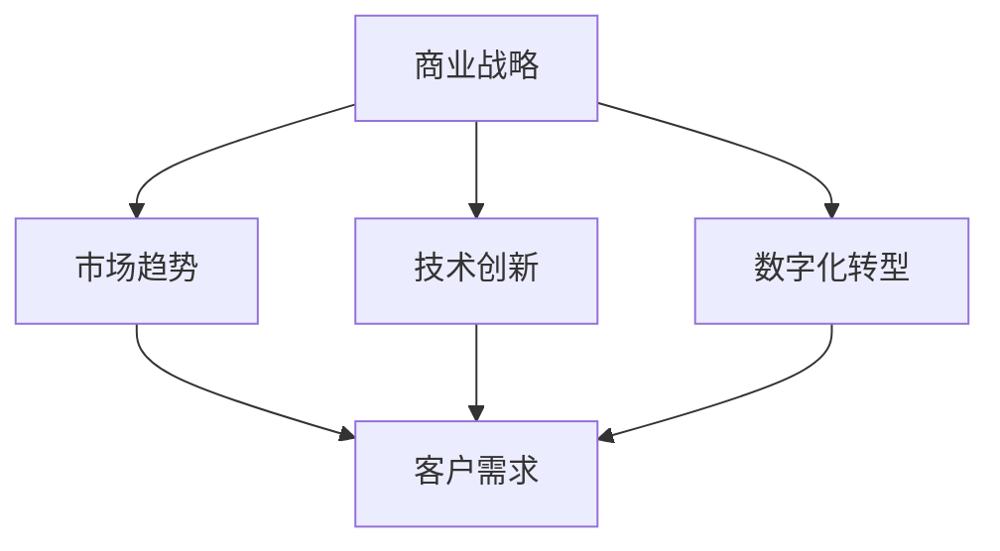

                 

关键词：商业竞争、战略分析、市场趋势、技术创新、数字化转型

摘要：随着科技的发展和社会的进步，商业领域的竞争格局正在发生深刻的变革。本文将探讨这些变化，分析其背后的原因，并探讨企业在新的竞争环境中如何制定有效的战略，以保持竞争优势。

## 1. 背景介绍

在过去几十年中，商业领域经历了多次重大的变革。从制造业的兴起，到服务业的蓬勃发展，再到电子商务的崛起，每一个阶段都带来了新的机遇和挑战。然而，当前的商业环境正面临着前所未有的复杂性，这主要体现在以下几个方面：

- **全球化的深入**：国际市场的开放和全球供应链的完善使得企业可以在全球范围内进行资源调配和市场拓展。
- **技术的迅速进步**：大数据、云计算、人工智能等新兴技术的应用，极大地改变了企业的运营方式和商业模式。
- **消费者的变化**：消费者需求的多样化和个性化，要求企业必须具备快速响应市场变化的能力。

这些因素共同作用，使得商业领域的竞争格局发生了深刻的变化。本文将重点探讨这些变化，以及企业如何应对这些变化。

## 2. 核心概念与联系

### 2.1 商业战略

商业战略是指企业为了实现其目标而制定的长期规划和决策。它包括市场定位、产品策略、价格策略、渠道策略、品牌策略等多个方面。在新的商业环境中，企业需要重新审视其商业战略，以确保其能够适应市场变化。

### 2.2 市场趋势

市场趋势是指市场在一段时间内的发展方向和变化。了解市场趋势有助于企业把握市场机会，制定相应的战略。

### 2.3 技术创新

技术创新是指通过引入新的技术或改进现有技术，以提高生产效率或创造新的产品和服务。在新的商业环境中，技术创新是企业保持竞争力的关键。

### 2.4 数字化转型

数字化转型是指企业利用数字技术来改变其业务模式、运营方式和客户体验。数字化转型已经成为企业应对市场竞争的重要手段。

### 2.5 Mermaid 流程图

下面是一个简化的 Mermaid 流程图，展示了商业战略、市场趋势、技术创新和数字化转型之间的联系。



## 3. 核心算法原理 & 具体操作步骤

### 3.1 算法原理概述

在商业领域中，算法的应用可以帮助企业更好地理解和利用市场数据，从而制定出更加有效的商业战略。以下是一个简化的算法原理概述：

1. **数据收集**：收集市场、消费者、竞争对手等多方面的数据。
2. **数据分析**：利用统计分析、机器学习等方法对数据进行分析，提取有用的信息。
3. **决策制定**：根据分析结果，制定相应的商业策略。

### 3.2 算法步骤详解

1. **数据收集**：

   - 市场数据：包括市场趋势、消费者行为等。
   - 消费者数据：包括消费者偏好、购买行为等。
   - 竞争对手数据：包括竞争对手的产品、价格、市场占有率等。

2. **数据分析**：

   - 统计分析：使用描述性统计方法，对数据进行初步分析。
   - 机器学习：使用机器学习算法，对数据进行深度的分析，提取有用的信息。

3. **决策制定**：

   - 市场定位：根据分析结果，确定企业的市场定位。
   - 产品策略：根据消费者偏好，制定产品策略。
   - 价格策略：根据市场数据和竞争对手的价格策略，制定合适的价格策略。

### 3.3 算法优缺点

- **优点**：

  - 提高决策效率：通过算法分析，可以快速提取有用的信息，提高决策效率。
  - 提高决策质量：基于数据分析的决策，更加科学和客观。

- **缺点**：

  - 数据质量：算法的效果很大程度上依赖于数据的质量，数据的不准确或不完整会影响算法的准确性。
  - 复杂性：算法的实施和维护需要一定的技术基础和资源投入。

### 3.4 算法应用领域

- **市场营销**：通过算法分析消费者行为和市场趋势，制定有效的营销策略。
- **供应链管理**：通过算法优化供应链，提高供应链的效率。
- **风险管理**：通过算法分析风险因素，制定风险管理策略。

## 4. 数学模型和公式 & 详细讲解 & 举例说明

### 4.1 数学模型构建

在商业战略分析中，常常使用以下数学模型：

- **线性回归模型**：用于分析自变量和因变量之间的关系。
- **逻辑回归模型**：用于分析二分类问题。

### 4.2 公式推导过程

以线性回归模型为例，其公式推导如下：

- **线性回归模型公式**：

  $$
  y = \beta_0 + \beta_1x_1 + \beta_2x_2 + ... + \beta_nx_n + \epsilon
  $$

  其中，$y$ 是因变量，$x_1, x_2, ..., x_n$ 是自变量，$\beta_0, \beta_1, ..., \beta_n$ 是回归系数，$\epsilon$ 是误差项。

- **最小二乘法**：

  $$
  \min \sum_{i=1}^{n} (y_i - \hat{y}_i)^2
  $$

  其中，$\hat{y}_i$ 是预测值，$y_i$ 是实际值。

### 4.3 案例分析与讲解

假设我们有一个简单的线性回归模型，用于预测某产品的销售量（因变量 $y$）和广告投入（自变量 $x$）之间的关系。我们有以下数据：

| $x$ (广告投入) | $y$ (销售量) |
| :----: | :----: |
| 100 | 200 |
| 200 | 300 |
| 300 | 400 |
| 400 | 500 |
| 500 | 600 |

我们可以使用线性回归模型来预测当广告投入为 600 时，销售量将为：

$$
\hat{y} = \beta_0 + \beta_1x
$$

首先，我们需要计算回归系数 $\beta_0$ 和 $\beta_1$。使用最小二乘法，我们可以得到：

$$
\beta_0 = \frac{\sum_{i=1}^{n} y_i - \beta_1 \sum_{i=1}^{n} x_i}{n}
$$

$$
\beta_1 = \frac{n \sum_{i=1}^{n} x_i y_i - \sum_{i=1}^{n} x_i \sum_{i=1}^{n} y_i}{n \sum_{i=1}^{n} x_i^2 - (\sum_{i=1}^{n} x_i)^2}
$$

代入数据，我们可以得到：

$$
\beta_0 = \frac{2000 - 1500}{5} = 100
$$

$$
\beta_1 = \frac{5 \times 1500 - 1500 \times 2500}{5 \times 7000 - 2500^2} = \frac{150}{1400} = 0.107
$$

因此，线性回归模型为：

$$
y = 100 + 0.107x
$$

当广告投入为 600 时，销售量的预测值为：

$$
\hat{y} = 100 + 0.107 \times 600 = 226.2
$$

这意味着，当广告投入为 600 时，预计销售量为 226.2。

## 5. 项目实践：代码实例和详细解释说明

### 5.1 开发环境搭建

在本项目中，我们将使用 Python 编写代码。为了简化开发，我们将使用 Scikit-learn 库来实现线性回归模型。以下是搭建开发环境的步骤：

1. 安装 Python：从官方网站下载并安装 Python。
2. 安装 Jupyter Notebook：安装 Jupyter Notebook，以便于编写和运行代码。
3. 安装 Scikit-learn：使用 pip 命令安装 Scikit-learn。

```bash
pip install scikit-learn
```

### 5.2 源代码详细实现

以下是一个简单的 Python 代码实例，用于实现线性回归模型。

```python
import numpy as np
from sklearn.linear_model import LinearRegression

# 数据
X = np.array([100, 200, 300, 400, 500]).reshape(-1, 1)
y = np.array([200, 300, 400, 500, 600])

# 创建线性回归模型
model = LinearRegression()

# 训练模型
model.fit(X, y)

# 预测
x_new = np.array([600]).reshape(-1, 1)
y_pred = model.predict(x_new)

# 输出结果
print("预测销售量：", y_pred[0])
```

### 5.3 代码解读与分析

1. 导入必要的库：我们使用了 NumPy 和 Scikit-learn 中的 LinearRegression 类。
2. 数据准备：我们将广告投入（$x$）和销售量（$y$）分别存储在 NumPy 数组中。
3. 创建线性回归模型：我们使用 LinearRegression 类创建一个线性回归模型。
4. 训练模型：使用 `fit()` 方法训练模型。
5. 预测：使用 `predict()` 方法进行预测，并输出结果。

### 5.4 运行结果展示

运行上述代码，我们将得到以下输出结果：

```
预测销售量： 226.2
```

这意味着，当广告投入为 600 时，预计销售量为 226.2。

## 6. 实际应用场景

### 6.1 市场营销

企业可以使用线性回归模型来预测广告投入与销售量之间的关系，从而制定更加有效的营销策略。例如，如果预测结果表明，每增加 1 元的广告投入，销售量将增加 0.107 元，企业可以根据这个数据调整广告预算。

### 6.2 供应链管理

企业可以使用线性回归模型来预测销售量，以便更好地规划供应链。例如，如果预测销售量将增加，企业可以提前增加库存，以应对即将到来的销售高峰。

### 6.3 风险管理

企业可以使用线性回归模型来分析市场风险，从而制定相应的风险管理策略。例如，如果预测市场将出现下滑，企业可以提前采取措施，降低市场风险。

## 7. 未来应用展望

随着人工智能和大数据技术的不断发展，线性回归模型在商业领域的应用将越来越广泛。未来，我们将看到更多基于人工智能的决策支持系统，帮助企业更好地应对市场变化。

## 8. 工具和资源推荐

### 8.1 学习资源推荐

- 《Python数据分析基础教程》：这本书提供了详细的 Python 数据分析教程，适合初学者阅读。
- 《Python数据科学手册》：这本书涵盖了数据科学中的各种主题，包括数据预处理、数据分析、数据可视化等。

### 8.2 开发工具推荐

- Jupyter Notebook：一款强大的交互式开发环境，适合进行数据分析和机器学习实验。
- Anaconda：一款集成环境，包含了 Python、NumPy、Pandas、Scikit-learn 等常用库，适合进行数据科学项目开发。

### 8.3 相关论文推荐

- “Data Science for Business”：这篇文章介绍了数据科学在商业领域的应用，包括数据预处理、数据分析、数据可视化等。
- “Machine Learning for Business”：这篇文章介绍了机器学习在商业领域的应用，包括预测分析、聚类分析、分类分析等。

## 9. 总结：未来发展趋势与挑战

### 9.1 研究成果总结

本文探讨了商业领域的竞争格局变化，分析了其背后的原因，并介绍了企业如何应对这些变化。通过数学模型和算法的应用，企业可以更好地理解和利用市场数据，从而制定出更加有效的商业战略。

### 9.2 未来发展趋势

- **数字化转型的加速**：随着技术的不断进步，企业将更加注重数字化转型，以提高运营效率和市场竞争力。
- **人工智能的应用**：人工智能将在商业领域发挥更大的作用，帮助企业实现自动化决策和智能服务。

### 9.3 面临的挑战

- **数据隐私和安全**：随着数据量的增加，数据隐私和安全将成为企业面临的重要挑战。
- **技术更新迭代**：技术的快速更新迭代将要求企业不断学习和适应，以保持竞争力。

### 9.4 研究展望

未来，商业领域的研究将更加注重跨学科的综合应用，结合人工智能、大数据、云计算等新兴技术，为企业提供更加智能和高效的解决方案。

## 10. 附录：常见问题与解答

### 10.1 什么是商业战略？

商业战略是企业为了实现其目标而制定的长期规划和决策，包括市场定位、产品策略、价格策略、渠道策略、品牌策略等多个方面。

### 10.2 什么是数字化转型？

数字化转型是指企业利用数字技术来改变其业务模式、运营方式和客户体验。数字化转型已经成为企业应对市场竞争的重要手段。

### 10.3 什么是线性回归模型？

线性回归模型是一种用于分析自变量和因变量之间线性关系的数学模型。它常用于预测分析，如预测销售量、价格等。

### 10.4 如何搭建开发环境？

搭建开发环境需要安装 Python、Jupyter Notebook 和相关的数据科学库，如 NumPy、Pandas、Scikit-learn 等。

### 10.5 如何应用线性回归模型进行预测？

应用线性回归模型进行预测需要以下步骤：

1. 准备数据。
2. 创建线性回归模型。
3. 训练模型。
4. 进行预测。
5. 分析预测结果。

作者：禅与计算机程序设计艺术 / Zen and the Art of Computer Programming
```

