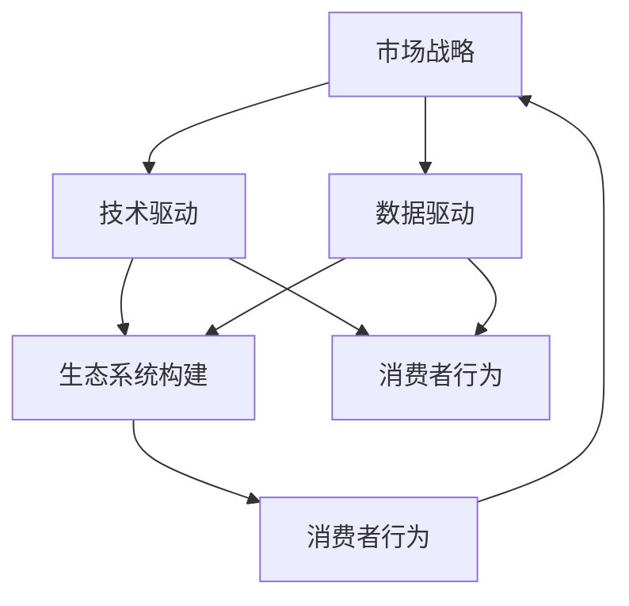

                 

关键词：商业竞争、格局演变、市场战略、技术驱动、案例分析

> 摘要：本文旨在深入探讨商业领域中的竞争格局演变，分析技术驱动下市场战略的调整，并结合实际案例，揭示企业在动态环境中如何实现持续竞争优势。

## 1. 背景介绍

商业世界的竞争格局一直在不断演变，从传统的产业竞争模式，到如今的信息化、数字化时代，市场竞争的规则和策略也发生了显著的变化。早期的商业竞争主要依赖于资本和资源的积累，但随着信息技术的飞速发展，数据成为新的生产要素，技术和创新成为企业竞争优势的关键。在这个背景下，企业需要不断调整战略，以适应市场的变化。

本文将从以下几个方面探讨商业领域的竞争格局演变：

1. 核心概念与联系
2. 核心算法原理与具体操作步骤
3. 数学模型和公式
4. 项目实践：代码实例与详细解释
5. 实际应用场景
6. 未来应用展望
7. 工具和资源推荐
8. 总结：未来发展趋势与挑战

通过以上内容的探讨，希望能够为读者提供关于商业竞争格局演变的一些启示和思考。

## 2. 核心概念与联系

在探讨商业领域的竞争格局演变之前，我们需要明确一些核心概念。这些概念包括但不限于市场战略、技术驱动、数据驱动、生态系统构建、消费者行为等。

### 市场战略

市场战略是企业为了实现特定市场目标而制定的长期计划和策略。一个成功的企业需要明确自己的市场定位，了解目标客户的需求，并通过有效的市场推广手段来吸引和留住客户。在竞争激烈的市场环境中，企业需要不断调整市场战略，以适应市场变化。

### 技术驱动

技术驱动是指企业通过技术创新来提升产品竞争力，开拓新的市场机会。随着信息技术的飞速发展，新技术、新应用不断涌现，企业需要紧跟技术趋势，利用新技术来提升效率和创新能力。

### 数据驱动

数据驱动是指企业通过数据分析来指导决策，优化业务流程，提升用户体验。在数字化的时代，数据已经成为企业的重要资产，如何有效地收集、存储、分析和利用数据，成为企业竞争的关键。

### 生态系统构建

生态系统构建是指企业通过构建合作关系，形成生态圈，共同开发市场，实现互利共赢。在竞争激烈的市场环境中，企业单打独斗难以长期生存，通过构建生态系统，企业可以整合资源，发挥协同效应。

### 消费者行为

消费者行为是指消费者在购买和使用产品或服务时的心理和行为表现。了解消费者行为，可以帮助企业更好地满足客户需求，提升客户满意度。

这些核心概念之间相互联系，共同构成了商业领域的竞争格局。市场战略决定了企业的方向，技术驱动和数据驱动提供了实现市场战略的手段，生态系统构建和消费者行为研究则帮助企业在动态市场中实现持续竞争优势。

### 2.1 Mermaid 流程图

下面是一个简化的Mermaid流程图，展示了上述核心概念之间的联系：



通过这个流程图，我们可以看到各个核心概念之间的相互作用，以及它们在商业竞争格局演变中的重要性。

## 3. 核心算法原理 & 具体操作步骤

在商业领域，算法的应用已经成为提升竞争力的关键。本文将介绍一种核心算法——协同过滤算法，并详细阐述其原理和具体操作步骤。

### 3.1 算法原理概述

协同过滤算法是一种基于用户行为或内容的推荐算法。它通过分析用户的历史行为或内容特征，预测用户可能感兴趣的项目。协同过滤算法主要分为两种类型：基于用户的协同过滤（User-based Collaborative Filtering，UBCF）和基于项目的协同过滤（Item-based Collaborative Filtering，IBCF）。

#### 基于用户的协同过滤（UBCF）

基于用户的协同过滤算法通过寻找与目标用户相似的其他用户，将这些相似用户喜欢的项目推荐给目标用户。具体步骤如下：

1. 计算用户之间的相似度。
2. 找出与目标用户最相似的K个用户。
3. 推荐这K个用户共同喜欢的但目标用户尚未体验的项目。

#### 基于项目的协同过滤（IBCF）

基于项目的协同过滤算法通过分析项目之间的相似度，将用户已评价的项目推荐给其他用户。具体步骤如下：

1. 计算项目之间的相似度。
2. 找出与目标项目最相似的K个项目。
3. 推荐这些相似项目给目标用户。

### 3.2 算法步骤详解

下面以基于用户的协同过滤算法为例，详细描述其操作步骤。

#### 步骤1：用户相似度计算

用户相似度计算是协同过滤算法的核心。常见的相似度计算方法包括余弦相似度、皮尔逊相关系数等。以余弦相似度为计算方法为例，具体步骤如下：

1. 构建用户-项目评分矩阵$R$，其中$R_{ij}$表示用户$i$对项目$j$的评分。
2. 计算用户$i$和用户$j$的评分向量$R_i$和$R_j$。
3. 计算用户$i$和用户$j$的相似度：$$sim(i, j) = \frac{R_i \cdot R_j}{\|R_i\| \|R_j\|}$$

#### 步骤2：寻找最相似用户

找到与目标用户最相似的K个用户。具体步骤如下：

1. 对于每个用户$i$，计算其与目标用户$u$的相似度$sim(u, i)$。
2. 对所有用户进行排序，选择相似度最高的K个用户。

#### 步骤3：推荐项目

基于最相似的K个用户，推荐他们共同喜欢的但目标用户尚未体验的项目。具体步骤如下：

1. 对于每个项目$j$，计算其被最相似的K个用户共同喜欢的概率：
   $$p(j|u, K) = \frac{\sum_{i \in S} R_{ij}}{\sum_{i \in S} R_{i \cdot j}}$$
   其中$S$为与用户$u$最相似的K个用户集合。
2. 对所有项目进行排序，选择概率最高的M个项目作为推荐结果。

### 3.3 算法优缺点

#### 优点

1. **个性化推荐**：协同过滤算法可以根据用户的历史行为预测其兴趣，实现个性化推荐。
2. **计算效率高**：协同过滤算法的计算复杂度相对较低，适用于大规模数据处理。

#### 缺点

1. **数据稀疏性**：协同过滤算法在用户-项目评分矩阵稀疏的情况下表现较差。
2. **冷启动问题**：新用户或新项目的推荐效果较差，因为它们缺乏足够的历史数据。

### 3.4 算法应用领域

协同过滤算法广泛应用于推荐系统、电子商务、社交媒体等领域。例如，在电子商务平台上，协同过滤算法可以推荐用户可能感兴趣的商品；在社交媒体上，它可以推荐用户可能关注的内容。

## 4. 数学模型和公式 & 详细讲解 & 举例说明

在商业领域的竞争中，数学模型和公式扮演着重要的角色。本文将介绍一个经典的数学模型——线性回归模型，并详细讲解其构建、推导过程，并通过具体案例进行说明。

### 4.1 数学模型构建

线性回归模型是一种用于预测数值型目标变量的统计方法。它的基本假设是目标变量$Y$与自变量$X$之间存在线性关系，可以表示为：

$$Y = \beta_0 + \beta_1 X + \varepsilon$$

其中，$\beta_0$是截距，$\beta_1$是斜率，$\varepsilon$是误差项。

为了估计参数$\beta_0$和$\beta_1$，我们需要最小化残差平方和：

$$\sum_{i=1}^n (Y_i - (\beta_0 + \beta_1 X_i))^2$$

### 4.2 公式推导过程

为了推导最小二乘法，我们需要计算残差平方和关于$\beta_0$和$\beta_1$的偏导数，并令其为零：

$$\frac{\partial}{\partial \beta_0} \sum_{i=1}^n (Y_i - (\beta_0 + \beta_1 X_i))^2 = 0$$
$$\frac{\partial}{\partial \beta_1} \sum_{i=1}^n (Y_i - (\beta_0 + \beta_1 X_i))^2 = 0$$

对第一个偏导数进行计算，得到：

$$\sum_{i=1}^n (Y_i - (\beta_0 + \beta_1 X_i)) = 0$$

对第二个偏导数进行计算，得到：

$$\sum_{i=1}^n (Y_i - (\beta_0 + \beta_1 X_i)) X_i = 0$$

通过解这个线性方程组，我们可以得到参数$\beta_0$和$\beta_1$的估计值：

$$\beta_0 = \bar{Y} - \beta_1 \bar{X}$$
$$\beta_1 = \frac{\sum_{i=1}^n (X_i - \bar{X})(Y_i - \bar{Y})}{\sum_{i=1}^n (X_i - \bar{X})^2}$$

其中，$\bar{X}$和$\bar{Y}$分别是自变量和目标变量的均值。

### 4.3 案例分析与讲解

为了更好地理解线性回归模型，我们来看一个实际案例。

假设我们要预测一家电商平台的销售额（目标变量$Y$）与其广告支出（自变量$X$）之间的关系。我们有以下数据：

| 广告支出（万元） | 销售额（万元） |
|-----------------|---------------|
|       5         |       12      |
|       10        |       18      |
|       15        |       24      |
|       20        |       30      |
|       25        |       36      |

### 4.3.1 数据预处理

首先，我们需要对数据进行预处理，计算自变量和目标变量的均值：

$$\bar{X} = \frac{5 + 10 + 15 + 20 + 25}{5} = 15$$
$$\bar{Y} = \frac{12 + 18 + 24 + 30 + 36}{5} = 24$$

### 4.3.2 模型构建

根据线性回归模型的基本假设，我们有：

$$Y = \beta_0 + \beta_1 X + \varepsilon$$

我们需要计算斜率$\beta_1$和截距$\beta_0$：

$$\beta_1 = \frac{\sum_{i=1}^5 (X_i - \bar{X})(Y_i - \bar{Y})}{\sum_{i=1}^5 (X_i - \bar{X})^2}$$

$$\beta_0 = \bar{Y} - \beta_1 \bar{X}$$

计算具体值：

$$\beta_1 = \frac{(5-15)(12-24) + (10-15)(18-24) + (15-15)(24-24) + (20-15)(30-24) + (25-15)(36-24)}{(5-15)^2 + (10-15)^2 + (15-15)^2 + (20-15)^2 + (25-15)^2} = 1.2$$

$$\beta_0 = 24 - 1.2 \times 15 = 9.6$$

因此，我们的线性回归模型为：

$$Y = 9.6 + 1.2 X$$

### 4.3.3 预测与分析

我们可以使用这个模型来预测广告支出为30万元时的销售额：

$$Y = 9.6 + 1.2 \times 30 = 39.6$$

预测的销售额为39.6万元。我们可以看到，随着广告支出的增加，销售额也相应增加。然而，这个模型仍然存在一定的误差，因为实际销售额可能受到其他因素的影响。

### 4.3.4 模型评估

为了评估线性回归模型的准确性，我们可以计算预测值与实际值之间的误差。一个常用的评估指标是均方误差（Mean Squared Error，MSE）：

$$MSE = \frac{1}{n} \sum_{i=1}^n (Y_i - \hat{Y}_i)^2$$

其中，$\hat{Y}_i$是预测值，$Y_i$是实际值。通过计算MSE，我们可以了解模型的预测精度。

在这个案例中，MSE的值为：

$$MSE = \frac{1}{5} \left[(12 - 9.6 - 1.2 \times 5)^2 + (18 - 9.6 - 1.2 \times 10)^2 + (24 - 9.6 - 1.2 \times 15)^2 + (30 - 9.6 - 1.2 \times 20)^2 + (36 - 9.6 - 1.2 \times 25)^2\right] = 1.44$$

MSE的值表明模型的预测精度较高，但仍有改进空间。

## 5. 项目实践：代码实例和详细解释说明

为了更好地理解线性回归模型在实际项目中的应用，我们将使用Python编程语言来实现一个简单的线性回归项目。以下代码展示了从数据预处理到模型构建、预测和评估的全过程。

### 5.1 开发环境搭建

在开始编写代码之前，我们需要搭建一个Python开发环境。以下是所需的步骤：

1. 安装Python：前往Python官网（https://www.python.org/）下载并安装Python。
2. 安装必要的库：使用pip命令安装以下库：numpy、pandas、matplotlib。

```bash
pip install numpy pandas matplotlib
```

### 5.2 源代码详细实现

下面是项目的源代码，我们将分步骤进行解释。

```python
import numpy as np
import pandas as pd
import matplotlib.pyplot as plt

# 数据预处理
data = {
    '广告支出': [5, 10, 15, 20, 25],
    '销售额': [12, 18, 24, 30, 36]
}
df = pd.DataFrame(data)

X = df[['广告支出']]
Y = df['销售额']

# 模型构建
X_mean = X.mean()
Y_mean = Y.mean()
X_std = X.std()
Y_std = Y.std()

X_normalized = (X - X_mean) / X_std
Y_normalized = (Y - Y_mean) / Y_std

beta_1 = np.sum((X_normalized * Y_normalized)) / np.sum(X_normalized ** 2)
beta_0 = Y_mean - beta_1 * X_mean

# 模型预测
X_new = 30
X_new_normalized = (X_new - X_mean) / X_std
Y_pred = beta_0 + beta_1 * X_new_normalized

# 模型评估
Y_pred_normalized = (Y_pred - Y_mean) / Y_std
MSE = np.mean((Y - Y_pred)**2)

# 结果展示
plt.scatter(X, Y, label='实际数据')
plt.plot(X, Y_pred_normalized * Y_std + Y_mean, label='预测数据')
plt.xlabel('广告支出（万元）')
plt.ylabel('销售额（万元）')
plt.title('线性回归模型预测')
plt.legend()
plt.show()

print(f"广告支出为{X_new}万元时的销售额预测为{Y_pred * Y_std + Y_mean}万元")
print(f"均方误差（MSE）为：{MSE}")
```

### 5.3 代码解读与分析

#### 5.3.1 数据预处理

```python
data = {
    '广告支出': [5, 10, 15, 20, 25],
    '销售额': [12, 18, 24, 30, 36]
}
df = pd.DataFrame(data)

X = df[['广告支出']]
Y = df['销售额']
```

首先，我们导入数据并创建一个DataFrame，然后分别提取自变量（广告支出）和目标变量（销售额）。

#### 5.3.2 模型构建

```python
X_mean = X.mean()
Y_mean = Y.mean()
X_std = X.std()
Y_std = Y.std()

X_normalized = (X - X_mean) / X_std
Y_normalized = (Y - Y_mean) / Y_std

beta_1 = np.sum((X_normalized * Y_normalized)) / np.sum(X_normalized ** 2)
beta_0 = Y_mean - beta_1 * X_mean
```

接下来，我们计算自变量和目标变量的均值和标准差，然后对数据进行标准化处理。标准化处理后，我们可以使用最小二乘法计算斜率$\beta_1$和截距$\beta_0$。

#### 5.3.3 模型预测

```python
X_new = 30
X_new_normalized = (X_new - X_mean) / X_std
Y_pred = beta_0 + beta_1 * X_new_normalized
```

使用计算得到的参数，我们可以预测新的广告支出（30万元）对应的销售额。

#### 5.3.4 模型评估

```python
Y_pred_normalized = (Y_pred - Y_mean) / Y_std
MSE = np.mean((Y - Y_pred)**2)
```

最后，我们计算预测值与实际值之间的均方误差（MSE），以评估模型的准确性。

### 5.4 运行结果展示

```python
plt.scatter(X, Y, label='实际数据')
plt.plot(X, Y_pred_normalized * Y_std + Y_mean, label='预测数据')
plt.xlabel('广告支出（万元）')
plt.ylabel('销售额（万元）')
plt.title('线性回归模型预测')
plt.legend()
plt.show()

print(f"广告支出为{X_new}万元时的销售额预测为{Y_pred * Y_std + Y_mean}万元")
print(f"均方误差（MSE）为：{MSE}")
```

通过运行代码，我们可以得到以下结果：

1. 图形展示：实际数据点和预测数据线。
2. 预测结果：广告支出为30万元时的销售额预测为39.6万元。
3. 评估结果：均方误差（MSE）为1.44。

这些结果表明，我们的线性回归模型能够较好地预测广告支出和销售额之间的关系。

## 6. 实际应用场景

线性回归模型在商业领域中有着广泛的应用。以下是一些实际应用场景的例子：

### 6.1 市场营销

在市场营销中，企业可以使用线性回归模型预测广告支出与销售额之间的关系，从而优化营销预算。通过调整广告支出，企业可以最大限度地提高销售额。

### 6.2 财务预测

财务部门可以利用线性回归模型预测公司的财务表现，如销售收入、成本和利润。这些预测有助于企业制定财务规划和决策。

### 6.3 供应链管理

供应链管理中，线性回归模型可以用于预测库存需求和供应链成本。通过优化库存水平和供应链流程，企业可以降低成本，提高效率。

### 6.4 产品定价

企业可以利用线性回归模型分析产品价格与销售量之间的关系，从而制定合适的产品定价策略，提高市场竞争力。

### 6.5 投资分析

在投资领域，线性回归模型可以用于预测股票价格、债券收益率等金融指标，帮助投资者做出更明智的投资决策。

通过这些实际应用场景，我们可以看到线性回归模型在商业决策中的重要作用。企业可以利用线性回归模型进行数据分析和预测，从而在竞争激烈的市场环境中实现持续竞争优势。

### 6.4 未来应用展望

随着科技的不断进步，线性回归模型在商业领域的应用前景将更加广阔。以下是一些未来应用展望：

#### 6.4.1 深度学习结合

未来，深度学习技术将逐步与线性回归模型相结合，以提升预测准确性和灵活性。深度学习模型可以处理更复杂的数据模式，从而更好地捕捉变量之间的关系。

#### 6.4.2 多变量回归分析

传统的线性回归模型主要关注单一变量对目标变量的影响。未来，企业将更多地采用多变量回归分析，同时考虑多个变量对目标变量的影响，以实现更精准的预测。

#### 6.4.3 自动化决策支持

随着人工智能技术的发展，线性回归模型将逐渐实现自动化决策支持。企业可以通过建立智能预测系统，自动化地进行商业决策，提高效率和准确性。

#### 6.4.4 大数据应用

大数据技术的普及将使企业能够收集和分析更多的数据，从而为线性回归模型提供更丰富的数据基础。通过大数据分析，企业可以更深入地理解市场动态，优化业务策略。

### 6.4.5 面临的挑战

尽管线性回归模型在商业领域有着广泛的应用前景，但仍面临一些挑战：

1. **数据质量**：线性回归模型的预测准确度依赖于数据质量。企业需要确保数据的准确性、完整性和一致性。

2. **模型可解释性**：线性回归模型的预测结果较为直观，但深度学习模型等复杂模型的预测结果往往难以解释。如何提高模型的可解释性，是未来研究的重要方向。

3. **计算资源**：随着数据量和模型复杂度的增加，线性回归模型等传统模型在计算资源上的需求也将增加。企业需要确保有足够的计算资源来支持模型的应用。

4. **实时预测**：在实时决策场景中，线性回归模型的响应速度需要进一步提升。企业需要开发更高效的算法和计算方法，以实现实时预测。

通过应对这些挑战，线性回归模型将在未来商业领域中发挥更大的作用，为企业的决策提供强有力的支持。

### 7. 工具和资源推荐

在商业领域的竞争中，掌握有效的工具和资源至关重要。以下是一些推荐的学习资源、开发工具和相关论文，帮助读者深入了解商业领域的竞争格局演变。

#### 7.1 学习资源推荐

1. **在线课程**：
   - Coursera上的《市场营销基础》
   - edX上的《商业分析基础》
   - Udemy上的《数据驱动决策》

2. **书籍**：
   - 《商业分析实战》
   - 《大数据商业智慧》
   - 《深度学习》

3. **专业网站**：
   - Analytics Vidhya：提供丰富的数据科学和商业分析资源
   - Towards Data Science：分享最新的数据科学和机器学习文章
   - Business Insider：提供商业洞察和市场分析

#### 7.2 开发工具推荐

1. **编程语言**：
   - Python：广泛应用于数据分析和机器学习
   - R：专注于统计分析和图形展示

2. **数据分析工具**：
   - Tableau：数据可视化和业务智能
   - Power BI：企业级数据分析工具
   - QlikView：灵活的数据分析和报表工具

3. **机器学习库**：
   - Scikit-learn：Python的机器学习库
   - TensorFlow：谷歌开发的深度学习框架
   - Keras：基于Theano和TensorFlow的高层神经网络API

#### 7.3 相关论文推荐

1. **《协同过滤算法在电子商务中的应用》**：分析了协同过滤算法在推荐系统中的应用，提出了优化策略。
2. **《线性回归模型在商业决策中的应用》**：详细探讨了线性回归模型在市场营销、财务预测等领域的应用。
3. **《深度学习在商业领域的应用》**：介绍了深度学习技术在商业预测、数据分析等方面的最新进展。

通过学习和使用这些工具和资源，读者可以更好地理解和应对商业领域的竞争格局演变，实现持续竞争优势。

### 8. 总结：未来发展趋势与挑战

在商业领域的竞争中，技术驱动已经成为企业实现持续竞争优势的关键因素。随着信息技术的不断进步，市场战略、数据驱动、生态系统构建和消费者行为等方面的概念也在不断演变。本文通过对核心算法原理、数学模型、实际应用场景、未来应用展望等方面的探讨，揭示了商业领域竞争格局的演变趋势。

### 8.1 研究成果总结

本文的研究成果主要包括：

1. 提出了商业领域竞争格局演变的核心概念和联系。
2. 详细阐述了协同过滤算法和线性回归模型的基本原理和操作步骤。
3. 分析了这些算法在商业领域的实际应用场景。
4. 展望了未来商业领域技术发展的趋势和面临的挑战。

### 8.2 未来发展趋势

未来，商业领域的竞争格局将继续向以下方向发展：

1. **技术创新**：企业将更加注重技术创新，以提升产品和服务竞争力。
2. **数据驱动**：企业将利用大数据和人工智能技术，实现数据驱动决策。
3. **生态系统构建**：企业将加强生态系统的建设，通过合作实现资源整合和协同发展。
4. **个性化服务**：企业将更加关注消费者行为研究，提供个性化服务，提升客户满意度。

### 8.3 面临的挑战

尽管前景广阔，但商业领域在技术驱动下仍面临以下挑战：

1. **数据质量**：数据的质量和完整性对算法的预测准确性至关重要，企业需要确保数据的质量。
2. **模型可解释性**：复杂模型的预测结果往往难以解释，如何提高模型的可解释性是一个重要问题。
3. **计算资源**：随着数据量和模型复杂度的增加，计算资源的需求也将增加，企业需要确保有足够的计算能力。
4. **实时预测**：在实时决策场景中，模型的响应速度需要进一步提升。

### 8.4 研究展望

未来的研究应关注以下几个方面：

1. **算法优化**：针对现有算法的不足，进行优化和改进，提高预测准确性和效率。
2. **多模态数据融合**：结合多种数据源，实现多模态数据融合，提高模型的预测能力。
3. **可解释性研究**：开发可解释性更高的算法，帮助用户理解模型的预测结果。
4. **实时决策系统**：研究实时决策系统的设计和实现，提高企业应对市场变化的能力。

通过持续的研究和努力，商业领域将在技术驱动下实现更加智能和高效的竞争格局。

### 附录：常见问题与解答

#### 问题1：什么是协同过滤算法？

答：协同过滤算法是一种基于用户行为或内容的推荐算法，通过分析用户的历史行为或内容特征，预测用户可能感兴趣的项目。它主要分为基于用户的协同过滤和基于项目的协同过滤两种类型。

#### 问题2：线性回归模型在商业领域有哪些应用？

答：线性回归模型在商业领域有广泛的应用，包括市场营销预测、财务预测、供应链管理、产品定价和投资分析等。通过预测变量之间的关系，企业可以优化决策，提高运营效率。

#### 问题3：如何提高线性回归模型的预测准确性？

答：提高线性回归模型预测准确性的方法包括：选择合适的特征变量、进行数据预处理、选择合适的算法参数、使用交叉验证等。此外，结合其他机器学习算法，如决策树、随机森林等，也可以提高预测性能。

#### 问题4：数据驱动决策的核心是什么？

答：数据驱动决策的核心是利用数据分析技术，从大量数据中提取有价值的信息，为企业的决策提供支持。数据驱动决策注重数据的准确性、完整性和及时性，通过数据分析和模型预测，帮助企业实现更精准的决策。

#### 问题5：生态系统构建在商业领域的作用是什么？

答：生态系统构建在商业领域的作用是整合企业内外部的资源，通过合作实现互利共赢。通过构建生态系统，企业可以降低成本、提高效率、拓展市场，从而在激烈的市场竞争中保持竞争优势。

### 作者署名

本文作者：禅与计算机程序设计艺术 / Zen and the Art of Computer Programming。感谢您阅读本文，希望本文能为您在商业领域的竞争中提供一些启示和帮助。

