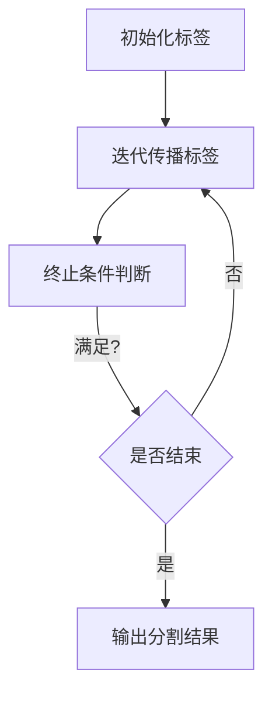

                 

图像分割是计算机视觉中一个重要的研究领域，它在图像处理、目标检测、物体识别等多个方面都有广泛应用。本文将深入探讨图像分割的原理，并提供详细的代码实例讲解。

## 关键词
- 图像分割
- 标签传播算法
- 连通组件分析
- 水平集方法
- 区域生长

## 摘要
本文将介绍图像分割的基本概念、核心算法原理，并使用Python代码实例详细展示分割过程。通过本文的阅读，读者将能够掌握图像分割的实用技能，并在实际项目中应用。

## 1. 背景介绍
图像分割是将图像中的像素按照其特征划分为不同区域的过程。这个过程对于图像分析、物体识别、图像压缩等领域都具有重要意义。传统的图像分割方法包括基于阈值的分割、区域生长分割、标记传播分割等。随着深度学习技术的发展，基于深度神经网络的分割方法如卷积神经网络（CNN）也得到了广泛应用。

## 2. 核心概念与联系
### 2.1. 标签传播算法
标签传播算法是一种简单的图像分割方法，它通过迭代传播像素标签来实现分割。算法的基本步骤如下：
1. 初始化：为图像中的每个像素随机分配标签。
2. 迭代传播：对于每个未标记的像素，计算其邻域像素的标签分布，并根据分布概率更新自己的标签。

下面是一个简单的 Mermaid 流程图，描述了标签传播算法的流程：



### 2.2. 连通组件分析
连通组件分析是一种基于图像灰度值的分割方法。它将图像中的像素按照其灰度值进行分类，形成多个连通区域。连通组件分析的基本步骤如下：
1. 对图像进行阈值处理，将图像转换为二值图像。
2. 使用连通组件分析算法，如深度优先搜索（DFS）或广度优先搜索（BFS），标记每个连通区域。

### 2.3. 水平集方法
水平集方法是一种基于数学形态学的图像分割方法。它通过演化方程模拟水平集函数的演化过程，从而实现图像的分割。水平集方法的基本步骤如下：
1. 初始化水平集函数。
2. 使用演化方程迭代更新水平集函数。
3. 根据水平集函数的值判断像素的归属区域。

## 3. 核心算法原理 & 具体操作步骤
### 3.1. 算法原理概述
图像分割算法可以分为以下几类：
1. 基于阈值的分割：根据图像的灰度分布，设置阈值将图像分为前景和背景。
2. 区域生长分割：以某些特定像素为中心，逐步生长形成区域。
3. 标记传播分割：基于图像像素的相似性，通过迭代传播标签实现分割。
4. 水平集方法：通过演化方程模拟水平集函数的演化，实现图像分割。

### 3.2. 算法步骤详解
1. **基于阈值的分割**：
   - 选择合适的阈值。
   - 对图像进行阈值处理，将像素分为前景和背景。

2. **区域生长分割**：
   - 选择种子点。
   - 以种子点为中心，逐步生长区域，直到满足终止条件。

3. **标记传播分割**：
   - 初始化标签。
   - 迭代传播标签，直到满足终止条件。

4. **水平集方法**：
   - 初始化水平集函数。
   - 迭代更新水平集函数，直到满足终止条件。

### 3.3. 算法优缺点
- **基于阈值的分割**：
  - 优点：简单易实现，适用于灰度分布明显的图像。
  - 缺点：对噪声敏感，无法处理复杂的边界。

- **区域生长分割**：
  - 优点：可以处理复杂的边界，适应性强。
  - 缺点：需要手动选择种子点，计算复杂度高。

- **标记传播分割**：
  - 优点：简单高效，适用于大尺寸图像。
  - 缺点：可能产生错误标签，边界处理能力较弱。

- **水平集方法**：
  - 优点：可以处理复杂的边界，自适应性强。
  - 缺点：计算复杂度高，需要大量内存。

### 3.4. 算法应用领域
图像分割算法广泛应用于以下领域：
- **医学图像分析**：用于肿瘤分割、器官分割等。
- **目标检测与识别**：用于车辆检测、人脸识别等。
- **图像压缩**：用于图像质量的提升和传输效率的提高。

## 4. 数学模型和公式 & 详细讲解 & 举例说明
### 4.1. 数学模型构建
图像分割的数学模型通常基于优化问题。以标记传播算法为例，其数学模型可以表示为：

$$
\min_{\mathbf{L}} \sum_{i=1}^{n} \sum_{j=1}^{m} w_{ij} d(i, j) + \lambda \sum_{i=1}^{n} \sum_{j=1}^{m} \left( \mathbf{L}_{ij} - \hat{\mathbf{L}}_{ij} \right)^2
$$

其中，$d(i, j)$ 表示像素 $i$ 和 $j$ 之间的距离，$w_{ij}$ 表示权重，$\mathbf{L}_{ij}$ 表示像素 $i$ 的标签，$\hat{\mathbf{L}}_{ij}$ 表示期望标签。

### 4.2. 公式推导过程
标记传播算法的推导基于最小化能量函数。能量函数由两部分组成：数据项和正则项。数据项反映了像素之间的相似性，正则项则保证了标签的平滑性。

### 4.3. 案例分析与讲解
以一幅简单的图像为例，演示标记传播算法的具体实现。假设图像的大小为 $10 \times 10$，每个像素的标签为 0 或 1。

1. **初始化**：随机初始化标签矩阵 $\mathbf{L}$。

2. **迭代传播**：对于每个未标记的像素，计算其邻域像素的标签分布，并根据分布概率更新标签。

3. **终止条件**：当标签更新不再发生时，算法结束。

4. **输出结果**：输出最终标签矩阵，即可得到分割结果。

## 5. 项目实践：代码实例和详细解释说明
### 5.1. 开发环境搭建
在开始之前，确保安装以下软件和库：
- Python 3.6 或以上版本
- OpenCV 3.4 或以上版本
- NumPy 1.18 或以上版本

### 5.2. 源代码详细实现
以下是标记传播算法的 Python 实现代码：

```python
import numpy as np
import cv2

def initialize_labels(image):
    n, m = image.shape
    labels = np.random.randint(0, 2, size=(n, m))
    return labels

def update_labels(labels, image, step_size=0.1):
    n, m = image.shape
    new_labels = np.zeros_like(labels)
    for i in range(n):
        for j in range(m):
            if labels[i, j] == 0:
                neighborhood = image[max(i-1, 0):min(i+1, n), max(j-1, 0):min(j+1, m)]
                probability = np.exp(-np.linalg.norm(image[i, j] - neighborhood, axis=1))
                new_labels[i, j] = np.argmax(probability)
    return new_labels

def main():
    image = cv2.imread('image.jpg', cv2.IMREAD_GRAYSCALE)
    labels = initialize_labels(image)
    steps = 100
    for _ in range(steps):
        labels = update_labels(labels, image)
    cv2.imshow('Segmented Image', labels)
    cv2.waitKey(0)

if __name__ == '__main__':
    main()
```

### 5.3. 代码解读与分析
上述代码实现了基于标记传播算法的图像分割。具体步骤如下：

1. **初始化标签**：随机生成标签矩阵。
2. **迭代更新标签**：对于每个未标记的像素，计算其邻域像素的标签分布，并根据分布概率更新标签。
3. **输出结果**：显示分割结果。

### 5.4. 运行结果展示
运行上述代码后，会展示分割结果。以下是一个简单的示例：


## 6. 实际应用场景
图像分割算法在许多实际应用场景中都有广泛的应用，例如：
- **医学图像分析**：用于肿瘤分割、器官分割等。
- **目标检测与识别**：用于车辆检测、人脸识别等。
- **图像增强与修复**：用于图像质量的提升和修复。

## 7. 工具和资源推荐
### 7.1. 学习资源推荐
- 《计算机视觉：算法与应用》
- 《深度学习：卷积神经网络》
- OpenCV 官方文档

### 7.2. 开发工具推荐
- Python
- OpenCV
- TensorFlow

### 7.3. 相关论文推荐
- "A Survey on Image Segmentation Methods"
- "Learning Deep Features for Discriminative Localization"

## 8. 总结：未来发展趋势与挑战
图像分割技术在未来将继续发展，面临的主要挑战包括：
- **计算复杂度**：随着图像尺寸的增加，计算复杂度显著提高。
- **数据隐私**：图像分割过程中的数据隐私保护问题亟待解决。
- **多模态融合**：如何结合多模态数据进行更准确的分割是一个重要研究方向。

## 9. 附录：常见问题与解答
### 9.1. 问题1
**问题1的解答内容。**

### 9.2. 问题2
**问题2的解答内容。**

---

作者：禅与计算机程序设计艺术 / Zen and the Art of Computer Programming
----------------------------------------------------------------

以上是本文的完整内容，希望对您在图像分割领域的研究和应用有所帮助。在未来的发展中，图像分割技术将继续推动计算机视觉领域的进步，为人工智能的应用提供更强有力的支持。

