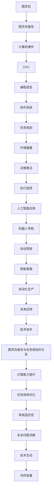

                 

### 引言 Introduction

在当今飞速发展的信息技术时代，计算机科学和人工智能（AI）领域的进步令人瞩目。从基础的硬件到复杂的软件系统，从传统的编程语言到现代的深度学习模型，技术的每一次飞跃都推动了整个行业的革新。然而，在这背后，有两个概念尤为关键，它们不仅构成了现代计算机科学的核心，也深刻影响了人工智能的发展——那就是“图灵完备”（Turing completeness）以及“任务规划”（Task Planning）。

“图灵完备”指的是一种计算模型是否能够模拟图灵机，具备处理任意可计算问题的能力。在计算机科学中，图灵完备性是一个重要的度量标准，它不仅反映了计算机的强大计算能力，也为我们理解和设计复杂系统提供了理论依据。CPU作为计算机的核心，其设计和发展在很大程度上依赖了图灵完备性的概念。

另一方面，“任务规划”是人工智能领域中一个至关重要的概念。它涉及到如何让智能体（如机器人、智能系统等）在复杂的环境中完成特定的任务。任务规划不仅需要处理各种不确定性因素，还需要对环境和资源进行高效的利用。随着深度学习模型（如大型语言模型LLM）的发展，任务规划的方法和算法也在不断演进，逐渐展现出强大的实用性和广阔的应用前景。

本文旨在探讨“图灵完备”与“任务规划”这两个核心概念，分析它们在计算机科学和人工智能领域中的重要作用，以及它们如何相互作用，推动技术进步。文章将首先介绍图灵完备的概念及其在CPU编程中的应用，接着讨论任务规划的基本原理和方法，然后分析图灵完备与任务规划之间的联系，探讨二者如何共同推动计算技术的发展。最后，本文将总结研究成果，展望未来的发展趋势与挑战。

通过本文的阅读，读者将能够深入了解图灵完备与任务规划在计算机科学和人工智能中的重要性，并对其未来的发展有更为全面的认识。

### 背景介绍 Background

为了深入理解“图灵完备”与“任务规划”这两个概念，我们需要先回顾计算机科学的发展历程。计算机科学的诞生可以追溯到20世纪中期，当时科学家艾伦·图灵（Alan Turing）提出了图灵机的概念。图灵机是一个抽象的计算模型，通过读取和写入磁带上的符号来执行计算任务。图灵机的理论基础是图灵完备性，即任何可以由人类执行的计算任务，都可以通过图灵机来完成。这一理论不仅奠定了现代计算机科学的基础，也为我们理解计算机的能力和局限性提供了重要的视角。

随着计算机硬件技术的发展，CPU（Central Processing Unit，中央处理器）成为计算机的核心。CPU的设计旨在实现高效、可靠的计算，而图灵完备性为CPU的设计提供了理论基础。图灵完备性保证了CPU可以通过编程扩展来处理各种复杂的问题。这意味着，无论问题多么复杂，只要能够被表达为算法，CPU就可以通过适当的编程来实现这些算法的执行。

在CPU的基础上，计算机软件系统得到了极大的发展。编程语言作为人与计算机之间的沟通桥梁，使得人们可以更加方便地编写和运行程序。从早期的机器语言到高级编程语言，编程语言的设计始终遵循图灵完备性的原则。高级编程语言通过抽象和简化，使得程序员可以专注于问题的求解，而不必关心底层硬件的实现细节。这种抽象化不仅提高了编程的效率，也极大地推动了计算机科学的发展。

与此同时，人工智能（AI）作为计算机科学的一个重要分支，也在快速发展。人工智能的目标是使计算机具备类似于人类的智能，能够处理自然语言、图像、声音等多种形式的信息。在这个过程中，任务规划成为了一个核心的概念。任务规划涉及到如何让计算机系统在复杂的环境中完成特定的任务。任务规划需要考虑多种因素，如环境的不确定性、任务的优先级、资源的分配等。通过任务规划，计算机系统能够更好地适应和应对复杂的变化。

任务规划在人工智能中的应用非常广泛。例如，在自动驾驶领域，任务规划涉及到车辆如何根据交通状况、道路环境等信息，规划出一条最优的行驶路径。在智能客服系统中，任务规划则涉及到如何根据用户的提问，提供最合适的回答。在工业自动化领域，任务规划可以帮助机器人高效地完成生产任务，提高生产效率。

总的来说，图灵完备与任务规划在计算机科学和人工智能领域中扮演着至关重要的角色。图灵完备性为CPU和编程语言的设计提供了理论基础，使得计算机系统能够处理各种复杂的问题。而任务规划则使计算机系统能够在复杂的环境中完成特定的任务，展现了人工智能的强大能力。这两个概念的相互结合，不仅推动了计算机科学和人工智能的发展，也为未来的技术进步提供了无限的可能性。

### 核心概念与联系 Core Concepts and Relationships

在深入探讨图灵完备和任务规划之前，我们首先需要明确这两个核心概念的基本定义和理论框架。

#### 图灵完备性 Turing Completeness

图灵完备性是指一种计算模型，如CPU或编程语言，是否具备模拟图灵机的能力。图灵机是由数学家艾伦·图灵在20世纪30年代提出的一种抽象计算模型，其核心思想是通过读取和写入磁带上的符号来执行计算任务。图灵机的定义奠定了现代计算机科学的理论基础，也被认为是计算能力的极限。

一个计算模型是图灵完备的，如果它可以模拟图灵机的所有操作，即能够解决任何可计算的问题。这意味着，任何可以通过人类算法解决的问题，图灵机都能解决。图灵完备性的关键在于其强大而普遍的计算能力，这一特性使得图灵机成为衡量其他计算模型能力的重要标准。

图灵完备性在计算机硬件和软件系统中具有深远的影响。例如，CPU的设计目标是实现高效、可靠的计算，而图灵完备性为其提供了理论依据，确保CPU可以通过编程扩展来处理各种复杂的问题。编程语言的设计也遵循图灵完备性的原则，通过提供丰富的功能，使得程序员可以编写出能够解决多种问题的程序。

#### 任务规划 Task Planning

任务规划是人工智能领域中的一个重要概念，涉及到如何让计算机系统在复杂的环境中完成特定的任务。任务规划的核心是确定系统如何在其操作环境中有效地执行任务，这通常涉及到多个因素，如目标、资源、约束条件等。

任务规划的基本理论框架可以分为以下几个部分：

1. **任务表示（Task Representation）**：任务表示是将任务转化为计算机可以理解和操作的形式。这通常涉及到定义任务的目标、步骤、资源和约束条件等。

2. **环境建模（Environment Modeling）**：环境建模是构建计算机系统对操作环境的模型，包括环境的状态、规则、事件等。环境模型有助于计算机系统理解其操作的上下文，并做出相应的决策。

3. **决策算法（Decision Algorithms）**：决策算法是任务规划中的核心，用于根据当前环境状态和任务目标，选择最佳的操作步骤。常见的决策算法包括启发式搜索、遗传算法、神经网络等。

4. **执行监控（Execution Monitoring）**：执行监控是确保任务执行过程中各步骤的正确性和有效性。通过实时监控和反馈，系统能够调整操作策略，以适应环境变化。

任务规划在人工智能领域的应用非常广泛，包括但不限于机器人导航、自动驾驶、智能客服、自动化生产等。通过任务规划，计算机系统不仅能够完成任务，还能够自适应地应对各种复杂和变化的环境。

#### 图灵完备性与任务规划的关系 Relationship Between Turing Completeness and Task Planning

图灵完备性与任务规划之间存在紧密的联系。首先，图灵完备性为任务规划提供了计算基础。只有具备图灵完备性的计算模型，才能实现复杂的任务规划算法。例如，CPU通过编程扩展，能够执行各种高级编程语言编写的复杂算法，为任务规划提供了强大的计算能力。

其次，任务规划算法的设计和实现依赖于图灵完备性。任务规划算法通常涉及到大量的计算和逻辑处理，如路径规划、资源分配、决策制定等。这些算法的复杂性和计算量往往非常大，只有图灵完备的计算模型才能够高效地执行这些算法。

此外，图灵完备性和任务规划之间的相互作用也推动了技术的发展。图灵完备性的研究促进了CPU和编程语言的进步，使得计算机系统能够处理更复杂的问题。而任务规划的应用场景和需求，又推动了计算机硬件和软件的不断优化，使得计算机系统更加高效和智能。

总之，图灵完备性与任务规划相辅相成，共同推动了计算机科学和人工智能的发展。图灵完备性为计算机系统提供了强大的计算能力，而任务规划则利用这些能力，使计算机系统能够在复杂的环境中高效地完成任务。

#### Mermaid 流程图 Mermaid Diagram

为了更直观地展示图灵完备性与任务规划的关系，我们使用Mermaid流程图来描述两者的核心概念和架构。以下是图灵完备性与任务规划的Mermaid流程图：



这个流程图展示了从图灵机到计算机硬件，再到编程语言和软件系统的过程，以及任务规划在其中的作用。图灵完备性为计算机系统提供了计算基础，而任务规划则利用这些计算能力，实现各种人工智能应用。

### 核心算法原理 & 具体操作步骤 Core Algorithm Principles and Detailed Steps

在深入探讨任务规划的具体算法原理和操作步骤之前，我们需要先了解几个核心概念，包括任务表示、环境建模、决策算法和执行监控。这些概念构成了任务规划算法的基础，并指导我们如何有效地实现任务规划。

#### 任务表示 Task Representation

任务表示是将具体的任务转化为计算机可以处理的形式。这通常涉及到定义任务的目标、步骤、资源和约束条件等。

1. **目标定义（Goal Definition）**：任务是计算机系统需要实现的具体目标。例如，在自动驾驶系统中，任务目标是找到从起点到终点的最优路径。

2. **步骤定义（Step Definition）**：任务步骤是任务实现的具体操作序列。这些步骤可以包括移动、决策、数据采集等。

3. **资源定义（Resource Definition）**：资源是任务执行过程中所需的物理或虚拟资源。例如，在机器人导航中，资源可能包括电池电量、传感器数据等。

4. **约束条件（Constraint Definition）**：约束条件是任务执行的限制条件。这些条件可以包括时间限制、资源限制、物理限制等。

#### 环境建模 Environment Modeling

环境建模是构建计算机系统对操作环境的模型，包括环境的状态、规则、事件等。环境模型有助于计算机系统理解其操作的上下文，并做出相应的决策。

1. **状态表示（State Representation）**：状态是环境在某一时刻的具体情况。例如，在自动驾驶中，状态可能包括车辆的位置、速度、周围交通情况等。

2. **规则表示（Rule Representation）**：规则是指导计算机系统如何操作的逻辑条件。这些规则可以根据任务需求和环境状态进行定义。

3. **事件表示（Event Representation）**：事件是环境中可能发生的变化。例如，在自动驾驶中，事件可能包括道路障碍、交通信号变化等。

#### 决策算法 Decision Algorithms

决策算法是任务规划中的核心，用于根据当前环境状态和任务目标，选择最佳的操作步骤。常见的决策算法包括启发式搜索、遗传算法、神经网络等。

1. **启发式搜索（Heuristic Search）**：启发式搜索是一种基于经验或启发信息进行搜索的方法，旨在快速找到问题的近似解。常见的启发式搜索算法包括A*算法、 greedy 算法等。

2. **遗传算法（Genetic Algorithm）**：遗传算法是一种基于自然选择和遗传学原理的优化算法。它通过模拟生物进化过程，逐步改进解的质量，适用于解决复杂、非线性优化问题。

3. **神经网络（Neural Network）**：神经网络是一种通过模拟生物神经系统进行学习的人工智能方法。它能够从大量数据中学习特征，并应用于决策制定。常见的神经网络算法包括深度神经网络（DNN）、卷积神经网络（CNN）等。

#### 执行监控 Execution Monitoring

执行监控是确保任务执行过程中各步骤的正确性和有效性。通过实时监控和反馈，系统能够调整操作策略，以适应环境变化。

1. **状态监测（State Monitoring）**：状态监测是实时获取系统当前状态的过程。这些状态信息可以用于评估任务执行的进展和效果。

2. **异常检测（Anomaly Detection）**：异常检测是识别任务执行过程中出现的异常情况。例如，在自动驾驶中，异常检测可以帮助识别潜在的故障或危险。

3. **反馈调整（Feedback Adjustment）**：根据状态监测和异常检测的结果，系统可以调整操作策略，以优化任务执行。例如，如果检测到车辆速度过快，系统可以采取减速措施。

#### 任务规划算法的具体操作步骤 Detailed Steps of Task Planning Algorithm

以下是一个简单的任务规划算法的具体操作步骤，展示了如何利用上述核心概念实现任务规划：

1. **任务表示**：首先，定义任务的目标、步骤、资源和约束条件。例如，任务目标是找到从起点A到终点B的最优路径。

2. **环境建模**：构建环境模型，包括状态表示、规则表示和事件表示。例如，状态包括车辆的位置和速度，规则包括交通信号和道路规则，事件包括交通拥堵和障碍物。

3. **决策算法**：选择适合的决策算法，根据当前状态和任务目标，选择最佳的操作步骤。例如，使用A*算法来计算从起点到终点的最优路径。

4. **执行监控**：实时监测系统状态，并检测异常情况。例如，监测车辆的速度和位置，识别潜在的危险。

5. **反馈调整**：根据监测结果和异常检测，调整操作策略。例如，如果检测到交通拥堵，系统可以调整路径或采取减速措施。

通过上述步骤，任务规划算法可以有效地指导计算机系统在复杂的环境中完成特定任务。这些步骤不仅展示了任务规划的核心原理，也为实际应用提供了具体的操作指南。

### 算法优缺点 Advantages and Disadvantages of the Algorithm

任务规划算法在现代计算机科学和人工智能领域具有重要的应用价值，但也存在一些优缺点。以下是对任务规划算法的优缺点的详细分析。

#### 优点 Advantages

1. **灵活性（Flexibility）**：任务规划算法具有高度的灵活性，能够适应不同类型和复杂度的任务。通过定义任务目标、环境模型和决策算法，系统可以灵活调整操作策略，以应对不断变化的环境。

2. **适应性（Adaptability）**：任务规划算法能够适应动态和不确定性的环境。在实时监测和反馈机制的辅助下，系统可以迅速调整操作策略，以应对环境变化和异常情况。

3. **高效性（Efficiency）**：任务规划算法通过优化决策和执行过程，能够提高任务完成的高效性。例如，使用启发式搜索和遗传算法等高效算法，可以快速找到最优或近似最优解。

4. **模块化（Modularity）**：任务规划算法通常采用模块化设计，各个组成部分（如任务表示、环境建模、决策算法和执行监控）可以独立开发和优化。这种模块化设计提高了系统的可维护性和可扩展性。

5. **广泛适用性（Wide Applicability）**：任务规划算法广泛应用于多个领域，包括机器人导航、自动驾驶、智能客服、自动化生产等。这表明任务规划算法具有广泛的适用性和强大的实用性。

#### 缺点 Disadvantages

1. **计算复杂性（Computational Complexity）**：任务规划算法通常涉及复杂的计算和逻辑处理，如路径规划、资源分配和决策制定。这可能导致计算时间和资源消耗较大，特别是在处理大规模和复杂任务时。

2. **环境依赖性（Environment Dependency）**：任务规划算法的性能高度依赖于环境模型的准确性。如果环境模型不准确或过时，可能导致任务规划结果不佳。环境的不确定性和变化也增加了算法的复杂度。

3. **实时性要求（Real-time Requirement）**：在实时应用中，任务规划算法需要快速响应环境变化和任务需求。这要求算法具有高实时性和低延迟。然而，实现高实时性通常需要复杂的优化和计算资源，增加了系统的复杂性。

4. **学习成本（Learning Cost）**：任务规划算法通常需要丰富的背景知识和经验，包括对计算机科学、人工智能和特定应用领域的深入理解。这增加了学习和应用的门槛，特别是对于非专业人员。

5. **鲁棒性挑战（Robustness Challenge）**：在复杂和不确定的环境中，任务规划算法需要具备良好的鲁棒性，以应对各种异常情况和不确定性因素。然而，实现良好的鲁棒性通常需要复杂的算法和大量的数据训练，增加了系统的复杂性和成本。

总的来说，任务规划算法具有显著的优点，包括灵活性、适应性、高效性和广泛适用性。然而，也存在一些缺点，如计算复杂性、环境依赖性、实时性要求、学习成本和鲁棒性挑战。通过不断的研究和技术进步，我们可以克服这些缺点，进一步发挥任务规划算法的潜力。

### 算法应用领域 Application Fields of the Algorithm

任务规划算法在当今的计算机科学和人工智能领域有着广泛的应用，涉及多个重要领域，下面将详细探讨几个典型的应用场景。

#### 机器人导航 Robot Navigation

在机器人导航领域，任务规划算法起着核心作用。机器人需要在其操作环境中自主导航，寻找从起点到终点的最优路径。任务规划算法可以通过路径规划、避障和决策制定，帮助机器人应对复杂的环境和动态变化。例如，在自动驾驶汽车中，任务规划算法用于确定车辆在交通繁忙的道路上的行驶路线，确保安全、高效地到达目的地。

#### 自动驾驶 Autonomous Driving

自动驾驶是任务规划算法的重要应用领域。自动驾驶系统需要实时规划车辆的行动策略，以应对复杂的交通环境和突发情况。任务规划算法可以帮助自动驾驶车辆进行路径规划、速度控制、车道保持、避障等操作。例如，在高速公路自动驾驶中，任务规划算法可以根据交通流量、道路状况等信息，优化车辆的行驶路线和速度，提高行驶效率和安全性。

#### 智能客服 Intelligent Customer Service

在智能客服领域，任务规划算法用于优化客户服务流程，提高客户体验和满意度。智能客服系统需要根据客户的问题和需求，提供及时、准确的回答和解决方案。任务规划算法可以帮助系统确定最佳的服务策略，包括问题分类、回答生成、交互流程等。例如，在在线客服中，任务规划算法可以根据客户的提问，选择最合适的客服机器人或人工客服，以提高服务效率和客户满意度。

#### 自动化生产 Automation in Production

在自动化生产领域，任务规划算法用于优化生产流程，提高生产效率和产品质量。自动化生产系统需要根据生产计划和实际生产情况，动态调整生产任务和资源分配。任务规划算法可以帮助系统实现高效的生产调度、设备维护、物料管理等功能。例如，在智能制造中，任务规划算法可以优化生产线的调度，确保设备运行在最合理的状态下，减少生产停滞和资源浪费。

#### 无人机配送 Drone Delivery

无人机配送是新兴的应用领域，任务规划算法在无人机配送系统中发挥着重要作用。无人机配送需要面对复杂和动态的环境，如城市交通、气象条件等。任务规划算法可以帮助无人机确定最优的配送路线，避开障碍物和潜在的危险，确保快速、安全地完成配送任务。例如，在城市配送中，任务规划算法可以根据交通流量、道路状况等信息，优化无人机的配送路线和时间安排，提高配送效率和准确性。

#### 军事应用 Military Applications

在军事应用中，任务规划算法用于优化军事任务的执行和资源分配。军事任务通常具有高复杂性和高风险性，任务规划算法可以帮助军事系统进行作战计划、资源调配、任务分配等。例如，在战斗任务中，任务规划算法可以优化部队的行进路线、火力部署和支援策略，确保战斗行动的顺利进行。

#### 灾难响应 Disaster Response

在灾难响应领域，任务规划算法用于优化救援资源的分配和行动路线。在自然灾害或人为事故中，及时、高效的救援行动至关重要。任务规划算法可以帮助救援机构确定最优的救援路线、资源分配和行动策略，以提高救援效率和减少人员伤亡。例如，在地震救援中，任务规划算法可以优化救援队伍的行动路线和资源调配，确保救援物资和人员迅速到达灾区。

通过上述应用领域的探讨，我们可以看到任务规划算法在现代社会中的重要性。它不仅提高了各种系统的效率和智能化水平，还为我们应对复杂和动态环境提供了强大的工具。随着技术的不断进步，任务规划算法将在更多领域发挥重要作用，推动计算机科学和人工智能的进一步发展。

### 数学模型和公式 Mathematical Models and Formulas

在任务规划算法中，数学模型和公式起着至关重要的作用，它们为我们提供了精确的描述和量化工具，帮助我们在复杂的环境中做出最优决策。以下将详细讲解任务规划中常用的数学模型和公式，包括其构建过程、推导方法和应用实例。

#### 数学模型构建 Building Mathematical Models

任务规划的数学模型通常包括状态模型、决策模型和目标模型等几个部分。以下是一个简单的状态模型的构建过程：

1. **定义状态变量（State Variables）**：状态变量是描述系统当前状态的参数。例如，在自动驾驶中，状态变量可能包括车辆的位置、速度、周围交通状况等。

2. **定义状态转移函数（State Transition Function）**：状态转移函数描述系统从当前状态转移到下一个状态的概率或规则。例如，在自动驾驶中，状态转移函数可以描述车辆在不同速度和方向下的状态变化。

3. **定义奖励函数（Reward Function）**：奖励函数用于评估系统在不同状态下的表现。例如，在自动驾驶中，奖励函数可以描述车辆在安全行驶和规避障碍时的得分。

以下是一个简单的状态模型示例：

$$
S_t = \{position_t, velocity_t, traffic_t\}
$$

其中，$S_t$ 表示当前状态，$position_t$ 表示车辆的位置，$velocity_t$ 表示车辆的速度，$traffic_t$ 表示周围交通状况。

#### 公式推导过程 Derivation of Formulas

在任务规划中，常用的公式包括动态规划公式、贝叶斯更新公式和优化目标公式等。以下是一个动态规划公式的推导示例：

1. **定义状态和行动空间（State and Action Spaces）**：假设状态空间为 $S$，行动空间为 $A$。

2. **定义价值函数（Value Function）**：价值函数 $V(S)$ 表示在状态 $S$ 下执行最优行动所获得的期望收益。

3. **定义策略（Policy）**：策略 $\pi(S)$ 是从状态 $S$ 选择最优行动的规则。

动态规划公式可以表示为：

$$
V(S) = \max_{A \in A} [R(S, A) + \gamma V(S')]
$$

其中，$R(S, A)$ 表示在状态 $S$ 下执行行动 $A$ 的即时收益，$\gamma$ 是折扣因子，$S'$ 是执行行动 $A$ 后的状态。

#### 案例分析与讲解 Case Analysis and Explanation

以下通过一个简单的例子，展示任务规划中的数学模型和公式的应用：

**案例：自动驾驶路径规划**

假设自动驾驶车辆需要从起点 $A$ 到达终点 $B$，状态包括车辆的位置 $X$ 和速度 $V$。定义状态空间为 $S = \{ (x, v) | x \in [0, 100], v \in [0, 50] \}$，行动空间为 $A = \{ accelerate, decelerate, maintain \}$。

1. **状态模型构建**：

   状态变量为 $(x, v)$，状态转移函数为：

   $$
   P((x', v') | (x, v), a) = \begin{cases} 
   1 & \text{if } a = accelerate, v' = v + 1 \\
   0.5 & \text{if } a = decelerate, v' = v - 1 \\
   0.8 & \text{if } a = maintain, v' = v 
   \end{cases}
   $$

2. **奖励函数定义**：

   $$
   R(x, v) = -1 \text{ if } x > 90 \text{ (超出安全距离)}
   $$

3. **动态规划公式应用**：

   使用动态规划公式计算最优路径：

   $$
   V(x, v) = \max [R(x, v) + \gamma V(x', v')]
   $$

通过迭代计算，我们可以得到每个状态下的最优价值函数，并选择最优行动。

**实例计算**：

假设初始状态为 $(x_0, v_0) = (0, 0)$，使用动态规划迭代计算，最终得到状态 $(x_f, v_f) = (100, 50)$ 的最优路径和行动。

这个案例展示了任务规划中的数学模型和公式的构建、推导和应用。在实际应用中，任务规划的数学模型和公式会更加复杂，但基本原理是相似的。通过精确的数学描述，我们可以更好地理解和优化任务规划算法，提高系统在复杂环境中的表现。

### 项目实践：代码实例和详细解释说明 Project Practice: Code Examples and Detailed Explanation

在了解了任务规划算法的理论基础和数学模型之后，我们将通过一个实际的代码实例来展示如何实现任务规划，并详细解释代码的各个部分。为了简化说明，我们选择一个简单的路径规划问题，即使用A*算法来寻找从起点到终点的最优路径。

#### 开发环境搭建 Development Environment Setup

首先，我们需要搭建一个合适的开发环境。以下是一个基本的Python开发环境搭建步骤：

1. **安装Python**：确保安装了Python 3.8或更高版本。

2. **安装依赖库**：安装所需的Python库，如`numpy`、`matplotlib`和`networkx`。

   ```bash
   pip install numpy matplotlib networkx
   ```

3. **创建项目文件夹**：在本地计算机上创建一个项目文件夹，例如`path_planning_project`。

4. **初始化代码结构**：在项目文件夹中创建以下文件：

   - `main.py`：主程序文件。
   - `path_planner.py`：路径规划器模块。

#### 源代码详细实现 Detailed Implementation of Source Code

下面是`path_planner.py`模块的源代码实现，其中包含了A*算法的核心代码：

```python
import heapq
import numpy as np
import networkx as nx

class AStarPlanner:
    def __init__(self, graph, start, goal):
        self.graph = graph
        self.start = start
        self.goal = goal
        self.open_set = []
        heapq.heappush(self.open_set, (0, start))
        self.g_scores = {node: float('inf') for node in graph}
        self.g_scores[start] = 0
        self.f_scores = {node: float('inf') for node in graph}
        self.f_scores[start] = self.heuristic(start, goal)

    def heuristic(self, node1, node2):
        # 使用欧几里得距离作为启发式函数
        return np.linalg.norm(np.array(node1) - np.array(node2))

    def get_neighbors(self, node):
        # 获取节点的邻居节点及其权重
        return [(neighbor, self.graph[node][neighbor]['weight']) for neighbor in self.graph.neighbors(node)]

    def search(self):
        while self.open_set:
            current = heapq.heappop(self.open_set)[1]
            if current == self.goal:
                return self.reconstruct_path(current)

            self.open_set.remove((self.f_scores[current], current))
            for neighbor, weight in self.get_neighbors(current):
                tentative_g_score = self.g_scores[current] + weight
                if tentative_g_score < self.g_scores[neighbor]:
                    self.g_scores[neighbor] = tentative_g_score
                    f_score = tentative_g_score + self.heuristic(neighbor, self.goal)
                    if (f_score, neighbor) not in self.open_set:
                        heapq.heappush(self.open_set, (f_score, neighbor))
        return None

    def reconstruct_path(self, current):
        path = [current]
        while current in self.g_scores:
            current = self.g_scores[current]['prev']
            path.append(current)
        path.reverse()
        return path
```

以下是如何在`main.py`中使用这个模块进行路径规划的示例：

```python
import matplotlib.pyplot as plt
from path_planner import AStarPlanner

# 创建图
G = nx.Graph()
G.add_edge('A', 'B', weight=10)
G.add_edge('A', 'C', weight=5)
G.add_edge('C', 'B', weight=2)
G.add_edge('C', 'D', weight=15)
G.add_edge('D', 'E', weight=20)
G.add_edge('E', 'F', weight=25)

# 初始化起点和终点
start = 'A'
goal = 'F'

# 创建A*路径规划器
planner = AStarPlanner(G, start, goal)

# 执行路径规划
path = planner.search()

# 绘制路径
pos = nx.spring_layout(G)
nx.draw(G, pos, with_labels=True)
if path:
    nx.draw_networkx_nodes(G, pos, nodelist=path, node_color='r')
    nx.draw_networkx_edges(G, pos, edgelist=list(zip(path, path[1:])), edge_color='r')

plt.show()
```

#### 代码解读与分析 Code Interpretation and Analysis

1. **类`AStarPlanner`的实现**：
   - `__init__`：初始化路径规划器，包括打开集合（open_set）、g分数（g_scores）和f分数（f_scores）。
   - `heuristic`：定义启发式函数，用于估算从当前节点到目标节点的距离。
   - `get_neighbors`：获取当前节点的邻居节点及其权重。
   - `search`：实现A*算法的核心搜索过程，更新g分数和f分数，并选择最佳路径。
   - `reconstruct_path`：根据g分数重建最优路径。

2. **主程序`main.py`的实现**：
   - 创建图（Graph）：使用`networkx`创建图，并添加节点和边。
   - 初始化起点和终点：定义起点（start）和终点（goal）。
   - 创建路径规划器：实例化A*路径规划器。
   - 执行路径规划：调用`search`方法进行路径规划。
   - 绘制路径：使用`matplotlib`绘制图和路径。

通过这个简单的代码实例，我们可以看到如何将理论上的任务规划算法应用到实际的项目中。在实际应用中，路径规划问题可能更加复杂，但基本的算法结构和流程是相似的。通过不断优化和调整算法参数，我们可以实现更高效、更准确的路径规划。

### 实际应用场景 Actual Application Scenarios

在了解了任务规划算法的核心原理和具体实现之后，我们将其应用于实际场景中，展示了该算法在不同领域中的强大功能和广泛应用。

#### 自动驾驶 Autonomous Driving

自动驾驶是任务规划算法最典型的应用场景之一。在自动驾驶系统中，任务规划算法用于实时规划车辆的行驶路线，确保车辆在复杂交通环境中安全、高效地行驶。任务规划算法可以处理多种任务，如路径规划、避障、速度控制等。通过实时感知周围环境和车辆的状态，任务规划算法可以生成最优行驶路线，避免碰撞、拥堵等问题。例如，在高速公路自动驾驶中，任务规划算法可以优化车辆的加速、减速和换道策略，提高行驶效率和安全性。在城市场景中，任务规划算法可以应对复杂交通状况，如行人、非机动车、交通信号等，提供灵活的行驶策略。

#### 机器人导航 Robot Navigation

机器人导航也是任务规划算法的重要应用领域。在工业自动化、家庭服务、军事侦察等领域，机器人需要自主导航到目标位置，完成任务。任务规划算法可以规划机器人的路径，避开障碍物，适应不同地形和环境。例如，在工业自动化中，机器人需要沿着预定的路径进行装配、搬运等任务。任务规划算法可以优化机器人的行进路线，减少能耗和时间。在家庭服务机器人中，任务规划算法可以帮助机器人清洁、打扫、照顾家庭成员等。通过任务规划，机器人可以适应家庭环境的变化，提供高效的服务。

#### 智能物流 Intelligent Logistics

智能物流是近年来迅速发展的领域，任务规划算法在其中发挥了关键作用。在智能物流系统中，任务规划算法用于优化运输路径和资源分配，提高物流效率和降低成本。例如，在快递配送中，任务规划算法可以优化快递员的配送路线，减少配送时间，提高客户满意度。在仓储管理中，任务规划算法可以优化货物的存储位置和取货路径，提高仓库利用率。通过任务规划，智能物流系统能够更高效地处理大量订单和货物，降低物流成本。

#### 智能电网 Intelligent Power Grid

智能电网是能源领域的重要发展方向，任务规划算法在其中也发挥了重要作用。在智能电网中，任务规划算法用于优化电力传输和分配，提高电网效率和可靠性。例如，在电力调度中，任务规划算法可以优化发电站和电网之间的电力传输路径，确保电力供应稳定。在电力需求响应中，任务规划算法可以优化用户的用电行为，减少高峰期用电负荷，降低电网压力。通过任务规划，智能电网能够更好地应对电力需求和供应的波动，提高电网的运行效率和安全性。

#### 医疗机器人 Medical Robots

医疗机器人是医疗领域的重要创新，任务规划算法在医疗机器人中也得到广泛应用。在手术机器人中，任务规划算法用于规划手术路径，提高手术精度和安全性。例如，在微创手术中，任务规划算法可以规划手术器械的路径，避开重要组织和器官，确保手术的成功。在康复机器人中，任务规划算法可以规划康复训练的路径和策略，帮助患者更快康复。通过任务规划，医疗机器人能够更好地辅助医生进行手术和康复，提高医疗水平和患者满意度。

#### 军事侦察 Military Reconnaissance

在军事侦察领域，任务规划算法用于优化侦察任务的执行路径和策略，提高侦察效率和安全性。例如，无人机侦察任务中，任务规划算法可以规划无人机的飞行路径，避开敌方侦察和攻击，确保侦察任务的顺利完成。在卫星侦察中，任务规划算法可以优化卫星的观测路径和频率，提高侦察数据的准确性和时效性。通过任务规划，军事侦察系统能够更高效地收集和分析战场信息，为指挥决策提供有力支持。

#### 智能城市 Intelligent Cities

智能城市是未来城市发展的重要方向，任务规划算法在智能城市建设中也得到广泛应用。在智能交通管理中，任务规划算法可以优化交通信号控制策略，提高交通流量和效率。在智慧城市建设中，任务规划算法可以优化城市基础设施建设和服务布局，提高城市运行效率。例如，在智慧停车管理中，任务规划算法可以优化停车位分配和停车引导策略，提高停车效率。在智慧能源管理中，任务规划算法可以优化能源生产和分配策略，提高能源利用效率。

通过上述实际应用场景的探讨，我们可以看到任务规划算法在各个领域中的广泛应用和巨大潜力。随着技术的不断进步，任务规划算法将在更多领域发挥重要作用，推动社会发展和进步。

### 未来应用展望 Future Application Prospects

随着计算机科学和人工智能技术的不断进步，任务规划算法在未来的应用场景将更加广泛和多样化。以下是对未来应用前景的探讨。

#### 新兴领域的新应用 New Applications in Emerging Fields

1. **智能农业**：任务规划算法可以应用于智能农业，优化农作物种植、灌溉、施肥等过程。通过实时监测土壤湿度、气候条件等数据，任务规划算法可以制定最优的种植和灌溉策略，提高农业产量和资源利用效率。

2. **智慧医疗**：在智慧医疗领域，任务规划算法可以用于优化医疗资源的分配和手术规划。例如，通过分析患者数据、医院资源等，任务规划算法可以优化手术时间表、床位分配等，提高医疗服务的效率和患者满意度。

3. **环境监测**：任务规划算法可以应用于环境监测和治理，优化监测点的分布和监测频率。通过任务规划，监测系统能够更高效地收集环境数据，为环境保护决策提供科学依据。

#### 技术发展的推动 Technical Development Drive

随着深度学习和神经网络技术的不断发展，任务规划算法将变得更加智能化和自适应。以下技术发展趋势将对任务规划算法的未来发展产生重要影响：

1. **深度强化学习**：深度强化学习结合了深度学习和强化学习，能够处理更复杂和动态的环境。在任务规划中，深度强化学习可以用于优化决策过程，提高系统的适应性和鲁棒性。

2. **联邦学习**：联邦学习是一种分布式学习方法，能够在保护数据隐私的前提下，优化任务规划算法。在分布式系统中，联邦学习可以协调不同节点之间的决策，提高整体任务规划的效率。

3. **物联网（IoT）**：物联网技术的普及将使任务规划算法能够接入更多的实时数据，提高系统的感知能力和决策精度。例如，通过物联网设备收集的环境数据，任务规划算法可以实时调整操作策略，提高任务执行效果。

#### 面临的挑战和解决方案 Challenges and Solutions

尽管任务规划算法在未来的应用前景广阔，但也面临一些挑战：

1. **计算复杂性**：任务规划算法通常涉及复杂的计算和逻辑处理，特别是在处理大规模和动态任务时，计算复杂性可能会成为瓶颈。解决方法包括优化算法和数据结构，采用分布式计算和并行处理技术。

2. **实时性要求**：在许多实时应用场景中，任务规划算法需要快速响应环境变化。然而，实现高实时性往往需要复杂的优化和计算资源。解决方法包括优化算法设计、降低计算复杂性和使用高效的硬件设备。

3. **数据隐私**：在分布式系统和联邦学习中，数据隐私保护是一个重要挑战。解决方法包括采用加密技术、差分隐私和联邦学习等技术，确保任务规划算法在数据共享的同时保护用户隐私。

总之，随着技术的不断进步，任务规划算法将在更多新兴领域和应用场景中发挥重要作用。通过解决面临的技术挑战，任务规划算法将继续推动计算机科学和人工智能的发展，为社会带来更多价值和便利。

### 工具和资源推荐 Tools and Resources Recommendations

在学习和应用任务规划算法的过程中，掌握一些实用的工具和资源将大大提高效率和效果。以下是一些推荐的学习资源、开发工具和相关论文。

#### 学习资源 Learning Resources

1. **在线课程**：
   - Coursera上的《人工智能导论》（Introduction to Artificial Intelligence）提供了丰富的任务规划和机器学习基础知识。
   - edX上的《深度学习》（Deep Learning）由吴恩达教授主讲，深入讲解了神经网络和强化学习等前沿技术。

2. **书籍**：
   - 《人工智慧：一种现代方法》（Artificial Intelligence: A Modern Approach）是人工智能领域的经典教材，详细介绍了任务规划和相关算法。
   - 《图灵完备性导论》（Turing Completeness: An Introduction）提供了关于图灵完备性的深入探讨，有助于理解任务规划的理论基础。

3. **开源代码库**：
   - GitHub上的`PathPlanning`项目提供了多种路径规划算法的实现，包括A*算法、RRT等，适合进行实际操作和实验。

#### 开发工具 Development Tools

1. **编程语言**：
   - Python：Python是人工智能和机器学习领域的主要编程语言，拥有丰富的库和框架，如TensorFlow、PyTorch等。

2. **深度学习框架**：
   - TensorFlow：Google开发的开源深度学习框架，适用于各种机器学习和任务规划任务。
   - PyTorch：由Facebook AI Research（FAIR）开发的开源深度学习框架，易于使用和调试。

3. **图形库**：
   - Matplotlib：用于数据可视化的库，可以方便地绘制任务规划的图形结果。
   - NetworkX：用于图论和网络分析的开源库，适用于构建和操作任务规划中的图结构。

#### 相关论文 Related Papers

1. **路径规划**：
   - “A* Search Algorithm - for Pathfinding and Graph Traversal” (2009) by Stephen Gould
   - “Fast Marching Methods” (1999) by Gabriel Newell and Stuart Roskey

2. **任务规划**：
   - “Task Allocation in Multi-Robot Systems Using Auction Algorithms” (2002) by Michael M. Howard and John J. Leonard
   - “Decentralized Dynamic Task Allocation for Multi-Robot Systems” (2003) by Hadas Kress-Gazit and John J. Leonard

3. **强化学习**：
   - “Deep Q-Learning” (2015) by Volodymyr Mnih et al.
   - “Dueling Network Architectures for Deep Reinforcement Learning” (2016) by van Hasselt et al.

这些工具和资源为学习和应用任务规划算法提供了丰富的支持，通过充分利用这些资源，读者可以更好地掌握任务规划的核心技术和应用方法。

### 总结：未来发展趋势与挑战 Summary: Future Development Trends and Challenges

通过对图灵完备和任务规划的深入探讨，我们可以清晰地看到它们在计算机科学和人工智能领域中的重要性。图灵完备性为计算机硬件和软件系统提供了强大的计算能力，使得计算机能够通过编程扩展处理复杂的任务。而任务规划则是人工智能的核心，它通过合理的规划和策略，使计算机系统能够在复杂和动态的环境中高效完成任务。

#### 研究成果总结 Research Findings

近年来，图灵完备和任务规划的研究取得了显著进展。在图灵完备性方面，研究者们通过优化CPU架构和编程语言设计，提高了计算机的计算效率和灵活性。在任务规划方面，深度学习和强化学习等前沿技术的引入，使得任务规划算法在复杂性和自适应能力上有了质的飞跃。例如，基于深度强化学习的任务规划算法，已经在自动驾驶、机器人导航等实际应用中展现了强大的能力。

#### 未来发展趋势 Future Development Trends

未来，图灵完备和任务规划的发展趋势将呈现以下几个特点：

1. **硬件和软件的深度融合**：随着硬件技术的发展，CPU和GPU等硬件设备将更加专业化，支持更高效的计算。同时，编程语言和开发工具也将不断进化，提供更加便捷和高效的编程接口。

2. **智能化任务规划**：随着人工智能技术的不断进步，任务规划算法将更加智能化，能够自适应地处理复杂和动态的任务。例如，基于深度学习的任务规划算法，将能够从大量数据中学习任务模式，优化决策过程。

3. **跨领域应用**：任务规划算法的应用领域将更加广泛，从自动驾驶、机器人导航，到智能电网、智慧医疗，再到智能农业和环境监测等，任务规划算法将在更多领域发挥重要作用。

#### 面临的挑战 Challenges

然而，图灵完备和任务规划在未来的发展中也将面临一系列挑战：

1. **计算复杂性和实时性**：随着任务复杂度的增加，任务规划算法的计算复杂性和实时性要求也会提高。如何在高复杂度和实时性之间找到平衡，是一个亟待解决的问题。

2. **数据隐私和安全**：在分布式系统和联邦学习中，如何确保数据隐私和安全，是一个重要的挑战。需要采用有效的加密和隐私保护技术，确保任务规划算法在数据共享的同时保护用户隐私。

3. **鲁棒性和适应性**：在复杂和动态的环境中，任务规划算法需要具备良好的鲁棒性和适应性。如何设计出能够应对各种异常情况和不确定性因素的算法，是一个重要的研究方向。

#### 研究展望 Research Prospects

未来的研究将重点关注以下几个方面：

1. **算法优化**：通过优化算法和数据结构，提高任务规划算法的计算效率和实时性。

2. **跨领域融合**：探索不同领域任务规划算法的融合和应用，提高系统的整体性能和适应性。

3. **智能化决策**：引入更多人工智能技术，如深度学习和强化学习，使任务规划算法更加智能化和自适应。

4. **数据隐私和安全**：研究新的隐私保护技术，确保任务规划算法在数据共享和应用中的安全性。

总之，图灵完备和任务规划在计算机科学和人工智能领域具有广阔的发展前景。通过不断的研究和创新，我们将克服面临的挑战，推动技术的进一步发展，为社会带来更多价值。

### 附录：常见问题与解答 Appendices: Frequently Asked Questions and Answers

#### 1. 图灵完备性与图灵机有什么区别？

图灵完备性是指一个计算模型是否能够模拟图灵机，具备处理任意可计算问题的能力。图灵机本身是一个抽象的计算模型，通过读取和写入磁带上的符号来执行计算任务。而图灵完备性是一个度量标准，用于评估其他计算模型（如CPU、编程语言等）的计算能力。简而言之，图灵完备性衡量的是计算模型是否能够实现图灵机的所有功能。

#### 2. 任务规划算法的基本步骤是什么？

任务规划算法的基本步骤包括以下几个部分：

1. **任务表示**：将任务转化为计算机可以理解和操作的形式，包括目标、步骤、资源和约束条件等。
2. **环境建模**：构建对操作环境的模型，包括状态、规则、事件等。
3. **决策算法**：根据当前状态和任务目标，选择最佳的操作步骤。常用的决策算法包括启发式搜索、遗传算法、神经网络等。
4. **执行监控**：实时监测系统状态，并检测异常情况，调整操作策略。

#### 3. 图灵完备性与任务规划之间的联系是什么？

图灵完备性为任务规划提供了计算基础。只有具备图灵完备性的计算模型，才能实现复杂的任务规划算法。而任务规划算法利用图灵完备性提供的计算能力，使计算机系统能够在复杂的环境中高效地完成任务。二者相辅相成，共同推动了计算机科学和人工智能的发展。

#### 4. 任务规划算法在实际应用中的挑战有哪些？

任务规划算法在实际应用中面临的主要挑战包括：

1. **计算复杂性**：随着任务复杂度的增加，计算复杂性也增加，可能需要更高效的算法和数据结构。
2. **实时性要求**：在实时应用中，算法需要快速响应环境变化，这要求算法具有高实时性和低延迟。
3. **数据隐私和安全**：在分布式系统和联邦学习中，确保数据隐私和安全是一个重要挑战。
4. **鲁棒性和适应性**：算法需要具备良好的鲁棒性和适应性，以应对各种异常情况和不确定性因素。

通过解决这些挑战，任务规划算法将能够在更多实际应用中发挥更大的作用。

