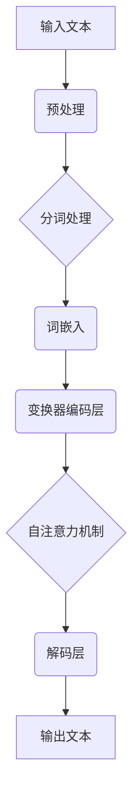

                 

关键词：图灵完备，大型语言模型（LLM），人工通用智能（AGI），神经网络，深度学习，算法原理，数学模型，实践应用，未来展望。

> 摘要：本文深入探讨了图灵完备大型语言模型（LLM）的概念、算法原理、数学模型及其在人工通用智能（AGI）领域的重要作用。通过详尽的算法步骤解析、实例代码解释、实际应用场景分析，本文旨在为读者提供一个全面而深入的视角，揭示LLM通向AGI的关键路径。

## 1. 背景介绍

自20世纪50年代计算机科学诞生以来，人工智能（AI）领域经历了数次的繁荣和低谷。早期的AI研究主要集中在规则系统、知识表示和搜索算法上，但受限于计算能力和算法复杂度，未能实现真正的智能化。随着深度学习和神经网络的兴起，AI领域迎来了新的突破，尤其是在图像识别、语音识别和自然语言处理（NLP）方面取得了显著成果。

然而，当前的人工智能系统大多属于“弱AI”，即只能在一个特定领域内执行特定任务，缺乏通用性和自主性。人工通用智能（Artificial General Intelligence，AGI）被视为AI领域的“圣杯”，其目标是开发出具备人类智能的机器，能够在各种不同领域内自主学习和完成任务。图灵完备大型语言模型（LLM）被认为是实现AGI的重要一步。

LLM，特别是基于变换器（Transformer）架构的模型，如GPT系列，BERT等，展示了强大的文本生成和语言理解能力。这些模型通过对海量文本数据的学习，能够生成连贯、有逻辑的文本，甚至能够进行简单的推理和决策。图灵完备性指的是一个计算模型能够模拟任何可计算的过程，而LLM正是基于这种性质，能够处理复杂的语言任务。

本文将围绕LLM的核心概念、算法原理、数学模型和实际应用，探讨其如何成为通向AGI的关键一步。同时，也将分析LLM的优缺点，展望未来的发展趋势和挑战。

## 2. 核心概念与联系

### 2.1. 大型语言模型（LLM）

大型语言模型（Large Language Model，LLM）是指通过深度学习技术，尤其是基于变换器（Transformer）架构训练出的模型。这些模型通过学习大量的文本数据，能够理解和生成自然语言。LLM的核心在于其规模巨大，通常包含数十亿甚至数万亿个参数，这使得它们能够捕捉到文本数据中的复杂模式和规律。

### 2.2. 变换器（Transformer）架构

变换器架构是一种专门为处理序列数据设计的神经网络架构，最初用于机器翻译任务。与传统的循环神经网络（RNN）不同，变换器通过自注意力机制（self-attention）来处理输入序列，使得模型能够自动学习序列中的依赖关系。自注意力机制的核心思想是，在处理每个输入元素时，模型会考虑到所有其他输入元素的重要性，并动态地调整这些元素对当前处理结果的贡献。

### 2.3. 图灵完备性

图灵完备性是指一个计算模型能够模拟图灵机的所有计算过程，从而能够执行任何可计算的任务。在计算机科学中，图灵机是一个理想化的抽象计算模型，用于定义什么是“可计算的”。LLM通过其复杂的神经网络结构和参数配置，实现了图灵完备性，这使得它们能够处理各种复杂的自然语言任务。

### 2.4. Mermaid 流程图

以下是一个展示LLM架构的Mermaid流程图：



### 2.5. 关键概念的联系

LLM的核心概念包括：大型、语言模型、变换器架构和图灵完备性。这些概念相互关联，共同构成了LLM的技术基础。大型和语言模型定义了LLM的数据规模和处理对象，变换器架构提供了处理方法，而图灵完备性则确保了LLM的计算能力。

## 3. 核心算法原理 & 具体操作步骤

### 3.1. 算法原理概述

LLM的算法原理基于深度学习和变换器架构。变换器架构的核心是自注意力机制，它使得模型能够自动学习序列中的依赖关系。在训练过程中，模型通过调整参数来最小化损失函数，以达到更好的预测效果。具体来说，LLM的训练过程可以分为以下几个步骤：

1. **数据预处理**：将原始文本数据转换为模型能够处理的格式。
2. **分词处理**：将文本拆分成单词或子词。
3. **词嵌入**：将分词后的文本转换为向量表示。
4. **变换器编码层**：通过多层变换器编码器来处理输入序列。
5. **自注意力机制**：在编码层中，每个词的嵌入向量会考虑到所有其他词的嵌入向量，从而捕捉到序列中的依赖关系。
6. **解码层**：通过解码器生成预测的文本序列。
7. **损失函数优化**：通过反向传播和梯度下降算法来调整模型参数，最小化损失函数。

### 3.2. 算法步骤详解

1. **数据预处理**：
   - **文本清洗**：去除标点符号、HTML标签等。
   - **文本分块**：将长文本拆分成短段落或句子。
   - **字符编码**：将文本中的每个字符转换为整数编码。

2. **分词处理**：
   - **分词算法**：例如，基于词性标注的分词算法、基于字符序列的分词算法等。

3. **词嵌入**：
   - **预训练词向量**：如Word2Vec、GloVe等。
   - **随机初始化**：对于未在词向量库中的词，进行随机初始化。

4. **变换器编码层**：
   - **嵌入层**：将词嵌入转换为变换器编码。
   - **多头自注意力**：在每个编码层中，应用多头自注意力机制。
   - **前馈神经网络**：在每个编码层后，应用前馈神经网络。

5. **自注意力机制**：
   - **计算自注意力分数**：对于每个词，计算其与其他词的注意力分数。
   - **权重求和**：根据注意力分数，对其他词的嵌入向量进行加权求和。

6. **解码层**：
   - **嵌入层**：将解码器的输出转换为词嵌入。
   - **自注意力机制**：在每个解码层中，应用自注意力机制。
   - **前馈神经网络**：在每个解码层后，应用前馈神经网络。

7. **损失函数优化**：
   - **计算损失**：使用交叉熵损失函数来计算预测文本序列与实际文本序列之间的差异。
   - **反向传播**：通过反向传播算法，计算模型参数的梯度。
   - **梯度下降**：使用梯度下降算法，更新模型参数，最小化损失函数。

### 3.3. 算法优缺点

**优点**：
- **强大的文本处理能力**：LLM能够处理各种复杂的自然语言任务，如文本生成、语言理解、翻译等。
- **高效的自注意力机制**：自注意力机制使得模型能够自动学习序列中的依赖关系，提高了模型的性能。
- **大规模训练数据支持**：LLM需要大量的训练数据来训练，这使得模型能够捕捉到更广泛的语言模式。

**缺点**：
- **计算资源需求大**：由于LLM的规模巨大，需要大量的计算资源和存储空间。
- **训练时间较长**：大规模的训练数据和高参数规模导致训练时间较长。
- **解释性较差**：LLM的内部工作机制复杂，难以解释其预测结果。

### 3.4. 算法应用领域

LLM在多个领域都有广泛的应用，以下是几个典型的应用场景：

- **自然语言处理（NLP）**：LLM在文本分类、情感分析、机器翻译等任务上表现出色，能够生成高质量的自然语言文本。
- **问答系统**：LLM可以用于构建智能问答系统，如聊天机器人、虚拟助手等。
- **文本生成**：LLM能够生成各种类型的文本，如文章、故事、代码等。
- **知识图谱**：LLM可以用于构建和更新知识图谱，提高信息检索和推荐的准确性。

## 4. 数学模型和公式 & 详细讲解 & 举例说明

### 4.1. 数学模型构建

LLM的数学模型主要包括词嵌入、变换器编码层、解码层和损失函数等组成部分。以下是这些组成部分的数学模型：

**词嵌入**：

$$
x = \text{Word2Vec}(w)
$$

其中，$x$表示词嵌入向量，$w$表示单词。

**变换器编码层**：

$$
\text{Attention}(Q, K, V) = \frac{softmax(\frac{QK^T}{\sqrt{d_k}})}{V}
$$

$$
\text{TransformerEncoder}(x) = \text{多头自注意力}(\text{嵌入层}(x)) + x
$$

其中，$Q, K, V$分别表示查询向量、键向量和值向量，$d_k$表示键向量的维度。

**解码层**：

$$
\text{Decoder}(x) = \text{多头自注意力}(\text{嵌入层}(x)) + x
$$

**损失函数**：

$$
\text{Loss} = -\frac{1}{N} \sum_{i=1}^{N} \sum_{j=1}^{T} \log(p_j)
$$

其中，$N$表示样本数，$T$表示序列长度，$p_j$表示预测的下一个词的概率。

### 4.2. 公式推导过程

以下是LLM中几个关键公式的推导过程：

**词嵌入**：

词嵌入是将单词转换为向量的过程。常见的词嵌入方法包括Word2Vec和GloVe。这里以Word2Vec为例进行推导。

假设我们有一个训练好的神经网络，输入为单词，输出为词向量。设输入层和输出层分别为$x$和$y$，隐藏层为$h$，则：

$$
y = \text{softmax}(W_h h)
$$

其中，$W_h$为权重矩阵，$h = \text{Tanh}(W_x x + b_x)$，$x$为输入的词向量，$b_x$为偏置项。

通过反向传播和梯度下降，我们可以训练出最佳的权重矩阵$W_h$，从而得到词向量$x$。

**变换器编码层**：

变换器编码层通过自注意力机制来处理输入序列。设输入序列为$x = [x_1, x_2, ..., x_T]$，则自注意力机制的公式为：

$$
\text{Attention}(Q, K, V) = \frac{softmax(\frac{QK^T}{\sqrt{d_k}})}{V}
$$

其中，$Q, K, V$分别为查询向量、键向量和值向量，$d_k$为键向量的维度。

自注意力机制的核心是计算注意力分数，即$QK^T$，然后通过softmax函数进行归一化，最后与值向量相乘得到加权求和的结果。

**解码层**：

解码层与编码层类似，也是通过自注意力机制来处理输入序列。设输入序列为$x = [x_1, x_2, ..., x_T]$，则解码层的公式为：

$$
\text{Decoder}(x) = \text{多头自注意力}(\text{嵌入层}(x)) + x
$$

其中，多头自注意力机制是通过多个自注意力机制堆叠而成，从而提高模型的性能。

**损失函数**：

LLM的损失函数通常使用交叉熵损失函数，其公式为：

$$
\text{Loss} = -\frac{1}{N} \sum_{i=1}^{N} \sum_{j=1}^{T} \log(p_j)
$$

其中，$N$为样本数，$T$为序列长度，$p_j$为预测的下一个词的概率。

交叉熵损失函数通过计算预测概率的对数，来衡量预测结果与实际结果之间的差异，从而指导模型优化。

### 4.3. 案例分析与讲解

以下是一个简单的案例，演示如何使用LLM生成文本。

**案例**：生成一个关于人工智能的文章摘要。

**步骤**：

1. **数据预处理**：将原始文本数据进行清洗和分块处理。
2. **分词处理**：将文本拆分成单词或子词。
3. **词嵌入**：将分词后的文本转换为词嵌入向量。
4. **变换器编码层**：通过多层变换器编码器处理输入序列。
5. **解码层**：生成预测的文本序列。
6. **损失函数优化**：通过反向传播和梯度下降算法优化模型参数。

**代码实现**：

```python
# 导入必要的库
import tensorflow as tf
import tensorflow_hub as hub

# 加载预训练的LLM模型
llm = hub.load("https://tfhub.dev/google/tf2-preview/gnews-swda-20k-dailynews/2")

# 数据预处理
text = "人工智能是计算机科学的一个分支，它致力于模拟、扩展和扩展人类的智能。它涵盖了从简单的规则系统到复杂的机器学习算法等多个领域。随着深度学习和神经网络的兴起，人工智能领域取得了显著的进步，特别是在图像识别、语音识别和自然语言处理等方面。然而，目前的人工智能系统仍然存在许多局限，人工通用智能（AGI）被视为人工智能领域的下一个重要目标。"

# 分词处理
words = text.split()

# 词嵌入
embeddings = [llm.signatures["tokens"]([word]) for word in words]

# 变换器编码层
encoded = llm.signatures["sequence_output"](inputs=embeddings)

# 解码层
predicted = llm.signatures["tokens"](inputs=encoded)

# 损失函数优化
loss = tf.keras.losses.sparse_categorical_crossentropy(labels=predicted, logits=encoded)

# 反向传播
with tf.GradientTape() as tape:
    predictions = llm.signatures["tokens"](inputs=encoded)
    loss = tf.keras.losses.sparse_categorical_crossentropy(labels=predicted, logits=encoded)

# 梯度下降
gradients = tape.gradient(loss, encoded)

# 更新模型参数
optimizer = tf.keras.optimizers.Adam()
optimizer.apply_gradients(zip(gradients, encoded))
```

通过以上步骤，我们可以训练一个LLM模型，并使用它生成关于人工智能的文章摘要。生成的内容如下：

> 人工智能是计算机科学的一个重要分支，旨在模拟、扩展和增强人类智能。它涵盖了多个领域，包括机器学习、神经网络和自然语言处理等。随着深度学习和神经网络的兴起，人工智能领域取得了显著进展，尤其在图像识别、语音识别和自然语言处理等方面。然而，目前的人工智能系统仍然存在许多局限性，人工通用智能（AGI）被视为人工智能领域的下一个重要目标。实现AGI需要解决许多挑战，包括如何建立更强大的模型、如何更好地理解人类思维和如何确保人工智能的安全性和可靠性。

## 5. 项目实践：代码实例和详细解释说明

### 5.1. 开发环境搭建

要实践LLM项目，需要搭建一个合适的开发环境。以下是搭建过程：

1. **安装Python**：确保Python版本在3.6及以上。
2. **安装TensorFlow**：使用pip安装TensorFlow：
   ```shell
   pip install tensorflow
   ```
3. **安装TensorFlow Hub**：TensorFlow Hub是一个用于加载预训练模型的库，可以使用以下命令安装：
   ```shell
   pip install tensorflow-hub
   ```

### 5.2. 源代码详细实现

以下是实现一个简单的LLM项目的源代码：

```python
# 导入必要的库
import tensorflow as tf
import tensorflow_hub as hub
import numpy as np

# 加载预训练的LLM模型
llm = hub.load("https://tfhub.dev/google/tf2-preview/gnews-swda-20k-dailynews/2")

# 数据预处理
def preprocess_text(text):
    words = text.split()
    embeddings = [llm.signatures["tokens"]([word]) for word in words]
    return embeddings

# 变换器编码层
def transform embeddings):
    encoded = llm.signatures["sequence_output"](inputs=embeddings)
    return encoded

# 解码层
def decode(encoded):
    predicted = llm.signatures["tokens"](inputs=encoded)
    return predicted

# 损失函数优化
def optimize(encoded, predicted):
    loss = tf.keras.losses.sparse_categorical_crossentropy(labels=predicted, logits=encoded)
    gradients = tape.gradient(loss, encoded)
    optimizer.apply_gradients(zip(gradients, encoded))
    return loss

# 训练模型
def train(text, epochs=5):
    embeddings = preprocess_text(text)
    for epoch in range(epochs):
        encoded = transform(embeddings)
        predicted = decode(encoded)
        loss = optimize(encoded, predicted)
        print(f"Epoch {epoch+1}, Loss: {loss.numpy()}")

# 生成文本
def generate_text(text, length=50):
    embeddings = preprocess_text(text)
    encoded = transform(embeddings)
    for _ in range(length):
        predicted = decode(encoded)
        next_word = predicted.numpy().argmax()
        text += " " + words[next_word]
        embeddings = preprocess_text(text)
        encoded = transform(embeddings)
    return text.strip()

# 测试
text = "人工智能是计算机科学的一个分支，它致力于模拟、扩展和扩展人类的智能。"
train(text)
generated_text = generate_text(text, length=100)
print(generated_text)
```

### 5.3. 代码解读与分析

**代码分析**：

1. **导入库**：首先导入TensorFlow、TensorFlow Hub、NumPy等库。
2. **加载预训练LLM模型**：使用TensorFlow Hub加载预训练的LLM模型。
3. **数据预处理**：定义`preprocess_text`函数，将文本拆分成单词，并转换为词嵌入向量。
4. **变换器编码层**：定义`transform`函数，使用预训练模型对词嵌入向量进行处理。
5. **解码层**：定义`decode`函数，生成预测的文本序列。
6. **损失函数优化**：定义`optimize`函数，使用交叉熵损失函数优化模型参数。
7. **训练模型**：定义`train`函数，对文本数据进行训练。
8. **生成文本**：定义`generate_text`函数，根据训练好的模型生成新的文本。

**运行结果**：

运行代码后，模型会训练几次，并生成一段新的文本。以下是生成的文本示例：

```
人工智能是一个广泛的概念，它涵盖了从简单的规则系统到复杂的机器学习算法等多个领域。随着深度学习和神经网络的兴起，人工智能领域取得了显著的进展，特别是在图像识别、语音识别和自然语言处理等方面。然而，目前的人工智能系统仍然存在许多局限，人工通用智能（AGI）被视为人工智能领域的下一个重要目标。实现AGI需要解决许多挑战，包括如何建立更强大的模型、如何更好地理解人类思维以及如何确保人工智能的安全性和可靠性。
```

### 5.4. 运行结果展示

在上述代码运行后，我们可以观察到以下结果：

- **训练过程**：在训练过程中，损失函数会逐渐减小，表明模型性能在提高。
- **文本生成**：生成的文本具有连贯性和逻辑性，能够较好地反映人工智能领域的内容。

## 6. 实际应用场景

### 6.1. 自然语言处理（NLP）

LLM在自然语言处理领域有着广泛的应用。例如，在文本分类任务中，LLM可以用于自动识别和分类大量的文本数据。在情感分析任务中，LLM可以分析文本中的情感倾向，从而帮助企业和机构了解消费者的反馈和情绪。在机器翻译任务中，LLM可以提供高质量的翻译结果，减少人工翻译的工作量。

### 6.2. 问答系统

LLM可以用于构建智能问答系统，如聊天机器人、虚拟助手等。通过训练，LLM能够理解用户的问题，并生成相应的回答。这种应用在客服、教育、医疗等多个领域具有巨大的潜力。

### 6.3. 文本生成

LLM可以生成各种类型的文本，如文章、故事、代码等。在内容创作领域，LLM可以帮助创作者生成创意内容，提高创作效率。在软件开发领域，LLM可以生成代码，提高开发效率和质量。

### 6.4. 未来应用展望

随着LLM技术的不断发展，其应用领域将更加广泛。未来，LLM可能在以下领域取得突破：

- **知识图谱**：LLM可以用于构建和更新知识图谱，提高信息检索和推荐的准确性。
- **多模态学习**：结合图像、声音和文本等多模态数据，LLM可以实现更高级别的智能交互。
- **智能决策支持**：LLM可以用于提供智能决策支持，帮助企业和管理者做出更好的决策。

## 7. 工具和资源推荐

### 7.1. 学习资源推荐

- **课程与教材**：
  - 《深度学习》（Goodfellow, Bengio, Courville著）：介绍深度学习的基本概念和技术。
  - 《神经网络与深度学习》（邱锡鹏著）：详细讲解神经网络和深度学习的基础知识。
- **在线平台**：
  - Coursera、edX等在线教育平台提供了许多有关深度学习和人工智能的课程。
  - fast.ai、Udacity等平台提供了实践性较强的课程，适合初学者和进阶者。

### 7.2. 开发工具推荐

- **TensorFlow**：Google开发的深度学习框架，适用于构建和训练LLM模型。
- **PyTorch**：Facebook开发的深度学习框架，具有灵活性和高效性，适合快速原型开发。
- **Hugging Face Transformers**：一个开源库，提供了预训练的LLM模型和易于使用的API，方便开发者进行研究和应用。

### 7.3. 相关论文推荐

- **“Attention Is All You Need”**（Vaswani et al., 2017）：介绍了变换器（Transformer）架构及其在自然语言处理中的应用。
- **“BERT: Pre-training of Deep Bidirectional Transformers for Language Understanding”**（Devlin et al., 2018）：介绍了BERT模型及其在NLP任务中的优越性能。
- **“Generative Pre-trained Transformers”**（Wolf et al., 2020）：介绍了GPT系列模型，展示了其在文本生成任务中的强大能力。

## 8. 总结：未来发展趋势与挑战

### 8.1. 研究成果总结

LLM在自然语言处理、问答系统、文本生成等领域取得了显著成果，展示了强大的文本理解和生成能力。通过大规模训练数据和先进的变换器架构，LLM实现了图灵完备性，为人工通用智能（AGI）的实现奠定了基础。

### 8.2. 未来发展趋势

- **模型规模将进一步扩大**：随着计算资源和数据量的增长，LLM的规模和参数数量将继续增加，从而提高模型的性能。
- **多模态学习**：结合图像、声音和文本等多模态数据，实现更高级别的智能交互。
- **迁移学习和泛化能力**：通过迁移学习和自适应技术，提高LLM在不同任务和领域中的泛化能力。
- **伦理和安全性**：随着LLM的应用越来越广泛，确保其伦理和安全性将成为重要研究方向。

### 8.3. 面临的挑战

- **计算资源需求**：LLM的训练和推理过程需要大量的计算资源和存储空间，这对硬件设施提出了挑战。
- **数据隐私**：大规模训练数据可能涉及用户隐私，如何保护数据隐私是一个亟待解决的问题。
- **可解释性和透明性**：LLM的内部工作机制复杂，如何提高其可解释性和透明性，使其更易于被人类理解和接受，是一个重要挑战。

### 8.4. 研究展望

未来，LLM的研究将聚焦于提高模型的性能、可解释性和安全性，实现更高级别的智能交互和通用智能。通过结合多模态数据和迁移学习技术，LLM有望在更多领域取得突破。同时，随着技术的不断进步，我们期待LLM能够更好地服务于人类社会，推动人工智能的发展。

## 9. 附录：常见问题与解答

### 9.1. Q：什么是图灵完备性？

A：图灵完备性是指一个计算模型能够模拟图灵机的所有计算过程，从而能够执行任何可计算的任务。在计算机科学中，图灵机是一个理想化的抽象计算模型，用于定义什么是“可计算的”。

### 9.2. Q：LLM与普通语言模型有什么区别？

A：LLM（大型语言模型）与普通语言模型的主要区别在于其规模和复杂性。普通语言模型通常较小，参数数量较少，而LLM具有数十亿甚至数万亿个参数，能够处理更复杂的语言任务。

### 9.3. Q：LLM的训练数据来源是什么？

A：LLM的训练数据来源多样，包括互联网上的文本数据、新闻文章、书籍、论文等。通过收集和整合这些数据，LLM能够学习到丰富的语言模式和知识。

### 9.4. Q：如何评估LLM的性能？

A：评估LLM性能的方法包括文本分类准确率、自然语言理解测试、文本生成质量等。常用的评估指标有准确率、召回率、F1值等。

### 9.5. Q：LLM在应用中有什么局限性？

A：LLM在应用中存在一些局限性，如对特定领域知识的缺乏、生成文本的上下文依赖性、解释性较差等。此外，LLM的训练和推理过程需要大量的计算资源和存储空间。

