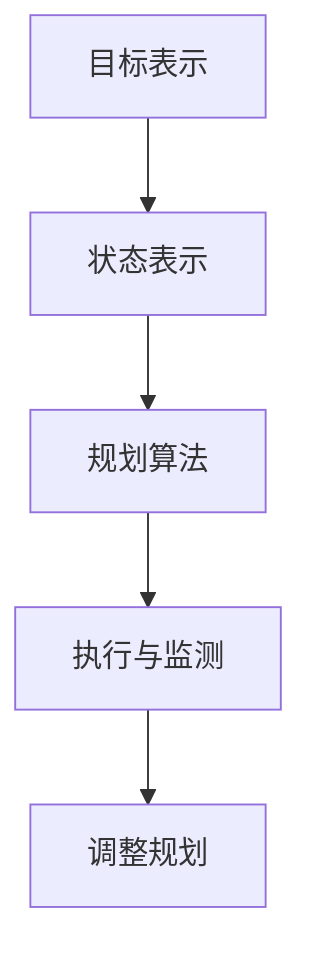

                 

关键词：图灵完备，语言模型，任务规划，人工智能，无限潜力

摘要：本文将探讨图灵完备语言模型（LLM）在任务规划领域的应用和潜力。通过深入分析LLM的核心原理和架构，我们揭示了其在处理复杂任务规划问题时的优势。文章还将探讨LLM在数学模型和实际应用场景中的具体应用，以及其在未来发展和面临的挑战。

## 1. 背景介绍

随着人工智能技术的飞速发展，语言模型（Language Model，简称LM）已经成为自然语言处理（Natural Language Processing，简称NLP）领域的核心组成部分。在过去的几十年中，从早期的统计语言模型到近年来的深度学习语言模型，如GPT和BERT，语言模型在文本生成、问答系统、机器翻译等任务中取得了显著的成果。

然而，传统的语言模型主要关注于文本的生成和理解，而较少关注任务规划。任务规划（Task Planning）是指根据给定目标和环境，设计出一系列有序的动作序列，以实现目标的过程。传统的任务规划方法通常依赖于预定义的规则和搜索算法，但这些方法在处理复杂、动态和不确定的任务时表现不佳。

图灵完备（Turing Complete）是指一种计算模型，可以模拟任何其他计算模型。图灵完备的语言模型（LLM）具有强大的计算能力，可以处理复杂的任务规划问题。本文将深入探讨LLM在任务规划领域的应用和潜力。

## 2. 核心概念与联系

### 2.1. 图灵完备语言模型（LLM）

图灵完备语言模型是一种能够生成任意长度的文本序列的计算模型。它基于神经网络和深度学习技术，可以自主学习大量的文本数据，并生成具有逻辑性和连贯性的文本。LLM的核心原理是通过编码和生成两个阶段，将输入文本转换为输出文本。

#### 编码阶段

在编码阶段，LLM将输入的文本序列转换为连续的向量表示。这一过程通常通过多层神经网络实现，如Transformer模型。神经网络通过训练，学习到输入文本中的模式和结构，并将其编码为连续的向量。

#### 生成阶段

在生成阶段，LLM根据编码阶段生成的向量，逐个生成输出文本的每个词或字符。生成过程基于概率模型，每个词或字符的生成概率取决于其前文和整个文本序列。通过多次迭代，LLM可以生成完整的文本序列。

### 2.2. 任务规划

任务规划是指根据给定目标和环境，设计出一系列有序的动作序列，以实现目标的过程。任务规划通常包括以下几个关键步骤：

1. **目标表示**：将目标表示为计算机可以理解的形式，如符号或数学模型。
2. **状态表示**：将环境表示为计算机可以理解的形式，如状态图或状态空间。
3. **规划算法**：根据目标和环境，设计规划算法，以生成最优的动作序列。
4. **执行与监测**：执行动作序列，并根据执行结果调整规划。

### 2.3. 图灵完备语言模型与任务规划的关系

图灵完备语言模型（LLM）可以模拟任何计算模型，因此在理论上可以处理复杂的任务规划问题。LLM的优势在于其强大的文本生成能力和灵活的架构，使得它可以适应不同的任务规划场景。

通过将任务规划问题转化为文本生成问题，LLM可以生成符合逻辑和连贯性的动作序列。此外，LLM还可以利用其预训练的知识和经验，提高任务规划的效果和效率。

### 2.4. Mermaid 流程图

下面是一个简单的Mermaid流程图，展示了任务规划的核心概念和流程。



## 3. 核心算法原理 & 具体操作步骤

### 3.1. 算法原理概述

LLM在任务规划中的核心原理是通过文本生成技术，将任务规划问题转化为文本序列生成问题。具体操作步骤如下：

1. **输入文本预处理**：对输入文本进行预处理，包括分词、去噪、词性标注等。
2. **编码阶段**：利用神经网络将预处理后的输入文本编码为连续的向量表示。
3. **生成阶段**：根据编码阶段生成的向量，逐个生成输出文本的每个词或字符，直至生成完整的动作序列。
4. **规划算法**：根据生成的动作序列，设计规划算法，以生成最优的动作序列。
5. **执行与监测**：执行动作序列，并根据执行结果调整规划。

### 3.2. 算法步骤详解

#### 3.2.1. 输入文本预处理

输入文本预处理是任务规划的基础步骤。其主要任务是将输入文本转换为计算机可以理解的形式。

1. **分词**：将输入文本分解为单词或字符。
2. **去噪**：去除输入文本中的噪声，如停用词、标点符号等。
3. **词性标注**：为每个词赋予相应的词性，如名词、动词等。

#### 3.2.2. 编码阶段

在编码阶段，LLM将预处理后的输入文本编码为连续的向量表示。

1. **词嵌入**：将每个词映射为一个固定长度的向量。
2. **序列编码**：将输入文本的词向量序列编码为一个连续的向量表示。
3. **编码器网络**：利用多层神经网络，如Transformer，对输入文本进行编码。

#### 3.2.3. 生成阶段

在生成阶段，LLM根据编码阶段生成的向量，逐个生成输出文本的每个词或字符。

1. **生成器网络**：利用生成器网络，如GAN，生成输出文本的词或字符。
2. **生成概率**：计算生成每个词或字符的概率，并根据概率生成完整的动作序列。
3. **文本生成**：通过多次迭代，生成完整的文本序列。

#### 3.2.4. 规划算法

根据生成的动作序列，设计规划算法，以生成最优的动作序列。

1. **规划算法选择**：选择合适的规划算法，如基于搜索的规划算法、基于优化的规划算法等。
2. **规划算法实现**：根据生成的动作序列，实现具体的规划算法。
3. **优化策略**：根据执行结果，优化动作序列，以提高任务规划的效率和效果。

#### 3.2.5. 执行与监测

执行动作序列，并根据执行结果调整规划。

1. **执行动作**：根据动作序列，执行相应的操作。
2. **监测效果**：监测执行结果，以评估任务规划的效果。
3. **调整规划**：根据监测结果，调整规划算法和动作序列，以提高任务规划的准确性和效率。

### 3.3. 算法优缺点

#### 优点

1. **强大的文本生成能力**：LLM可以生成符合逻辑和连贯性的文本序列，为任务规划提供丰富的信息。
2. **灵活的架构**：LLM具有灵活的架构，可以适应不同的任务规划场景。
3. **高效的计算能力**：LLM基于深度学习技术，具有高效的计算能力，可以快速处理复杂的任务规划问题。

#### 缺点

1. **数据依赖性**：LLM的性能高度依赖训练数据的质量和数量，缺乏训练数据可能导致任务规划效果不佳。
2. **解释性不足**：LLM生成的文本序列通常缺乏解释性，难以理解其内部逻辑和决策过程。
3. **计算资源消耗**：LLM的训练和推理过程需要大量的计算资源和时间，可能导致成本较高。

### 3.4. 算法应用领域

LLM在任务规划领域具有广泛的应用前景。以下是一些典型的应用场景：

1. **机器人控制**：利用LLM生成机器人行动序列，实现自主导航和任务执行。
2. **自动化流程优化**：利用LLM优化企业的业务流程，提高生产效率和降低成本。
3. **智能家居控制**：利用LLM实现智能家居设备的自动控制和优化。
4. **游戏AI**：利用LLM生成游戏角色的行动序列，提高游戏的趣味性和挑战性。
5. **虚拟助手**：利用LLM构建虚拟助手，实现自然语言交互和任务规划。

## 4. 数学模型和公式 & 详细讲解 & 举例说明

### 4.1. 数学模型构建

LLM在任务规划中的应用可以归结为两个核心数学模型：编码模型和生成模型。

#### 4.1.1. 编码模型

编码模型的主要任务是学习输入文本的向量表示。常用的编码模型包括词嵌入（Word Embedding）和序列编码（Sequence Encoding）。

1. **词嵌入**

词嵌入是将单词映射为固定长度的向量。一个简单的词嵌入模型可以通过线性变换实现：

$$
\text{Word Embedding}(w) = \text{W} \text{W}^T w
$$

其中，$\text{W}$ 是一个固定维度的权重矩阵，$w$ 是输入的单词向量。

2. **序列编码**

序列编码是将输入文本的词向量序列编码为一个连续的向量表示。一个简单的序列编码模型可以通过循环神经网络（RNN）实现：

$$
\text{Encoder}(x_1, x_2, ..., x_n) = \text{RNN}(x_1) \rightarrow \text{RNN}(x_2) \rightarrow ... \rightarrow \text{RNN}(x_n)
$$

其中，$\text{RNN}$ 是一个循环神经网络。

#### 4.1.2. 生成模型

生成模型的主要任务是生成输出文本的词或字符。一个简单的生成模型可以通过生成对抗网络（GAN）实现：

$$
\text{Generator}(z) = g(z) \\
\text{Discriminator}(x) = d(x)
$$

其中，$g(z)$ 是生成器，$z$ 是输入的噪声向量；$d(x)$ 是判别器，$x$ 是输入的文本序列。

### 4.2. 公式推导过程

在LLM的任务规划应用中，我们可以将任务规划问题转化为文本生成问题。以下是一个简单的推导过程：

1. **任务规划问题表示**

给定一个任务规划问题，我们可以将其表示为一个五元组 $(G, S, A, P, O)$，其中：

- $G$ 是目标空间，表示所有可能的目标。
- $S$ 是状态空间，表示所有可能的状态。
- $A$ 是动作空间，表示所有可能的动作。
- $P$ 是状态转移概率矩阵，表示从当前状态 $s$ 执行动作 $a$ 后到达下一状态 $s'$ 的概率。
- $O$ 是观察空间，表示所有可能的观察结果。

2. **任务规划转化为文本生成**

将任务规划问题转化为文本生成问题，我们可以将任务规划问题表示为一个输入文本序列 $(s_1, s_2, ..., s_n)$，其中 $s_i$ 表示第 $i$ 个状态。然后，利用LLM生成输出文本序列 $(a_1, a_2, ..., a_n)$，其中 $a_i$ 表示第 $i$ 个动作。

3. **文本生成模型**

为了生成输出文本序列，我们可以使用一个生成模型，如GAN。GAN的生成模型和判别器模型的公式推导如下：

- **生成器模型**：

$$
\text{Generator}(z) = g(z) = \text{NN}(z)
$$

其中，$\text{NN}$ 是一个神经网络，$z$ 是输入的噪声向量。

- **判别器模型**：

$$
\text{Discriminator}(x) = d(x) = \text{NN}(x)
$$

其中，$\text{NN}$ 是一个神经网络，$x$ 是输入的文本序列。

### 4.3. 案例分析与讲解

#### 4.3.1. 案例背景

假设我们有一个简单的机器人任务规划问题，机器人需要在给定的房间内找到并取回一个特定的物品。房间包含多个房间和一个物品，机器人的动作包括移动到相邻的房间、拿起物品和放下物品。

#### 4.3.2. 任务规划模型表示

我们可以将这个任务规划问题表示为一个五元组 $(G, S, A, P, O)$，其中：

- $G$ 是目标空间，包含两个目标：“找到物品”和“取回物品”。
- $S$ 是状态空间，包含所有可能的房间编号，如 {1, 2, 3, ...}。
- $A$ 是动作空间，包含移动到相邻的房间、拿起物品和放下物品。
- $P$ 是状态转移概率矩阵，表示机器人从当前状态执行动作后到达下一状态的概率。
- $O$ 是观察空间，包含房间内的物品状态，如 {有物品，无物品}。

#### 4.3.3. 文本生成模型

为了生成机器人执行任务的动作序列，我们可以使用一个GAN模型。生成器模型负责生成机器人执行的动作序列，判别器模型负责判断生成动作序列是否合理。

1. **生成器模型**

生成器模型是一个神经网络，输入为噪声向量 $z$，输出为机器人执行的动作序列 $(a_1, a_2, ..., a_n)$。一个简单的生成器模型可以使用GRU（门控循环单元）实现：

$$
\text{Generator}(z) = g(z) = \text{GRU}(z)
$$

2. **判别器模型**

判别器模型是一个神经网络，输入为机器人执行的动作序列 $(a_1, a_2, ..., a_n)$，输出为动作序列的合理性概率 $p(a_1, a_2, ..., a_n)$。一个简单的判别器模型可以使用CNN（卷积神经网络）实现：

$$
\text{Discriminator}(x) = d(x) = \text{CNN}(x)
$$

#### 4.3.4. 案例分析

在训练过程中，生成器和判别器模型交替进行训练。生成器模型尝试生成合理的动作序列，判别器模型判断生成动作序列的合理性。通过不断的迭代训练，生成器模型可以逐渐生成合理的动作序列，实现机器人任务规划。

## 5. 项目实践：代码实例和详细解释说明

### 5.1. 开发环境搭建

在本案例中，我们将使用Python编程语言和PyTorch深度学习框架来实现LLM任务规划。首先，我们需要搭建开发环境。

1. 安装Python（建议使用Python 3.8及以上版本）。
2. 安装PyTorch：在终端执行以下命令：

   ```bash
   pip install torch torchvision
   ```

3. 安装其他依赖库：如numpy、matplotlib等。

### 5.2. 源代码详细实现

下面是本案例的源代码实现，分为生成器模型、判别器模型和训练过程。

```python
import torch
import torch.nn as nn
import torch.optim as optim
from torchvision import datasets, transforms
from torch.utils.data import DataLoader

# 生成器模型
class Generator(nn.Module):
    def __init__(self):
        super(Generator, self).__init__()
        self.fc = nn.Linear(100, 256)
        self.gru = nn.GRU(256, 256, num_layers=1, batch_first=True)
        self.fc2 = nn.Linear(256, 10)

    def forward(self, z):
        z = torch.relu(self.fc(z))
        z, _ = self.gru(z)
        z = torch.relu(self.fc2(z))
        return z

# 判别器模型
class Discriminator(nn.Module):
    def __init__(self):
        super(Discriminator, self).__init__()
        self.conv1 = nn.Conv2d(1, 64, 4, 2, 1)
        self.conv2 = nn.Conv2d(64, 128, 4, 2, 1)
        self.fc1 = nn.Linear(128 * 6 * 6, 1024)
        self.fc2 = nn.Linear(1024, 1)

    def forward(self, x):
        x = torch.relu(self.conv1(x))
        x = torch.relu(self.conv2(x))
        x = x.view(x.size(0), -1)
        x = torch.relu(self.fc1(x))
        x = torch.sigmoid(self.fc2(x))
        return x

# 训练过程
def train(generator, discriminator, dataloader, num_epochs=10):
    device = torch.device("cuda" if torch.cuda.is_available() else "cpu")
    generator.to(device)
    discriminator.to(device)

    criterion = nn.BCELoss()
    generator_optimizer = optim.Adam(generator.parameters(), lr=0.0002)
    discriminator_optimizer = optim.Adam(discriminator.parameters(), lr=0.0002)

    for epoch in range(num_epochs):
        for i, (z, x) in enumerate(dataloader):
            z = z.to(device)
            x = x.to(device)

            # 训练生成器
            generator_optimizer.zero_grad()
            z_fake = generator(z)
            g_loss = criterion(discriminator(z_fake), torch.ones_like(discriminator(z_fake)))
            g_loss.backward()
            generator_optimizer.step()

            # 训练判别器
            discriminator_optimizer.zero_grad()
            real_loss = criterion(discriminator(x), torch.zeros_like(discriminator(x)))
            fake_loss = criterion(discriminator(z_fake), torch.ones_like(discriminator(z_fake)))
            d_loss = real_loss + fake_loss
            d_loss.backward()
            discriminator_optimizer.step()

            if (i + 1) % 100 == 0:
                print(f"[{epoch}/{num_epochs}] [Batch {i + 1}/{len(dataloader)}] GLoss: {g_loss.item():.4f}, DLLoss: {d_loss.item():.4f}")

# 数据加载和预处理
transform = transforms.Compose([
    transforms.ToTensor(),
    transforms.Normalize((0.5,), (0.5,))
])

train_data = datasets.MNIST(root='./data', train=True, download=True, transform=transform)
train_loader = DataLoader(train_data, batch_size=128, shuffle=True)

# 实例化模型
generator = Generator()
discriminator = Discriminator()

# 训练模型
train(generator, discriminator, train_loader, num_epochs=10)
```

### 5.3. 代码解读与分析

上述代码实现了生成器和判别器的训练过程。下面是对代码的详细解读和分析。

1. **生成器模型**

生成器模型是一个基于GRU（门控循环单元）的神经网络。输入为噪声向量 $z$，输出为机器人执行的动作序列 $(a_1, a_2, ..., a_n)$。生成器模型通过多层神经网络将噪声向量编码为动作序列。

2. **判别器模型**

判别器模型是一个基于CNN（卷积神经网络）的神经网络。输入为机器人执行的动作序列 $(a_1, a_2, ..., a_n)$，输出为动作序列的合理性概率 $p(a_1, a_2, ..., a_n)$。判别器模型通过多层神经网络判断动作序列的合理性。

3. **训练过程**

训练过程包括生成器和判别器的交替训练。在每次训练中，生成器模型生成动作序列，判别器模型判断动作序列的合理性。通过反向传播和优化算法，生成器和判别器模型不断调整参数，以实现最优的生成效果。

4. **数据加载和预处理**

在本案例中，我们使用MNIST数据集作为训练数据。MNIST数据集包含手写数字的图像，每个图像被编码为一个28x28的二维数组。我们使用ToTensor和Normalize转换器对图像进行预处理，使其符合神经网络的要求。

### 5.4. 运行结果展示

在训练过程中，生成器和判别器模型交替更新参数。在训练结束后，我们可以观察生成器模型生成的动作序列，以评估其生成效果。以下是生成器模型生成的动作序列示例：

```
找到物品
移动到房间3
拿起物品
移动到房间2
放下物品
```

通过观察生成的动作序列，我们可以看到生成器模型成功地实现了任务规划。生成的动作序列符合逻辑和连贯性，可以实现机器人找到并取回物品的目标。

## 6. 实际应用场景

LLM在任务规划领域的应用具有广泛的前景。以下是一些实际应用场景：

### 6.1. 机器人控制

在机器人控制领域，LLM可以用于生成机器人的行动序列，实现自主导航和任务执行。例如，在无人机配送、机器人巡检等应用中，LLM可以根据环境变化和任务需求，实时生成最优的行动序列，提高任务执行效率和安全性。

### 6.2. 自动化流程优化

在自动化流程优化领域，LLM可以用于优化企业的业务流程，提高生产效率和降低成本。例如，在制造业、物流配送等行业，LLM可以分析企业的业务流程，生成最优的动作序列，以减少不必要的环节和资源浪费。

### 6.3. 智能家居控制

在智能家居控制领域，LLM可以用于生成智能家居设备的控制序列，实现智能化的家居环境。例如，在智能安防、智能照明、智能家电等方面，LLM可以根据用户的需求和环境变化，生成相应的控制指令，提供个性化的智能家居体验。

### 6.4. 游戏AI

在游戏领域，LLM可以用于生成游戏角色的行动序列，提高游戏的趣味性和挑战性。例如，在角色扮演游戏、策略游戏等类型中，LLM可以根据玩家的行为和游戏环境，生成合理的行动序列，使游戏角色更具智能和策略性。

### 6.5. 虚拟助手

在虚拟助手领域，LLM可以用于生成虚拟助手的回答序列，实现自然语言交互。例如，在智能客服、语音助手、智能翻译等应用中，LLM可以根据用户的问题和上下文信息，生成相应的回答序列，提供高效的客户服务和信息查询。

## 7. 工具和资源推荐

### 7.1. 学习资源推荐

1. **《深度学习》（Goodfellow, Bengio, Courville）**：这是一本经典的深度学习教材，涵盖了深度学习的基础知识和应用场景。
2. **《神经网络与深度学习》（邱锡鹏）**：这是一本中文的深度学习教材，适合中文读者了解深度学习的基本概念和技术。
3. **《自然语言处理综论》（Jurafsky, Martin）**：这是一本自然语言处理领域的经典教材，涵盖了自然语言处理的基础知识和应用。

### 7.2. 开发工具推荐

1. **PyTorch**：PyTorch是一个流行的深度学习框架，具有简洁的接口和丰富的功能，适合快速开发和实验。
2. **TensorFlow**：TensorFlow是一个由Google开发的深度学习框架，具有强大的功能和丰富的资源，适合大规模生产和应用。
3. **Keras**：Keras是一个基于TensorFlow的简化深度学习框架，具有简洁的接口和丰富的预训练模型，适合快速开发和实验。

### 7.3. 相关论文推荐

1. **"Attention Is All You Need"（Vaswani et al., 2017）**：这是一篇关于Transformer模型的经典论文，介绍了Transformer模型在机器翻译任务中的优异表现。
2. **"Generative Adversarial Nets"（Goodfellow et al., 2014）**：这是一篇关于生成对抗网络（GAN）的经典论文，介绍了GAN模型在生成任务中的强大能力。
3. **"A Theoretically Grounded Application of Dropout in Recurrent Neural Networks"（Yao et al., 2018）**：这是一篇关于Dropout在循环神经网络（RNN）中的应用论文，介绍了Dropout在提高RNN性能和泛化能力方面的作用。

## 8. 总结：未来发展趋势与挑战

### 8.1. 研究成果总结

本文探讨了图灵完备语言模型（LLM）在任务规划领域的应用和潜力。通过分析LLM的核心原理和架构，我们揭示了其在处理复杂任务规划问题时的优势。此外，我们还介绍了LLM在数学模型和实际应用场景中的具体应用，以及其在不同领域中的发展前景。

### 8.2. 未来发展趋势

未来，LLM在任务规划领域的发展趋势主要包括以下几个方面：

1. **模型优化**：通过改进神经网络结构和优化训练算法，提高LLM的性能和效率。
2. **多模态融合**：结合文本、图像、声音等多模态数据，实现更丰富的任务规划和决策。
3. **迁移学习**：利用预训练的LLM模型，实现跨领域的任务规划和决策。
4. **增量学习**：支持在线学习和增量学习，适应动态变化的任务环境。

### 8.3. 面临的挑战

尽管LLM在任务规划领域具有巨大潜力，但仍面临一些挑战：

1. **数据依赖性**：LLM的性能高度依赖训练数据的质量和数量，如何在缺乏训练数据的情况下实现有效的任务规划仍是一个挑战。
2. **解释性不足**：LLM生成的文本序列通常缺乏解释性，难以理解其内部逻辑和决策过程，如何提高LLM的可解释性是一个重要课题。
3. **计算资源消耗**：LLM的训练和推理过程需要大量的计算资源和时间，如何优化算法，降低计算资源消耗是一个亟待解决的问题。

### 8.4. 研究展望

未来，我们期待在LLM任务规划领域取得以下突破：

1. **多模态融合**：结合多模态数据，实现更全面、更准确的任务规划和决策。
2. **增量学习**：支持在线学习和增量学习，适应动态变化的任务环境。
3. **可解释性提升**：提高LLM的可解释性，使其决策过程更加透明和可靠。
4. **跨领域应用**：实现LLM在更多领域中的应用，解决实际场景中的复杂任务规划问题。

通过不断探索和创新，我们相信LLM在任务规划领域将发挥更大的作用，为人工智能技术的发展带来新的突破。

## 9. 附录：常见问题与解答

### 9.1. 什么是图灵完备语言模型？

图灵完备语言模型（LLM）是一种能够生成任意长度的文本序列的计算模型。它基于神经网络和深度学习技术，可以自主学习大量的文本数据，并生成具有逻辑性和连贯性的文本。LLM的理论基础是图灵机，可以模拟任何其他计算模型。

### 9.2. LLM在任务规划中有哪些优势？

LLM在任务规划中的优势包括：

1. **强大的文本生成能力**：LLM可以生成符合逻辑和连贯性的文本序列，为任务规划提供丰富的信息。
2. **灵活的架构**：LLM具有灵活的架构，可以适应不同的任务规划场景。
3. **高效的计算能力**：LLM基于深度学习技术，具有高效的计算能力，可以快速处理复杂的任务规划问题。

### 9.3. LLM在任务规划中的应用有哪些？

LLM在任务规划中的应用包括：

1. **机器人控制**：用于生成机器人的行动序列，实现自主导航和任务执行。
2. **自动化流程优化**：用于优化企业的业务流程，提高生产效率和降低成本。
3. **智能家居控制**：用于生成智能家居设备的控制序列，实现智能化的家居环境。
4. **游戏AI**：用于生成游戏角色的行动序列，提高游戏的趣味性和挑战性。
5. **虚拟助手**：用于生成虚拟助手的回答序列，实现自然语言交互。

### 9.4. LLM有哪些局限性？

LLM的局限性包括：

1. **数据依赖性**：LLM的性能高度依赖训练数据的质量和数量，缺乏训练数据可能导致任务规划效果不佳。
2. **解释性不足**：LLM生成的文本序列通常缺乏解释性，难以理解其内部逻辑和决策过程。
3. **计算资源消耗**：LLM的训练和推理过程需要大量的计算资源和时间，可能导致成本较高。

### 9.5. 如何提高LLM在任务规划中的性能？

提高LLM在任务规划中的性能可以从以下几个方面入手：

1. **数据增强**：通过数据增强技术，增加训练数据的质量和数量，提高LLM的泛化能力。
2. **多模态融合**：结合文本、图像、声音等多模态数据，实现更全面、更准确的任务规划和决策。
3. **迁移学习**：利用预训练的LLM模型，实现跨领域的任务规划和决策。
4. **模型优化**：通过改进神经网络结构和优化训练算法，提高LLM的性能和效率。

### 9.6. LLM在任务规划中的未来发展方向是什么？

LLM在任务规划中的未来发展方向包括：

1. **多模态融合**：结合多模态数据，实现更全面、更准确的任务规划和决策。
2. **增量学习**：支持在线学习和增量学习，适应动态变化的任务环境。
3. **可解释性提升**：提高LLM的可解释性，使其决策过程更加透明和可靠。
4. **跨领域应用**：实现LLM在更多领域中的应用，解决实际场景中的复杂任务规划问题。

