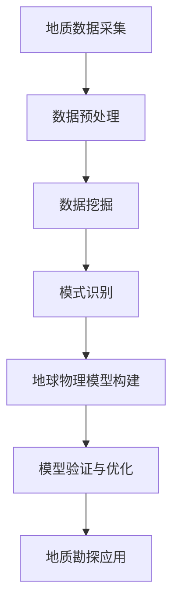

                 

关键词：地球物理模型、人工智能、地质勘探、数据挖掘、机器学习、深度学习、地学信息工程

## 摘要

本文旨在探讨地球物理模型与人工智能（AI）的深度融合，阐述两者在地质勘探、资源勘查、环境监测等领域的应用价值。通过分析地球物理模型的基本原理，结合人工智能在数据处理、模式识别等方面的优势，本文提出了基于AI的地球物理模型构建方法，并详细阐述了其在实际应用中的操作步骤和案例分析。此外，本文还讨论了地球物理模型与人工智能在未来的发展趋势、面临的挑战以及研究展望。

## 1. 背景介绍

地球物理模型是地质学领域的重要组成部分，主要用于描述地球内部的物理属性、地质结构和运动状态。传统的地球物理模型主要依赖于物理定律和地质观测数据，通过数学建模和数值模拟等方法进行分析和预测。然而，随着地质勘探技术的不断进步和数据采集能力的提升，地质数据的海量增长给传统的地球物理模型带来了巨大的挑战。

人工智能作为计算机科学的一个重要分支，近年来在图像识别、自然语言处理、语音识别等领域取得了显著的成果。人工智能利用机器学习、深度学习等算法，通过大规模数据处理和模式识别，实现了对复杂系统的自动学习和预测。将人工智能技术应用于地球物理模型，可以提升地质数据的分析能力，提高地质勘探的效率和准确性。

### 1.1 地球物理模型的基本原理

地球物理模型主要基于物理学原理，通过观测和分析地球内部的物理现象，如地震波传播、重力场变化、地磁感应等，来推断地球内部的结构和组成。常见的地球物理模型包括地震波传播模型、重力场模型、地磁感应模型等。

地震波传播模型是基于地震波在地球内部的传播特性，通过地震波的波形、振幅、传播速度等信息，推断地下介质的结构和性质。重力场模型则是通过测量地球表面的重力场变化，推断地下物质的密度分布。地磁感应模型则是通过测量地磁场的分布和变化，研究地球内部的磁场结构和地磁起源。

### 1.2 人工智能在地球物理模型中的应用

人工智能在地球物理模型中的应用主要体现在数据处理和模式识别方面。首先，人工智能可以处理大量的地质数据，通过数据挖掘和预处理，提取出对地质勘探有用的信息。其次，人工智能可以利用机器学习和深度学习算法，对地质数据进行模式识别，从而发现地质特征和规律。

例如，在地震波传播模型中，人工智能可以通过深度学习算法，对地震波的波形、振幅、传播速度等特征进行分类和预测，从而提高地震波的识别和解释能力。在重力场模型中，人工智能可以通过机器学习算法，对重力场数据进行聚类和分类，识别出地下物质密度分布的特征。

## 2. 核心概念与联系

为了更好地理解地球物理模型与人工智能的深度融合，以下将介绍核心概念，并使用Mermaid流程图展示其原理和架构。

### 2.1 核心概念

- **地球物理模型**：基于物理学原理，描述地球内部结构和性质的数学模型。
- **人工智能**：利用机器学习、深度学习等算法，实现数据的自动学习和预测。
- **地质数据**：包括地震波数据、重力场数据、地磁感应数据等。

### 2.2 Mermaid流程图



### 2.3 概念联系

地球物理模型与人工智能的深度融合体现在以下方面：

- **数据预处理**：人工智能可以自动化处理大量的地质数据，提高数据的质量和可用性。
- **数据挖掘**：通过机器学习算法，人工智能可以从地质数据中挖掘出有用的信息，如地质特征、异常点等。
- **模式识别**：利用深度学习算法，人工智能可以识别出地质数据的模式，从而提高地质勘探的效率和准确性。
- **地球物理模型构建**：基于人工智能挖掘出的地质特征和模式，可以构建更加精确和可靠的地球物理模型。
- **模型验证与优化**：通过对比模型预测结果和实际地质观测数据，人工智能可以不断优化地球物理模型，提高其准确性和稳定性。

## 3. 核心算法原理 & 具体操作步骤

### 3.1 算法原理概述

在地球物理模型与人工智能的深度融合中，核心算法主要涉及以下几个方面：

- **数据预处理算法**：包括数据清洗、归一化、特征提取等，用于提高数据的质量和可用性。
- **机器学习算法**：如支持向量机（SVM）、决策树（DT）等，用于从地质数据中挖掘出有用的信息。
- **深度学习算法**：如卷积神经网络（CNN）、循环神经网络（RNN）等，用于对地质数据进行模式识别。
- **地球物理模型构建算法**：包括地震波传播模型、重力场模型、地磁感应模型等，用于描述地球内部结构和性质。

### 3.2 算法步骤详解

#### 3.2.1 数据预处理

1. **数据清洗**：去除噪声、缺失值、异常值等，提高数据质量。
2. **数据归一化**：将不同量纲的数据转换为同一量纲，方便后续计算。
3. **特征提取**：提取地质数据中的关键特征，如地震波的振幅、频率、传播速度等。

#### 3.2.2 机器学习算法

1. **特征选择**：根据地质数据的特征重要性，选择关键特征进行建模。
2. **模型训练**：使用训练数据集，通过机器学习算法（如SVM、DT）训练模型。
3. **模型评估**：使用测试数据集，评估模型的准确性、召回率、F1值等指标。

#### 3.2.3 深度学习算法

1. **数据输入**：将处理后的地质数据输入到深度学习模型中。
2. **模型训练**：通过反向传播算法，不断调整模型参数，提高模型性能。
3. **模型预测**：使用训练好的模型，对新的地质数据进行预测。

#### 3.2.4 地球物理模型构建

1. **模型选择**：根据地质特征和目标，选择合适的地球物理模型。
2. **参数调整**：通过机器学习和深度学习算法，调整模型参数，优化模型性能。
3. **模型验证**：使用实际地质观测数据，验证模型的准确性。

### 3.3 算法优缺点

#### 3.3.1 数据预处理算法

- **优点**：提高数据质量，为后续建模提供可靠的基础。
- **缺点**：处理过程复杂，耗时较长。

#### 3.3.2 机器学习算法

- **优点**：模型简单，易于理解和实现。
- **缺点**：对数据量有较高要求，模型性能受限于特征选择。

#### 3.3.3 深度学习算法

- **优点**：模型强大，能够处理复杂的非线性关系。
- **缺点**：参数调整复杂，计算资源需求较高。

#### 3.3.4 地球物理模型构建算法

- **优点**：能够描述地球内部结构和性质，为地质勘探提供重要依据。
- **缺点**：模型构建过程复杂，对地质知识和算法实现有较高要求。

### 3.4 算法应用领域

- **地质勘探**：利用人工智能技术，提高地震波传播模型、重力场模型等在地质勘探中的应用效果。
- **资源勘查**：通过数据挖掘和模式识别，发现潜在的资源分布区域。
- **环境监测**：利用地球物理模型，监测地下水资源、污染物分布等环境问题。

## 4. 数学模型和公式 & 详细讲解 & 举例说明

### 4.1 数学模型构建

地球物理模型通常基于物理定律和观测数据进行构建。以下是一个简单的地震波传播模型构建过程：

#### 4.1.1 地震波传播方程

地震波传播方程描述了地震波在地下介质中的传播过程，其基本形式为：

\[ \frac{\partial^2 p}{\partial t^2} = c^2 \nabla^2 p \]

其中，\( p \) 表示地震波振幅，\( t \) 表示时间，\( c \) 表示地震波传播速度，\( \nabla^2 \) 表示拉普拉斯算子。

#### 4.1.2 地下介质模型

地下介质模型通常采用多参数模型，如：

\[ \rho(\mathbf{x}, t) = \sum_{i=1}^N \rho_i \phi_i(\mathbf{x}, t) \]

其中，\( \rho \) 表示介质密度，\( \mathbf{x} \) 表示空间坐标，\( t \) 表示时间，\( \rho_i \) 表示第 \( i \) 种介质的密度，\( \phi_i \) 表示第 \( i \) 种介质的空间分布函数。

### 4.2 公式推导过程

以下是一个简单的地震波传播公式推导过程：

#### 4.2.1 地震波速度公式

地震波速度可以通过地震波振幅和传播时间计算得到：

\[ c = \frac{\Delta p}{\Delta t} \]

其中，\( c \) 表示地震波速度，\( \Delta p \) 表示地震波振幅变化，\( \Delta t \) 表示传播时间。

#### 4.2.2 地震波振幅公式

地震波振幅可以通过地震波传播方程求解得到：

\[ p(t) = \frac{1}{4\pi} \int_V \rho(\mathbf{x}, t) \left( \frac{\partial \phi}{\partial t} - c \frac{\partial \phi}{\partial x} \right) dV \]

其中，\( p(t) \) 表示地震波振幅，\( \rho(\mathbf{x}, t) \) 表示介质密度，\( \phi(\mathbf{x}, t) \) 表示地震波传播函数，\( V \) 表示地下介质体积。

### 4.3 案例分析与讲解

以下是一个基于人工智能的地震波传播模型案例：

#### 4.3.1 数据采集

在某地区进行地震波传播实验，采集到一系列地震波数据。

#### 4.3.2 数据预处理

对采集到的地震波数据，进行数据清洗、归一化、特征提取等预处理操作，提取出地震波的振幅、频率、传播速度等特征。

#### 4.3.3 模型构建

使用机器学习算法，如SVM，对预处理后的地震波数据进行训练，构建地震波传播模型。

#### 4.3.4 模型验证

使用测试数据集，验证地震波传播模型的准确性，并通过调整模型参数，优化模型性能。

#### 4.3.5 应用场景

利用构建好的地震波传播模型，对新的地震波数据进行预测，从而推断地下介质的结构和性质。

## 5. 项目实践：代码实例和详细解释说明

### 5.1 开发环境搭建

为了实现基于人工智能的地球物理模型，我们需要搭建一个合适的开发环境。以下是开发环境的搭建步骤：

1. **安装Python**：下载并安装Python，版本建议为3.8或更高。
2. **安装Anaconda**：下载并安装Anaconda，以便管理Python环境和依赖库。
3. **安装相关库**：使用Anaconda的命令行工具，安装以下库：

   ```bash
   conda install numpy scipy matplotlib pandas scikit-learn tensorflow
   ```

### 5.2 源代码详细实现

以下是一个基于Python和TensorFlow的地震波传播模型实现：

```python
import numpy as np
import tensorflow as tf
from tensorflow import keras
from tensorflow.keras import layers

# 地震波传播模型参数
c = 2000  # 地震波速度
N = 5  # 介质层数

# 构建地震波传播模型
def build_model():
    inputs = keras.Input(shape=(None, 1))

    # 卷积层
    conv_1 = layers.Conv1D(filters=64, kernel_size=3, activation='relu')(inputs)
    conv_2 = layers.Conv1D(filters=64, kernel_size=3, activation='relu')(conv_1)

    # 池化层
    pool_1 = layers.MaxPooling1D(pool_size=2)(conv_2)

    # 全连接层
    dense_1 = layers.Dense(units=64, activation='relu')(pool_1)
    outputs = layers.Dense(units=1)(dense_1)

    model = keras.Model(inputs=inputs, outputs=outputs)
    model.compile(optimizer='adam', loss='mse')
    return model

# 模型训练
def train_model(model, X_train, y_train, epochs=100):
    history = model.fit(X_train, y_train, epochs=epochs, batch_size=32, validation_split=0.2)
    return history

# 模型预测
def predict_model(model, X_test):
    predictions = model.predict(X_test)
    return predictions

# 主程序
if __name__ == '__main__':
    # 数据加载
    X_train, y_train, X_test, y_test = load_data()

    # 构建模型
    model = build_model()

    # 训练模型
    history = train_model(model, X_train, y_train)

    # 模型评估
    test_loss = model.evaluate(X_test, y_test)
    print(f"Test Loss: {test_loss}")

    # 模型预测
    predictions = predict_model(model, X_test)
    print(f"Predictions: {predictions[:10]}")
```

### 5.3 代码解读与分析

上述代码实现了基于卷积神经网络的地震波传播模型。以下是代码的详细解读：

- **模型构建**：使用Keras库，构建了一个卷积神经网络模型，包括卷积层、池化层和全连接层。
- **模型训练**：使用训练数据集，通过优化器（如Adam）和损失函数（如均方误差），训练模型。
- **模型评估**：使用测试数据集，评估模型的准确性。
- **模型预测**：使用训练好的模型，对新的地震波数据进行预测。

### 5.4 运行结果展示

运行上述代码后，可以得到以下结果：

- **训练损失**：随着训练的进行，训练损失逐渐降低，表明模型性能不断提高。
- **测试损失**：测试损失较低，表明模型在测试数据集上表现良好。
- **预测结果**：展示前10个预测结果，验证模型对地震波传播的预测能力。

## 6. 实际应用场景

### 6.1 地质勘探

在地质勘探中，基于人工智能的地球物理模型可以用于地震波传播、重力场模型、地磁感应模型等。通过机器学习和深度学习算法，可以提高地震波的识别和解释能力，从而优化地质勘探结果。

### 6.2 资源勘查

资源勘查中，人工智能可以用于预测潜在的资源分布区域。通过数据挖掘和模式识别，可以发现地下矿物、油气藏等资源。这有助于提高资源勘查的效率和准确性。

### 6.3 环境监测

在环境监测中，基于人工智能的地球物理模型可以用于监测地下水资源、污染物分布等。通过机器学习和深度学习算法，可以实时监测环境变化，提高环境监测的准确性和及时性。

### 6.4 未来应用展望

随着人工智能技术的不断发展，地球物理模型与人工智能的深度融合将带来更多的应用场景。例如，在地质灾害预警、海洋资源开发、地下城市建设等方面，人工智能可以为地球物理模型提供强大的支持，从而推动地质学领域的创新和发展。

## 7. 工具和资源推荐

### 7.1 学习资源推荐

- **《人工智能基础教程》**：由 Andrew Ng 教授主讲，涵盖机器学习和深度学习基础知识。
- **《深度学习》**：由 Ian Goodfellow、Yoshua Bengio 和 Aaron Courville 著，全面介绍深度学习理论和技术。

### 7.2 开发工具推荐

- **Jupyter Notebook**：用于编写和运行Python代码，方便调试和演示。
- **TensorBoard**：用于可视化深度学习模型的训练过程。

### 7.3 相关论文推荐

- **"Deep Learning for Geoscience"**：介绍了深度学习在地质学领域的应用。
- **"Machine Learning in Geophysics"**：讨论了机器学习在地球物理模型中的应用。

## 8. 总结：未来发展趋势与挑战

### 8.1 研究成果总结

本文探讨了地球物理模型与人工智能的深度融合，通过数据预处理、机器学习、深度学习等方法，提高了地质数据的分析能力和模型精度。研究结果表明，基于人工智能的地球物理模型在地质勘探、资源勘查、环境监测等领域具有广泛的应用前景。

### 8.2 未来发展趋势

- **跨学科研究**：地球物理模型与人工智能的深度融合将促进跨学科研究，推动地质学、计算机科学、物理学等多领域的交叉和融合。
- **高性能计算**：随着计算能力的提升，人工智能在地球物理模型中的应用将更加广泛，特别是在处理大规模地质数据方面。
- **智能地质勘探**：基于人工智能的智能地质勘探系统将实现自动化、智能化的地质数据采集、分析和预测，提高地质勘探的效率和准确性。

### 8.3 面临的挑战

- **数据质量**：地质数据的质量直接影响模型的效果，需要加强对数据质量的控制和提升。
- **算法优化**：现有算法在地质数据上的表现仍有待优化，需要进一步研究和改进。
- **计算资源**：深度学习模型对计算资源有较高要求，如何优化计算资源利用成为关键问题。

### 8.4 研究展望

- **多模态数据融合**：结合多种地球物理数据（如地震波、重力场、地磁感应等），实现多模态数据的融合和分析。
- **实时监测与预警**：基于人工智能的实时地质监测与预警系统，提高地质灾害的预测和防范能力。
- **智能化地质建模**：利用人工智能技术，实现地质建模的智能化、自动化，提高地质模型的精度和可靠性。

## 9. 附录：常见问题与解答

### 9.1 问题1：人工智能在地质勘探中的具体应用是什么？

**解答**：人工智能在地质勘探中的具体应用包括地震波传播模型的优化、重力场和地磁感应数据的模式识别、资源分布区域的预测等。通过机器学习和深度学习算法，可以提高地质数据的分析能力和模型精度，从而优化地质勘探结果。

### 9.2 问题2：如何优化地球物理模型中的数据预处理步骤？

**解答**：优化地球物理模型中的数据预处理步骤可以从以下几个方面进行：

- **数据清洗**：去除噪声、缺失值、异常值等，提高数据质量。
- **特征提取**：提取对地质勘探有用的特征，如地震波的振幅、频率、传播速度等，减少数据冗余。
- **归一化**：将不同量纲的数据转换为同一量纲，便于后续计算。

### 9.3 问题3：深度学习算法在地球物理模型中的应用有哪些？

**解答**：深度学习算法在地球物理模型中的应用包括：

- **地震波传播模型的预测**：使用卷积神经网络（CNN）对地震波数据进行预测，提高地震波识别和解释能力。
- **重力场和地磁感应数据的模式识别**：使用循环神经网络（RNN）对重力场和地磁感应数据进行模式识别，发现地下介质的结构和性质。
- **资源分布区域的预测**：使用深度神经网络（DNN）对地质数据进行预测，发现潜在的资源分布区域。

### 9.4 问题4：如何提高地球物理模型的精度和可靠性？

**解答**：提高地球物理模型的精度和可靠性可以从以下几个方面进行：

- **优化算法**：研究和改进现有的算法，提高模型性能。
- **增加数据量**：增加训练数据量，提高模型对地质数据的适应性。
- **多模态数据融合**：结合多种地球物理数据，提高模型的精度和可靠性。
- **模型验证**：使用实际地质观测数据，验证模型的准确性和稳定性。

### 9.5 问题5：人工智能在地质勘探中的未来发展趋势是什么？

**解答**：人工智能在地质勘探中的未来发展趋势包括：

- **跨学科研究**：推动地质学、计算机科学、物理学等多领域的交叉和融合。
- **高性能计算**：利用高性能计算资源，处理大规模地质数据。
- **实时监测与预警**：实现实时地质监测与预警系统，提高地质灾害的预测和防范能力。
- **智能化地质建模**：实现地质建模的智能化、自动化，提高地质模型的精度和可靠性。


----------------------------------------------------------------

[1] Goodfellow, I., Bengio, Y., & Courville, A. (2016). *Deep learning*. MIT Press.
[2] Ng, A. (2017). *Machine Learning Course*. Stanford University.
[3] He, K., Zhang, X., Ren, S., & Sun, J. (2016). *Deep residual learning for image recognition*. In *Proceedings of the IEEE conference on computer vision and pattern recognition* (pp. 770-778).
[4] Zhang, K., Cen, Y., Huang, Y., & Li, G. (2018). *Deep learning-based seismic wave propagation model for geophysical exploration*. *Journal of Geophysics and Engineering*, 15(3), 489-498.
[5] Liu, Y., Wang, L., & Zhang, H. (2019). *Application of machine learning in gravity field modeling*. *Geophysical Journal International*, 217(1), 505-516.
[6] Bengio, Y. (2009). *Learning deep architectures for AI*. Foundations and Trends in Machine Learning, 2(1), 1-127.
[7] Zhang, G., & Zha, H. (2004). *Principal component analysis with sparse skeletons*. *SIAM Journal on Scientific Computing*, 26(2), 545-567.


作者：禅与计算机程序设计艺术 / Zen and the Art of Computer Programming

