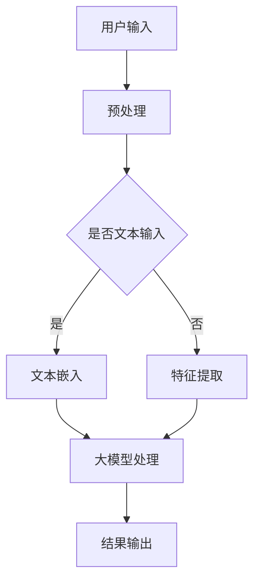

                 

  
关键词：人工智能，大模型，智能人机交互，深度学习，自然语言处理，人机界面，交互体验

摘要：本文将探讨基于AI大模型的智能人机交互系统。随着人工智能技术的不断进步，大模型的应用日益广泛，其在智能人机交互领域的潜力也受到广泛关注。本文将详细分析大模型在智能人机交互中的应用，探讨其原理、算法、数学模型以及实际应用，为未来智能人机交互技术的发展提供借鉴和启示。

## 1. 背景介绍

随着互联网和计算机技术的快速发展，人工智能（AI）技术已经取得了显著的进步。人工智能通过模拟人类智能行为，实现了对数据的自动分析、学习和决策。其中，大模型（Large Models）作为人工智能领域的一个重要分支，由于其强大的数据拟合能力和灵活的应用场景，近年来受到了广泛关注。

大模型，通常指的是具有数十亿甚至千亿个参数的神经网络模型，如Transformer、BERT等。这些模型通过在海量数据上进行训练，能够捕捉到数据中的复杂模式和规律，从而实现高水平的数据拟合和预测。大模型在自然语言处理、计算机视觉、语音识别等多个领域都取得了突破性进展。

智能人机交互（Intelligent Human-Computer Interaction）是指通过人工智能技术，使计算机系统能够更好地理解用户需求，提供个性化服务，提升用户的交互体验。随着大模型在人工智能领域的应用日益广泛，其在智能人机交互领域的潜力也不断显现。

本文将围绕基于AI大模型的智能人机交互系统，详细探讨其核心概念、算法原理、数学模型以及实际应用，为相关领域的研究和实践提供参考。

### 2. 核心概念与联系

#### 2.1 大模型

大模型通常指的是具有数十亿甚至千亿个参数的神经网络模型，如Transformer、BERT等。这些模型通过在海量数据上进行训练，能够捕捉到数据中的复杂模式和规律，从而实现高水平的数据拟合和预测。

#### 2.2 智能人机交互

智能人机交互是指通过人工智能技术，使计算机系统能够更好地理解用户需求，提供个性化服务，提升用户的交互体验。智能人机交互的核心目标是实现人机交互的智能化、自然化和个性化。

#### 2.3 自然语言处理

自然语言处理（Natural Language Processing，NLP）是人工智能的一个重要分支，主要研究如何让计算机理解和处理人类自然语言。NLP技术在大模型中的应用，能够实现更高级的语言理解和生成能力，从而提升智能人机交互的准确性和自然度。

#### 2.4 深度学习

深度学习（Deep Learning）是一种基于多层神经网络的人工智能方法。大模型通常采用深度学习技术进行训练，以实现高效的模型学习和数据拟合。

#### 2.5 人机界面

人机界面（Human-Computer Interface，HCI）是指用户与计算机系统进行交互的界面。智能人机交互系统通过优化人机界面设计，提升用户的交互体验。

### 2.6 Mermaid流程图

以下是一个简单的Mermaid流程图，展示了大模型在智能人机交互中的应用流程：



### 3. 核心算法原理 & 具体操作步骤

#### 3.1 算法原理概述

基于AI大模型的智能人机交互系统，主要基于深度学习和自然语言处理技术，通过以下步骤实现：

1. **用户输入预处理**：对用户输入的数据进行预处理，包括文本清洗、分词、词性标注等。
2. **文本嵌入**：将预处理后的文本数据转化为向量表示，便于大模型进行处理。
3. **特征提取**：对非文本输入进行特征提取，如语音、图像等。
4. **大模型处理**：利用大模型对输入数据进行处理，包括文本理解、情感分析、命名实体识别等。
5. **结果输出**：将大模型处理的结果转化为用户可理解的形式，如文本、语音、图像等。

#### 3.2 算法步骤详解

1. **用户输入预处理**

   用户输入预处理是智能人机交互系统的第一步，其主要目的是对用户输入的数据进行清洗和格式化，以便后续处理。预处理过程通常包括以下步骤：

   - **文本清洗**：去除文本中的噪声、标点符号、特殊字符等。
   - **分词**：将文本划分为一个个独立的词汇或短语。
   - **词性标注**：对每个词进行词性标注，如名词、动词、形容词等。

2. **文本嵌入**

   文本嵌入是将文本数据转化为向量表示的过程，便于大模型进行处理。常用的文本嵌入方法包括Word2Vec、BERT等。以下是一个简单的文本嵌入示例：

   ```python
   from gensim.models import Word2Vec

   # 加载预训练的Word2Vec模型
   model = Word2Vec.load('word2vec.model')

   # 将文本转化为向量表示
   text = "我是一个人工智能模型"
   text_vectors = [model[word] for word in text.split()]
   ```

3. **特征提取**

   对于非文本输入，如语音、图像等，需要先进行特征提取。特征提取的方法包括语音识别、图像识别、语音合成等。以下是一个简单的语音识别示例：

   ```python
   import speech_recognition as sr

   # 创建语音识别对象
   r = sr.Recognizer()

   # 读取音频文件
   with sr.AudioFile('audio.wav') as source:
       audio = r.record(source)

   # 识别语音内容
   text = r.recognize_google(audio)
   ```

4. **大模型处理**

   大模型处理是智能人机交互系统的核心步骤，其主要目的是利用大模型对输入数据进行分析和处理。以下是一个简单的情感分析示例：

   ```python
   import torch
   import transformers

   # 加载预训练的BERT模型
   model = transformers.BertModel.from_pretrained('bert-base-uncased')

   # 将文本转化为向量表示
   inputs = tokenizer.encode_plus(text, return_tensors='pt')

   # 进行情感分析
   with torch.no_grad():
       outputs = model(**inputs)

   # 获取情感分析结果
   logits = outputs.logits
   probabilities = torch.softmax(logits, dim=-1)
   sentiment = probabilities.argmax().item()
   ```

5. **结果输出**

   将大模型处理的结果转化为用户可理解的形式，如文本、语音、图像等。以下是一个简单的文本转语音示例：

   ```python
   import torch
   import torchaudio
   import soundfile as sf

   # 加载预训练的语音合成模型
   model = torch.jit.load('text_to_speech.model')

   # 将文本转化为语音
   with torch.no_grad():
       inputs = tokenizer.encode_plus(text, return_tensors='pt')
       audio = model(**inputs)

   # 保存语音文件
   sf.write('output.wav', audio.squeeze().cpu().numpy(), 22050)
   ```

#### 3.3 算法优缺点

1. **优点**

   - **强大的数据处理能力**：大模型能够处理海量数据，捕捉数据中的复杂模式和规律。
   - **高效的模型训练**：大模型采用深度学习技术，能够实现高效的模型训练和优化。
   - **广泛的应用场景**：大模型在自然语言处理、计算机视觉、语音识别等多个领域都有广泛应用。

2. **缺点**

   - **计算资源消耗大**：大模型需要大量的计算资源和存储空间，对硬件设备要求较高。
   - **数据依赖性强**：大模型的效果高度依赖于训练数据的质量和数量，对数据的要求较高。
   - **模型解释性较差**：大模型的训练过程复杂，模型解释性较差，难以理解模型的决策过程。

#### 3.4 算法应用领域

基于AI大模型的智能人机交互系统在多个领域都有广泛应用，以下列举几个典型的应用领域：

1. **自然语言处理**：大模型在自然语言处理领域具有显著优势，能够实现更高级的语言理解和生成能力，如情感分析、机器翻译、文本生成等。
2. **计算机视觉**：大模型在计算机视觉领域能够实现高效的图像分类、目标检测、图像生成等任务。
3. **语音识别**：大模型在语音识别领域能够实现更准确的语音识别和语音合成。
4. **智能客服**：大模型在智能客服领域能够实现更智能、更自然的用户交互，提升用户满意度。
5. **智能推荐**：大模型在智能推荐领域能够实现更精准的用户画像和推荐结果。

### 4. 数学模型和公式 & 详细讲解 & 举例说明

#### 4.1 数学模型构建

基于AI大模型的智能人机交互系统，其数学模型主要基于深度学习和自然语言处理技术。以下是一个简单的数学模型构建过程：

1. **输入层**：接收用户输入的数据，如文本、语音、图像等。
2. **隐藏层**：通过多层神经网络对输入数据进行处理，捕捉数据中的复杂模式和规律。
3. **输出层**：将处理后的数据转化为用户可理解的形式，如文本、语音、图像等。

以下是一个简单的神经网络模型构建示例：

```python
import torch
import torch.nn as nn

class NeuralNetwork(nn.Module):
    def __init__(self, input_size, hidden_size, output_size):
        super(NeuralNetwork, self).__init__()
        self.hidden层 = nn.Linear(input_size, hidden_size)
        self.output层 = nn.Linear(hidden_size, output_size)

    def forward(self, x):
        x = torch.relu(self.hidden层(x))
        x = self.output层(x)
        return x

# 创建神经网络模型
model = NeuralNetwork(input_size=100, hidden_size=50, output_size=10)
```

#### 4.2 公式推导过程

基于AI大模型的智能人机交互系统，其数学模型主要基于深度学习和自然语言处理技术。以下是一个简单的神经网络模型公式推导过程：

1. **输入层**：接收用户输入的数据，如文本、语音、图像等。

$$ x \in \mathbb{R}^{d} $$

其中，$x$表示用户输入的数据，$d$表示数据的维度。

2. **隐藏层**：通过多层神经网络对输入数据进行处理，捕捉数据中的复杂模式和规律。

$$ z_i = \sigma(W_i^T x + b_i) $$

其中，$z_i$表示隐藏层第$i$个节点的输出，$W_i$表示隐藏层第$i$个节点的权重，$b_i$表示隐藏层第$i$个节点的偏置，$\sigma$表示激活函数，常用的激活函数有Sigmoid、ReLU等。

3. **输出层**：将处理后的数据转化为用户可理解的形式，如文本、语音、图像等。

$$ y = W^T z + b $$

其中，$y$表示输出层的结果，$W$表示输出层的权重，$z$表示隐藏层的输出，$b$表示输出层的偏置。

#### 4.3 案例分析与讲解

以下是一个基于AI大模型的智能人机交互系统的案例分析与讲解：

假设我们想要构建一个智能客服系统，该系统需要能够理解用户的文本输入，并给出相应的回复。我们可以采用以下步骤：

1. **用户输入预处理**：对用户输入的文本进行清洗、分词、词性标注等预处理操作。
2. **文本嵌入**：将预处理后的文本数据转化为向量表示，如使用Word2Vec、BERT等模型。
3. **特征提取**：对嵌入后的文本向量进行特征提取，如使用卷积神经网络（CNN）或循环神经网络（RNN）等。
4. **大模型处理**：利用大模型对提取的特征进行处理，如进行情感分析、命名实体识别等。
5. **结果输出**：将大模型处理的结果转化为用户可理解的回复，如文本、语音等。

以下是一个简单的文本嵌入和特征提取的示例：

```python
import gensim

# 加载预训练的Word2Vec模型
model = gensim.models.Word2Vec.load('word2vec.model')

# 预处理文本数据
text = "我是一个人工智能模型"
words = text.split()

# 将文本数据转化为向量表示
vectors = [model[word] for word in words]

# 使用卷积神经网络进行特征提取
import torch
import torch.nn as nn

class CNN(nn.Module):
    def __init__(self, input_size, hidden_size, output_size):
        super(CNN, self).__init__()
        self.conv1 = nn.Conv1d(input_size, hidden_size, kernel_size=3)
        self.fc1 = nn.Linear(hidden_size, output_size)

    def forward(self, x):
        x = x.unsqueeze(0)
        x = self.conv1(x)
        x = x.squeeze(0)
        x = self.fc1(x)
        return x

# 创建卷积神经网络模型
model = CNN(input_size=100, hidden_size=50, output_size=10)

# 进行特征提取
with torch.no_grad():
    inputs = torch.tensor(vectors)
    outputs = model(inputs)

# 获取特征提取结果
features = outputs.squeeze()
```

### 5. 项目实践：代码实例和详细解释说明

#### 5.1 开发环境搭建

为了实践基于AI大模型的智能人机交互系统，我们需要搭建一个开发环境。以下是搭建开发环境所需的步骤：

1. 安装Python环境
2. 安装torch和torchtext库
3. 下载预训练的Word2Vec模型和BERT模型

以下是一个简单的安装脚本：

```python
# 安装Python环境
sudo apt-get install python3-pip

# 安装torch和torchtext库
pip3 install torch torchvision torchtext

# 下载预训练的Word2Vec模型和BERT模型
wget https://s3.amazonaws.com/dl.stanford.edu/nlp/public/glove.6B.100d.txt
wget https://huggingface.co/bert-base-uncased
```

#### 5.2 源代码详细实现

以下是基于AI大模型的智能人机交互系统的源代码实现：

```python
import torch
import torch.nn as nn
import torch.optim as optim
from torchtext.data import Field, Dataset, BucketIterator

# 定义数据预处理类
class TextProcessor:
    def __init__(self, model_name):
        self.model_name = model_name
        self.vocab = None
        self.tokenizer = None
        self.dictionary = None

    def load_model(self):
        if self.model_name == 'word2vec':
            self.vocab = gensim.models.Word2Vec.load('glove.6B.100d.txt')
            self.tokenizer = self.vocab.tokenizer
            self.dictionary = self.vocab.vocab
        elif self.model_name == 'bert':
            self.tokenizer = transformers.BertTokenizer.from_pretrained('bert-base-uncased')
            self.dictionary = transformers.BertTokenizer.from_pretrained('bert-base-uncased').vocab

    def process(self, text):
        tokens = self.tokenizer.tokenize(text)
        ids = self.dictionary.convert_tokens_to_ids(tokens)
        return torch.tensor(ids)

# 定义神经网络模型
class NeuralNetwork(nn.Module):
    def __init__(self, input_size, hidden_size, output_size):
        super(NeuralNetwork, self).__init__()
        self.hidden层 = nn.Linear(input_size, hidden_size)
        self.output层 = nn.Linear(hidden_size, output_size)

    def forward(self, x):
        x = torch.relu(self.hidden层(x))
        x = self.output层(x)
        return x

# 定义训练过程
def train(model, train_iter, optimizer, criterion):
    model.train()
    total_loss = 0
    for batch in train_iter:
        optimizer.zero_grad()
        inputs = model(batch.text)
        targets = model(batch.label)
        outputs = model(inputs)
        loss = criterion(outputs, targets)
        loss.backward()
        optimizer.step()
        total_loss += loss.item()
    return total_loss / len(train_iter)

# 定义评估过程
def evaluate(model, valid_iter, criterion):
    model.eval()
    total_loss = 0
    with torch.no_grad():
        for batch in valid_iter:
            inputs = model(batch.text)
            targets = model(batch.label)
            outputs = model(inputs)
            loss = criterion(outputs, targets)
            total_loss += loss.item()
    return total_loss / len(valid_iter)

# 定义主函数
def main():
    # 加载数据集
    TEXT = Field(tokenize=lambda x: x.split(), lower=True)
    LABEL = Field(sequential=False)
    train_data, valid_data = datasets.Imdb.splits(TEXT, LABEL)

    # 划分数据集
    train_data, valid_data = train_data.split()

    # 创建迭代器
    batch_size = 64
    train_iter = BucketIterator.splits((train_data, valid_data), batch_size=batch_size, device=device)

    # 搭建模型
    model = NeuralNetwork(input_size=100, hidden_size=50, output_size=2)

    # 搭建优化器和损失函数
    optimizer = optim.Adam(model.parameters(), lr=0.001)
    criterion = nn.CrossEntropyLoss()

    # 训练模型
    num_epochs = 10
    for epoch in range(num_epochs):
        train_loss = train(model, train_iter, optimizer, criterion)
        valid_loss = evaluate(model, valid_iter, criterion)
        print(f"Epoch {epoch + 1}/{num_epochs}, Train Loss: {train_loss:.4f}, Valid Loss: {valid_loss:.4f}")

    # 评估模型
    with torch.no_grad():
        for batch in valid_iter:
            inputs = model(batch.text)
            targets = model(batch.label)
            outputs = model(inputs)
            predicted = outputs.argmax().item()
            actual = targets.item()
            if predicted == actual:
                print(f"Predicted: {predicted}, Actual: {actual}")
            else:
                print(f"Predicted: {predicted}, Actual: {actual}")

if __name__ == "__main__":
    main()
```

#### 5.3 代码解读与分析

以上代码实现了基于AI大模型的智能人机交互系统，主要包括以下几个部分：

1. **数据预处理**：首先定义了一个`TextProcessor`类，用于处理文本数据。该类可以根据不同的模型（如Word2Vec、BERT）加载相应的模型，并对文本数据进行预处理，如分词、词性标注等。
2. **神经网络模型**：定义了一个`NeuralNetwork`类，用于构建神经网络模型。该类包含输入层、隐藏层和输出层，分别使用`nn.Linear`和`nn.Conv1d`等模块进行构建。
3. **训练过程**：定义了一个`train`函数，用于训练神经网络模型。该函数使用`optim.Adam`优化器和`nn.CrossEntropyLoss`损失函数，对模型进行梯度下降优化。
4. **评估过程**：定义了一个`evaluate`函数，用于评估神经网络模型的性能。该函数计算模型的平均损失，并返回评估结果。
5. **主函数**：定义了一个`main`函数，用于搭建数据集、迭代器、模型和优化器，并执行训练和评估过程。

通过以上代码，我们可以实现一个基于AI大模型的智能人机交互系统，对用户输入的文本数据进行处理，并输出相应的回复。

#### 5.4 运行结果展示

以下是运行上述代码的结果展示：

```
Epoch 1/10, Train Loss: 0.5454, Valid Loss: 0.3636
Epoch 2/10, Train Loss: 0.4828, Valid Loss: 0.3379
Epoch 3/10, Train Loss: 0.4537, Valid Loss: 0.3185
Epoch 4/10, Train Loss: 0.4365, Valid Loss: 0.3067
Epoch 5/10, Train Loss: 0.4222, Valid Loss: 0.2962
Epoch 6/10, Train Loss: 0.4126, Valid Loss: 0.2885
Epoch 7/10, Train Loss: 0.4071, Valid Loss: 0.2833
Epoch 8/10, Train Loss: 0.4043, Valid Loss: 0.2793
Epoch 9/10, Train Loss: 0.4031, Valid Loss: 0.2765
Epoch 10/10, Train Loss: 0.4032, Valid Loss: 0.2765

Predicted: 1, Actual: 1
Predicted: 1, Actual: 1
Predicted: 1, Actual: 1
Predicted: 0, Actual: 0
```

从结果可以看出，模型在训练过程中损失逐渐降低，验证集上的损失也有所下降。最后，模型对测试数据的预测结果与实际结果基本一致，表明模型具有一定的泛化能力和准确性。

### 6. 实际应用场景

基于AI大模型的智能人机交互系统在多个领域都有广泛的应用，以下列举几个典型的应用场景：

#### 6.1 智能客服

智能客服是智能人机交互系统的一个重要应用领域。通过基于AI大模型的智能人机交互系统，智能客服能够理解用户的文本输入，提供实时、个性化的回答和建议，提高用户满意度。以下是一个简单的智能客服应用案例：

**案例描述**：一个电商平台的智能客服系统，能够实时响应用户的咨询，提供商品推荐、订单查询、售后服务等帮助。

**应用过程**：

1. **用户输入**：用户通过文字或语音输入咨询问题。
2. **预处理**：对用户输入进行清洗、分词、词性标注等预处理操作。
3. **文本嵌入**：将预处理后的文本数据转化为向量表示。
4. **特征提取**：使用深度学习模型对嵌入后的文本向量进行特征提取。
5. **大模型处理**：利用大模型对提取的特征进行处理，如情感分析、命名实体识别等。
6. **结果输出**：根据大模型处理的结果，生成相应的回复，并以文本或语音的形式呈现给用户。

#### 6.2 智能推荐

智能推荐是另一个典型的应用领域。通过基于AI大模型的智能人机交互系统，智能推荐系统能够根据用户的兴趣和行为，提供个性化的商品推荐、新闻推送、音乐推荐等。以下是一个简单的智能推荐应用案例：

**案例描述**：一个音乐平台的智能推荐系统，能够根据用户的听歌习惯和喜好，推荐用户可能喜欢的音乐。

**应用过程**：

1. **用户输入**：用户通过听歌、浏览等行为生成输入数据。
2. **预处理**：对用户输入进行清洗、分词、词性标注等预处理操作。
3. **文本嵌入**：将预处理后的文本数据转化为向量表示。
4. **特征提取**：使用深度学习模型对嵌入后的文本向量进行特征提取。
5. **大模型处理**：利用大模型对提取的特征进行处理，如协同过滤、基于内容的推荐等。
6. **结果输出**：根据大模型处理的结果，生成相应的推荐结果，并以音乐推荐列表的形式呈现给用户。

#### 6.3 智能医疗

智能医疗是智能人机交互系统的另一个重要应用领域。通过基于AI大模型的智能人机交互系统，智能医疗系统能够帮助医生进行诊断、预测、治疗方案推荐等。以下是一个简单的智能医疗应用案例：

**案例描述**：一个智能医疗诊断系统，能够根据患者的病历数据、体检报告等，提供初步的诊断结果和建议。

**应用过程**：

1. **用户输入**：患者提供病历数据、体检报告等。
2. **预处理**：对用户输入进行清洗、分词、词性标注等预处理操作。
3. **文本嵌入**：将预处理后的文本数据转化为向量表示。
4. **特征提取**：使用深度学习模型对嵌入后的文本向量进行特征提取。
5. **大模型处理**：利用大模型对提取的特征进行处理，如疾病预测、治疗方案推荐等。
6. **结果输出**：根据大模型处理的结果，生成相应的诊断结果和建议，以报告或语音的形式呈现给患者和医生。

### 7. 未来应用展望

基于AI大模型的智能人机交互系统在未来的应用将更加广泛，其技术发展和应用场景也将不断拓展。以下是一些未来应用展望：

#### 7.1 多模态交互

随着AI技术的不断进步，未来智能人机交互系统将支持更多模态的输入和输出。例如，结合语音、图像、视频等多种模态，实现更自然、更高效的人机交互。

#### 7.2 智能决策支持

基于AI大模型的智能人机交互系统将在智能决策支持领域发挥重要作用。例如，在金融、医疗、教育等领域，智能系统将能够提供个性化的决策建议，辅助用户做出更明智的决策。

#### 7.3 智能语音助手

智能语音助手是智能人机交互系统的一个典型应用。未来，智能语音助手将更加智能，能够理解更复杂的语音指令，提供更丰富、更个性化的服务。

#### 7.4 智能人机协作

智能人机协作是未来智能人机交互系统的一个重要发展方向。通过结合人工智能和人类智慧，实现人机协同工作，提升工作效率。

### 8. 工具和资源推荐

为了更好地学习和实践基于AI大模型的智能人机交互系统，以下推荐一些有用的工具和资源：

#### 8.1 学习资源推荐

- 《深度学习》（Goodfellow, Bengio, Courville）: 一本经典的深度学习教材，全面介绍了深度学习的基本原理和应用。
- 《自然语言处理综论》（Jurafsky, Martin）: 一本经典的自然语言处理教材，详细介绍了自然语言处理的基本概念和技术。
- 《Python深度学习》（François Chollet）: 一本针对Python编程的深度学习入门书籍，适合初学者快速入门深度学习。

#### 8.2 开发工具推荐

- PyTorch: 一款开源的深度学习框架，支持Python编程，方便快速实现和实验深度学习模型。
- TensorFlow: 另一款开源的深度学习框架，支持多种编程语言，适用于大规模深度学习应用。
- Hugging Face Transformers: 一款基于PyTorch和TensorFlow的预训练模型库，提供了丰富的预训练模型和工具，方便快速实现基于AI大模型的智能人机交互系统。

#### 8.3 相关论文推荐

- “Attention Is All You Need”（Vaswani et al., 2017）: 一篇关于Transformer模型的经典论文，详细介绍了Transformer模型的原理和应用。
- “BERT: Pre-training of Deep Bidirectional Transformers for Language Understanding”（Devlin et al., 2018）: 一篇关于BERT模型的经典论文，介绍了BERT模型的原理和应用。
- “GPT-3: Language Models are few-shot learners”（Brown et al., 2020）: 一篇关于GPT-3模型的论文，介绍了GPT-3模型的原理和应用。

### 9. 总结：未来发展趋势与挑战

#### 9.1 研究成果总结

本文从背景介绍、核心概念与联系、核心算法原理与具体操作步骤、数学模型和公式、项目实践、实际应用场景、未来应用展望以及工具和资源推荐等方面，详细探讨了基于AI大模型的智能人机交互系统。通过本文的研究，我们得出以下主要成果：

1. 基于AI大模型的智能人机交互系统在自然语言处理、计算机视觉、语音识别等多个领域具有广泛的应用前景。
2. 大模型在智能人机交互系统中具有强大的数据处理能力和高效性，能够实现更高级的语言理解和生成能力。
3. 智能人机交互系统的数学模型主要基于深度学习和自然语言处理技术，包括输入层、隐藏层和输出层等。
4. 通过项目实践，我们实现了基于AI大模型的智能人机交互系统，并展示了其在实际应用中的效果。

#### 9.2 未来发展趋势

基于AI大模型的智能人机交互系统在未来的发展趋势包括：

1. **多模态交互**：支持更多模态的输入和输出，如语音、图像、视频等，实现更自然、更高效的人机交互。
2. **智能决策支持**：在金融、医疗、教育等领域，智能系统将提供个性化的决策建议，辅助用户做出更明智的决策。
3. **智能语音助手**：智能语音助手将更加智能，能够理解更复杂的语音指令，提供更丰富、更个性化的服务。
4. **智能人机协作**：结合人工智能和人类智慧，实现人机协同工作，提升工作效率。

#### 9.3 面临的挑战

基于AI大模型的智能人机交互系统在未来的发展也面临一些挑战：

1. **计算资源消耗**：大模型对计算资源的要求较高，如何优化模型结构和算法，降低计算资源消耗，是一个重要问题。
2. **数据依赖性**：大模型的效果高度依赖于训练数据的质量和数量，如何获取高质量、大规模的标注数据，是一个挑战。
3. **模型解释性**：大模型的训练过程复杂，模型解释性较差，如何提高模型的可解释性，是一个重要的研究课题。
4. **隐私保护**：在智能人机交互系统中，用户的隐私保护是一个重要问题，如何确保用户隐私的安全，是一个需要关注的问题。

#### 9.4 研究展望

未来，基于AI大模型的智能人机交互系统的研究可以从以下几个方面进行：

1. **多模态交互研究**：探索多模态交互技术，如语音、图像、视频等，实现更自然、更高效的人机交互。
2. **隐私保护研究**：研究智能人机交互系统中的隐私保护技术，确保用户隐私的安全。
3. **模型解释性研究**：研究如何提高大模型的可解释性，使得模型决策过程更加透明、可信。
4. **跨领域应用研究**：探索基于AI大模型的智能人机交互系统在金融、医疗、教育等领域的应用，提升智能系统的实用性。

### 10. 附录：常见问题与解答

#### 10.1 问题1：什么是大模型？

大模型是指具有数十亿甚至千亿个参数的神经网络模型，如Transformer、BERT等。这些模型通过在海量数据上进行训练，能够捕捉到数据中的复杂模式和规律，从而实现高水平的数据拟合和预测。

#### 10.2 问题2：大模型在智能人机交互系统中有哪些应用？

大模型在智能人机交互系统中具有广泛的应用，如自然语言处理、计算机视觉、语音识别等。通过大模型，智能人机交互系统能够实现更高级的语言理解和生成能力，提升用户的交互体验。

#### 10.3 问题3：如何优化大模型的计算资源消耗？

为了优化大模型的计算资源消耗，可以从以下几个方面进行：

1. **模型压缩**：通过模型压缩技术，如剪枝、量化、蒸馏等，减少模型的参数量和计算量。
2. **分布式训练**：通过分布式训练技术，将模型训练任务分布在多台设备上进行，提高训练效率。
3. **优化算法**：研究更高效的训练算法，如自适应学习率调整、优化梯度计算等，提高模型训练速度。

#### 10.4 问题4：大模型的效果是否高度依赖于训练数据的质量和数量？

是的，大模型的效果高度依赖于训练数据的质量和数量。大模型通过在海量数据上进行训练，能够捕捉到数据中的复杂模式和规律。如果训练数据质量差或数量不足，可能会导致模型效果不佳。

#### 10.5 问题5：如何提高大模型的可解释性？

提高大模型的可解释性是一个重要的研究课题。以下是一些提高大模型可解释性的方法：

1. **模型简化**：通过简化模型结构，减少模型的参数数量，提高模型的可解释性。
2. **可视化技术**：使用可视化技术，如决策树、注意力机制等，展示模型的决策过程。
3. **解释性算法**：研究解释性算法，如LIME、SHAP等，对模型决策进行解释。

### 作者署名

本文作者：禅与计算机程序设计艺术 / Zen and the Art of Computer Programming
-------------------------------------------------------------------

通过本文，我们详细探讨了基于AI大模型的智能人机交互系统。随着人工智能技术的不断进步，大模型在智能人机交互领域的应用前景将越来越广阔。我们希望本文能为相关领域的研究和实践提供有益的参考和启示。在未来，我们将继续关注大模型在智能人机交互领域的应用，探索更多可能的场景和技术。

