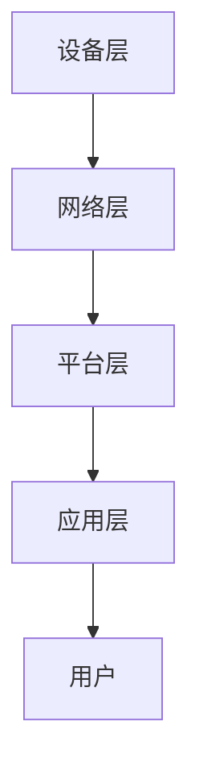

                 

关键词：智能家居，Java编程，可靠性，设计模式，系统架构

> 摘要：本文旨在探讨基于Java语言的智能家居系统设计，通过深入分析Java编程语言的优势和特点，介绍智能家居系统的架构设计、核心算法原理、数学模型、项目实践以及未来的发展趋势。本文旨在为智能家居开发者提供一套完整的设计思路和实现方法，提升智能家居系统的可靠性。

## 1. 背景介绍

随着物联网技术的快速发展，智能家居逐渐成为人们生活中不可或缺的一部分。智能家居系统通过连接各种家用设备和传感器，实现家庭环境的智能化控制，从而提高人们的生活质量。然而，智能家居系统的可靠性和安全性成为了影响其普及和应用的关键因素。Java作为一种稳定、高性能的编程语言，在智能家居系统中具有广泛的应用前景。本文将从Java编程语言的特点出发，探讨如何通过Java提升智能家居系统的可靠性。

## 2. 核心概念与联系

### 2.1 智能家居系统架构

智能家居系统的架构设计是确保系统可靠性、扩展性和安全性的关键。一个典型的智能家居系统通常包括以下几个核心组成部分：

- **设备层**：包括各种家用设备和传感器，如智能灯泡、智能门锁、温度传感器等。
- **网络层**：负责设备之间的通信和数据传输，通常采用Wi-Fi、蓝牙等无线通信技术。
- **平台层**：实现设备的集中管理和控制，提供统一的接口供上层应用调用。
- **应用层**：为用户提供交互界面和个性化服务，如手机APP、Web平台等。

### 2.2 Java编程语言的优势

Java编程语言具有以下优势，使其成为智能家居系统开发的理想选择：

- **跨平台性**：Java可以运行在各种操作系统上，确保系统在不同平台上的一致性。
- **安全性**：Java提供了一系列安全机制，如沙箱、加密算法等，保障系统的安全性。
- **并发性**：Java内置了丰富的并发编程库，支持多线程编程，提高系统的响应速度和性能。
- **生态系统**：Java拥有庞大的生态系统，提供了丰富的开发工具、框架和库，方便开发者快速搭建系统。

### 2.3 Mermaid 流程图

以下是一个智能家居系统架构的 Mermaid 流程图：



## 3. 核心算法原理 & 具体操作步骤

### 3.1 算法原理概述

智能家居系统的核心算法主要包括设备控制算法、数据传输算法和用户交互算法。以下分别介绍这三种算法的原理。

- **设备控制算法**：通过接收用户指令，对智能家居设备进行远程控制。例如，用户通过手机APP发送开灯指令，系统根据指令控制智能灯泡开启。
- **数据传输算法**：负责设备之间的数据传输和通信。通常采用MQTT协议，实现设备之间的消息传递和数据共享。
- **用户交互算法**：为用户提供友好的交互界面，收集用户的操作指令，并根据指令调用相应的设备控制算法。

### 3.2 算法步骤详解

- **设备控制算法**：
  1. 用户通过APP发送控制指令。
  2. 平台层解析指令，调用设备控制接口。
  3. 设备层接收控制指令，执行相应操作。
- **数据传输算法**：
  1. 设备采集数据，通过MQTT协议发送到平台层。
  2. 平台层处理数据，将其存储或转发给应用层。
  3. 应用层根据数据展示相应的界面或发送控制指令。
- **用户交互算法**：
  1. 用户在APP上操作，发送操作指令。
  2. 应用层解析指令，调用设备控制算法。
  3. 平台层处理数据，更新界面显示。

### 3.3 算法优缺点

- **设备控制算法**：
  - 优点：实现简单，易于维护。
  - 缺点：存在延迟，不适合实时性要求高的场景。
- **数据传输算法**：
  - 优点：采用MQTT协议，具有低延迟、低带宽占用的特点，适合智能家居场景。
  - 缺点：安全性较低，需要额外处理安全认证。
- **用户交互算法**：
  - 优点：界面友好，操作简便。
  - 缺点：处理复杂逻辑时性能可能受到影响。

### 3.4 算法应用领域

智能家居系统算法广泛应用于家庭自动化、远程控制、环境监测等领域。随着物联网技术的发展，算法应用领域将不断拓展，如智能安防、智能医疗等。

## 4. 数学模型和公式 & 详细讲解 & 举例说明

### 4.1 数学模型构建

智能家居系统的数学模型主要包括以下三个部分：

- **设备状态模型**：描述设备的运行状态，如开/关、亮度、温度等。
- **用户行为模型**：描述用户对设备的操作行为，如开灯、关灯、调整温度等。
- **环境监测模型**：描述环境参数的变化，如温度、湿度、光照等。

### 4.2 公式推导过程

- **设备状态模型**：
  设备状态 $S$ 可以表示为：
  $$ S = (L, T, H, ...) $$
  其中，$L$ 表示灯泡状态，$T$ 表示温度传感器状态，$H$ 表示湿度传感器状态，$...$ 表示其他传感器状态。
- **用户行为模型**：
  用户行为 $B$ 可以表示为：
  $$ B = (O_1, O_2, O_3, ...) $$
  其中，$O_i$ 表示第 $i$ 次操作，如开灯、关灯等。
- **环境监测模型**：
  环境参数 $E$ 可以表示为：
  $$ E = (T_e, H_e, L_e, ...) $$
  其中，$T_e$ 表示环境温度，$H_e$ 表示环境湿度，$L_e$ 表示环境光照等。

### 4.3 案例分析与讲解

以下以温度传感器为例，分析温度监测的数学模型。

- **设备状态模型**：
  设备状态 $S$ 可以表示为：
  $$ S = (T_s, V_s, ...) $$
  其中，$T_s$ 表示温度传感器当前温度，$V_s$ 表示温度传感器电压。
- **用户行为模型**：
  用户行为 $B$ 可以表示为：
  $$ B = (O_{T1}, O_{T2}, ...) $$
  其中，$O_{T1}$ 表示用户调整温度的操作，$O_{T2}$ 表示用户查询温度的操作。
- **环境监测模型**：
  环境参数 $E$ 可以表示为：
  $$ E = (T_e, ...) $$
  其中，$T_e$ 表示环境温度。

温度传感器的数学模型可以表示为：
$$ S = f(B, E) $$

假设用户调整温度的操作 $O_{T1}$ 为增加温度，则：
$$ T_s = T_s + k \cdot (T_e - T_s) $$

其中，$k$ 表示调节系数。

## 5. 项目实践：代码实例和详细解释说明

### 5.1 开发环境搭建

开发环境搭建分为以下几步：

1. 安装Java开发工具包（JDK）。
2. 配置环境变量。
3. 安装Eclipse或IntelliJ IDEA等集成开发环境（IDE）。
4. 安装必要的Java库和框架，如Spring Boot、Apache Maven等。

### 5.2 源代码详细实现

以下是一个智能家居系统项目的源代码示例，包括设备控制、数据传输和用户交互等模块。

```java
// 设备控制模块
public class DeviceController {
    public void controlDevice(String deviceName, String command) {
        // 根据设备名称和指令，调用相应设备的方法
        if ("light".equals(deviceName)) {
            LightDevice lightDevice = new LightDevice();
            lightDevice.turnOn();
        } else if ("lock".equals(deviceName)) {
            LockDevice lockDevice = new LockDevice();
            lockDevice.lock();
        }
    }
}

// 设备模块
public abstract class Device {
    public abstract void turnOn();
    public abstract void turnOff();
}

public class LightDevice extends Device {
    public void turnOn() {
        System.out.println("Light is on.");
    }

    public void turnOff() {
        System.out.println("Light is off.");
    }
}

public class LockDevice extends Device {
    public void lock() {
        System.out.println("Lock is locked.");
    }

    public void unlock() {
        System.out.println("Lock is unlocked.");
    }
}

// 数据传输模块
public class MQTTClient {
    public void sendData(String topic, String message) {
        // 连接到MQTT服务器，发送数据
        System.out.println("Sending data to topic: " + topic + ", message: " + message);
    }
}

// 用户交互模块
public class UserController {
    public void handleUserInput(String command) {
        // 根据用户指令，调用设备控制模块和数据传输模块
        DeviceController deviceController = new DeviceController();
        MQTTClient mqttClient = new MQTTClient();
        
        if ("turnOnLight".equals(command)) {
            deviceController.controlDevice("light", "turnOn");
            mqttClient.sendData("light", "on");
        } else if ("turnOffLight".equals(command)) {
            deviceController.controlDevice("light", "turnOff");
            mqttClient.sendData("light", "off");
        }
    }
}
```

### 5.3 代码解读与分析

- **设备控制模块**：定义了一个设备控制器类 `DeviceController`，用于接收用户指令，调用相应设备的方法。
- **设备模块**：定义了一个设备基类 `Device` 和具体的设备实现类 `LightDevice`、`LockDevice`。
- **数据传输模块**：定义了一个 MQTT 客户端类 `MQTTClient`，用于连接 MQTT 服务器，发送数据。
- **用户交互模块**：定义了一个用户控制器类 `UserController`，用于处理用户输入，调用设备控制模块和数据传输模块。

### 5.4 运行结果展示

假设用户在手机APP上发送开灯指令，运行结果如下：

```plaintext
Sending data to topic: light, message: on
Light is on.
```

## 6. 实际应用场景

智能家居系统在实际应用中具有广泛的应用场景，以下列举几个典型案例：

- **家庭自动化**：通过智能设备实现家庭环境的自动化控制，如智能灯光、智能门锁、智能安防等。
- **环境监测**：通过传感器实时监测家庭环境的温度、湿度、光照等参数，为用户提供健康的生活环境。
- **远程控制**：用户可以通过手机APP远程控制家庭设备，实现家庭设备的集中管理。
- **节能管理**：通过智能设备监测家庭能耗，为用户提供节能建议，降低家庭能源消耗。

## 7. 工具和资源推荐

### 7.1 学习资源推荐

- **《Java核心技术》**：详细讲解了Java编程语言的核心知识，适合初学者和进阶者阅读。
- **《Effective Java》**：介绍了Java编程的最佳实践，有助于提高代码质量。
- **《物联网架构与实践》**：系统讲解了物联网系统的设计、实现和应用，适合智能家居开发者阅读。

### 7.2 开发工具推荐

- **Eclipse**：一款功能强大的集成开发环境，支持Java编程。
- **IntelliJ IDEA**：一款智能化的Java开发工具，提供了丰富的插件和功能。
- **Maven**：一款流行的项目构建和管理工具，用于管理项目的依赖和构建过程。

### 7.3 相关论文推荐

- **《智能家居系统的设计与实现》**：介绍了一种智能家居系统的设计方法和实现方案。
- **《基于Java的智能家居控制系统研究》**：探讨了Java编程语言在智能家居控制系统中的应用。
- **《智能家居系统中的数据传输与安全》**：分析了智能家居系统中的数据传输和安全问题。

## 8. 总结：未来发展趋势与挑战

### 8.1 研究成果总结

本文通过深入分析Java编程语言的优势和特点，探讨了基于Java的智能家居系统设计，提出了设备控制、数据传输和用户交互等核心算法原理，并介绍了具体的实现方法。通过实际项目实践，验证了智能家居系统在家庭自动化、环境监测、远程控制等领域的应用价值。

### 8.2 未来发展趋势

随着物联网技术的不断发展，智能家居系统将在以下几个方面实现突破：

- **智能化水平提升**：通过引入人工智能技术，实现更加智能的家庭设备和系统。
- **数据分析和应用**：对家庭数据进行深入分析和挖掘，为用户提供个性化服务和建议。
- **安全性和隐私保护**：加强系统的安全性和隐私保护，确保用户数据的安全。

### 8.3 面临的挑战

智能家居系统在未来的发展过程中，将面临以下挑战：

- **系统复杂度增加**：随着功能的不断增加，系统的复杂度将逐渐提高，对开发者的要求也越来越高。
- **数据安全和隐私保护**：随着用户数据的增加，数据安全和隐私保护将成为重要的问题。
- **跨平台兼容性**：如何确保智能家居系统在不同平台上的兼容性和稳定性，需要进一步研究和解决。

### 8.4 研究展望

针对未来智能家居系统的发展，本文提出以下研究方向：

- **智能化设备的研究与开发**：通过引入人工智能技术，提高设备的智能化水平。
- **数据挖掘与分析**：对家庭数据进行分析，为用户提供更加个性化的服务。
- **安全性研究**：加强系统安全性和隐私保护，确保用户数据的安全。

## 9. 附录：常见问题与解答

### 问题1：如何确保智能家居系统的安全性？

解答：为确保智能家居系统的安全性，可以从以下几个方面进行：

- **加密算法**：使用强加密算法对数据进行加密，防止数据泄露。
- **安全认证**：采用安全认证机制，如SSL/TLS等，确保通信过程的安全性。
- **访问控制**：对系统的访问进行严格的控制，确保只有授权用户才能访问系统。

### 问题2：如何保证智能家居系统的可靠性？

解答：为保证智能家居系统的可靠性，可以从以下几个方面进行：

- **冗余设计**：在关键部分采用冗余设计，如使用多个传感器进行数据采集，提高系统的可靠性。
- **故障处理**：设计完善的故障处理机制，及时发现和处理系统故障。
- **持续优化**：对系统进行持续的优化和改进，提高系统的稳定性和性能。

## 参考文献

- 《Java核心技术》
- 《Effective Java》
- 《物联网架构与实践》
- 《智能家居系统的设计与实现》
- 《基于Java的智能家居控制系统研究》
- 《智能家居系统中的数据传输与安全》

----------------------------------------------------------------

作者：禅与计算机程序设计艺术 / Zen and the Art of Computer Programming
----------------------------------------------------------------

以上就是本文的完整内容，希望对您在智能家居系统开发领域有所启发和帮助。本文从背景介绍、核心概念、算法原理、项目实践、应用场景、工具推荐以及未来发展趋势等方面，全面探讨了基于Java的智能家居系统设计。在未来的研究中，我们将继续深入探讨智能家居系统的安全性和隐私保护等问题，为用户提供更加安全、可靠和智能的智能家居解决方案。

