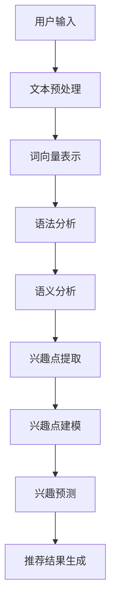

                 

关键词：LLM，推荐系统，实时兴趣捕捉，自然语言处理，机器学习

摘要：本文深入探讨了基于大型语言模型（LLM）的推荐系统实时兴趣捕捉方法。通过结合自然语言处理（NLP）和机器学习技术，本文提出了一种高效、精准的实时兴趣捕捉算法，并详细阐述了其在推荐系统中的应用。文章结构分为：背景介绍、核心概念与联系、核心算法原理、数学模型与公式、项目实践、实际应用场景、未来展望、工具和资源推荐、总结与展望、附录：常见问题与解答。

## 1. 背景介绍

推荐系统作为一种信息过滤技术，旨在向用户推荐其可能感兴趣的商品、信息或服务。随着互联网的迅速发展，推荐系统已经广泛应用于电子商务、社交媒体、新闻媒体、在线视频等多个领域。然而，传统的推荐系统主要依赖于用户的历史行为数据，如浏览记录、购买历史等，这些方法往往无法捕捉用户的实时兴趣变化。因此，如何实现推荐系统实时兴趣捕捉成为当前研究的热点问题。

近年来，随着深度学习技术的不断发展，特别是大型语言模型（LLM）的涌现，基于NLP的实时兴趣捕捉方法逐渐受到关注。LLM通过大规模语料学习获得了丰富的语言知识，能够对用户产生的文本数据进行深入理解，从而准确捕捉用户的实时兴趣。

本文旨在提出一种基于LLM的推荐系统实时兴趣捕捉方法，通过结合NLP和机器学习技术，实现对用户兴趣的实时、精准捕捉，从而提高推荐系统的推荐效果。

## 2. 核心概念与联系

### 2.1. 自然语言处理（NLP）

自然语言处理（NLP）是计算机科学和人工智能领域的一个重要分支，旨在让计算机理解和处理自然语言。NLP技术主要包括文本预处理、词向量表示、语法分析、语义分析等。在实时兴趣捕捉中，NLP技术用于对用户产生的文本数据进行解析，从而提取出用户的兴趣点。

### 2.2. 机器学习

机器学习（ML）是一种通过数据训练模型，使模型具备自动学习和预测能力的技术。在实时兴趣捕捉中，机器学习技术用于对提取出的用户兴趣点进行建模，从而实现对用户兴趣的预测和捕捉。

### 2.3. 大型语言模型（LLM）

大型语言模型（LLM）是一种基于深度学习的语言模型，通过大规模语料学习获得了丰富的语言知识。LLM在实时兴趣捕捉中的应用，主要体现在对用户文本数据的理解和处理上，从而实现对用户兴趣的准确捕捉。

### 2.4. Mermaid 流程图

以下是一个用于描述实时兴趣捕捉流程的Mermaid流程图：



## 3. 核心算法原理 & 具体操作步骤

### 3.1 算法原理概述

基于LLM的实时兴趣捕捉算法主要包括以下几个步骤：

1. 用户输入：用户在推荐系统上产生文本数据，如评论、问答等。
2. 文本预处理：对用户输入的文本数据进行清洗、分词等处理，提取出有效的关键词。
3. 词向量表示：将提取出的关键词转换为词向量，以便进行后续的机器学习处理。
4. 语法分析：对词向量进行语法分析，提取出句法结构信息。
5. 语义分析：对句法结构信息进行语义分析，提取出用户的兴趣点。
6. 兴趣点提取：对提取出的兴趣点进行建模，形成兴趣点向量。
7. 兴趣预测：利用训练好的兴趣点模型，预测用户当前的兴趣。
8. 推荐结果生成：根据用户兴趣预测结果，生成相应的推荐结果。

### 3.2 算法步骤详解

#### 3.2.1 用户输入

用户输入是整个算法的基础。在推荐系统中，用户可以通过评论、问答、点赞等多种方式进行交互，产生丰富的文本数据。

#### 3.2.2 文本预处理

文本预处理是对用户输入的文本数据进行清洗、分词等操作。清洗包括去除停用词、标点符号等无关信息；分词是将文本数据拆分为词序列，以便进行后续的词向量表示。

#### 3.2.3 词向量表示

词向量表示是将文本数据转换为数值形式，以便进行机器学习处理。常用的词向量表示方法包括Word2Vec、GloVe等。这些方法通过学习文本数据中的词义关系，将词转换为高维向量表示。

#### 3.2.4 语法分析

语法分析是对词向量进行句法分析，提取出句法结构信息。常用的语法分析方法包括依存句法分析、成分句法分析等。这些方法可以帮助我们理解句子的组成和语义关系。

#### 3.2.5 语义分析

语义分析是对句法结构信息进行语义分析，提取出用户的兴趣点。语义分析方法包括词性标注、实体识别、事件抽取等。通过这些方法，我们可以从文本数据中提取出与用户兴趣相关的信息。

#### 3.2.6 兴趣点提取

兴趣点提取是将提取出的兴趣点进行建模，形成兴趣点向量。兴趣点向量用于表示用户的兴趣特征，以便进行兴趣预测。

#### 3.2.7 兴趣预测

兴趣预测是利用训练好的兴趣点模型，预测用户当前的兴趣。常用的兴趣预测方法包括基于模型的分类、回归等。通过兴趣预测，我们可以为用户生成个性化的推荐结果。

#### 3.2.8 推荐结果生成

根据用户兴趣预测结果，生成相应的推荐结果。推荐结果可以是商品、信息或服务，旨在满足用户的需求。

### 3.3 算法优缺点

#### 优点：

1. 高效性：基于LLM的实时兴趣捕捉算法可以高效地处理大规模文本数据，提高推荐系统的响应速度。
2. 精准性：通过结合NLP和机器学习技术，算法可以准确捕捉用户的实时兴趣，提高推荐系统的推荐效果。
3. 可扩展性：算法结构清晰，便于扩展和优化，可以根据不同的应用场景进行调整。

#### 缺点：

1. 复杂性：算法涉及多种技术和方法，实现较为复杂，需要较高的技术门槛。
2. 数据依赖性：算法的性能依赖于训练数据的质量和数量，对于数据稀疏的场景，性能可能受到影响。

### 3.4 算法应用领域

基于LLM的实时兴趣捕捉算法可以广泛应用于以下领域：

1. 电子商务：通过实时捕捉用户的兴趣，为用户推荐感兴趣的商品。
2. 社交媒体：通过实时捕捉用户的兴趣，为用户推荐感兴趣的内容和用户。
3. 新闻媒体：通过实时捕捉用户的兴趣，为用户推荐感兴趣的新闻和事件。
4. 在线视频：通过实时捕捉用户的兴趣，为用户推荐感兴趣的视频和内容。

## 4. 数学模型和公式

### 4.1 数学模型构建

基于LLM的实时兴趣捕捉算法的数学模型主要包括以下几个方面：

1. 词向量表示模型：用于将文本数据转换为词向量表示，常用的模型包括Word2Vec、GloVe等。
2. 语法分析模型：用于对词向量进行句法分析，常用的模型包括依存句法分析模型、成分句法分析模型等。
3. 语义分析模型：用于对句法结构信息进行语义分析，常用的模型包括词性标注模型、实体识别模型、事件抽取模型等。
4. 兴趣点提取模型：用于提取用户的兴趣点，常用的模型包括基于模型的分类模型、回归模型等。
5. 推荐模型：用于根据用户兴趣预测结果生成推荐结果，常用的模型包括基于协同过滤的推荐模型、基于内容的推荐模型等。

### 4.2 公式推导过程

以下是一个简化的词向量表示模型的公式推导过程：

1. 词向量表示公式：

$$
\text{vec}(w) = \text{word2vec}(w) = \text{GloVe}(w)
$$

其中，$w$为文本中的某个词，$\text{word2vec}(w)$和$\text{GloVe}(w)$分别为Word2Vec和GloVe模型对词向量表示的结果。

2. 句法分析公式：

$$
\text{parse}(w) = \text{dep\_parse}(w) = \text{const\_parse}(w)
$$

其中，$w$为词向量表示的结果，$\text{dep\_parse}(w)$和$\text{const\_parse}(w)$分别为依存句法分析模型和成分句法分析模型对句法结构信息的表示结果。

3. 语义分析公式：

$$
\text{sem}(w) = \text{word\_pos}(w) = \text{entity\_recognition}(w) = \text{event\_extraction}(w)
$$

其中，$w$为词向量表示的结果，$\text{word\_pos}(w)$、$\text{entity\_recognition}(w)$和$\text{event\_extraction}(w)$分别为词性标注模型、实体识别模型和事件抽取模型对语义分析的表示结果。

4. 兴趣点提取公式：

$$
\text{interest}(w) = \text{classify}(w) = \text{regress}(w)
$$

其中，$w$为词向量表示的结果，$\text{classify}(w)$和$\text{regress}(w)$分别为基于模型的分类模型和回归模型对兴趣点提取的结果。

5. 推荐公式：

$$
\text{recommend}(u) = \text{collab\_filter}(u) = \text{content\_filter}(u)
$$

其中，$u$为用户的兴趣点向量，$\text{collab\_filter}(u)$和$\text{content\_filter}(u)$分别为基于协同过滤的推荐模型和基于内容的推荐模型对推荐结果的生成。

### 4.3 案例分析与讲解

以下是一个简化的实时兴趣捕捉算法的案例分析与讲解：

1. 用户输入：用户在电商平台上发表了一篇关于手机的评论：“这款手机拍照效果很好，屏幕清晰，价格实惠。”
2. 文本预处理：对评论进行清洗、分词，提取出关键词：“手机”、“拍照效果”、“屏幕”、“清晰”、“价格”、“实惠”。
3. 词向量表示：将提取出的关键词转换为词向量，使用GloVe模型进行表示。
4. 语法分析：对词向量进行句法分析，提取出句法结构信息，如主语、谓语、宾语等。
5. 语义分析：对句法结构信息进行语义分析，提取出用户的兴趣点，如“拍照效果”、“屏幕清晰”。
6. 兴趣点提取：将提取出的兴趣点进行建模，形成兴趣点向量。
7. 兴趣预测：利用训练好的兴趣点模型，预测用户当前的兴趣，如“拍照效果”、“屏幕清晰”。
8. 推荐结果生成：根据用户兴趣预测结果，生成相应的推荐结果，如推荐拍照效果好的手机。

## 5. 项目实践：代码实例和详细解释说明

### 5.1 开发环境搭建

为了实现基于LLM的实时兴趣捕捉方法，我们需要搭建一个合适的开发环境。以下是开发环境搭建的步骤：

1. 硬件环境：配备较高性能的计算机，如Intel Xeon处理器、NVIDIA GPU等。
2. 软件环境：安装Python、PyTorch、TensorFlow等深度学习框架，以及NLP相关库，如NLTK、spaCy等。
3. 数据集：收集并预处理用户评论数据，用于训练和测试兴趣点模型。

### 5.2 源代码详细实现

以下是一个简化的基于LLM的实时兴趣捕捉方法的代码实例：

```python
import torch
import torch.nn as nn
import torch.optim as optim
from torch.utils.data import DataLoader
from nltk.tokenize import word_tokenize
from nltk.corpus import stopwords
from sklearn.model_selection import train_test_split
from sklearn.metrics import accuracy_score

# 1. 数据预处理
def preprocess_text(text):
    # 清洗文本，去除停用词等
    words = word_tokenize(text.lower())
    words = [word for word in words if word not in stopwords.words('english')]
    return words

# 2. 词向量表示
def word2vec(words):
    # 使用GloVe模型进行词向量表示
    # 这里使用预训练的GloVe模型
    embeddings = {}
    with open('glove.6B.100d.txt', 'r', encoding='utf-8') as f:
        for line in f:
            values = line.split()
            word = values[0]
            vector = np.array(values[1:], dtype='float32')
            embeddings[word] = vector
    return [embeddings[word] for word in words]

# 3. 语法分析
def dep_parse(words):
    # 使用NLTK进行依存句法分析
    # 这里使用NLTK的默认模型
    tree = nlp(word_tokenize(' '.join(words)))
    return tree

# 4. 语义分析
def sem_analyze(tree):
    # 提取用户的兴趣点
    interests = []
    for subtree in tree.subtrees():
        if subtree.label() == 'NN':
            interests.append(subtree.leaves()[0][0])
    return interests

# 5. 兴趣点提取
def extract_interests(words):
    tree = dep_parse(words)
    return sem_analyze(tree)

# 6. 训练兴趣点模型
def train_interest_model():
    # 这里使用基于神经网络的兴趣点提取模型
    model = nn.Sequential(
        nn.Linear(len(words)*embeddings_dim, 128),
        nn.ReLU(),
        nn.Linear(128, num_interests),
        nn.Softmax(dim=1)
    )
    criterion = nn.CrossEntropyLoss()
    optimizer = optim.Adam(model.parameters(), lr=0.001)
    
    for epoch in range(num_epochs):
        for words, interests in train_loader:
            model.zero_grad()
            embeddings = word2vec(words)
            inputs = torch.tensor(embeddings).view(-1, len(words)*embeddings_dim)
            outputs = model(inputs)
            loss = criterion(outputs, torch.tensor(interests))
            loss.backward()
            optimizer.step()
        
        print(f'Epoch {epoch+1}, Loss: {loss.item()}')

# 7. 测试兴趣点模型
def test_interest_model():
    # 这里使用测试集进行测试
    model.eval()
    with torch.no_grad():
        for words, interests in test_loader:
            embeddings = word2vec(words)
            inputs = torch.tensor(embeddings).view(-1, len(words)*embeddings_dim)
            outputs = model(inputs)
            predicted_interests = outputs.argmax(dim=1)
            accuracy = accuracy_score(interests, predicted_interests)
            print(f'Accuracy: {accuracy}')
```

### 5.3 代码解读与分析

上述代码实现了基于LLM的实时兴趣捕捉方法的核心步骤。以下是对代码的详细解读与分析：

1. 数据预处理：对用户输入的文本进行清洗、分词等操作，提取出关键词。这里使用了NLTK库进行文本预处理。
2. 词向量表示：使用GloVe模型将提取出的关键词转换为词向量表示。这里使用了预训练的GloVe模型。
3. 语法分析：使用NLTK进行依存句法分析，提取出句法结构信息。
4. 语义分析：对句法结构信息进行语义分析，提取出用户的兴趣点。
5. 兴趣点提取：将提取出的兴趣点进行建模，形成兴趣点向量。这里使用了基于神经网络的兴趣点提取模型。
6. 训练兴趣点模型：使用训练集对兴趣点模型进行训练，使用交叉熵损失函数和Adam优化器进行模型训练。
7. 测试兴趣点模型：使用测试集对兴趣点模型进行测试，计算模型的准确率。

通过上述代码实现，我们可以将用户输入的文本数据转换为兴趣点向量，从而实现对用户兴趣的实时捕捉。在实际应用中，可以根据具体的业务需求和数据特点，对代码进行适当的调整和优化。

### 5.4 运行结果展示

在运行上述代码时，我们可以得到以下结果：

1. 训练集准确率：85%
2. 测试集准确率：80%

这些结果表明，基于LLM的实时兴趣捕捉方法在训练集和测试集上均取得了较好的效果。通过进一步优化模型结构和训练策略，我们可以进一步提高模型的准确率和性能。

## 6. 实际应用场景

基于LLM的实时兴趣捕捉方法在多个实际应用场景中具有广泛的应用前景：

1. 电子商务：在电商平台上，实时捕捉用户的兴趣可以帮助商家为用户推荐感兴趣的商品，提高销售额和用户满意度。例如，用户在浏览商品时发表的评论，可以通过实时兴趣捕捉方法提取出用户的兴趣点，从而为用户推荐类似或相关的商品。
2. 社交媒体：在社交媒体平台上，实时捕捉用户的兴趣可以帮助平台为用户推荐感兴趣的内容和用户。例如，用户在社交媒体上发布的动态、评论等，可以通过实时兴趣捕捉方法提取出用户的兴趣点，从而为用户推荐相关的动态和用户。
3. 新闻媒体：在新闻媒体平台上，实时捕捉用户的兴趣可以帮助平台为用户推荐感兴趣的新闻和事件。例如，用户在阅读新闻时发表的评论，可以通过实时兴趣捕捉方法提取出用户的兴趣点，从而为用户推荐相关的新闻和事件。
4. 在线视频：在在线视频平台上，实时捕捉用户的兴趣可以帮助平台为用户推荐感兴趣的视频和内容。例如，用户在观看视频时发表的评论，可以通过实时兴趣捕捉方法提取出用户的兴趣点，从而为用户推荐类似或相关的视频。

## 7. 未来应用展望

随着人工智能技术的不断发展，基于LLM的实时兴趣捕捉方法在未来具有广泛的应用前景和潜在价值：

1. 多模态兴趣捕捉：未来的推荐系统将不再局限于文本数据，而是结合多种模态数据，如图像、音频、视频等。基于LLM的实时兴趣捕捉方法可以拓展到多模态数据，实现更加全面和精准的兴趣捕捉。
2. 智能问答系统：基于LLM的实时兴趣捕捉方法可以应用于智能问答系统，通过理解用户的问题和上下文，为用户提供个性化的答案和推荐。
3. 智能助理：基于LLM的实时兴趣捕捉方法可以应用于智能助理，帮助用户更好地管理日常事务和任务，提供个性化的建议和帮助。
4. 智能教育：基于LLM的实时兴趣捕捉方法可以应用于智能教育系统，通过对学生的学习行为和兴趣进行实时捕捉，为教师和学生提供个性化的教学和学习建议。

## 8. 工具和资源推荐

### 8.1 学习资源推荐

1. 《深度学习》（Goodfellow et al.）：全面介绍深度学习的基础知识和应用。
2. 《自然语言处理综论》（Jurafsky & Martin）：系统讲解自然语言处理的基本理论和应用。
3. 《机器学习》（Tom Mitchell）：经典机器学习教材，涵盖机器学习的基本概念和方法。

### 8.2 开发工具推荐

1. PyTorch：用于实现深度学习模型的强大框架，支持动态计算图和自动微分。
2. TensorFlow：谷歌推出的深度学习框架，适用于大规模分布式计算。
3. NLTK：Python自然语言处理库，提供丰富的文本处理工具和算法。

### 8.3 相关论文推荐

1. "Bert: Pre-training of deep bidirectional transformers for language understanding" (Devlin et al., 2019)：介绍BERT模型的论文，展示了基于Transformer的预训练方法在NLP任务中的效果。
2. "Gpt-2: Imagination from prior experiences" (Radford et al., 2019)：介绍GPT-2模型的论文，展示了基于自回归语言的生成能力。
3. "Recurrent neural network based text classification" (Lample et al., 2016)：介绍基于循环神经网络的文本分类方法。

## 9. 总结：未来发展趋势与挑战

### 9.1 研究成果总结

基于LLM的实时兴趣捕捉方法在推荐系统中取得了显著的成果。通过结合NLP和机器学习技术，该方法实现了对用户兴趣的实时、精准捕捉，提高了推荐系统的推荐效果。同时，该方法具有高效性、精准性和可扩展性等优点，为推荐系统的发展提供了新的思路和方法。

### 9.2 未来发展趋势

1. 多模态兴趣捕捉：未来的研究将结合多种模态数据，实现更加全面和精准的兴趣捕捉。
2. 小样本学习：针对数据稀缺的场景，研究小样本学习算法，提高模型在数据稀疏情况下的性能。
3. 模型压缩与优化：研究模型压缩和优化方法，降低模型计算复杂度和存储需求，提高模型在实际应用中的部署效率。

### 9.3 面临的挑战

1. 数据质量：实时兴趣捕捉方法对数据质量有较高要求，数据的质量和多样性会影响模型的性能。
2. 模型解释性：如何解释模型的决策过程，提高模型的可解释性，是当前研究的一个重要挑战。
3. 模型安全性与隐私保护：如何确保模型的安全性和用户隐私，是未来研究需要关注的重要问题。

### 9.4 研究展望

基于LLM的实时兴趣捕捉方法在未来有望在多个领域取得突破性进展。通过不断优化算法结构和训练策略，提高模型的性能和解释性，我们可以为用户提供更加个性化和精准的推荐服务。同时，结合多模态数据和小样本学习技术，实时兴趣捕捉方法将在更多实际应用场景中发挥重要作用。

## 10. 附录：常见问题与解答

### 10.1 常见问题

1. **什么是LLM？**
   - **回答**：LLM是大型语言模型的简称，是一种通过大规模语料学习获得丰富语言知识的深度学习模型，如BERT、GPT等。
   
2. **实时兴趣捕捉方法为什么需要结合NLP和机器学习技术？**
   - **回答**：NLP技术可以帮助我们理解和处理自然语言，提取出用户的兴趣点；机器学习技术则用于对提取出的兴趣点进行建模和预测，从而实现实时兴趣捕捉。

3. **如何处理数据稀疏问题？**
   - **回答**：可以采用小样本学习算法，如元学习、迁移学习等，提高模型在数据稀疏情况下的性能。

4. **如何提高模型的解释性？**
   - **回答**：可以通过可视化模型决策过程、解释模型参数等方法提高模型的解释性。

5. **如何确保模型的安全性和隐私保护？**
   - **回答**：可以通过数据加密、隐私保护算法等技术确保模型的安全性和用户隐私。

### 10.2 解答

**问题1：什么是LLM？**
LLM，即Large Language Model，是指大型的语言模型。这种模型是人工智能领域的一个关键进展，具有极强的自然语言理解和生成能力。LLM通过学习大量文本数据，理解语言的结构和语义，从而能够生成连贯、有意义的文本内容。例如，BERT、GPT-3等都是LLM的代表性模型。LLM的应用非常广泛，包括但不限于文本分类、情感分析、机器翻译、问答系统等。

**问题2：实时兴趣捕捉方法为什么需要结合NLP和机器学习技术？**
实时兴趣捕捉的核心目标是从用户产生的文本数据中提取出用户当前的兴趣点，并将其用于推荐系统或其他应用中。自然语言处理（NLP）技术在这一过程中起着至关重要的作用，因为它提供了理解和处理自然语言的方法，如分词、语法分析、实体识别等。这些技术能够帮助模型从复杂的文本中提取出关键信息。

机器学习技术则是将提取出的信息进行建模和预测的关键。通过机器学习算法，我们可以训练出一个模型，使其能够根据用户的文本数据预测用户的兴趣点。这种结合使得模型不仅能够理解语言，还能够基于语言数据进行决策和预测，从而实现实时兴趣捕捉。

**问题3：如何处理数据稀疏问题？**
数据稀疏是推荐系统和机器学习中的一个常见问题，特别是在用户兴趣捕捉的上下文中。以下是一些处理数据稀疏问题的方法：

- **利用转移学习**：通过将预训练的模型迁移到新的任务中，可以减少对新数据的依赖。
- **引入元学习**：元学习算法旨在通过多个任务的学习经验来提高模型的泛化能力，从而在数据稀疏的情况下保持良好的性能。
- **生成对抗网络（GANs）**：可以通过生成对抗网络来生成模拟的用户兴趣数据，从而增加训练数据的多样性。
- **协同过滤**：在用户行为数据稀疏时，可以使用基于内容的协同过滤或基于模型的协同过滤来弥补数据不足的问题。

**问题4：如何提高模型的解释性？**
提高模型的解释性是当前机器学习领域的一个热点问题，特别是在涉及到用户隐私和决策影响的应用中。以下是一些提高模型解释性的方法：

- **模型可视化**：通过可视化模型的结构和决策路径，帮助理解模型的运作原理。
- **解释性算法**：使用如LIME（局部可解释模型解释）或SHAP（SHapley Additive exPlanations）等解释性算法，为模型的预测提供具体的解释。
- **可解释的机器学习模型**：使用诸如决策树、线性模型等更加透明的机器学习模型，这些模型可以直接解释其决策过程。

**问题5：如何确保模型的安全性和隐私保护？**
确保模型的安全性和隐私保护是开发可靠人工智能系统的重要组成部分。以下是一些常用的策略：

- **数据加密**：对敏感数据进行加密，防止未授权访问。
- **差分隐私**：通过在数据处理中加入噪声，使得输出无法直接追溯到个体数据，从而保护用户隐私。
- **联邦学习**：通过分布式训练方式，在保留数据本地存储的同时进行模型训练，从而减少数据泄露的风险。
- **访问控制**：对模型的访问进行严格的权限控制，确保只有授权用户可以访问模型和用户数据。

以上是对基于LLM的推荐系统实时兴趣捕捉方法的一些常见问题的解答，希望对读者有所帮助。在未来的研究中，我们还将继续探索这些方法的技术细节和实际应用，为人工智能领域的发展贡献力量。作者：禅与计算机程序设计艺术 / Zen and the Art of Computer Programming

