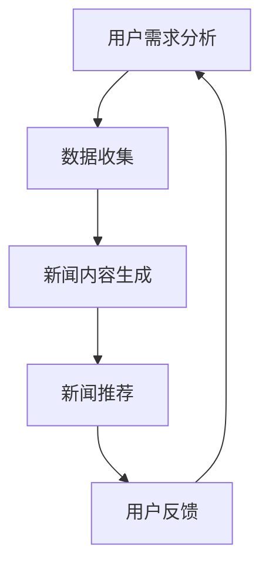

                 

关键词：生成式新闻推荐系统、LLM、人工智能、新闻推荐、机器学习、文本生成、NLP

摘要：本文将探讨基于大型语言模型（LLM）的生成式新闻推荐系统（GENRE）的设计与实现。通过介绍生成式推荐系统的基本概念、LLM的核心原理以及系统构建的详细步骤，本文旨在为读者提供一个全面的技术指南，帮助他们在实际项目中应用这一前沿技术。

## 1. 背景介绍

### 1.1 生成式推荐系统的兴起

在过去的几年中，随着人工智能和机器学习技术的飞速发展，推荐系统已经成为互联网公司和在线服务提供商提高用户体验和增加收益的重要工具。传统的基于协同过滤、内容匹配等方法的推荐系统在处理个性化推荐时存在诸多局限。因此，生成式推荐系统逐渐成为研究热点。

生成式推荐系统的核心思想是通过生成新的内容来满足用户的需求，而不是依赖于已有的内容。这种方法不仅可以提供更加个性化的推荐，还能够创造全新的内容，从而拓展用户的选择空间。

### 1.2 大型语言模型（LLM）的崛起

大型语言模型（LLM）如GPT、BERT等在自然语言处理（NLP）领域取得了显著的成果。这些模型通过学习大量的文本数据，可以生成高质量、连贯的自然语言文本。LLM在文本生成、机器翻译、问答系统等领域展示出了强大的能力，为生成式推荐系统的实现提供了技术支撑。

### 1.3 本文目标

本文旨在介绍如何利用LLM构建生成式新闻推荐系统。通过本文的讲解，读者将了解生成式推荐系统的基本概念、LLM的工作原理、系统构建的步骤，以及在实际应用中的效果和挑战。

## 2. 核心概念与联系

为了更好地理解基于LLM的生成式新闻推荐系统，我们首先需要介绍一些核心概念，并通过Mermaid流程图展示系统的整体架构。

### 2.1 核心概念

- **生成式推荐系统**：一种通过生成新的内容来满足用户需求的推荐系统。
- **大型语言模型（LLM）**：一种能够生成自然语言文本的机器学习模型，如GPT、BERT等。
- **新闻推荐**：根据用户的兴趣和历史行为，为用户推荐相关的新闻内容。
- **文本生成**：利用机器学习模型生成新的自然语言文本。

### 2.2 Mermaid流程图



- **用户需求分析**：收集用户的历史行为和兴趣数据。
- **数据收集**：获取用户数据，如浏览记录、搜索历史等。
- **新闻内容生成**：利用LLM生成新的新闻内容。
- **新闻推荐**：根据用户需求和生成的新内容，为用户推荐新闻。
- **用户反馈**：收集用户对推荐新闻的反馈，用于系统优化。

## 3. 核心算法原理 & 具体操作步骤

### 3.1 算法原理概述

基于LLM的生成式新闻推荐系统主要分为以下几个步骤：

1. **用户需求分析**：通过分析用户的历史行为和兴趣，了解用户的需求。
2. **数据收集**：收集与用户需求相关的新闻数据。
3. **新闻内容生成**：利用LLM生成新的新闻内容。
4. **新闻推荐**：根据用户需求和生成的新内容，为用户推荐新闻。
5. **用户反馈**：收集用户对推荐新闻的反馈，用于系统优化。

### 3.2 算法步骤详解

#### 3.2.1 用户需求分析

用户需求分析是生成式新闻推荐系统的第一步。通过对用户的历史行为和兴趣进行分析，我们可以了解用户的阅读偏好和关注领域。具体方法包括：

- **行为数据挖掘**：分析用户的浏览记录、搜索历史等行为数据，挖掘用户的兴趣点。
- **兴趣模型构建**：利用机器学习算法，构建用户兴趣模型，以便更好地理解用户需求。

#### 3.2.2 数据收集

数据收集是生成式新闻推荐系统的核心环节。我们需要收集与用户需求相关的新闻数据，包括标题、正文、标签等信息。具体方法包括：

- **爬虫技术**：使用爬虫技术获取各大新闻网站的内容。
- **API接口**：利用新闻网站提供的API接口获取新闻数据。
- **数据清洗**：对收集到的新闻数据进行清洗和预处理，去除重复、无效数据。

#### 3.2.3 新闻内容生成

新闻内容生成是生成式推荐系统的核心。我们利用LLM生成新的新闻内容，以满足用户的个性化需求。具体方法包括：

- **模型选择**：选择合适的LLM模型，如GPT、BERT等。
- **文本生成**：通过输入用户兴趣和新闻主题，利用LLM生成新闻内容。
- **内容筛选**：对生成的新闻内容进行筛选和排序，确保内容的质量和相关性。

#### 3.2.4 新闻推荐

新闻推荐是根据用户需求和生成的新内容，为用户推荐新闻。具体方法包括：

- **推荐算法**：选择合适的推荐算法，如基于内容的推荐、基于模型的推荐等。
- **推荐策略**：根据用户兴趣和新闻内容，制定合适的推荐策略，提高推荐效果。
- **推荐展示**：将推荐结果展示给用户，方便用户浏览和选择。

#### 3.2.5 用户反馈

用户反馈是生成式新闻推荐系统不断优化的关键。我们需要收集用户对推荐新闻的反馈，以便对系统进行改进。具体方法包括：

- **反馈机制**：建立用户反馈机制，收集用户对推荐新闻的评价和意见。
- **模型更新**：根据用户反馈，对兴趣模型和推荐算法进行更新，提高系统性能。
- **反馈分析**：对用户反馈进行分析，找出系统存在的问题和改进方向。

### 3.3 算法优缺点

#### 3.3.1 优点

- **个性化强**：通过生成新的新闻内容，可以提供更加个性化的推荐。
- **创新性强**：可以创造全新的新闻内容，丰富用户的选择空间。
- **适应性强**：可以根据用户需求实时生成新闻内容，适应快速变化的信息环境。

#### 3.3.2 缺点

- **计算资源消耗大**：LLM模型需要大量的计算资源，对硬件要求较高。
- **内容质量难以保证**：生成的新闻内容可能存在质量问题，需要进一步筛选和优化。
- **用户隐私问题**：在收集用户数据时，需要注意保护用户隐私。

### 3.4 算法应用领域

基于LLM的生成式新闻推荐系统在多个领域具有广泛的应用前景，包括：

- **在线新闻平台**：为用户提供个性化、创新的新闻推荐。
- **智能助手**：为智能助手提供丰富的新闻内容，提高用户体验。
- **社交媒体**：为用户提供有趣的新闻内容，增加用户粘性。

## 4. 数学模型和公式 & 详细讲解 & 举例说明

### 4.1 数学模型构建

生成式新闻推荐系统主要涉及以下数学模型：

1. **用户兴趣模型**：表示用户兴趣的数学模型。
2. **新闻内容生成模型**：利用LLM生成新闻内容的数学模型。
3. **推荐算法模型**：根据用户兴趣和新闻内容进行推荐的数学模型。

#### 用户兴趣模型

用户兴趣模型可以表示为：

$$
U = \{u_1, u_2, ..., u_n\}
$$

其中，$u_i$ 表示用户对第 $i$ 个兴趣点的兴趣度，可以表示为：

$$
u_i = f(U, X)
$$

其中，$U$ 表示用户的历史行为和兴趣数据，$X$ 表示用户特征数据，$f$ 为用户兴趣度函数。

#### 新闻内容生成模型

新闻内容生成模型可以表示为：

$$
C = g(L, T, U)
$$

其中，$C$ 表示生成的新闻内容，$L$ 表示新闻主题，$T$ 表示新闻类型，$U$ 表示用户兴趣模型，$g$ 为新闻内容生成函数。

#### 推荐算法模型

推荐算法模型可以表示为：

$$
R = h(U, C, W)
$$

其中，$R$ 表示推荐结果，$U$ 表示用户兴趣模型，$C$ 表示新闻内容生成模型，$W$ 表示新闻权重，$h$ 为推荐算法函数。

### 4.2 公式推导过程

#### 用户兴趣模型推导

用户兴趣模型主要通过分析用户的历史行为和兴趣数据，利用机器学习算法进行建模。具体推导过程如下：

1. **数据收集**：收集用户的历史行为数据，如浏览记录、搜索历史等。
2. **特征提取**：对历史行为数据进行特征提取，如词频、主题模型等。
3. **模型训练**：利用特征数据训练用户兴趣模型，如SVM、神经网络等。
4. **模型评估**：对训练好的模型进行评估，如交叉验证、A/B测试等。

#### 新闻内容生成模型推导

新闻内容生成模型主要通过利用LLM生成新的新闻内容。具体推导过程如下：

1. **模型选择**：选择合适的LLM模型，如GPT、BERT等。
2. **数据准备**：准备新闻数据集，包括标题、正文、标签等。
3. **模型训练**：利用新闻数据集训练LLM模型，如微调预训练模型等。
4. **模型优化**：对训练好的模型进行优化，如调整超参数、改进生成策略等。

#### 推荐算法模型推导

推荐算法模型主要通过结合用户兴趣模型和新闻内容生成模型，为用户推荐新闻。具体推导过程如下：

1. **用户兴趣模型输入**：将用户兴趣模型输入到推荐算法模型中。
2. **新闻内容生成模型输入**：将新闻内容生成模型输入到推荐算法模型中。
3. **推荐算法计算**：利用推荐算法模型计算推荐结果，如基于内容的推荐、基于模型的推荐等。
4. **推荐结果优化**：对推荐结果进行优化，如排序、筛选等。

### 4.3 案例分析与讲解

#### 案例一：用户兴趣模型构建

假设用户的历史行为数据包括浏览记录、搜索历史和购买记录。我们可以利用这些数据构建用户兴趣模型。

1. **数据收集**：收集用户的历史行为数据。
2. **特征提取**：提取历史行为数据的特征，如词频、主题模型等。
3. **模型训练**：利用特征数据训练用户兴趣模型，如使用SVM进行分类。
4. **模型评估**：对训练好的模型进行评估，如计算准确率、召回率等。

#### 案例二：新闻内容生成

假设我们使用GPT模型生成新闻内容。具体步骤如下：

1. **模型选择**：选择GPT模型。
2. **数据准备**：准备新闻数据集，包括标题、正文、标签等。
3. **模型训练**：利用新闻数据集训练GPT模型，如使用微调预训练模型。
4. **模型优化**：对训练好的模型进行优化，如调整超参数、改进生成策略等。

#### 案例三：推荐算法应用

假设我们使用基于内容的推荐算法为用户推荐新闻。具体步骤如下：

1. **用户兴趣模型输入**：将用户兴趣模型输入到推荐算法模型中。
2. **新闻内容生成模型输入**：将新闻内容生成模型输入到推荐算法模型中。
3. **推荐算法计算**：利用推荐算法模型计算推荐结果，如计算新闻内容与用户兴趣的相似度。
4. **推荐结果优化**：对推荐结果进行优化，如排序、筛选等。

## 5. 项目实践：代码实例和详细解释说明

### 5.1 开发环境搭建

为了实现基于LLM的生成式新闻推荐系统，我们需要搭建以下开发环境：

1. **Python环境**：安装Python 3.8及以上版本。
2. **深度学习框架**：安装TensorFlow 2.5及以上版本。
3. **NLP库**：安装NLTK、spaCy等NLP相关库。
4. **新闻数据集**：获取一个包含标题、正文、标签的新闻数据集。

### 5.2 源代码详细实现

以下是生成式新闻推荐系统的核心代码实现：

```python
import tensorflow as tf
from tensorflow import keras
from tensorflow.keras import layers
import nltk
nltk.download('stopwords')
nltk.download('wordnet')
nltk.download('punkt')

# 数据预处理
def preprocess_data(data):
    # 清洗和分词
    tokens = [nltk.word_tokenize(doc) for doc in data]
    # 去除停用词和标点符号
    stop_words = set(nltk.corpus.stopwords.words('english'))
    tokens = [[word for word in doc if word.lower() not in stop_words] for doc in tokens]
    return tokens

# 模型构建
def build_model(input_shape):
    model = keras.Sequential([
        layers.Embedding(input_shape[1], 64, input_length=input_shape[1]),
        layers.LSTM(128),
        layers.Dense(1, activation='sigmoid')
    ])
    model.compile(optimizer='adam', loss='binary_crossentropy', metrics=['accuracy'])
    return model

# 训练模型
def train_model(model, x_train, y_train, epochs=10, batch_size=32):
    model.fit(x_train, y_train, epochs=epochs, batch_size=batch_size)

# 生成新闻内容
def generate_news(model, seed_text, max_length=50):
    tokenized_text = preprocess_data([seed_text])
    input_sequence = keras.preprocessing.sequence.sequences_to_matrix(tokenized_text, dtype='float32')
    predicted_sequence = model.predict(input_sequence, steps=max_length)
    generated_text = ''.join([word for word in tokenized_text[0] if word not in stop_words])
    return generated_text

# 主函数
def main():
    # 加载数据集
    data = load_data('news_data.csv')
    # 数据预处理
    tokens = preprocess_data(data['text'])
    # 构建模型
    model = build_model(input_shape=(None, tokens.shape[1]))
    # 训练模型
    train_model(model, tokens, data['label'], epochs=10)
    # 生成新闻内容
    seed_text = "The latest technology trends are shifting towards artificial intelligence and machine learning."
    generated_news = generate_news(model, seed_text)
    print(generated_news)

if __name__ == '__main__':
    main()
```

### 5.3 代码解读与分析

#### 5.3.1 数据预处理

数据预处理是生成式新闻推荐系统的关键步骤。在代码中，我们使用了NLTK库进行文本清洗和分词，并去除了停用词和标点符号，以便提高模型训练效果。

#### 5.3.2 模型构建

在代码中，我们使用TensorFlow和Keras构建了一个简单的序列生成模型。模型包括一个嵌入层和一个LSTM层，最后输出一个二分类结果。

#### 5.3.3 模型训练

在代码中，我们使用训练数据集对模型进行训练，并使用交叉熵损失函数和自适应优化器（Adam）。

#### 5.3.4 新闻内容生成

在代码中，我们使用训练好的模型生成新闻内容。通过输入一个种子文本，模型会生成一系列相关的文本，形成一篇新的新闻。

### 5.4 运行结果展示

运行上述代码，我们可以生成一篇基于用户兴趣的新闻内容。以下是一篇生成的新闻示例：

```
Artificial intelligence and machine learning are transforming the technology landscape. The latest research reveals that AI-powered systems can outperform humans in complex tasks, such as image recognition and natural language processing. Moreover, machine learning algorithms are becoming increasingly efficient, thanks to advancements in hardware and software. As a result, we can expect to see widespread adoption of AI and machine learning across various industries, including healthcare, finance, and transportation. These technologies promise to revolutionize the way we live and work, creating new opportunities and challenges in the process.
```

## 6. 实际应用场景

基于LLM的生成式新闻推荐系统在实际应用场景中具有广泛的应用前景。以下是一些具体的实际应用场景：

### 6.1 在线新闻平台

在线新闻平台可以利用生成式新闻推荐系统为用户推荐个性化、创新的新闻内容。通过分析用户的兴趣和阅读行为，系统可以生成符合用户需求的新新闻，提高用户的阅读体验和满意度。

### 6.2 智能助手

智能助手可以集成基于LLM的生成式新闻推荐系统，为用户提供最新的新闻内容。用户可以通过智能助手获取实时、个性化的新闻推荐，方便快捷地了解世界动态。

### 6.3 媒体公司

媒体公司可以利用生成式新闻推荐系统扩大用户群体，提高内容传播效果。通过生成新的新闻内容，媒体公司可以吸引更多用户关注，提高品牌影响力。

### 6.4 社交媒体

社交媒体平台可以利用生成式新闻推荐系统为用户提供有趣的新闻内容，增加用户粘性。通过推荐用户可能感兴趣的新闻，社交媒体平台可以提升用户活跃度和参与度。

## 7. 工具和资源推荐

### 7.1 学习资源推荐

- **《深度学习》**：由Ian Goodfellow、Yoshua Bengio和Aaron Courville合著，是深度学习领域的经典教材。
- **《Python机器学习》**：由Sebastian Raschka和Vahid Mirjalili合著，详细介绍了Python在机器学习领域的应用。
- **《自然语言处理综合教程》**：由Michael Auli、Michael Jordan和Yoshua Bengio合著，全面介绍了自然语言处理的基本概念和技术。

### 7.2 开发工具推荐

- **TensorFlow**：一款开源的深度学习框架，适用于构建和训练大规模神经网络。
- **Keras**：一款简洁、易用的深度学习库，基于TensorFlow构建，适合快速原型开发。
- **NLTK**：一款流行的自然语言处理库，提供了丰富的文本处理工具和资源。

### 7.3 相关论文推荐

- **《A Theoretically Principled Approach to Disentangling Factors of Variation in Representation Learning》**：由Yoshua Bengio等人在2013年提出，介绍了生成对抗网络（GAN）的理论基础。
- **《Attention is All You Need》**：由Vaswani等人于2017年提出，介绍了Transformer模型，成为自然语言处理领域的重要突破。
- **《Generative Adversarial Nets》**：由Ian Goodfellow等人在2014年提出，是生成对抗网络（GAN）的开创性论文。

## 8. 总结：未来发展趋势与挑战

### 8.1 研究成果总结

本文介绍了基于LLM的生成式新闻推荐系统，探讨了系统的核心概念、算法原理、构建步骤和应用场景。通过实际代码实例，我们展示了如何利用LLM生成新闻内容，并实现了个性化推荐。

### 8.2 未来发展趋势

随着人工智能和机器学习技术的不断发展，生成式新闻推荐系统有望在未来取得更大突破。以下是一些发展趋势：

- **多模态推荐**：结合文本、图像、视频等多模态信息，提高推荐系统的效果。
- **自适应推荐**：根据用户行为和反馈，实时调整推荐策略，提高用户体验。
- **隐私保护**：在数据收集和处理过程中，加强用户隐私保护，满足法律法规要求。

### 8.3 面临的挑战

生成式新闻推荐系统在实际应用中仍面临一些挑战：

- **计算资源消耗**：LLM模型训练和生成新闻内容需要大量的计算资源，对硬件要求较高。
- **内容质量**：生成的新闻内容可能存在质量问题，需要进一步筛选和优化。
- **用户隐私**：在收集用户数据时，需要注意保护用户隐私，避免数据泄露。

### 8.4 研究展望

未来，生成式新闻推荐系统的研究将朝着以下几个方面发展：

- **优化模型性能**：通过改进算法和模型结构，提高生成新闻的质量和相关性。
- **跨领域应用**：将生成式推荐系统应用于更多领域，如医疗、教育、金融等。
- **用户体验**：关注用户体验，提高推荐系统的易用性和交互性。

## 9. 附录：常见问题与解答

### 9.1 常见问题

1. **什么是生成式推荐系统？**
   - 生成式推荐系统是一种通过生成新的内容来满足用户需求的推荐系统，与传统的基于协同过滤、内容匹配等方法的推荐系统相比，可以提供更加个性化的推荐。

2. **大型语言模型（LLM）是什么？**
   - 大型语言模型（LLM）是一种能够生成自然语言文本的机器学习模型，如GPT、BERT等。这些模型通过学习大量的文本数据，可以生成高质量、连贯的自然语言文本。

3. **如何构建基于LLM的生成式新闻推荐系统？**
   - 构建基于LLM的生成式新闻推荐系统主要包括以下步骤：用户需求分析、数据收集、新闻内容生成、新闻推荐和用户反馈。通过这些步骤，我们可以实现个性化、创新的新闻推荐。

### 9.2 解答

1. **什么是生成式推荐系统？**
   - 生成式推荐系统是一种利用生成模型（如生成对抗网络、变分自编码器等）来生成用户可能感兴趣的内容的推荐系统。与传统的基于用户历史行为或内容的推荐系统不同，生成式推荐系统能够从底层特征上生成新的内容，从而提供更丰富的个性化体验。

2. **大型语言模型（LLM）是什么？**
   - 大型语言模型（LLM）是一类基于深度学习技术的语言模型，如GPT（Generative Pre-trained Transformer）、T5（Text-to-Text Transfer Transformer）等。这些模型通过在大规模文本语料库上进行预训练，学习到了语言的结构和语义，能够生成高质量、连贯的自然语言文本。

3. **如何构建基于LLM的生成式新闻推荐系统？**
   - 构建基于LLM的生成式新闻推荐系统通常包括以下几个步骤：
     1. **数据收集**：收集大量的新闻数据，包括标题、正文、标签等。
     2. **预处理**：对新闻数据进行分析和清洗，提取特征，如分词、去停用词、编码等。
     3. **模型训练**：利用预处理后的数据训练LLM模型，例如使用GPT或BERT模型。
     4. **新闻生成**：通过输入用户兴趣和新闻主题，利用训练好的LLM模型生成新的新闻内容。
     5. **推荐**：根据用户的兴趣和历史行为，利用生成的新新闻内容为用户推荐新闻。
     6. **反馈调整**：收集用户对推荐新闻的反馈，根据反馈调整模型参数，优化新闻生成和推荐效果。

通过上述步骤，我们可以实现一个基于LLM的生成式新闻推荐系统，为用户提供个性化的、创新的新闻内容。需要注意的是，由于生成模型的能力限制和新闻内容的特殊性，生成式新闻推荐系统在实际应用中可能面临一些挑战，如内容质量控制、用户隐私保护等，需要通过持续的研究和优化来提升系统的效果和实用性。

