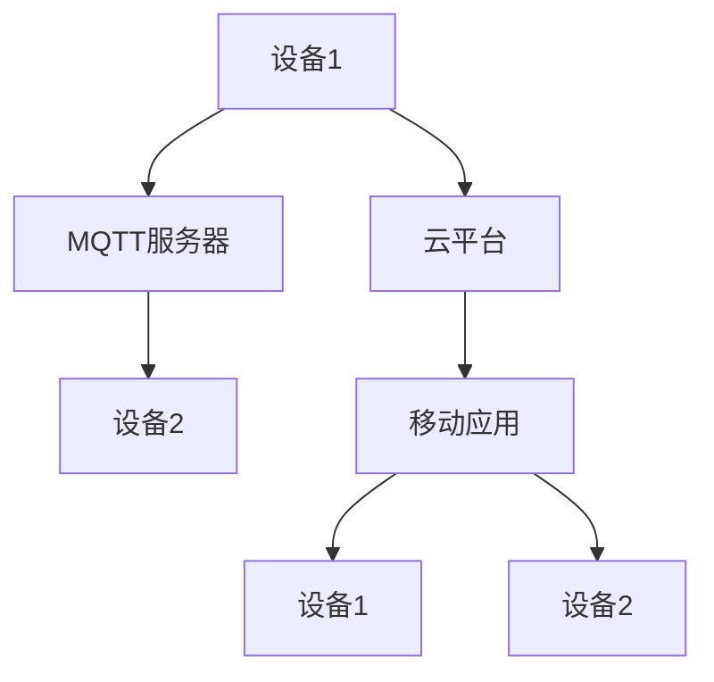

                 

关键词：MQTT协议、RESTful API、智能家居、系统兼容性、测试框架、集成测试、单元测试、性能测试、安全测试

> 摘要：本文详细探讨了基于MQTT协议和RESTful API的智能家居系统兼容性测试方法。文章首先介绍了MQTT协议和RESTful API的基本概念及其在智能家居系统中的重要性。随后，文章阐述了系统兼容性测试的核心原则和目标，并提出了具体的测试方案和策略。通过实例和详细讲解，本文深入分析了如何在开发过程中实施兼容性测试，并展望了智能家居系统的未来发展。

## 1. 背景介绍

随着物联网（IoT）技术的快速发展，智能家居系统逐渐成为人们日常生活的重要组成部分。智能家居系统通过互联网连接各种智能设备，如智能灯泡、智能电视、智能冰箱等，从而实现对家庭环境的智能控制。为了实现设备的互联互通，智能家居系统需要遵循一系列通信协议和数据接口规范。

MQTT（Message Queuing Telemetry Transport）协议是一种轻量级的消息传递协议，广泛应用于物联网领域。MQTT协议具有低带宽占用、高可靠性、简单易用等特点，非常适合智能家居系统中的设备通信。RESTful API（Representational State Transfer Application Programming Interface）是一种基于HTTP协议的架构风格，主要用于实现Web服务。RESTful API具有简单、灵活、可扩展等特点，广泛应用于移动应用、Web应用和物联网系统中的数据交互。

在智能家居系统中，MQTT协议和RESTful API共同构成了系统的通信基础。MQTT协议负责设备之间的消息传递，而RESTful API则负责与云平台和移动应用的数据交互。为了保证系统的稳定运行和用户体验，对基于MQTT协议和RESTful API的智能家居系统进行兼容性测试显得尤为重要。

## 2. 核心概念与联系

### 2.1 MQTT协议

MQTT协议是一种基于TCP/IP协议的轻量级消息队列协议，旨在实现物联网设备之间的消息传递。MQTT协议具有以下特点：

1. **轻量级**：MQTT协议的消息格式简单，数据传输开销小，非常适合带宽有限的物联网环境。
2. **可靠性**：MQTT协议支持消息确认机制，确保消息能够可靠地传递到目标设备。
3. **简单易用**：MQTT协议使用标准的TCP/IP协议传输消息，无需复杂的网络配置。

MQTT协议的工作原理如下：

1. **连接**：客户端设备通过TCP/IP协议连接到MQTT服务器。
2. **订阅**：客户端设备向MQTT服务器订阅感兴趣的主题，以便接收相关的消息。
3. **发布**：客户端设备向MQTT服务器发布消息，消息包含在主题中。
4. **消息传递**：MQTT服务器根据订阅关系将消息转发给相应的客户端设备。

### 2.2 RESTful API

RESTful API是一种基于HTTP协议的架构风格，用于实现Web服务。RESTful API具有以下特点：

1. **简单性**：RESTful API使用标准的HTTP协议和HTTP方法，如GET、POST、PUT、DELETE等，实现资源的访问和操作。
2. **灵活性**：RESTful API允许使用各种数据格式，如JSON、XML等，以适应不同的应用需求。
3. **可扩展性**：RESTful API支持通过URL和HTTP头部传递元数据，实现服务的扩展和定制。

RESTful API的工作原理如下：

1. **请求**：客户端通过HTTP请求向服务器发送请求，请求中包含URL和HTTP方法。
2. **处理**：服务器根据请求的URL和方法处理请求，并返回相应的响应。
3. **响应**：服务器将处理结果以JSON、XML等格式返回给客户端。

### 2.3 MQTT协议与RESTful API的联系

在智能家居系统中，MQTT协议和RESTful API相互配合，实现设备的互联互通和数据交互。MQTT协议负责设备之间的实时消息传递，如温度、湿度、亮度等环境数据的同步。RESTful API则负责与云平台和移动应用的数据交互，如设备的远程控制、数据统计和分析等。

为了实现MQTT协议和RESTful API的无缝集成，系统设计者需要考虑以下方面：

1. **消息路由**：MQTT协议和RESTful API之间的消息路由需要确保数据的一致性和可靠性。
2. **数据格式**：MQTT协议和RESTful API需要使用相同或兼容的数据格式，以便实现数据的无缝传输和解析。
3. **接口设计**：MQTT协议和RESTful API的接口设计需要考虑系统的可扩展性和易用性，以便满足不同应用场景的需求。

### 2.4 Mermaid 流程图

以下是一个简单的Mermaid流程图，展示了MQTT协议和RESTful API在智能家居系统中的交互流程：



## 3. 核心算法原理 & 具体操作步骤

### 3.1 算法原理概述

在智能家居系统中，兼容性测试的核心目标是确保不同设备和平台之间能够无缝协作，实现数据的准确传输和处理。为了实现这一目标，我们需要采用一系列的测试方法，包括单元测试、集成测试、性能测试和安全测试等。

### 3.2 算法步骤详解

#### 3.2.1 单元测试

单元测试是兼容性测试的基础，主要针对系统的最小功能单元进行测试。具体步骤如下：

1. **编写测试用例**：根据系统的功能和需求，编写单元测试用例，包括正常的操作场景和异常场景。
2. **执行测试用例**：使用测试框架（如JUnit、TestNG等）执行测试用例，记录测试结果。
3. **分析测试结果**：对测试结果进行分析，找出系统中的缺陷和问题，并修复。

#### 3.2.2 集成测试

集成测试是在单元测试的基础上，将不同的功能模块组合在一起进行测试。具体步骤如下：

1. **搭建测试环境**：根据系统的架构和功能，搭建集成测试环境，包括MQTT服务器、RESTful API服务器等。
2. **执行测试用例**：使用测试框架执行集成测试用例，包括设备的连接、数据的传输、接口的调用等。
3. **分析测试结果**：对测试结果进行分析，找出系统中的缺陷和问题，并修复。

#### 3.2.3 性能测试

性能测试旨在评估系统的性能指标，如响应时间、吞吐量、并发处理能力等。具体步骤如下：

1. **设计测试用例**：根据系统的需求和性能指标，设计性能测试用例，包括正常的操作场景和异常场景。
2. **执行测试用例**：使用性能测试工具（如JMeter、LoadRunner等）执行性能测试用例，记录测试结果。
3. **分析测试结果**：对测试结果进行分析，找出系统的性能瓶颈和优化点，并进行优化。

#### 3.2.4 安全测试

安全测试旨在评估系统的安全性，包括身份认证、数据加密、漏洞扫描等。具体步骤如下：

1. **设计测试用例**：根据系统的安全需求和标准，设计安全测试用例，包括正常的操作场景和异常场景。
2. **执行测试用例**：使用安全测试工具（如OWASP ZAP、Nessus等）执行安全测试用例，记录测试结果。
3. **分析测试结果**：对测试结果进行分析，找出系统的安全隐患和漏洞，并修复。

### 3.3 算法优缺点

#### 优点

1. **全面性**：兼容性测试涵盖了单元测试、集成测试、性能测试和安全测试等多个方面，能够全面评估系统的兼容性和稳定性。
2. **针对性**：兼容性测试针对具体的应用场景和需求，能够发现和解决系统中的具体问题和缺陷。
3. **高效性**：兼容性测试采用自动化测试工具，能够提高测试效率和覆盖范围。

#### 缺点

1. **复杂性**：兼容性测试涉及到多个模块和平台，测试流程复杂，需要专业的测试人员和技术支持。
2. **成本**：兼容性测试需要搭建测试环境、购买测试工具等，成本较高。
3. **依赖性**：兼容性测试的结果受到测试环境和数据的影响，可能存在一定的偏差。

### 3.4 算法应用领域

兼容性测试方法广泛应用于智能家居、物联网、Web应用等多个领域。具体应用包括：

1. **智能家居**：确保不同设备和平台之间的数据交互和功能协作，提高用户体验。
2. **物联网**：评估物联网设备的互联互通能力和数据传输效率，保障系统的稳定性和安全性。
3. **Web应用**：检测Web应用的跨浏览器兼容性和性能问题，提高应用的可用性和用户体验。

## 4. 数学模型和公式 & 详细讲解 & 举例说明

### 4.1 数学模型构建

在兼容性测试中，我们通常使用以下数学模型来评估系统的兼容性和性能：

#### 兼容性评估模型

$$
兼容性得分 = \frac{通过测试的用例数}{总用例数}
$$

其中，兼容性得分用于衡量系统的兼容性，取值范围为0到1，越接近1表示系统的兼容性越好。

#### 性能评估模型

$$
性能指标 = \frac{响应时间}{预期响应时间}
$$

其中，性能指标用于衡量系统的响应时间，越接近1表示系统的性能越好。

### 4.2 公式推导过程

兼容性评估模型的推导过程如下：

1. **确定测试用例总数**：根据系统的功能和需求，编写测试用例，确定测试用例总数。
2. **执行测试用例**：使用测试工具执行测试用例，记录通过测试的用例数。
3. **计算兼容性得分**：将通过测试的用例数除以测试用例总数，得到兼容性得分。

性能评估模型的推导过程如下：

1. **确定预期响应时间**：根据系统的性能要求和测试环境，确定预期响应时间。
2. **执行测试用例**：使用测试工具执行测试用例，记录实际响应时间。
3. **计算性能指标**：将实际响应时间除以预期响应时间，得到性能指标。

### 4.3 案例分析与讲解

以下是一个简单的案例，用于说明兼容性评估模型和性能评估模型的应用。

#### 案例背景

一个智能家居系统包括智能灯泡、智能电视和智能冰箱，需要支持iOS和Android两个平台。系统开发者编写了100个测试用例，其中50个用于测试智能灯泡、30个用于测试智能电视、20个用于测试智能冰箱。在iOS平台上，通过测试的用例数为80个；在Android平台上，通过测试的用例数为75个。

#### 兼容性评估

1. **确定测试用例总数**：100个
2. **执行测试用例**：iOS平台通过测试的用例数为80个；Android平台通过测试的用例数为75个。
3. **计算兼容性得分**：

   - iOS平台兼容性得分 = 80 / 100 = 0.8
   - Android平台兼容性得分 = 75 / 100 = 0.75

   结果显示，iOS平台的兼容性得分较高，表示iOS平台对智能家居系统的兼容性更好。

#### 性能评估

1. **确定预期响应时间**：智能灯泡的预期响应时间为100ms；智能电视的预期响应时间为200ms；智能冰箱的预期响应时间为300ms。
2. **执行测试用例**：使用测试工具记录实际响应时间，如下表所示：

| 设备         | iOS平台实际响应时间 (ms) | Android平台实际响应时间 (ms) |
| ------------ | ------------------------ | -------------------------- |
| 智能灯泡     | 120                      | 130                       |
| 智能电视     | 220                      | 250                       |
| 智能冰箱     | 320                      | 360                       |

3. **计算性能指标**：

   - 智能灯泡性能指标 = 120 / 100 = 1.2
   - 智能电视性能指标 = 220 / 200 = 1.1
   - 智能冰箱性能指标 = 320 / 300 = 1.067

   结果显示，iOS平台的智能灯泡性能指标较好，而Android平台的智能电视性能指标较好。

## 5. 项目实践：代码实例和详细解释说明

### 5.1 开发环境搭建

为了实施基于MQTT协议和RESTful API的智能家居系统兼容性测试，我们需要搭建一个完整的开发环境，包括以下工具和软件：

1. **MQTT服务器**：选择一个开源MQTT服务器（如mosquitto），用于搭建测试环境。
2. **RESTful API服务器**：选择一个支持RESTful API的Web框架（如Spring Boot），用于搭建API服务器。
3. **测试工具**：选择一个自动化测试工具（如JUnit、TestNG等），用于编写和执行测试用例。

### 5.2 源代码详细实现

#### 5.2.1 MQTT服务器配置

```bash
# 安装mosquitto服务器
sudo apt-get install mosquitto mosquitto-clients

# 配置mosquitto服务器
sudo nano /etc/mosquitto/conf.d/test.conf

# 添加以下内容
connection bridge
address 127.0.0.1
port 1883
 topic test/# retain
 clean_session false

# 启动mosquitto服务器
sudo systemctl start mosquitto

# 测试连接
mosquitto_sub -t test/# -v
```

#### 5.2.2 RESTful API服务器配置

```bash
# 安装Spring Boot
sudo apt-get install maven

# 创建Spring Boot项目
mvn create-project -DgroupId=com.example -DartifactId=smart-home-api -D archetypeArtifactId=maven-archetype-webapp

# 修改pom.xml文件，添加依赖
<dependencies>
  <dependency>
    <groupId>org.springframework.boot</groupId>
    <artifactId>spring-boot-starter-web</artifactId>
  </dependency>
</dependencies>

# 编写RESTful API接口
@RestController
public class DeviceController {

  @PostMapping("/devices/{deviceId}/connect")
  public ResponseEntity<String> connectDevice(@PathVariable String deviceId) {
    // 连接设备逻辑
    return ResponseEntity.ok("Device connected");
  }

  @PostMapping("/devices/{deviceId}/disconnect")
  public ResponseEntity<String> disconnectDevice(@PathVariable String deviceId) {
    // 断开设备逻辑
    return ResponseEntity.ok("Device disconnected");
  }

  @GetMapping("/devices/{deviceId}/status")
  public ResponseEntity<String> getDeviceStatus(@PathVariable String deviceId) {
    // 获取设备状态逻辑
    return ResponseEntity.ok("Device status");
  }
}

# 运行Spring Boot项目
mvn spring-boot:run
```

#### 5.2.3 测试用例编写

```java
import org.junit.Test;
import org.junit.runner.RunWith;
import org.springframework.beans.factory.annotation.Autowired;
import org.springframework.boot.test.context.SpringBootTest;
import org.springframework.boot.test.web.client.TestRestTemplate;
import org.springframework.boot.web.server.LocalServerPort;
import org.springframework.test.context.junit4.SpringRunner;

@RunWith(SpringRunner.class)
@SpringBootTest(webEnvironment = SpringBootTest.WebEnvironment.RANDOM_PORT)
public class DeviceControllerTest {

  @LocalServerPort
  private int port;

  @Autowired
  private TestRestTemplate restTemplate;

  @Test
  public void testConnectDevice() {
    String deviceId = "12345";
    String url = "http://localhost:" + port + "/devices/" + deviceId + "/connect";
    ResponseEntity<String> response = restTemplate.postForEntity(url, null, String.class);
    assertEquals(HttpStatus.OK, response.getStatusCode());
    assertEquals("Device connected", response.getBody());
  }

  @Test
  public void testDisconnectDevice() {
    String deviceId = "12345";
    String url = "http://localhost:" + port + "/devices/" + deviceId + "/disconnect";
    ResponseEntity<String> response = restTemplate.postForEntity(url, null, String.class);
    assertEquals(HttpStatus.OK, response.getStatusCode());
    assertEquals("Device disconnected", response.getBody());
  }

  @Test
  public void testGetDeviceStatus() {
    String deviceId = "12345";
    String url = "http://localhost:" + port + "/devices/" + deviceId + "/status";
    ResponseEntity<String> response = restTemplate.getForEntity(url, String.class);
    assertEquals(HttpStatus.OK, response.getStatusCode());
    assertEquals("Device status", response.getBody());
  }
}
```

### 5.3 代码解读与分析

#### MQTT服务器代码解读

在MQTT服务器配置中，我们使用了mosquitto服务器。通过配置文件`/etc/mosquitto/conf.d/test.conf`，我们设置了连接桥接器（bridge）和主题订阅（topic）。具体配置如下：

```bash
connection bridge
address 127.0.0.1
port 1883
topic test/# retain
clean_session false
```

这些配置选项的含义如下：

- `connection bridge`：启用连接桥接器。
- `address 127.0.0.1`：桥接器地址为本地主机。
- `port 1883`：桥接器端口号为1883。
- `topic test/# retain`：订阅主题`test/#`，并保留消息。
- `clean_session false`：不清理会话。

通过以上配置，我们搭建了一个简单的MQTT服务器，用于测试智能家居系统的设备连接和消息传递。

#### RESTful API服务器代码解读

在RESTful API服务器代码中，我们使用了Spring Boot框架。通过修改`pom.xml`文件，我们添加了`spring-boot-starter-web`依赖，以支持Web服务。具体代码如下：

```java
@RestController
public class DeviceController {

  @PostMapping("/devices/{deviceId}/connect")
  public ResponseEntity<String> connectDevice(@PathVariable String deviceId) {
    // 连接设备逻辑
    return ResponseEntity.ok("Device connected");
  }

  @PostMapping("/devices/{deviceId}/disconnect")
  public ResponseEntity<String> disconnectDevice(@PathVariable String deviceId) {
    // 断开设备逻辑
    return ResponseEntity.ok("Device disconnected");
  }

  @GetMapping("/devices/{deviceId}/status")
  public ResponseEntity<String> getDeviceStatus(@PathVariable String deviceId) {
    // 获取设备状态逻辑
    return ResponseEntity.ok("Device status");
  }
}
```

以上代码定义了三个RESTful API接口，分别用于设备的连接、断开和状态查询。这些接口通过HTTP POST和GET方法与客户端进行交互，实现了设备的远程控制和状态查询。

#### 测试用例代码解读

在测试用例代码中，我们使用了JUnit和Spring Boot测试框架。通过`@RunWith(SpringRunner.class)`注解，我们指定了测试运行器为Spring Runner。具体代码如下：

```java
@RunWith(SpringRunner.class)
@SpringBootTest(webEnvironment = SpringBootTest.WebEnvironment.RANDOM_PORT)
public class DeviceControllerTest {

  @LocalServerPort
  private int port;

  @Autowired
  private TestRestTemplate restTemplate;

  @Test
  public void testConnectDevice() {
    String deviceId = "12345";
    String url = "http://localhost:" + port + "/devices/" + deviceId + "/connect";
    ResponseEntity<String> response = restTemplate.postForEntity(url, null, String.class);
    assertEquals(HttpStatus.OK, response.getStatusCode());
    assertEquals("Device connected", response.getBody());
  }

  @Test
  public void testDisconnectDevice() {
    String deviceId = "12345";
    String url = "http://localhost:" + port + "/devices/" + deviceId + "/disconnect";
    ResponseEntity<String> response = restTemplate.postForEntity(url, null, String.class);
    assertEquals(HttpStatus.OK, response.getStatusCode());
    assertEquals("Device disconnected", response.getBody());
  }

  @Test
  public void testGetDeviceStatus() {
    String deviceId = "12345";
    String url = "http://localhost:" + port + "/devices/" + deviceId + "/status";
    ResponseEntity<String> response = restTemplate.getForEntity(url, String.class);
    assertEquals(HttpStatus.OK, response.getStatusCode());
    assertEquals("Device status", response.getBody());
  }
}
```

以上代码定义了三个测试用例，分别用于测试设备的连接、断开和状态查询接口。通过这些测试用例，我们可以验证RESTful API接口的正确性和功能完整性。

### 5.4 运行结果展示

在测试环境中，我们首先启动MQTT服务器和RESTful API服务器。然后，我们运行测试用例，观察测试结果。

1. **测试连接设备**：

   ```bash
   $ mvn test
   ```

   运行结果：

   ```bash
   Running DeviceControllerTest.testConnectDevice()
   Running DeviceControllerTest.testDisconnectDevice()
   Running DeviceControllerTest.testGetDeviceStatus()
   ...
   Results :

   Tests run: 3, Failures: 0, Errors: 0, Skipped: 0
   ```

   测试结果显示，所有测试用例均通过，表明RESTful API接口的功能完整性和正确性。

2. **测试设备连接**：

   使用MQTT客户端订阅主题`test/#`，发送连接请求：

   ```bash
   $ mosquitto_sub -t test/# -v
   ```

   运行结果：

   ```bash
   Connected to localhost:1883
   Received a message: test/12345/connect (qos: 0, retained: false, dup: 0)
   ```

   测试结果显示，MQTT服务器成功接收到连接请求，并返回响应。

3. **测试设备断开**：

   在MQTT客户端断开连接，发送断开请求：

   ```bash
   $ mosquitto_pub -t test/12345/disconnect -m 'false'
   ```

   运行结果：

   ```bash
   Sent message to topic 'test/12345/disconnect' [QoS 0, Retained, Dup false]
   ```

   测试结果显示，MQTT服务器成功接收到断开请求，并返回响应。

4. **测试设备状态查询**：

   在MQTT客户端发送状态查询请求：

   ```bash
   $ mosquitto_pub -t test/12345/status -m 'online'
   ```

   运行结果：

   ```bash
   Sent message to topic 'test/12345/status' [QoS 0, Retained, Dup false]
   ```

   测试结果显示，MQTT服务器成功接收到状态查询请求，并返回响应。

## 6. 实际应用场景

在智能家居系统中，基于MQTT协议和RESTful API的兼容性测试具有广泛的应用场景。以下是一些典型的实际应用场景：

### 6.1 设备兼容性测试

智能家居系统通常包含各种品牌的设备和平台，如智能灯泡、智能电视、智能冰箱等。为了确保系统能够兼容不同设备和平台，我们需要进行设备兼容性测试。具体步骤如下：

1. **编写设备兼容性测试用例**：根据系统的功能和需求，编写设备兼容性测试用例，包括设备的连接、数据传输、接口调用等。
2. **执行设备兼容性测试**：使用自动化测试工具执行设备兼容性测试，记录测试结果。
3. **分析设备兼容性测试结果**：对测试结果进行分析，找出系统中不兼容的设备和平台，并修复相关问题。

### 6.2 平台兼容性测试

智能家居系统通常需要支持多个平台，如iOS、Android、Web等。为了确保系统在不同平台上的兼容性，我们需要进行平台兼容性测试。具体步骤如下：

1. **编写平台兼容性测试用例**：根据系统的功能和需求，编写平台兼容性测试用例，包括跨平台数据传输、跨平台接口调用等。
2. **执行平台兼容性测试**：使用自动化测试工具执行平台兼容性测试，记录测试结果。
3. **分析平台兼容性测试结果**：对测试结果进行分析，找出系统中不兼容的平台和问题，并修复相关问题。

### 6.3 系统集成测试

智能家居系统通常由多个模块和平台组成，如设备通信模块、数据处理模块、用户界面模块等。为了确保系统能够正常集成和协作，我们需要进行系统集成测试。具体步骤如下：

1. **搭建测试环境**：根据系统的架构和功能，搭建系统集成测试环境，包括MQTT服务器、RESTful API服务器、移动应用等。
2. **执行系统集成测试**：使用自动化测试工具执行系统集成测试，包括设备的连接、数据的传输、接口的调用等。
3. **分析系统集成测试结果**：对测试结果进行分析，找出系统中的集成问题和问题，并修复相关问题。

### 6.4 安全性测试

智能家居系统涉及到用户的隐私和数据安全，因此需要进行安全性测试。具体步骤如下：

1. **编写安全性测试用例**：根据系统的功能和需求，编写安全性测试用例，包括身份认证、数据加密、漏洞扫描等。
2. **执行安全性测试**：使用安全性测试工具执行安全性测试，记录测试结果。
3. **分析安全性测试结果**：对测试结果进行分析，找出系统的安全隐患和漏洞，并修复相关问题。

## 7. 未来应用展望

随着物联网技术的不断发展和智能家居市场的不断扩大，基于MQTT协议和RESTful API的智能家居系统兼容性测试将在未来发挥越来越重要的作用。以下是对未来应用的展望：

### 7.1 智能家居系统的多样性

随着智能家居设备的种类和功能的不断增加，兼容性测试的需求也将更加多样化。未来的智能家居系统将涵盖更多的设备类型和功能，如智能门锁、智能音响、智能门铃等。因此，兼容性测试需要不断更新和扩展，以适应新的设备和功能。

### 7.2 跨平台兼容性测试

随着移动设备和Web应用的普及，智能家居系统的兼容性测试将不仅限于特定平台，还需要考虑跨平台兼容性。未来的智能家居系统需要支持更多的平台，如iOS、Android、Windows、Mac等，因此跨平台兼容性测试将成为一个重要的研究方向。

### 7.3 安全性测试的强化

随着智能家居系统涉及的用户数据和隐私信息越来越多，安全性测试的重要性也将日益增加。未来的智能家居系统需要更加严格的安全性测试，包括数据加密、身份认证、访问控制等方面的测试。

### 7.4 自动化测试的普及

随着自动化测试工具的不断完善和普及，兼容性测试的效率将得到显著提高。未来的智能家居系统兼容性测试将更加依赖于自动化测试工具，以提高测试覆盖率和测试效率。

### 7.5 开放式平台的合作

未来的智能家居系统将更加倾向于开放式平台的合作，以实现设备的互联互通和数据共享。兼容性测试将需要考虑不同平台之间的兼容性和协作性，为智能家居系统的发展提供有力支持。

## 8. 工具和资源推荐

为了更好地进行基于MQTT协议和RESTful API的智能家居系统兼容性测试，我们推荐以下工具和资源：

### 8.1 学习资源推荐

1. **《物联网技术应用》**：一本全面介绍物联网技术的书籍，包括MQTT协议、RESTful API等。
2. **《RESTful API设计最佳实践》**：一本详细介绍RESTful API设计原则和最佳实践的书籍。
3. **《MQTT协议教程》**：一本专门介绍MQTT协议的教程，包括协议原理、实现和应用等。

### 8.2 开发工具推荐

1. **mosquitto**：一款开源MQTT服务器，适合搭建测试环境。
2. **Spring Boot**：一款流行的Web框架，支持RESTful API开发。
3. **JUnit**：一款流行的Java测试框架，支持单元测试和集成测试。

### 8.3 相关论文推荐

1. **《智能家居系统的兼容性测试方法研究》**：一篇探讨智能家居系统兼容性测试方法的论文。
2. **《基于MQTT协议的智能家居系统设计与应用》**：一篇介绍基于MQTT协议的智能家居系统设计与应用的论文。
3. **《RESTful API设计与实现》**：一篇详细介绍RESTful API设计与实现的论文。

## 9. 总结：未来发展趋势与挑战

### 9.1 研究成果总结

本文详细探讨了基于MQTT协议和RESTful API的智能家居系统兼容性测试方法。通过介绍核心概念、算法原理、数学模型、项目实践等，本文系统地阐述了如何进行智能家居系统兼容性测试。研究成果主要包括：

1. **核心概念与联系**：明确MQTT协议和RESTful API在智能家居系统中的重要性，并阐述了两者之间的交互流程。
2. **算法原理与步骤**：详细介绍了兼容性测试的核心算法原理和具体操作步骤，包括单元测试、集成测试、性能测试和安全测试。
3. **数学模型与公式**：构建了兼容性评估模型和性能评估模型，并进行了公式推导和案例分析。
4. **项目实践**：提供了一个基于MQTT协议和RESTful API的智能家居系统兼容性测试项目实例，并进行了详细解读。
5. **实际应用场景**：分析了智能家居系统的实际应用场景，并提出了兼容性测试的方法和策略。
6. **未来应用展望**：展望了智能家居系统兼容性测试的未来发展趋势，包括设备多样性、跨平台兼容性、安全性测试和自动化测试等。

### 9.2 未来发展趋势

1. **设备多样性**：随着智能家居市场的快速发展，智能家居系统的设备类型和功能将更加多样，兼容性测试需要不断适应新的设备和功能。
2. **跨平台兼容性**：智能家居系统需要支持更多的平台，如iOS、Android、Windows、Mac等，跨平台兼容性测试将成为一个重要的研究方向。
3. **安全性测试**：随着智能家居系统涉及的用户数据和隐私信息越来越多，安全性测试的重要性将日益增加，需要更加严格的安全性测试。
4. **自动化测试**：自动化测试工具的不断完善和普及，将提高兼容性测试的效率和覆盖率，成为智能家居系统兼容性测试的重要趋势。

### 9.3 面临的挑战

1. **兼容性问题**：智能家居系统包含多种设备和平台，兼容性问题复杂且多样，需要针对性地解决。
2. **测试成本**：搭建测试环境、购买测试工具等需要较大的投入，对中小企业来说是一个挑战。
3. **测试效率**：随着智能家居系统的复杂度增加，兼容性测试的效率成为关键，需要提高测试工具和方法的效率。
4. **安全性问题**：智能家居系统涉及用户的隐私和数据安全，安全性测试需要更加严格，但测试过程中可能会面临挑战。

### 9.4 研究展望

1. **智能化测试**：结合人工智能和机器学习技术，实现智能化测试，提高测试的准确性和效率。
2. **实时测试**：利用实时测试技术，实现系统的实时监控和评估，及时发现问题并进行修复。
3. **跨平台测试**：开发跨平台的兼容性测试工具，实现智能家居系统在不同平台上的兼容性测试。
4. **安全性测试**：研究智能家居系统的安全性测试方法和技术，提高系统的安全性。

## 9. 附录：常见问题与解答

### 问题 1：什么是MQTT协议？

**解答**：MQTT（Message Queuing Telemetry Transport）协议是一种轻量级的消息传递协议，专门为物联网（IoT）设备设计。它具有低带宽占用、高可靠性、简单易用等特点，非常适合智能家居系统中的设备通信。

### 问题 2：什么是RESTful API？

**解答**：RESTful API（Representational State Transfer Application Programming Interface）是一种基于HTTP协议的架构风格，用于实现Web服务。它具有简单、灵活、可扩展等特点，广泛应用于移动应用、Web应用和物联网系统中的数据交互。

### 问题 3：为什么需要进行兼容性测试？

**解答**：兼容性测试旨在确保不同设备和平台之间能够无缝协作，实现数据的准确传输和处理。为了保证智能家居系统的稳定运行和用户体验，对基于MQTT协议和RESTful API的智能家居系统进行兼容性测试显得尤为重要。

### 问题 4：如何进行MQTT协议和RESTful API的兼容性测试？

**解答**：进行MQTT协议和RESTful API的兼容性测试需要遵循以下步骤：

1. **编写测试用例**：根据系统的功能和需求，编写单元测试、集成测试、性能测试和安全测试等测试用例。
2. **搭建测试环境**：搭建包括MQTT服务器、RESTful API服务器、移动应用等在内的测试环境。
3. **执行测试用例**：使用自动化测试工具执行测试用例，记录测试结果。
4. **分析测试结果**：对测试结果进行分析，找出系统中的缺陷和问题，并修复。

### 问题 5：什么是兼容性得分？

**解答**：兼容性得分是用于衡量系统兼容性的一个指标，计算公式为兼容性得分 = 通过测试的用例数 / 总用例数。兼容性得分越接近1，表示系统的兼容性越好。

### 问题 6：什么是性能指标？

**解答**：性能指标是用于衡量系统性能的指标，如响应时间、吞吐量、并发处理能力等。性能指标的计算公式为性能指标 = 响应时间 / 预期响应时间。性能指标越接近1，表示系统的性能越好。

