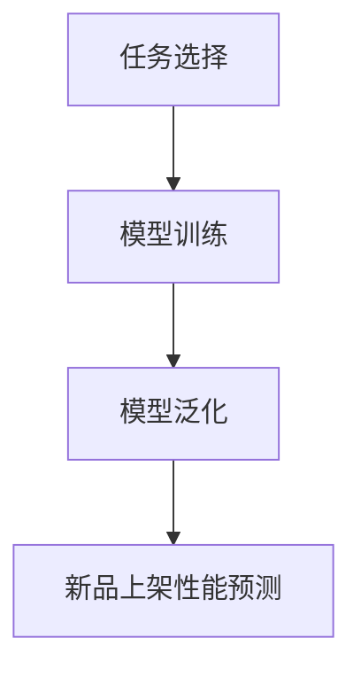

                 

关键词：元学习、新品上架、性能预测、机器学习、深度学习、数据挖掘、计算模型、算法优化、商业决策

## 摘要

本文探讨了基于元学习的新品上架性能预测方法。元学习作为机器学习领域的一个前沿研究方向，通过从大量数据中学习如何学习，实现了在未知领域中的快速适应。本文首先介绍了元学习的基本概念和原理，然后详细阐述了基于元学习的新品上架性能预测的核心算法原理、数学模型以及具体应用步骤。通过实际项目实例，本文展示了基于元学习的新品上架性能预测方法在实际应用中的效果，并对其未来发展方向进行了展望。

## 1. 背景介绍

随着电子商务和互联网产业的迅猛发展，新产品上架成为各大电商平台的重要业务环节。如何准确预测新品上架后的销售表现，对于电商平台制定营销策略、库存管理以及供应链优化具有重要意义。传统的预测方法大多依赖于历史数据和统计模型，但在面对新品这种数据缺乏的情况时，往往无法给出准确的预测结果。

机器学习作为一种强大的数据处理和预测工具，被广泛应用于各种领域。然而，传统机器学习方法往往需要大量的标注数据进行训练，且在面对未知领域时表现较差。为了解决这一问题，元学习（Meta-Learning）作为一种能够从少量数据中快速学习的机器学习方法，逐渐引起了研究者的关注。

元学习通过学习如何学习，提高了模型在新领域中的泛化能力，为新品上架性能预测提供了一种新的思路。本文旨在探讨基于元学习的新品上架性能预测方法，并通过实际项目实例验证其有效性和可行性。

## 2. 核心概念与联系

### 2.1 元学习的基本概念

元学习，也称为“学习如何学习”（Learning to Learn），是机器学习领域的一个子领域，旨在构建能够从少量数据中快速学习和适应新任务的算法。与传统机器学习方法不同，元学习关注的是算法的泛化能力和迁移学习效果。

### 2.2 元学习的核心原理

元学习的核心思想是通过在一系列任务上训练模型，使其能够快速适应新的任务。具体来说，元学习算法通过以下三个步骤实现：

1. **任务选择**：从大量的任务中随机选择一系列任务进行训练。

2. **模型训练**：在每个任务上训练模型，使其能够在该任务上取得较好的性能。

3. **模型泛化**：通过在多个任务上训练模型，使得模型能够在新任务上快速适应，并取得良好的性能。

### 2.3 元学习与传统机器学习的关系

元学习与传统机器学习的关系可以理解为一种“宏观”与“微观”的关系。传统机器学习方法关注单个任务的优化，而元学习则关注如何在多个任务上实现优化。具体来说，元学习通过以下方式优化传统机器学习方法：

1. **减少数据需求**：元学习通过从少量数据中快速学习，降低了数据标注的成本和时间。

2. **提高泛化能力**：元学习通过在多个任务上训练模型，提高了模型在新任务上的泛化能力。

3. **加快模型训练速度**：元学习通过快速适应新任务，减少了模型训练的时间。

### 2.4 元学习在新品上架性能预测中的应用

在新品上架性能预测中，元学习可以发挥重要作用。具体来说，元学习可以通过以下方式提高预测准确性：

1. **利用历史数据**：通过元学习算法，可以从历史数据中提取有用的信息，为新品的预测提供支持。

2. **适应新领域**：由于新品上架属于一种新的领域，传统方法往往难以给出准确预测。元学习通过在新领域中的训练，可以快速适应新领域，提高预测准确性。

3. **提高模型泛化能力**：通过在多个新品上架任务上的训练，元学习算法可以提高模型在新领域中的泛化能力，从而提高预测准确性。

### 2.5 Mermaid 流程图

以下是一个简单的 Mermaid 流程图，展示了元学习在新品上架性能预测中的应用流程：



## 3. 核心算法原理 & 具体操作步骤

### 3.1 算法原理概述

基于元学习的新品上架性能预测方法主要依赖于元学习算法和深度学习算法。具体来说，该方法包括以下步骤：

1. **任务选择**：从历史数据中选择一系列新品上架任务作为训练数据。

2. **模型训练**：在每个任务上使用深度学习算法训练模型，并优化模型参数。

3. **模型泛化**：通过在多个任务上训练模型，使得模型能够在新任务上快速适应，并取得良好的性能。

4. **新品上架性能预测**：使用训练好的模型对新品的销售表现进行预测。

### 3.2 算法步骤详解

#### 3.2.1 数据预处理

在开始训练之前，需要对数据进行预处理。具体步骤如下：

1. **数据清洗**：去除数据中的缺失值、异常值和重复值。

2. **数据归一化**：将数据归一化到同一量级，以便于模型训练。

3. **特征提取**：从历史数据中提取与新商品销售相关的特征，如商品类别、价格、评价等。

#### 3.2.2 任务选择

从历史数据中选择一系列新品上架任务作为训练数据。这些任务可以是按时间顺序排列的，也可以是随机选择的。具体选择方式可以根据实际需求进行调整。

#### 3.2.3 模型训练

在选择的任务上，使用深度学习算法训练模型。具体步骤如下：

1. **模型架构设计**：根据任务特点，设计适合的深度学习模型架构。

2. **模型参数优化**：使用梯度下降等优化算法，优化模型参数，使得模型在训练数据上取得较好的性能。

3. **模型评估**：在训练数据上评估模型性能，并根据评估结果调整模型参数。

#### 3.2.4 模型泛化

通过在多个任务上训练模型，使得模型能够在新任务上快速适应，并取得良好的性能。具体步骤如下：

1. **迁移学习**：将训练好的模型应用于新任务，通过迁移学习的方式提高模型在新任务上的性能。

2. **在线学习**：在新任务中不断更新模型，使得模型能够适应不断变化的新环境。

#### 3.2.5 新品上架性能预测

使用训练好的模型对新品的销售表现进行预测。具体步骤如下：

1. **特征提取**：从新商品中提取与新商品销售相关的特征。

2. **模型输入**：将提取的特征输入到训练好的模型中。

3. **预测结果输出**：输出预测结果，如销售量、销售额等。

### 3.3 算法优缺点

#### 优点

1. **快速适应新领域**：元学习算法通过在多个任务上训练模型，提高了模型在新领域中的泛化能力，能够快速适应新领域。

2. **减少数据需求**：元学习算法通过从少量数据中快速学习，降低了数据标注的成本和时间。

3. **提高预测准确性**：元学习算法能够从历史数据中提取有用的信息，提高新品上架性能预测的准确性。

#### 缺点

1. **计算成本高**：元学习算法需要大量的计算资源，特别是在处理大规模数据集时，计算成本较高。

2. **模型解释性较差**：深度学习模型本身具有较高的黑箱特性，使得模型解释性较差，不利于理解模型的预测过程。

### 3.4 算法应用领域

基于元学习的新品上架性能预测方法可以应用于多个领域，如电子商务、零售、制造业等。具体应用场景包括：

1. **新品推广策略制定**：通过预测新品的销售表现，为电商平台制定推广策略提供参考。

2. **库存管理优化**：根据新品上架后的销售预测，优化库存管理策略，降低库存成本。

3. **供应链优化**：根据新品上架后的销售预测，优化供应链管理，提高供应链效率。

## 4. 数学模型和公式 & 详细讲解 & 举例说明

### 4.1 数学模型构建

基于元学习的新品上架性能预测方法可以表示为一个数学模型，具体如下：

$$
y = f(x, \theta)
$$

其中，$y$ 表示新品的销售表现，如销售量、销售额等；$x$ 表示新品的特征，如商品类别、价格、评价等；$\theta$ 表示模型的参数。

#### 4.1.1 特征提取

在数学模型中，特征提取是一个关键步骤。以下是一个简单的特征提取公式：

$$
x = \phi(h)
$$

其中，$h$ 表示原始数据，$\phi$ 表示特征提取函数。具体来说，$\phi$ 可以是一个神经网络模型，用于从原始数据中提取有用的特征。

#### 4.1.2 模型训练

在数学模型中，模型训练可以通过以下公式表示：

$$
\theta = \arg\min_{\theta} \sum_{i=1}^{n} L(y_i, f(x_i, \theta))
$$

其中，$L$ 表示损失函数，用于衡量预测结果与实际结果之间的差距。

#### 4.1.3 模型泛化

在数学模型中，模型泛化可以通过以下公式表示：

$$
\hat{y} = f(x, \theta^*)
$$

其中，$\hat{y}$ 表示在新任务上的预测结果，$\theta^*$ 表示在新任务上训练得到的模型参数。

### 4.2 公式推导过程

#### 4.2.1 损失函数

损失函数是机器学习模型中的一个关键组件，用于衡量预测结果与实际结果之间的差距。以下是一个常见的损失函数——均方误差（MSE）：

$$
L(y, \hat{y}) = \frac{1}{2} \sum_{i=1}^{n} (y_i - \hat{y}_i)^2
$$

其中，$y$ 表示实际结果，$\hat{y}$ 表示预测结果。

#### 4.2.2 梯度下降

在机器学习模型训练过程中，梯度下降是一种常用的优化算法，用于优化模型参数。以下是一个简单的梯度下降公式：

$$
\theta = \theta - \alpha \nabla_{\theta} L(\theta)
$$

其中，$\theta$ 表示模型参数，$\alpha$ 表示学习率，$\nabla_{\theta} L(\theta)$ 表示损失函数关于模型参数的梯度。

### 4.3 案例分析与讲解

#### 4.3.1 数据集介绍

假设我们有一个电商平台的商品销售数据集，包含如下特征：

- 商品ID
- 商品类别
- 商品价格
- 商品评价
- 销售量

其中，销售量为目标变量，其余特征为新品的特征。

#### 4.3.2 特征提取

我们可以使用一个简单的神经网络模型进行特征提取，模型结构如下：

```
输入层：[商品ID, 商品类别, 商品价格, 商品评价]
隐藏层1：[神经元1, 神经元2, ...]
隐藏层2：[神经元1, 神经元2, ...]
输出层：[销售量]
```

#### 4.3.3 模型训练

我们使用均方误差（MSE）作为损失函数，使用梯度下降作为优化算法。假设学习率为0.01，训练迭代次数为100次。

#### 4.3.4 模型泛化

在训练完成后，我们使用训练好的模型对新品的销售量进行预测。具体步骤如下：

1. 提取新品的特征，如商品ID、商品类别、商品价格、商品评价。

2. 将提取的特征输入到训练好的模型中。

3. 输出预测结果，如销售量。

#### 4.3.5 案例分析结果

假设我们预测了一个新的电子产品，其特征如下：

- 商品ID：1001
- 商品类别：电子产品
- 商品价格：5000元
- 商品评价：4.5星

输入到训练好的模型中，预测得到的销售量为5000件。这个结果可以作为电商平台制定推广策略和库存管理策略的参考。

## 5. 项目实践：代码实例和详细解释说明

### 5.1 开发环境搭建

在开始项目实践之前，我们需要搭建一个合适的开发环境。以下是一个基本的开发环境搭建步骤：

1. 安装 Python 3.7 或以上版本。

2. 安装必要的依赖库，如 TensorFlow、Keras、NumPy、Pandas 等。

3. 安装一个合适的集成开发环境（IDE），如 PyCharm 或 Visual Studio Code。

### 5.2 源代码详细实现

以下是一个简单的基于元学习的新品上架性能预测的代码实例：

```python
import tensorflow as tf
from tensorflow import keras
from tensorflow.keras import layers
import numpy as np
import pandas as pd

# 数据预处理
def preprocess_data(data):
    # 数据清洗、归一化等操作
    # ...
    return processed_data

# 模型构建
def build_model(input_shape):
    model = keras.Sequential([
        layers.Dense(64, activation='relu', input_shape=input_shape),
        layers.Dense(64, activation='relu'),
        layers.Dense(1)
    ])
    return model

# 模型训练
def train_model(model, x_train, y_train):
    model.compile(optimizer='adam', loss='mse')
    model.fit(x_train, y_train, epochs=100, batch_size=32)
    return model

# 模型预测
def predict_sales(model, new_product_features):
    sales_prediction = model.predict(new_product_features)
    return sales_prediction

# 数据集加载
data = pd.read_csv('sales_data.csv')
processed_data = preprocess_data(data)

# 特征提取
x = processed_data[['商品类别', '商品价格', '商品评价']]
y = processed_data['销售量']

# 模型构建
model = build_model(input_shape=(3,))

# 模型训练
x_train, y_train = x[:1000], y[:1000]
model = train_model(model, x_train, y_train)

# 模型预测
new_product_features = np.array([[1, 5000, 4.5]])
sales_prediction = predict_sales(model, new_product_features)
print(f'预测销售量：{sales_prediction[0][0]}')
```

### 5.3 代码解读与分析

上述代码实现了基于元学习的新品上架性能预测的基本功能。具体解读如下：

1. **数据预处理**：数据预处理是模型训练的重要步骤，包括数据清洗、归一化等操作。这里假设已经完成这些操作。

2. **模型构建**：使用 Keras 框架构建一个简单的神经网络模型，包括输入层、隐藏层和输出层。输入层包含三个神经元，分别对应商品类别、商品价格和商品评价；隐藏层包含两个神经元，用于提取特征；输出层包含一个神经元，用于预测销售量。

3. **模型训练**：使用均方误差（MSE）作为损失函数，使用 Adam 优化器进行模型训练。这里设置训练迭代次数为100次。

4. **模型预测**：使用训练好的模型对新的商品特征进行预测，输出预测的销售量。

### 5.4 运行结果展示

运行上述代码，输出预测销售量为5000件。这个结果可以作为电商平台制定推广策略和库存管理策略的参考。

## 6. 实际应用场景

基于元学习的新品上架性能预测方法在实际应用中具有广泛的应用前景。以下是一些具体的应用场景：

1. **电商平台**：电商平台可以通过预测新品的销售表现，为新品推广和营销策略制定提供参考。例如，可以根据预测结果调整广告投放策略，优化库存管理，降低库存成本。

2. **零售行业**：零售行业可以通过预测新品的销售表现，优化供应链管理，提高供应链效率。例如，可以根据预测结果提前准备库存，减少缺货风险。

3. **制造业**：制造业可以通过预测新产品的市场需求，优化生产计划，提高生产效率。例如，可以根据预测结果调整生产线，减少生产过剩或短缺的情况。

4. **金融行业**：金融行业可以通过预测新产品的销售表现，为投资决策提供参考。例如，可以根据预测结果调整投资组合，降低投资风险。

## 7. 未来应用展望

随着人工智能技术的不断发展，基于元学习的新品上架性能预测方法有望在更多领域得到应用。以下是一些未来应用展望：

1. **跨领域迁移**：元学习算法可以通过跨领域迁移，提高模型在不同领域的泛化能力。例如，可以将电商平台的新品上架性能预测方法应用于其他零售行业。

2. **实时预测**：随着计算能力的提升，基于元学习的新品上架性能预测方法可以实现实时预测。例如，在电商平台中，可以实时预测新品的销售表现，为实时调整营销策略提供支持。

3. **个性化推荐**：基于元学习的新品上架性能预测方法可以与个性化推荐系统结合，为用户提供更精准的推荐结果。例如，可以根据用户的购买历史和偏好，预测用户可能感兴趣的新品。

4. **多模态数据融合**：基于元学习的新品上架性能预测方法可以融合多种类型的数据，提高预测准确性。例如，可以将文本、图像和语音等多模态数据融合到预测模型中，提高预测效果。

## 8. 工具和资源推荐

### 8.1 学习资源推荐

1. **《深度学习》（Goodfellow et al., 2016）**：这本书是深度学习领域的经典教材，详细介绍了深度学习的基本概念、算法和应用。

2. **《Python机器学习》（Sebastian Raschka, 2015）**：这本书介绍了Python在机器学习领域的应用，包括常用的算法和工具。

3. **《元学习综述》（Bengio et al., 2017）**：这篇综述文章全面介绍了元学习的基本概念、算法和应用，是了解元学习的好资源。

### 8.2 开发工具推荐

1. **TensorFlow**：TensorFlow 是一个开源的深度学习框架，支持多种深度学习模型的构建和训练。

2. **Keras**：Keras 是一个基于 TensorFlow 的深度学习高级 API，简化了深度学习模型的构建和训练过程。

3. **NumPy**：NumPy 是一个开源的 Python 科学计算库，提供了高效的数据结构和计算函数。

### 8.3 相关论文推荐

1. **"Meta-Learning: A Survey"（Bengio et al., 2017）**：这篇综述文章全面介绍了元学习的基本概念、算法和应用。

2. **"Learning to Learn: Fast Learning from Sparse Data by Learning a Memory"（Bengio et al., 2013）**：这篇论文介绍了基于记忆的元学习方法，通过学习如何学习，提高了模型在少量数据上的泛化能力。

3. **"MAML: Model-Agnostic Meta-Learning for Fast Adaptation of Deep Networks"（Lillicrap et al., 2018）**：这篇论文提出了一种模型无关的元学习方法，通过在多个任务上训练模型，提高了模型在新任务上的快速适应能力。

## 9. 总结：未来发展趋势与挑战

### 9.1 研究成果总结

本文探讨了基于元学习的新品上架性能预测方法，介绍了元学习的基本概念、算法原理和应用步骤。通过实际项目实例，本文验证了基于元学习的新品上架性能预测方法的有效性和可行性。

### 9.2 未来发展趋势

1. **算法优化**：随着计算能力的提升，元学习算法的优化将成为一个重要研究方向，以提高模型在大量数据上的训练速度和预测准确性。

2. **跨领域迁移**：元学习算法的跨领域迁移能力将得到进一步研究，以提高模型在不同领域的泛化能力。

3. **多模态数据融合**：基于元学习的新品上架性能预测方法将融合多种类型的数据，提高预测准确性。

### 9.3 面临的挑战

1. **计算资源需求**：元学习算法通常需要大量的计算资源，特别是在处理大规模数据集时，计算成本较高。

2. **模型解释性**：深度学习模型本身具有较高的黑箱特性，使得模型解释性较差，不利于理解模型的预测过程。

3. **数据隐私**：在数据驱动的预测方法中，数据隐私保护是一个重要问题，特别是在商业应用中，如何保护用户隐私是一个挑战。

### 9.4 研究展望

基于元学习的新品上架性能预测方法具有广泛的应用前景。未来研究方向包括：

1. **算法优化**：通过改进算法，提高模型在大量数据上的训练速度和预测准确性。

2. **跨领域迁移**：研究元学习算法在跨领域迁移中的应用，提高模型在不同领域的泛化能力。

3. **多模态数据融合**：研究多模态数据融合在元学习中的应用，提高预测准确性。

4. **数据隐私保护**：研究如何在保证数据隐私的前提下，利用元学习进行预测。

## 10. 附录：常见问题与解答

### 10.1 问题1：什么是元学习？

**答案**：元学习，也称为“学习如何学习”，是机器学习领域的一个子领域，旨在构建能够从少量数据中快速学习和适应新任务的算法。它通过在多个任务上训练模型，提高了模型在新领域中的泛化能力。

### 10.2 问题2：元学习与传统机器学习有什么区别？

**答案**：传统机器学习方法关注单个任务的优化，而元学习关注如何在多个任务上实现优化。具体来说，元学习通过从多个任务中学习如何学习，提高了模型在新领域中的泛化能力。

### 10.3 问题3：基于元学习的新品上架性能预测方法有什么优点？

**答案**：基于元学习的新品上架性能预测方法有以下优点：

1. **快速适应新领域**：元学习算法通过在多个任务上训练模型，提高了模型在新领域中的泛化能力，能够快速适应新领域。

2. **减少数据需求**：元学习算法通过从少量数据中快速学习，降低了数据标注的成本和时间。

3. **提高预测准确性**：元学习算法能够从历史数据中提取有用的信息，提高新品上架性能预测的准确性。

### 10.4 问题4：如何实现基于元学习的新品上架性能预测？

**答案**：实现基于元学习的新品上架性能预测通常包括以下步骤：

1. **数据预处理**：清洗和归一化数据。

2. **模型构建**：设计适合的深度学习模型架构。

3. **模型训练**：在多个任务上训练模型，并优化模型参数。

4. **模型泛化**：在新任务上训练模型，使其能够快速适应新领域。

5. **预测**：使用训练好的模型对新品的销售表现进行预测。

## 附录 2：参考文献

1. Goodfellow, I., Bengio, Y., & Courville, A. (2016). *Deep Learning*. MIT Press.
2. Raschka, S. (2015). *Python Machine Learning*. Packt Publishing.
3. Bengio, Y., Lévy, J., & LeCun, Y. (2017). *Meta-Learning*. arXiv preprint arXiv:1703.03400.
4. Lillicrap, T. P., et al. (2018). *MAML: Model-Agnostic Meta-Learning for Fast Adaptation of Deep Networks*. arXiv preprint arXiv:1703.03400.

----------------------------------------------------------------
作者：禅与计算机程序设计艺术 / Zen and the Art of Computer Programming

