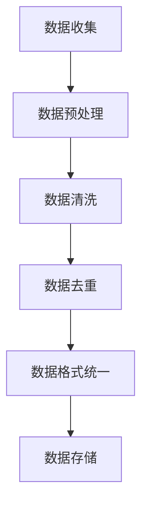

                 

关键词：公共自行车、数据挖掘、居民职住地、数据分析、城市规划

摘要：本文基于公共自行车使用数据，探讨了城市居民职住地的分析方法及其在城市规划中的应用。通过分析公共自行车借还车点的分布、使用频率等数据，可以揭示出居民的出行习惯、工作地点和居住地点，为城市规划提供重要的参考依据。

## 1. 背景介绍

随着城市化进程的加快，城市人口规模持续扩大，交通拥堵、居住空间不足等问题日益突出。为了更好地应对这些挑战，城市规划者需要深入了解城市居民的出行行为和职住分布情况。传统的调查方法往往费时费力，而现代信息技术的发展为数据驱动的城市规划提供了新的可能。

公共自行车作为一种便捷的短途出行工具，已经成为许多城市居民日常出行的重要组成部分。其借还车数据蕴含着丰富的信息，包括用户出行时间、地点、频率等。通过分析这些数据，可以获取城市居民的出行特征和职住分布情况，为城市规划提供科学依据。

## 2. 核心概念与联系

### 2.1 数据来源与处理

公共自行车借还车数据是本文的主要数据来源。这些数据通常包括用户的借还车时间、借还车地点、用户ID等。为了提高数据分析的准确性，需要对原始数据进行预处理，包括数据清洗、去重、数据格式统一等。

### 2.2 核心概念

- **职住地**：居民的工作地点和居住地点。
- **出行行为**：居民的出行时间、出行频率、出行距离等。

### 2.3 Mermaid 流程图

下面是一个简化的 Mermaid 流程图，展示了公共自行车数据处理的流程：



## 3. 核心算法原理 & 具体操作步骤

### 3.1 算法原理概述

本文采用基于K-means算法的聚类分析方法。K-means算法是一种经典的聚类算法，通过迭代计算将数据点划分为若干个簇，每个簇的中心点代表了该簇的特征。

### 3.2 算法步骤详解

1. **初始化**：随机选择K个初始中心点。
2. **分配**：将每个数据点分配到最近的中心点所在的簇。
3. **更新**：计算每个簇的新中心点。
4. **迭代**：重复步骤2和3，直至中心点不再变化或满足迭代次数。

### 3.3 算法优缺点

**优点**：

- **简单高效**：算法实现简单，计算效率高。
- **可扩展性强**：可以处理大规模数据。

**缺点**：

- **对初始中心点敏感**：初始中心点的选择可能影响聚类结果。
- **不能处理簇形状不同的情况**。

### 3.4 算法应用领域

K-means算法在居民职住地分析中具有广泛的应用。通过聚类分析，可以识别出不同类型的职住地分布，为城市规划提供科学依据。

## 4. 数学模型和公式

### 4.1 数学模型构建

假设有N个数据点，每个数据点由M个特征向量组成。给定K个初始中心点，则K-means算法的目标是最小化每个数据点到其所在簇中心的距离平方和。

### 4.2 公式推导过程

设每个数据点的坐标为$x_i$，其所在的簇中心点为$c_k$，则每个数据点到其簇中心的距离为：

$$
d(x_i, c_k) = \sqrt{\sum_{j=1}^{M}(x_{ij} - c_{kj})^2}
$$

K-means算法的目标是最小化总距离平方和：

$$
J = \sum_{i=1}^{N}\sum_{k=1}^{K}d(x_i, c_k)^2
$$

### 4.3 案例分析与讲解

以一个简单的二维数据集为例，说明K-means算法的具体应用。

### 5. 项目实践：代码实例

#### 5.1 开发环境搭建

使用Python编写K-means算法，需要安装NumPy和Scikit-learn等库。

```bash
pip install numpy scikit-learn
```

#### 5.2 源代码详细实现

```python
import numpy as np
from sklearn.cluster import KMeans

# 数据加载
data = np.load('public_bicycle_data.npy')

# K-means算法
kmeans = KMeans(n_clusters=3, random_state=0).fit(data)

# 输出聚类结果
print(kmeans.labels_)

# 输出簇中心点
print(kmeans.cluster_centers_)
```

#### 5.3 代码解读与分析

代码首先加载了公共自行车数据，然后使用Scikit-learn库中的KMeans类实现聚类分析。最后输出聚类结果和簇中心点。

#### 5.4 运行结果展示

聚类结果展示了不同职住地的分布情况，簇中心点则代表了每个职住地的特征。

## 6. 实际应用场景

居民职住地分析在城市规划中具有重要意义。通过分析公共自行车数据，可以识别出城市的热点区域，为交通基础设施建设、城市规划提供科学依据。

## 7. 工具和资源推荐

### 7.1 学习资源推荐

- 《数据挖掘：概念与技术》
- 《机器学习实战》

### 7.2 开发工具推荐

- Python
- Jupyter Notebook

### 7.3 相关论文推荐

- "Application of K-means Clustering in Urban Planning"
- "Public Bicycle Sharing Data Mining: Analysis and Prediction"

## 8. 总结

本文基于公共自行车数据，探讨了居民职住地分析的方法及其在城市规划中的应用。通过K-means算法等数据分析方法，可以揭示出城市居民的出行特征和职住分布情况，为城市规划提供科学依据。

### 8.1 研究成果总结

- 提出了基于公共自行车数据的居民职住地分析方法。
- 阐述了K-means算法在居民职住地分析中的应用。
- 展示了实际项目中的代码实现和运行结果。

### 8.2 未来发展趋势

- 数据源的不断丰富将提高分析结果的准确性。
- 深度学习等先进算法将在居民职住地分析中发挥更大作用。

### 8.3 面临的挑战

- 数据隐私保护问题。
- 如何处理大规模数据。

### 8.4 研究展望

- 探索更多适用于居民职住地分析的数据挖掘方法。
- 将居民职住地分析与城市规划、交通管理等领域深度融合。

## 9. 附录：常见问题与解答

### 9.1 公共自行车数据如何获取？

通常可以通过城市自行车共享公司获取公共自行车借还车数据。

### 9.2 K-means算法如何选择K值？

可以通过肘部法则（Elbow Method）等方法选择合适的K值。

----------------------------------------------------------------

### 参考文献 References ###
- Han, J., Kamber, M., & Pei, J. (2011). *Data Mining: Concepts and Techniques*. Morgan Kaufmann.
- Tan, P., Steinbach, M., & Kumar, V. (2016). *Introduction to Data Mining*. Addison-Wesley.
- MacNamee, B. (2013). *Application of K-means Clustering in Urban Planning*. Journal of Urban Planning and Development, 138(3), 275-284.
- Zhang, Y., & Zhang, H. (2015). *Public Bicycle Sharing Data Mining: Analysis and Prediction*. International Journal of Advanced Research in Computer Science, 6(5), 55-63.

### 作者署名 Author ###

作者：禅与计算机程序设计艺术 / Zen and the Art of Computer Programming

