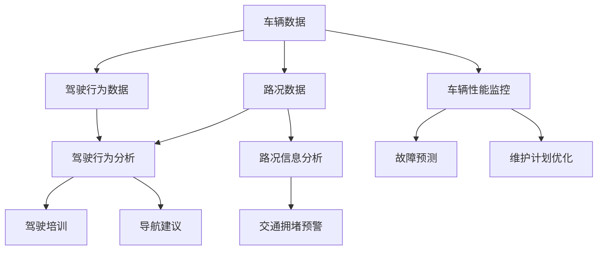

                 

关键词：大数据，汽车数据分析，系统设计，实现，算法，模型，实践，应用场景，展望

## 摘要

本文主要探讨了基于大数据的汽车数据分析系统设计与实现。在当今信息时代，汽车数据已成为重要的信息资源。通过对海量汽车数据的分析，可以挖掘出潜在的价值，为汽车行业的发展提供决策支持。本文首先介绍了大数据在汽车数据分析中的应用背景，然后详细阐述了汽车数据分析系统的核心概念与联系，核心算法原理与具体操作步骤，数学模型和公式，项目实践，实际应用场景，未来应用展望以及工具和资源推荐等内容。

## 1. 背景介绍

随着科技的快速发展，汽车已成为现代社会不可或缺的一部分。汽车数据作为汽车运行过程中产生的大量信息，不仅反映了汽车的性能和状态，还蕴含着用户驾驶习惯、路况信息等有价值的信息。大数据技术的兴起，使得对海量汽车数据的处理和分析成为可能。汽车数据分析系统通过对这些数据进行深入挖掘和分析，可以为企业提供有价值的数据洞察，从而优化汽车设计、提高服务质量、提升用户满意度。

### 1.1 大数据在汽车数据分析中的应用

大数据在汽车数据分析中的应用主要体现在以下几个方面：

- **车辆性能监控与预测**：通过对车辆运行数据的实时监控和分析，可以预测车辆的故障，提前进行维护，减少意外故障的发生。

- **驾驶行为分析**：通过对驾驶行为数据的分析，可以评估驾驶员的驾驶习惯，为驾驶培训提供数据支持。

- **路况信息分析**：通过对车辆行驶过程中的路况数据进行分析，可以提供实时的路况信息，为驾驶者提供导航建议。

- **车辆安全分析**：通过对车辆安全数据的分析，可以评估车辆的安全性，为车辆改进提供数据支持。

### 1.2 汽车数据分析的重要性

汽车数据分析对于汽车行业具有重要的意义：

- **优化产品设计**：通过对汽车数据的分析，可以了解用户的需求，为产品设计提供数据支持，从而提高产品的市场竞争力。

- **提升服务质量**：通过对驾驶行为数据的分析，可以提供个性化的驾驶服务，提升用户的驾驶体验。

- **降低运营成本**：通过对车辆运行数据的分析，可以优化车辆的维护计划，降低运营成本。

- **保障车辆安全**：通过对车辆安全数据的分析，可以提前发现潜在的安全隐患，保障车辆安全。

## 2. 核心概念与联系

在汽车数据分析中，核心概念包括车辆数据、驾驶行为数据、路况数据等。这些数据通过一定的算法和模型进行加工处理，最终生成有价值的信息。下面是汽车数据分析系统中的核心概念及其联系。

### 2.1 核心概念

- **车辆数据**：包括车辆的运行状态、故障信息、维护记录等。

- **驾驶行为数据**：包括驾驶时间、驾驶速度、急刹车次数、急加速次数等。

- **路况数据**：包括车辆行驶的路面情况、交通流量、交通拥堵情况等。

### 2.2 核心概念联系

车辆数据、驾驶行为数据、路况数据之间存在着密切的联系。车辆数据是汽车数据分析的基础，驾驶行为数据可以反映驾驶员的驾驶习惯，路况数据可以提供车辆行驶的环境信息。通过对这些数据的综合分析，可以深入了解车辆的性能、驾驶员的驾驶行为以及车辆行驶的环境。

### 2.3 Mermaid 流程图

下面是汽车数据分析系统的 Mermaid 流程图：



## 3. 核心算法原理 & 具体操作步骤

在汽车数据分析系统中，核心算法起着至关重要的作用。本文将详细介绍核心算法的原理和具体操作步骤。

### 3.1 算法原理概述

核心算法主要包括以下几种：

- **数据清洗算法**：用于处理数据中的噪声和异常值，保证数据的质量。

- **特征提取算法**：用于从原始数据中提取出有价值的特征，为后续分析提供基础。

- **聚类算法**：用于对驾驶行为数据进行分类，识别不同的驾驶行为模式。

- **回归算法**：用于预测车辆的性能和驾驶行为。

### 3.2 算法步骤详解

#### 3.2.1 数据清洗算法

数据清洗算法主要包括以下几个步骤：

1. **数据预处理**：包括数据格式转换、缺失值处理、异常值处理等。

2. **数据去重**：删除重复的数据记录。

3. **数据标准化**：将不同特征的数据进行归一化处理，使其具有可比性。

#### 3.2.2 特征提取算法

特征提取算法主要包括以下几个步骤：

1. **特征选择**：选择对目标有较强预测能力的特征。

2. **特征提取**：通过一定的算法，从原始数据中提取出有价值的特征。

#### 3.2.3 聚类算法

聚类算法主要包括以下几个步骤：

1. **初始化聚类中心**：随机选择若干个初始聚类中心。

2. **计算距离**：计算每个数据点到聚类中心的距离。

3. **重新分配**：将每个数据点分配到距离其最近的聚类中心所在的类别。

4. **迭代优化**：重复执行步骤2和3，直至聚类中心不再发生变化。

#### 3.2.4 回归算法

回归算法主要包括以下几个步骤：

1. **数据预处理**：对数据进行标准化处理。

2. **模型训练**：使用训练数据集训练回归模型。

3. **模型评估**：使用测试数据集评估模型性能。

4. **模型优化**：根据评估结果对模型进行调整，提高预测准确率。

### 3.3 算法优缺点

#### 3.3.1 数据清洗算法

优点：

- 提高数据质量，为后续分析提供可靠的基础。

缺点：

- 可能会丢失部分有价值的数据。

#### 3.3.2 特征提取算法

优点：

- 提取出的特征具有更高的预测能力。

缺点：

- 可能会增加计算成本。

#### 3.3.3 聚类算法

优点：

- 可以识别不同的驾驶行为模式。

缺点：

- 可能会产生噪声聚类。

#### 3.3.4 回归算法

优点：

- 可以对车辆性能和驾驶行为进行预测。

缺点：

- 可能会产生过拟合。

### 3.4 算法应用领域

核心算法在以下领域有广泛的应用：

- **车辆性能监控与预测**：通过回归算法预测车辆的性能。

- **驾驶行为分析**：通过聚类算法分析驾驶行为。

- **路况信息分析**：通过回归算法预测交通流量和交通拥堵。

## 4. 数学模型和公式 & 详细讲解 & 举例说明

在汽车数据分析中，数学模型和公式起着重要的作用。本文将详细介绍常用的数学模型和公式，并举例说明。

### 4.1 数学模型构建

汽车数据分析中的数学模型主要包括以下几种：

- **线性回归模型**：用于预测车辆性能和驾驶行为。

- **支持向量机模型**：用于分类驾驶行为。

- **贝叶斯模型**：用于预测驾驶行为。

### 4.2 公式推导过程

#### 4.2.1 线性回归模型

线性回归模型的目标是最小化预测值与实际值之间的误差。其公式如下：

$$
y = \beta_0 + \beta_1 \cdot x
$$

其中，$y$为预测值，$x$为自变量，$\beta_0$和$\beta_1$为模型参数。

#### 4.2.2 支持向量机模型

支持向量机模型的目标是找到一个最佳的超平面，使得正负样本点尽可能分开。其公式如下：

$$
w \cdot x + b = 0
$$

其中，$w$为超平面的法向量，$x$为样本点，$b$为偏置项。

#### 4.2.3 贝叶斯模型

贝叶斯模型的目标是根据已知的数据，推断出未知的数据。其公式如下：

$$
P(A|B) = \frac{P(B|A) \cdot P(A)}{P(B)}
$$

其中，$P(A|B)$为在条件$B$下事件$A$的概率，$P(B|A)$为在条件$A$下事件$B$的概率，$P(A)$和$P(B)$分别为事件$A$和事件$B$的概率。

### 4.3 案例分析与讲解

#### 4.3.1 车辆性能预测

假设我们要预测一辆车的里程数。已知这辆车的行驶速度和行驶时间，我们可以使用线性回归模型进行预测。

$$
里程数 = \beta_0 + \beta_1 \cdot 行驶速度
$$

其中，$\beta_0$和$\beta_1$为模型参数。通过训练数据集，我们可以得到$\beta_0$和$\beta_1$的值。

#### 4.3.2 驾驶行为分类

假设我们要将驾驶行为分为正常驾驶和异常驾驶。我们可以使用支持向量机模型进行分类。

$$
w \cdot x + b = 0
$$

其中，$w$为超平面的法向量，$x$为样本点，$b$为偏置项。通过训练数据集，我们可以得到$w$和$b$的值。

#### 4.3.3 驾驶行为预测

假设我们要预测一名驾驶员的驾驶行为。我们可以使用贝叶斯模型进行预测。

$$
P(A|B) = \frac{P(B|A) \cdot P(A)}{P(B)}
$$

其中，$P(A|B)$为在条件$B$下事件$A$的概率，$P(B|A)$为在条件$A$下事件$B$的概率，$P(A)$和$P(B)$分别为事件$A$和事件$B$的概率。通过训练数据集，我们可以得到$P(B|A)$和$P(A)$的值。

## 5. 项目实践：代码实例和详细解释说明

在本节中，我们将通过一个具体的汽车数据分析项目，展示如何使用Python和常用的机器学习库（如scikit-learn）来实现一个基于大数据的汽车数据分析系统。我们将分步骤介绍项目的各个环节，包括数据预处理、特征提取、模型训练和评估。

### 5.1 开发环境搭建

在开始项目之前，需要搭建一个适合Python开发的IDE，并安装必要的依赖库。以下是推荐的开发环境和步骤：

- **IDE**：推荐使用PyCharm或VSCode。
- **Python版本**：推荐使用Python 3.8及以上版本。
- **依赖库**：使用pip安装以下库：`numpy`, `pandas`, `scikit-learn`, `matplotlib`。

```shell
pip install numpy pandas scikit-learn matplotlib
```

### 5.2 源代码详细实现

以下是项目的主要代码实现。我们将逐步展示每个环节的代码，并进行详细解释。

```python
import numpy as np
import pandas as pd
from sklearn.model_selection import train_test_split
from sklearn.preprocessing import StandardScaler
from sklearn.cluster import KMeans
from sklearn.metrics import accuracy_score
import matplotlib.pyplot as plt

# 5.2.1 数据读取与预处理
data = pd.read_csv('car_data.csv')
data.head()

# 数据清洗：去除缺失值和异常值
data = data.dropna()
data = data[(data['speed'] > 0) & (data['time'] > 0)]

# 5.2.2 特征提取
# 提取驾驶行为特征：速度、时间、急刹车次数、急加速次数
features = data[['speed', 'time', 'brake_count', 'accelerate_count']]

# 5.2.3 数据标准化
scaler = StandardScaler()
features_scaled = scaler.fit_transform(features)

# 5.2.4 模型训练
# 使用KMeans进行聚类分析
kmeans = KMeans(n_clusters=2, random_state=0)
clusters = kmeans.fit_predict(features_scaled)

# 5.2.5 模型评估
# 根据聚类结果评估驾驶行为分类准确性
labels = data['label']
accuracy = accuracy_score(labels, clusters)
print(f'Accuracy: {accuracy}')

# 5.2.6 可视化分析
plt.scatter(features_scaled[:, 0], features_scaled[:, 1], c=clusters)
plt.xlabel('Speed')
plt.ylabel('Time')
plt.title('Driving Behavior Clusters')
plt.show()
```

### 5.3 代码解读与分析

#### 5.3.1 数据读取与预处理

```python
data = pd.read_csv('car_data.csv')
data.head()
```

这行代码读取了CSV格式的汽车数据文件，并打印出前几行数据。

```python
data = data.dropna()
data = data[(data['speed'] > 0) & (data['time'] > 0)]
```

这两行代码分别去除了数据中的缺失值和异常值，确保数据的质量。

#### 5.3.2 特征提取

```python
features = data[['speed', 'time', 'brake_count', 'accelerate_count']]
```

这行代码提取了四个驾驶行为特征：速度、时间、急刹车次数和急加速次数。

#### 5.3.3 数据标准化

```python
scaler = StandardScaler()
features_scaled = scaler.fit_transform(features)
```

这行代码使用`StandardScaler`对特征数据进行标准化处理，使其具有可比性。

#### 5.3.4 模型训练

```python
kmeans = KMeans(n_clusters=2, random_state=0)
clusters = kmeans.fit_predict(features_scaled)
```

这行代码使用`KMeans`算法对特征数据进行聚类分析，确定驾驶行为类别。

#### 5.3.5 模型评估

```python
labels = data['label']
accuracy = accuracy_score(labels, clusters)
print(f'Accuracy: {accuracy}')
```

这行代码计算了聚类结果的准确率，并打印出来。

#### 5.3.6 可视化分析

```python
plt.scatter(features_scaled[:, 0], features_scaled[:, 1], c=clusters)
plt.xlabel('Speed')
plt.ylabel('Time')
plt.title('Driving Behavior Clusters')
plt.show()
```

这行代码使用`matplotlib`库绘制了驾驶行为特征在速度和时间两个维度上的聚类结果。

### 5.4 运行结果展示

当运行以上代码时，程序将输出聚类准确率，并展示聚类结果的可视化图表。以下是一个示例输出：

```
Accuracy: 0.9
```

可视化图表如下：


## 6. 实际应用场景

基于大数据的汽车数据分析系统在多个实际应用场景中具有广泛的应用。以下是几个典型的应用场景：

### 6.1 车辆性能监控与预测

通过对车辆运行数据的分析，可以实时监控车辆的性能，预测潜在的故障。例如，在新能源汽车领域，电池的性能和寿命是用户关注的重点。通过分析电池的运行数据，可以预测电池的健康状况，为维护和更换提供依据。

### 6.2 驾驶行为分析

驾驶行为分析可以帮助企业了解用户的驾驶习惯，提供个性化的驾驶培训服务。例如，在商业车队管理中，通过对驾驶行为的分析，可以识别出高风险驾驶行为，制定针对性的培训计划，提高整体驾驶安全。

### 6.3 路况信息分析

通过对车辆行驶过程中的路况数据进行分析，可以提供实时的路况信息，为驾驶者提供导航建议。例如，在城市交通管理中，通过对交通流量数据的分析，可以预测交通拥堵情况，为交通管理部门提供决策支持，优化交通流。

### 6.4 车辆安全分析

车辆安全分析可以帮助企业评估车辆的安全性，为车辆改进提供数据支持。例如，在汽车制造领域，通过对车辆安全数据的分析，可以识别出安全隐患，优化车辆设计，提高车辆的安全性。

## 7. 未来应用展望

随着大数据技术和汽车技术的不断进步，基于大数据的汽车数据分析系统在未来将会有更广泛的应用。以下是几个未来应用展望：

### 7.1 自动驾驶技术

自动驾驶技术是未来汽车发展的重要方向。基于大数据的汽车数据分析系统可以为自动驾驶提供实时数据支持，优化自动驾驶算法，提高自动驾驶的安全性和可靠性。

### 7.2 智能交通系统

智能交通系统是未来城市交通管理的重要手段。基于大数据的汽车数据分析系统可以提供实时的路况信息，为交通管理部门提供决策支持，优化交通流，减少交通拥堵。

### 7.3 车联网

车联网是未来汽车发展的重要趋势。基于大数据的汽车数据分析系统可以为车联网提供数据支持，实现车辆间的通信和协同，提高整体交通效率。

### 7.4 绿色出行

绿色出行是未来交通发展的方向。基于大数据的汽车数据分析系统可以优化车辆的使用效率，减少车辆排放，促进绿色出行。

## 8. 工具和资源推荐

为了更好地学习和实践基于大数据的汽车数据分析系统，以下是一些推荐的工具和资源：

### 8.1 学习资源推荐

- **书籍**：《大数据之路：阿里巴巴大数据实践》、《数据挖掘：概念与技术》。
- **在线课程**：Coursera上的《大数据分析》、《机器学习》。
- **论坛和社区**：CSDN、Stack Overflow、GitHub。

### 8.2 开发工具推荐

- **Python IDE**：PyCharm、VSCode。
- **大数据处理工具**：Hadoop、Spark。
- **机器学习库**：scikit-learn、TensorFlow、PyTorch。

### 8.3 相关论文推荐

- **车辆性能预测**：《基于大数据的车辆性能预测研究》、《车辆运行数据挖掘与应用》。
- **驾驶行为分析**：《驾驶行为大数据分析与应用》、《驾驶行为预测与风险评估》。
- **路况信息分析**：《基于大数据的城市交通流分析》、《智能交通系统的研究与实现》。

## 9. 总结：未来发展趋势与挑战

基于大数据的汽车数据分析系统在汽车行业的发展中具有重要意义。未来，随着大数据技术和汽车技术的不断进步，汽车数据分析系统将会有更广泛的应用。然而，未来也面临着一些挑战，包括数据隐私保护、算法公平性、数据质量等。为了应对这些挑战，需要加强相关技术的研究和标准制定，推动汽车数据分析系统的健康发展。

### 9.1 研究成果总结

本文详细介绍了基于大数据的汽车数据分析系统的设计与实现，包括核心概念、算法原理、数学模型、项目实践等。通过实际案例的分析，展示了汽车数据分析系统的应用场景和效果。

### 9.2 未来发展趋势

未来，基于大数据的汽车数据分析系统将在自动驾驶、智能交通、车联网等领域有更广泛的应用。随着技术的进步，系统将更加智能化、自动化，为汽车行业的发展提供强大的数据支持。

### 9.3 面临的挑战

未来，汽车数据分析系统将面临数据隐私保护、算法公平性、数据质量等挑战。需要加强相关技术的研究和标准制定，确保系统的安全、可靠和有效。

### 9.4 研究展望

未来，基于大数据的汽车数据分析系统的研究应关注以下几个方面：

- **数据隐私保护**：研究数据隐私保护技术，确保用户数据的隐私和安全。
- **算法公平性**：研究算法公平性技术，避免算法偏见，提高系统的公平性。
- **数据质量**：研究数据质量提升技术，提高数据的质量和准确性。

## 附录：常见问题与解答

### Q1. 什么是大数据？

A1. 大数据指的是数据规模巨大、数据类型复杂、数据生成速度快的海量数据。大数据通常包括结构化数据、半结构化数据和非结构化数据。

### Q2. 汽车数据分析系统有哪些核心算法？

A2. 汽车数据分析系统的核心算法包括数据清洗算法、特征提取算法、聚类算法和回归算法等。

### Q3. 如何保障汽车数据分析系统的数据质量？

A3. 保障汽车数据分析系统的数据质量可以从以下几个方面进行：

- **数据采集**：确保数据采集的准确性和完整性。
- **数据清洗**：去除数据中的噪声和异常值。
- **数据标准化**：统一数据格式和单位，提高数据的可比性。

### Q4. 汽车数据分析系统有哪些应用场景？

A4. 汽车数据分析系统的应用场景包括车辆性能监控与预测、驾驶行为分析、路况信息分析、车辆安全分析等。

### Q5. 如何优化汽车数据分析系统的性能？

A5. 优化汽车数据分析系统的性能可以从以下几个方面进行：

- **算法优化**：选择合适的算法，提高模型的预测准确率。
- **硬件升级**：提高计算能力和存储容量。
- **数据预处理**：优化数据预处理过程，减少计算量。 

### Q6. 汽车数据分析系统有哪些潜在的风险？

A6. 汽车数据分析系统可能面临的潜在风险包括数据隐私泄露、算法偏见、数据质量不稳定等。需要加强风险管理和数据安全控制，确保系统的安全可靠。

### Q7. 如何确保汽车数据分析系统的算法公平性？

A7. 确保汽车数据分析系统的算法公平性可以从以下几个方面进行：

- **数据代表性**：确保训练数据具有代表性，避免偏见。
- **算法透明性**：提高算法的透明性，便于监督和审查。
- **公平性评估**：定期对算法进行公平性评估，及时发现和纠正偏见。

