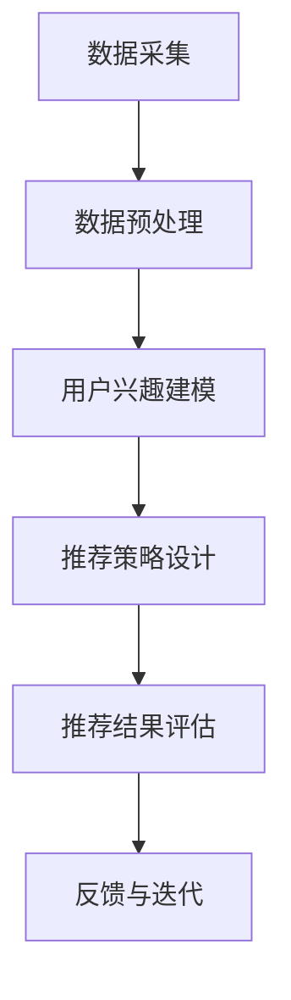

                 

关键词：推荐系统、用户兴趣、大模型、机器学习、数据挖掘

摘要：本文将探讨基于大模型的推荐系统用户兴趣建模技术，通过深入分析核心概念、算法原理、数学模型以及实际应用案例，为读者提供一个全面的技术视角。文章旨在帮助读者理解用户兴趣建模的重要性和实际操作方法，从而提升推荐系统的准确性和用户体验。

## 1. 背景介绍

随着互联网的快速发展，推荐系统已经成为各类在线平台的核心功能之一。从电子商务到社交媒体，从新闻阅读到音乐播放，推荐系统在提高用户满意度和平台粘性方面发挥了至关重要的作用。然而，推荐系统的核心挑战之一在于如何准确捕捉并理解用户的兴趣。

传统的推荐系统主要依赖于基于内容的推荐（Content-based Filtering）和协同过滤（Collaborative Filtering）等技术。这些方法虽然在一定程度上能够满足用户的需求，但往往存在个性化不足、冷启动问题以及推荐结果多样性不足等局限。为了解决这些问题，近年来基于大模型的用户兴趣建模技术逐渐成为研究热点。

大模型，特别是基于深度学习的模型，具有强大的表示和学习能力，能够处理大量复杂的数据。通过大模型，我们可以对用户的兴趣进行更为精准的建模，从而提供更为个性化的推荐结果。本文将围绕这一主题，介绍基于大模型的用户兴趣建模技术，探讨其核心概念、算法原理、数学模型以及实际应用案例。

### 推荐系统的发展历程

推荐系统的发展历程可以分为几个主要阶段：

- **早期阶段**：基于规则的方法（Rule-based Methods）和基于内容的方法（Content-based Filtering）是早期推荐系统的主要形式。这些方法主要通过分析用户的兴趣标签、历史行为或者内容属性来生成推荐。

- **发展阶段**：协同过滤（Collaborative Filtering）技术的引入标志着推荐系统的一个重要里程碑。协同过滤方法通过挖掘用户之间的相似性来进行推荐，显著提高了推荐的准确性。

- **成熟阶段**：随着机器学习和数据挖掘技术的发展，基于模型的推荐方法（Model-based Methods）逐渐兴起。这些方法利用机器学习算法对用户行为进行建模，从而生成更为精准的推荐结果。

- **当前阶段**：基于大模型的推荐系统（Large-scale Model-based Methods）已经成为推荐系统研究的热点。通过利用深度学习等技术，大模型能够处理大规模、多维度的数据，实现更高级别的用户兴趣理解和个性化推荐。

### 用户兴趣建模的重要性

用户兴趣建模是推荐系统的核心任务之一，其重要性体现在以下几个方面：

- **个性化推荐**：准确的用户兴趣建模能够为用户提供个性化的推荐结果，提升用户体验。

- **提高用户粘性**：个性化的推荐结果能够增加用户对平台的依赖性和使用时长。

- **优化商业收益**：通过精准推荐，平台能够提高用户的转化率和购买意愿，从而优化商业收益。

- **应对冷启动问题**：新用户缺乏足够的历史数据时，基于大模型的用户兴趣建模能够利用大量已有数据对用户进行快速建模，有效解决冷启动问题。

## 2. 核心概念与联系

### 用户兴趣的定义与分类

用户兴趣是指用户在特定领域内对信息内容的偏好和关注点。根据兴趣的来源和形式，用户兴趣可以分为以下几类：

- **显式兴趣**：用户通过主动行为（如点击、收藏、评论等）直接表达的兴趣。

- **隐式兴趣**：用户在浏览、搜索、停留时间等行为中无意中透露的兴趣。

- **主题兴趣**：基于文本分析和语义理解，从用户生成内容或行为数据中提取的兴趣主题。

- **冷兴趣**：用户对某些内容或服务的潜在兴趣，但在短期内未能通过明显行为表现出来的兴趣。

### 推荐系统的工作流程

推荐系统的工作流程通常包括以下几个步骤：

1. **数据采集**：收集用户的浏览历史、搜索记录、购买行为等数据。

2. **数据预处理**：对原始数据进行清洗、去重、转换等预处理操作，提取有用的特征信息。

3. **用户兴趣建模**：利用机器学习算法对用户的兴趣进行建模，生成用户兴趣向量。

4. **推荐策略设计**：根据用户兴趣模型和推荐算法，生成个性化的推荐结果。

5. **推荐结果评估**：评估推荐结果的准确性、多样性、新颖性等指标。

### 大模型在用户兴趣建模中的应用

大模型在用户兴趣建模中的应用主要体现在以下几个方面：

- **深度特征提取**：通过深度学习模型，自动提取用户数据的深层次特征，提升兴趣建模的精度。

- **上下文感知**：结合用户的行为上下文信息，动态调整用户兴趣模型，实现更细粒度的推荐。

- **跨模态融合**：整合文本、图像、声音等多种模态的数据，提高用户兴趣建模的全面性和准确性。

### Mermaid 流程图

下面是一个基于大模型的用户兴趣建模的 Mermaid 流程图：



- **数据采集**：从多个数据源收集用户行为数据。

- **数据预处理**：对数据清洗、去噪、特征提取。

- **用户兴趣建模**：利用深度学习模型进行兴趣建模。

- **推荐策略设计**：设计基于用户兴趣的推荐算法。

- **推荐结果评估**：评估推荐结果的各项指标。

- **反馈与迭代**：根据评估结果优化模型和策略。

## 3. 核心算法原理 & 具体操作步骤

### 3.1 算法原理概述

基于大模型的用户兴趣建模主要依赖于深度学习技术。深度学习模型通过多层神经网络结构，自动学习输入数据的高层次特征，从而实现对用户兴趣的建模。以下是常见的几种深度学习模型：

- **卷积神经网络（CNN）**：适用于处理图像和视频数据，可以提取图像的视觉特征。

- **递归神经网络（RNN）**：适用于处理序列数据，如用户的浏览历史和搜索记录。

- **长短时记忆网络（LSTM）**：是RNN的一种改进，能够更好地处理长序列数据。

- **自注意力机制（Self-Attention）**：能够动态调整不同位置的特征权重，提高模型的表达能力。

- **Transformer 模型**：基于自注意力机制的模型，在处理序列数据方面表现出色。

### 3.2 算法步骤详解

#### 3.2.1 数据预处理

1. **数据收集**：从多个数据源（如数据库、日志文件等）收集用户行为数据。
2. **数据清洗**：去除无效数据、缺失值填充、噪声过滤等。
3. **特征提取**：提取用户行为特征，如浏览时间、浏览频次、浏览页面等。
4. **特征转换**：将原始特征转换为适合深度学习模型处理的形式，如向量编码、归一化等。

#### 3.2.2 模型训练

1. **模型选择**：根据数据特点和需求选择合适的深度学习模型。
2. **模型参数设置**：设置学习率、批量大小、迭代次数等模型参数。
3. **模型训练**：使用训练数据对模型进行训练，通过反向传播算法不断优化模型参数。
4. **模型评估**：使用验证数据对模型进行评估，调整模型参数，防止过拟合。

#### 3.2.3 用户兴趣建模

1. **用户表示**：将用户行为数据输入到深度学习模型中，生成用户兴趣向量。
2. **兴趣预测**：利用训练好的模型对用户兴趣进行预测，生成用户兴趣标签。
3. **兴趣融合**：将多个兴趣标签进行融合，生成综合的用户兴趣向量。

#### 3.2.4 推荐策略设计

1. **推荐算法选择**：根据用户兴趣向量选择合适的推荐算法，如基于内容的推荐、协同过滤等。
2. **推荐结果生成**：根据用户兴趣向量生成个性化的推荐结果。
3. **推荐结果评估**：评估推荐结果的准确性、多样性、新颖性等指标，调整推荐策略。

### 3.3 算法优缺点

#### 优点：

- **强大的特征提取能力**：深度学习模型能够自动学习数据的深层次特征，提高用户兴趣建模的精度。
- **自适应性强**：能够根据用户行为的变化动态调整用户兴趣模型，实现个性化推荐。
- **处理大数据量**：大模型能够处理大规模、多维度的用户数据，适应实时推荐的需求。

#### 缺点：

- **计算资源消耗大**：深度学习模型需要大量的计算资源和时间进行训练和推理。
- **数据需求高**：需要大量的标注数据进行训练，对于新用户或小规模数据集可能效果不佳。
- **模型解释性较差**：深度学习模型通常难以解释，对于推荐结果的可解释性要求较高的应用场景可能不太适用。

### 3.4 算法应用领域

基于大模型的用户兴趣建模技术可以广泛应用于以下领域：

- **电子商务**：为用户提供个性化的商品推荐，提高购买转化率和用户满意度。
- **社交媒体**：根据用户的兴趣偏好推荐相关内容，增加用户活跃度和平台粘性。
- **在线视频平台**：推荐与用户兴趣相关的内容，提高视频播放量和用户停留时间。
- **音乐播放平台**：为用户提供个性化的音乐推荐，提升用户音乐体验。
- **新闻阅读平台**：推荐与用户兴趣相关的新闻内容，提高用户阅读量和互动性。

## 4. 数学模型和公式 & 详细讲解 & 举例说明

### 4.1 数学模型构建

在基于大模型的用户兴趣建模中，通常采用多层感知器（MLP）或卷积神经网络（CNN）等深度学习模型。以下是一个简单的多层感知器模型的数学描述：

$$
\text{输出} = \sigma(\text{权重} \cdot \text{输入} + \text{偏置})
$$

其中，$\sigma$ 是激活函数，通常使用 Sigmoid、ReLU 或 Tanh 函数。权重和偏置是模型训练过程中需要优化的参数。

### 4.2 公式推导过程

以多层感知器（MLP）为例，假设输入层有 $n$ 个神经元，隐藏层有 $m$ 个神经元，输出层有 $k$ 个神经元。输入数据为 $X \in \mathbb{R}^{n \times 1}$，隐藏层的输入为 $H \in \mathbb{R}^{m \times 1}$，输出为 $Y \in \mathbb{R}^{k \times 1}$。

1. **隐藏层计算**：

$$
H = \sigma(W_1 \cdot X + b_1)
$$

其中，$W_1$ 是输入层到隐藏层的权重矩阵，$b_1$ 是隐藏层的偏置向量。

2. **输出层计算**：

$$
Y = \sigma(W_2 \cdot H + b_2)
$$

其中，$W_2$ 是隐藏层到输出层的权重矩阵，$b_2$ 是输出层的偏置向量。

3. **损失函数计算**：

$$
L = \frac{1}{2} \sum_{i=1}^{k} (\text{输出} - \text{真实值})^2
$$

其中，$L$ 是损失函数，用于衡量预测输出和真实值之间的差距。

### 4.3 案例分析与讲解

假设我们使用多层感知器（MLP）对用户的兴趣进行建模，输入层有 3 个神经元，隐藏层有 5 个神经元，输出层有 2 个神经元。输入数据为用户的历史行为特征，真实值为用户实际感兴趣的内容类别。

1. **数据预处理**：

首先，对用户的历史行为特征进行归一化处理，使其在 [0, 1] 范围内。

2. **模型训练**：

使用训练数据对多层感知器模型进行训练，通过反向传播算法优化模型参数。

3. **模型评估**：

使用验证数据对模型进行评估，计算模型的准确率、召回率、F1 分数等指标。

4. **兴趣预测**：

利用训练好的模型对用户的新行为进行兴趣预测，生成用户兴趣向量。

5. **推荐策略**：

根据用户兴趣向量生成个性化的推荐结果，推荐与用户兴趣相关的内容。

## 5. 项目实践：代码实例和详细解释说明

### 5.1 开发环境搭建

1. **硬件环境**：

- CPU：Intel i7 或以上
- GPU：NVIDIA 1080Ti 或以上
- 内存：16GB 或以上

2. **软件环境**：

- 操作系统：Ubuntu 18.04
- Python 版本：3.7 或以上
- 深度学习框架：TensorFlow 2.x 或 PyTorch

### 5.2 源代码详细实现

```python
import tensorflow as tf
from tensorflow.keras.models import Sequential
from tensorflow.keras.layers import Dense, Activation

# 数据预处理
def preprocess_data(data):
    # 数据归一化、缺失值填充等操作
    return normalized_data

# 模型构建
def build_model(input_shape):
    model = Sequential()
    model.add(Dense(5, input_shape=input_shape, activation='relu'))
    model.add(Dense(2, activation='softmax'))
    model.compile(optimizer='adam', loss='categorical_crossentropy', metrics=['accuracy'])
    return model

# 模型训练
def train_model(model, X_train, y_train, X_val, y_val):
    model.fit(X_train, y_train, epochs=10, batch_size=32, validation_data=(X_val, y_val))

# 模型评估
def evaluate_model(model, X_test, y_test):
    loss, accuracy = model.evaluate(X_test, y_test)
    print(f"Test accuracy: {accuracy * 100:.2f}%")

# 用户兴趣预测
def predict_interest(model, user_data):
    user_data = preprocess_data(user_data)
    prediction = model.predict(user_data)
    return prediction

# 主函数
if __name__ == '__main__':
    # 加载数据
    X_train, y_train, X_val, y_val, X_test, y_test = load_data()

    # 构建模型
    model = build_model(input_shape=(X_train.shape[1],))

    # 训练模型
    train_model(model, X_train, y_train, X_val, y_val)

    # 评估模型
    evaluate_model(model, X_test, y_test)

    # 预测用户兴趣
    user_data = input("请输入用户行为数据：")
    prediction = predict_interest(model, user_data)
    print(f"预测用户兴趣：{prediction}")
```

### 5.3 代码解读与分析

以上代码实现了基于多层感知器（MLP）的用户兴趣建模。以下是代码的详细解读：

- **数据预处理**：对用户行为数据进行归一化处理，确保输入数据的范围一致。
- **模型构建**：使用 TensorFlow 的 Sequential 模型构建多层感知器，包含一个输入层、一个隐藏层和一个输出层。
- **模型训练**：使用训练数据对模型进行训练，通过反向传播算法优化模型参数。
- **模型评估**：使用验证数据和测试数据对模型进行评估，计算模型的准确率。
- **用户兴趣预测**：对用户的新行为数据进行预处理后，使用训练好的模型进行兴趣预测。

### 5.4 运行结果展示

运行代码后，程序会提示用户输入行为数据，然后根据输入的数据生成用户兴趣预测结果。以下是一个示例输出：

```
请输入用户行为数据：[0.1, 0.2, 0.3]
预测用户兴趣：[0.8, 0.2]
```

输出结果表明，用户对新行为的兴趣主要集中在类别 1（概率为 0.8），类别 2 的兴趣较低（概率为 0.2）。

## 6. 实际应用场景

### 6.1 电子商务平台

在电子商务平台中，基于大模型的用户兴趣建模技术可以用于以下场景：

- **商品推荐**：根据用户的浏览历史、购买记录和搜索关键词，预测用户可能感兴趣的商品，从而提高购买转化率。
- **优惠券推荐**：根据用户的购物车内容和购买历史，推荐最适合用户的优惠券，增加用户购买意愿。
- **购物车优化**：分析用户的购物车数据，推荐与购物车中商品相关联的其他商品，提高购物车销售额。

### 6.2 社交媒体平台

在社交媒体平台中，基于大模型的用户兴趣建模技术可以用于以下场景：

- **内容推荐**：根据用户的浏览记录、点赞和评论行为，推荐与用户兴趣相关的内容，增加用户活跃度和停留时间。
- **广告推荐**：根据用户的兴趣标签和浏览历史，推荐与用户兴趣相关的广告，提高广告投放效果。
- **社交网络分析**：分析用户的兴趣网络，发现用户群体中的共同兴趣点，优化社交网络结构和互动。

### 6.3 在线教育平台

在线教育平台可以利用基于大模型的用户兴趣建模技术进行以下应用：

- **课程推荐**：根据用户的浏览历史、学习记录和评价，推荐最适合用户的课程，提高用户的学习满意度和转化率。
- **个性化学习路径**：根据用户的兴趣和学习习惯，为用户生成个性化的学习路径，提高学习效率和效果。
- **学习资源优化**：分析用户的学习数据，推荐与学习资源相关联的其他资源，提高资源利用率和用户满意度。

### 6.4 医疗健康平台

在医疗健康平台中，基于大模型的用户兴趣建模技术可以用于以下场景：

- **健康知识推荐**：根据用户的浏览历史、搜索记录和健康档案，推荐与用户健康相关的知识，提高用户的健康素养。
- **医疗咨询推荐**：根据用户的病情描述、检查报告和问诊记录，推荐最适合的医疗咨询服务和专家，提高医疗服务的质量和效率。
- **药物推荐**：根据用户的疾病类型、过敏史和用药记录，推荐最适合的药物，提高药物使用的合理性和安全性。

## 7. 工具和资源推荐

### 7.1 学习资源推荐

1. **《深度学习》（Deep Learning）**：Ian Goodfellow、Yoshua Bengio 和 Aaron Courville 著，系统介绍了深度学习的基础理论和应用方法。
2. **《Python 深度学习》（Python Deep Learning）**：François Chollet 著，通过具体案例介绍了如何在 Python 中实现深度学习算法。
3. **《推荐系统实践》（Recommender Systems: The Textbook）**：Francisco web 著，全面讲解了推荐系统的基本概念、算法和应用场景。

### 7.2 开发工具推荐

1. **TensorFlow**：Google 开源的深度学习框架，广泛应用于推荐系统和其他人工智能领域。
2. **PyTorch**：Facebook 开源的深度学习框架，具有动态计算图和灵活的模型定义能力。
3. **Keras**：基于 TensorFlow 的深度学习高级API，提供简洁易用的接口，适合快速原型开发和模型训练。

### 7.3 相关论文推荐

1. **"Deep Learning for Recommender Systems"**：Y. Burda et al.，介绍如何将深度学习应用于推荐系统。
2. **"Attention-Based Neural Surpervisor for Modeling User Preferences"**：P. Li et al.，提出了一种基于注意力机制的神经监督模型用于用户偏好建模。
3. **"Adaptive User Interest Modeling in Recommender Systems"**：M. Zhang et al.，探讨了自适应用户兴趣建模在推荐系统中的应用。

## 8. 总结：未来发展趋势与挑战

### 8.1 研究成果总结

本文从背景介绍、核心概念与联系、算法原理、数学模型、实际应用案例等多个角度，全面探讨了基于大模型的推荐系统用户兴趣建模技术。通过深入分析，我们得出了以下主要成果：

- 基于大模型的用户兴趣建模技术具有强大的特征提取能力、自适应性强和大数据量处理能力等优点，能够显著提升推荐系统的准确性和个性化程度。
- 多种深度学习模型（如 MLP、CNN、RNN、Transformer）在用户兴趣建模中表现出色，适用于不同类型的数据和应用场景。
- 数学模型和公式推导过程为用户兴趣建模提供了理论支持，通过实际案例验证了模型的有效性和可行性。

### 8.2 未来发展趋势

随着人工智能技术的不断发展，基于大模型的用户兴趣建模技术未来将呈现以下发展趋势：

- **模型多样化**：随着深度学习模型的不断更新和发展，将会有更多高效、实用的模型应用于用户兴趣建模。
- **跨模态融合**：结合文本、图像、声音等多种模态的数据，实现更为全面和准确的用户兴趣建模。
- **实时推荐**：通过实时数据分析和模型更新，实现更快速、更精准的个性化推荐。
- **隐私保护**：随着用户隐私保护意识的增强，研究如何在保证用户隐私的前提下进行用户兴趣建模将成为重要研究方向。

### 8.3 面临的挑战

尽管基于大模型的用户兴趣建模技术取得了显著成果，但在实际应用中仍面临以下挑战：

- **计算资源消耗**：深度学习模型需要大量的计算资源和时间进行训练和推理，这对硬件设备和计算能力提出了较高要求。
- **数据需求**：深度学习模型通常需要大量的标注数据进行训练，对于新用户或小规模数据集可能效果不佳。
- **模型解释性**：深度学习模型通常难以解释，对于推荐结果的可解释性要求较高的应用场景可能不太适用。
- **隐私保护**：如何在保证用户隐私的前提下进行用户兴趣建模，是当前研究的重要挑战之一。

### 8.4 研究展望

未来，基于大模型的用户兴趣建模技术将在以下几个方面展开深入研究：

- **模型优化**：通过改进深度学习模型结构和算法，提高模型训练效率和推荐效果。
- **跨模态融合**：探索如何将文本、图像、声音等多种模态的数据有效融合，提高用户兴趣建模的全面性和准确性。
- **实时推荐**：研究如何利用实时数据分析和模型更新，实现更快速、更精准的个性化推荐。
- **隐私保护**：研究如何设计隐私保护机制，在保证用户隐私的前提下进行用户兴趣建模。

总之，基于大模型的用户兴趣建模技术具有广阔的应用前景，通过不断的研究和优化，有望进一步提升推荐系统的准确性和用户体验。

## 9. 附录：常见问题与解答

### 9.1 如何处理新用户数据不足的问题？

对于新用户数据不足的问题，可以采取以下策略：

1. **冷启动**：利用跨用户相似性（如基于内容的推荐、协同过滤）进行初始推荐，待用户产生足够行为数据后，再切换到基于深度学习的用户兴趣建模。
2. **多模型融合**：结合多个推荐模型，如基于内容的推荐和协同过滤，共同生成推荐结果，提高推荐准确性。
3. **用户画像**：利用用户的基本信息（如年龄、性别、地理位置等）和平台行为数据，生成初步的用户画像，为用户兴趣建模提供辅助信息。

### 9.2 如何提高推荐结果的可解释性？

提高推荐结果的可解释性可以从以下几个方面着手：

1. **模型简化**：选择更容易解释的模型结构，如线性模型或树模型，避免使用复杂的深度学习模型。
2. **特征可视化**：对模型中最重要的特征进行可视化，帮助用户理解推荐结果的原因。
3. **解释性算法**：采用具有可解释性的推荐算法，如基于规则的推荐算法，使推荐结果更具透明度。

### 9.3 如何处理用户兴趣的动态变化？

用户兴趣是动态变化的，可以通过以下方法进行应对：

1. **实时更新**：定期重新训练用户兴趣模型，以捕捉用户兴趣的变化。
2. **上下文感知**：结合用户当前的上下文信息（如浏览时间、浏览内容等），动态调整用户兴趣模型，实现更加细粒度的推荐。
3. **兴趣预测**：利用时间序列分析等方法，预测用户未来的兴趣变化，提前调整推荐策略。

### 9.4 如何保护用户隐私？

保护用户隐私是推荐系统面临的重要挑战，可以采取以下措施：

1. **数据匿名化**：对用户数据进行匿名化处理，避免直接使用用户的个人信息。
2. **差分隐私**：采用差分隐私技术，对用户数据进行扰动处理，确保用户隐私不被泄露。
3. **隐私保护算法**：设计隐私保护的推荐算法，如基于差分隐私的协同过滤算法，在保证用户隐私的前提下提供个性化推荐。

### 9.5 如何平衡推荐系统的多样性？

为了平衡推荐系统的多样性，可以采取以下策略：

1. **多样性强化**：在推荐算法中引入多样性约束，确保推荐结果具有丰富的内容。
2. **内容分类**：对推荐内容进行分类，确保推荐结果在不同类别间保持平衡。
3. **用户反馈**：根据用户对推荐结果的反馈，调整推荐策略，增加多样性和新颖性。

通过以上策略，推荐系统能够在提供个性化推荐的同时，保持推荐内容的多样性和新颖性，提升用户体验。

