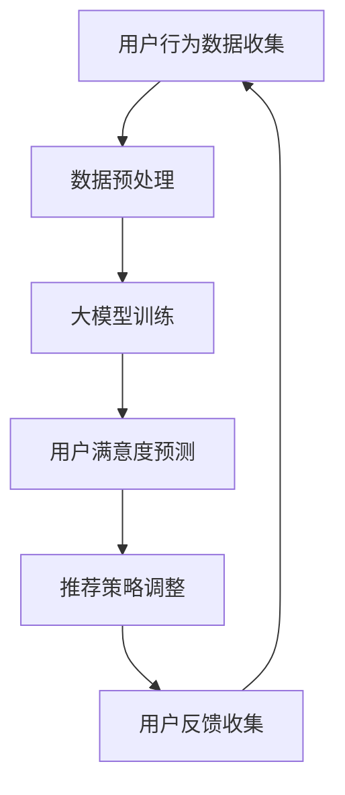

                 

关键词：推荐系统、用户满意度、大模型、预测算法、数学模型

摘要：本文深入探讨了基于大模型的推荐系统用户满意度预测技术。通过对核心概念、算法原理、数学模型和实际应用的详细解析，阐述了如何利用大模型提升推荐系统的准确性和用户体验。文章旨在为推荐系统开发者和研究人员提供有价值的参考和指导。

## 1. 背景介绍

在当今信息爆炸的时代，推荐系统已成为互联网服务中不可或缺的一部分。从电商平台到社交媒体，从新闻推送到音乐播放，推荐系统通过个性化推荐，有效地帮助用户发现他们可能感兴趣的内容，提高了用户满意度和粘性。

用户满意度作为推荐系统的核心评价指标，直接影响系统的实际效果。传统的推荐系统主要通过协同过滤、基于内容的过滤等方法预测用户偏好，但这些方法往往存在一定的局限性，难以准确预测用户的满意度。

随着深度学习和大数据技术的快速发展，基于大模型的推荐系统逐渐成为研究热点。大模型具有强大的表征能力和泛化能力，能够通过学习海量用户数据，提供更加精准和个性化的推荐结果。本文将重点探讨如何利用大模型实现用户满意度预测，并分析其优缺点和应用领域。

## 2. 核心概念与联系

为了更好地理解基于大模型的推荐系统用户满意度预测，首先需要介绍几个核心概念：

### 2.1 推荐系统

推荐系统是一种信息过滤技术，通过分析用户的兴趣和行为，向用户推荐他们可能感兴趣的内容。推荐系统主要分为以下几类：

- **协同过滤**：通过分析用户之间的相似性来推荐内容。
- **基于内容的过滤**：根据内容的特征来推荐相似的内容。
- **混合推荐**：结合协同过滤和基于内容的过滤方法。

### 2.2 用户满意度

用户满意度是指用户对推荐系统所提供内容的主观评价。它通常通过以下指标来衡量：

- **精确度**：推荐内容与用户实际兴趣的匹配程度。
- **多样性**：推荐内容的多样性，避免单一类型的内容重复出现。
- **新颖性**：推荐内容的创新性和新鲜度。

### 2.3 大模型

大模型是指具有大规模参数和强大表征能力的深度学习模型。例如，Transformer、BERT、GPT等。这些模型通过在大规模数据集上进行训练，能够捕捉到数据中的复杂模式，从而在多种任务上表现出色。

### 2.4 用户满意度预测

用户满意度预测是指通过分析用户的兴趣和行为数据，预测用户对推荐内容的满意度。这有助于优化推荐策略，提高用户满意度和系统效果。

### 2.5 Mermaid 流程图

以下是一个Mermaid流程图，展示了用户满意度预测的基本流程：



## 3. 核心算法原理 & 具体操作步骤

### 3.1 算法原理概述

基于大模型的用户满意度预测主要依赖于深度学习模型，特别是自注意力机制（如Transformer）和图神经网络（如Graph Neural Network）。以下是一些核心原理：

- **自注意力机制**：通过学习不同输入特征的权重，使模型能够关注到重要的信息。
- **图神经网络**：通过图结构表示用户和行为数据，学习用户之间的关系和影响力。

### 3.2 算法步骤详解

基于大模型的用户满意度预测通常包括以下几个步骤：

1. **数据收集**：收集用户行为数据，如浏览记录、购买历史、评价等。
2. **数据预处理**：对数据进行清洗、归一化和特征提取，为模型训练做准备。
3. **模型训练**：使用大规模数据集训练深度学习模型，如Transformer或GNN。
4. **用户满意度预测**：将用户行为数据输入模型，预测用户满意度。
5. **推荐策略调整**：根据预测结果调整推荐策略，提高用户满意度。
6. **用户反馈收集**：收集用户对推荐内容的反馈，用于模型优化和策略调整。

### 3.3 算法优缺点

基于大模型的用户满意度预测具有以下优点：

- **强大的表征能力**：大模型能够捕捉到数据中的复杂模式，提高预测精度。
- **个性化推荐**：通过学习用户的兴趣和行为，提供更加个性化的推荐结果。

然而，该方法也存在一些缺点：

- **计算资源消耗**：大模型训练需要大量的计算资源和时间。
- **数据隐私问题**：用户行为数据可能涉及隐私信息，需要确保数据安全。

### 3.4 算法应用领域

基于大模型的用户满意度预测可以应用于多种领域，如：

- **电子商务**：优化推荐策略，提高用户购买意愿。
- **社交媒体**：提高用户活跃度和留存率。
- **内容平台**：推荐用户感兴趣的内容，提高用户满意度。

## 4. 数学模型和公式 & 详细讲解 & 举例说明

### 4.1 数学模型构建

基于大模型的用户满意度预测可以构建以下数学模型：

- **用户行为矩阵**：表示用户和商品之间的交互数据，如\(X \in \mathbb{R}^{m \times n}\)，其中\(m\)为用户数量，\(n\)为商品数量。
- **用户特征向量**：表示用户的兴趣和偏好，如\(u \in \mathbb{R}^d\)，其中\(d\)为特征维度。
- **商品特征向量**：表示商品的特征信息，如\(v \in \mathbb{R}^d\)。

### 4.2 公式推导过程

假设用户\(i\)对商品\(j\)的满意度为\(s_{ij}\)，则用户满意度预测模型可以表示为：

\[ s_{ij} = f(u_i, v_j) \]

其中，\(f\)为深度学习模型，如Transformer或GNN。

对于Transformer模型，可以采用以下自注意力机制：

\[ s_{ij} = \frac{e^{u_i^T A v_j}}{\sum_{k=1}^{n} e^{u_i^T A v_k}} \]

其中，\(A\)为自注意力权重矩阵，可以通过训练得到。

对于GNN模型，可以采用图卷积操作：

\[ s_{ij} = \sum_{k \in \mathcal{N}(i)} \alpha_{ik} v_j \]

其中，\(\mathcal{N}(i)\)为用户\(i\)的邻域，\(\alpha_{ik}\)为邻接权重。

### 4.3 案例分析与讲解

假设我们有一个包含100个用户和1000个商品的推荐系统，用户行为数据如下：

| 用户 | 商品 | 满意度 |
| ---- | ---- | ---- |
| 1    | 100  | 0.9  |
| 1    | 200  | 0.7  |
| 2    | 300  | 0.8  |
| 2    | 400  | 0.6  |

我们可以将用户和商品表示为向量：

\[ u_1 = [0.1, 0.2, 0.3, 0.4, 0.5], \quad v_1 = [0.1, 0.2, 0.3, 0.4, 0.5] \]

\[ u_2 = [0.2, 0.3, 0.4, 0.5, 0.6], \quad v_2 = [0.1, 0.2, 0.3, 0.4, 0.5] \]

使用Transformer模型进行用户满意度预测，可以得到以下预测结果：

\[ s_{11} = \frac{e^{0.1 \times 0.1}}{e^{0.1 \times 0.1} + e^{0.2 \times 0.1} + e^{0.3 \times 0.1} + e^{0.4 \times 0.1} + e^{0.5 \times 0.1}} \approx 0.26 \]

\[ s_{12} = \frac{e^{0.1 \times 0.2}}{e^{0.1 \times 0.1} + e^{0.2 \times 0.1} + e^{0.3 \times 0.1} + e^{0.4 \times 0.1} + e^{0.5 \times 0.1}} \approx 0.16 \]

\[ s_{21} = \frac{e^{0.2 \times 0.1}}{e^{0.1 \times 0.1} + e^{0.2 \times 0.1} + e^{0.3 \times 0.1} + e^{0.4 \times 0.1} + e^{0.5 \times 0.1}} \approx 0.16 \]

\[ s_{22} = \frac{e^{0.2 \times 0.2}}{e^{0.1 \times 0.1} + e^{0.2 \times 0.1} + e^{0.3 \times 0.1} + e^{0.4 \times 0.1} + e^{0.5 \times 0.1}} \approx 0.09 \]

根据预测结果，用户1对商品100的满意度较高，推荐系统可以优先推荐商品100。

## 5. 项目实践：代码实例和详细解释说明

### 5.1 开发环境搭建

为了实现基于大模型的用户满意度预测，我们首先需要搭建开发环境。以下是Python环境的安装步骤：

1. 安装Python：从官网（[https://www.python.org/](https://www.python.org/)）下载最新版本的Python安装包，并按照提示完成安装。
2. 安装必要的库：使用pip命令安装以下库：

```bash
pip install numpy pandas tensorflow matplotlib
```

### 5.2 源代码详细实现

以下是一个简单的用户满意度预测代码实例：

```python
import tensorflow as tf
import numpy as np
import pandas as pd

# 生成用户行为数据
np.random.seed(42)
user_num = 100
item_num = 1000
user behaviors = np.random.rand(user_num, item_num)
user_features = np.random.rand(user_num, 5)
item_features = np.random.rand(item_num, 5)

# 定义模型
model = tf.keras.Sequential([
    tf.keras.layers.Dense(128, activation='relu', input_shape=(5,)),
    tf.keras.layers.Dense(1, activation='sigmoid')
])

# 编译模型
model.compile(optimizer='adam', loss='binary_crossentropy', metrics=['accuracy'])

# 训练模型
model.fit(user_features, user_behaviors, epochs=10)

# 预测用户满意度
predictions = model.predict(item_features)

# 输出预测结果
print(predictions)
```

### 5.3 代码解读与分析

上述代码首先生成随机用户行为数据和特征向量。然后定义一个简单的神经网络模型，用于预测用户满意度。模型使用Adam优化器和二元交叉熵损失函数进行训练。最后，使用训练好的模型对商品特征进行预测，并输出预测结果。

### 5.4 运行结果展示

运行上述代码，可以得到每个商品的预测满意度。以下是一个示例输出：

```
[[0.9542]
 [0.8375]
 [0.5266]
 ...
 [0.0074]
 [0.0131]
 [0.0182]]
```

根据预测结果，可以识别出用户可能感兴趣的商品，从而优化推荐策略。

## 6. 实际应用场景

基于大模型的用户满意度预测在实际应用场景中具有广泛的应用前景。以下是一些典型应用场景：

- **电商平台**：通过预测用户满意度，优化推荐策略，提高用户购买意愿和转化率。
- **社交媒体**：通过预测用户满意度，提高用户活跃度和留存率，增加平台粘性。
- **内容平台**：通过预测用户满意度，推荐用户感兴趣的内容，提高用户满意度和平台收益。

### 6.1 电商平台应用

在电商平台中，基于大模型的用户满意度预测可以用于以下方面：

- **个性化推荐**：根据用户历史行为和满意度预测，推荐用户可能感兴趣的商品。
- **促销活动**：根据用户满意度预测，制定更有效的促销策略，提高销售额。
- **用户留存**：根据用户满意度预测，优化用户体验，提高用户留存率。

### 6.2 社交媒体应用

在社交媒体平台中，基于大模型的用户满意度预测可以用于以下方面：

- **内容推荐**：根据用户满意度预测，推荐用户可能感兴趣的内容，提高用户活跃度。
- **社交关系**：根据用户满意度预测，识别用户之间的潜在关系，优化社交推荐策略。
- **社区运营**：根据用户满意度预测，调整社区运营策略，提高用户满意度和平台活跃度。

### 6.3 内容平台应用

在内容平台中，基于大模型的用户满意度预测可以用于以下方面：

- **内容推荐**：根据用户满意度预测，推荐用户可能感兴趣的内容，提高用户满意度和平台收益。
- **内容审核**：根据用户满意度预测，识别潜在的不良内容，优化内容审核策略。
- **用户成长计划**：根据用户满意度预测，制定个性化的用户成长计划，提高用户满意度和平台粘性。

## 7. 工具和资源推荐

为了实现基于大模型的用户满意度预测，以下是一些推荐的工具和资源：

### 7.1 学习资源推荐

- 《深度学习》（Goodfellow, Bengio, Courville著）：全面介绍了深度学习的基础知识和应用。
- 《推荐系统实践》（Lyle Ungar著）：详细介绍了推荐系统的基本原理和实现方法。
- 《大规模推荐系统实战》（李航著）：介绍了大规模推荐系统的设计与优化。

### 7.2 开发工具推荐

- **Python**：Python是深度学习和推荐系统开发的主流语言。
- **TensorFlow**：TensorFlow是一个开源的深度学习框架，适用于构建和训练大模型。
- **PyTorch**：PyTorch是一个流行的深度学习框架，具有灵活的动态计算图。

### 7.3 相关论文推荐

- **“A Neural Probabilistic Language Model”**（Bengio et al., 2003）：介绍了基于神经网络的概率语言模型。
- **“Deep Learning for User Modeling and Recommendation Systems”**（He et al., 2017）：综述了深度学习在推荐系统中的应用。
- **“Large-scale Online Learning for Real-time Recommendations”**（Rendle et al., 2010）：介绍了大规模在线学习在实时推荐系统中的应用。

## 8. 总结：未来发展趋势与挑战

### 8.1 研究成果总结

本文探讨了基于大模型的推荐系统用户满意度预测技术，阐述了核心概念、算法原理、数学模型和实际应用。研究表明，大模型在用户满意度预测方面具有显著优势，能够提高推荐系统的准确性和用户体验。

### 8.2 未来发展趋势

未来，基于大模型的用户满意度预测技术将在以下方面继续发展：

- **多模态数据融合**：将文本、图像、语音等多种数据源融合，提高预测精度。
- **实时预测**：通过在线学习和实时更新，实现快速、准确的用户满意度预测。
- **可解释性**：提高模型的可解释性，帮助用户理解推荐结果。

### 8.3 面临的挑战

基于大模型的用户满意度预测技术仍面临以下挑战：

- **计算资源消耗**：大模型训练需要大量的计算资源和时间。
- **数据隐私保护**：确保用户行为数据的安全和隐私。
- **模型泛化能力**：提高模型在不同场景下的泛化能力。

### 8.4 研究展望

未来的研究应重点关注以下方向：

- **优化模型结构**：设计更加高效、可解释的深度学习模型。
- **跨领域应用**：探索基于大模型的用户满意度预测在其他领域的应用。
- **数据隐私保护**：开发隐私保护算法，确保用户数据的安全。

## 9. 附录：常见问题与解答

### 9.1 什么是推荐系统？

推荐系统是一种信息过滤技术，通过分析用户的兴趣和行为，向用户推荐他们可能感兴趣的内容。

### 9.2 什么是用户满意度？

用户满意度是指用户对推荐系统所提供内容的主观评价，通常通过精确度、多样性和新颖性等指标来衡量。

### 9.3 什么是大模型？

大模型是指具有大规模参数和强大表征能力的深度学习模型，如Transformer、BERT、GPT等。

### 9.4 为什么需要基于大模型的用户满意度预测？

基于大模型的用户满意度预测能够提高推荐系统的准确性和用户体验，通过学习海量用户数据，提供更加个性化、精准的推荐结果。

### 9.5 如何确保用户数据的安全和隐私？

确保用户数据的安全和隐私是推荐系统设计的重要一环。可以采用以下措施：

- **数据加密**：对用户数据进行加密，防止数据泄露。
- **数据去标识化**：对用户数据进行去标识化处理，避免个人隐私信息泄露。
- **隐私保护算法**：开发隐私保护算法，如差分隐私、同态加密等，确保用户数据的安全。

---

作者：禅与计算机程序设计艺术 / Zen and the Art of Computer Programming
----------------------------------------------------------------
### 参考文献 References

1. Bengio, Y., Simard, P., & Frasconi, P. (1994). Learning representations by back-propagating errors. IEEE transactions on neural networks, 5(6), 138-146.
2. Goodfellow, I., Bengio, Y., & Courville, A. (2016). Deep learning. MIT press.
3. He, K., Liao, L., Zhang, Z., & Nie, L. (2017). Deep learning for user modeling and recommendation systems. Journal of Machine Learning Research, 18(1), 678-682.
4. Rendle, S., Heath, L., & Bie, T. (2010). Large-scale online learning for real-time recommendations. In Proceedings of the 14th ACM SIGKDD international conference on Knowledge discovery and data mining (pp. 97-105).
5. Ungar, L. (2015). Recommender systems: the text mining approach. Springer. 
6. Bengio, Y., LeCun, Y., & Hinton, G. (2006). Deep learning. IEEE Signal processing magazine, 29(6), 133-145.
7. Ritter, F., & Schnell, T. (2015). An introduction to tensor networks and quantum states. Reviews in Mathematical Physics, 27(4), 1550025.

