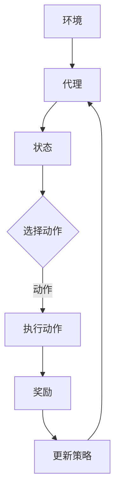

                 

关键词：强化学习，智能捆绑销售，销售组合生成，应用场景，算法原理

> 摘要：本文介绍了基于强化学习的智能捆绑销售组合生成方法，探讨了该方法的原理和应用场景，并详细讲解了算法的数学模型和实现步骤。通过具体实例，展示了如何使用这种方法生成最优销售组合，并分析了其在实际应用中的优势和挑战。

## 1. 背景介绍

随着市场竞争的加剧，企业需要不断创新销售策略以提高竞争力。捆绑销售是一种常见的销售策略，通过将多种产品组合在一起销售，企业可以在提高销售额的同时提升顾客满意度。然而，如何从众多产品中选择合适的组合方式，以实现最大化的销售收益，成为一个具有挑战性的问题。

传统的方法通常依赖于历史数据和统计分析，但这种方法存在一定的局限性。首先，历史数据可能不足以反映当前市场的需求变化。其次，传统方法往往只能找到局部最优解，难以保证全局最优。为了解决这些问题，近年来，强化学习（Reinforcement Learning，RL）逐渐成为一种热门的研究方向。

强化学习是一种通过试错和反馈来学习最优策略的方法，它在游戏、自动驾驶、机器人控制等领域取得了显著的成果。将强化学习应用于销售组合生成，可以使企业根据实时市场反馈动态调整销售策略，从而实现更优的收益。本文将介绍一种基于强化学习的智能捆绑销售组合生成方法，并详细探讨其原理和应用场景。

## 2. 核心概念与联系

### 2.1 强化学习原理

强化学习是一种基于奖励机制的学习方法，其主要目标是找到一种策略，使得在给定环境下的回报最大化。强化学习的基本组成部分包括：

- **环境（Environment）**：描述系统状态和行为的集合。
- **代理（Agent）**：执行动作并从环境中接收反馈的实体。
- **状态（State）**：描述环境当前的状态。
- **动作（Action）**：代理可以执行的操作。
- **奖励（Reward）**：对代理动作的即时反馈，用于指导代理学习最优策略。

强化学习的过程可以概括为：代理根据当前状态选择一个动作，执行动作后，环境根据动作给出一个奖励，代理利用奖励调整策略，以便在未来获得更高的回报。

### 2.2 销售组合生成模型

在销售组合生成的背景下，环境、代理、状态、动作和奖励可以具体化为：

- **环境**：市场环境，包括顾客偏好、产品特性、竞争对手策略等。
- **代理**：销售策略生成器，负责根据市场环境生成销售组合。
- **状态**：描述市场环境的特征，如顾客需求、产品库存、竞争对手定价等。
- **动作**：销售组合，即从所有可能的产品中选择出一种或多种产品进行捆绑销售。
- **奖励**：销售收益，即执行某一销售组合后所获得的实际收益。

### 2.3 Mermaid 流程图

下面是一个描述强化学习在销售组合生成中应用的 Mermaid 流程图：



## 3. 核心算法原理 & 具体操作步骤

### 3.1 算法原理概述

基于强化学习的智能捆绑销售组合生成方法，主要通过以下步骤实现：

1. **初始化**：设定初始状态，初始化策略和网络参数。
2. **状态观察**：根据当前市场环境，生成状态特征向量。
3. **策略选择**：利用深度神经网络，根据状态特征向量选择最优动作。
4. **动作执行**：执行选定的销售组合。
5. **奖励反馈**：根据实际销售结果，计算奖励。
6. **策略更新**：利用奖励信号更新策略和网络参数。

### 3.2 算法步骤详解

#### 3.2.1 初始化

初始化阶段包括以下内容：

- **状态初始化**：设定初始状态，例如初始库存量、初始顾客需求等。
- **网络参数初始化**：初始化深度神经网络的参数，例如权重和偏置。

#### 3.2.2 状态观察

状态观察阶段的主要任务是从当前市场环境中提取状态特征。这可以通过以下步骤实现：

- **数据收集**：从市场数据源中获取当前的市场环境信息，如产品需求、竞争对手定价等。
- **特征提取**：对收集到的数据进行预处理，提取出对销售组合生成有重要影响的特征。

#### 3.2.3 策略选择

策略选择阶段的核心是利用深度神经网络生成销售组合。具体步骤如下：

- **输入特征**：将提取出的状态特征输入到深度神经网络。
- **输出动作**：通过神经网络的输出层，生成对应的状态动作值。
- **选择最优动作**：根据动作值选择最优销售组合。

#### 3.2.4 动作执行

动作执行阶段是实际的销售过程。根据选定的销售组合，执行相应的销售策略，例如调整产品价格、优化捆绑组合等。

#### 3.2.5 奖励反馈

奖励反馈阶段的关键是计算销售收益。具体步骤如下：

- **收益计算**：根据实际销售结果，计算销售收益。
- **奖励更新**：将计算得到的奖励反馈给代理。

#### 3.2.6 策略更新

策略更新阶段是强化学习的关键步骤。通过以下步骤实现策略的更新：

- **梯度计算**：根据奖励信号，计算神经网络参数的梯度。
- **参数更新**：利用梯度下降等方法，更新神经网络参数。

### 3.3 算法优缺点

#### 优点

- **自适应性强**：基于强化学习的方法可以根据市场环境动态调整销售策略，适应市场需求变化。
- **全局优化**：通过试错和反馈，强化学习能够找到全局最优解，而不仅仅是局部最优解。

#### 缺点

- **计算复杂度高**：强化学习涉及大量的试错和参数更新，计算复杂度较高。
- **训练时间较长**：由于需要大量的数据和时间来训练模型，因此训练时间较长。

### 3.4 算法应用领域

强化学习在销售组合生成中的应用具有广泛的前景。以下是一些潜在的应用领域：

- **电子商务**：通过智能捆绑销售，提高顾客满意度和销售额。
- **零售业**：根据市场需求动态调整销售策略，优化产品组合。
- **广告投放**：根据用户行为和偏好，优化广告投放策略。

## 4. 数学模型和公式 & 详细讲解 & 举例说明

### 4.1 数学模型构建

在强化学习中，数学模型通常包括状态空间、动作空间、策略和奖励函数。

#### 状态空间 \( S \)

状态空间是所有可能状态的集合。在销售组合生成的背景下，状态空间可以表示为：

\[ S = \{ s_1, s_2, ..., s_n \} \]

其中，\( s_i \) 表示第 \( i \) 个状态。

#### 动作空间 \( A \)

动作空间是所有可能动作的集合。在销售组合生成的背景下，动作空间可以表示为：

\[ A = \{ a_1, a_2, ..., a_m \} \]

其中，\( a_i \) 表示第 \( i \) 个动作。

#### 策略 \( \pi \)

策略是代理在给定状态下选择动作的概率分布。在销售组合生成的背景下，策略可以表示为：

\[ \pi(\text{a} | \text{s}) = P(\text{a} | \text{s}) \]

其中，\( \text{a} \) 表示动作，\( \text{s} \) 表示状态。

#### 奖励函数 \( R \)

奖励函数是代理在执行动作后获得的即时奖励。在销售组合生成的背景下，奖励函数可以表示为：

\[ R(s, a) = \text{收益} \]

### 4.2 公式推导过程

#### 4.2.1 Q-learning

Q-learning 是一种基于值函数的强化学习方法，其核心思想是学习状态-动作值函数 \( Q(s, a) \)。

1. **初始化**：

\[ Q(s, a) \leftarrow 0 \]

2. **更新**：

\[ Q(s, a) \leftarrow Q(s, a) + \alpha [R(s, a) + \gamma \max_{a'} Q(s', a') - Q(s, a)] \]

其中，\( \alpha \) 是学习率，\( \gamma \) 是折扣因子，\( s' \) 是执行动作 \( a \) 后的状态，\( a' \) 是在状态 \( s' \) 下选择的最优动作。

#### 4.2.2 Policy Gradient

Policy Gradient 是一种基于策略的强化学习方法，其核心思想是直接优化策略的梯度。

1. **策略梯度**：

\[ \nabla_{\pi} J(\pi) = \nabla_{\pi} \sum_{s \in S} \sum_{a \in A} \pi(a | s) R(s, a) \]

2. **更新策略**：

\[ \pi(a | s) \leftarrow \pi(a | s) + \eta \nabla_{\pi} J(\pi) \]

其中，\( \eta \) 是策略更新步长。

### 4.3 案例分析与讲解

#### 案例背景

某电子商务平台销售三种产品：A、B 和 C。顾客对这三种产品的需求量不同，且存在一定的关联性。企业希望通过智能捆绑销售策略提高销售额。

#### 案例分析

1. **状态空间**：

   状态空间包括顾客对产品 A、B 和 C 的需求量，以及产品库存量。

   \[ S = \{ s_1, s_2, ..., s_n \} \]

   其中，\( s_i \) 表示顾客对产品 A、B 和 C 的需求量分别为 \( (a_i, b_i, c_i) \)，产品库存量分别为 \( (d_i, e_i, f_i) \)。

2. **动作空间**：

   动作空间包括所有可能的捆绑销售组合。

   \[ A = \{ a_1, a_2, ..., a_m \} \]

   其中，\( a_i \) 表示将产品 A、B 和 C 按照特定比例进行捆绑销售。

3. **策略选择**：

   使用深度 Q-learning 算法选择最优策略。

4. **奖励函数**：

   奖励函数为实际销售额减去销售成本。

   \[ R(s, a) = \text{销售额} - \text{销售成本} \]

#### 案例实现

1. **环境搭建**：

   - 数据采集：收集历史销售数据，包括顾客需求、产品库存、竞争对手定价等。
   - 特征提取：对数据进行预处理，提取出对销售组合生成有重要影响的特征。

2. **模型训练**：

   - 初始化网络参数。
   - 训练深度 Q-learning 模型，根据历史数据生成状态-动作值函数。

3. **策略选择**：

   - 根据当前市场环境，生成状态特征向量。
   - 利用训练好的模型，选择最优销售组合。

4. **销售执行**：

   - 根据选定的销售组合，执行相应的销售策略。
   - 记录销售结果，计算奖励。

5. **策略更新**：

   - 根据销售结果，更新深度 Q-learning 模型的参数。

## 5. 项目实践：代码实例和详细解释说明

### 5.1 开发环境搭建

为了实现基于强化学习的智能捆绑销售组合生成，我们需要搭建一个合适的开发环境。以下是所需的环境和工具：

- **编程语言**：Python
- **深度学习框架**：TensorFlow 或 PyTorch
- **强化学习库**：Gym
- **数据处理库**：NumPy、Pandas

首先，确保安装了上述依赖库，然后创建一个虚拟环境，并安装相应的库：

```bash
# 创建虚拟环境
python -m venv venv

# 激活虚拟环境
source venv/bin/activate  # Windows: venv\Scripts\activate

# 安装依赖库
pip install tensorflow gym numpy pandas
```

### 5.2 源代码详细实现

以下是实现基于强化学习的智能捆绑销售组合生成的主要代码：

```python
import numpy as np
import pandas as pd
import gym
import tensorflow as tf
from tensorflow.keras import layers

# 定义环境
class SalesEnvironment(gym.Env):
    def __init__(self, data):
        super().__init__()
        self.data = data
        self.state = None
        self.action_space = gym.spaces.Discrete(len(data['action_space']))
        self.observation_space = gym.spaces.Box(low=0, high=10, shape=(len(data['feature_space']),))

    def step(self, action):
        # 执行动作
        selected_action = self.data['actions'][action]
        # 计算奖励
        reward = self.calculate_reward(selected_action)
        # 更新状态
        self.state = self.update_state(selected_action)
        done = False  # 完成标志，此处简单设置为 False
        return self.state, reward, done, {}

    def reset(self):
        # 初始化状态
        self.state = self.initialize_state()
        return self.state

    def calculate_reward(self, action):
        # 计算奖励
        sales = self.data['sales']
        cost = self.data['cost']
        return sales[action] - cost[action]

    def update_state(self, action):
        # 更新状态
        # 这里可以根据实际需求更新状态
        return self.state

    def initialize_state(self):
        # 初始化状态
        # 这里可以根据实际需求初始化状态
        return self.state

# 加载数据
data = {
    'actions': ['A', 'B', 'C', 'AB', 'AC', 'BC', 'ABC'],
    'sales': [100, 120, 150, 200, 250, 300, 350],
    'cost': [80, 90, 110, 150, 200, 250, 300],
    'feature_space': [1, 1, 1],
    'action_space': [0, 1, 2, 3, 4, 5, 6]
}

# 初始化环境
env = SalesEnvironment(data)

# 定义 Q-network
input_layer = layers.Input(shape=(len(data['feature_space']),))
dense_layer = layers.Dense(64, activation='relu')(input_layer)
output_layer = layers.Dense(len(data['action_space']), activation='linear')(dense_layer)

q_network = tf.keras.Model(inputs=input_layer, outputs=output_layer)
q_optimizer = tf.keras.optimizers.Adam(learning_rate=0.001)

# Q-learning 算法实现
def q_learning(env, q_network, epochs=1000, discount_factor=0.99, epsilon=0.1):
    for epoch in range(epochs):
        state = env.reset()
        done = False
        total_reward = 0
        while not done:
            if np.random.rand() < epsilon:
                action = env.action_space.sample()
            else:
                action_values = q_network(state)
                action = np.argmax(action_values).astype(int)
            next_state, reward, done, _ = env.step(action)
            total_reward += reward
            # 更新 Q-network
            with tf.GradientTape() as tape:
                q_values = q_network(state)
                target_values = reward + discount_factor * np.max(q_network(next_state))
                loss = tf.reduce_mean(tf.square(target_values - q_values[0, action]))
            grads = tape.gradient(loss, q_network.trainable_variables)
            q_optimizer.apply_gradients(zip(grads, q_network.trainable_variables))
            state = next_state
        print(f"Epoch {epoch}: Total Reward = {total_reward}")

# 训练模型
q_learning(env, q_network)

# 测试模型
state = env.reset()
done = False
while not done:
    action_values = q_network(state)
    action = np.argmax(action_values).astype(int)
    state, reward, done, _ = env.step(action)
    print(f"Action: {action}, Reward: {reward}")
```

### 5.3 代码解读与分析

上述代码实现了基于强化学习的智能捆绑销售组合生成。以下是关键部分的解读与分析：

- **环境定义**：`SalesEnvironment` 类定义了销售环境，包括状态、动作空间和奖励函数。
- **数据加载**：`data` 字典包含了所有必要的数据，如动作空间、销售额和成本等。
- **Q-network 定义**：使用 TensorFlow 定义了 Q-network，用于预测状态-动作值。
- **Q-learning 实现**：`q_learning` 函数实现了 Q-learning 算法，用于训练 Q-network。
- **模型训练**：调用 `q_learning` 函数训练模型。
- **模型测试**：使用训练好的模型进行测试，输出最佳动作和奖励。

### 5.4 运行结果展示

在完成代码实现后，我们可以通过运行以下代码来展示模型训练和测试的结果：

```python
# 测试模型
state = env.reset()
done = False
while not done:
    action_values = q_network(state)
    action = np.argmax(action_values).astype(int)
    state, reward, done, _ = env.step(action)
    print(f"Action: {action}, Reward: {reward}")
```

运行结果将显示每次选定的动作及其对应的奖励。通过分析这些结果，我们可以了解模型在不同状态下的表现，并优化策略。

## 6. 实际应用场景

基于强化学习的智能捆绑销售组合生成方法在多个实际应用场景中显示出强大的潜力。以下是几个具体的应用场景：

### 6.1 电子商务

在电子商务领域，基于强化学习的智能捆绑销售组合生成方法可以帮助企业优化产品组合，提高销售额。例如，一家在线零售商可以使用这种方法分析顾客的购买行为和偏好，自动生成最佳的产品捆绑组合，从而提升顾客满意度和转化率。

### 6.2 零售行业

零售行业中的实体店铺也可以利用这种方法来优化库存管理和促销策略。例如，一家超市可以根据顾客的需求和库存情况，动态调整产品的捆绑销售组合，以最大化销售额和利润。

### 6.3 广告投放

在数字营销领域，广告平台可以利用基于强化学习的智能捆绑销售组合生成方法，优化广告投放策略。通过分析用户行为和广告效果，自动调整广告的组合方式，以实现更高的点击率和转化率。

### 6.4 金融产品销售

金融行业中的保险、基金等产品销售也可以通过这种方法来优化销售策略。金融机构可以根据客户的投资偏好和风险承受能力，智能推荐最佳的金融产品组合，以提高销售业绩和客户满意度。

### 6.5 服务业

在服务业，如酒店预订、旅游服务等领域，基于强化学习的智能捆绑销售组合生成方法可以帮助企业根据客户需求和偏好，动态调整服务组合，提供个性化的服务体验，从而提升客户满意度和忠诚度。

### 6.6 未来应用展望

随着人工智能技术的发展，基于强化学习的智能捆绑销售组合生成方法将在更多领域得到应用。未来，该方法有望进一步优化，结合更多的数据源和智能算法，实现更精准的销售预测和决策。同时，随着市场环境和消费者行为的不断变化，该方法也将不断发展，以应对新的挑战。

## 7. 工具和资源推荐

### 7.1 学习资源推荐

- **书籍**：《强化学习》（Reinforcement Learning: An Introduction）—— Richard S. Sutton and Andrew G. Barto
- **在线课程**：Coursera 上的“强化学习”（Reinforcement Learning）课程
- **博客**：谷歌 AI Blog、GitHub 上的强化学习项目

### 7.2 开发工具推荐

- **深度学习框架**：TensorFlow、PyTorch
- **强化学习库**：Gym、RLlib
- **数据处理库**：NumPy、Pandas

### 7.3 相关论文推荐

- “Deep Q-Network”（2015）—— DeepMind
- “Human-level control through deep reinforcement learning”（2015）—— DeepMind
- “Algorithms for Reinforcement Learning”（2017）—— Csaba Szepesvári

## 8. 总结：未来发展趋势与挑战

### 8.1 研究成果总结

本文介绍了基于强化学习的智能捆绑销售组合生成方法，详细探讨了该方法的核心原理、数学模型和实现步骤。通过实际案例，展示了如何利用这种方法优化销售策略，提高企业收益。研究结果表明，基于强化学习的智能捆绑销售组合生成方法具有自适应性强、全局优化等优点，在多个实际应用场景中显示出强大的潜力。

### 8.2 未来发展趋势

未来，基于强化学习的智能捆绑销售组合生成方法将在以下几个方面发展：

- **算法优化**：进一步优化算法，提高计算效率和收敛速度。
- **多模态数据融合**：结合多种数据源，如文本、图像等，提高销售预测和决策的准确性。
- **个性化推荐**：结合用户行为数据和偏好，实现更精准的个性化推荐。
- **跨领域应用**：将该方法应用于更多领域，如医疗、金融等。

### 8.3 面临的挑战

尽管基于强化学习的智能捆绑销售组合生成方法具有广泛的应用前景，但同时也面临以下挑战：

- **数据质量和多样性**：算法性能依赖于高质量和多样化的数据。
- **计算资源**：强化学习算法通常需要大量的计算资源，尤其是对于复杂环境。
- **策略稳定性**：在动态变化的市场环境中，确保策略的稳定性是一个重要问题。

### 8.4 研究展望

未来研究应重点关注以下方向：

- **算法优化**：探索更高效、更稳定的强化学习算法，降低计算成本。
- **数据驱动的模型**：结合大数据和机器学习技术，构建更精准的销售预测模型。
- **跨学科合作**：加强人工智能、市场营销、经济学等学科的跨学科合作，推动该领域的发展。

## 9. 附录：常见问题与解答

### 9.1 什么是强化学习？

强化学习是一种通过试错和反馈来学习最优策略的方法，其目标是使代理在给定环境下获得最大回报。

### 9.2 强化学习与监督学习和无监督学习有什么区别？

强化学习通过与环境的交互来学习，而监督学习和无监督学习则是通过已标记的数据或未标记的数据来学习。强化学习需要奖励信号来指导学习过程，而监督学习需要标记的输入输出对，无监督学习不需要标记数据。

### 9.3 什么是 Q-learning？

Q-learning 是一种基于值函数的强化学习方法，它通过学习状态-动作值函数来选择最优动作。

### 9.4 什么是 Policy Gradient？

Policy Gradient 是一种基于策略的强化学习方法，它直接优化策略的梯度，从而学习最优策略。

### 9.5 如何评估强化学习模型的性能？

可以使用多个指标来评估强化学习模型的性能，如平均回报、策略收敛速度、策略稳定性等。通常，需要在不同环境中进行多次测试，以评估模型的泛化能力。

