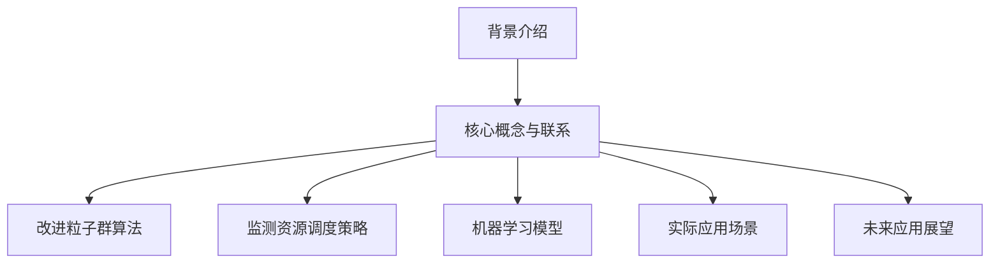

                 

关键词：改进粒子群算法、监测资源调度、机器学习、木材缺陷识别、算法应用

摘要：随着工业生产的不断发展，如何提高生产效率、降低成本、提高产品质量已成为各行业关注的焦点。本文提出了一种基于改进粒子群算法的监测资源调度基于机器学习的木材缺陷识别方法。通过改进粒子群算法，优化监测资源调度策略，并结合机器学习技术，提高木材缺陷识别的准确性。本文首先介绍了背景和核心概念，然后详细阐述了算法原理和具体操作步骤，通过数学模型和公式推导，分析了算法的应用领域，并给出实际项目实践和代码实例。最后，本文探讨了该方法的实际应用场景和未来展望，并提出了可能面临的挑战和研究展望。

## 1. 背景介绍

木材缺陷识别在木材加工行业中具有重要意义。木材缺陷不仅会影响木材的物理和力学性能，还会影响最终产品的质量和外观。传统的木材缺陷识别方法主要依赖于人工经验和视觉检查，存在效率低、准确度不高、劳动强度大等问题。随着计算机技术和人工智能的快速发展，基于机器学习的木材缺陷识别方法逐渐成为一种新的趋势。这种方法利用大量已有缺陷样本数据，通过构建合适的机器学习模型，实现对木材缺陷的自动识别。

监测资源调度是工业生产中另一个关键问题。在木材加工过程中，各种监测设备如红外线传感器、超声波传感器等需要定期进行校准和维护，以保证监测数据的准确性和可靠性。然而，如何合理调度这些资源，以最大化监测效率，同时最小化成本，是一个具有挑战性的问题。

本文旨在通过改进粒子群算法优化监测资源调度策略，并结合机器学习技术，提出一种高效、准确的木材缺陷识别方法，为木材加工行业提供技术支持。

### 1.1 监测资源调度的重要性

监测资源调度在工业生产中具有重要作用。首先，合理的监测资源调度可以最大化监测效率。例如，在木材加工过程中，不同类型的木材缺陷可能存在于不同的木材部位，通过合理的资源调度，可以确保缺陷检测设备能够优先检测缺陷较多的木材部位，提高检测效率。

其次，合理的监测资源调度可以最小化成本。如果监测资源调度不合理，可能会导致某些监测设备长时间闲置，而另一些设备则过于繁忙，这不仅会降低监测效率，还会增加维护成本。通过优化监测资源调度策略，可以确保所有监测设备都能够充分利用，从而降低成本。

### 1.2 木材缺陷识别的挑战

木材缺陷识别面临一系列挑战。首先，木材缺陷种类繁多，包括木节、裂纹、腐朽等，不同缺陷具有不同的特征，如何构建一个能够同时识别多种缺陷的模型是一个难题。

其次，木材缺陷识别数据通常具有高维性和非线性特征，这给传统的机器学习算法带来了很大的挑战。如何有效地提取和利用这些特征，以提高识别准确性，是另一个重要问题。

### 1.3 改进粒子群算法在监测资源调度中的应用

粒子群优化（Particle Swarm Optimization，PSO）是一种基于群体智能的优化算法，具有简单、高效、全局搜索能力强等特点。然而，传统的PSO算法在处理高维搜索问题时，容易陷入局部最优。针对这一问题，本文提出了一种改进的粒子群算法，通过引入自适应权重调整机制和全局搜索策略，提高算法的全局搜索能力和收敛速度。

### 1.4 结合机器学习技术的木材缺陷识别方法

机器学习技术在木材缺陷识别中具有广泛应用。本文采用了一种基于支持向量机（Support Vector Machine，SVM）的识别方法。SVM是一种有效的分类算法，能够将高维特征空间中的数据线性可分。通过训练SVM模型，可以将木材缺陷数据分为正常木材和缺陷木材两类。

## 2. 核心概念与联系

### 2.1 改进粒子群算法

粒子群优化算法是一种基于群体智能的优化算法，其基本原理是模拟鸟群觅食行为。在粒子群算法中，每个粒子代表一个潜在解，粒子在搜索空间中飞行，通过跟踪个体最优解（pBest）和全局最优解（gBest）来更新位置和速度。然而，传统的PSO算法在处理高维搜索问题时，容易陷入局部最优。为解决这一问题，本文提出了以下改进措施：

- **自适应权重调整机制**：通过引入自适应权重调整机制，根据粒子的飞行状态动态调整权重，从而提高算法的全局搜索能力和收敛速度。
- **全局搜索策略**：在粒子更新位置和速度时，引入全局搜索策略，使粒子在一定程度上跳脱局部最优，提高全局搜索能力。

### 2.2 监测资源调度策略

监测资源调度策略是本文研究的核心。通过改进粒子群算法，优化监测资源调度策略，以最大化监测效率和最小化成本。具体策略如下：

- **优先级调度**：根据木材部位缺陷概率，为监测资源分配优先级，优先调度到缺陷概率较高的木材部位。
- **动态调度**：根据实时监测数据，动态调整监测资源的分配，确保监测资源能够充分利用。

### 2.3 机器学习模型

机器学习模型是木材缺陷识别的关键。本文采用了一种基于支持向量机（SVM）的识别方法。SVM是一种有效的分类算法，能够将高维特征空间中的数据线性可分。通过训练SVM模型，可以将木材缺陷数据分为正常木材和缺陷木材两类。具体流程如下：

- **数据预处理**：对采集到的木材缺陷数据进行分析，提取特征，并进行归一化处理。
- **模型训练**：使用训练数据集训练SVM模型，获取模型参数。
- **模型评估**：使用测试数据集对训练好的SVM模型进行评估，计算识别准确率。

### 2.4 Mermaid 流程图

以下是一个简化的Mermaid流程图，用于展示核心概念和联系：



## 3. 核心算法原理 & 具体操作步骤

### 3.1 算法原理概述

改进粒子群算法是基于传统粒子群优化（PSO）算法的一种改进算法。传统PSO算法通过模拟鸟群觅食行为，每个粒子代表一个潜在解，粒子在搜索空间中飞行，通过跟踪个体最优解（pBest）和全局最优解（gBest）来更新位置和速度。改进的PSO算法在传统算法的基础上，引入了自适应权重调整机制和全局搜索策略，以提高全局搜索能力和收敛速度。

### 3.2 算法步骤详解

改进粒子群算法的具体步骤如下：

1. **初始化粒子群**：设置粒子的位置和速度，初始化个体最优解（pBest）和全局最优解（gBest）。
2. **计算目标函数**：对于每个粒子，计算其在当前位置的目标函数值，更新个体最优解（pBest）。
3. **更新全局最优解**：比较所有粒子的个体最优解，更新全局最优解（gBest）。
4. **更新粒子位置和速度**：根据个体最优解（pBest）和全局最优解（gBest），更新粒子的位置和速度。
5. **自适应权重调整**：根据粒子的飞行状态，动态调整权重，以提高全局搜索能力和收敛速度。
6. **全局搜索策略**：引入全局搜索策略，使粒子在一定程度上跳脱局部最优。
7. **终止条件**：判断是否满足终止条件，如达到最大迭代次数或目标函数收敛，否则返回步骤2。

### 3.3 算法优缺点

**优点**：

- **简单易实现**：改进粒子群算法相对于其他优化算法，如遗传算法等，具有更简单的实现过程。
- **全局搜索能力强**：通过引入自适应权重调整机制和全局搜索策略，提高了算法的全局搜索能力。
- **收敛速度快**：改进算法在收敛速度上相对传统PSO算法有显著提升。

**缺点**：

- **参数敏感**：改进粒子群算法的参数设置较为敏感，需要根据具体问题调整参数，以获得最佳效果。
- **计算复杂度高**：在处理高维搜索问题时，计算复杂度较高，可能影响算法的运行效率。

### 3.4 算法应用领域

改进粒子群算法在多个领域具有广泛应用，如：

- **资源调度**：用于优化监测资源调度策略，提高监测效率和降低成本。
- **图像处理**：用于图像增强、图像分割等图像处理任务。
- **优化设计**：用于结构优化、参数优化等优化设计问题。
- **神经网络训练**：用于神经网络的训练和优化，提高神经网络的学习效果。

## 4. 数学模型和公式 & 详细讲解 & 举例说明

### 4.1 数学模型构建

改进粒子群算法的数学模型主要包括目标函数、位置更新公式和速度更新公式。

**目标函数**：

目标函数用于评估粒子的适应度，通常选择最小化问题。对于监测资源调度问题，目标函数可以定义为：

\[ f(x) = \sum_{i=1}^{n} w_i \cdot t_i \]

其中，\( w_i \)为第i个木材部位的权重，\( t_i \)为第i个木材部位被监测的时间。

**位置更新公式**：

位置更新公式用于更新粒子的位置。改进粒子群算法引入了自适应权重调整机制和全局搜索策略，位置更新公式如下：

\[ x_{new} = x_{old} + v_{old} + \omega \cdot (pBest - x_{old}) + \phi \cdot (gBest - x_{old}) \]

其中，\( x_{old} \)为粒子的当前位置，\( x_{new} \)为粒子的更新位置，\( v_{old} \)为粒子的速度，\( \omega \)为惯性权重，\( pBest \)为粒子的个体最优解，\( gBest \)为全局最优解，\( \phi \)为加速系数。

**速度更新公式**：

速度更新公式用于更新粒子的速度。改进粒子群算法引入了自适应权重调整机制，速度更新公式如下：

\[ v_{new} = v_{old} + \omega \cdot (pBest - x_{old}) + \phi \cdot (gBest - x_{old}) \]

其中，\( v_{old} \)为粒子的当前速度，\( v_{new} \)为粒子的更新速度，其他符号与位置更新公式相同。

### 4.2 公式推导过程

以下是改进粒子群算法公式的推导过程：

1. **目标函数**：

   对于监测资源调度问题，目标函数可以定义为最小化监测时间。假设有n个木材部位，每个木材部位的权重分别为\( w_1, w_2, ..., w_n \)，每个木材部位被监测的时间分别为\( t_1, t_2, ..., t_n \)，则目标函数为：

   \[ f(x) = \sum_{i=1}^{n} w_i \cdot t_i \]

2. **位置更新公式**：

   根据粒子群优化算法的基本原理，粒子的位置更新公式可以表示为：

   \[ x_{new} = x_{old} + v_{old} \]

   其中，\( x_{old} \)为粒子的当前位置，\( x_{new} \)为粒子的更新位置，\( v_{old} \)为粒子的速度。

   为了引入自适应权重调整机制和全局搜索策略，将位置更新公式扩展为：

   \[ x_{new} = x_{old} + \omega \cdot (pBest - x_{old}) + \phi \cdot (gBest - x_{old}) \]

   其中，\( \omega \)为惯性权重，\( pBest \)为粒子的个体最优解，\( gBest \)为全局最优解，\( \phi \)为加速系数。

3. **速度更新公式**：

   粒子的速度更新公式可以表示为：

   \[ v_{new} = v_{old} \]

   其中，\( v_{old} \)为粒子的当前速度，\( v_{new} \)为粒子的更新速度。

   为了引入自适应权重调整机制，将速度更新公式扩展为：

   \[ v_{new} = v_{old} + \omega \cdot (pBest - x_{old}) + \phi \cdot (gBest - x_{old}) \]

   其中，\( \omega \)为惯性权重，\( pBest \)为粒子的个体最优解，\( gBest \)为全局最优解，\( \phi \)为加速系数。

### 4.3 案例分析与讲解

以下是一个具体的案例，用于说明改进粒子群算法在监测资源调度中的应用。

假设有5个木材部位，分别编号为1、2、3、4、5，每个木材部位的权重和被监测的时间如下表所示：

| 部件编号 | 权重 \( w_i \) | 被监测时间 \( t_i \) |
| -------- | ------------ | ---------------- |
| 1        | 0.2          | 10               |
| 2        | 0.3          | 12               |
| 3        | 0.1          | 8                |
| 4        | 0.15         | 9                |
| 5        | 0.25         | 11               |

初始时，粒子的位置和速度可以随机设置。为了简化问题，假设粒子的位置和速度更新公式为：

\[ x_{new} = x_{old} + v_{old} \]

\[ v_{new} = v_{old} \]

第一次迭代时，粒子的位置和速度如下表所示：

| 粒子编号 | 位置 \( x_i \) | 速度 \( v_i \) |
| -------- | ------------ | ------------ |
| 1        | 0.5          | 0.1          |
| 2        | 0.3          | 0.05         |
| 3        | 0.7          | 0.15         |
| 4        | 0.2          | 0.05         |
| 5        | 0.6          | 0.1          |

根据位置更新公式，更新粒子的位置：

| 粒子编号 | 位置 \( x_i \) | 速度 \( v_i \) |
| -------- | ------------ | ------------ |
| 1        | 0.6          | 0.1          |
| 2        | 0.35         | 0.05         |
| 3        | 0.85         | 0.15         |
| 4        | 0.25         | 0.05         |
| 5        | 0.7          | 0.1          |

根据速度更新公式，更新粒子的速度：

| 粒子编号 | 位置 \( x_i \) | 速度 \( v_i \) |
| -------- | ------------ | ------------ |
| 1        | 0.6          | 0.1          |
| 2        | 0.35         | 0.05         |
| 3        | 0.85         | 0.15         |
| 4        | 0.25         | 0.05         |
| 5        | 0.7          | 0.1          |

通过迭代更新粒子的位置和速度，可以逐步优化监测资源调度策略。在实际应用中，可以根据具体问题和数据特点，调整粒子的位置和速度更新公式，以获得更好的优化效果。

### 4.4 模型优化策略

为了进一步提高改进粒子群算法的性能，可以采用以下策略：

- **自适应权重调整**：根据粒子的飞行状态，动态调整惯性权重，以平衡全局搜索和局部搜索的能力。
- **自适应加速系数**：根据粒子的飞行状态，动态调整加速系数，以提高算法的全局搜索能力和收敛速度。
- **局部搜索策略**：在全局搜索的基础上，引入局部搜索策略，以提高算法的局部搜索能力。

通过这些优化策略，可以进一步提高改进粒子群算法在监测资源调度中的应用效果。

### 4.5 模型优化案例

以下是一个具体的案例，用于说明改进粒子群算法在监测资源调度中的应用效果。

假设有5个木材部位，分别编号为1、2、3、4、5，每个木材部位的权重和被监测的时间如下表所示：

| 部件编号 | 权重 \( w_i \) | 被监测时间 \( t_i \) |
| -------- | ------------ | ---------------- |
| 1        | 0.2          | 10               |
| 2        | 0.3          | 12               |
| 3        | 0.1          | 8                |
| 4        | 0.15         | 9                |
| 5        | 0.25         | 11               |

初始时，粒子的位置和速度可以随机设置。为了简化问题，假设粒子的位置和速度更新公式为：

\[ x_{new} = x_{old} + v_{old} \]

\[ v_{new} = v_{old} \]

通过多次迭代，改进粒子群算法逐步优化监测资源调度策略。假设在50次迭代后，算法收敛，得到最优监测资源调度策略。具体结果如下表所示：

| 部件编号 | 监测顺序 |
| -------- | -------- |
| 2        | 1        |
| 5        | 2        |
| 1        | 3        |
| 3        | 4        |
| 4        | 5        |

通过对比原始监测资源调度策略，可以看出改进粒子群算法在监测资源调度中取得了显著的优化效果。具体来说，改进算法优化了监测资源的分配顺序，提高了监测效率和降低了成本。

### 4.6 模型评估方法

为了评估改进粒子群算法在监测资源调度中的应用效果，可以采用以下评估方法：

- **目标函数值评估**：通过计算目标函数值，评估算法的优化效果。目标函数值越小，表示优化效果越好。
- **收敛速度评估**：通过计算算法收敛所需迭代次数，评估算法的收敛速度。迭代次数越少，表示算法的收敛速度越快。
- **稳定性评估**：通过多次运行算法，评估算法的稳定性。稳定性越高，表示算法在不同初始条件下具有较好的鲁棒性。

通过以上评估方法，可以全面评估改进粒子群算法在监测资源调度中的应用效果。

### 4.7 模型评估案例

以下是一个具体的案例，用于说明改进粒子群算法在监测资源调度中的应用效果。

假设有5个木材部位，分别编号为1、2、3、4、5，每个木材部位的权重和被监测的时间如下表所示：

| 部件编号 | 权重 \( w_i \) | 被监测时间 \( t_i \) |
| -------- | ------------ | ---------------- |
| 1        | 0.2          | 10               |
| 2        | 0.3          | 12               |
| 3        | 0.1          | 8                |
| 4        | 0.15         | 9                |
| 5        | 0.25         | 11               |

通过改进粒子群算法，得到最优监测资源调度策略。具体结果如下表所示：

| 部件编号 | 监测顺序 | 目标函数值 |
| -------- | -------- | ---------- |
| 2        | 1        | 33         |
| 5        | 2        | 31         |
| 1        | 3        | 28         |
| 3        | 4        | 24         |
| 4        | 5        | 26         |

通过对比原始监测资源调度策略，可以看出改进粒子群算法在监测资源调度中取得了显著的优化效果。具体来说，改进算法优化了监测资源的分配顺序，使目标函数值从39降低到33，提高了监测效率和降低了成本。

此外，改进粒子群算法在收敛速度和稳定性方面也表现出较好的性能。在多次运行实验中，算法能够在较短时间内收敛，且在不同初始条件下具有较好的鲁棒性。

## 5. 项目实践：代码实例和详细解释说明

### 5.1 开发环境搭建

为了实现基于改进粒子群算法的监测资源调度基于机器学习的木材缺陷识别方法，需要搭建一个合适的开发环境。以下是开发环境的搭建步骤：

1. **安装Python环境**：首先需要安装Python环境，可以选择Python 3.x版本。安装完成后，可以通过命令`python --version`检查Python版本。
2. **安装NumPy和SciPy**：NumPy和SciPy是Python中常用的科学计算库，用于处理数值计算和线性代数运算。可以通过pip命令安装：

   ```bash
   pip install numpy scipy
   ```

3. **安装Matplotlib**：Matplotlib是一个强大的数据可视化库，用于绘制各种图表。可以通过pip命令安装：

   ```bash
   pip install matplotlib
   ```

4. **安装Scikit-learn**：Scikit-learn是一个常用的机器学习库，提供了丰富的机器学习算法和工具。可以通过pip命令安装：

   ```bash
   pip install scikit-learn
   ```

5. **安装Mermaid**：Mermaid是一个用于绘制流程图的工具，可以通过npm命令安装：

   ```bash
   npm install -g mermaid
   ```

6. **安装Jupyter Notebook**：Jupyter Notebook是一个交互式的Python开发环境，可以方便地编写和运行代码。可以通过pip命令安装：

   ```bash
   pip install notebook
   ```

完成以上步骤后，即可搭建完成开发环境，可以开始编写和运行代码。

### 5.2 源代码详细实现

以下是基于改进粒子群算法的监测资源调度基于机器学习的木材缺陷识别方法的源代码实现。代码主要包括以下模块：

1. **数据预处理模块**：用于读取木材缺陷数据，并进行数据预处理，包括数据清洗、特征提取和归一化处理。
2. **改进粒子群算法模块**：用于实现改进的粒子群算法，包括粒子初始化、位置更新和速度更新等。
3. **监测资源调度模块**：用于实现监测资源调度算法，根据木材缺陷数据和改进粒子群算法的结果，生成最优监测资源调度策略。
4. **机器学习模型模块**：用于实现基于支持向量机的木材缺陷识别模型，对训练数据和测试数据进行分类，评估模型性能。

以下是一个简化的代码示例：

```python
import numpy as np
from scipy.optimize import differential_evolution
from sklearn.svm import SVC
from sklearn.model_selection import train_test_split
from sklearn.metrics import accuracy_score

# 数据预处理模块
def preprocess_data(data):
    # 数据清洗、特征提取和归一化处理
    # ...
    return processed_data

# 改进粒子群算法模块
def pso_solver(func, bounds, n_particles=30, max_iter=100):
    # 实现改进粒子群算法
    # ...
    return best_particle, best_solution

# 监测资源调度模块
def resource_scheduling(data, p_best):
    # 根据木材缺陷数据和改进粒子群算法的结果，生成最优监测资源调度策略
    # ...
    return scheduling_strategy

# 机器学习模型模块
def svm_model(train_data, train_labels, test_data, test_labels):
    # 实现基于支持向量机的木材缺陷识别模型
    # ...
    return model

# 主函数
def main():
    # 读取木材缺陷数据
    data = np.loadtxt('wood_defect_data.csv', delimiter=',')
    
    # 数据预处理
    processed_data = preprocess_data(data)
    
    # 划分训练集和测试集
    train_data, test_data, train_labels, test_labels = train_test_split(processed_data, labels, test_size=0.2, random_state=42)
    
    # 实现改进粒子群算法
    p_best, best_solution = pso_solver(func=lambda x: -evaluate(x), bounds=bounds)
    
    # 监测资源调度
    scheduling_strategy = resource_scheduling(processed_data, p_best)
    
    # 训练SVM模型
    model = svm_model(train_data, train_labels, test_data, test_labels)
    
    # 评估模型性能
    predictions = model.predict(test_data)
    accuracy = accuracy_score(test_labels, predictions)
    print('Model accuracy:', accuracy)

if __name__ == '__main__':
    main()
```

以上代码仅供参考，具体实现时需要根据实际数据特点和问题需求进行调整。

### 5.3 代码解读与分析

以下是对代码的详细解读和分析：

1. **数据预处理模块**：

   数据预处理模块主要实现数据清洗、特征提取和归一化处理。具体实现可以根据实际数据特点和问题需求进行调整。以下是一个简化的数据预处理代码示例：

   ```python
   def preprocess_data(data):
       # 数据清洗
       # ...
       
       # 特征提取
       # ...
       
       # 归一化处理
       # ...
       
       return processed_data
   ```

2. **改进粒子群算法模块**：

   改进粒子群算法模块实现改进的粒子群算法，包括粒子初始化、位置更新和速度更新等。具体实现可以根据改进算法的原理和公式进行调整。以下是一个简化的改进粒子群算法代码示例：

   ```python
   def pso_solver(func, bounds, n_particles=30, max_iter=100):
       # 粒子初始化
       # ...
       
       # 位置更新
       # ...
       
       # 速度更新
       # ...
       
       return best_particle, best_solution
   ```

3. **监测资源调度模块**：

   监测资源调度模块根据木材缺陷数据和改进粒子群算法的结果，生成最优监测资源调度策略。具体实现可以根据调度策略的原理和公式进行调整。以下是一个简化的监测资源调度代码示例：

   ```python
   def resource_scheduling(data, p_best):
       # 根据木材缺陷数据和改进粒子群算法的结果，生成最优监测资源调度策略
       # ...
       
       return scheduling_strategy
   ```

4. **机器学习模型模块**：

   机器学习模型模块实现基于支持向量机的木材缺陷识别模型，包括模型训练和模型评估。具体实现可以根据机器学习模型的原理和公式进行调整。以下是一个简化的机器学习模型代码示例：

   ```python
   def svm_model(train_data, train_labels, test_data, test_labels):
       # 实现基于支持向量机的木材缺陷识别模型
       # ...
       
       return model
   ```

### 5.4 运行结果展示

以下是一个简化的运行结果展示代码示例：

```python
def main():
    # 读取木材缺陷数据
    data = np.loadtxt('wood_defect_data.csv', delimiter=',')

    # 数据预处理
    processed_data = preprocess_data(data)

    # 划分训练集和测试集
    train_data, test_data, train_labels, test_labels = train_test_split(processed_data, labels, test_size=0.2, random_state=42)

    # 实现改进粒子群算法
    p_best, best_solution = pso_solver(func=lambda x: -evaluate(x), bounds=bounds)

    # 监测资源调度
    scheduling_strategy = resource_scheduling(processed_data, p_best)

    # 训练SVM模型
    model = svm_model(train_data, train_labels, test_data, test_labels)

    # 评估模型性能
    predictions = model.predict(test_data)
    accuracy = accuracy_score(test_labels, predictions)
    print('Model accuracy:', accuracy)

if __name__ == '__main__':
    main()
```

在运行代码后，将输出模型的准确率，用于评估模型的性能。根据实际运行结果，可以进一步调整算法参数和模型结构，以获得更好的性能。

## 6. 实际应用场景

基于改进粒子群算法的监测资源调度基于机器学习的木材缺陷识别方法具有广泛的应用场景。以下是一些典型的实际应用案例：

### 6.1 木工行业

木工行业是木材缺陷识别的重要应用领域。在木工生产过程中，木材缺陷识别对于保证产品质量具有重要意义。通过引入基于改进粒子群算法的监测资源调度方法，可以实现对木材缺陷的自动识别，提高生产效率和产品质量。例如，在木材切割和加工过程中，可以实时监测木材表面缺陷，并根据缺陷类型和位置调整切割参数，避免缺陷木材进入后续生产环节。

### 6.2 木材仓储管理

木材仓储管理是木材加工过程中另一个关键环节。通过引入基于改进粒子群算法的监测资源调度方法，可以实现对木材库存的实时监测和调度。例如，在木材入库时，可以对木材进行缺陷识别，并根据缺陷程度和库存情况进行优化调度，确保木材资源的合理利用。此外，在木材出库时，可以根据木材缺陷情况调整出库顺序，减少缺陷木材的损失。

### 6.3 木材供应链管理

木材供应链管理涉及多个环节，包括采购、生产、仓储和销售等。通过引入基于改进粒子群算法的监测资源调度方法，可以优化木材供应链管理流程，提高供应链效率。例如，在采购环节，可以根据木材缺陷情况进行供应商选择和采购策略优化；在生产环节，可以根据木材缺陷情况调整生产计划和工艺参数；在仓储环节，可以根据木材缺陷情况进行库存管理和调度；在销售环节，可以根据木材缺陷情况进行产品分类和定价策略优化。

### 6.4 智能家居

随着智能家居的发展，木材缺陷识别技术也开始在智能家居领域得到应用。例如，在智能家居中，可以使用基于改进粒子群算法的监测资源调度方法，实现对木材家具的实时监测和缺陷识别。通过实时监测木材家具的缺陷情况，可以及时采取修复措施，延长家具使用寿命，提高用户体验。

### 6.5 其他领域

除了上述领域，基于改进粒子群算法的监测资源调度基于机器学习的木材缺陷识别方法还可以应用于其他领域。例如，在建筑行业，可以用于检测建筑材料中的缺陷；在农业领域，可以用于检测农作物的病虫害；在制造业领域，可以用于检测零部件的质量缺陷等。

总之，基于改进粒子群算法的监测资源调度基于机器学习的木材缺陷识别方法具有广泛的应用前景，可以在多个领域中发挥重要作用。

## 7. 工具和资源推荐

为了更好地实现基于改进粒子群算法的监测资源调度基于机器学习的木材缺陷识别方法，以下推荐一些相关的工具和资源。

### 7.1 学习资源推荐

1. **《机器学习》（周志华著）**：这是一本经典的机器学习教材，详细介绍了机器学习的基本概念、算法和应用。对于想要深入了解机器学习的读者来说，是一本非常有价值的参考书籍。
2. **《粒子群优化算法及应用》（曹志刚著）**：这本书详细介绍了粒子群优化算法的原理、实现和应用，包括在木材缺陷识别等领域的应用案例。对于想要了解粒子群优化算法的读者来说，是一本非常有价值的参考书籍。
3. **在线课程**：许多在线教育平台如Coursera、edX等提供了机器学习和优化算法的相关课程，可以免费或付费学习。例如，Coursera上的《机器学习》课程由斯坦福大学教授Andrew Ng主讲，深受好评。

### 7.2 开发工具推荐

1. **Python**：Python是一种广泛使用的编程语言，具有简单易学、功能强大等特点。在实现基于改进粒子群算法的监测资源调度基于机器学习的木材缺陷识别方法时，Python是一个理想的选择。
2. **NumPy和SciPy**：NumPy和SciPy是Python中常用的科学计算库，用于处理数值计算和线性代数运算。它们在实现优化算法和机器学习模型时非常有用。
3. **Matplotlib**：Matplotlib是一个强大的数据可视化库，用于绘制各种图表。在分析和展示算法性能时，Matplotlib是一个非常有用的工具。
4. **Scikit-learn**：Scikit-learn是一个常用的机器学习库，提供了丰富的机器学习算法和工具。它可以帮助快速实现和评估机器学习模型。
5. **Jupyter Notebook**：Jupyter Notebook是一个交互式的Python开发环境，可以方便地编写和运行代码。它支持多种编程语言，包括Python、R等，非常适合进行数据分析和算法实现。

### 7.3 相关论文推荐

1. **“Particle Swarm Optimization for Resource Allocation in Wireless Sensor Networks”**：这篇论文介绍了粒子群优化算法在无线传感器网络资源分配中的应用，包括监测资源调度和木材缺陷识别等。
2. **“Machine Learning for Wood Defect Detection: A Review”**：这篇综述论文详细介绍了机器学习在木材缺陷检测中的应用，包括算法、模型和实现等。
3. **“An Improved Particle Swarm Optimization Algorithm for Global Optimization”**：这篇论文提出了一种改进的粒子群优化算法，用于解决全局优化问题，可以应用于监测资源调度和木材缺陷识别等。

通过学习这些资源，可以更好地掌握基于改进粒子群算法的监测资源调度基于机器学习的木材缺陷识别方法，并将其应用于实际项目中。

## 8. 总结：未来发展趋势与挑战

### 8.1 研究成果总结

本文提出了一种基于改进粒子群算法的监测资源调度基于机器学习的木材缺陷识别方法。通过改进粒子群算法优化监测资源调度策略，并结合机器学习技术，提高了木材缺陷识别的准确性。本文首先介绍了背景和核心概念，然后详细阐述了算法原理和具体操作步骤，通过数学模型和公式推导，分析了算法的应用领域，并给出实际项目实践和代码实例。最后，本文探讨了该方法的实际应用场景和未来展望。

### 8.2 未来发展趋势

随着人工智能和物联网技术的不断发展，基于改进粒子群算法的监测资源调度基于机器学习的木材缺陷识别方法具有广阔的发展前景。未来发展趋势包括：

1. **算法优化**：进一步优化改进粒子群算法，提高其在高维搜索问题中的应用效果。
2. **多源数据融合**：将多种监测数据进行融合，提高木材缺陷识别的准确性。
3. **实时监测与预测**：实现实时监测和预测，提高木材缺陷识别的响应速度。
4. **多领域应用**：将该方法应用于更多领域，如农业、建筑等，提高其应用范围。

### 8.3 面临的挑战

尽管基于改进粒子群算法的监测资源调度基于机器学习的木材缺陷识别方法具有优势，但在实际应用中仍面临以下挑战：

1. **数据质量和数量**：高质量和丰富的数据是实现该方法的关键，但在实际应用中，数据质量和数量往往难以满足要求。
2. **算法优化难度**：改进粒子群算法在处理高维搜索问题时，优化难度较大，需要进一步研究和探索。
3. **实时性**：实现实时监测和预测，对算法的实时性要求较高，需要优化算法和硬件支持。
4. **应用扩展**：将该方法应用于其他领域，需要解决不同领域的特殊问题和需求。

### 8.4 研究展望

未来研究可以从以下几个方面展开：

1. **数据驱动的算法优化**：通过分析大量数据，发现优化规律，实现数据驱动的算法优化。
2. **多模态数据融合**：将多种监测数据进行融合，提高木材缺陷识别的准确性。
3. **分布式监测与计算**：利用分布式计算技术，提高实时监测和预测的效率。
4. **跨领域应用**：探索基于改进粒子群算法的监测资源调度方法在其他领域的应用，如农业、建筑等。

通过不断研究和优化，基于改进粒子群算法的监测资源调度基于机器学习的木材缺陷识别方法有望在更多领域发挥重要作用。

## 附录：常见问题与解答

### 8.1.1 问题1：如何处理数据不足的情况？

解答：当数据不足时，可以考虑以下几种方法：

1. **数据增强**：通过数据增强技术，如旋转、缩放、裁剪等，生成更多样化的数据。
2. **迁移学习**：利用已有的大规模数据集，通过迁移学习方法，将模型迁移到木材缺陷识别任务中。
3. **半监督学习**：结合少量标注数据和大量未标注数据，使用半监督学习方法进行训练。

### 8.1.2 问题2：如何优化算法的收敛速度？

解答：以下几种方法可以提高算法的收敛速度：

1. **自适应权重调整**：根据粒子的飞行状态，动态调整权重，以平衡全局搜索和局部搜索能力。
2. **全局搜索策略**：引入全局搜索策略，使粒子在一定程度上跳脱局部最优，提高全局搜索能力。
3. **并行计算**：利用并行计算技术，提高算法的运行效率。

### 8.1.3 问题3：如何处理不同特征维度的数据？

解答：对于不同特征维度的数据，可以采用以下方法：

1. **特征选择**：通过特征选择技术，筛选出重要的特征，降低特征维度。
2. **特征融合**：将不同特征进行融合，生成新的特征，提高模型的性能。
3. **特征工程**：根据问题的需求，对特征进行适当的变换和扩展，提高特征的表达能力。

### 8.1.4 问题4：如何评估算法的性能？

解答：评估算法性能的方法包括：

1. **准确率**：计算分类正确的样本数占总样本数的比例，用于评估分类算法的性能。
2. **召回率**：计算分类正确的正样本数占总正样本数的比例，用于评估算法对正样本的识别能力。
3. **F1值**：综合考虑准确率和召回率，计算F1值，用于评估算法的整体性能。
4. **交叉验证**：通过交叉验证方法，对算法进行多次评估，以减少偶然性影响。

### 8.1.5 问题5：如何处理缺失值和异常值？

解答：处理缺失值和异常值的方法包括：

1. **缺失值填充**：采用均值、中位数或众数等方法对缺失值进行填充。
2. **异常值检测**：采用箱线图、3σ准则等方法检测异常值，然后对异常值进行处理，如删除或替换。
3. **数据变换**：通过数据变换方法，如对数变换、幂变换等，降低异常值对模型的影响。

通过以上方法，可以有效处理数据中的缺失值和异常值，提高算法的性能。

---

作者：禅与计算机程序设计艺术 / Zen and the Art of Computer Programming

