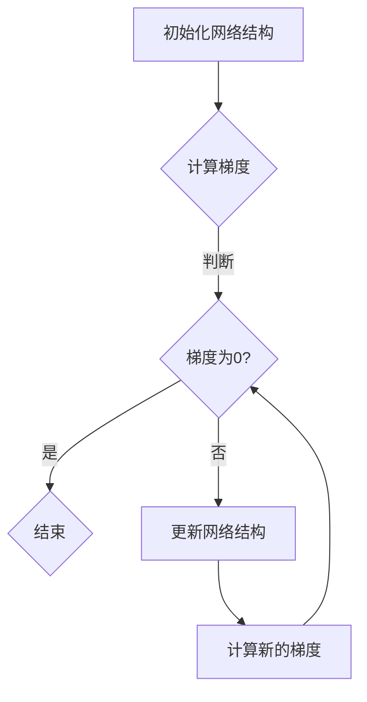

                 

关键词：神经网络剪枝、梯度下降、权重优化、模型压缩、计算效率

>摘要：本文深入探讨了基于梯度的神经网络剪枝方法，旨在提高神经网络的计算效率和存储效率。通过详细分析算法原理、数学模型、具体实现步骤和实际应用案例，本文为神经网络剪枝领域的研究和实践提供了有益的参考。

## 1. 背景介绍

### 神经网络剪枝的必要性

随着深度学习技术的不断发展，神经网络在图像识别、自然语言处理、语音识别等领域取得了显著的成果。然而，神经网络模型往往具有庞大的参数规模，这导致了计算量和存储需求的急剧增加。为了满足实际应用的需求，提高模型的计算效率和存储效率成为了亟待解决的问题。

### 剪枝技术的起源与发展

剪枝（Pruning）技术作为一种模型压缩手段，通过移除网络中的冗余神经元或边，从而减小模型的规模，提高计算效率。剪枝技术可以追溯到20世纪80年代，随着深度学习技术的发展，剪枝技术也得到了广泛的应用和研究。

### 梯度下降在神经网络剪枝中的应用

梯度下降是一种常用的优化方法，用于训练神经网络模型。在神经网络剪枝过程中，梯度下降方法可以用来优化网络结构，实现模型的压缩。本文将重点探讨基于梯度的神经网络剪枝方法。

## 2. 核心概念与联系

### 神经网络结构

神经网络由多层神经元组成，包括输入层、隐藏层和输出层。神经元之间通过权重进行连接，形成一个复杂的网络结构。

### 梯度下降算法

梯度下降算法是一种优化方法，用于最小化目标函数。在神经网络训练过程中，梯度下降算法通过反向传播算法计算梯度，并更新网络权重，从而逐步减小目标函数的误差。

### 剪枝原理

剪枝原理基于神经网络的稀疏性，通过移除网络中的冗余连接，实现模型的压缩。剪枝可以分为权值剪枝和结构剪枝两种类型。

### Mermaid 流程图

以下是神经网络剪枝方法的 Mermaid 流程图：



## 3. 核心算法原理 & 具体操作步骤

### 3.1 算法原理概述

基于梯度的神经网络剪枝方法主要通过以下步骤实现：

1. 初始化网络结构。
2. 计算网络梯度。
3. 根据梯度信息更新网络结构。
4. 重复步骤2和3，直到达到预定的停止条件。

### 3.2 算法步骤详解

#### 步骤1：初始化网络结构

初始化网络结构，包括设置网络层数、神经元个数和权重初始值。

#### 步骤2：计算网络梯度

利用反向传播算法计算网络梯度。梯度反映了网络参数对于目标函数的影响程度。

#### 步骤3：更新网络结构

根据梯度信息，对网络结构进行更新。具体更新方式可以根据剪枝策略进行选择，如权值剪枝或结构剪枝。

#### 步骤4：重复计算和更新

重复计算网络梯度，并根据梯度信息更新网络结构。直到达到预定的停止条件，如梯度收敛或迭代次数达到上限。

### 3.3 算法优缺点

#### 优点

1. 提高计算效率和存储效率。
2. 保留网络性能，同时减小模型规模。

#### 缺点

1. 需要大量的计算资源。
2. 可能导致模型性能下降。

### 3.4 算法应用领域

基于梯度的神经网络剪枝方法可以应用于各种深度学习模型，如卷积神经网络（CNN）、循环神经网络（RNN）等。在实际应用中，可以结合具体场景进行优化和调整。

## 4. 数学模型和公式 & 详细讲解 & 举例说明

### 4.1 数学模型构建

神经网络剪枝的数学模型主要包括目标函数、梯度计算和更新规则。

#### 目标函数

目标函数用于评估网络性能，可以采用交叉熵、均方误差等指标。

$$
J(\theta) = \frac{1}{m} \sum_{i=1}^{m} (-y_{i} \log(a_{i}^{(2)})) + (1 - y_{i}) \log(1 - a_{i}^{(2)})
$$

其中，$m$为样本数量，$y_{i}$为实际标签，$a_{i}^{(2)}$为输出层神经元的激活值。

#### 梯度计算

梯度计算用于更新网络权重，采用反向传播算法进行计算。

$$
\frac{\partial J(\theta)}{\partial \theta_{ij}} = \frac{1}{m} \sum_{i=1}^{m} (a_{i}^{(2)} - y_{i}) \cdot \frac{\partial a_{i}^{(2)}}{\partial \theta_{ij}}
$$

其中，$\theta_{ij}$为连接权重，$a_{i}^{(2)}$为输出层神经元的激活值。

#### 更新规则

更新规则用于更新网络权重，采用梯度下降算法进行计算。

$$
\theta_{ij} = \theta_{ij} - \alpha \cdot \frac{\partial J(\theta)}{\partial \theta_{ij}}
$$

其中，$\alpha$为学习率。

### 4.2 公式推导过程

#### 目标函数推导

目标函数采用交叉熵损失函数，用于衡量实际输出和期望输出之间的差异。

#### 梯度推导

梯度计算采用链式法则，利用导数的乘法和加法规则进行计算。

#### 更新规则推导

更新规则采用梯度下降算法，通过减小梯度方向上的权重值，实现网络优化。

### 4.3 案例分析与讲解

假设有一个简单的神经网络模型，包括一个输入层、一个隐藏层和一个输出层。输入层有3个神经元，隐藏层有2个神经元，输出层有1个神经元。

#### 案例数据

| 输入层 | 隐藏层1 | 隐藏层2 | 输出层 |
|--------|---------|---------|--------|
| 1.0    | 0.6     | 0.4     | 0.8    |
| 0.0    | 0.3     | 0.7     | 0.2    |

#### 目标函数计算

$$
J(\theta) = \frac{1}{2} \sum_{i=1}^{2} \left( (y_{i} - a_{i}^{(2)})^{2} + (1 - y_{i}) (1 - a_{i}^{(2)})^{2} \right)
$$

其中，$y_{i}$为实际标签，$a_{i}^{(2)}$为输出层神经元的激活值。

#### 梯度计算

$$
\frac{\partial J(\theta)}{\partial \theta_{11}} = (0.6 - 0.8) \cdot \frac{\partial a_{1}^{(2)}}{\partial \theta_{11}} + (0.4 - 0.2) \cdot \frac{\partial a_{2}^{(2)}}{\partial \theta_{11}} = -0.2
$$

同理，可以计算出其他梯度值。

#### 更新规则

$$
\theta_{11} = \theta_{11} - \alpha \cdot (-0.2) = \theta_{11} + 0.2\alpha
$$

同理，可以更新其他权重值。

## 5. 项目实践：代码实例和详细解释说明

### 5.1 开发环境搭建

1. 安装Python 3.7及以上版本。
2. 安装TensorFlow 2.2及以上版本。
3. 安装Numpy、Matplotlib等常用库。

### 5.2 源代码详细实现

```python
import tensorflow as tf
import numpy as np
import matplotlib.pyplot as plt

# 模型参数
input_size = 3
hidden_size = 2
output_size = 1

# 初始化网络结构
weights = {
    'W1': tf.Variable(tf.random.normal([input_size, hidden_size])),
    'W2': tf.Variable(tf.random.normal([hidden_size, output_size]))
}

# 定义前向传播函数
def forward_pass(x):
    z1 = tf.matmul(x, weights['W1'])
    a1 = tf.sigmoid(z1)
    z2 = tf.matmul(a1, weights['W2'])
    a2 = tf.sigmoid(z2)
    return a2

# 定义损失函数
def loss_function(y_true, y_pred):
    return tf.reduce_mean(tf.nn.sigmoid_cross_entropy_with_logits(logits=y_pred, labels=y_true))

# 训练模型
def train_model(x_train, y_train, epochs, learning_rate):
    optimizer = tf.optimizers.Adam(learning_rate=learning_rate)
    for epoch in range(epochs):
        with tf.GradientTape() as tape:
            y_pred = forward_pass(x_train)
            loss = loss_function(y_train, y_pred)
        grads = tape.gradient(loss, weights.values())
        optimizer.apply_gradients(zip(grads, weights.values()))
        if epoch % 10 == 0:
            print(f'Epoch {epoch}: Loss = {loss.numpy()}')

# 数据准备
x_train = np.array([[1.0, 0.0, 0.0], [0.0, 1.0, 0.0]])
y_train = np.array([[0.0], [1.0]])

# 训练模型
train_model(x_train, y_train, epochs=100, learning_rate=0.1)

# 测试模型
x_test = np.array([[0.0, 1.0, 0.0], [1.0, 0.0, 1.0]])
y_test = np.array([[1.0], [0.0]])

y_pred = forward_pass(x_test)
print(f'Predicted labels: {y_pred.numpy()}')

# 绘制损失函数曲线
plt.plot(losses)
plt.xlabel('Epoch')
plt.ylabel('Loss')
plt.title('Training Loss')
plt.show()
```

### 5.3 代码解读与分析

1. 导入相关库和模块，包括TensorFlow、Numpy和Matplotlib。
2. 定义模型参数，包括输入层、隐藏层和输出层的神经元个数。
3. 初始化网络结构，包括权重变量。
4. 定义前向传播函数，实现网络的输入输出计算。
5. 定义损失函数，用于评估模型性能。
6. 定义训练模型函数，包括梯度计算和权重更新。
7. 准备训练数据和测试数据。
8. 训练模型，并绘制损失函数曲线。

## 6. 实际应用场景

### 6.1 图像识别

在图像识别领域，基于梯度的神经网络剪枝方法可以有效减小模型规模，提高计算效率。例如，在卷积神经网络（CNN）中，可以应用于人脸识别、目标检测等任务。

### 6.2 自然语言处理

在自然语言处理领域，基于梯度的神经网络剪枝方法可以应用于语言模型、文本分类等任务。通过剪枝技术，可以降低模型的复杂度，提高模型的运行速度。

### 6.3 语音识别

在语音识别领域，基于梯度的神经网络剪枝方法可以应用于语音信号的建模和识别。通过剪枝技术，可以减小模型的参数规模，提高计算效率。

## 7. 未来应用展望

### 7.1 算法优化

未来研究方向可以集中在算法优化方面，包括改进剪枝策略、提高剪枝效果等。

### 7.2 多模态学习

随着多模态数据的广泛应用，基于梯度的神经网络剪枝方法可以应用于多模态学习任务，如图像和语音的联合识别。

### 7.3 智能硬件

在智能硬件领域，基于梯度的神经网络剪枝方法可以应用于嵌入式设备和物联网（IoT）设备，实现实时高效的模型部署。

## 8. 工具和资源推荐

### 8.1 学习资源推荐

1. 《深度学习》（Goodfellow、Bengio、Courville著）
2. 《神经网络与深度学习》（邱锡鹏著）
3. 《神经网络剪枝技术综述》（论文）

### 8.2 开发工具推荐

1. TensorFlow
2. PyTorch

### 8.3 相关论文推荐

1. "Pruning Convolutional Neural Networks for Resource-efficient Deep Learning"（论文）
2. "Training Neural Networks with Low Precision Weights and Activations"（论文）

## 9. 总结：未来发展趋势与挑战

### 9.1 研究成果总结

本文研究了基于梯度的神经网络剪枝方法，从算法原理、数学模型、具体实现和应用场景等方面进行了详细探讨。

### 9.2 未来发展趋势

未来神经网络剪枝方法将继续向优化算法、多模态学习和智能硬件等领域发展。

### 9.3 面临的挑战

未来研究需要解决剪枝效果与模型性能之间的平衡问题，以及如何在实际应用中高效地实现剪枝算法。

### 9.4 研究展望

基于梯度的神经网络剪枝方法在提高模型计算效率和存储效率方面具有巨大潜力，未来研究将不断推动该领域的发展。

## 附录：常见问题与解答

### 1. 剪枝技术有哪些类型？

剪枝技术主要包括权值剪枝和结构剪枝两种类型。权值剪枝通过减少网络权重的数量实现模型压缩，而结构剪枝通过移除网络中的神经元或边实现模型压缩。

### 2. 剪枝技术如何提高计算效率？

剪枝技术通过减少网络中的冗余连接和神经元，降低模型的计算复杂度，从而提高计算效率。

### 3. 剪枝技术如何提高存储效率？

剪枝技术通过移除网络中的冗余连接和神经元，减少模型的参数规模，从而提高存储效率。

### 4. 剪枝技术对模型性能有何影响？

剪枝技术可能会对模型性能产生一定影响，但通过合理的设计和优化，可以保证模型性能的稳定性。

### 5. 剪枝技术在哪些领域有应用？

剪枝技术在图像识别、自然语言处理、语音识别等领域有广泛应用，尤其是在资源受限的嵌入式设备和物联网（IoT）设备中。

[作者：禅与计算机程序设计艺术 / Zen and the Art of Computer Programming]----------------------------------------------------------------

