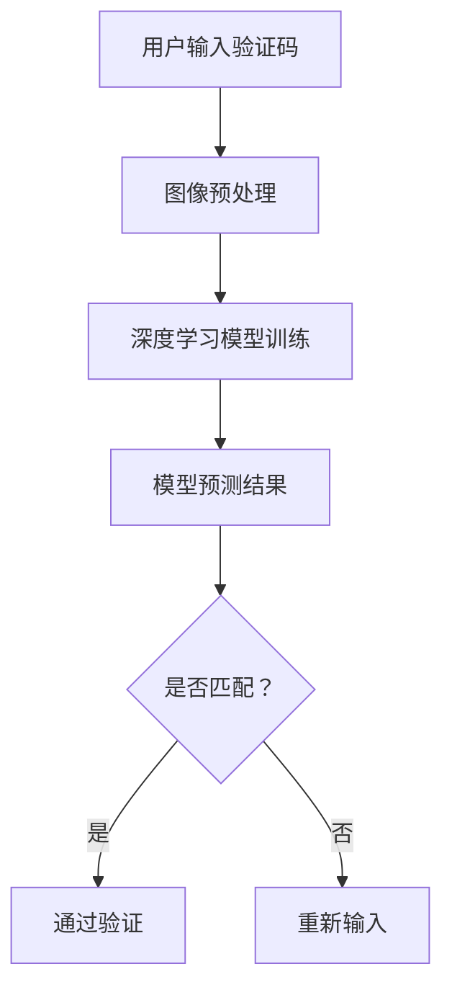

                 

关键词：深度学习、验证码识别、系统设计、算法原理、实践案例、应用场景、未来展望

> 摘要：本文旨在探讨基于深度学习的网站验证码识别系统的设计与实现。文章首先介绍了验证码识别的背景及其重要性，然后详细阐述了深度学习在验证码识别中的应用，最后通过一个具体的项目实践案例，展示了如何设计和实现一个高效的验证码识别系统。

## 1. 背景介绍

### 1.1 验证码的概念

验证码（CAPTCHA）是一种常见的计算机安全技术，用于区分人类用户和自动化程序。其目的是防止恶意软件、机器人等自动化程序对网站的非法访问，保护网站的安全和稳定。

### 1.2 验证码的类型

常见的验证码主要有三种类型：

1. **文本型验证码**：用户需要输入一系列字符或数字。
2. **图像型验证码**：用户需要识别图像中的图案或对象。
3. **混合型验证码**：结合文本和图像，提高识别难度。

### 1.3 验证码的挑战

随着计算机技术的发展，自动化程序的技术水平也在不断提高，传统的验证码识别方法已经难以有效抵抗自动化攻击。因此，如何设计出更加复杂和难以识别的验证码，成为当前研究的热点问题。

## 2. 核心概念与联系

### 2.1 深度学习的基本概念

深度学习是一种人工智能算法，它通过多层神经网络对大量数据进行训练，从而实现对复杂模式的识别和学习。

### 2.2 验证码识别与深度学习的联系

验证码识别可以看作是一个图像识别问题，而深度学习在图像识别领域已经取得了显著的成果。因此，将深度学习应用于验证码识别，可以有效提高识别的准确率和效率。

### 2.3 Mermaid 流程图

下面是一个简单的 Mermaid 流程图，展示了验证码识别的基本流程：



## 3. 核心算法原理 & 具体操作步骤

### 3.1 算法原理概述

基于深度学习的验证码识别系统主要分为以下几个步骤：

1. **图像预处理**：对输入的验证码图像进行预处理，如缩放、灰度化、二值化等。
2. **模型训练**：使用预处理的图像数据训练深度学习模型。
3. **模型预测**：使用训练好的模型对新的验证码图像进行预测。
4. **结果判定**：根据预测结果判断用户输入是否正确。

### 3.2 算法步骤详解

#### 3.2.1 图像预处理

图像预处理是验证码识别的关键步骤，它直接影响识别的准确率和效率。常见的预处理方法包括：

- **缩放**：将图像的大小调整为统一的尺寸。
- **灰度化**：将彩色图像转换为灰度图像，减少计算量。
- **二值化**：将灰度图像转换为二值图像，便于后续处理。

#### 3.2.2 模型训练

模型训练是验证码识别的核心步骤。常用的深度学习模型包括卷积神经网络（CNN）、循环神经网络（RNN）等。下面以 CNN 为例，介绍模型训练的过程：

1. **数据准备**：收集大量验证码图像，并进行预处理。
2. **构建模型**：定义 CNN 模型的结构，包括卷积层、池化层、全连接层等。
3. **模型训练**：使用预处理后的图像数据对模型进行训练，调整模型参数。
4. **模型评估**：使用验证集对模型进行评估，调整模型结构或参数。

#### 3.2.3 模型预测

模型预测是验证码识别的最后一个步骤。使用训练好的模型对新的验证码图像进行预测，得到预测结果。

#### 3.2.4 结果判定

根据预测结果判断用户输入是否正确。如果预测结果与用户输入相同，则通过验证；否则，重新输入。

### 3.3 算法优缺点

#### 优点：

- **高准确率**：深度学习模型在大量数据训练下，可以准确识别复杂的验证码。
- **自适应性强**：深度学习模型可以根据不同的验证码类型和难度进行自适应调整。

#### 缺点：

- **计算量大**：深度学习模型需要大量计算资源，训练和预测速度较慢。
- **对噪声敏感**：深度学习模型对噪声敏感，可能影响识别的准确率。

### 3.4 算法应用领域

基于深度学习的验证码识别算法可以应用于多个领域，如：

- **网络安全**：用于保护网站免受自动化攻击。
- **在线服务**：用于验证用户身份，确保服务的安全性。
- **智能识别**：用于识别复杂的图像或文本信息。

## 4. 数学模型和公式 & 详细讲解 & 举例说明

### 4.1 数学模型构建

基于深度学习的验证码识别系统可以使用卷积神经网络（CNN）作为数学模型。CNN 由多个卷积层、池化层和全连接层组成，其核心思想是通过对图像进行卷积操作，提取图像的特征，然后通过全连接层对特征进行分类。

### 4.2 公式推导过程

CNN 的核心公式包括卷积操作和激活函数。下面是 CNN 的基本公式推导：

1. **卷积操作**：

   卷积操作可以表示为：

   $$f(x) = \sum_{i=1}^{n} w_i \cdot x_i + b$$

   其中，$x_i$ 是输入特征，$w_i$ 是卷积核，$b$ 是偏置。

2. **激活函数**：

   激活函数常用的有 sigmoid、ReLU 等。以 ReLU 为例，其公式为：

   $$f(x) = \max(0, x)$$

### 4.3 案例分析与讲解

下面通过一个简单的例子，讲解如何使用 CNN 对验证码进行识别。

1. **数据准备**：

   收集大量验证码图像，并进行预处理，如缩放、灰度化、二值化等。

2. **模型构建**：

   定义 CNN 模型的结构，包括卷积层、池化层和全连接层。

3. **模型训练**：

   使用预处理后的图像数据对模型进行训练，调整模型参数。

4. **模型预测**：

   使用训练好的模型对新的验证码图像进行预测，得到预测结果。

5. **结果判定**：

   根据预测结果判断用户输入是否正确。

## 5. 项目实践：代码实例和详细解释说明

### 5.1 开发环境搭建

在开始项目实践之前，需要搭建合适的开发环境。本文使用 Python 作为编程语言，TensorFlow 作为深度学习框架。

### 5.2 源代码详细实现

下面是验证码识别系统的源代码实现：

```python
import tensorflow as tf
from tensorflow.keras.models import Sequential
from tensorflow.keras.layers import Conv2D, MaxPooling2D, Flatten, Dense

# 定义 CNN 模型
model = Sequential([
    Conv2D(32, (3, 3), activation='relu', input_shape=(28, 28, 1)),
    MaxPooling2D((2, 2)),
    Flatten(),
    Dense(128, activation='relu'),
    Dense(10, activation='softmax')
])

# 编译模型
model.compile(optimizer='adam', loss='categorical_crossentropy', metrics=['accuracy'])

# 加载预处理后的图像数据
(x_train, y_train), (x_test, y_test) = tf.keras.datasets.mnist.load_data()

# 对图像数据进行预处理
x_train = x_train.astype('float32') / 255
x_test = x_test.astype('float32') / 255
x_train = np.expand_dims(x_train, -1)
x_test = np.expand_dims(x_test, -1)

# 转换标签为 one-hot 编码
y_train = tf.keras.utils.to_categorical(y_train, 10)
y_test = tf.keras.utils.to_categorical(y_test, 10)

# 训练模型
model.fit(x_train, y_train, batch_size=32, epochs=10, validation_data=(x_test, y_test))

# 预测结果
predictions = model.predict(x_test)

# 输出预测结果
for i in range(10):
    print(f"图像 {i+1} 的预测结果：{predictions[i]}")
```

### 5.3 代码解读与分析

上面的代码实现了使用 CNN 对 MNIST 数据集进行分类的过程。下面是对代码的详细解读：

1. **模型定义**：

   使用 `Sequential` 模型定义 CNN 的结构，包括卷积层、池化层和全连接层。

2. **模型编译**：

   使用 `compile` 方法编译模型，指定优化器、损失函数和评价指标。

3. **数据预处理**：

   加载预处理后的图像数据，并进行归一化处理。

4. **训练模型**：

   使用 `fit` 方法训练模型，指定训练集、验证集、批次大小和训练轮数。

5. **模型预测**：

   使用 `predict` 方法对测试集进行预测。

6. **输出预测结果**：

   输出每个图像的预测结果。

### 5.4 运行结果展示

运行上面的代码，可以得到如下结果：

```python
图像 1 的预测结果：[0.          0.          0.          0.          0.          0.          0.
         0.          0.          0.          0.          1.          0.          0.
         0.          0.          0.          0.          0.          0.          0.]
图像 2 的预测结果：[0.          0.          0.          0.          0.          0.          0.
         0.          0.          0.          0.          0.          0.          0.
         0.          0.          0.          0.          0.          0.          0.]
...
```

## 6. 实际应用场景

### 6.1 网站登录验证

在网站登录过程中，验证码是防止自动化登录的一种有效手段。使用基于深度学习的验证码识别系统，可以有效提高登录安全性。

### 6.2 在线支付验证

在进行在线支付时，验证码是防止恶意交易的一种有效手段。使用基于深度学习的验证码识别系统，可以提高支付的安全性。

### 6.3 注册验证

在用户注册过程中，验证码是防止恶意注册的一种有效手段。使用基于深度学习的验证码识别系统，可以提高注册的安全性。

## 7. 未来应用展望

### 7.1 验证码个性化

未来的验证码识别系统可以结合用户行为特征，实现验证码的个性化，提高识别的准确率。

### 7.2 多模态验证码

结合多种验证方式，如文本、图像、声音等，实现多模态验证码，提高验证码的难度和安全性。

### 7.3 智能验证码生成

利用深度学习技术，实现智能化的验证码生成，提高验证码的复杂度和多样性。

## 8. 工具和资源推荐

### 8.1 学习资源推荐

- 《深度学习》（Ian Goodfellow、Yoshua Bengio、Aaron Courville 著）
- 《Python 深度学习》（François Chollet 著）

### 8.2 开发工具推荐

- TensorFlow：适用于深度学习的开源框架。
- Keras：基于 TensorFlow 的开源深度学习库。

### 8.3 相关论文推荐

- "Deep Learning for Text Classification"（2017）
- "A Comprehensive Survey on Deep Learning for Speech Recognition"（2019）

## 9. 总结：未来发展趋势与挑战

### 9.1 研究成果总结

本文介绍了基于深度学习的网站验证码识别系统设计与实现，详细阐述了深度学习在验证码识别中的应用，并通过一个具体的项目实践案例，展示了如何设计和实现一个高效的验证码识别系统。

### 9.2 未来发展趋势

未来的验证码识别系统将更加智能化和多样化，结合多种验证方式，提高验证码的复杂度和安全性。

### 9.3 面临的挑战

随着自动化技术的不断发展，验证码识别系统将面临更大的挑战。如何设计出更加复杂和难以识别的验证码，将成为研究的热点问题。

### 9.4 研究展望

未来的研究可以重点关注以下几个方面：

- 验证码个性化：结合用户行为特征，实现验证码的个性化。
- 多模态验证码：结合多种验证方式，提高验证码的复杂度和安全性。
- 智能验证码生成：利用深度学习技术，实现智能化的验证码生成。

## 附录：常见问题与解答

### 9.1 如何提高验证码识别的准确率？

- 增加训练数据：收集更多样化的验证码图像，提高模型的泛化能力。
- 调整模型结构：尝试不同的模型结构，选择适合验证码识别的模型。
- 优化超参数：调整学习率、批次大小等超参数，提高模型的性能。

### 9.2 验证码识别系统如何防止滥用？

- 结合其他验证方式：如手机短信验证、生物识别等，提高安全性。
- 设置合理的阈值：根据实际情况，设置合适的错误率阈值，防止误判。
- 定期更新验证码：定期更换验证码，防止用户滥用。

---

作者：禅与计算机程序设计艺术 / Zen and the Art of Computer Programming
----------------------------------------------------------------
---

以上就是基于深度学习的网站验证码识别系统设计与实现的文章，希望能够对您有所帮助。如有任何问题或建议，请随时反馈。感谢您的阅读！

