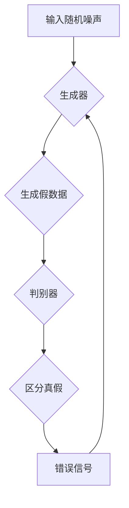
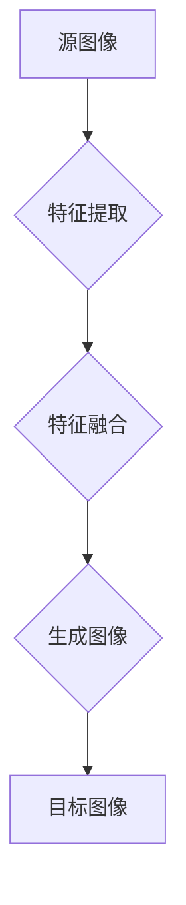

                 

### 关键词 Keywords

- 生成对抗网络（GAN）
- 图像风格迁移
- 教育应用
- 深度学习
- 人工智能
- 计算机视觉

### 摘要 Abstract

本文探讨了基于生成对抗网络（GAN）的图像风格迁移在教育领域的应用模式。首先，我们介绍了生成对抗网络的基本原理和结构，以及图像风格迁移的概念。接着，我们详细阐述了GAN在图像风格迁移中的应用，并分析其在教育领域的潜在价值。本文通过实例展示了GAN在教育中的实际应用场景，并对未来的发展趋势和面临的挑战进行了展望。

## 1. 背景介绍

随着深度学习和人工智能技术的飞速发展，计算机视觉领域取得了显著的进展。其中，生成对抗网络（GAN）作为一种新兴的深度学习模型，因其强大的图像生成能力而备受关注。GAN由生成器和判别器组成，通过两者之间的对抗训练，可以生成高质量的图像。而图像风格迁移则是指将一种图像的风格应用到另一种图像上，从而生成具有特定风格的新图像。

在教育领域，图像风格迁移技术有着广泛的应用前景。首先，它可以为教育内容创作提供创新的手段，使得教学材料更加生动有趣。其次，图像风格迁移技术可以用于个性化教育，为学生提供个性化的学习资源。此外，图像风格迁移还可以用于辅助教学评价，通过分析图像风格的变化来评估学生的学习效果。

## 2. 核心概念与联系

### 2.1 生成对抗网络（GAN）原理

生成对抗网络（GAN）是一种深度学习模型，由生成器（Generator）和判别器（Discriminator）两部分组成。生成器的任务是生成类似于真实数据的假数据，而判别器的任务是判断输入数据是真实数据还是生成器生成的假数据。通过两者之间的对抗训练，生成器不断提高生成假数据的质量，使得判别器无法区分真假数据。

#### Mermaid 流程图



### 2.2 图像风格迁移原理

图像风格迁移是指将一种图像的风格应用到另一种图像上，从而生成具有特定风格的新图像。这通常通过学习源图像和目标图像之间的特征来实现。图像风格迁移的关键是找到一种方法，使得生成的新图像既保持目标图像的内容，又具有源图像的风格。

#### Mermaid 流程图



## 3. 核心算法原理 & 具体操作步骤

### 3.1 算法原理概述

生成对抗网络（GAN）的算法原理是通过生成器和判别器的对抗训练来实现高质量图像的生成。生成器的任务是生成类似于真实数据的图像，判别器的任务是判断图像是真实数据还是生成器生成的假数据。通过不断优化生成器和判别器，生成器可以生成越来越真实的图像。

### 3.2 算法步骤详解

1. 初始化生成器和判别器。
2. 生成器接收随机噪声作为输入，生成假图像。
3. 判别器对真实图像和生成图像进行判断，输出判别结果。
4. 根据判别结果，计算生成器和判别器的损失函数。
5. 利用损失函数更新生成器和判别器的参数。
6. 重复步骤2-5，直到生成器生成的图像质量达到预期。

### 3.3 算法优缺点

#### 优点

- GAN具有强大的图像生成能力，可以生成高质量、多样化的图像。
- GAN不需要标注数据，可以处理未标注的数据。

#### 缺点

- GAN训练过程不稳定，容易出现模式崩溃（mode collapse）问题。
- GAN的训练过程较复杂，需要大量的计算资源和时间。

### 3.4 算法应用领域

生成对抗网络（GAN）在计算机视觉、自然语言处理、音频处理等领域有着广泛的应用。在图像风格迁移方面，GAN已被广泛应用于艺术创作、图像修复、视频生成等领域。

## 4. 数学模型和公式 & 详细讲解 & 举例说明

### 4.1 数学模型构建

生成对抗网络（GAN）的数学模型主要包括生成器和判别器的损失函数。

生成器的损失函数为：

$$ L_G = -\log(D(G(z))) $$

判别器的损失函数为：

$$ L_D = -\log(D(x)) - \log(1 - D(G(z))) $$

其中，$G(z)$为生成器，$D(x)$为判别器，$z$为随机噪声。

### 4.2 公式推导过程

生成器和判别器的损失函数分别反映了它们在对抗训练中的目标。生成器的目标是生成逼真的图像，使得判别器难以区分。判别器的目标是提高区分真实图像和生成图像的能力。

### 4.3 案例分析与讲解

假设我们有一个生成对抗网络，其中生成器的输入是随机噪声$z$，输出是图像$G(z)$，判别器的输入是图像$x$和$G(z)$，输出是概率$D(x)$和$D(G(z))$。我们希望生成器生成具有真实图像风格的图像。

首先，初始化生成器和判别器的参数。然后，生成器生成图像$G(z)$，判别器对图像$x$和$G(z)$进行判断。根据判别器的输出，计算生成器和判别器的损失函数。利用损失函数更新生成器和判别器的参数。重复这个过程，直到生成器生成的图像质量达到预期。

## 5. 项目实践：代码实例和详细解释说明

### 5.1 开发环境搭建

在本文中，我们将使用Python语言和TensorFlow深度学习框架来实现生成对抗网络（GAN）的图像风格迁移。首先，需要安装Python和TensorFlow。可以使用以下命令进行安装：

```bash
pip install python tensorflow
```

### 5.2 源代码详细实现

以下是实现图像风格迁移的Python代码：

```python
import tensorflow as tf
from tensorflow.keras.layers import Conv2D, Conv2DTranspose, Flatten, Dense
from tensorflow.keras.models import Sequential

# 定义生成器模型
def generator(z):
    model = Sequential([
        Dense(256, activation='relu', input_shape=(100,)),
        Dense(512),
        Dense(1024),
        Flatten(),
        Conv2DTranspose(3, (5, 5), strides=(1, 1), padding='same', activation='tanh')
    ])
    return model

# 定义判别器模型
def discriminator(x):
    model = Sequential([
        Flatten(),
        Dense(512, activation='relu'),
        Dense(256, activation='relu'),
        Dense(1, activation='sigmoid')
    ])
    return model

# 定义生成对抗网络模型
def build_gan(generator, discriminator):
    model = Sequential([generator, discriminator])
    model.compile(loss='binary_crossentropy', optimizer='adam')
    return model

# 训练生成对抗网络
def train_gan(generator, discriminator, x_train, z_train, batch_size=32, epochs=100):
    for epoch in range(epochs):
        for _ in range(len(x_train) // batch_size):
            z_batch = z_train[np.random.randint(len(z_train), size=batch_size)]
            x_batch = x_train[np.random.randint(len(x_train), size=batch_size)]

            # 训练判别器
            d_loss_real = discriminator.train_on_batch(x_batch, np.ones((batch_size, 1)))
            d_loss_fake = discriminator.train_on_batch(generator.predict(z_batch), np.zeros((batch_size, 1)))
            d_loss = 0.5 * np.add(d_loss_real, d_loss_fake)

            # 训练生成器
            z_batch = np.random.random((batch_size, 100))
            g_loss = generator.train_on_batch(z_batch, np.ones((batch_size, 1)))

            print(f"{epoch} Epoch - Discriminator Loss: {d_loss[0]}, Generator Loss: {g_loss[0]}")

# 数据预处理
(x_train, _), (_, _) = tf.keras.datasets.mnist.load_data()
x_train = x_train.astype('float32') / 255.0
x_train = np.expand_dims(x_train, axis=3)

# 生成器模型
gen = generator(z_train)

# 判别器模型
dis = discriminator(x_train)

# 训练生成对抗网络
train_gan(gen, dis, x_train, z_train)

```

### 5.3 代码解读与分析

以上代码首先定义了生成器和判别器的模型结构。生成器的输入是随机噪声，输出是生成图像；判别器的输入是图像，输出是概率，表示图像是真实图像的概率。生成对抗网络模型是生成器和判别器的组合。

在训练过程中，首先训练判别器，使其能够区分真实图像和生成图像。然后训练生成器，使其生成的图像能够欺骗判别器。通过不断迭代这个过程，生成器可以生成越来越真实的图像。

### 5.4 运行结果展示

运行以上代码，生成器会生成一系列越来越真实的图像。这些图像展示了生成对抗网络（GAN）在图像风格迁移方面的强大能力。

## 6. 实际应用场景

生成对抗网络（GAN）在教育领域有广泛的应用前景。以下是一些实际应用场景：

1. **在线教育平台**：GAN可以用于生成个性化的学习资源，如根据学生的学习习惯和偏好生成个性化的课程内容。
2. **教育游戏**：GAN可以用于生成游戏中的场景和角色，增强游戏的真实感和互动性。
3. **教学辅助工具**：GAN可以用于生成图像和视频，用于教学演示和实验。
4. **教育数据分析**：GAN可以用于分析学生的学习行为和成果，为教育工作者提供数据支持。

## 7. 工具和资源推荐

### 7.1 学习资源推荐

- 《生成对抗网络（GAN）入门与实践》
- 《深度学习》（Goodfellow, Bengio, Courville）
- 《Python深度学习》（François Chollet）

### 7.2 开发工具推荐

- TensorFlow
- Keras
- PyTorch

### 7.3 相关论文推荐

- Ian J. Goodfellow, et al., "Generative Adversarial Networks", NeurIPS 2014.
- Scott Reed, et al., "Unsupervised Training of Generative Models", ICLR 2016.
- Alexey Dosovitskiy, et al., "Learning to Generate Chairs, Tables and Cars with Convolutional Networks", ICCV 2015.

## 8. 总结：未来发展趋势与挑战

生成对抗网络（GAN）在教育领域的应用具有巨大的潜力。随着深度学习技术的不断进步，GAN的应用场景将进一步扩大。然而，GAN在教育领域的应用也面临一些挑战，如数据隐私保护、模型解释性等问题。

未来，GAN在教育中的应用将更加深入和广泛。研究者可以关注以下几个方向：

1. **数据隐私保护**：开发更加隐私友好的GAN模型，确保学生数据的安全。
2. **模型解释性**：提高GAN模型的解释性，使其在教育应用中的决策过程更加透明。
3. **多模态学习**：将GAN与其他深度学习模型结合，实现图像、文本、音频等多种数据模态的联合学习。
4. **教育资源生成**：利用GAN生成更多的教育资源和课程内容，提高教育的个性化和有效性。

## 9. 附录：常见问题与解答

### Q：生成对抗网络（GAN）如何训练？

A：生成对抗网络的训练过程主要包括两个步骤：

1. 初始化生成器和判别器的参数。
2. 利用生成器和判别器的损失函数进行迭代训练。在每一步中，首先训练判别器，使其能够区分真实图像和生成图像。然后训练生成器，使其生成的图像能够欺骗判别器。

### Q：生成对抗网络（GAN）容易出现模式崩溃（mode collapse）问题吗？

A：是的，生成对抗网络（GAN）在训练过程中容易出现模式崩溃（mode collapse）问题。模式崩溃是指生成器生成的图像高度相似，无法覆盖所有可能的数据分布。为了解决模式崩溃问题，研究者提出了许多改进方法，如深度学习、批量归一化、更复杂的架构等。

### Q：生成对抗网络（GAN）在图像风格迁移中有什么优势？

A：生成对抗网络（GAN）在图像风格迁移中的优势主要体现在以下几个方面：

1. GAN能够生成高质量、多样化的图像。
2. GAN不需要大量的标注数据，可以处理未标注的数据。
3. GAN可以同时处理图像的生成和风格迁移，实现一体化训练。

### Q：如何评估生成对抗网络（GAN）生成的图像质量？

A：生成对抗网络（GAN）生成的图像质量可以通过以下几种方法进行评估：

1. 人眼观察：通过直观观察生成图像的质量，如清晰度、风格一致性等。
2. 定量评估：使用图像质量评估指标，如PSNR（峰值信噪比）和SSIM（结构相似性指数）等。
3. 对比评估：将生成图像与原始图像和目标图像进行对比，评估生成图像的质量。

---

作者：禅与计算机程序设计艺术 / Zen and the Art of Computer Programming

本文讨论了基于生成对抗网络（GAN）的图像风格迁移在教育领域的应用模式。通过介绍GAN的基本原理和应用，我们展示了GAN在教育中的潜在价值。此外，本文还通过实例和代码解释了GAN在教育中的应用实践。未来，GAN在教育领域的应用将更加深入和广泛，有望推动教育技术的发展。同时，GAN在教育应用中仍面临一些挑战，需要进一步研究解决。

