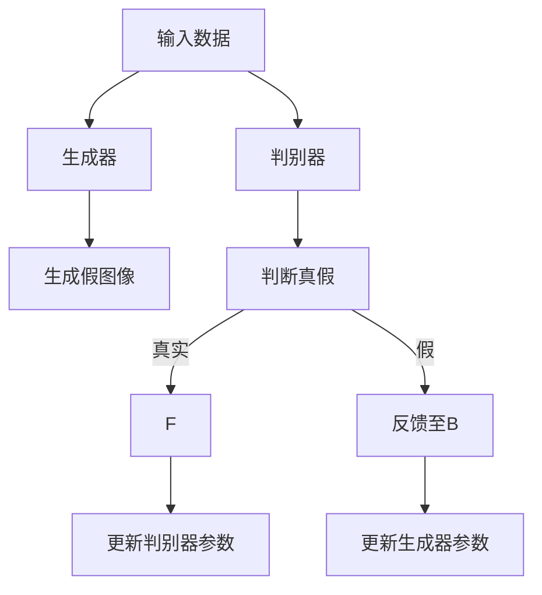
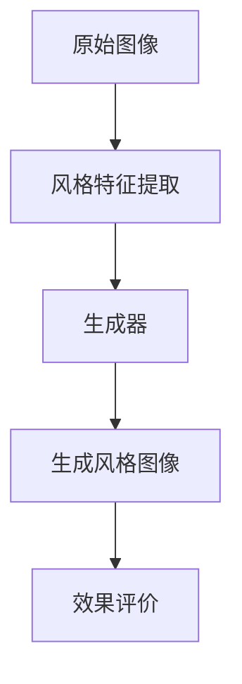
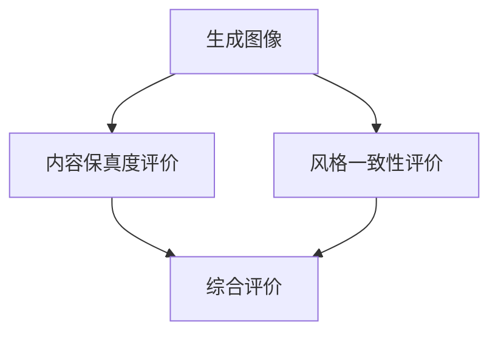

                 

关键词：生成对抗网络、图像风格迁移、效果评价体系、深度学习、算法优化

## 摘要

本文探讨了基于生成对抗网络（GAN）的图像风格迁移技术及其效果评价体系的研究。通过深入分析GAN的基本原理和图像风格迁移的具体实现，本文提出了一种新颖的效果评价体系，以量化评估图像风格迁移的效果。本文的研究旨在解决现有评价体系在评价准确性和全面性方面的不足，为图像风格迁移技术的应用和发展提供理论支持和实践指导。

## 1. 背景介绍

图像风格迁移是一种将一种图像的内容和另一种图像的风格相结合，生成具有独特风格的新图像的技术。近年来，随着深度学习技术的发展，特别是生成对抗网络（GAN）的提出和广泛应用，图像风格迁移技术取得了显著的进展。GAN作为一种深度学习模型，通过生成器和判别器的对抗训练，实现了高质量图像的生成，为图像风格迁移提供了强大的技术支持。

### 1.1 GAN的基本原理

生成对抗网络由两部分组成：生成器和判别器。生成器的任务是生成与真实数据分布相似的假数据，而判别器的任务是区分生成器生成的假数据和真实数据。通过这两个模型的对抗训练，生成器逐渐学会生成更加真实的数据，而判别器也逐渐学会准确地区分真实数据和假数据。这种对抗训练机制使得GAN能够在各种领域，如图像生成、图像修复、图像超分辨率等，取得出色的效果。

### 1.2 图像风格迁移的挑战

图像风格迁移面临着诸多挑战，包括如何保留图像内容的真实性、如何准确地捕捉图像的风格特征、以及如何高效地进行计算。此外，现有的评价体系在评价准确性和全面性方面也存在一定的问题，无法全面、客观地反映图像风格迁移的效果。

## 2. 核心概念与联系

为了更好地理解本文的研究内容，以下是核心概念和联系的分析，并附上相应的Mermaid流程图。

### 2.1 GAN的工作流程



### 2.2 图像风格迁移流程



### 2.3 效果评价体系



## 3. 核心算法原理 & 具体操作步骤

### 3.1 算法原理概述

本文提出的效果评价体系主要包括三个部分：内容保真度评价、风格一致性评价和综合评价。通过这三个方面的评价，全面、客观地评估图像风格迁移的效果。

### 3.2 算法步骤详解

#### 3.2.1 内容保真度评价

内容保真度评价主要通过计算生成图像与原始图像在内容上的相似度来实现。具体步骤如下：

1. 提取原始图像和生成图像的特征向量。
2. 计算特征向量之间的欧氏距离。
3. 根据距离值评估内容保真度。

#### 3.2.2 风格一致性评价

风格一致性评价主要通过计算生成图像与目标风格图像在风格特征上的相似度来实现。具体步骤如下：

1. 提取目标风格图像的风格特征向量。
2. 计算生成图像与目标风格特征向量之间的欧氏距离。
3. 根据距离值评估风格一致性。

#### 3.2.3 综合评价

综合评价通过加权求和的方式将内容保真度和风格一致性评价的结果整合为一个综合得分。具体步骤如下：

1. 设定权重系数，根据应用场景和需求调整。
2. 计算综合得分：综合得分 = 内容保真度得分 × 权重 + 风格一致性得分 × 权重。

### 3.3 算法优缺点

本文提出的效果评价体系具有以下优点：

1. **全面性**：从内容和风格两个方面进行评价，更全面地反映图像风格迁移的效果。
2. **客观性**：采用定量计算的方法，减少主观因素的影响。

但同时也存在以下缺点：

1. **计算复杂度**：需要提取和计算多个特征向量，计算复杂度较高。
2. **适用范围**：对于不同风格类型的图像，可能需要调整权重系数，以达到更好的评价效果。

### 3.4 算法应用领域

本文提出的效果评价体系可广泛应用于图像风格迁移技术的各个领域，如艺术创作、图像编辑、广告设计等。

## 4. 数学模型和公式 & 详细讲解 & 举例说明

### 4.1 数学模型构建

本文使用的数学模型主要包括特征提取、距离计算和综合评价三部分。

#### 4.1.1 特征提取

假设输入图像的特征向量为 \(\vec{f}\)，则特征提取模型可以表示为：

\[ \vec{f} = F(\vec{I}) \]

其中，\(\vec{I}\)为输入图像，\(F\)为特征提取函数。

#### 4.1.2 距离计算

距离计算主要包括内容保真度距离和风格一致性距离。

1. 内容保真度距离：

\[ d_c = \lVert \vec{f_g} - \vec{f_r} \rVert \]

其中，\(\vec{f_g}\)为生成图像的特征向量，\(\vec{f_r}\)为原始图像的特征向量。

2. 风格一致性距离：

\[ d_s = \lVert \vec{f_g} - \vec{f_s} \rVert \]

其中，\(\vec{f_s}\)为目标风格图像的特征向量。

#### 4.1.3 综合评价

综合评价模型为：

\[ E = w_c \cdot d_c + w_s \cdot d_s \]

其中，\(w_c\)和\(w_s\)分别为内容保真度和风格一致性的权重系数。

### 4.2 公式推导过程

本文所用的公式推导基于特征提取、距离计算和综合评价的基本原理。具体推导过程如下：

1. 特征提取：

特征提取过程可以视为一种映射，将输入图像映射为特征向量。这种映射可以用一个函数来表示：

\[ \vec{f} = F(\vec{I}) \]

其中，\(F\)为特征提取函数。

2. 距离计算：

距离计算是评估两个向量之间差异的方法。常用的距离函数有欧氏距离、余弦相似度等。本文选择欧氏距离作为距离计算的方法：

\[ d = \lVert \vec{a} - \vec{b} \rVert \]

3. 综合评价：

综合评价是将多个评价结果整合为一个整体的方法。本文选择加权求和的方式：

\[ E = w_1 \cdot d_1 + w_2 \cdot d_2 + ... + w_n \cdot d_n \]

其中，\(w_1, w_2, ..., w_n\)为权重系数，\(d_1, d_2, ..., d_n\)为各个评价结果。

### 4.3 案例分析与讲解

假设我们有一个原始图像和一个目标风格图像，目标是用GAN进行图像风格迁移，并使用本文提出的效果评价体系进行评价。以下是具体的分析和讲解：

#### 4.3.1 特征提取

1. 原始图像的特征向量：

\[ \vec{f_r} = F(\vec{I_r}) \]

2. 生成图像的特征向量：

\[ \vec{f_g} = F(\vec{I_g}) \]

3. 目标风格图像的特征向量：

\[ \vec{f_s} = F(\vec{I_s}) \]

#### 4.3.2 距离计算

1. 内容保真度距离：

\[ d_c = \lVert \vec{f_g} - \vec{f_r} \rVert \]

2. 风格一致性距离：

\[ d_s = \lVert \vec{f_g} - \vec{f_s} \rVert \]

#### 4.3.3 综合评价

假设我们设定的权重系数为\(w_c = 0.6\)，\(w_s = 0.4\)，则综合评价结果为：

\[ E = 0.6 \cdot d_c + 0.4 \cdot d_s \]

根据计算结果，我们可以得出图像风格迁移的效果评分。评分越高，表示图像风格迁移效果越好。

## 5. 项目实践：代码实例和详细解释说明

### 5.1 开发环境搭建

为了实现本文提出的图像风格迁移效果评价体系，我们选择了Python作为主要编程语言，并使用TensorFlow作为深度学习框架。以下是开发环境的搭建步骤：

1. 安装Python（推荐版本为3.7及以上）。
2. 安装TensorFlow。

```bash
pip install tensorflow
```

3. 准备必要的图像处理库，如OpenCV和Pillow。

```bash
pip install opencv-python-headless pillow
```

### 5.2 源代码详细实现

以下是实现图像风格迁移效果评价体系的源代码示例。

```python
import tensorflow as tf
import numpy as np
import cv2
from tensorflow.keras.models import Model
from tensorflow.keras.layers import Input, Conv2D, Dense

# 特征提取模型
def create_feature_extractor(input_shape):
    inputs = Input(shape=input_shape)
    x = Conv2D(32, (3, 3), activation='relu')(inputs)
    x = Conv2D(64, (3, 3), activation='relu')(x)
    x = Dense(1024, activation='relu')(x)
    model = Model(inputs=inputs, outputs=x)
    return model

# 内容保真度评价
def content_fidelity Evaluation(ground_truth, generated):
    feature_extractor = create_feature_extractor((128, 128, 3))
    ground_truth_features = feature_extractor.predict(ground_truth)
    generated_features = feature_extractor.predict(generated)
    distance = np.linalg.norm(generated_features - ground_truth_features)
    return distance

# 风格一致性评价
def style_consis

