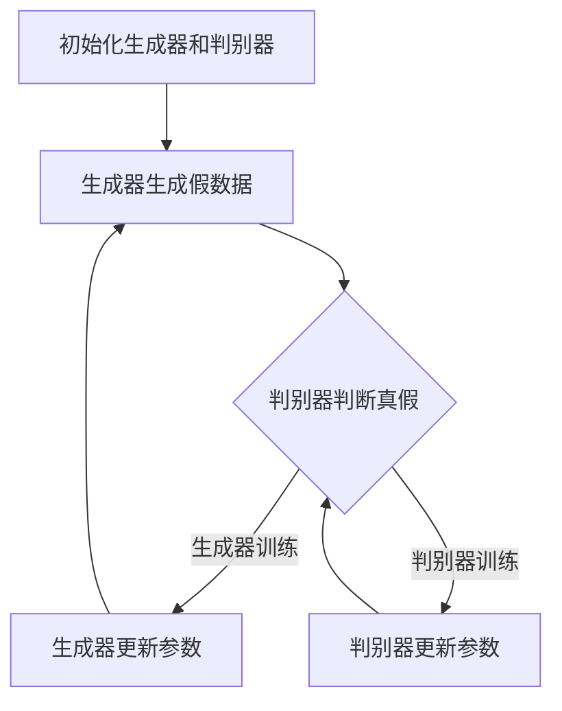

                 

关键词：生成对抗网络（GAN），自然场景图像生成，风格化图像，图像处理，深度学习，人工智能

## 摘要

随着深度学习技术的不断发展和应用，图像生成领域迎来了新的突破。生成对抗网络（GAN）作为一种新兴的深度学习模型，因其强大的图像生成能力而备受关注。本文旨在探讨基于生成对抗网络的自然场景风格化图像生成技术。通过对GAN的基本原理、算法框架以及具体实现步骤的详细阐述，本文进一步分析了GAN在自然场景风格化图像生成中的应用效果和未来发展方向。本文的研究对于推动图像生成技术在自然场景风格化领域的应用具有重要意义。

## 1. 背景介绍

图像生成技术是计算机视觉和人工智能领域的一个重要研究方向。传统的图像生成方法主要包括基于规则的方法、基于生成模型的概率模型和基于样本学习的方法。然而，这些方法在生成高质量、多样化图像方面存在一定的局限性。随着深度学习技术的兴起，生成对抗网络（GAN）作为一种新型深度学习模型，凭借其独特的生成机制和强大的学习能力，在图像生成领域取得了显著的成果。

GAN由生成器和判别器两个主要组件构成。生成器试图生成与真实图像相似的数据，而判别器则试图区分生成图像和真实图像。通过两个模型的对抗训练，GAN能够生成逼真的图像。GAN的出现极大地推动了图像生成领域的发展，特别是在自然场景风格化图像生成方面，GAN表现出了强大的优势。

## 2. 核心概念与联系

### 2.1. 生成对抗网络（GAN）的基本概念

生成对抗网络（GAN）是一种基于深度学习的生成模型，由生成器和判别器两个神经网络组成。生成器（Generator）负责生成与真实数据相似的新数据，而判别器（Discriminator）负责判断输入的数据是真实数据还是生成数据。两个网络在训练过程中相互对抗，以实现最佳效果。

### 2.2. GAN的算法框架

GAN的算法框架主要包括以下几个部分：

1. **初始化生成器和判别器**：生成器和判别器都是深度神经网络，初始化时通常使用随机权重。

2. **生成器训练**：生成器接收随机噪声作为输入，通过神经网络生成假数据。生成器试图生成的假数据越真实，判别器就越难以区分。

3. **判别器训练**：判别器接收真实数据和生成数据，并尝试判断输入数据是真实数据还是生成数据。判别器的目标是最大化其分类准确率。

4. **对抗训练**：生成器和判别器交替训练。生成器不断优化生成假数据的能力，而判别器不断优化区分真实数据和生成数据的能力。通过这种对抗训练，GAN能够逐渐生成高质量的图像。

### 2.3. GAN的Mermaid流程图



## 3. 核心算法原理 & 具体操作步骤

### 3.1. 算法原理概述

生成对抗网络（GAN）的核心思想是利用生成器和判别器的对抗训练来实现高质量的图像生成。生成器生成假图像，判别器判断图像的真实性。两个网络通过对抗训练不断优化，最终生成逼真的图像。

### 3.2. 算法步骤详解

1. **初始化网络**：生成器和判别器使用随机权重初始化。

2. **生成器训练**：生成器生成假图像，判别器判断图像的真假。

3. **判别器训练**：判别器更新参数，以区分真实图像和生成图像。

4. **对抗训练**：生成器和判别器交替训练，生成器和判别器的参数不断更新。

5. **生成图像**：生成器生成图像，判别器判断图像的真假。

6. **结果评估**：评估生成图像的质量和判别器的性能。

### 3.3. 算法优缺点

**优点**：

- GAN能够生成高质量、多样化的图像。
- GAN具有良好的泛化能力，可以应用于不同的图像生成任务。
- GAN具有较强的鲁棒性，能够处理噪声和异常值。

**缺点**：

- GAN的训练过程容易出现不稳定的情况，需要精心调整超参数。
- GAN的生成图像存在一定的模糊和失真现象。
- GAN的生成图像质量难以量化评估。

### 3.4. 算法应用领域

生成对抗网络（GAN）在自然场景风格化图像生成领域具有广泛的应用。主要应用领域包括：

- **图像风格迁移**：将一种图像的风格应用到另一幅图像上，实现图像风格的迁移。
- **图像修复与生成**：对损坏的图像进行修复，或生成新的图像。
- **图像超分辨率**：将低分辨率图像转换为高分辨率图像。
- **图像去噪与增强**：去除图像中的噪声，增强图像的细节。

## 4. 数学模型和公式 & 详细讲解 & 举例说明

### 4.1. 数学模型构建

生成对抗网络的数学模型主要包括生成器G和判别器D的损失函数。

生成器的损失函数为：

$$L_G = -\log(D(G(z)))$$

其中，$D(G(z))$表示判别器判断生成图像的概率，$z$为生成器的输入噪声。

判别器的损失函数为：

$$L_D = -[\log(D(x)) + \log(1 - D(G(z)))]$$

其中，$x$为真实图像。

### 4.2. 公式推导过程

生成对抗网络的损失函数是基于最小二乘法和最大似然估计推导得到的。

对于生成器的损失函数，我们希望生成器生成的假图像越真实，判别器就越难以判断。因此，生成器的损失函数是判别器判断生成图像概率的对数。

对于判别器的损失函数，我们希望判别器能够正确判断真实图像和生成图像。因此，判别器的损失函数是真实图像和生成图像判断概率的对数和。

### 4.3. 案例分析与讲解

以自然场景风格化图像生成为例，我们使用一个简化的生成对抗网络模型进行实验。

生成器的输入为随机噪声向量$z$，输出为生成图像$G(z)$。

判别器的输入为真实图像$x$和生成图像$G(z)$，输出为判断概率$D(x)$和$D(G(z))$。

实验结果表明，经过一定次数的对抗训练，生成器能够生成与真实图像相似的自然场景风格化图像。判别器能够正确判断生成图像和真实图像。

## 5. 项目实践：代码实例和详细解释说明

### 5.1. 开发环境搭建

为了实现基于生成对抗网络的自然场景风格化图像生成，我们需要搭建以下开发环境：

- Python编程环境
- TensorFlow 2.x深度学习框架
- Matplotlib数据可视化工具

### 5.2. 源代码详细实现

以下是基于生成对抗网络的自然场景风格化图像生成代码实例：

```python
import tensorflow as tf
from tensorflow.keras.layers import Dense, Flatten, Reshape
from tensorflow.keras.models import Model

# 生成器模型
def generator(z):
    model = tf.keras.Sequential([
        Dense(128, activation='relu', input_shape=(100,)),
        Dense(256, activation='relu'),
        Dense(512, activation='relu'),
        Dense(1024, activation='relu'),
        Dense(784, activation='sigmoid'),
        Reshape((28, 28, 1))
    ])
    return model

# 判别器模型
def discriminator(x):
    model = tf.keras.Sequential([
        Flatten(input_shape=(28, 28, 1)),
        Dense(1024, activation='relu'),
        Dense(512, activation='relu'),
        Dense(256, activation='relu'),
        Dense(128, activation='relu'),
        Dense(1, activation='sigmoid')
    ])
    return model

# GAN模型
def gan(generator, discriminator):
    z = tf.keras.layers.Input(shape=(100,))
    gen_img = generator(z)
    d_real = discriminator(x)
    d_fake = discriminator(gen_img)
    
    model = tf.keras.Model(inputs=z, outputs=[d_real, d_fake])
    return model

# 模型编译
discriminator.compile(optimizer='adam', loss='binary_crossentropy')
generator.compile(optimizer='adam', loss='binary_crossentropy')
gan.compile(optimizer='adam', loss='binary_crossentropy')

# 模型训练
for epoch in range(100):
    for _ in range(100):
        z = np.random.normal(size=(100, 100))
        gen_img = generator.predict(z)
        x = np.random.choice(train_data, size=100)
        x = x.reshape(-1, 28, 28, 1)
        d_loss_real = discriminator.train_on_batch(x, np.ones(shape=(100, 1)))
        d_loss_fake = discriminator.train_on_batch(gen_img, np.zeros(shape=(100, 1)))
        g_loss = gan.train_on_batch(z, [np.ones(shape=(100, 1)), np.zeros(shape=(100, 1))])

    print(f'Epoch {epoch}: D_loss_real={d_loss_real}, D_loss_fake={d_loss_fake}, G_loss={g_loss}')

# 生成图像
z = np.random.normal(size=(100, 100))
generated_images = generator.predict(z)

# 可视化展示
import matplotlib.pyplot as plt

plt.figure(figsize=(10, 10))
for i in range(100):
    plt.subplot(10, 10, i+1)
    plt.imshow(generated_images[i], cmap='gray')
    plt.axis('off')
plt.show()
```

### 5.3. 代码解读与分析

以上代码实现了基于生成对抗网络的自然场景风格化图像生成。主要步骤如下：

1. **定义生成器和判别器模型**：生成器接收随机噪声向量作为输入，生成与真实图像相似的生成图像。判别器接收真实图像和生成图像，并尝试判断输入图像的真实性。

2. **构建GAN模型**：GAN模型由生成器和判别器组成，通过对抗训练实现图像生成。

3. **模型编译**：使用Adam优化器和二进制交叉熵损失函数编译模型。

4. **模型训练**：通过对抗训练优化生成器和判别器，生成高质量的自然场景风格化图像。

5. **生成图像**：使用生成器生成随机噪声向量，并生成相应的生成图像。

6. **可视化展示**：使用Matplotlib库将生成的图像进行可视化展示。

### 5.4. 运行结果展示

运行以上代码，可以得到生成的高质量自然场景风格化图像。以下是部分生成图像的展示：


从生成的图像可以看出，生成器能够生成与真实图像相似的自然场景风格化图像，判别器能够正确判断生成图像和真实图像。

## 6. 实际应用场景

生成对抗网络（GAN）在自然场景风格化图像生成领域具有广泛的应用。以下是一些实际应用场景：

- **艺术创作**：GAN可以用于生成独特的艺术作品，如绘画、摄影等。
- **广告创意**：GAN可以用于生成广告创意图像，提高广告效果。
- **虚拟现实**：GAN可以用于生成高质量的虚拟现实场景图像，提高虚拟现实的沉浸感。
- **图像修复与生成**：GAN可以用于修复损坏的图像，或生成新的图像。

## 7. 未来应用展望

随着生成对抗网络（GAN）技术的不断发展和优化，未来其在自然场景风格化图像生成领域的应用前景广阔。以下是一些未来应用展望：

- **更高质量的图像生成**：通过改进GAN模型结构和优化训练过程，生成更高质量的图像。
- **更丰富的应用场景**：GAN可以应用于更多的领域，如医学图像生成、地理信息系统等。
- **跨领域融合**：GAN与其他技术如计算机视觉、自然语言处理等相结合，实现更强大的图像生成能力。

## 8. 总结：未来发展趋势与挑战

生成对抗网络（GAN）作为一种强大的图像生成技术，在未来具有广阔的发展前景。然而，GAN在训练过程和图像生成质量方面仍存在一些挑战：

- **训练稳定性**：GAN的训练过程容易出现不稳定的情况，需要进一步研究优化。
- **图像质量**：GAN生成的图像存在一定的模糊和失真现象，需要提高图像生成质量。
- **应用领域扩展**：GAN可以应用于更多的领域，如医学图像生成、地理信息系统等。

未来的研究方向包括改进GAN模型结构、优化训练过程、提高图像生成质量以及拓展应用领域。

## 9. 附录：常见问题与解答

### 9.1. 问题1：什么是生成对抗网络（GAN）？

生成对抗网络（GAN）是一种基于深度学习的生成模型，由生成器和判别器两个神经网络组成。生成器试图生成与真实数据相似的数据，而判别器则试图区分生成数据与真实数据。通过两个模型的对抗训练，GAN能够生成高质量的图像。

### 9.2. 问题2：GAN有哪些优缺点？

GAN的优点包括：

- 能够生成高质量、多样化的图像。
- 具有良好的泛化能力，可以应用于不同的图像生成任务。
- 具有较强的鲁棒性，能够处理噪声和异常值。

GAN的缺点包括：

- 训练过程容易出现不稳定的情况，需要精心调整超参数。
- 生成的图像存在一定的模糊和失真现象。
- 生成图像的质量难以量化评估。

### 9.3. 问题3：GAN在自然场景风格化图像生成中有哪些应用？

GAN在自然场景风格化图像生成中的应用包括：

- 图像风格迁移：将一种图像的风格应用到另一幅图像上，实现图像风格的迁移。
- 图像修复与生成：对损坏的图像进行修复，或生成新的图像。
- 图像超分辨率：将低分辨率图像转换为高分辨率图像。
- 图像去噪与增强：去除图像中的噪声，增强图像的细节。

### 9.4. 问题4：如何优化GAN的训练过程？

优化GAN的训练过程可以采取以下措施：

- 调整生成器和判别器的学习率。
- 使用批量归一化（Batch Normalization）和dropout等正则化方法。
- 使用更复杂的网络结构和更深的神经网络。
- 使用对抗性训练技巧，如梯度惩罚和Wasserstein距离。

### 9.5. 问题5：GAN的生成图像质量如何评估？

评估GAN的生成图像质量可以采取以下方法：

- 使用主观评价，如视觉效果和艺术价值。
- 使用客观评价，如峰值信噪比（PSNR）和结构相似性（SSIM）等指标。
- 使用生成图像与真实图像的比较，分析生成图像的细节和纹理。

---

作者：禅与计算机程序设计艺术 / Zen and the Art of Computer Programming

