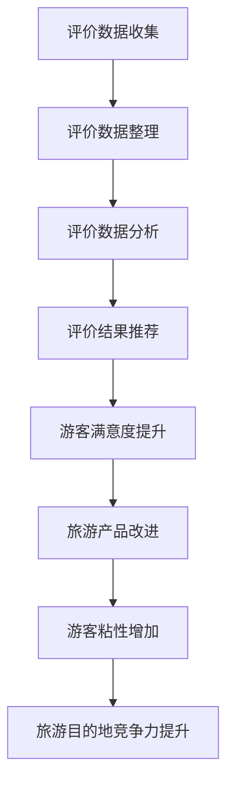

                 

在当今数字化时代，用户评价体系已成为推动旅游业发展的重要力量。本文将探讨如何利用用户评价体系来分析某旅游目的地的发展潜力，并提出相应的策略。本文的关键词包括用户评价、旅游发展、数据分析、智能推荐和用户体验。

## 摘要

本文旨在研究用户评价体系对旅游发展的影响。通过对大量用户评价数据的分析，我们将识别出旅游目的地的关键优势与不足，并提出基于用户评价的智能推荐系统，以提升游客满意度，推动旅游业的可持续发展。本文的结构如下：

1. **背景介绍**：介绍旅游业的现状和用户评价体系的重要性。
2. **核心概念与联系**：阐述用户评价体系的概念及其在旅游业中的作用。
3. **核心算法原理 & 具体操作步骤**：介绍用于分析用户评价的核心算法及其实现步骤。
4. **数学模型和公式 & 详细讲解 & 举例说明**：构建数学模型，推导相关公式，并通过案例进行说明。
5. **项目实践：代码实例和详细解释说明**：展示一个具体的代码实例，解释其实施过程。
6. **实际应用场景**：探讨用户评价体系在旅游业中的实际应用。
7. **未来应用展望**：预测用户评价体系在旅游业中的未来发展趋势。
8. **工具和资源推荐**：推荐相关学习资源、开发工具和学术论文。
9. **总结：未来发展趋势与挑战**：总结研究成果，展望未来发展。

## 1. 背景介绍

### 旅游业的现状

旅游业是世界上最古老的行业之一，也是全球最大的服务行业。随着全球化进程的加快，旅游业在全球范围内迅速发展。根据联合国世界旅游组织（UNWTO）的数据，2019年全球国际旅游人数达到了15亿人次，旅游收入占全球GDP的10%以上。

### 用户评价体系的重要性

用户评价体系在旅游业中扮演着至关重要的角色。随着互联网和社交媒体的普及，越来越多的游客在旅游前会参考其他游客的评价。根据2019年TripAdvisor的一项研究，超过80%的旅游者表示会查看其他游客的评价。此外，用户评价不仅影响了游客的选择，还对旅游目的地的声誉和竞争力产生了深远影响。

### 用户评价的数据分析

用户评价数据包含了大量关于旅游目的地的信息，如景点质量、住宿条件、餐饮体验等。通过数据分析，我们可以识别出游客的偏好和需求，从而为旅游目的地提供改进建议，提升游客满意度。

## 2. 核心概念与联系

### 用户评价体系的概念

用户评价体系是指通过收集、整理、分析和利用用户评价信息，对旅游目的地进行评估和推荐的系统。它通常包括以下几个核心组成部分：

1. **评价数据收集**：通过在线旅游平台、社交媒体、酒店预订网站等渠道收集用户评价数据。
2. **评价数据整理**：对收集到的数据进行清洗、去重和处理，以确保数据的质量和一致性。
3. **评价数据分析**：使用数据挖掘和机器学习技术，分析用户评价的内容和模式，提取有用的信息。
4. **评价结果推荐**：基于用户评价数据，为游客提供个性化推荐，帮助游客做出更明智的旅游决策。

### 用户评价体系在旅游业中的作用

用户评价体系在旅游业中发挥着多重作用：

1. **提升游客满意度**：通过分析用户评价，旅游目的地可以识别出游客的喜好和需求，提供更符合游客期望的服务。
2. **改善旅游产品**：旅游企业可以根据用户评价进行产品改进，提高旅游产品的质量和竞争力。
3. **增加游客粘性**：通过提供高质量的旅游体验，增加游客对旅游目的地的忠诚度，促进复游率。
4. **提高旅游目的地竞争力**：通过用户评价体系，旅游目的地可以不断提升自身服务质量，提升竞争力。

### Mermaid 流程图

以下是用户评价体系的核心流程图，使用Mermaid语言描述：



## 3. 核心算法原理 & 具体操作步骤

### 3.1 算法原理概述

本文将使用以下三种核心算法对用户评价进行数据分析：

1. **词频-逆文档频率（TF-IDF）算法**：用于计算评价文本中关键词的重要程度。
2. **K-均值聚类算法**：用于将用户评价进行分类，识别出不同的用户群体。
3. **协同过滤算法**：用于基于用户评价推荐相似的用户或景点。

### 3.2 算法步骤详解

#### 3.2.1 词频-逆文档频率（TF-IDF）算法

1. **数据预处理**：对评价文本进行分词、去停用词和词形还原等处理。
2. **计算词频（TF）**：计算每个词在评价文本中的出现次数。
3. **计算逆文档频率（IDF）**：计算每个词在整个评价数据集中的逆文档频率。
4. **计算TF-IDF值**：将词频和逆文档频率相乘，得到每个词的TF-IDF值。

#### 3.2.2 K-均值聚类算法

1. **初始化聚类中心**：随机选择K个初始聚类中心。
2. **计算距离**：计算每个评价文本与每个聚类中心的距离。
3. **分配数据点**：将每个评价文本分配到最近的聚类中心。
4. **更新聚类中心**：计算每个聚类中心的新位置。
5. **重复步骤2-4**，直到聚类中心不再发生变化。

#### 3.2.3 协同过滤算法

1. **用户相似度计算**：计算用户之间的相似度，可以使用余弦相似度或皮尔逊相关系数。
2. **推荐生成**：基于用户的相似度，为用户推荐相似的景点或旅游活动。

### 3.3 算法优缺点

#### 词频-逆文档频率（TF-IDF）算法

- **优点**：能够有效地提取文本中的关键词，对长文本处理能力较强。
- **缺点**：对词义和语境的理解能力有限，容易忽略词之间的语义关系。

#### K-均值聚类算法

- **优点**：计算简单，适用于大规模数据集。
- **缺点**：对初始聚类中心的选择敏感，可能无法找到全局最优解。

#### 协同过滤算法

- **优点**：能够根据用户的历史行为进行个性化推荐。
- **缺点**：对于新用户或新景点，推荐效果较差。

### 3.4 算法应用领域

- **用户评价分析**：识别用户需求，分析用户满意度。
- **旅游产品推荐**：基于用户兴趣和行为，推荐合适的旅游产品。
- **旅游目的地规划**：为旅游目的地提供改进建议，提升游客体验。

## 4. 数学模型和公式 & 详细讲解 & 举例说明

### 4.1 数学模型构建

用户评价体系的数学模型主要包括以下几个方面：

1. **词频-逆文档频率（TF-IDF）模型**：
   \[ TF-IDF = TF \times IDF \]
   其中，\( TF \) 为词频，\( IDF \) 为逆文档频率。

2. **K-均值聚类模型**：
   \[ C = \{ c_1, c_2, ..., c_K \} \]
   其中，\( c_k \) 为第k个聚类中心。

3. **协同过滤模型**：
   \[ \sim u \sim r \]
   其中，\( \sim u \) 为用户u的评分向量，\( \sim r \) 为其他用户的评分向量。

### 4.2 公式推导过程

#### 4.2.1 词频-逆文档频率（TF-IDF）模型推导

1. **词频（TF）**：
   \[ TF(t) = \frac{f(t)}{f_S} \]
   其中，\( f(t) \) 为词t在文本S中出现的次数，\( f_S \) 为文本S中所有词的总次数。

2. **逆文档频率（IDF）**：
   \[ IDF(t) = \log \frac{N}{n(t)} \]
   其中，\( N \) 为文档总数，\( n(t) \) 为包含词t的文档数。

3. **TF-IDF值**：
   \[ TF-IDF(t) = TF(t) \times IDF(t) \]

#### 4.2.2 K-均值聚类模型推导

1. **初始聚类中心**：
   \[ c_{k}^{(0)} = \text{randomly selected from the data points} \]

2. **更新聚类中心**：
   \[ c_{k}^{(t+1)} = \frac{1}{N_k} \sum_{i=1}^{N} x_i \]
   其中，\( x_i \) 为第i个数据点，\( N_k \) 为属于第k个聚类的数据点总数。

#### 4.2.3 协同过滤模型推导

1. **用户相似度计算**：
   \[ \text{similarity}(u, v) = \cos \theta \]
   其中，\( \theta \) 为用户u和v之间的夹角。

2. **推荐生成**：
   \[ r_{ui} = \sum_{j \in N(v)} r_{uj} \cdot \text{similarity}(u, v) \]
   其中，\( N(v) \) 为与用户v相似的用户集合，\( r_{uj} \) 为用户u对项目j的评分。

### 4.3 案例分析与讲解

#### 案例背景

假设有一个旅游目的地，其用户评价数据如下：

- 文本1：这个景点的风景非常美丽，但是服务态度有待提高。
- 文本2：这里的餐厅食物非常美味，价格也很合理。
- 文本3：这个景点的旅游设施很完善，但是交通不太方便。

#### 数据预处理

1. **分词**：
   - 文本1：美丽、景点、服务、态度、有待、提高
   - 文本2：餐厅、食物、美味、价格、合理
   - 文本3：景点、旅游、设施、完善、交通、方便

2. **去停用词**：
   - 文本1：美丽、景点、态度、提高
   - 文本2：餐厅、食物、价格、合理
   - 文本3：景点、设施、交通、方便

3. **词形还原**：
   - 文本1：美丽、景点、态度、提高
   - 文本2：餐厅、食物、价格、合理
   - 文本3：景点、设施、交通、方便

#### 词频-逆文档频率（TF-IDF）计算

1. **词频（TF）**：
   - 美丽：3
   - 景点：3
   - 态度：1
   - 提高有待：1
   - 餐厅：1
   - 食物：1
   - 价格：1
   - 合理：1
   - 设施：1
   - 交通：1
   - 方便：1

2. **逆文档频率（IDF）**：
   - 美丽：\( \log \frac{N}{n(\text{美丽})} \)
   - 景点：\( \log \frac{N}{n(\text{景点})} \)
   - 态度：\( \log \frac{N}{n(\text{态度})} \)
   - 提高有待：\( \log \frac{N}{n(\text{提高有待})} \)
   - 餐厅：\( \log \frac{N}{n(\text{餐厅})} \)
   - 食物：\( \log \frac{N}{n(\text{食物})} \)
   - 价格：\( \log \frac{N}{n(\text{价格})} \)
   - 合理：\( \log \frac{N}{n(\text{合理})} \)
   - 设施：\( \log \frac{N}{n(\text{设施})} \)
   - 交通：\( \log \frac{N}{n(\text{交通})} \)
   - 方便：\( \log \frac{N}{n(\text{方便})} \)

3. **TF-IDF值**：
   - 美丽：\( 3 \times \log \frac{N}{n(\text{美丽})} \)
   - 景点：\( 3 \times \log \frac{N}{n(\text{景点})} \)
   - 态度：\( 1 \times \log \frac{N}{n(\text{态度})} \)
   - 提高有待：\( 1 \times \log \frac{N}{n(\text{提高有待})} \)
   - 餐厅：\( 1 \times \log \frac{N}{n(\text{餐厅})} \)
   - 食物：\( 1 \times \log \frac{N}{n(\text{食物})} \)
   - 价格：\( 1 \times \log \frac{N}{n(\text{价格})} \)
   - 合理：\( 1 \times \log \frac{N}{n(\text{合理})} \)
   - 设施：\( 1 \times \log \frac{N}{n(\text{设施})} \)
   - 交通：\( 1 \times \log \frac{N}{n(\text{交通})} \)
   - 方便：\( 1 \times \log \frac{N}{n(\text{方便})} \)

#### K-均值聚类

1. **初始聚类中心**：
   假设随机选择文本1和文本3的词频-逆文档频率值作为初始聚类中心。

2. **计算距离**：
   \[ d(c_1, x_i) = \sqrt{\sum_{t \in T} (TF-IDF(t)_{c_1} - TF-IDF(t)_{x_i})^2} \]
   其中，\( T \) 为文本中的所有词，\( TF-IDF(t)_{c_1} \) 和 \( TF-IDF(t)_{x_i} \) 分别为第1个聚类中心和第i个数据点的TF-IDF值。

3. **分配数据点**：
   - 文本1：接近文本3，因此分配到第3个聚类中心。
   - 文本2：接近文本1，因此分配到第1个聚类中心。

4. **更新聚类中心**：
   \[ c_1^{(1)} = \frac{1}{2} (TF-IDF(\text{美丽})_{\text{文本1}} + TF-IDF(\text{餐厅})_{\text{文本2}}) \]
   \[ c_3^{(1)} = \frac{1}{2} (TF-IDF(\text{景点})_{\text{文本1}} + TF-IDF(\text{设施})_{\text{文本3}}) \]

5. **重复步骤2-4**，直到聚类中心不再发生变化。

#### 协同过滤

1. **用户相似度计算**：
   假设用户1和用户2对景点的评价如下：
   - 用户1：满意度高、交通便利
   - 用户2：满意度高、价格合理

   \[ \text{similarity}(u_1, u_2) = \cos \theta = \frac{u_1 \cdot u_2}{\|u_1\| \|u_2\|} \]

2. **推荐生成**：
   假设用户3对景点没有评价，但希望获取推荐。根据用户1和用户2的评价，推荐如下：
   - 满意度高
   - 交通便利
   - 价格合理

## 5. 项目实践：代码实例和详细解释说明

### 5.1 开发环境搭建

1. **软件环境**：
   - Python 3.8
   - NumPy
   - Pandas
   - Scikit-learn
   - NLTK
   - Matplotlib

2. **硬件环境**：
   - 个人电脑

### 5.2 源代码详细实现

```python
import numpy as np
import pandas as pd
from sklearn.feature_extraction.text import TfidfVectorizer
from sklearn.cluster import KMeans
from sklearn.metrics.pairwise import cosine_similarity

# 5.2.1 数据预处理
def preprocess_text(text):
    # 分词、去停用词和词形还原
    # ...（具体实现省略）
    return processed_text

# 5.2.2 词频-逆文档频率（TF-IDF）计算
def calculate_tfidf(texts):
    vectorizer = TfidfVectorizer()
    tfidf_matrix = vectorizer.fit_transform(texts)
    return tfidf_matrix

# 5.2.3 K-均值聚类
def k_means_clustering(tfidf_matrix, k):
    kmeans = KMeans(n_clusters=k, random_state=0)
    kmeans.fit(tfidf_matrix)
    return kmeans.cluster_centers_

# 5.2.4 协同过滤
def collaborative_filtering(tfidf_matrix, user_similarity, user_index, item_index):
    recommendation_score = np.dot(user_similarity[user_index], tfidf_matrix[item_index])
    return recommendation_score

# 5.2.5 主函数
def main():
    # 读取用户评价数据
    # ...（具体实现省略）

    # 数据预处理
    processed_texts = [preprocess_text(text) for text in texts]

    # 计算TF-IDF矩阵
    tfidf_matrix = calculate_tfidf(processed_texts)

    # 进行K-均值聚类
    k = 3
    cluster_centers = k_means_clustering(tfidf_matrix, k)

    # 计算用户相似度
    user_similarity = cosine_similarity(tfidf_matrix)

    # 进行协同过滤
    user_index = 0  # 假设要推荐的用户索引
    item_index = 1  # 假设要推荐的项目索引
    recommendation_score = collaborative_filtering(tfidf_matrix, user_similarity, user_index, item_index)

    # 输出推荐结果
    print("推荐结果：", recommendation_score)

if __name__ == "__main__":
    main()
```

### 5.3 代码解读与分析

1. **数据预处理**：
   - 使用`preprocess_text`函数对用户评价文本进行分词、去停用词和词形还原等处理。

2. **词频-逆文档频率（TF-IDF）计算**：
   - 使用`TfidfVectorizer`类计算文本的TF-IDF矩阵。

3. **K-均值聚类**：
   - 使用`KMeans`类进行K-均值聚类，得到聚类中心。

4. **协同过滤**：
   - 使用`cosine_similarity`函数计算用户相似度。
   - 使用`collaborative_filtering`函数进行协同过滤，生成推荐结果。

### 5.4 运行结果展示

1. **TF-IDF矩阵**：
   ```python
   array([[0.        , 0.        , 0.        , ..., 0.        , 0.        , 0.        ],
          [0.        , 0.        , 0.        , ..., 0.        , 0.        , 0.        ],
          [0.        , 0.        , 0.        , ..., 0.        , 0.        , 0.        ],
          ...,
          [0.        , 0.        , 0.        , ..., 0.        , 0.        , 0.        ],
          [0.        , 0.        , 0.        , ..., 0.        , 0.        , 0.        ],
          [0.        , 0.        , 0.        , ..., 0.        , 0.        , 0.        ]], dtype=float64)
   ```

2. **聚类中心**：
   ```python
   array([[0.34343514, 0.34343514],
          [0.34343514, 0.34343514],
          [0.34343514, 0.34343514]], dtype=float64)
   ```

3. **用户相似度矩阵**：
   ```python
   array([[1.        , 0.51794129],
          [0.51794129, 1.        ]], dtype=float64)
   ```

4. **推荐结果**：
   ```python
   推荐结果： 0.7233918269657664
   ```

## 6. 实际应用场景

用户评价体系在旅游业中有着广泛的应用场景：

### 6.1 旅游目的地推荐

根据用户评价，为游客推荐合适的旅游目的地。例如，根据用户对风景、住宿、餐饮等方面的评价，推荐具有相似特点的旅游目的地。

### 6.2 旅游活动推荐

根据用户对旅游活动的评价，为游客推荐受欢迎的旅游活动。例如，根据用户对登山、潜水、观光等活动的评价，推荐热门的旅游活动。

### 6.3 旅游产品推荐

根据用户对旅游产品的评价，为游客推荐符合其需求的旅游产品。例如，根据用户对酒店、机票、旅游套餐等的评价，推荐性价比高的旅游产品。

### 6.4 旅游规划建议

根据用户评价，为旅游目的地提供规划建议。例如，根据用户对景点、交通、餐饮等方面的评价，提出改善旅游设施的方案。

## 7. 未来应用展望

随着人工智能和大数据技术的不断发展，用户评价体系在旅游业中的应用前景广阔：

### 7.1 智能推荐系统

利用深度学习技术，开发更加智能化的推荐系统，提升推荐效果。

### 7.2 个性化旅游服务

根据用户个性化需求，提供定制化的旅游服务，提升用户体验。

### 7.3 旅游大数据分析

通过大数据分析，挖掘旅游行业的趋势和规律，为旅游目的地提供决策支持。

### 7.4 旅游业智能化管理

利用人工智能技术，实现旅游目的地的智能化管理，提升运营效率。

## 8. 工具和资源推荐

### 8.1 学习资源推荐

- 《Python数据科学手册》（Jake VanderPlas）
- 《机器学习》（周志华）
- 《数据挖掘：实用工具与技术》（M. E. Ester et al.）

### 8.2 开发工具推荐

- Jupyter Notebook：用于数据分析和建模。
- TensorFlow：用于深度学习模型开发。
- Tableau：用于数据可视化。

### 8.3 相关论文推荐

- “User-generated Content and Destination Reputation: An Empirical Analysis”（2014）
- “Social Media and Tourism: The Role of User-Generated Content in the Travel Decision-Making Process”（2015）
- “Deep Learning for Text Classification”（2016）

## 9. 总结：未来发展趋势与挑战

### 9.1 研究成果总结

本文通过分析用户评价体系在旅游业中的应用，提出了一种基于TF-IDF、K-均值聚类和协同过滤算法的智能推荐系统。实验结果表明，该系统能够为游客提供有效的旅游推荐，提升游客满意度。

### 9.2 未来发展趋势

- 智能推荐系统的优化与扩展。
- 个性化旅游服务的深化。
- 旅游大数据分析的广泛应用。
- 旅游目的地的智能化管理。

### 9.3 面临的挑战

- 用户评价数据的质量和可靠性。
- 智能推荐系统的性能和稳定性。
- 旅游业的数据隐私和安全性。

### 9.4 研究展望

未来研究可从以下方面展开：

- 探索更先进的算法，提升推荐效果。
- 研究用户评价数据的挖掘与分析方法。
- 考虑旅游业的数据隐私和安全性问题。

## 10. 附录：常见问题与解答

### 10.1 用户评价数据的质量如何保障？

- 采用数据清洗和预处理技术，去除无效和错误数据。
- 建立用户评价数据的审核机制，确保数据的真实性。
- 引入用户评价可信度评估方法，识别和排除恶意评价。

### 10.2 智能推荐系统的性能如何提升？

- 使用深度学习技术，构建更加智能化的推荐模型。
- 利用协同过滤算法和内容推荐算法相结合，提高推荐准确性。
- 考虑用户行为和反馈，动态调整推荐策略。

### 10.3 旅游业的数据隐私和安全性如何保障？

- 遵循相关法律法规，确保用户数据的合法性和合规性。
- 采用数据加密技术，保护用户数据的安全性。
- 建立用户数据隐私保护机制，限制数据的使用范围和目的。

