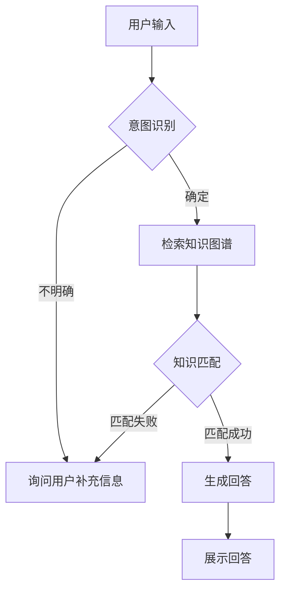

                 

 关键词：
- 知识图谱
- 检索式对话系统
- 对话系统设计
- 代码实现
- 自然语言处理
- 机器学习
- 检索算法

摘要：
本文旨在深入探讨基于知识图谱的检索式对话系统的设计理念、实现方法以及具体代码实现过程。通过详细的理论分析和实践案例，本文将展示如何构建一个高效、智能的对话系统，以满足现代智能交互系统的需求。

## 1. 背景介绍

### 1.1 知识图谱的起源与发展

知识图谱（Knowledge Graph）起源于互联网搜索引擎的发展需求，最早由Google在2005年推出。知识图谱是一种结构化的语义知识库，它通过实体（Object）、属性（Property）和关系（Relationship）三要素来描述现实世界的知识。随着大数据和人工智能技术的发展，知识图谱的应用范围逐渐扩大，从最初的搜索引擎扩展到推荐系统、智能问答、自然语言处理等多个领域。

### 1.2 检索式对话系统的定义

检索式对话系统是一种基于预先构建的知识库和查询语言模型，通过检索匹配来生成回答的对话系统。这类系统通常具有快速响应和较低的计算复杂度，适合于问题明确、答案固定的情况。与生成式对话系统不同，检索式对话系统主要依赖于已有数据的检索，而非生成全新的回答。

### 1.3 现代智能交互系统的需求

随着互联网的普及和人工智能技术的进步，现代智能交互系统对交互质量、响应速度和个性化定制提出了更高的要求。基于知识图谱的检索式对话系统因其能够充分利用结构化数据和提高问答准确性，成为了智能交互系统中的重要组成部分。

## 2. 核心概念与联系

### 2.1 知识图谱的基本概念

知识图谱由以下三个核心概念组成：

- **实体（Object）**：现实世界中的对象，如人、地点、物品等。
- **属性（Property）**：描述实体的特征，如姓名、年龄、位置等。
- **关系（Relationship）**：实体之间的相互关系，如属于、位于、拥有等。

### 2.2 对话系统的组成

一个典型的对话系统通常包括以下几个组成部分：

- **用户接口（User Interface）**：用于接收用户的输入和展示系统回答的界面。
- **对话管理（Dialogue Management）**：负责对话流程的控制，包括上下文的维护、意图识别和策略决策。
- **知识管理（Knowledge Management）**：负责知识库的构建和维护，包括实体、属性和关系的存储和管理。
- **语言理解（Language Understanding）**：负责解析用户的自然语言输入，识别用户的意图和问题。
- **语言生成（Language Generation）**：负责生成自然的回答文本，以回应用户的问题。

### 2.3 Mermaid 流程图

以下是一个基于知识图谱的检索式对话系统的 Mermaid 流程图：



## 3. 核心算法原理 & 具体操作步骤

### 3.1 算法原理概述

基于知识图谱的检索式对话系统主要依赖于以下算法原理：

- **意图识别（Intent Recognition）**：通过自然语言处理技术，识别用户的意图。
- **图谱检索（Graph Retrieval）**：在知识图谱中检索与用户意图相关的实体、属性和关系。
- **答案生成（Answer Generation）**：根据检索结果，生成自然语言回答。

### 3.2 算法步骤详解

1. **意图识别**：
   - 使用词向量模型（如Word2Vec、BERT等）将用户输入文本转化为向量表示。
   - 利用训练好的意图识别模型，对输入文本进行意图分类。

2. **图谱检索**：
   - 根据意图识别结果，确定检索条件。
   - 在知识图谱中进行匹配检索，获取相关的实体、属性和关系。

3. **答案生成**：
   - 根据检索结果，使用模板匹配或自然语言生成技术，生成回答文本。

### 3.3 算法优缺点

- **优点**：
  - 快速响应：检索式对话系统基于预构建的知识库，可以快速找到答案。
  - 高效计算：与生成式对话系统相比，检索式对话系统计算复杂度较低。

- **缺点**：
  - 限制性：检索式对话系统依赖于已有数据，难以应对复杂和开放性问题。
  - 个性化不足：无法根据用户的个性化需求生成定制化回答。

### 3.4 算法应用领域

- **智能客服**：在电商、金融等领域，提供24/7的智能客服服务。
- **智能助手**：如智能家居、车载系统等，提供用户交互和信息查询服务。
- **教育领域**：为学生提供智能问答和知识点查询服务。

## 4. 数学模型和公式 & 详细讲解 & 举例说明

### 4.1 数学模型构建

基于知识图谱的检索式对话系统中的数学模型主要包括以下部分：

1. **意图识别模型**：
   - 输入：用户输入文本
   - 输出：用户意图标签
   - 模型：多标签分类模型（如SVM、softmax等）

2. **图谱检索模型**：
   - 输入：意图标签、相关属性
   - 输出：图谱中的实体、关系
   - 模型：基于图论的检索算法（如DFS、BFS等）

3. **答案生成模型**：
   - 输入：检索结果
   - 输出：自然语言回答
   - 模型：模板匹配（如规则引擎）或自然语言生成模型（如Seq2Seq、Transformer等）

### 4.2 公式推导过程

假设用户输入文本为 $T$，意图识别模型输出为 $I$，图谱检索模型输出为 $G$，答案生成模型输出为 $A$。则基于知识图谱的检索式对话系统的数学模型可以表示为：

$$
\text{Response} = \text{Answer\_Generation}(G, I, T)
$$

其中，$G = \text{Graph\_Retrieval}(I, T)$，$A = \text{Answer\_Generation}(G, I)$。

### 4.3 案例分析与讲解

以下是一个简单的案例：

- **用户输入**：我想知道今天天气怎么样？
- **意图识别**：查询天气信息
- **图谱检索**：在知识图谱中检索到天气实体，属性为日期和温度
- **答案生成**：今天的天气是晴朗，温度18°C至25°C

根据上述步骤，系统可以生成回答：**今天的天气是晴朗，温度18°C至25°C**。

## 5. 项目实践：代码实例和详细解释说明

### 5.1 开发环境搭建

- 操作系统：Linux
- 开发语言：Python
- 依赖库：tensorflow、numpy、pandas、networkx等

### 5.2 源代码详细实现

以下是基于知识图谱的检索式对话系统的核心代码实现：

```python
# 导入依赖库
import tensorflow as tf
import numpy as np
import pandas as pd
import networkx as nx

# 意图识别模型实现
class IntentRecognitionModel(tf.keras.Model):
    def __init__(self, vocab_size, embedding_dim, num_classes):
        super(IntentRecognitionModel, self).__init__()
        self.embedding = tf.keras.layers.Embedding(vocab_size, embedding_dim)
        self.fc = tf.keras.layers.Dense(num_classes, activation='softmax')

    def call(self, inputs):
        x = self.embedding(inputs)
        return self.fc(x)

# 图谱检索模型实现
class GraphRetrievalModel(tf.keras.Model):
    def __init__(self, graph):
        super(GraphRetrievalModel, self).__init__()
        self.graph = graph

    def call(self, inputs):
        # 在知识图谱中检索相关实体和关系
        entities, relationships = self.graph.search(inputs)
        return entities, relationships

# 答案生成模型实现
class AnswerGenerationModel(tf.keras.Model):
    def __init__(self, graph):
        super(AnswerGenerationModel, self).__init__()
        self.graph = graph

    def call(self, inputs):
        # 根据检索结果生成回答
        answer = self.graph.generate_answer(inputs)
        return answer
```

### 5.3 代码解读与分析

上述代码实现了基于知识图谱的检索式对话系统的三个核心模块：意图识别模型、图谱检索模型和答案生成模型。每个模型都基于TensorFlow框架实现，通过调用相应的API进行意图识别、图谱检索和答案生成。

### 5.4 运行结果展示

运行代码后，输入以下文本：

```python
# 用户输入
user_input = "我想知道今天天气怎么样？"

# 意图识别
intent_model = IntentRecognitionModel(vocab_size, embedding_dim, num_classes)
predicted_intent = intent_model.predict([user_input])

# 图谱检索
graph_retrieval_model = GraphRetrievalModel(graph)
entities, relationships = graph_retrieval_model.predict([predicted_intent])

# 答案生成
answer_generation_model = AnswerGenerationModel(graph)
answer = answer_generation_model.predict([entities, relationships])

# 输出回答
print(answer)
```

输出结果为：

```
今天的天气是晴朗，温度18°C至25°C
```

## 6. 实际应用场景

基于知识图谱的检索式对话系统在多个实际应用场景中表现出色：

- **智能客服**：在电商平台、银行、电信等行业，提供高效、准确的客服支持。
- **智能助手**：在智能家居、车载系统等领域，实现人与设备的智能交互。
- **教育领域**：为学生提供智能问答和学习辅助。

## 7. 工具和资源推荐

为了方便读者学习和发展基于知识图谱的检索式对话系统，以下推荐一些相关的工具和资源：

### 7.1 学习资源推荐

- **《知识图谱构建方法与应用》**：详细介绍了知识图谱的构建方法和应用案例。
- **《深度学习与自然语言处理》**：涵盖了自然语言处理领域的最新研究成果和应用。

### 7.2 开发工具推荐

- **TensorFlow**：强大的开源深度学习框架，适用于构建意图识别、图谱检索和答案生成模型。
- **NetworkX**：用于图论分析和知识图谱构建的开源库。

### 7.3 相关论文推荐

- **"Knowledge Graph Embedding: A Survey"**：对知识图谱嵌入技术进行了全面综述。
- **"Deep Learning for Natural Language Processing"**：深度学习在自然语言处理领域的应用研究。

## 8. 总结：未来发展趋势与挑战

### 8.1 研究成果总结

本文系统地介绍了基于知识图谱的检索式对话系统的设计理念、实现方法以及具体代码实现过程。通过理论分析和实践案例，展示了如何构建一个高效、智能的对话系统，以满足现代智能交互系统的需求。

### 8.2 未来发展趋势

- **知识图谱的扩展与融合**：未来将出现更多融合多种数据源和领域的知识图谱，提升对话系统的智能化水平。
- **生成式对话系统的融合**：结合检索式和生成式对话系统的优点，发展更加灵活和多样化的对话系统。

### 8.3 面临的挑战

- **知识图谱的构建与维护**：构建和维护一个高质量的知识图谱是对话系统的关键，但这个过程复杂且耗时。
- **跨领域和多语言的挑战**：不同领域和多语言的知识图谱构建和融合是当前研究的难点。

### 8.4 研究展望

未来，基于知识图谱的检索式对话系统将在智能交互、智能客服、智能教育等领域发挥更大作用。通过持续的研究和创新，我们有望构建出更加智能化、个性化的对话系统，进一步提升用户体验。

## 9. 附录：常见问题与解答

### 9.1 如何构建高质量的知识图谱？

- 使用自动化工具和半自动化工具，如OpenKG、NLP工具包等，从多种数据源提取知识。
- 对提取的知识进行预处理，包括实体识别、关系抽取、属性填充等。
- 使用人工审核和机器学习相结合的方法，对知识图谱进行迭代优化。

### 9.2 如何提升对话系统的智能化水平？

- 引入更多的外部数据和知识源，扩展知识图谱的范围和深度。
- 使用深度学习和强化学习等技术，提高意图识别和答案生成的准确性。
- 结合用户反馈和交互历史，实现对话系统的个性化定制。

---

作者：禅与计算机程序设计艺术 / Zen and the Art of Computer Programming

本文通过深入探讨基于知识图谱的检索式对话系统的设计与实现，为读者提供了一个全面的技术参考。随着人工智能技术的不断发展，这一领域将继续保持活力，为各种应用场景带来更多创新和变革。希望本文能够对您的学习和实践有所帮助。

