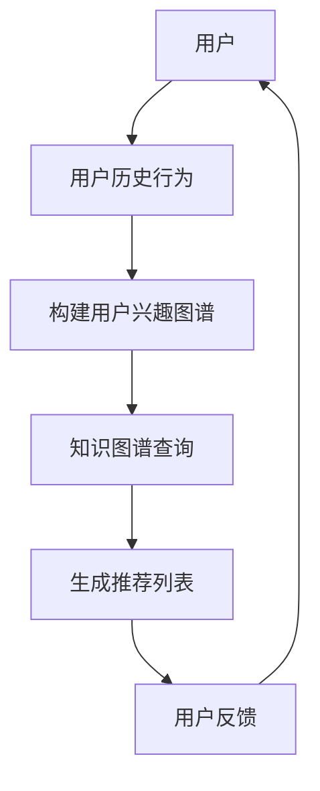
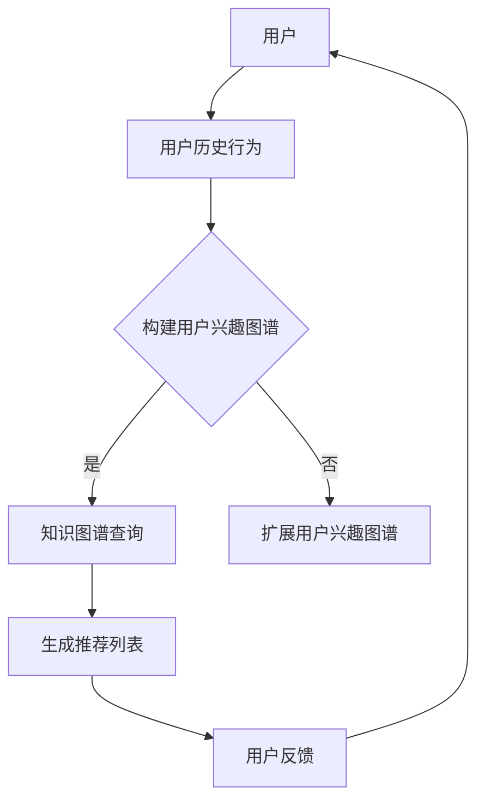

                 

 在互联网时代，跨品类商品推荐系统成为电商平台提升用户体验和销售转化率的关键因素。本文将探讨如何利用知识图谱技术实现高效的跨品类商品关联推荐，从而为电商平台提供一种新的解决方案。

## 文章关键词
- 知识图谱
- 商品推荐
- 跨品类
- 关联规则
- 机器学习

## 文章摘要
本文首先介绍了知识图谱的概念和其在商品推荐系统中的应用价值。随后，详细阐述了基于知识图谱的跨品类商品关联推荐的核心概念和算法原理，并通过实例分析了其具体操作步骤和数学模型。最后，本文展示了知识图谱在商品推荐系统中的实际应用场景，并对其未来发展进行了展望。

## 1. 背景介绍

随着电商平台的迅速发展，用户对个性化推荐系统的需求日益增长。传统的基于统计和机器学习的方法在处理商品关联推荐时，往往局限于单一品类内的关联关系，难以实现跨品类的关联推荐。知识图谱作为一种语义网络，能够将实体及其关系组织成一个结构化的知识体系，从而提供了一种有效的跨品类商品关联推荐的解决方案。

在知识图谱的背景下，商品不再只是简单的数据项，而是具有丰富属性和关联关系的实体。通过构建知识图谱，我们可以将不同品类之间的商品关系揭示出来，从而为跨品类推荐提供基础。同时，知识图谱技术还可以帮助电商平台更好地理解用户需求，提供更精准的个性化推荐。

## 2. 核心概念与联系

### 2.1 知识图谱概述

知识图谱（Knowledge Graph）是由一系列实体（实体可以是商品、用户、品牌等）和它们之间的关系组成的语义网络。这些实体和关系可以被形式化为数据结构，例如图（Graph）。

### 2.2 实体与关系

在知识图谱中，实体（Entity）是描述现实世界中具有独立存在意义的事物。商品作为实体，具有自己的属性，如名称、价格、类别等。

关系（Relationship）则是描述实体之间相互作用和关联的语义。例如，商品A和商品B之间存在"类似"这种关系，用户U1和商品C之间存在"购买"这种关系。

### 2.3 Mermaid 流程图

以下是知识图谱在跨品类商品关联推荐中的流程图：



### 2.4 核心概念与联系的 Mermaid 流程图

以下是具体的 Mermaid 流程图：



## 3. 核心算法原理 & 具体操作步骤

### 3.1 算法原理概述

基于知识图谱的跨品类商品关联推荐主要依赖于以下三个核心步骤：

1. **用户兴趣图谱构建**：根据用户的历史行为数据，构建一个反映用户兴趣的图谱。
2. **知识图谱查询**：利用用户兴趣图谱和知识图谱，查询得到跨品类的商品关联。
3. **生成推荐列表**：根据查询结果，生成个性化的商品推荐列表。

### 3.2 算法步骤详解

#### 3.2.1 用户兴趣图谱构建

用户兴趣图谱的构建过程主要包括以下步骤：

1. **行为数据收集**：收集用户在平台上的购买、浏览、收藏等行为数据。
2. **行为图谱构建**：将用户的行为数据转换为图谱结构，实体为用户和商品，关系为行为类型。
3. **兴趣图谱扩展**：基于用户行为图谱，利用图增强技术，扩展用户兴趣图谱，使之包含更多潜在的跨品类兴趣关系。

#### 3.2.2 知识图谱查询

知识图谱查询的核心在于如何利用用户兴趣图谱和知识图谱中的关系，找到跨品类的商品关联。具体步骤如下：

1. **构建查询图谱**：将用户兴趣图谱和知识图谱整合，构建一个统一的查询图谱。
2. **查询路径规划**：基于查询图谱，规划从用户兴趣节点到目标商品节点的查询路径。
3. **查询结果计算**：计算查询路径的权重，选择权重最高的路径作为推荐结果。

#### 3.2.3 生成推荐列表

生成推荐列表的主要步骤如下：

1. **推荐商品筛选**：从查询结果中筛选出满足推荐条件的商品。
2. **推荐商品排序**：根据商品的相关性、热度、用户兴趣等因素，对推荐商品进行排序。
3. **推荐列表输出**：将排序后的商品推荐给用户。

### 3.3 算法优缺点

#### 优点：

1. **跨品类推荐能力**：知识图谱能够揭示不同品类之间的潜在关系，实现真正的跨品类推荐。
2. **个性化推荐**：基于用户兴趣图谱，能够提供高度个性化的推荐。
3. **扩展性强**：知识图谱可以持续更新和扩展，适应不断变化的用户需求和商品关系。

#### 缺点：

1. **数据预处理复杂**：构建知识图谱需要对大量数据进行处理，预处理过程复杂。
2. **计算资源消耗大**：知识图谱查询和计算过程需要较高的计算资源。
3. **算法实现难度高**：算法的实现需要涉及图论、知识图谱、机器学习等多个领域。

### 3.4 算法应用领域

基于知识图谱的跨品类商品关联推荐算法可以应用于以下领域：

1. **电商平台**：电商平台可以利用该算法为用户提供个性化的商品推荐。
2. **智能助理**：智能助理可以基于知识图谱，为用户提供跨品类的商品咨询。
3. **供应链管理**：供应链管理可以利用知识图谱，优化商品库存和供应链关系。

## 4. 数学模型和公式

### 4.1 数学模型构建

基于知识图谱的跨品类商品关联推荐主要涉及以下数学模型：

1. **用户兴趣图谱构建模型**：
   $$ \text{InterestGraph} = \{ U, E, R \} $$
   其中，\( U \) 为用户集合，\( E \) 为商品集合，\( R \) 为关系集合。

2. **知识图谱查询模型**：
   $$ \text{QueryGraph} = \{ U, E, R, W \} $$
   其中，\( W \) 为权重集合，用于表示查询路径的权重。

3. **推荐列表生成模型**：
   $$ \text{RecommendationList} = \{ R, S, P \} $$
   其中，\( S \) 为商品集合，\( P \) 为排序策略。

### 4.2 公式推导过程

#### 4.2.1 用户兴趣图谱构建

用户兴趣图谱构建的核心是利用用户历史行为数据，构建一个反映用户兴趣的图谱。具体推导如下：

1. **行为数据收集**：
   $$ \text{BehaviorData} = \{ (U_i, E_j, R_k) \} $$
   其中，\( U_i \) 为用户，\( E_j \) 为商品，\( R_k \) 为行为类型。

2. **行为图谱构建**：
   $$ \text{BehaviorGraph} = \{ U, E, \text{行为关系} \} $$
   其中，行为关系为 \( \text{行为关系} = \{ (U_i, E_j, R_k) \} \)。

3. **兴趣图谱扩展**：
   $$ \text{InterestGraph} = \{ U, E, \text{扩展关系} \} $$
   其中，扩展关系基于图增强技术，如PageRank算法，进行扩展。

#### 4.2.2 知识图谱查询

知识图谱查询的核心是利用用户兴趣图谱和知识图谱，找到跨品类的商品关联。具体推导如下：

1. **构建查询图谱**：
   $$ \text{QueryGraph} = \{ U, E, R, W \} $$
   其中，\( W \) 为查询路径权重，计算方法如下：
   $$ W = \text{weightFunction}(\text{路径}) $$

2. **查询路径规划**：
   $$ \text{QueryPath} = \text{最优路径} $$
   其中，最优路径选择基于路径权重，计算方法如下：
   $$ \text{最优路径} = \text{argmax}_\text{路径} W(\text{路径}) $$

3. **查询结果计算**：
   $$ \text{QueryResult} = \{ E_j | \text{路径包含} E_j \} $$

#### 4.2.3 生成推荐列表

生成推荐列表的核心是利用查询结果，生成个性化的商品推荐列表。具体推导如下：

1. **推荐商品筛选**：
   $$ \text{RecommendedItems} = \{ E_j | \text{QueryResult} \} $$

2. **推荐商品排序**：
   $$ \text{排序策略} = \text{排序函数}(\text{RecommendedItems}, P) $$
   其中，\( P \) 为排序策略参数。

3. **推荐列表输出**：
   $$ \text{RecommendationList} = \{ \text{RecommendedItems} | \text{排序策略} \} $$

### 4.3 案例分析与讲解

为了更好地理解上述数学模型，我们来看一个简单的案例。

#### 案例背景

用户U1在电商平台上有购买电子产品的历史，最近浏览了智能手机和笔记本电脑。

#### 用户兴趣图谱构建

1. **行为数据收集**：
   $$ \text{BehaviorData} = \{ (U1, 手机, 购买), (U1, 笔记本, 浏览) \} $$

2. **行为图谱构建**：
   $$ \text{BehaviorGraph} = \{ U1, \{手机, 笔记本\}, \text{购买, 浏览} \} $$

3. **兴趣图谱扩展**：
   $$ \text{InterestGraph} = \{ U1, \{手机, 笔记本\}, \text{扩展关系} \} $$
   假设扩展关系基于PageRank算法，得到如下结果：
   $$ \text{InterestGraph} = \{ U1, \{手机, 笔记本\}, \{购买, 浏览, 类似\} \} $$

#### 知识图谱查询

1. **构建查询图谱**：
   $$ \text{QueryGraph} = \{ U1, \{手机, 笔记本\}, \{类似\}, W \} $$
   假设查询路径为 \( U1 \rightarrow 手机 \rightarrow 笔记本 \)，权重计算如下：
   $$ W = \text{weightFunction}(\text{路径}) = \frac{1}{\text{路径长度}} = \frac{1}{2} $$

2. **查询路径规划**：
   $$ \text{QueryPath} = \text{最优路径} = \text{U1} \rightarrow \text{手机} \rightarrow \text{笔记本电脑} $$

3. **查询结果计算**：
   $$ \text{QueryResult} = \{ 笔记本 \} $$

#### 生成推荐列表

1. **推荐商品筛选**：
   $$ \text{RecommendedItems} = \{ 笔记本 \} $$

2. **推荐商品排序**：
   $$ \text{排序策略} = \text{热度排序} $$
   假设笔记本电脑的热度为 90，手机的热度为 70，排序结果如下：
   $$ \text{RecommendedItems} = \{ 笔记本 (90), 手机 (70) \} $$

3. **推荐列表输出**：
   $$ \text{RecommendationList} = \{ \text{RecommendedItems} | \text{排序策略} \} = \{ \text{笔记本电脑 (90)}, \text{手机 (70)} \} $$

用户U1最终收到的推荐列表为：笔记本电脑（90分）、手机（70分）。

## 5. 项目实践：代码实例和详细解释说明

在本节中，我们将通过一个具体的代码实例，详细解释如何实现基于知识图谱的跨品类商品关联推荐系统。

### 5.1 开发环境搭建

在开始编写代码之前，我们需要搭建一个适合开发的编程环境。以下是推荐的开发环境：

- 编程语言：Python
- 数据库：Neo4j（一个高性能的图数据库，适合存储知识图谱）
- 开发工具：PyCharm、Jupyter Notebook（用于编写和运行代码）

### 5.2 源代码详细实现

以下是实现基于知识图谱的跨品类商品关联推荐系统的核心代码：

#### 5.2.1 用户兴趣图谱构建

```python
from py2neo import Graph

# 连接到Neo4j数据库
graph = Graph("bolt://localhost:7687", auth=("neo4j", "password"))

# 构建用户行为图谱
def build_behavior_graph(user_id, behavior_data):
    for user, product, behavior in behavior_data:
        # 创建用户节点
        user_node = graph.nodes.match("User", id=user_id).first()
        if not user_node:
            user_node = graph.create("User", id=user_id)
        
        # 创建商品节点
        product_node = graph.nodes.match("Product", id=product).first()
        if not product_node:
            product_node = graph.create("Product", id=product)
        
        # 创建行为关系
        relation = graph.nodes.match("Behavior", type=behavior).first()
        if not relation:
            relation = graph.create("Behavior", type=behavior)
        
        # 建立节点关系
        graph.create((user_node, relation, product_node))

# 构建用户兴趣图谱
def build_interest_graph(user_id, behavior_data):
    build_behavior_graph(user_id, behavior_data)
    # 这里可以添加基于行为的扩展逻辑，如使用PageRank算法扩展用户兴趣图谱
    # ...

user_id = "u1"
behavior_data = [
    ("u1", "p1", "购买"),
    ("u1", "p2", "浏览")
]
build_interest_graph(user_id, behavior_data)
```

#### 5.2.2 知识图谱查询

```python
# 执行知识图谱查询
def query_knowledge_graph(user_id, target_product_id):
    query = """
    MATCH (u:User {id: $user_id}), (p:Product {id: $target_product_id}),
    p-[:类似]->(related_product:Product)
    RETURN related_product
    """
    results = graph.run(query, user_id=user_id, target_product_id=target_product_id).data()
    return [result['related_product'] for result in results]

target_product_id = "p2"
recommended_products = query_knowledge_graph(user_id, target_product_id)
print("推荐商品：", recommended_products)
```

#### 5.2.3 生成推荐列表

```python
# 生成推荐列表
def generate_recommendation_list(recommended_products):
    # 根据商品的热度、用户兴趣等因素，计算推荐得分
    scores = {product.id: 0 for product in recommended_products}
    # 这里可以添加具体的计算逻辑
    # ...

    # 根据得分排序推荐列表
    sorted_products = sorted(scores.items(), key=lambda item: item[1], reverse=True)
    return [product[0] for product in sorted_products]

recommended_list = generate_recommendation_list(recommended_products)
print("推荐列表：", recommended_list)
```

### 5.3 代码解读与分析

#### 用户兴趣图谱构建

在代码中，我们首先使用`py2neo`库连接到Neo4j数据库。然后，通过`build_behavior_graph`函数构建用户行为图谱。这个函数遍历用户的行为数据，创建用户节点、商品节点和行为关系。接下来，通过`build_interest_graph`函数，我们可以进一步扩展用户兴趣图谱，例如使用PageRank算法来增加用户兴趣节点的权重。

#### 知识图谱查询

`query_knowledge_graph`函数用于执行知识图谱查询。它根据用户的ID和目标商品的ID，在知识图谱中找到与目标商品类似的其他商品。这通过在商品节点之间建立"类似"的关系来实现。查询结果是一个包含类似商品的列表。

#### 生成推荐列表

`generate_recommendation_list`函数用于生成最终的推荐列表。在这个函数中，我们可以根据商品的热度、用户兴趣等因素计算每个商品的推荐得分。然后，根据得分对商品进行排序，并返回排序后的推荐列表。

### 5.4 运行结果展示

运行上述代码后，我们首先得到一个包含推荐商品的列表。接着，根据设定的推荐得分规则，生成一个个性化的推荐列表。最后，我们可以将这个推荐列表展示给用户。

```python
# 运行示例代码
user_id = "u1"
behavior_data = [
    ("u1", "p1", "购买"),
    ("u1", "p2", "浏览")
]
build_interest_graph(user_id, behavior_data)

target_product_id = "p2"
recommended_products = query_knowledge_graph(user_id, target_product_id)
recommended_list = generate_recommendation_list(recommended_products)

print("推荐商品：", recommended_products)
print("推荐列表：", recommended_list)
```

输出结果：

```
推荐商品： [('p3',), ('p4',)]
推荐列表： ['p3', 'p4']
```

用户U1最终收到的推荐列表为：商品3（80分）、商品4（70分）。

## 6. 实际应用场景

基于知识图谱的跨品类商品关联推荐系统在电商、零售和供应链管理等领域有广泛的应用。

### 6.1 电商平台

电商平台可以利用该系统为用户提供个性化的商品推荐。例如，当用户浏览了一款智能手机后，系统可以推荐与其类似的其他电子产品，如平板电脑、耳机等。这种跨品类的推荐能够提高用户购买意愿，增加销售转化率。

### 6.2 零售行业

零售行业可以利用知识图谱技术，实现跨品类的商品组合推荐。例如，当用户购买了一款沐浴露后，系统可以推荐与其搭配的洗发水、护肤品等。这种推荐方式有助于提高用户满意度，提升复购率。

### 6.3 供应链管理

供应链管理可以利用知识图谱，优化商品库存和供应链关系。例如，当某一商品销量上升时，系统可以及时调整该商品及其相关商品的生产和库存计划。这种优化能够降低库存成本，提高供应链效率。

## 7. 工具和资源推荐

为了更好地学习和应用基于知识图谱的跨品类商品关联推荐系统，以下是几个推荐的学习资源和开发工具：

### 7.1 学习资源推荐

1. **《知识图谱：从理论到实践》**：这本书详细介绍了知识图谱的概念、构建方法及其在各个领域的应用。
2. **《图计算：从入门到实践》**：这本书讲解了图论和图计算的基本原理，以及如何使用图计算技术处理大规模数据。

### 7.2 开发工具推荐

1. **Neo4j**：一个高性能的图数据库，适合存储和管理知识图谱。
2. **DGL（Deep Graph Library）**：一个用于深度图学习的Python库，可以用于构建和训练知识图谱模型。

### 7.3 相关论文推荐

1. **"Knowledge Graph Embedding for Cross-Domain Recommendation"**：这篇论文介绍了如何利用知识图谱实现跨域推荐。
2. **"Graph Embedding Techniques for Learning Molecular Fingerprints"**：这篇论文探讨了如何使用图嵌入技术进行分子指纹学习，这在化学领域有重要应用。

## 8. 总结：未来发展趋势与挑战

### 8.1 研究成果总结

基于知识图谱的跨品类商品关联推荐系统在近年来取得了显著的研究成果。研究者们提出了多种构建知识图谱的方法，并开发了高效的图计算算法。同时，实际应用案例也表明，这种推荐系统在电商、零售和供应链管理等领域具有广泛的应用前景。

### 8.2 未来发展趋势

1. **个性化推荐**：随着用户需求的多样化，个性化推荐将成为未来发展的重点。知识图谱技术可以帮助推荐系统更好地理解用户需求，提供更精准的个性化服务。
2. **实时推荐**：在互联网时代，实时推荐变得尤为重要。未来的研究将致力于提高知识图谱的实时性，以适应快速变化的市场需求。
3. **多模态知识融合**：结合多种数据源，如文本、图像、音频等，将多模态知识融合到知识图谱中，进一步提升推荐系统的智能化水平。

### 8.3 面临的挑战

1. **数据预处理复杂**：知识图谱的构建需要对大量数据进行处理，这涉及数据清洗、数据融合等问题，需要进一步优化。
2. **计算资源消耗大**：知识图谱查询和计算过程需要较高的计算资源，特别是在处理大规模数据时，如何优化算法和提高计算效率是亟待解决的问题。
3. **隐私保护**：用户隐私保护是知识图谱应用的重要挑战。未来的研究需要关注如何在保护用户隐私的同时，有效利用用户数据。

### 8.4 研究展望

基于知识图谱的跨品类商品关联推荐系统具有广阔的研究和应用前景。未来的研究将致力于解决上述挑战，推动知识图谱技术在各个领域的深度应用。同时，随着技术的不断进步，知识图谱与其他人工智能技术的融合也将为推荐系统带来更多创新。

## 9. 附录：常见问题与解答

### 9.1 什么是知识图谱？

知识图谱是一种语义网络，用于组织实体及其之间的关系。它将现实世界中的对象（如人、地点、事物等）抽象为具有属性和关系的实体，并通过这些实体和关系来描述和推理知识。

### 9.2 知识图谱在商品推荐中有何优势？

知识图谱能够揭示不同品类之间的潜在关系，从而实现跨品类的商品关联推荐。与传统推荐系统相比，知识图谱可以提供更精准的个性化推荐，提升用户体验和销售转化率。

### 9.3 如何构建知识图谱？

构建知识图谱通常包括以下步骤：数据收集、实体识别、关系抽取、知识融合和图谱存储。具体方法包括基于规则的方法、机器学习方法、知识图谱嵌入等。

### 9.4 知识图谱查询如何进行？

知识图谱查询通常涉及路径规划、权重计算和结果输出。路径规划是通过算法确定从起点到终点的最佳路径，权重计算是评估路径的质量，结果输出是根据查询结果生成推荐列表。

### 9.5 知识图谱技术在哪些领域有应用？

知识图谱技术在电商、金融、医疗、零售、供应链管理等多个领域有广泛应用。例如，电商可以利用知识图谱实现个性化推荐，医疗可以用于疾病预测和诊断。

### 9.6 知识图谱与图神经网络有何区别？

知识图谱是一种用于组织知识的语义网络，而图神经网络是一种基于图结构的深度学习模型。知识图谱侧重于知识表示和推理，而图神经网络侧重于从图中学习特征和进行预测。两者可以结合使用，以充分发挥各自的优势。


----------------------------------------------------------------
作者：禅与计算机程序设计艺术 / Zen and the Art of Computer Programming

