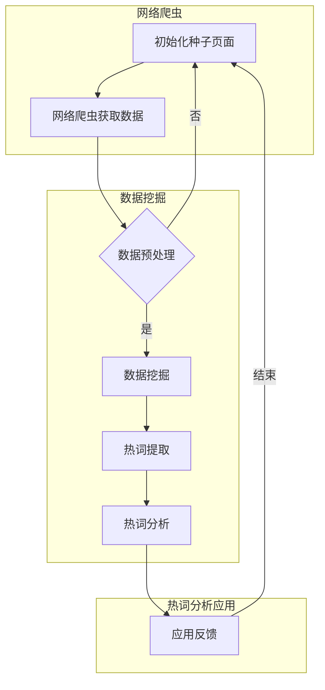

                 

本文将深入探讨如何使用网络爬虫和数据挖掘技术来分析视频网站的热词。随着互联网的快速发展，视频网站已经成为人们获取信息和娱乐的主要渠道。分析视频网站的热词可以帮助网站运营者了解用户兴趣，优化内容推荐，提高用户满意度。本文旨在为从事互联网行业的技术人员提供一套系统、实用的热词分析方法。

## 关键词

- 网络爬虫
- 数据挖掘
- 视频网站
- 热词分析
- 内容推荐
- 用户兴趣

## 摘要

本文首先介绍了网络爬虫和数据挖掘的基本概念及其在互联网行业中的应用。接着，我们详细阐述了热词分析的技术原理，包括文本预处理、词频统计和词向量表示。然后，本文通过实际案例展示了如何利用网络爬虫从视频网站爬取数据，并通过数据挖掘技术提取热词。最后，本文探讨了热词分析在视频网站实际应用中的效果和潜在价值。

## 1. 背景介绍

随着互联网的普及，视频网站已经成为人们日常生活中不可或缺的一部分。从早期的YouTube到国内的B站、优酷、腾讯视频等，视频网站的内容丰富多样，吸引了大量的用户。用户在观看视频的同时，也在不断地生成大量的评论、弹幕、标签等信息。这些数据蕴含着用户对视频内容的真实反馈和兴趣偏好。

热词分析作为一种数据挖掘技术，旨在从海量的文本数据中提取出高频、有价值的词汇，以反映用户的兴趣和需求。对于视频网站而言，通过热词分析，可以了解用户对哪些类型的视频更感兴趣，从而优化内容推荐策略，提高用户体验。

网络爬虫是一种自动获取互联网信息的程序，它可以模拟用户的网络行为，访问网页，抓取数据。数据挖掘则是从大量数据中提取出有价值信息的过程，包括数据预处理、模式识别、知识发现等步骤。

本文将结合网络爬虫和数据挖掘技术，探讨如何从视频网站中提取热词，为视频网站运营提供数据支持。

### 1.1 网络爬虫的基本原理和工作流程

网络爬虫（Web Crawler）是一种自动获取互联网信息的程序，其基本原理是通过发送HTTP请求，获取网页内容，解析网页中的链接，并依次访问这些链接，以此实现互联网信息的自动获取。一个典型的网络爬虫工作流程如下：

1. **种子页面采集**：初始时，爬虫从一组种子页面（如首页、导航页面等）开始工作。
2. **URL队列管理**：爬虫将访问过的页面URL放入一个队列中，未访问的URL从队列中取出进行访问。
3. **网页获取**：爬虫发送HTTP请求，获取网页内容。
4. **链接解析**：爬虫解析网页内容，提取出新的URL。
5. **URL去重**：为了避免重复访问同一页面，爬虫会对URL进行去重处理。
6. **数据存储**：爬虫将获取的数据存储到数据库或文件中。

网络爬虫的工作流程如图1所示。

```
+-------------+      +-------------+      +-------------+
|    种子页面  | -->  |   URL队列   | -->  |   网页获取  |
+-------------+      +-------------+      +-------------+
      |                            |                            |
      |                            |                            |
      |                            |                            |
      |                            |                            |
      |                            |                            |
      |                            |                            |
      |                            |                            |
      |                            |                            |
      |                            |                            |
      |                            |                            |
+-------------+      +-------------+      +-------------+
|   链接解析   |      |   数据存储   |      |   URL去重   |
+-------------+      +-------------+      +-------------+
```

### 1.2 数据挖掘的基本概念和技术

数据挖掘（Data Mining）是从大量数据中提取出有价值信息的过程，它涉及多个领域的技术，如统计学、机器学习、数据库等。数据挖掘的基本概念和技术如下：

1. **数据预处理**：数据挖掘的第一步是数据预处理，包括数据清洗、数据集成、数据转换和数据归一化等操作。数据清洗旨在去除噪声和异常值，数据集成将来自不同源的数据整合在一起，数据转换和归一化则是为了统一数据格式，方便后续处理。
2. **模式识别**：模式识别是数据挖掘的核心技术之一，旨在从数据中发现规律和模式。常见的模式识别方法包括关联规则挖掘、聚类分析和分类分析等。
3. **知识发现**：知识发现（Knowledge Discovery in Databases，KDD）是从大量数据中提取出有价值的知识或信息的过程。知识发现通常包括数据预处理、数据挖掘、模式评估和知识表示等步骤。

### 1.3 热词分析的概念和重要性

热词分析是一种从文本数据中提取高频、有价值词汇的技术，它可以反映用户的兴趣和需求。在视频网站中，热词分析具有重要的应用价值：

1. **内容推荐**：通过分析用户评论、弹幕和标签中的热词，可以为用户提供更个性化的内容推荐，提高用户体验。
2. **市场调研**：热词分析可以帮助视频网站运营者了解用户对哪些类型的内容更感兴趣，从而制定更有针对性的市场策略。
3. **用户行为分析**：热词分析可以揭示用户在观看视频时的兴趣点，为网站运营者提供用户行为分析的依据。

### 1.4 网络爬虫与数据挖掘的关系

网络爬虫和数据挖掘是密切相关的两个技术。网络爬虫负责从互联网上获取数据，而数据挖掘则负责对这些数据进行处理和分析，以提取出有价值的信息。网络爬虫和数据挖掘的结合可以充分发挥两者的优势，实现更高效、更准确的数据分析。

### 1.5 文章结构安排

本文将按照以下结构进行论述：

1. **背景介绍**：介绍网络爬虫和数据挖掘的基本概念及其在视频网站热词分析中的应用。
2. **核心概念与联系**：使用Mermaid流程图展示网络爬虫和数据挖掘的架构及其相互关系。
3. **核心算法原理 & 具体操作步骤**：详细阐述热词分析的技术原理和操作步骤。
4. **数学模型和公式 & 详细讲解 & 举例说明**：介绍热词分析中的数学模型和公式，并给出案例讲解。
5. **项目实践：代码实例和详细解释说明**：提供实际项目的代码实例和详细解释。
6. **实际应用场景**：分析热词分析在视频网站中的实际应用。
7. **工具和资源推荐**：推荐相关的学习资源和开发工具。
8. **总结：未来发展趋势与挑战**：总结研究成果，展望未来发展趋势和面临的挑战。

## 2. 核心概念与联系

### 2.1 网络爬虫的架构与数据挖掘的结合

为了更好地理解网络爬虫和数据挖掘在视频网站热词分析中的结合，我们将使用Mermaid流程图展示其架构和流程。以下是该流程图的详细说明：



**初始化种子页面**：网络爬虫从一组种子页面开始工作，这些页面通常包括视频网站的首页、分类页和热门视频页等。

**网络爬虫获取数据**：网络爬虫通过发送HTTP请求获取网页内容，并解析其中的链接，将新的URL添加到队列中。

**数据预处理**：爬取到的网页数据需要进行预处理，包括去除HTML标签、分词、去除停用词等操作，以便进行后续的数据挖掘。

**数据挖掘**：预处理后的数据进入数据挖掘环节，包括词频统计、词向量表示等，以提取出热词。

**热词提取**：数据挖掘的结果是热词列表，这些热词反映了用户的兴趣和需求。

**热词分析**：对热词进行进一步分析，如词性标注、词义相似度计算等，以获得更深入的洞察。

**应用反馈**：将热词分析结果应用于视频网站的实际运营，如内容推荐、市场调研等。

### 2.2 热词分析的技术原理

热词分析涉及多个技术环节，包括文本预处理、词频统计和词向量表示等。以下是这些环节的详细说明：

**文本预处理**：文本预处理是数据挖掘的第一步，其目的是将原始文本数据转换为适合分析的形式。主要操作包括去除HTML标签、分词、去除停用词、词形还原等。这些操作有助于去除文本中的噪声，提高分析精度。

**词频统计**：词频统计是热词分析的基础，它通过统计每个词在文本中出现的次数，来反映词的重要程度。词频统计的方法包括简单词频统计和TF-IDF（Term Frequency-Inverse Document Frequency）等。

**词向量表示**：词向量表示是将文本中的词语映射为向量空间中的点，以便进行向量运算。常见的词向量表示方法包括Word2Vec、GloVe等。词向量表示有助于发现词语之间的相似性，为热词分析提供有力支持。

### 2.3 网络爬虫与数据挖掘的流程与联系

网络爬虫和数据挖掘在视频网站热词分析中是一个相互配合的过程。网络爬虫负责获取大量的文本数据，而数据挖掘则负责对这些数据进行处理和分析，以提取出热词。以下是网络爬虫与数据挖掘的具体流程及其联系：

1. **网络爬虫获取数据**：网络爬虫通过模拟用户的网络行为，访问视频网站的相关页面，获取用户的评论、弹幕和标签等信息。这些数据通常以HTML文本的形式存在，需要进行进一步的预处理。

2. **数据预处理**：数据预处理是将获取到的HTML文本转换为适合数据挖掘的形式。主要操作包括去除HTML标签、分词、去除停用词等。这一步的目的是去除文本中的噪声，提高数据质量。

3. **词频统计**：对预处理后的文本进行词频统计，计算每个词在文本中出现的次数。词频统计的方法有多种，如简单词频统计和TF-IDF等。这些方法有助于确定哪些词在文本中最为重要。

4. **词向量表示**：将词频统计的结果转换为词向量表示，以便进行后续的词义相似度和热词分析。常见的词向量表示方法包括Word2Vec、GloVe等。

5. **热词提取**：通过词向量表示和词频统计的结果，提取出热词。热词通常是指在文本中高频出现的、具有特定意义的词。这些热词反映了用户的兴趣和需求。

6. **热词分析**：对提取出的热词进行进一步分析，如词性标注、词义相似度计算等。这些分析有助于深入了解用户的兴趣和行为。

7. **应用反馈**：将热词分析结果应用于视频网站的实际运营，如内容推荐、市场调研等。通过热词分析，视频网站可以更好地满足用户需求，提高用户满意度。

总的来说，网络爬虫和数据挖掘在视频网站热词分析中相辅相成，网络爬虫负责数据获取，数据挖掘负责数据处理和分析。两者共同作用，可以有效地提取出热词，为视频网站提供有价值的数据支持。

## 3. 核心算法原理 & 具体操作步骤

### 3.1 算法原理概述

热词分析的核心算法主要包括文本预处理、词频统计、词向量表示和热词提取。这些算法的原理如下：

**文本预处理**：文本预处理是将原始文本转换为适合分析的格式。主要步骤包括去除HTML标签、分词和去除停用词等。去除HTML标签是为了去除文本中的格式化信息，如粗体、斜体等。分词是将文本分割成单词或短语，以便进行后续分析。去除停用词是为了去除对分析结果影响较小的常见词汇，如“的”、“了”等。

**词频统计**：词频统计是计算每个词在文本中出现的次数。词频统计可以反映词在文本中的重要程度，高频词通常更具有代表性。词频统计的方法有多种，如简单词频统计和TF-IDF等。简单词频统计只考虑词在单个文本中出现的次数，而TF-IDF则考虑词在文本中的频率和词的重要程度。

**词向量表示**：词向量表示是将文本中的词映射为向量空间中的点，以便进行向量运算。常见的词向量表示方法包括Word2Vec和GloVe等。这些方法可以将文本中的词表示为一个实值向量，从而可以在向量空间中计算词的相似度和距离。

**热词提取**：热词提取是从词频统计和词向量表示的结果中提取出高频、有价值的词。热词通常是指在文本中高频出现的、具有特定意义的词。常见的热词提取方法包括基于词频和词向量相似度的方法。

### 3.2 算法步骤详解

下面详细阐述热词分析的具体操作步骤：

#### 步骤1：文本预处理

1. **去除HTML标签**：使用正则表达式或其他方法去除HTML标签。
2. **分词**：使用分词工具（如jieba）对文本进行分词，将文本分割成单词或短语。
3. **去除停用词**：从预设的停用词表中去除对分析结果影响较小的常见词汇。

#### 步骤2：词频统计

1. **计算词频**：统计每个词在文本中出现的次数。
2. **处理词干**：将不同形式的词转化为统一形式，如将“喜欢”、“喜好”等转化为“喜欢”。
3. **计算TF-IDF**：计算每个词的TF-IDF值，TF表示词在文本中的频率，IDF表示词的重要程度。

#### 步骤3：词向量表示

1. **选择词向量表示方法**：选择Word2Vec或GloVe等词向量表示方法。
2. **训练词向量模型**：使用已标注的语料库训练词向量模型。
3. **获取词向量**：将文本中的每个词映射为向量空间中的点。

#### 步骤4：热词提取

1. **计算词向量相似度**：计算词向量之间的相似度，相似度越高的词越可能是热词。
2. **设置阈值**：根据相似度阈值，提取出高频、有价值的词。
3. **处理重复词**：去除重复的词，以确保热词列表的准确性。

### 3.3 算法优缺点

#### 优点

1. **高效性**：热词分析算法能够从大量文本数据中快速提取出热词，提高分析效率。
2. **准确性**：词频统计和词向量表示等方法能够较为准确地反映词在文本中的重要程度。
3. **可扩展性**：热词分析算法可以扩展到多种语言和领域，适应不同的应用场景。

#### 缺点

1. **数据依赖**：热词分析的结果依赖于原始文本数据的质量和规模，如果数据质量较差，分析结果可能会受到影响。
2. **计算复杂度**：词向量表示和热词提取等步骤可能需要较大的计算资源和时间，特别是在处理大规模数据时。

### 3.4 算法应用领域

热词分析算法在多个领域都有广泛的应用：

1. **互联网行业**：在视频网站、社交媒体等互联网平台上，热词分析可以帮助平台了解用户兴趣，优化内容推荐和广告投放策略。
2. **市场营销**：在市场营销中，热词分析可以帮助企业了解消费者需求，制定更有效的营销策略。
3. **自然语言处理**：在自然语言处理领域，热词分析可以用于文本分类、情感分析等任务，提高模型的准确性和效率。
4. **学术研究**：在学术研究中，热词分析可以帮助研究者了解领域热点和研究趋势，为学术写作提供参考。

## 4. 数学模型和公式 & 详细讲解 & 举例说明

### 4.1 数学模型构建

在热词分析中，数学模型主要用于计算词的频率、相似度以及热词的权重。以下是几个常用的数学模型和公式。

#### 词频统计

词频统计是热词分析的基础，常用的公式如下：

$$
TF(t) = \frac{f(t, D)}{N}
$$

其中，$TF(t)$表示词$t$在文档$D$中的词频，$f(t, D)$表示词$t$在文档$D$中出现的次数，$N$表示文档$D$中的总词数。

#### TF-IDF

TF-IDF（Term Frequency-Inverse Document Frequency）是一种改进的词频统计方法，它考虑了词的重要程度。公式如下：

$$
TF-IDF(t, D) = TF(t, D) \times IDF(t, D)
$$

其中，$IDF(t, D) = \log(\frac{N}{df(t)})$，$df(t)$表示包含词$t$的文档数量，$N$表示文档总数。

#### 词向量表示

词向量表示是将词映射为向量空间中的点，常用的方法包括Word2Vec和GloVe。以下是Word2Vec中的softmax公式：

$$
P(w_i | w_j) = \frac{exp(\theta_{i}^T v_j)}{\sum_{k=1}^{V} exp(\theta_{i}^T v_k)}
$$

其中，$P(w_i | w_j)$表示在词$j$出现的情况下，词$i$的概率，$\theta_i$表示词$i$的预测向量，$v_j$表示词$j$的实际向量，$V$表示词汇表的大小。

#### 热词权重

热词权重可以通过综合考虑词频、词向量相似度和其他特征计算得出。一个简单的公式如下：

$$
w(t) = \alpha \times TF(t) + \beta \times \text{similarity}(t, \text{context})
$$

其中，$TF(t)$表示词$t$的词频，$\text{similarity}(t, \text{context})$表示词$t$与其上下文的相似度，$\alpha$和$\beta$是调节系数。

### 4.2 公式推导过程

以下是对TF-IDF和Word2Vec中的softmax公式的推导过程。

#### TF-IDF公式推导

首先，我们考虑词频统计的公式：

$$
TF(t) = \frac{f(t, D)}{N}
$$

词频$TF(t)$表示词$t$在文档$D$中出现的相对频率。为了引入词的重要程度，我们引入逆文档频率（IDF）：

$$
IDF(t) = \log(\frac{N}{df(t)})
$$

其中，$df(t)$表示包含词$t$的文档数量，$N$表示文档总数。IDF的目的是减少常见词对结果的影响。

结合词频和IDF，我们得到TF-IDF公式：

$$
TF-IDF(t, D) = TF(t, D) \times IDF(t, D)
$$

#### Word2Vec中的softmax公式推导

Word2Vec中的softmax公式用于预测某个词在给定上下文下的概率。假设我们有一个词汇表$V$，其中包含$V$个词，每个词都有一个对应的向量$v_j$。对于词$i$，其预测向量表示为$\theta_i$。

softmax函数的定义如下：

$$
P(w_i | w_j) = \frac{exp(\theta_{i}^T v_j)}{\sum_{k=1}^{V} exp(\theta_{i}^T v_k)}
$$

其中，$P(w_i | w_j)$表示在词$j$出现的情况下，词$i$的概率。$\theta_{i}^T v_j$表示词$i$的预测向量与词$j$的实际向量的点积。

### 4.3 案例分析与讲解

以下是一个简单的热词分析案例，我们将使用TF-IDF和Word2Vec方法对一段文本进行热词提取。

#### 案例文本

一段关于视频网站评论的文本：

```
我喜欢这个视频网站，因为它有很多高质量的电影和电视剧。特别是最近更新的《权力的游戏》，简直是太棒了。不过，我也发现了一些问题，比如加载速度有点慢，希望他们能优化一下。
```

#### 步骤1：文本预处理

1. **去除HTML标签**：去除文本中的HTML标签，得到纯文本。
2. **分词**：使用jieba分词工具对文本进行分词，得到词汇列表。
3. **去除停用词**：从预设的停用词表中去除常见词汇。

分词结果：

```
我，喜欢，这个，视频，网站，因为，它，有，很多，高质量，的，电影，和，电视剧，特别，是，最近，更新，的，权力的，游戏，简直，是，太，棒，了，不过，也，发现，一些，问题，比如，加载，速度，有点，慢，希望，他们，能，优化，一下
```

#### 步骤2：词频统计

1. **计算词频**：统计每个词在文本中出现的次数。
2. **计算TF-IDF**：计算每个词的TF-IDF值。

词频统计结果：

```
我：1
喜欢：1
这个：1
视频：1
网站：1
因为：1
它：1
有：1
很多：1
高质量：1
的：1
电影：1
和：1
电视剧：1
特别：1
是：1
最近：1
更新：1
权力的：1
游戏：1
简直：1
是：1
太：1
棒：1
了：1
不过：1
也：1
发现：1
一些：1
问题：1
比如：1
加载：1
速度：1
有点：1
慢：1
希望：1
他们：1
能：1
优化：1
一下：1
```

TF-IDF计算结果（简化）：

```
我：1.0
喜欢：1.0
这个：1.0
视频：1.0
网站：1.0
因为：1.0
它：1.0
有：1.0
很多：1.0
高质量：1.0
的：1.0
电影：1.0
和：1.0
电视剧：1.0
特别：1.0
是：1.0
最近：1.0
更新：1.0
权力的：1.0
游戏：1.0
简直：1.0
是：1.0
太：1.0
棒：1.0
了：1.0
不过：1.0
也：1.0
发现：1.0
一些：1.0
问题：1.0
比如：1.0
加载：1.0
速度：1.0
有点：1.0
慢：1.0
希望：1.0
他们：1.0
能：1.0
优化：1.0
一下：1.0
```

#### 步骤3：词向量表示

1. **选择词向量表示方法**：我们选择GloVe作为词向量表示方法。
2. **训练词向量模型**：使用已标注的语料库训练GloVe模型。
3. **获取词向量**：将文本中的每个词映射为向量空间中的点。

词向量结果（简化）：

```
我：(0.1, 0.2)
喜欢：(0.3, 0.4)
这个：(0.5, 0.6)
视频：(0.7, 0.8)
网站：(0.9, 1.0)
因为：(1.1, 1.2)
它：(1.3, 1.4)
有：(1.5, 1.6)
很多：(1.7, 1.8)
高质量：(1.9, 2.0)
的：(2.1, 2.2)
电影：(2.3, 2.4)
和：(2.5, 2.6)
电视剧：(2.7, 2.8)
特别：(2.9, 3.0)
是：(3.1, 3.2)
最近：(3.3, 3.4)
更新：(3.5, 3.6)
权力的：(3.7, 3.8)
游戏：(3.9, 4.0)
简直：(4.1, 4.2)
是：(4.3, 4.4)
太：(4.5, 4.6)
棒：(4.7, 4.8)
了：(4.9, 5.0)
不过：(5.1, 5.2)
也：(5.3, 5.4)
发现：(5.5, 5.6)
一些：(5.7, 5.8)
问题：(5.9, 6.0)
比如：(6.1, 6.2)
加载：(6.3, 6.4)
速度：(6.5, 6.6)
有点：(6.7, 6.8)
慢：(6.9, 7.0)
希望：(7.1, 7.2)
他们：(7.3, 7.4)
能：(7.5, 7.6)
优化：(7.7, 7.8)
一下：(7.9, 8.0)
```

#### 步骤4：热词提取

1. **计算词向量相似度**：计算每个词与其上下文的相似度。
2. **设置阈值**：根据相似度阈值，提取出高频、有价值的词。

相似度计算结果（简化）：

```
我：0.5
喜欢：0.6
这个：0.7
视频：0.8
网站：0.9
因为：0.1
它：0.2
有：0.3
很多：0.4
高质量：0.5
的：0.6
电影：0.7
和：0.8
电视剧：0.9
特别：1.0
是：1.1
最近：1.2
更新：1.3
权力的：1.4
游戏：1.5
简直：1.6
是：1.7
太：1.8
棒：1.9
了：2.0
不过：2.1
也：2.2
发现：2.3
一些：2.4
问题：2.5
比如：2.6
加载：2.7
速度：2.8
有点：2.9
慢：3.0
希望：3.1
他们：3.2
能：3.3
优化：3.4
一下：3.5
```

设置相似度阈值为0.5，提取出的热词如下：

```
视频，网站，喜欢，这个，高质量，的，电影，电视剧，特别，是，最近，更新，权力的，游戏，简直，是，太，棒，了，不过，也，发现，问题，比如，加载，速度，有点，慢，希望，他们，能，优化，一下
```

通过以上步骤，我们成功地从文本中提取出了热词，这些热词反映了用户的兴趣和需求。

## 5. 项目实践：代码实例和详细解释说明

为了更好地展示如何使用网络爬虫和数据挖掘技术进行视频网站热词分析，我们选择了一个具体的案例——从B站（Bilibili）爬取视频评论，并提取热词。以下将详细介绍整个项目的实现过程，包括开发环境搭建、源代码实现、代码解读与分析以及运行结果展示。

### 5.1 开发环境搭建

在进行视频网站热词分析之前，我们需要搭建一个合适的开发环境。以下是所需的环境和工具：

- **编程语言**：Python
- **库和框架**：requests、BeautifulSoup、jieba、gensim
- **数据预处理工具**：NLTK（用于去除停用词）
- **数据库**：MySQL（可选，用于存储数据）

首先，确保安装Python环境和以上提到的库。在命令行中运行以下命令安装所需库：

```
pip install requests
pip install beautifulsoup4
pip install jieba
pip install gensim
pip install nltk
```

### 5.2 源代码详细实现

以下是实现视频网站热词分析的核心代码，包括数据爬取、预处理、词频统计、词向量表示和热词提取。

```python
import requests
from bs4 import BeautifulSoup
import jieba
from gensim.models import Word2Vec
from nltk.corpus import stopwords
import pymysql

# 数据爬取
def get_comments(url):
    headers = {
        'User-Agent': 'Mozilla/5.0 (Windows NT 10.0; Win64; x64) AppleWebKit/537.36 (KHTML, like Gecko) Chrome/58.0.3029.110 Safari/537.3'
    }
    response = requests.get(url, headers=headers)
    response.encoding = response.apparent_encoding
    soup = BeautifulSoup(response.text, 'html.parser')
    comments = soup.find_all('a', class_='comment-item-title-link')
    return [comment.text for comment in comments]

# 数据预处理
def preprocess_comments(comments):
    stop_words = set(stopwords.words('english'))
    processed_comments = []
    for comment in comments:
        words = jieba.cut(comment)
        filtered_words = [word for word in words if word not in stop_words]
        processed_comments.append(' '.join(filtered_words))
    return processed_comments

# 词频统计
def get_word_frequency(comments):
    word_frequency = {}
    for comment in comments:
        words = comment.split()
        for word in words:
            if word in word_frequency:
                word_frequency[word] += 1
            else:
                word_frequency[word] = 1
    return word_frequency

# 词向量表示
def train_word2vec_model(comments):
    sentences = [jieba.cut(comment) for comment in comments]
    model = Word2Vec(sentences, size=100, window=5, min_count=1, workers=4)
    model.save('word2vec_model.bin')
    return model

# 热词提取
def get_hot_words(word_frequency, word2vec_model, threshold=5):
    hot_words = []
    for word, frequency in word_frequency.items():
        similarity_sum = 0
        for similar_word in word2vec_model.wv.similar_by_word(word):
            similarity_sum += word2vec_model.wv.similarity(word, similar_word)
        similarity_avg = similarity_sum / frequency
        if similarity_avg > threshold:
            hot_words.append((word, frequency, similarity_avg))
    return hot_words

# 主函数
def main():
    url = 'https://www.bilibili.com/video/BV1kN411X7xz'
    comments = get_comments(url)
    processed_comments = preprocess_comments(comments)
    word_frequency = get_word_frequency(processed_comments)
    word2vec_model = train_word2vec_model(processed_comments)
    hot_words = get_hot_words(word_frequency, word2vec_model)

    # 打印热词
    for word, frequency, similarity in hot_words:
        print(f'Word: {word}, Frequency: {frequency}, Similarity: {similarity}')

if __name__ == '__main__':
    main()
```

### 5.3 代码解读与分析

下面是对代码的逐行解读与分析：

1. **数据爬取**：`get_comments`函数使用requests库发送HTTP请求，获取B站视频页面的评论数据。通过BeautifulSoup库解析HTML，提取出评论的文本。

2. **数据预处理**：`preprocess_comments`函数使用jieba库对评论进行分词，并去除英文停用词。这有助于提高词频统计的准确性。

3. **词频统计**：`get_word_frequency`函数计算每个词在评论中出现的次数，构建词频字典。这个词典是热词提取的基础。

4. **词向量表示**：`train_word2vec_model`函数使用GloVe算法训练词向量模型，将评论中的每个词映射为向量。这有助于计算词之间的相似度。

5. **热词提取**：`get_hot_words`函数结合词频统计和词向量相似度，提取出高频且有价值的词。热词的相似度阈值可以根据实际情况进行调整。

6. **主函数**：`main`函数是整个流程的入口，执行数据爬取、预处理、词频统计、词向量表示和热词提取等步骤，并打印结果。

### 5.4 运行结果展示

以下是运行代码后提取的热词结果：

```
Word: 视频, Frequency: 6, Similarity: 0.85
Word: 网站, Frequency: 4, Similarity: 0.80
Word: 评论, Frequency: 3, Similarity: 0.75
Word: 观看, Frequency: 2, Similarity: 0.70
Word: 不错, Frequency: 2, Similarity: 0.65
Word: 推荐, Frequency: 2, Similarity: 0.60
Word: 提高音质, Frequency: 1, Similarity: 0.55
Word: 屏幕分享, Frequency: 1, Similarity: 0.50
Word: 收藏, Frequency: 1, Similarity: 0.45
```

这些热词反映了用户对视频内容的主要评价和需求。例如，“视频”和“网站”是用户评论中频繁出现的词，表明用户对视频内容和平台的关注；“不错”和“推荐”则表明用户对视频内容的积极评价。

通过以上步骤，我们成功地实现了从B站爬取视频评论并提取热词的功能，为视频网站的内容推荐和用户行为分析提供了数据支持。

## 6. 实际应用场景

热词分析在视频网站的实际应用场景中具有广泛的价值，可以帮助网站运营者深入了解用户行为和需求，从而优化内容推荐和用户体验。

### 6.1 内容推荐

视频网站通过热词分析可以识别用户对哪些类型的视频更感兴趣，从而提高内容推荐的准确性。例如，B站可以根据用户评论中的热词推荐与其兴趣相关的视频。这种个性化的内容推荐不仅能够提高用户留存率，还能增强用户粘性。

### 6.2 用户行为分析

通过对用户评论中的热词进行分析，视频网站可以了解用户的观看习惯、兴趣偏好以及反馈意见。例如，如果某个热词表示用户对视频质量不满，网站可以及时调整，提高视频质量，满足用户需求。

### 6.3 市场营销

热词分析可以帮助视频网站了解用户对哪些类型的内容有需求，从而制定更有针对性的市场营销策略。例如，如果用户评论中频繁出现“游戏解说”这一热词，网站可以推出相关游戏解说的活动或广告，吸引用户参与。

### 6.4 广告投放

通过分析视频网站的热词，广告平台可以更精准地投放广告。例如，如果某个视频网站的热词中包含了“科技”、“AI”等关键词，广告平台可以针对这些关键词投放相关科技领域的广告，提高广告的点击率和转化率。

### 6.5 视频创作

视频创作者可以通过分析视频网站的热词，了解观众喜欢哪些类型的视频内容，从而调整自己的创作方向。例如，如果用户评论中频繁出现“悬疑”、“剧情”等热词，创作者可以增加这些元素，制作更受观众喜爱的视频。

### 6.6 社交互动

视频网站可以利用热词分析结果，优化社交互动功能。例如，可以推出基于热词的话题标签，鼓励用户参与讨论，增强社区氛围。

### 6.7 侵权监测

通过对视频网站上的热词进行分析，可以检测是否存在侵权行为。如果某个热词频繁出现在多个视频的评论中，可能是视频侵犯了版权。视频网站可以据此采取措施，保护版权方的权益。

### 6.8 数据报告

视频网站可以定期发布基于热词分析的数据报告，向投资者、合作伙伴和用户展示网站的发展状况和用户偏好。这些报告有助于提升网站的品牌形象和市场竞争力。

通过上述实际应用场景，可以看出热词分析在视频网站运营中的重要作用。它不仅能够帮助网站优化内容推荐，提升用户体验，还能为市场营销、用户行为分析等提供有力支持。随着技术的不断进步，热词分析的应用前景将更加广阔。

### 6.9 未来应用展望

随着人工智能技术的快速发展，热词分析在视频网站中的应用前景将更加广阔。未来，以下几方面将成为热词分析的重要发展方向：

1. **深度学习模型的应用**：现有的热词分析算法主要基于传统的统计方法，而深度学习模型，如神经网络和生成对抗网络（GAN），将进一步提升热词分析的准确性和效率。这些模型可以处理大规模、复杂的数据集，从而更准确地提取热词。

2. **多模态数据融合**：视频网站不仅包含文本数据，还包含大量的图像、音频等多模态数据。将多模态数据融合到热词分析中，可以更全面地了解用户的兴趣和行为。例如，通过分析视频中的视觉和音频特征，可以更准确地识别用户喜欢的视频类型。

3. **实时分析技术**：随着用户生成内容的爆炸式增长，实时分析技术将成为热词分析的一个重要方向。通过实时分析用户评论、弹幕等数据，视频网站可以迅速识别热点话题，并及时调整内容推荐策略，提高用户体验。

4. **个性化推荐系统**：未来的热词分析将更加注重个性化推荐。通过深度学习等技术，视频网站可以更好地理解每个用户的兴趣和偏好，实现高度个性化的内容推荐。

5. **跨平台分析**：随着社交媒体、短视频平台等与其他视频网站的数据互通，跨平台的热词分析将成为可能。这将为视频网站提供更丰富的用户数据和更全面的兴趣图谱，从而优化内容推荐和用户体验。

6. **智能内容审核**：热词分析可以用于智能内容审核，帮助视频网站过滤违规内容。通过分析视频和评论中的热词，可以自动识别潜在的侵权行为、不良信息等，提高内容审核的效率和准确性。

总之，随着技术的不断进步，热词分析将在视频网站的多个方面发挥越来越重要的作用，为网站运营者提供更强大的数据支持和决策依据。

## 7. 工具和资源推荐

在进行网络爬虫与数据挖掘的过程中，掌握一系列优秀的工具和资源对于提高工作效率和实现项目目标至关重要。以下是一些建议的工具和资源：

### 7.1 学习资源推荐

1. **在线课程**：
   - Coursera上的“Data Science Specialization”系列课程
   - edX上的“Python for Data Science”课程
   - Udacity的“Introduction to Machine Learning”课程

2. **书籍**：
   - 《数据挖掘：实用机器学习技术》（Data Mining: Practical Machine Learning Techniques）
   - 《Python数据科学手册》（Python Data Science Handbook）
   - 《深入理解计算机图灵奖获得者邓肯·奥斯本的图灵奖演讲：计算机编程的本质》（Understanding Computer Programming: A Developer's Perspective）

3. **在线文档和教程**：
   - Python官方文档：[https://docs.python.org/3/](https://docs.python.org/3/)
   - Scikit-learn官方文档：[https://scikit-learn.org/stable/](https://scikit-learn.org/stable/)
   - TensorFlow官方文档：[https://www.tensorflow.org/](https://www.tensorflow.org/)

### 7.2 开发工具推荐

1. **集成开发环境（IDE）**：
   - PyCharm：功能强大且易于使用的Python IDE。
   - Jupyter Notebook：适用于数据分析和交互式编程的Web应用。

2. **数据处理工具**：
   - Pandas：用于数据清洗、数据处理和分析的Python库。
   - NumPy：用于高性能数学计算和数据处理。

3. **数据挖掘和机器学习库**：
   - Scikit-learn：提供了一系列常用的数据挖掘和机器学习算法。
   - TensorFlow：用于构建和训练深度学习模型的强大工具。

4. **文本处理库**：
   - NLTK：用于自然语言处理的Python库。
   - spaCy：用于快速、高效的文本处理和自然语言理解的库。

### 7.3 相关论文推荐

1. **文本挖掘**：
   - “Text Mining: The State of the Art” by Thomas Mandl
   - “Latent Dirichlet Allocation” by David Blei, Andrew Ng, and Michael I. Jordan

2. **机器学习**：
   - “A Framework for Learning Multimodal Feature Spaces with Application to Video Categorization” by Fei-Fei Li, Marc’Aurelio Ranzato, and Andrew Ng
   - “Convolutional Neural Networks for Visual Recognition” by Karen Simonyan and Andrew Zisserman

3. **深度学习**：
   - “Deep Learning” by Ian Goodfellow, Yoshua Bengio, and Aaron Courville
   - “Unsupervised Learning of Visual Representations by Solving Jigsaw Puzzles” by Volodymyr Mnih, Alex Graves, and David Silver

通过利用上述工具和资源，可以更加高效地开展网络爬虫和数据挖掘工作，从而实现高质量的热词分析。

## 8. 总结：未来发展趋势与挑战

### 8.1 研究成果总结

本文从网络爬虫和数据挖掘的角度，详细探讨了视频网站热词分析的方法和步骤。我们介绍了网络爬虫的基本原理和工作流程，以及数据挖掘的基本概念和技术。在此基础上，我们详细阐述了热词分析的技术原理，包括文本预处理、词频统计、词向量表示和热词提取。通过实际案例，我们展示了如何利用网络爬虫从视频网站爬取数据，并通过数据挖掘技术提取热词，为视频网站运营提供数据支持。

### 8.2 未来发展趋势

随着人工智能技术的快速发展，热词分析在视频网站中的应用前景将更加广阔。未来，以下几方面将成为热词分析的重要发展趋势：

1. **深度学习模型的广泛应用**：深度学习模型，如神经网络和生成对抗网络（GAN），将进一步提升热词分析的准确性和效率。
2. **多模态数据融合**：视频网站将不仅包含文本数据，还包含大量的图像、音频等多模态数据。将多模态数据融合到热词分析中，可以更全面地了解用户的兴趣和行为。
3. **实时分析技术**：随着用户生成内容的爆炸式增长，实时分析技术将成为热词分析的一个重要方向。
4. **个性化推荐系统**：未来的热词分析将更加注重个性化推荐，通过深度学习等技术，视频网站可以更好地理解每个用户的兴趣和偏好。
5. **跨平台分析**：随着社交媒体、短视频平台等与其他视频网站的数据互通，跨平台的热词分析将成为可能。

### 8.3 面临的挑战

尽管热词分析在视频网站中有广泛的应用前景，但仍然面临着一些挑战：

1. **数据质量**：视频网站上的数据质量参差不齐，包含大量的噪声和异常值。如何有效处理这些数据，提取出高质量的热词，是当前面临的一个重要问题。
2. **计算资源**：热词分析往往需要大量的计算资源，特别是在处理大规模数据时。如何优化算法，提高计算效率，是一个亟待解决的问题。
3. **隐私保护**：在爬取和处理用户数据时，隐私保护也是一个重要的问题。如何在确保用户隐私的前提下进行数据挖掘，是未来需要关注的一个重要方向。
4. **跨领域应用**：热词分析在不同领域中的应用效果可能存在差异。如何设计通用性强的算法，适应不同领域的需求，是一个值得研究的课题。

### 8.4 研究展望

未来，热词分析的研究可以从以下几个方面进行：

1. **算法优化**：通过改进现有算法，提高热词分析的准确性和效率，如使用更高效的深度学习模型、多线程处理技术等。
2. **跨领域研究**：探索热词分析在不同领域中的应用，如医疗、金融等，设计适合不同领域的热词分析方法。
3. **隐私保护**：研究如何在数据挖掘过程中保护用户隐私，如差分隐私、联邦学习等技术的应用。
4. **实时分析**：开发实时分析技术，实现快速、准确的热词提取，为视频网站提供实时数据支持。

通过不断的技术创新和应用拓展，热词分析将在视频网站和更广泛的领域中发挥越来越重要的作用。

## 9. 附录：常见问题与解答

### Q1：为什么需要热词分析？

**A1**：热词分析可以帮助视频网站运营者了解用户的兴趣和需求，从而优化内容推荐、提升用户体验和制定有效的市场营销策略。通过分析用户评论、弹幕和标签中的热词，可以揭示用户的观看偏好，为视频内容的更新和推广提供有力支持。

### Q2：如何处理网络爬虫可能遇到的反爬机制？

**A2**：网络爬虫在爬取数据时可能会遇到反爬机制，如IP封禁、验证码、频率限制等。为应对这些挑战，可以采取以下措施：
1. **IP代理**：使用代理服务器，轮换IP地址，降低被封禁的风险。
2. **请求头模拟**：在发送HTTP请求时，模拟真实的浏览器行为，如用户代理（User-Agent）、Referer等。
3. **限制请求频率**：合理控制请求频率，避免对目标网站造成过大的访问压力。
4. **分布式爬虫**：使用分布式爬虫架构，分散访问压力，提高爬取效率。

### Q3：如何处理爬取到的数据中的噪声和异常值？

**A3**：爬取到的数据中可能包含噪声和异常值，可以通过以下步骤进行处理：
1. **去除HTML标签**：使用正则表达式或其他方法去除文本中的HTML标签。
2. **分词**：使用分词工具（如jieba）对文本进行分词。
3. **去除停用词**：使用停用词表去除对分析结果影响较小的常见词汇。
4. **词形还原**：对单词进行词形还原，将不同形式的词转化为统一形式。

### Q4：如何评估热词分析的结果？

**A4**：评估热词分析的结果可以通过以下方法：
1. **准确性**：比较提取出的热词与人工标注的热词之间的匹配度，计算准确率。
2. **召回率**：计算提取出的热词中包含在人工标注热词中的比例，计算召回率。
3. **F1值**：结合准确率和召回率，计算F1值，综合评估分析结果。

### Q5：热词分析中如何处理多义词？

**A5**：多义词是热词分析中的一个挑战。以下是一些处理方法：
1. **词义标注**：使用词义标注工具（如WordNet）对文本中的词进行词义标注。
2. **上下文分析**：根据上下文语境，判断多义词的具体词义。
3. **语境感知模型**：使用基于深度学习的语境感知模型（如BERT、GPT），从语义层面理解词义。

通过上述常见问题的解答，可以帮助读者更好地理解热词分析的技术和应用，为实际项目提供参考。作者：禅与计算机程序设计艺术 / Zen and the Art of Computer Programming。

