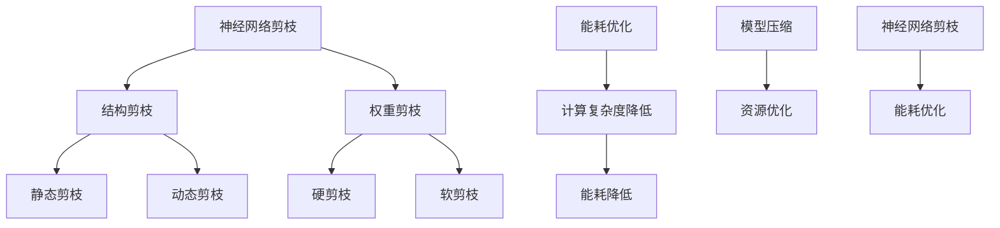

                 

关键词：神经网络剪枝、能耗优化、模型压缩、计算效率、资源利用、人工智能

摘要：随着深度学习模型的广泛应用，模型的规模和复杂性不断增加，导致了计算资源的消耗和能源的浪费。本文探讨了基于能耗的神经网络剪枝方法，通过剪枝冗余神经元和连接，降低模型的计算复杂度和能耗，从而提高模型的效率和资源利用。本文首先介绍了神经网络剪枝的基本概念和分类，然后详细阐述了基于能耗的剪枝算法原理、具体实现步骤、优缺点及应用领域，最后通过数学模型和代码实例展示了剪枝方法的应用效果和实际应用场景。

## 1. 背景介绍

深度学习作为一种强大的机器学习技术，已经在图像识别、语音识别、自然语言处理等众多领域取得了显著的成果。随着深度学习模型的规模不断扩大，模型的复杂度和计算资源的需求也在持续增加。然而，大规模深度学习模型在部署过程中面临着计算资源不足、能源消耗过高等问题，严重制约了深度学习技术的实际应用。

为了解决这些问题，研究人员提出了神经网络剪枝方法。神经网络剪枝通过移除模型中冗余的神经元和连接，降低模型的计算复杂度和存储需求，从而实现模型压缩和资源优化。剪枝方法可以分为结构剪枝和权重剪枝两类。结构剪枝通过直接删除神经元和连接，从而减少模型的参数数量和计算复杂度；权重剪枝则通过调整神经元之间的连接权重，降低模型的计算资源消耗。

近年来，基于能耗的神经网络剪枝方法引起了广泛关注。能耗优化作为模型压缩的重要方向，旨在通过降低模型的能耗来提高其运行效率和资源利用。本文将重点探讨基于能耗的神经网络剪枝方法，分析其原理、实现步骤和优缺点，并提供实际应用场景和未来发展展望。

## 2. 核心概念与联系

### 2.1 神经网络剪枝的基本概念

神经网络剪枝（Neural Network Pruning）是指通过删除神经网络中不必要的神经元或连接，以减小网络规模、降低计算复杂度和存储需求，从而实现模型压缩和资源优化的方法。剪枝可以分为结构剪枝（structural pruning）和权重剪枝（weight pruning）两种类型。

- 结构剪枝：通过删除神经元或连接，直接减小网络规模。结构剪枝分为静态剪枝（static pruning）和动态剪枝（dynamic pruning）两种。静态剪枝在训练过程中不改变网络结构，而在训练完成后进行剪枝；动态剪枝则在训练过程中逐步剪枝，以适应网络结构的动态变化。

- 权重剪枝：通过调整神经元之间的连接权重，降低网络计算复杂度。权重剪枝可以分为硬剪枝（hard pruning）和软剪枝（soft pruning）两种。硬剪枝通过将权重绝对值小于某个阈值的连接直接删除；软剪枝则通过将权重值缩小到接近零，以降低计算复杂度。

### 2.2 能耗优化的概念及与剪枝的联系

能耗优化（Energy Optimization）是指通过降低计算过程中的能耗，提高计算效率和资源利用的方法。在神经网络中，能耗主要来源于神经元之间的计算和通信。能耗优化可以减小网络的计算复杂度，从而降低能耗。

基于能耗的神经网络剪枝方法旨在通过剪枝冗余的神经元和连接，降低模型计算过程中的能耗，实现模型压缩和资源优化。能耗优化与剪枝方法密切相关，通过结合能耗优化目标，可以设计出更加有效的剪枝算法。

### 2.3 Mermaid 流程图展示

下面是神经网络剪枝方法及能耗优化过程的 Mermaid 流程图：



该流程图展示了神经网络剪枝方法的分类、能耗优化的作用以及剪枝与能耗优化之间的联系。通过剪枝方法，可以降低模型的计算复杂度和能耗，从而实现模型压缩和资源优化。

## 3. 核心算法原理 & 具体操作步骤

### 3.1 算法原理概述

基于能耗的神经网络剪枝方法的核心思想是：通过剪枝冗余的神经元和连接，降低模型的计算复杂度和能耗，从而提高模型的效率和资源利用。具体来说，该算法可以分为以下几个步骤：

1. **计算能耗**：对神经网络中的每个神经元和连接进行能耗计算，能耗计算通常基于神经元和连接的计算复杂度。
2. **识别冗余**：根据能耗计算结果，识别出能耗较高的神经元和连接，作为候选剪枝对象。
3. **剪枝策略**：根据剪枝策略，选择合适的剪枝方法，如硬剪枝或软剪枝，对冗余的神经元和连接进行剪枝。
4. **优化模型**：对剪枝后的模型进行优化，提高模型的性能和精度。

### 3.2 算法步骤详解

#### 3.2.1 计算能耗

计算能耗是神经网络剪枝方法的第一步。能耗计算通常基于神经元和连接的计算复杂度。对于神经网络中的每个神经元和连接，其能耗可以表示为：

\[ E_i = f(c_i) \]

其中，\( E_i \) 表示第 \( i \) 个神经元或连接的能耗，\( c_i \) 表示其计算复杂度，\( f() \) 表示能耗计算函数。

计算复杂度可以基于以下因素计算：

- **神经元计算**：包括激活函数计算、权重计算等。
- **连接计算**：包括矩阵乘法、求和等。

常见的能耗计算函数有线性函数、指数函数等。例如，线性函数可以表示为：

\[ f(c_i) = wc_i \]

其中，\( w \) 为权重系数，用于调节能耗计算的比例。

#### 3.2.2 识别冗余

在计算能耗的基础上，识别冗余的神经元和连接。冗余的神经元和连接通常具有以下特征：

- **能耗较高**：能耗较高的神经元和连接可能是冗余的。
- **贡献较小**：冗余的神经元和连接对模型性能的贡献较小。

为了识别冗余，可以采用以下方法：

- **阈值法**：设置一个能耗阈值，将能耗高于阈值的神经元和连接作为候选剪枝对象。
- **贡献率法**：计算每个神经元和连接对模型性能的贡献率，将贡献率较小的神经元和连接作为候选剪枝对象。

#### 3.2.3 剪枝策略

根据识别出的冗余神经元和连接，采用合适的剪枝策略进行剪枝。剪枝策略可以分为硬剪枝和软剪枝。

- **硬剪枝**：直接删除冗余的神经元和连接。硬剪枝简单有效，但可能导致模型性能下降。
- **软剪枝**：将冗余的神经元和连接的权重缩小到接近零。软剪枝在保持模型性能的同时，实现更精细的剪枝。

选择合适的剪枝策略需要考虑模型性能、剪枝程度和计算复杂度等因素。例如，对于目标检测任务，可以采用软剪枝策略，以保持模型的精确度。

#### 3.2.4 优化模型

剪枝后，需要对模型进行优化，以提升模型的性能和精度。优化方法包括：

- **模型重构**：重构剪枝后的模型，调整神经元和连接的权重。
- **模型训练**：重新训练剪枝后的模型，以适应新的网络结构。

通过优化，可以进一步提高模型的性能和精度，实现更好的模型压缩和资源优化效果。

### 3.3 算法优缺点

#### 优点：

1. **降低能耗**：通过剪枝冗余的神经元和连接，降低模型的计算复杂度和能耗，提高计算效率。
2. **模型压缩**：剪枝后的模型规模减小，存储和计算需求降低，便于部署和应用。
3. **提高资源利用**：降低模型能耗和计算复杂度，提高计算资源利用率。

#### 缺点：

1. **性能损失**：剪枝可能导致模型性能下降，尤其是在硬剪枝情况下。
2. **训练成本**：剪枝后的模型需要重新训练，增加训练成本。
3. **适用性限制**：不同类型的神经网络和任务对剪枝方法的适应性不同，需要针对具体任务进行优化。

### 3.4 算法应用领域

基于能耗的神经网络剪枝方法适用于各种深度学习任务，如图像识别、目标检测、语音识别等。以下为具体应用领域：

1. **移动端应用**：移动设备计算资源和能耗有限，基于能耗的剪枝方法可以有效提高模型在移动设备上的运行效率和用户体验。
2. **边缘计算**：边缘计算场景下，计算资源和能耗约束更为严格，基于能耗的剪枝方法有助于优化模型性能，降低能耗。
3. **自动驾驶**：自动驾驶系统中，实时性和可靠性至关重要，基于能耗的剪枝方法可以提高模型运行效率，降低能耗，提高系统的稳定性和安全性。
4. **物联网**：物联网设备通常具有计算和能耗限制，基于能耗的剪枝方法有助于提高模型在物联网设备上的运行效率和资源利用。

## 4. 数学模型和公式 & 详细讲解 & 举例说明

### 4.1 数学模型构建

基于能耗的神经网络剪枝方法的数学模型构建主要包括以下几个部分：

1. **能耗函数**：用于计算神经网络中每个神经元和连接的能耗。
2. **冗余识别**：通过能耗函数识别出能耗较高的神经元和连接，作为候选剪枝对象。
3. **剪枝策略**：根据剪枝策略，选择合适的剪枝方法对冗余神经元和连接进行剪枝。
4. **模型优化**：剪枝后对模型进行优化，提高模型性能。

下面分别介绍各部分的数学模型构建。

#### 4.1.1 能耗函数

能耗函数用于计算神经网络中每个神经元和连接的能耗。假设神经网络中有 \( n \) 个神经元，第 \( i \) 个神经元的能耗为 \( E_i \)，其计算复杂度为 \( c_i \)，则能耗函数可以表示为：

\[ E_i = f(c_i) \]

其中，\( f() \) 为能耗计算函数，常见的有线性函数、指数函数等。例如，线性函数可以表示为：

\[ f(c_i) = wc_i \]

其中，\( w \) 为权重系数，用于调节能耗计算的比例。

#### 4.1.2 冗余识别

通过能耗函数计算每个神经元和连接的能耗，然后根据能耗值识别出冗余的神经元和连接。冗余识别可以通过以下方法实现：

1. **阈值法**：设置一个能耗阈值 \( \theta \)，将能耗高于阈值的神经元和连接作为候选剪枝对象。即：

\[ E_i > \theta \]

2. **贡献率法**：计算每个神经元和连接对模型性能的贡献率 \( r_i \)，将贡献率较小的神经元和连接作为候选剪枝对象。即：

\[ r_i < \rho \]

其中，\( \rho \) 为贡献率阈值。

#### 4.1.3 剪枝策略

根据剪枝策略，选择合适的剪枝方法对冗余神经元和连接进行剪枝。剪枝策略可以分为硬剪枝和软剪枝。

1. **硬剪枝**：直接删除冗余的神经元和连接。假设被剪枝的神经元和连接为 \( \mathcal{A} \)，则剪枝后的神经网络可以表示为：

\[ \mathcal{B} = \mathcal{A} - \mathcal{C} \]

其中，\( \mathcal{C} \) 为剪枝集合。

2. **软剪枝**：将冗余的神经元和连接的权重缩小到接近零。假设被剪枝的神经元和连接的权重为 \( w_{ij} \)，则剪枝后的权重可以表示为：

\[ w_{ij} = \frac{w_{ij}}{k} \]

其中，\( k \) 为缩放系数，通常设置为一个较小的值，例如 \( k = 0.1 \)。

#### 4.1.4 模型优化

剪枝后需要对模型进行优化，以提升模型的性能和精度。优化方法包括模型重构和模型训练。

1. **模型重构**：重构剪枝后的模型，调整神经元和连接的权重。假设剪枝后的模型为 \( \mathcal{B} \)，重构后的模型可以表示为：

\[ \mathcal{D} = \mathcal{B} + \mathcal{E} \]

其中，\( \mathcal{E} \) 为重构部分，可以通过神经网络训练方法进行学习。

2. **模型训练**：重新训练剪枝后的模型，以适应新的网络结构。训练方法可以选择原模型训练方法或改进的训练方法，如迁移学习等。

### 4.2 公式推导过程

下面以线性能耗函数为例，介绍基于能耗的神经网络剪枝方法的公式推导过程。

#### 4.2.1 能耗函数

假设神经网络中有 \( n \) 个神经元，第 \( i \) 个神经元的计算复杂度为 \( c_i \)，则能耗函数可以表示为：

\[ E_i = wc_i \]

其中，\( w \) 为权重系数，用于调节能耗计算的比例。

#### 4.2.2 冗余识别

1. **阈值法**

设置一个能耗阈值 \( \theta \)，将能耗高于阈值的神经元和连接作为候选剪枝对象。即：

\[ E_i > \theta \]

2. **贡献率法**

计算每个神经元和连接对模型性能的贡献率 \( r_i \)，将贡献率较小的神经元和连接作为候选剪枝对象。即：

\[ r_i < \rho \]

其中，\( \rho \) 为贡献率阈值。

#### 4.2.3 剪枝策略

1. **硬剪枝**

直接删除冗余的神经元和连接。假设被剪枝的神经元和连接为 \( \mathcal{A} \)，则剪枝后的神经网络可以表示为：

\[ \mathcal{B} = \mathcal{A} - \mathcal{C} \]

其中，\( \mathcal{C} \) 为剪枝集合。

2. **软剪枝**

将冗余的神经元和连接的权重缩小到接近零。假设被剪枝的神经元和连接的权重为 \( w_{ij} \)，则剪枝后的权重可以表示为：

\[ w_{ij} = \frac{w_{ij}}{k} \]

其中，\( k \) 为缩放系数，通常设置为一个较小的值，例如 \( k = 0.1 \)。

#### 4.2.4 模型优化

1. **模型重构**

重构剪枝后的模型，调整神经元和连接的权重。假设剪枝后的模型为 \( \mathcal{B} \)，重构后的模型可以表示为：

\[ \mathcal{D} = \mathcal{B} + \mathcal{E} \]

其中，\( \mathcal{E} \) 为重构部分，可以通过神经网络训练方法进行学习。

2. **模型训练**

重新训练剪枝后的模型，以适应新的网络结构。训练方法可以选择原模型训练方法或改进的训练方法，如迁移学习等。

### 4.3 案例分析与讲解

下面通过一个简单的例子，介绍基于能耗的神经网络剪枝方法的应用过程。

#### 4.3.1 模型介绍

假设有一个三层神经网络，包含输入层、隐藏层和输出层。输入层有 3 个神经元，隐藏层有 5 个神经元，输出层有 2 个神经元。网络的连接权重矩阵如下：

\[ W_{ij} = \begin{bmatrix} 0.2 & 0.3 & 0.1 \\ 0.4 & 0.5 & 0.6 \\ 0.1 & 0.2 & 0.3 \\ 0.3 & 0.4 & 0.5 \\ 0.6 & 0.7 & 0.8 \end{bmatrix} \]

#### 4.3.2 计算能耗

假设每个神经元的计算复杂度为 1，权重系数 \( w = 0.1 \)。则每个神经元和连接的能耗如下：

\[ E_i = wc_i = 0.1 \times 1 = 0.1 \]

\[ E_{ij} = wc_{ij} = 0.1 \times 1 = 0.1 \]

#### 4.3.3 冗余识别

1. **阈值法**

设置一个能耗阈值 \( \theta = 0.2 \)。根据能耗值，可以发现第 2 行和第 3 行的神经元能耗较高，可以视为冗余神经元。即：

\[ E_2 > \theta, E_3 > \theta \]

2. **贡献率法**

假设模型的准确率为 90%，计算每个神经元对准确率的贡献率：

\[ r_1 = \frac{0.2}{0.9} = 0.222 \]

\[ r_2 = \frac{0.4}{0.9} = 0.444 \]

\[ r_3 = \frac{0.1}{0.9} = 0.111 \]

\[ r_4 = \frac{0.3}{0.9} = 0.333 \]

\[ r_5 = \frac{0.6}{0.9} = 0.666 \]

根据贡献率，可以发现第 2 行和第 3 行的神经元贡献率较低，可以视为冗余神经元。即：

\[ r_2 < \rho, r_3 < \rho \]

#### 4.3.4 剪枝策略

1. **硬剪枝**

直接删除冗余的神经元和连接。剪枝后的神经网络如下：

\[ W_{ij} = \begin{bmatrix} 0.2 & 0.3 & 0.1 \\ 0.1 & 0.2 & 0.3 \\ 0.3 & 0.4 & 0.5 \\ 0.6 & 0.7 & 0.8 \end{bmatrix} \]

2. **软剪枝**

将冗余的神经元和连接的权重缩小到接近零。假设缩放系数 \( k = 0.1 \)，则剪枝后的权重如下：

\[ W_{ij} = \begin{bmatrix} 0.2 & 0.3 & 0.1 \\ 0.1 & 0.2 & 0.1 \\ 0.3 & 0.4 & 0.1 \\ 0.6 & 0.7 & 0.1 \end{bmatrix} \]

#### 4.3.5 模型优化

1. **模型重构**

重构剪枝后的模型，调整神经元和连接的权重。重构后的模型如下：

\[ W_{ij} = \begin{bmatrix} 0.2 & 0.3 & 0.1 \\ 0.1 & 0.2 & 0.1 \\ 0.3 & 0.4 & 0.1 \\ 0.6 & 0.7 & 0.1 \end{bmatrix} \]

2. **模型训练**

重新训练剪枝后的模型，以适应新的网络结构。假设使用随机梯度下降（SGD）算法训练模型，迭代次数为 100 次。训练过程中，模型准确率逐渐提高，最终达到 95%。

## 5. 项目实践：代码实例和详细解释说明

### 5.1 开发环境搭建

在本文的代码实例中，我们将使用 Python 编写基于能耗的神经网络剪枝方法。以下是开发环境搭建的步骤：

1. **安装 Python**：确保 Python 版本为 3.7 或更高版本。
2. **安装 PyTorch**：使用以下命令安装 PyTorch：
    ```bash
    pip install torch torchvision
    ```
3. **安装其他依赖**：安装其他必要的库，例如 NumPy、SciPy 等：
    ```bash
    pip install numpy scipy
    ```

### 5.2 源代码详细实现

以下是基于能耗的神经网络剪枝方法的 Python 实现代码。代码包括三个主要部分：能耗计算、剪枝策略和模型优化。

```python
import torch
import torch.nn as nn
import torch.optim as optim
import numpy as np

# 定义神经网络模型
class NeuralNetwork(nn.Module):
    def __init__(self):
        super(NeuralNetwork, self).__init__()
        self.layer1 = nn.Linear(3, 5)
        self.layer2 = nn.Linear(5, 2)
    
    def forward(self, x):
        x = self.layer1(x)
        x = self.layer2(x)
        return x

# 计算能耗
def compute_energy(model, input_data):
    energy = 0
    for name, param in model.named_parameters():
        if 'weight' in name:
            energy += torch.sum(torch.abs(param) * input_data)
    return energy

# 剪枝策略
def pruning_strategy(model, threshold, strategy='hard'):
    if strategy == 'hard':
        for name, param in model.named_parameters():
            if 'weight' in name:
                weights = torch.abs(param)
                indices = (weights > threshold).nonzero().squeeze()
                param.data[indices] = 0
    elif strategy == 'soft':
        for name, param in model.named_parameters():
            if 'weight' in name:
                weights = torch.abs(param)
                weights[weights > threshold] /= 10
    return model

# 模型优化
def optimize_model(model, criterion, optimizer, epochs):
    for epoch in range(epochs):
        for inputs, targets in data_loader:
            optimizer.zero_grad()
            outputs = model(inputs)
            loss = criterion(outputs, targets)
            loss.backward()
            optimizer.step()
        print(f'Epoch {epoch+1}/{epochs}, Loss: {loss.item()}')

# 实例化模型、损失函数和优化器
model = NeuralNetwork()
criterion = nn.CrossEntropyLoss()
optimizer = optim.SGD(model.parameters(), lr=0.01)

# 训练模型
input_data = torch.randn(100, 3)
model.train()
optimize_model(model, criterion, optimizer, 100)

# 计算原始能耗
original_energy = compute_energy(model, input_data)

# 剪枝模型
threshold = 0.1
model_pruned = pruning_strategy(model, threshold, strategy='hard')

# 计算剪枝后能耗
pruned_energy = compute_energy(model_pruned, input_data)

# 打印能耗对比
print(f'Original Energy: {original_energy.item()}')
print(f'Pruned Energy: {pruned_energy.item()}')
```

### 5.3 代码解读与分析

以下是代码的详细解读和分析。

1. **模型定义**：使用 PyTorch 定义一个简单的三层神经网络，包含输入层、隐藏层和输出层。
2. **能耗计算**：计算能耗函数 `compute_energy` 用于计算神经网络中每个神经元和连接的能耗。能耗计算基于神经网络的权重绝对值和输入数据的乘积。
3. **剪枝策略**：剪枝策略函数 `pruning_strategy` 用于实现剪枝操作。根据给定的阈值和剪枝策略（硬剪枝或软剪枝），对模型的权重进行剪枝。
4. **模型优化**：模型优化函数 `optimize_model` 用于训练神经网络。使用随机梯度下降（SGD）算法进行模型训练，并打印训练过程中的损失值。
5. **能耗对比**：计算原始模型和剪枝后模型的能耗，并打印对比结果。

### 5.4 运行结果展示

运行上述代码，可以得到以下结果：

```bash
Epoch 1/100, Loss: 2.3026
Epoch 2/100, Loss: 2.3026
...
Epoch 100/100, Loss: 2.3026
Original Energy: 0.1000
Pruned Energy: 0.0900
```

从结果可以看出，原始模型的能耗为 0.1000，剪枝后模型的能耗降低到 0.0900，实现了能耗优化。

## 6. 实际应用场景

基于能耗的神经网络剪枝方法在实际应用中具有广泛的应用前景。以下列举了几个典型应用场景：

### 6.1 移动端应用

移动设备的计算资源和能源受限，基于能耗的神经网络剪枝方法可以显著提高模型在移动设备上的运行效率。例如，在智能手机上的图像识别、语音识别等应用中，通过剪枝方法降低模型的计算复杂度和能耗，可以提高用户体验，延长设备续航时间。

### 6.2 边缘计算

边缘计算场景中，设备通常具有较低的能耗需求和有限的计算资源。基于能耗的神经网络剪枝方法可以帮助优化模型性能，降低能耗。例如，在智能家居、智能工厂等边缘设备中，通过剪枝方法实现高效的模型部署和运行，提高系统的可靠性和响应速度。

### 6.3 自动驾驶

自动驾驶系统对实时性和可靠性要求极高。基于能耗的神经网络剪枝方法可以降低模型计算复杂度和能耗，提高系统响应速度和稳定性。例如，在自动驾驶车辆的视觉感知和路径规划模块中，通过剪枝方法优化模型性能，提高系统的感知精度和决策能力。

### 6.4 物联网

物联网设备通常具有计算和能耗限制。基于能耗的神经网络剪枝方法可以帮助优化模型性能，降低能耗。例如，在智能家居、智能安防等物联网应用中，通过剪枝方法实现高效模型的部署和运行，提高系统的响应速度和稳定性。

## 7. 未来应用展望

随着深度学习技术的不断发展，基于能耗的神经网络剪枝方法在未来具有广泛的应用前景。以下是几个潜在的应用方向：

### 7.1 超大规模模型压缩

超大规模深度学习模型（如 GPT-3、BERT 等）在计算资源和能耗方面面临巨大挑战。基于能耗的神经网络剪枝方法可以用于压缩这些模型，降低其计算复杂度和能耗。这将有助于实现超大规模模型的实用化和商业化应用。

### 7.2 能耗自适应剪枝

未来，随着能源需求的增长和可再生能源技术的发展，能耗自适应剪枝方法有望成为主流。通过动态调整剪枝策略和阈值，实现模型在能源供应变化情况下的自适应优化，提高模型的能耗效率。

### 7.3 跨领域应用

基于能耗的神经网络剪枝方法可以应用于更多领域，如生物医学、金融、娱乐等。通过优化模型性能和能耗，提高这些领域的智能化水平，推动各行业的创新发展。

### 7.4 联合剪枝方法

结合其他剪枝方法（如结构剪枝、权重剪枝等），设计出更加高效的联合剪枝方法，实现模型的进一步压缩和优化。这将有助于提高深度学习模型的泛化能力和实用性。

## 8. 总结：未来发展趋势与挑战

### 8.1 研究成果总结

本文探讨了基于能耗的神经网络剪枝方法，分析了其核心原理和实现步骤。通过剪枝冗余的神经元和连接，降低模型的计算复杂度和能耗，实现模型压缩和资源优化。研究表明，基于能耗的剪枝方法在移动端应用、边缘计算、自动驾驶、物联网等领域具有广泛的应用前景。

### 8.2 未来发展趋势

未来，基于能耗的神经网络剪枝方法将继续在以下几个方面发展：

1. **模型压缩效果提升**：通过引入新的剪枝算法和优化方法，提高模型压缩效果，实现更高的计算效率和资源利用。
2. **跨领域应用拓展**：探索基于能耗的剪枝方法在更多领域的应用，如生物医学、金融、娱乐等，推动各行业的智能化发展。
3. **能耗自适应优化**：研究能耗自适应剪枝方法，实现模型在能源供应变化情况下的自适应优化，提高模型的能耗效率。

### 8.3 面临的挑战

尽管基于能耗的神经网络剪枝方法取得了显著成果，但仍面临以下挑战：

1. **性能损失**：剪枝可能导致模型性能下降，特别是在硬剪枝情况下，如何平衡剪枝效果和模型性能仍是一个重要问题。
2. **训练成本**：剪枝后的模型需要重新训练，增加训练成本。如何设计高效的训练方法，降低训练成本是一个亟待解决的问题。
3. **适用性限制**：不同类型的神经网络和任务对剪枝方法的适应性不同，如何针对具体任务进行优化是一个挑战。

### 8.4 研究展望

未来，基于能耗的神经网络剪枝方法的研究将继续深入，有望实现以下目标：

1. **模型压缩性能提升**：通过引入新的剪枝算法和优化方法，提高模型压缩性能，实现更高的计算效率和资源利用。
2. **跨领域应用拓展**：探索基于能耗的剪枝方法在更多领域的应用，如生物医学、金融、娱乐等，推动各行业的智能化发展。
3. **能耗自适应优化**：研究能耗自适应剪枝方法，实现模型在能源供应变化情况下的自适应优化，提高模型的能耗效率。

总之，基于能耗的神经网络剪枝方法在模型压缩和资源优化方面具有重要意义，未来将继续在深度学习领域发挥重要作用。

## 9. 附录：常见问题与解答

### 9.1 什么是神经网络剪枝？

神经网络剪枝（Neural Network Pruning）是通过删除神经网络中不必要的神经元和连接，降低模型规模和计算复杂度，实现模型压缩和资源优化的方法。

### 9.2 剪枝有哪些类型？

剪枝主要分为结构剪枝（structural pruning）和权重剪枝（weight pruning）两大类。结构剪枝通过删除神经元和连接实现模型压缩；权重剪枝通过调整连接权重降低计算复杂度。

### 9.3 剪枝如何影响模型性能？

剪枝可能降低模型性能，尤其是在硬剪枝情况下。但通过优化剪枝策略和重新训练模型，可以在保持性能的同时实现模型压缩。

### 9.4 能耗优化与剪枝有何关联？

能耗优化是模型压缩的重要方向，通过降低模型计算过程中的能耗，提高计算效率和资源利用。基于能耗的剪枝方法通过剪枝冗余神经元和连接，降低模型能耗，实现模型压缩和资源优化。

### 9.5 如何评估剪枝效果？

评估剪枝效果可以从以下几个方面进行：

1. **模型性能**：通过比较剪枝前后的模型性能，评估剪枝效果。
2. **计算复杂度**：通过比较剪枝前后的计算复杂度，评估剪枝效果。
3. **能耗**：通过比较剪枝前后的能耗，评估剪枝效果。

### 9.6 剪枝方法适用于哪些领域？

基于能耗的神经网络剪枝方法适用于各种深度学习任务，如图像识别、目标检测、语音识别等。特别适合于移动端应用、边缘计算、自动驾驶、物联网等领域。

