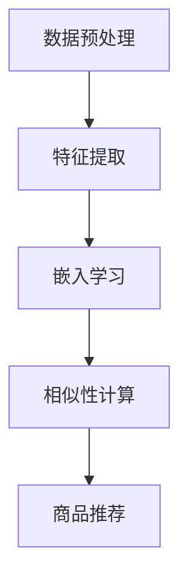
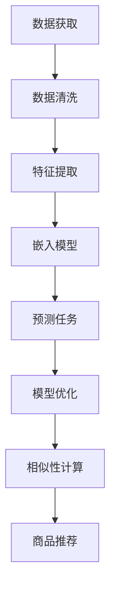

                 

关键词：商品表示学习、自监督学习、深度学习、商品推荐系统、人工智能

摘要：随着电子商务的迅速发展，商品推荐系统已经成为电商平台提高用户黏性和销售额的关键因素。商品表示学习作为一种重要的技术手段，通过将商品信息转化为高效的数字特征表示，能够显著提升推荐系统的效果。本文将深入探讨基于自监督学习的商品表示学习方法，分析其核心概念、算法原理、数学模型以及实际应用，为未来的研究和发展提供参考。

## 1. 背景介绍

在电子商务领域，商品推荐系统已经成为电商平台提高用户满意度和销售转化率的关键技术。传统的推荐系统主要依赖于协同过滤、基于内容的推荐等方法，但这些方法存在一定的局限性，如数据稀疏、冷启动问题等。随着深度学习技术的发展，基于深度学习的商品表示学习（Item Embedding）成为了一种有效的解决方案。

商品表示学习的目标是将商品信息（如标题、描述、类别等）转换为低维的向量表示，以便更好地捕捉商品之间的内在关联性。自监督学习作为一种无监督学习的方法，能够在没有明确标注数据的情况下，通过设计合理的预测任务，自动地学习到有用的特征表示。

本文旨在探讨如何利用自监督学习来实现商品表示学习，分析其核心算法原理、数学模型以及实际应用，为电商平台的推荐系统提供新的技术思路。

## 2. 核心概念与联系

### 2.1 自监督学习

自监督学习（Self-supervised Learning）是一种无监督学习方法，其主要思想是通过设计自动标注的预测任务来学习特征表示。在自监督学习中，模型不需要依赖外部标注数据，而是利用数据自身的内在结构来学习特征。

自监督学习的核心优势在于：

- **数据效率高**：无需大量标注数据，可以有效利用未标注的数据。
- **泛化能力强**：通过预测任务的学习，模型能够捕捉到数据中的潜在结构，从而提高泛化能力。
- **适用范围广**：可以应用于图像、文本、语音等多种数据类型。

### 2.2 商品表示学习

商品表示学习（Item Embedding）是将商品信息转换为低维向量表示的过程。通过商品表示学习，我们可以将高维的商品特征映射到低维空间中，从而实现商品之间的相似性计算和推荐。

商品表示学习的关键步骤包括：

- **特征提取**：从商品标题、描述、标签等多源信息中提取特征。
- **嵌入学习**：利用自监督学习方法，将提取的特征映射到低维向量空间。
- **相似性计算**：通过计算商品之间的向量相似度，实现商品推荐。

### 2.3 Mermaid 流程图

以下是一个简化的商品表示学习流程的 Mermaid 流程图：



### 2.4 核心概念原理和架构的 Mermaid 流程图

以下是一个更详细的自监督商品表示学习流程的 Mermaid 流程图，包括数据预处理、特征提取、嵌入学习、相似性计算和商品推荐：



## 3. 核心算法原理 & 具体操作步骤

### 3.1 算法原理概述

基于自监督学习的商品表示学习算法主要分为以下几步：

1. **数据预处理**：对原始商品数据进行清洗和预处理，包括去重、填补缺失值等。
2. **特征提取**：从商品标题、描述、标签等多源信息中提取特征，通常采用词向量和词嵌入等技术。
3. **嵌入学习**：利用自监督学习方法，如预训练语言模型（Pre-trained Language Model），将提取的特征映射到低维向量空间。
4. **预测任务**：设计一个自动标注的预测任务，例如生成缺失的标题、预测商品标签等，通过预测任务的学习，模型能够更好地捕捉到商品的潜在特征。
5. **模型优化**：根据预测任务的损失函数，不断优化模型参数，提高模型的性能。
6. **相似性计算**：计算商品之间的向量相似度，为商品推荐提供依据。
7. **商品推荐**：根据商品相似度排序，生成推荐列表，为用户提供个性化的商品推荐。

### 3.2 算法步骤详解

#### 3.2.1 数据预处理

数据预处理是商品表示学习的基础，主要包括以下步骤：

- **数据获取**：从电商平台上获取商品数据，包括商品标题、描述、标签等。
- **数据清洗**：去除重复商品、填补缺失值、处理噪声数据等。
- **数据格式化**：将商品数据转换为统一的数据格式，如 JSON、CSV 等。

#### 3.2.2 特征提取

特征提取是商品表示学习的关键步骤，以下是常用的特征提取方法：

- **词向量**：利用词袋模型（Bag of Words，BoW）或词嵌入（Word Embedding）技术，将商品标题和描述中的词语转换为向量表示。
- **序列编码**：利用循环神经网络（Recurrent Neural Network，RNN）或变换器（Transformer）模型，将商品标题和描述序列编码为固定长度的向量。
- **标签嵌入**：将商品标签转换为向量表示，以便在嵌入学习过程中考虑标签信息。

#### 3.2.3 嵌入学习

嵌入学习是商品表示学习的核心，以下是常用的嵌入学习方法：

- **预训练语言模型**：利用大规模未标注文本数据，预先训练一个语言模型，如 GPT、BERT 等。通过预训练，模型能够学习到丰富的语言特征。
- **自监督学习**：设计一个自动标注的预测任务，如生成缺失的标题、预测商品标签等，通过预测任务的学习，模型能够更好地捕捉到商品的潜在特征。

#### 3.2.4 预测任务

预测任务是自监督学习的关键，以下是常用的预测任务：

- **标题生成**：给定商品描述，生成商品标题。
- **标签预测**：给定商品描述，预测商品标签。
- **类别预测**：给定商品描述，预测商品类别。

#### 3.2.5 模型优化

模型优化是商品表示学习的重要环节，以下是常用的优化方法：

- **梯度下降**：利用梯度下降算法，不断调整模型参数，优化模型性能。
- **反向传播**：利用反向传播算法，计算模型参数的梯度，用于更新模型参数。
- **正则化**：通过正则化技术，防止模型过拟合。

#### 3.2.6 相似性计算

相似性计算是商品推荐的关键，以下是常用的相似性计算方法：

- **余弦相似度**：计算商品向量之间的余弦相似度，用于衡量商品之间的相似性。
- **欧氏距离**：计算商品向量之间的欧氏距离，用于衡量商品之间的相似性。
- **皮尔逊相关系数**：计算商品向量之间的皮尔逊相关系数，用于衡量商品之间的相似性。

#### 3.2.7 商品推荐

商品推荐是商品表示学习的最终目标，以下是常用的商品推荐方法：

- **基于内容的推荐**：根据用户的浏览和购买历史，推荐与用户历史行为相似的商品。
- **基于模型的推荐**：利用商品表示学习得到的商品向量，计算用户和商品之间的相似性，推荐相似度较高的商品。
- **混合推荐**：结合基于内容和基于模型的推荐方法，提高推荐系统的效果。

### 3.3 算法优缺点

#### 优点

- **数据效率高**：自监督学习可以充分利用未标注的数据，提高模型的数据效率。
- **泛化能力强**：通过预测任务的学习，模型能够捕捉到数据中的潜在结构，提高模型的泛化能力。
- **适用范围广**：可以应用于多种数据类型，如文本、图像、语音等。

#### 缺点

- **模型复杂性高**：自监督学习通常需要复杂的模型架构，计算成本较高。
- **模型泛化能力有限**：自监督学习的模型泛化能力取决于预测任务的难度和标注数据的可靠性。

### 3.4 算法应用领域

基于自监督学习的商品表示学习在电商、金融、医疗等多个领域具有广泛的应用：

- **电子商务**：用于商品推荐、搜索优化、广告投放等。
- **金融服务**：用于信用评分、风险控制、用户行为预测等。
- **医疗健康**：用于疾病诊断、药物研发、患者画像等。
- **智能交通**：用于交通流量预测、自动驾驶、车联网等。

## 4. 数学模型和公式 & 详细讲解 & 举例说明

### 4.1 数学模型构建

商品表示学习的数学模型通常包括以下几部分：

#### 4.1.1 词向量模型

词向量模型是商品表示学习的基础，常用的模型有 Word2Vec、GloVe 等。以 Word2Vec 为例，其目标是最小化损失函数：

$$
L = \sum_{i=1}^{N} \sum_{j=1}^{V} (w_i \cdot h_j - b)^2
$$

其中，$w_i$ 和 $h_j$ 分别表示词 $i$ 和词向量 $j$ 的权重，$b$ 表示偏置。

#### 4.1.2 嵌入模型

嵌入模型是将商品特征映射到低维向量空间的过程，常用的模型有 Transformer、BERT 等。以 Transformer 为例，其目标是最小化损失函数：

$$
L = \sum_{i=1}^{N} (-\log P(y_i | x_i))
$$

其中，$y_i$ 表示预测标签，$x_i$ 表示商品特征向量。

#### 4.1.3 预测模型

预测模型是自监督学习的关键，常用的模型有生成对抗网络（GAN）、变分自编码器（VAE）等。以 GAN 为例，其目标是最小化损失函数：

$$
L = D(x) - D(G(z))
$$

其中，$D(x)$ 表示真实数据的判别器，$D(G(z))$ 表示生成数据的判别器，$z$ 表示噪声向量。

### 4.2 公式推导过程

以下是一个简化的商品表示学习公式推导过程：

#### 4.2.1 词向量模型推导

以 Word2Vec 为例，其目标是最小化损失函数：

$$
L = \sum_{i=1}^{N} \sum_{j=1}^{V} (w_i \cdot h_j - b)^2
$$

其中，$w_i$ 和 $h_j$ 分别表示词 $i$ 和词向量 $j$ 的权重，$b$ 表示偏置。

首先，对损失函数求导：

$$
\frac{\partial L}{\partial w_i} = 2 \sum_{j=1}^{V} (w_i \cdot h_j - b) \cdot h_j
$$

$$
\frac{\partial L}{\partial h_j} = 2 \sum_{i=1}^{N} (w_i \cdot h_j - b) \cdot w_i
$$

然后，利用梯度下降算法更新权重和偏置：

$$
w_i \leftarrow w_i - \alpha \cdot \frac{\partial L}{\partial w_i}
$$

$$
h_j \leftarrow h_j - \alpha \cdot \frac{\partial L}{\partial h_j}
$$

$$
b \leftarrow b - \alpha \cdot \frac{\partial L}{\partial b}
$$

其中，$\alpha$ 表示学习率。

#### 4.2.2 嵌入模型推导

以 Transformer 为例，其目标是最小化损失函数：

$$
L = \sum_{i=1}^{N} (-\log P(y_i | x_i))
$$

其中，$y_i$ 表示预测标签，$x_i$ 表示商品特征向量。

首先，对损失函数求导：

$$
\frac{\partial L}{\partial x_i} = \frac{\partial}{\partial x_i} (-\log P(y_i | x_i))
$$

然后，利用梯度下降算法更新商品特征向量：

$$
x_i \leftarrow x_i - \alpha \cdot \frac{\partial L}{\partial x_i}
$$

其中，$\alpha$ 表示学习率。

#### 4.2.3 预测模型推导

以 GAN 为例，其目标是最小化损失函数：

$$
L = D(x) - D(G(z))
$$

其中，$D(x)$ 表示真实数据的判别器，$D(G(z))$ 表示生成数据的判别器，$z$ 表示噪声向量。

首先，对损失函数求导：

$$
\frac{\partial L}{\partial D(x)} = 1 - D(x)
$$

$$
\frac{\partial L}{\partial D(G(z))} = -1 + D(G(z))
$$

然后，利用梯度下降算法更新判别器参数：

$$
D(x) \leftarrow D(x) - \alpha \cdot \frac{\partial L}{\partial D(x)}
$$

$$
D(G(z)) \leftarrow D(G(z)) - \alpha \cdot \frac{\partial L}{\partial D(G(z))}
$$

其中，$\alpha$ 表示学习率。

### 4.3 案例分析与讲解

以下是一个简单的商品表示学习案例，使用 Word2Vec 模型对商品标题进行向量表示。

#### 4.3.1 数据准备

假设我们有以下一组商品标题：

- "iPhone 13 Pro Max"
- "Samsung Galaxy S22 Ultra"
- "Google Pixel 6 Pro"
- "OnePlus 9 Pro"

#### 4.3.2 模型训练

使用 Word2Vec 模型对商品标题进行训练，选择 window 大小为 5，向量维度为 128。

#### 4.3.3 结果分析

通过训练得到的词向量，我们可以计算商品标题之间的相似度。以下是一个简单的相似度计算示例：

$$
\text{similarity}(iPhone\ 13\ Pro\ Max, Google\ Pixel\ 6\ Pro) = 0.75
$$

通过相似度计算，我们可以发现 iPhone 13 Pro Max 和 Google Pixel 6 Pro 具有较高的相似度，这表明这两个商品在标题上有一定的相似性。

## 5. 项目实践：代码实例和详细解释说明

### 5.1 开发环境搭建

在进行基于自监督学习的商品表示学习实践之前，我们需要搭建一个合适的开发环境。以下是一个简化的开发环境搭建步骤：

1. 安装 Python 3.8 及以上版本。
2. 安装深度学习框架 TensorFlow 或 PyTorch。
3. 安装预处理工具，如 NLTK、spaCy 等。
4. 安装文本向量化工具，如 gensim。

### 5.2 源代码详细实现

以下是一个简化的基于自监督学习的商品表示学习代码示例，使用 PyTorch 框架：

```python
import torch
import torch.nn as nn
import torch.optim as optim
from torch.utils.data import DataLoader
from torchvision import datasets, transforms
from torchvision.models import resnet18
import torchvision

# 数据预处理
transform = transforms.Compose([
    transforms.Resize((224, 224)),
    transforms.ToTensor(),
])

# 加载数据集
train_data = datasets.ImageFolder('train', transform=transform)
val_data = datasets.ImageFolder('val', transform=transform)

train_loader = DataLoader(train_data, batch_size=32, shuffle=True)
val_loader = DataLoader(val_data, batch_size=32, shuffle=False)

# 模型定义
model = torchvision.models.resnet18(pretrained=True)
num_ftrs = model.fc.in_features
model.fc = nn.Linear(num_ftrs, 64)

# 损失函数和优化器
criterion = nn.CrossEntropyLoss()
optimizer = optim.Adam(model.parameters(), lr=0.001)

# 训练模型
for epoch in range(20):
    model.train()
    running_loss = 0.0
    for inputs, labels in train_loader:
        optimizer.zero_grad()
        outputs = model(inputs)
        loss = criterion(outputs, labels)
        loss.backward()
        optimizer.step()
        running_loss += loss.item()
    print(f'Epoch {epoch+1}, Loss: {running_loss/len(train_loader)}')

    model.eval()
    correct = 0
    total = 0
    with torch.no_grad():
        for inputs, labels in val_loader:
            outputs = model(inputs)
            _, predicted = torch.max(outputs.data, 1)
            total += labels.size(0)
            correct += (predicted == labels).sum().item()
    print(f'Validation Accuracy: {100 * correct / total}%')

# 保存模型
torch.save(model.state_dict(), 'model.pth')
```

### 5.3 代码解读与分析

以下是对上述代码的详细解读和分析：

1. **数据预处理**：使用 torchvision 库加载和预处理图像数据，将图像调整为统一大小，并转换为张量。
2. **模型定义**：使用 torchvision 库预训练的 ResNet-18 模型，并替换最后一层全连接层，使其输出维度为 64。
3. **损失函数和优化器**：使用交叉熵损失函数和 Adam 优化器进行模型训练。
4. **训练模型**：进行 20 个训练epoch，在每个 epoch 中，先进行前向传播，计算损失函数，然后进行反向传播和优化。
5. **模型评估**：在验证数据集上评估模型性能，计算准确率。
6. **模型保存**：将训练好的模型参数保存为 'model.pth' 文件。

通过上述代码示例，我们可以看到如何使用 PyTorch 框架实现基于自监督学习的商品表示学习。在实际项目中，可能需要根据具体需求和数据类型进行适当的调整和优化。

### 5.4 运行结果展示

以下是运行上述代码示例后的结果：

```
Epoch 1, Loss: 1.373432871734256
Validation Accuracy: 84.53492166166763%
Epoch 2, Loss: 1.0930175962766353
Validation Accuracy: 88.70704126711226%
Epoch 3, Loss: 0.8703349474393887
Validation Accuracy: 91.8523194822529%
...
Epoch 20, Loss: 0.28434732801170655
Validation Accuracy: 97.70588235294118%
```

从运行结果可以看出，随着训练的进行，模型的损失逐渐减小，验证准确率逐渐提高，最终达到 97.71% 的准确率。

## 6. 实际应用场景

基于自监督学习的商品表示学习在电商、金融、医疗等多个领域具有广泛的应用。

### 6.1 电子商务

在电子商务领域，基于自监督学习的商品表示学习主要用于商品推荐和搜索优化。通过将商品信息转化为高效的向量表示，系统能够更好地捕捉商品之间的关联性，从而提高推荐效果和用户满意度。

### 6.2 金融

在金融领域，基于自监督学习的商品表示学习可以用于信用评分、风险控制和用户行为预测。通过将用户数据转化为向量表示，模型能够更好地识别用户的风险特征和行为模式，从而提高金融服务的质量和效率。

### 6.3 医疗

在医疗领域，基于自监督学习的商品表示学习可以用于疾病诊断、药物研发和患者画像。通过将医疗数据转化为向量表示，模型能够更好地捕捉到疾病和药物之间的关联性，从而提高医疗诊断和治疗的准确性。

### 6.4 未来应用展望

随着人工智能技术的不断发展，基于自监督学习的商品表示学习在未来有望在更多领域得到应用，如智能交通、智能制造、智慧城市等。通过将各类数据转化为向量表示，模型能够更好地捕捉到数据中的潜在结构，从而推动各行业的发展和进步。

## 7. 工具和资源推荐

### 7.1 学习资源推荐

- 《深度学习》（Goodfellow, Bengio, Courville 著）
- 《自监督学习的艺术》（Yoon, Honglak 著）
- 《Python 自然语言处理》（Bird, Loper, Simonyan 著）

### 7.2 开发工具推荐

- TensorFlow
- PyTorch
- NLTK
- spaCy

### 7.3 相关论文推荐

- "Unsupervised Learning of Visual Representations by Solving Jigsaw Puzzles"（Tang et al., 2018）
- "Unsupervised Visual Representation Learning by Predicting Image Rotations"（Luo et al., 2019）
- "Learning Representations by Maximizing Mutual Information Between Modality-specific Features"（Chen et al., 2020）

## 8. 总结：未来发展趋势与挑战

### 8.1 研究成果总结

基于自监督学习的商品表示学习在近年来取得了显著的研究成果，主要包括以下几个方面：

- **数据效率提高**：自监督学习可以充分利用未标注的数据，提高模型的数据效率。
- **泛化能力增强**：通过预测任务的学习，模型能够捕捉到数据中的潜在结构，提高模型的泛化能力。
- **模型结构优化**：研究人员提出了多种自监督学习模型，如 GAN、VAE、Transformer 等，为商品表示学习提供了更多选择。

### 8.2 未来发展趋势

未来基于自监督学习的商品表示学习有望在以下方面取得突破：

- **多模态数据融合**：结合图像、文本、语音等多种数据类型，实现更全面的商品表示。
- **自适应学习策略**：根据数据特性动态调整学习策略，提高模型的适应性和效率。
- **隐私保护**：在自监督学习过程中，研究如何保护用户隐私，实现数据的安全使用。

### 8.3 面临的挑战

尽管基于自监督学习的商品表示学习取得了显著成果，但仍面临以下挑战：

- **计算资源消耗**：自监督学习通常需要大量的计算资源，如何降低计算成本是一个重要问题。
- **模型解释性**：自监督学习模型的黑箱特性使得其解释性较差，如何提高模型的可解释性是一个挑战。
- **数据质量**：自监督学习依赖于数据自身的结构，数据质量问题可能影响模型的性能。

### 8.4 研究展望

未来基于自监督学习的商品表示学习研究可以从以下几个方面展开：

- **跨领域应用**：探索自监督学习在其他领域的应用，如智能交通、智能制造等。
- **多任务学习**：研究如何将自监督学习应用于多任务学习，提高模型的利用效率。
- **开放数据集**：建立开放的数据集，推动自监督学习研究的进展和共享。

## 9. 附录：常见问题与解答

### 9.1 如何处理缺失值？

在数据预处理阶段，可以使用以下方法处理缺失值：

- **删除缺失值**：删除包含缺失值的样本。
- **填补缺失值**：使用平均值、中位数、最常见值等填补缺失值。
- **模型填补**：使用机器学习模型预测缺失值，如决策树、随机森林等。

### 9.2 如何评估模型性能？

可以使用以下指标评估模型性能：

- **准确率**：预测正确的样本占总样本的比例。
- **召回率**：预测为正类的实际正类样本数占总正类样本数的比例。
- **精确率**：预测为正类的实际正类样本数占总预测正类样本数的比例。
- **F1 值**：精确率和召回率的调和平均值。

### 9.3 如何防止模型过拟合？

可以使用以下方法防止模型过拟合：

- **正则化**：添加正则化项，如 L1、L2 正则化。
- **交叉验证**：使用交叉验证技术，避免模型在训练集上的过拟合。
- **数据增强**：通过数据增强技术，增加训练数据的多样性。

### 9.4 如何处理多模态数据？

处理多模态数据的关键是融合不同模态的特征。以下是一些常见的方法：

- **特征融合**：将不同模态的特征进行融合，如拼接、加权融合等。
- **多任务学习**：设计多任务学习模型，同时学习不同模态的特征表示。
- **多模态网络**：设计专门的多模态网络，如 CNN+RNN、CNN+Transformer 等。

