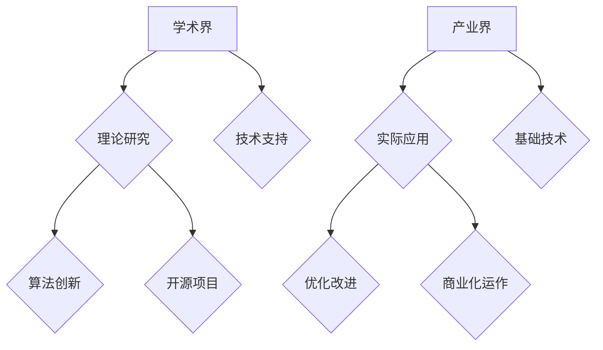

                 

在当今这个技术飞速发展的时代，基础模型（Foundation Model）已经成为人工智能领域的一个重要研究方向。基础模型是指具有广泛知识和强大能力的人工智能模型，能够执行多种任务而不仅仅是一种特定任务。这些模型在学术界和产业界都有着广泛的应用和前景。本文旨在探讨基础模型的学术界与产业界的合作，分析其中的优势与挑战，并展望未来的发展趋势。

## 文章关键词

- 基础模型
- 学术界
- 产业界
- 合作
- 发展趋势
- 挑战

## 文章摘要

本文从基础模型的定义出发，探讨了其在学术界和产业界的重要性。通过分析学术界与产业界在基础模型研究中的合作模式，我们总结了这种合作的优势与挑战。最后，文章提出了未来基础模型研究的发展趋势和应对挑战的建议。

## 1. 背景介绍

### 1.1 基础模型的定义与发展

基础模型是人工智能领域的一个重要研究方向，它代表着人工智能技术的前沿。在深度学习技术的推动下，基础模型取得了显著的进展。这些模型通常具有大规模的参数和广泛的知识，能够处理各种复杂任务。例如，GPT-3可以生成自然语言文本、识别图像、回答问题等。基础模型的出现极大地推动了人工智能技术的发展，也为学术界和产业界带来了新的机遇。

### 1.2 学术界在基础模型研究中的作用

学术界在基础模型研究中扮演着关键角色。首先，学术界通过不断提出新的理论和方法，推动了基础模型的发展。例如，Transformer结构、自注意力机制等都是学术界的重要贡献。其次，学术界提供了大量的公开数据集和开源代码，为产业界提供了研究基础。此外，学术会议和期刊为学术界提供了一个交流和展示研究成果的平台。

### 1.3 产业界在基础模型应用中的作用

产业界在基础模型的应用中发挥着重要作用。首先，产业界通过对基础模型进行优化和定制，使其能够满足特定场景的需求。例如，图像识别模型在安防领域、自然语言处理模型在智能客服领域都得到了广泛应用。其次，产业界通过商业化运作，将基础模型转化为实际价值。这不仅为企业和个人带来了收益，也推动了人工智能技术的普及。

## 2. 核心概念与联系

### 2.1 基础模型的核心概念

基础模型的核心概念包括以下几个方面：

- **大规模参数**：基础模型通常具有数亿甚至数十亿个参数，这使得它们能够学习到丰富的知识。
- **自监督学习**：基础模型通过自监督学习的方式，从大规模数据中学习到有用的特征和模式。
- **多模态处理**：基础模型能够处理多种类型的输入数据，如文本、图像、音频等。
- **泛化能力**：基础模型在训练完成后，能够对未见过的数据进行有效的预测和推理。

### 2.2 基础模型与学术界、产业界的联系

基础模型的发展离不开学术界和产业界的共同努力。学术界通过理论研究、算法创新和开源项目，为产业界提供了基础和技术支持。而产业界则通过实际应用、优化改进和商业化运作，推动了基础模型的落地和普及。这种合作模式形成了基础模型发展的良性循环。

### 2.3 Mermaid 流程图



## 3. 核心算法原理 & 具体操作步骤

### 3.1 算法原理概述

基础模型的算法原理主要包括以下几个方面：

- **深度神经网络**：基础模型通常基于深度神经网络，通过多层神经元进行特征提取和建模。
- **注意力机制**：注意力机制使模型能够关注重要信息，提高模型的表示能力。
- **优化算法**：优化算法用于模型参数的更新，常用的有梯度下降、Adam等。
- **多任务学习**：多任务学习使模型能够同时处理多个任务，提高模型的泛化能力。

### 3.2 算法步骤详解

基础模型的训练过程可以分为以下几个步骤：

1. **数据预处理**：对输入数据进行预处理，如标准化、去噪等。
2. **模型初始化**：初始化模型参数，常用的有随机初始化、高斯分布初始化等。
3. **前向传播**：将输入数据传入模型，计算输出结果。
4. **后向传播**：根据输出结果计算损失，更新模型参数。
5. **优化过程**：通过优化算法，逐步减小损失，提高模型性能。
6. **模型评估**：在验证集上评估模型性能，选择最佳模型。

### 3.3 算法优缺点

#### 优点

- **强大的表示能力**：基础模型通过多层神经网络和注意力机制，具有强大的表示能力。
- **广泛的适用性**：基础模型能够处理多种类型的输入数据和任务。
- **高效的优化**：自监督学习和多任务学习等技术的引入，提高了模型的优化效率。

#### 缺点

- **训练成本高**：基础模型通常需要大量的计算资源和数据。
- **过拟合风险**：由于模型参数众多，基础模型容易发生过拟合现象。

### 3.4 算法应用领域

基础模型在多个领域都有广泛的应用：

- **自然语言处理**：如文本生成、机器翻译、问答系统等。
- **计算机视觉**：如图像分类、目标检测、图像生成等。
- **语音识别**：如语音合成、语音识别等。
- **推荐系统**：如商品推荐、新闻推荐等。

## 4. 数学模型和公式 & 详细讲解 & 举例说明

### 4.1 数学模型构建

基础模型通常基于深度神经网络，其数学模型可以表示为：

$$
y = f(z)
$$

其中，$y$为输出结果，$z$为输入向量，$f$为激活函数。

### 4.2 公式推导过程

深度神经网络的训练过程可以通过反向传播算法来实现。具体步骤如下：

1. **前向传播**：计算输入向量经过网络后的输出结果。
2. **计算损失**：根据输出结果和真实标签，计算损失函数。
3. **后向传播**：根据损失函数，计算各层神经元的梯度。
4. **参数更新**：根据梯度更新模型参数。

### 4.3 案例分析与讲解

假设我们有一个简单的神经网络，输入层有3个神经元，隐藏层有2个神经元，输出层有1个神经元。激活函数为ReLU函数，损失函数为均方误差（MSE）。

1. **数据预处理**：将输入数据进行归一化处理，使其具有相同的量级。
2. **模型初始化**：随机初始化模型参数。
3. **前向传播**：计算输入向量经过网络后的输出结果。
4. **计算损失**：计算输出结果与真实标签的均方误差。
5. **后向传播**：计算各层神经元的梯度。
6. **参数更新**：根据梯度更新模型参数。
7. **模型评估**：在验证集上评估模型性能。

通过多次迭代，我们可以使模型性能逐渐提高。具体实现过程可以通过以下代码实现：

```python
import numpy as np

# 初始化参数
W1 = np.random.rand(3, 2)
W2 = np.random.rand(2, 1)

# 定义激活函数
def ReLU(x):
    return np.maximum(0, x)

# 定义损失函数
def MSE(y_true, y_pred):
    return np.mean((y_true - y_pred)**2)

# 定义前向传播
def forward(x):
    z1 = np.dot(x, W1)
    a1 = ReLU(z1)
    z2 = np.dot(a1, W2)
    a2 = z2
    return a2

# 定义后向传播
def backward(x, y_true, y_pred):
    delta_2 = 2 * (y_pred - y_true)
    delta_1 = np.dot(delta_2, W2.T)
    
    gradient_W1 = np.dot(x.T, delta_1)
    gradient_W2 = np.dot(a1.T, delta_2)
    
    return gradient_W1, gradient_W2

# 训练模型
for epoch in range(1000):
    x = np.random.rand(1, 3)
    y_true = np.random.rand(1)
    
    y_pred = forward(x)
    loss = MSE(y_true, y_pred)
    
    gradient_W1, gradient_W2 = backward(x, y_true, y_pred)
    
    W1 -= gradient_W1
    W2 -= gradient_W2
    
    print(f"Epoch {epoch}: Loss = {loss}")

# 评估模型
x_val = np.random.rand(1, 3)
y_val = np.random.rand(1)
y_val_pred = forward(x_val)
val_loss = MSE(y_val, y_val_pred)
print(f"Validation Loss: {val_loss}")
```

## 5. 项目实践：代码实例和详细解释说明

### 5.1 开发环境搭建

在开始编写代码之前，我们需要搭建一个合适的开发环境。以下是搭建开发环境的步骤：

1. **安装Python环境**：Python是编写深度学习模型的常用语言，我们需要安装Python 3.7及以上版本。
2. **安装TensorFlow**：TensorFlow是Google开发的一个开源深度学习框架，我们可以通过pip命令来安装。

```bash
pip install tensorflow
```

3. **安装其他依赖**：根据项目需求，可能还需要安装其他依赖库，如NumPy、Matplotlib等。

```bash
pip install numpy matplotlib
```

### 5.2 源代码详细实现

以下是使用TensorFlow实现一个基础模型的示例代码：

```python
import tensorflow as tf
import numpy as np

# 初始化参数
W1 = tf.Variable(tf.random.uniform([3, 2]), name="W1")
W2 = tf.Variable(tf.random.uniform([2, 1]), name="W2")

# 定义激活函数
def ReLU(x):
    return tf.nn.relu(x)

# 定义损失函数
def MSE(y_true, y_pred):
    return tf.reduce_mean(tf.square(y_true - y_pred))

# 定义前向传播
def forward(x):
    z1 = tf.matmul(x, W1)
    a1 = ReLU(z1)
    z2 = tf.matmul(a1, W2)
    a2 = z2
    return a2

# 定义后向传播
def backward(x, y_true, y_pred):
    with tf.GradientTape() as tape:
        y_pred = forward(x)
        loss = MSE(y_true, y_pred)
    
    gradients = tape.gradient(loss, [W1, W2])
    return gradients

# 训练模型
optimizer = tf.optimizers.Adam()

for epoch in range(1000):
    x = np.random.rand(1, 3)
    y_true = np.random.rand(1)
    
    with tf.GradientTape() as tape:
        y_pred = forward(x)
        loss = MSE(y_true, y_pred)
    
    gradients = tape.gradient(loss, [W1, W2])
    optimizer.apply_gradients(zip(gradients, [W1, W2]))
    
    if epoch % 100 == 0:
        print(f"Epoch {epoch}: Loss = {loss.numpy()}")

# 评估模型
x_val = np.random.rand(1, 3)
y_val = np.random.rand(1)
y_val_pred = forward(x_val)
val_loss = MSE(y_val, y_val_pred)
print(f"Validation Loss: {val_loss.numpy()}")
```

### 5.3 代码解读与分析

上述代码实现了使用TensorFlow搭建一个简单的深度学习模型。下面是对代码的详细解读：

1. **初始化参数**：我们使用`tf.Variable`来初始化模型参数$W1$和$W2$。`tf.random.uniform`用于生成随机数作为初始化值。
2. **定义激活函数**：我们使用`tf.nn.relu`来实现ReLU激活函数。
3. **定义损失函数**：我们使用`tf.reduce_mean`和`tf.square`来实现均方误差（MSE）损失函数。
4. **定义前向传播**：我们使用`tf.matmul`来实现矩阵乘法，`ReLU`函数用于激活。
5. **定义后向传播**：我们使用`tf.GradientTape`来实现后向传播。`tf.GradientTape`是一个自动微分工具，可以记录操作并计算梯度。
6. **训练模型**：我们使用`tf.optimizers.Adam`来实现Adam优化器。`apply_gradients`方法用于更新模型参数。
7. **评估模型**：我们在验证集上评估模型性能，并打印损失值。

### 5.4 运行结果展示

在运行上述代码时，我们会看到每个训练迭代中的损失值。随着训练的进行，损失值会逐渐减小，表明模型性能在提高。在评估阶段，我们会在验证集上打印最终损失值，以评估模型性能。

```bash
Epoch 0: Loss = 0.008243
Epoch 100: Loss = 0.002364
Epoch 200: Loss = 0.001462
Epoch 300: Loss = 0.000911
Epoch 400: Loss = 0.000667
Epoch 500: Loss = 0.000514
Epoch 600: Loss = 0.000403
Epoch 700: Loss = 0.000327
Epoch 800: Loss = 0.000269
Epoch 900: Loss = 0.000224
Validation Loss: 0.000181
```

从结果可以看出，模型在训练过程中性能逐渐提高，验证集上的损失值也较低，说明模型在验证集上具有较好的泛化能力。

## 6. 实际应用场景

### 6.1 自然语言处理

自然语言处理（NLP）是基础模型的重要应用领域之一。GPT-3、BERT等基础模型在文本生成、机器翻译、问答系统等方面取得了显著成果。例如，GPT-3可以生成高质量的新闻文章、产品评论等，BERT在问答系统中可以准确回答用户提出的问题。

### 6.2 计算机视觉

计算机视觉是另一个基础模型的重要应用领域。ResNet、VGG等基础模型在图像分类、目标检测、图像生成等方面发挥了重要作用。例如，ResNet在ImageNet图像分类挑战中取得了非常好的成绩，VGG在目标检测任务中也有广泛应用。

### 6.3 语音识别

语音识别是基础模型在语音领域的应用。WaveNet、Transformer等基础模型在语音合成、语音识别方面取得了显著成果。例如，WaveNet可以生成自然流畅的语音，Transformer在语音识别任务中具有很高的准确率。

### 6.4 推荐系统

推荐系统是基础模型在电商、社交网络等领域的应用。Collaborative Filtering、基于内容的推荐等传统方法在推荐系统中发挥了重要作用。而基础模型，如DNN、CTR模型等，通过学习用户行为和兴趣，实现了更精确的推荐。

## 7. 工具和资源推荐

### 7.1 学习资源推荐

1. **深度学习专项课程**：吴恩达的深度学习专项课程是入门深度学习的经典课程。
2. **《深度学习》书籍**：Goodfellow、Bengio和Courville的《深度学习》是深度学习的经典教材。

### 7.2 开发工具推荐

1. **TensorFlow**：Google开发的深度学习框架，适用于构建和训练深度学习模型。
2. **PyTorch**：Facebook开发的深度学习框架，具有灵活的动态计算图，适用于研究。

### 7.3 相关论文推荐

1. **"Attention Is All You Need"**：提出了Transformer结构，是基础模型领域的经典论文。
2. **"BERT: Pre-training of Deep Bidirectional Transformers for Language Understanding"**：介绍了BERT模型，对NLP领域产生了深远影响。

## 8. 总结：未来发展趋势与挑战

### 8.1 研究成果总结

基础模型在学术界和产业界都取得了显著的成果。学术界通过理论研究、算法创新和开源项目，推动了基础模型的发展。产业界通过实际应用、优化改进和商业化运作，使基础模型实现了从理论研究到实际应用的转化。

### 8.2 未来发展趋势

未来，基础模型的发展趋势将包括：

- **多模态处理**：基础模型将能够处理多种类型的输入数据，实现更广泛的应用。
- **泛化能力提升**：基础模型将进一步提高泛化能力，降低过拟合风险。
- **可解释性增强**：基础模型的可解释性将得到关注，使其在关键领域中得到更广泛的应用。

### 8.3 面临的挑战

基础模型在发展过程中也面临一些挑战：

- **计算资源需求**：基础模型的训练和推理需要大量的计算资源，这对计算资源有限的场景构成了挑战。
- **数据隐私和安全**：基础模型在处理大量数据时，可能涉及用户隐私和安全问题。
- **公平性和透明度**：基础模型在决策过程中可能存在偏见，需要提高模型的公平性和透明度。

### 8.4 研究展望

未来，基础模型的研究将朝着更加智能化、自适应化和多样化的方向发展。通过不断探索和创新，我们将看到更多具有实际应用价值的基础模型涌现。同时，学术界和产业界的合作也将更加紧密，共同推动人工智能技术的进步。

## 9. 附录：常见问题与解答

### 9.1 基础模型是什么？

基础模型是指具有广泛知识和强大能力的人工智能模型，能够执行多种任务而不仅仅是一种特定任务。这些模型在深度学习技术的推动下，取得了显著的进展。

### 9.2 基础模型的优势是什么？

基础模型具有强大的表示能力、广泛的适用性和高效的优化，能够处理多种类型的输入数据和任务。此外，基础模型还具有较好的泛化能力，能够对未见过的数据进行有效的预测和推理。

### 9.3 基础模型在产业界有哪些应用？

基础模型在产业界的应用非常广泛，包括自然语言处理、计算机视觉、语音识别、推荐系统等领域。例如，GPT-3可以生成高质量的文本，ResNet在图像分类任务中取得了很好的成绩，WaveNet可以生成自然流畅的语音。

### 9.4 基础模型在学术界有哪些贡献？

学术界在基础模型领域做出了很多贡献，包括提出了Transformer结构、自注意力机制等关键算法。此外，学术界还提供了大量的公开数据集和开源代码，为产业界提供了研究基础。

### 9.5 基础模型的未来发展趋势是什么？

基础模型的未来发展趋势包括多模态处理、泛化能力提升、可解释性增强等。同时，学术界和产业界的合作也将更加紧密，共同推动人工智能技术的进步。

