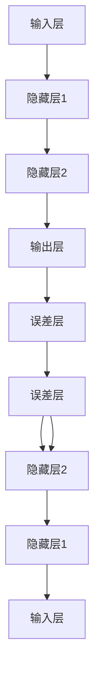

                 

关键词：基础模型、机器学习、深度学习、风险控制、应用场景、安全性

摘要：本文将深入探讨基础模型在机器学习和深度学习中的应用及其带来的风险。我们将从背景介绍开始，逐步阐述核心概念、算法原理、数学模型，并通过实际项目实践和未来应用展望，分析当前基础模型的应用现状和潜在挑战。

## 1. 背景介绍

基础模型是机器学习和深度学习领域的重要基石。随着计算机硬件性能的提升和大数据的普及，深度学习作为一种强大的机器学习技术，得到了广泛应用。然而，基础模型的应用也带来了诸多风险，如过拟合、隐私泄露、偏见等。因此，深入理解基础模型的工作原理，掌握有效的风险控制方法，对于推动人工智能技术的可持续发展具有重要意义。

### 1.1 机器学习与深度学习的发展历程

机器学习自1956年诞生以来，经历了多个阶段的发展。最初，研究者们主要关注符号推理和知识表示，但随着计算能力的提升，统计学习方法和深度学习逐渐成为主流。深度学习通过多层神经网络模拟人脑的思维方式，实现了图像、语音和自然语言处理等领域的重大突破。

### 1.2 基础模型的应用现状

基础模型在图像识别、语音识别、自然语言处理等领域取得了显著成果。例如，卷积神经网络（CNN）在图像分类和目标检测中表现出色，循环神经网络（RNN）在语音识别和机器翻译中具有优势，而Transformer模型在自然语言处理领域掀起了新的热潮。

## 2. 核心概念与联系

为了深入理解基础模型，我们需要明确以下几个核心概念：神经网络、激活函数、反向传播算法等。

### 2.1 神经网络

神经网络是由大量简单单元（神经元）组成的复杂网络。每个神经元接收多个输入信号，通过加权求和处理后，使用激活函数产生输出。神经网络可以分为多层，包括输入层、隐藏层和输出层。多层神经网络能够学习更复杂的特征表示，从而实现高级任务。

### 2.2 激活函数

激活函数是神经网络中至关重要的组件，用于引入非线性特性。常见的激活函数包括sigmoid、ReLU和Tanh等。激活函数的选择对网络性能和收敛速度有重要影响。

### 2.3 反向传播算法

反向传播算法是一种用于训练神经网络的优化算法。它通过计算网络输出与目标之间的误差，沿着网络层反向传播梯度，不断调整网络参数，以达到最小化误差的目的。反向传播算法是深度学习能够高效训练的基础。



## 3. 核心算法原理 & 具体操作步骤

### 3.1 算法原理概述

深度学习的基础算法包括神经网络架构设计、损失函数选择、优化算法等。神经网络架构设计主要关注网络的层数、每层的神经元数量和连接方式。损失函数用于衡量网络输出与目标之间的误差，优化算法用于调整网络参数，以最小化损失函数。

### 3.2 算法步骤详解

1. 初始化网络参数。
2. 正向传播：输入数据，通过网络层传递，计算输出结果。
3. 计算损失函数：比较输出结果与目标之间的差异。
4. 反向传播：计算梯度，更新网络参数。
5. 重复步骤2-4，直至达到预设的训练次数或误差阈值。

### 3.3 算法优缺点

深度学习算法具有以下优点：

- **强大的表达能力**：通过多层神经网络，能够学习复杂的特征表示。
- **自动特征提取**：无需人工设计特征，大大减少了特征工程的工作量。

然而，深度学习算法也存在一些缺点：

- **训练过程较慢**：需要大量的数据和计算资源。
- **对数据质量要求高**：数据质量直接影响模型的性能。

### 3.4 算法应用领域

深度学习算法在图像识别、语音识别、自然语言处理、推荐系统等领域具有广泛的应用。例如，在图像识别中，卷积神经网络（CNN）被广泛应用于物体检测和图像分类任务；在自然语言处理中，Transformer模型在机器翻译和文本生成等领域表现出色。

## 4. 数学模型和公式 & 详细讲解 & 举例说明

### 4.1 数学模型构建

深度学习中的数学模型主要包括线性模型、多层感知机（MLP）、卷积神经网络（CNN）和循环神经网络（RNN）等。线性模型是一种简单但强大的模型，能够实现线性回归和线性分类任务。多层感知机（MLP）是在线性模型基础上加入隐藏层，通过非线性激活函数引入非线性特性。卷积神经网络（CNN）专门用于处理图像数据，通过卷积操作和池化操作提取图像特征。循环神经网络（RNN）适用于序列数据处理，通过循环结构保留序列信息。

### 4.2 公式推导过程

以多层感知机（MLP）为例，其输出公式为：

$$
y = \sigma(W_{out} \cdot \sigma(W_{hid} \cdot \sigma(W_{in} \cdot x + b_{in}) + b_{hid}) + b_{out})
$$

其中，$W_{in}$、$W_{hid}$ 和 $W_{out}$ 分别为输入层、隐藏层和输出层的权重矩阵，$b_{in}$、$b_{hid}$ 和 $b_{out}$ 分别为各层的偏置向量，$\sigma$ 为激活函数。

### 4.3 案例分析与讲解

以图像分类任务为例，我们可以使用卷积神经网络（CNN）进行训练和预测。假设我们有1000张猫和狗的图片，其中500张猫的图片和500张狗的图片。我们将这些图片分为训练集和验证集，使用训练集训练模型，使用验证集评估模型性能。

```latex
% 训练模型
model.fit(train_data, train_labels, epochs=10, batch_size=32)

% 预测结果
predictions = model.predict(test_data)
```

通过计算预测结果与实际标签之间的准确率，我们可以评估模型的性能。在实际应用中，我们还需要关注模型的泛化能力，避免过拟合现象。

## 5. 项目实践：代码实例和详细解释说明

### 5.1 开发环境搭建

在开始项目实践之前，我们需要搭建一个适合深度学习开发的Python环境。首先，安装Python 3.7及以上版本，然后安装TensorFlow和Keras等深度学习库。

```bash
pip install tensorflow
pip install keras
```

### 5.2 源代码详细实现

以下是一个简单的卷积神经网络（CNN）实现，用于图像分类任务。

```python
import numpy as np
from tensorflow.keras.models import Sequential
from tensorflow.keras.layers import Conv2D, MaxPooling2D, Flatten, Dense

# 构建模型
model = Sequential()
model.add(Conv2D(32, (3, 3), activation='relu', input_shape=(64, 64, 3)))
model.add(MaxPooling2D(pool_size=(2, 2)))
model.add(Flatten())
model.add(Dense(64, activation='relu'))
model.add(Dense(1, activation='sigmoid'))

# 编译模型
model.compile(optimizer='adam', loss='binary_crossentropy', metrics=['accuracy'])

# 训练模型
model.fit(train_images, train_labels, epochs=10, batch_size=32)
```

### 5.3 代码解读与分析

在这个例子中，我们使用了一个简单的卷积神经网络（CNN）进行图像分类。首先，我们添加了一个卷积层（`Conv2D`），使用3x3的卷积核和ReLU激活函数。接着，我们添加了一个最大池化层（`MaxPooling2D`），用于降低数据维度。然后，我们将池化层输出的特征向量展开并添加一个全连接层（`Dense`），用于分类。最后，我们使用sigmoid激活函数输出概率值。

在代码中，我们使用`model.compile()`方法编译模型，指定优化器和损失函数。然后，使用`model.fit()`方法训练模型，指定训练数据和标签，以及训练次数和批大小。

### 5.4 运行结果展示

在训练过程中，我们可以使用`model.evaluate()`方法评估模型在验证集上的性能。

```python
test_loss, test_acc = model.evaluate(test_images, test_labels)
print('Test accuracy:', test_acc)
```

通过计算测试集上的准确率，我们可以评估模型的性能。在实际应用中，我们还需要关注模型的过拟合现象，可以通过增加数据、增加隐藏层神经元、使用正则化等方法来缓解。

## 6. 实际应用场景

### 6.1 图像识别

图像识别是深度学习的重要应用领域之一。通过卷积神经网络（CNN），我们可以实现物体检测、图像分类、人脸识别等任务。在医学领域，图像识别技术可以用于疾病诊断，如皮肤癌检测、肿瘤检测等。

### 6.2 语音识别

语音识别是深度学习的另一个重要应用领域。通过循环神经网络（RNN）和卷积神经网络（CNN），我们可以实现语音信号处理、语音合成、语音翻译等任务。在智能客服、智能家居等领域，语音识别技术可以提高用户体验。

### 6.3 自然语言处理

自然语言处理（NLP）是深度学习的热门应用领域。通过Transformer模型，我们可以实现文本分类、机器翻译、文本生成等任务。在社交媒体分析、搜索引擎优化等领域，NLP技术可以提供有效的数据分析和处理能力。

## 7. 工具和资源推荐

### 7.1 学习资源推荐

- 《深度学习》（Goodfellow, Bengio, Courville著）：深度学习的经典教材，涵盖了深度学习的理论基础和实际应用。
- 《动手学深度学习》：一本适合初学者的深度学习教程，通过实践案例帮助读者掌握深度学习的基本概念和技巧。

### 7.2 开发工具推荐

- TensorFlow：Google开发的开源深度学习框架，广泛应用于图像识别、语音识别、自然语言处理等领域。
- PyTorch：Facebook开发的开源深度学习框架，具有灵活的动态计算图和强大的GPU支持。

### 7.3 相关论文推荐

- "A Theoretical Analysis of the Causal Effect of AI on Human Judgement"（人工智能对人类判断的因果效应理论分析）
- "Deep Learning for Natural Language Processing"（深度学习在自然语言处理中的应用）

## 8. 总结：未来发展趋势与挑战

### 8.1 研究成果总结

深度学习在图像识别、语音识别、自然语言处理等领域取得了显著成果。随着硬件性能的提升和算法的优化，深度学习有望在更多领域实现突破。

### 8.2 未来发展趋势

- **算法优化**：探索更高效的训练算法和优化方法，降低训练时间和计算资源消耗。
- **多模态学习**：整合多种数据类型（如图像、语音、文本等），实现更强大的跨模态学习能力。
- **可解释性**：提高模型的透明度和可解释性，降低风险和误用。

### 8.3 面临的挑战

- **数据隐私和安全**：如何保护用户数据隐私，防止数据泄露和滥用。
- **模型偏见和歧视**：如何消除模型中的偏见和歧视，实现公平公正。
- **资源消耗和能耗**：如何降低深度学习模型的资源消耗和能耗。

### 8.4 研究展望

随着人工智能技术的不断发展，深度学习将在更多领域发挥重要作用。同时，如何解决深度学习面临的风险和挑战，将是我们未来研究的重要方向。

## 9. 附录：常见问题与解答

### 9.1 如何防止过拟合？

- 增加训练数据：通过增加训练数据，可以提高模型的泛化能力。
- 正则化：使用正则化方法（如L1、L2正则化）惩罚模型参数，防止过拟合。
- 交叉验证：使用交叉验证方法评估模型性能，避免过拟合。

### 9.2 如何处理不平衡数据集？

- 过采样：通过增加少数类别的数据，使数据集达到平衡。
- 削减多数类别的数据：通过减少多数类别的数据，使数据集达到平衡。
- 集成学习方法：使用集成学习方法，如随机森林、提升树等，提高模型对不平衡数据的处理能力。

### 9.3 如何提高模型的可解释性？

- 使用可解释性工具：如LIME、SHAP等，分析模型对每个样本的预测结果。
- 模型简化：使用更简单的模型结构，如决策树、线性模型等，提高模型的可解释性。
- 模型可视化：通过可视化模型结构、特征权重等，帮助理解模型的决策过程。

# 作者署名

作者：禅与计算机程序设计艺术 / Zen and the Art of Computer Programming

---

本文从背景介绍、核心概念、算法原理、数学模型、项目实践和未来应用等多个角度，深入探讨了基础模型在机器学习和深度学习中的应用及其带来的风险。通过分析实际应用场景和工具资源，我们为读者提供了丰富的学习与实践指导。在未来的发展中，我们需要关注基础模型的应用风险，推动人工智能技术的可持续发展。希望本文能为读者在深度学习领域的研究和实践提供有益的参考。

