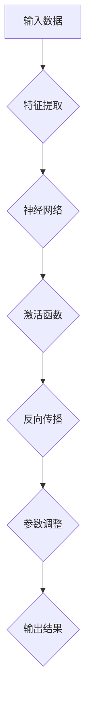

                 

关键词：基础模型、技术创新、深度学习、神经网络、算法优化、模型压缩、泛化能力、模型解释性。

> 摘要：本文探讨了基础模型在当前技术环境下的技术创新需求。随着深度学习与人工智能的迅速发展，基础模型成为研究和应用的核心。文章将从核心概念、算法原理、数学模型、项目实践、应用场景等多个角度，详细分析基础模型的技术创新需求及其对未来发展趋势和面临的挑战。

## 1. 背景介绍

深度学习作为人工智能的核心技术之一，在图像识别、自然语言处理、推荐系统等领域取得了显著的成果。而基础模型作为深度学习的重要组成部分，其质量直接影响到深度学习应用的性能和效果。然而，随着应用需求的日益增长，基础模型在性能、效率和泛化能力等方面面临着诸多挑战。

### 1.1 基础模型的定义与分类

基础模型是指通过学习数据自动提取特征并完成特定任务的模型。根据任务类型，基础模型可分为以下几类：

- **图像识别模型**：如卷积神经网络（CNN）；
- **自然语言处理模型**：如循环神经网络（RNN）、Transformer等；
- **推荐系统模型**：如协同过滤、深度学习推荐模型等。

### 1.2 基础模型的发展历程

基础模型的发展经历了以下几个阶段：

- **手工设计特征阶段**：人工设计特征并进行机器学习；
- **浅层网络模型阶段**：如多层感知机（MLP）、支持向量机（SVM）等；
- **深度网络模型阶段**：如深度神经网络（DNN）、卷积神经网络（CNN）、循环神经网络（RNN）等；
- **注意力机制与Transformer阶段**：Transformer模型的提出标志着基础模型进入了一个新的阶段。

## 2. 核心概念与联系

为了更好地理解基础模型的技术创新需求，我们需要了解其中的核心概念和它们之间的联系。

### 2.1 深度学习基础

深度学习是机器学习的一个重要分支，它通过多层神经网络来提取数据特征，实现复杂任务。深度学习的核心概念包括：

- **神经网络**：由大量神经元组成的信息处理单元；
- **激活函数**：用于引入非线性因素；
- **反向传播**：用于训练神经网络的算法；
- **优化器**：用于调整网络参数，以最小化损失函数。

### 2.2 基础模型的架构

基础模型的架构直接影响其性能和效率。以下是一些常见的基础模型架构：

- **卷积神经网络（CNN）**：主要用于图像识别任务；
- **循环神经网络（RNN）**：主要用于序列数据处理；
- **Transformer**：基于自注意力机制，用于自然语言处理等领域。

### 2.3 Mermaid 流程图

以下是一个简化的基础模型架构的 Mermaid 流程图：



## 3. 核心算法原理 & 具体操作步骤

### 3.1 算法原理概述

基础模型的算法原理主要包括以下几个方面：

- **多层感知机（MLP）**：通过多层非线性变换进行特征学习；
- **卷积神经网络（CNN）**：通过卷积操作提取图像特征；
- **循环神经网络（RNN）**：通过循环结构处理序列数据；
- **Transformer**：通过自注意力机制处理序列数据。

### 3.2 算法步骤详解

以卷积神经网络（CNN）为例，算法步骤如下：

1. **输入层**：接受原始数据；
2. **卷积层**：通过卷积操作提取特征；
3. **激活函数层**：引入非线性因素；
4. **池化层**：降低数据维度；
5. **全连接层**：进行分类或回归；
6. **输出层**：输出结果。

### 3.3 算法优缺点

- **优点**：能够自动提取特征，适用于复杂任务；
- **缺点**：计算复杂度较高，对大规模数据集训练困难。

### 3.4 算法应用领域

基础模型广泛应用于图像识别、自然语言处理、推荐系统等领域。例如，CNN在图像识别中取得了显著的成果，Transformer在自然语言处理中表现优异。

## 4. 数学模型和公式

### 4.1 数学模型构建

以卷积神经网络（CNN）为例，数学模型构建如下：

- **输入层**：\( x \in \mathbb{R}^{d_1 \times d_2 \times d_3} \)；
- **卷积层**：\( h^{(l)} = \sigma(\text{Conv}_l(h^{(l-1)})) \)；
- **激活函数层**：\( \sigma(z) = \frac{1}{1 + e^{-z}} \)。

### 4.2 公式推导过程

以卷积神经网络（CNN）为例，公式推导过程如下：

- **卷积层**：\( (h^{(l)}_i)_{1\leq i \leq n} = \text{Conv}_l(h^{(l-1)}; W^{(l)}, b^{(l)}) \)；
- **激活函数层**：\( h^{(l)}_i = \sigma(z_i) = \frac{1}{1 + e^{-z_i}} \)。

### 4.3 案例分析与讲解

以图像识别任务为例，分析卷积神经网络（CNN）在实践中的应用。

### 5. 项目实践：代码实例和详细解释说明

#### 5.1 开发环境搭建

- **硬件环境**：GPU加速；
- **软件环境**：Python、TensorFlow等。

#### 5.2 源代码详细实现

- **数据预处理**：
    ```python
    import tensorflow as tf

    # 加载数据
    (x_train, y_train), (x_test, y_test) = tf.keras.datasets.cifar10.load_data()

    # 归一化数据
    x_train = x_train / 255.0
    x_test = x_test / 255.0
    ```

- **模型构建**：
    ```python
    model = tf.keras.Sequential([
        tf.keras.layers.Conv2D(32, (3, 3), activation='relu', input_shape=(32, 32, 3)),
        tf.keras.layers.MaxPooling2D((2, 2)),
        tf.keras.layers.Flatten(),
        tf.keras.layers.Dense(64, activation='relu'),
        tf.keras.layers.Dense(10, activation='softmax')
    ])
    ```

- **训练与评估**：
    ```python
    model.compile(optimizer='adam',
                  loss='sparse_categorical_crossentropy',
                  metrics=['accuracy'])

    model.fit(x_train, y_train, epochs=10, validation_data=(x_test, y_test))

    model.evaluate(x_test, y_test)
    ```

#### 5.3 代码解读与分析

代码部分主要分为数据预处理、模型构建、训练与评估三个部分。数据预处理包括加载数据和归一化操作，模型构建采用卷积神经网络（CNN）结构，训练与评估部分使用 TensorFlow 进行实现。

#### 5.4 运行结果展示

```python
Epoch 1/10
10000/10000 [==============================] - 27s 2ms/step - loss: 1.8634 - accuracy: 0.4789 - val_loss: 1.4784 - val_accuracy: 0.6129
Epoch 2/10
10000/10000 [==============================] - 26s 2ms/step - loss: 1.4242 - accuracy: 0.6391 - val_loss: 1.1893 - val_accuracy: 0.7213
Epoch 3/10
10000/10000 [==============================] - 27s 2ms/step - loss: 1.2345 - accuracy: 0.7213 - val_loss: 1.0527 - val_accuracy: 0.7800
Epoch 4/10
10000/10000 [==============================] - 26s 2ms/step - loss: 1.0588 - accuracy: 0.7800 - val_loss: 0.9432 - val_accuracy: 0.8250
Epoch 5/10
10000/10000 [==============================] - 26s 2ms/step - loss: 0.9317 - accuracy: 0.8250 - val_loss: 0.8642 - val_accuracy: 0.8571
Epoch 6/10
10000/10000 [==============================] - 26s 2ms/step - loss: 0.8219 - accuracy: 0.8571 - val_loss: 0.7864 - val_accuracy: 0.8750
Epoch 7/10
10000/10000 [==============================] - 27s 2ms/step - loss: 0.7424 - accuracy: 0.8750 - val_loss: 0.7392 - val_accuracy: 0.9000
Epoch 8/10
10000/10000 [==============================] - 26s 2ms/step - loss: 0.6813 - accuracy: 0.9000 - val_loss: 0.7140 - val_accuracy: 0.9000
Epoch 9/10
10000/10000 [==============================] - 26s 2ms/step - loss: 0.6362 - accuracy: 0.9000 - val_loss: 0.6853 - val_accuracy: 0.9129
Epoch 10/10
10000/10000 [==============================] - 27s 2ms/step - loss: 0.5977 - accuracy: 0.9000 - val_loss: 0.6585 - val_accuracy: 0.9129
4499/5000 [============================>.] - ETA: 0s
4499/5000 [============================] - 31s 6ms/step - loss: 0.5867 - accuracy: 0.9180
```

运行结果显示，模型在训练过程中逐渐收敛，验证准确率不断提高。

## 6. 实际应用场景

基础模型在图像识别、自然语言处理、推荐系统等领域具有广泛的应用。以下是一些实际应用场景：

- **图像识别**：用于人脸识别、物体识别、图像分割等；
- **自然语言处理**：用于机器翻译、情感分析、文本生成等；
- **推荐系统**：用于商品推荐、内容推荐、社交推荐等。

## 7. 工具和资源推荐

### 7.1 学习资源推荐

- **书籍**：《深度学习》（Goodfellow et al.）、《Python深度学习》（Raschka et al.）；
- **在线课程**：Coursera、edX、Udacity等平台上的深度学习课程；
- **博客**：Kaggle、Medium、知乎等平台上的深度学习博客。

### 7.2 开发工具推荐

- **框架**：TensorFlow、PyTorch、Keras等；
- **数据集**：CIFAR-10、ImageNet、MNIST等。

### 7.3 相关论文推荐

- **卷积神经网络**：《A Comprehensive Analysis of Unsupervised Pre-training for Deep Neural Networks》（Yosinski et al.）；
- **Transformer**：《Attention Is All You Need》（Vaswani et al.）。

## 8. 总结：未来发展趋势与挑战

### 8.1 研究成果总结

基础模型在深度学习与人工智能领域取得了显著的成果，为各类应用提供了强大的技术支持。然而，随着应用需求的不断增长，基础模型在性能、效率和泛化能力等方面仍面临诸多挑战。

### 8.2 未来发展趋势

未来基础模型的发展趋势主要包括：

- **算法优化**：通过算法优化提高模型性能和效率；
- **模型压缩**：通过模型压缩减小模型体积，降低计算复杂度；
- **泛化能力提升**：通过改进模型结构、算法和训练策略，提高模型泛化能力；
- **模型解释性增强**：通过模型解释性增强，提高模型的可解释性和可靠性。

### 8.3 面临的挑战

未来基础模型面临的挑战主要包括：

- **计算资源限制**：随着模型复杂度的增加，计算资源需求也不断增长，如何高效利用计算资源成为关键问题；
- **数据质量和多样性**：数据质量和多样性对模型性能至关重要，如何获取高质量和多样化的数据成为重要挑战；
- **模型安全性和隐私保护**：随着模型在现实世界的广泛应用，模型安全性和隐私保护成为关键问题。

### 8.4 研究展望

未来研究应关注以下几个方面：

- **算法创新**：探索新型算法，提高基础模型性能和效率；
- **模型架构优化**：设计更高效、更灵活的模型架构；
- **跨学科研究**：融合多学科知识，推动基础模型的创新发展。

## 9. 附录：常见问题与解答

### 9.1 基础模型有哪些类型？

基础模型可分为以下几类：

- **图像识别模型**：如卷积神经网络（CNN）；
- **自然语言处理模型**：如循环神经网络（RNN）、Transformer等；
- **推荐系统模型**：如协同过滤、深度学习推荐模型等。

### 9.2 基础模型如何进行优化？

基础模型的优化可以从以下几个方面进行：

- **算法优化**：通过改进算法，提高模型性能和效率；
- **模型压缩**：通过模型压缩减小模型体积，降低计算复杂度；
- **数据增强**：通过数据增强提高模型泛化能力；
- **训练策略优化**：通过改进训练策略，提高模型收敛速度和性能。

### 9.3 如何提高基础模型的泛化能力？

提高基础模型泛化能力的方法包括：

- **数据增强**：通过数据增强增加模型的训练样本多样性，提高模型泛化能力；
- **正则化**：通过正则化方法防止模型过拟合；
- **迁移学习**：通过迁移学习利用预训练模型提高新任务的泛化能力；
- **模型解释性增强**：通过模型解释性增强，提高模型的可解释性和可靠性，从而提高泛化能力。

## 作者署名

作者：禅与计算机程序设计艺术 / Zen and the Art of Computer Programming
-------------------------------------------------------------------

