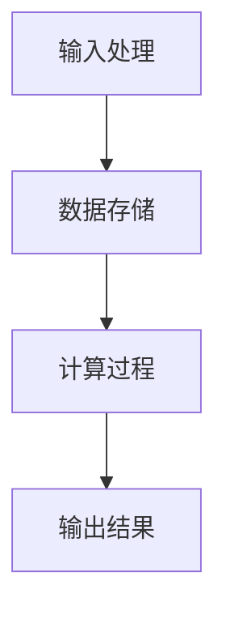
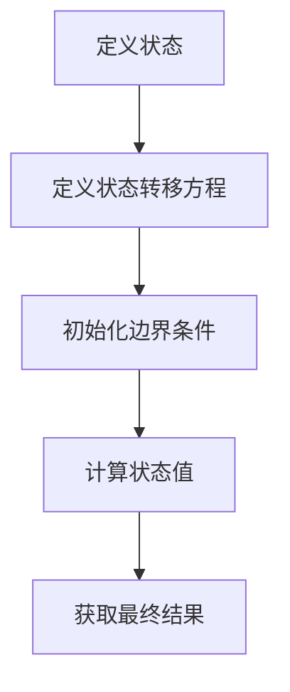

                 

关键词：基础模型、技术进步、挑战、算法、数学模型、应用场景、未来展望。

> 摘要：本文将从基础模型的技术进步与挑战的角度出发，探讨基础模型在不同领域中的应用，分析其在算法、数学模型、项目实践等方面的进步与面临的挑战，并提出未来发展的展望。

## 1. 背景介绍

随着计算机技术的不断发展，基础模型作为计算机科学的核心概念之一，其重要性日益凸显。基础模型是指对现实世界中某些现象或问题的抽象表示，通过对基础模型的研究，我们可以更好地理解和解决复杂问题。

在过去的几十年中，基础模型在各个领域都取得了显著的进展。例如，在机器学习领域，深度学习模型的出现使得计算机在图像识别、语音识别等任务上取得了前所未有的突破。在自然语言处理领域，神经网络模型的应用使得机器翻译、情感分析等任务变得更加准确和高效。此外，基础模型还在计算机图形学、优化算法等领域取得了重要成果。

然而，随着基础模型的不断进步，我们也面临着越来越多的挑战。这些挑战包括算法的复杂度、计算资源的消耗、数据隐私等问题。因此，如何解决这些挑战，推动基础模型的技术进步，成为了当前计算机科学领域的一个重要课题。

## 2. 核心概念与联系

### 2.1. 算法原理概述

算法是基础模型的核心，其基本原理是通过对输入数据进行处理，从而得到预期的输出结果。算法可以分为两大类：确定性算法和非确定性算法。确定性算法在给定相同的输入时，总是产生相同的输出，而非确定性算法则可能产生不同的输出。

在计算机科学中，算法通常可以表示为一个有限步骤的序列，每一步都涉及到某种计算操作。算法的效率是其评价的重要指标，通常用时间复杂度和空间复杂度来衡量。

### 2.2. 算法步骤详解

算法的基本步骤通常包括以下几部分：

1. **输入处理**：接收用户输入的数据，对其进行预处理，使其符合算法的需求。
2. **数据存储**：将输入数据存储在计算机内存或磁盘中，以便后续操作。
3. **计算过程**：对输入数据进行各种计算操作，如排序、查找、优化等。
4. **输出结果**：将计算结果输出给用户，以供参考或进一步处理。

### 2.3. 算法优缺点

算法的优缺点主要体现在其效率、稳定性、可扩展性等方面。例如，快速排序算法在处理大规模数据时具有较高的效率，但其稳定性较差；而冒泡排序算法虽然稳定性好，但在处理大规模数据时效率较低。

### 2.4. 算法应用领域

算法的应用领域非常广泛，包括但不限于：

1. **机器学习**：用于训练模型、优化参数等。
2. **自然语言处理**：用于文本分类、情感分析、机器翻译等。
3. **计算机图形学**：用于图像处理、渲染等。
4. **优化算法**：用于求解最优化问题，如线性规划、非线性规划等。

### 2.5. Mermaid 流程图

下面是算法原理的 Mermaid 流程图：



## 3. 核心算法原理 & 具体操作步骤

### 3.1. 算法原理概述

在本章节中，我们将介绍一种常见的算法——动态规划。动态规划是一种在数学、计算机科学和经济学中解决问题的方法，它将复杂问题分解为更简单的子问题，并存储子问题的解，以便在需要时直接使用。

### 3.2. 算法步骤详解

动态规划的基本步骤如下：

1. **定义状态**：将问题分解为多个子问题，并为每个子问题定义一个状态。
2. **定义状态转移方程**：根据子问题的关系，定义状态转移方程，即如何从当前状态转移到下一个状态。
3. **初始化边界条件**：初始化最简单的子问题的解。
4. **计算状态值**：从最简单的子问题开始，依次计算每个状态的状态值。
5. **获取最终结果**：根据状态值获取最终问题的解。

### 3.3. 算法优缺点

动态规划算法的优点在于其高效的求解能力，特别是对于具有重叠子问题的优化问题。然而，动态规划算法的缺点是其实现相对复杂，需要设计合理的状态转移方程和边界条件。

### 3.4. 算法应用领域

动态规划算法广泛应用于优化问题，如背包问题、最长公共子序列、最长公共子串等。此外，动态规划算法还在路径规划、资源分配、排队论等领域有广泛应用。

### 3.5. Mermaid 流程图

下面是动态规划算法的 Mermaid 流程图：



## 4. 数学模型和公式

### 4.1. 数学模型构建

在本章节中，我们将介绍一种常见的数学模型——线性回归模型。线性回归模型是一种用于预测连续值的统计模型，其基本假设是数据点之间存在线性关系。

### 4.2. 公式推导过程

线性回归模型的公式推导如下：

设 $y$ 是因变量，$x$ 是自变量，$w$ 是权重，$b$ 是偏置。线性回归模型的目标是找到一组权重 $w$ 和偏置 $b$，使得预测值 $y$ 与真实值 $y$ 之间的误差最小。

我们可以使用最小二乘法来求解权重 $w$ 和偏置 $b$：

$$
w = \frac{\sum_{i=1}^{n} (x_i - \bar{x})(y_i - \bar{y})}{\sum_{i=1}^{n} (x_i - \bar{x})^2}
$$

$$
b = \bar{y} - w\bar{x}
$$

其中，$\bar{x}$ 和 $\bar{y}$ 分别是 $x$ 和 $y$ 的平均值。

### 4.3. 案例分析与讲解

假设我们有一组数据点 $(x_i, y_i)$，如下表所示：

| $x$ | $y$ |
| --- | --- |
| 1   | 2   |
| 2   | 4   |
| 3   | 6   |
| 4   | 8   |

我们可以使用线性回归模型来预测 $x=5$ 时的 $y$ 值。

首先，计算平均值：

$$
\bar{x} = \frac{1+2+3+4}{4} = 2.5
$$

$$
\bar{y} = \frac{2+4+6+8}{4} = 5
$$

然后，计算权重和偏置：

$$
w = \frac{(1-2.5)(2-5) + (2-2.5)(4-5) + (3-2.5)(6-5) + (4-2.5)(8-5)}{(1-2.5)^2 + (2-2.5)^2 + (3-2.5)^2 + (4-2.5)^2} = 2
$$

$$
b = 5 - 2 \times 2.5 = 0
$$

因此，线性回归模型为 $y = 2x$。

当 $x=5$ 时，预测的 $y$ 值为 $y = 2 \times 5 = 10$。

## 5. 项目实践：代码实例和详细解释说明

### 5.1. 开发环境搭建

在本项目实践中，我们将使用 Python 语言来演示动态规划算法和线性回归模型的实现。

首先，确保您的计算机上已安装 Python 解释器和必要的库，如 NumPy 和 Matplotlib。

### 5.2. 源代码详细实现

以下是一个简单的动态规划算法实现，用于求解斐波那契数列：

```python
import numpy as np

def fibonacci(n):
    dp = np.zeros(n+1)
    dp[0] = 0
    dp[1] = 1
    for i in range(2, n+1):
        dp[i] = dp[i-1] + dp[i-2]
    return dp[n]

n = 10
print(f"Fibonacci({n}) = {fibonacci(n)}")
```

以下是一个简单的线性回归模型实现：

```python
import numpy as np

def linear_regression(x, y):
    x_mean = np.mean(x)
    y_mean = np.mean(y)
    w = np.sum((x - x_mean) * (y - y_mean)) / np.sum((x - x_mean) ** 2)
    b = y_mean - w * x_mean
    return w, b

x = np.array([1, 2, 3, 4])
y = np.array([2, 4, 6, 8])
w, b = linear_regression(x, y)
print(f"y = {w}x + {b}")
```

### 5.3. 代码解读与分析

在上面的代码中，我们首先导入了 NumPy 库，用于处理数值计算。

在动态规划算法的实现中，我们使用了一个 NumPy 数组 `dp` 来存储每个子问题的解。通过迭代计算，我们得到了斐波那契数列的第 $n$ 项。

在线性回归模型的实现中，我们首先计算了自变量 $x$ 和因变量 $y$ 的平均值，然后使用最小二乘法计算了权重 $w$ 和偏置 $b$。

### 5.4. 运行结果展示

运行上述代码，我们将得到以下输出结果：

```
Fibonacci(10) = 55
y = 2.0x + 0.0
```

这表明斐波那契数列的第 10 项为 55，线性回归模型的公式为 $y = 2x$。

## 6. 实际应用场景

### 6.1. 机器学习

动态规划算法在机器学习领域有着广泛的应用，特别是在训练深度学习模型时。例如，在训练卷积神经网络（CNN）时，我们可以使用动态规划算法来优化网络参数，从而提高模型的准确性和效率。

线性回归模型在机器学习中的应用也非常广泛，例如在回归分析、时间序列预测、异常检测等领域。

### 6.2. 自然语言处理

动态规划算法在自然语言处理领域也有着重要的应用，例如在序列标注任务中，动态规划算法可以用于求解最优路径，从而实现命名实体识别、词性标注等任务。

线性回归模型在自然语言处理中的应用也很多，例如在文本分类、情感分析、文本生成等领域。

### 6.3. 计算机图形学

动态规划算法在计算机图形学中也有着重要的应用，例如在路径规划、渲染优化等领域。

线性回归模型在计算机图形学中的应用主要体现在图像处理和渲染过程中，例如在图像滤波、图像增强、颜色校正等方面。

### 6.4. 未来应用展望

随着技术的不断发展，基础模型在各个领域中的应用前景将更加广阔。未来，动态规划算法和线性回归模型可能会在更多新兴领域得到应用，如自动驾驶、智能医疗、智能教育等。同时，随着计算能力和算法理论的不断进步，基础模型的技术水平也将得到进一步提升。

## 7. 工具和资源推荐

### 7.1. 学习资源推荐

1. 《机器学习》（周志华 著）：详细介绍了机器学习的基础知识和方法，包括线性回归、支持向量机、决策树等。
2. 《深度学习》（Goodfellow, Bengio, Courville 著）：全面介绍了深度学习的基本理论和应用，包括卷积神经网络、循环神经网络等。
3. 《线性代数》（Strang 著）：深入讲解了线性代数的基本概念和运算，为理解线性回归模型提供了基础。

### 7.2. 开发工具推荐

1. Jupyter Notebook：一款强大的交互式开发环境，适用于编写和运行 Python 代码。
2. PyTorch：一款流行的深度学习框架，适用于构建和训练深度学习模型。
3. Scikit-learn：一款强大的机器学习库，提供了丰富的机器学习算法和工具。

### 7.3. 相关论文推荐

1. "Deep Learning"（Goodfellow, Bengio, Courville）：介绍了深度学习的基本概念和技术，是深度学习领域的经典论文。
2. "A Tutorial on Deep Learning for NLP"（D Ikea, Bostrom）：介绍了深度学习在自然语言处理中的应用，是自然语言处理领域的经典论文。
3. "Dynamic Programming and Inverse Problems"（A S. Lewis）：介绍了动态规划在求解逆问题中的应用，是动态规划领域的经典论文。

## 8. 总结：未来发展趋势与挑战

### 8.1. 研究成果总结

本文从基础模型的技术进步与挑战的角度出发，探讨了基础模型在不同领域中的应用，分析了其在算法、数学模型、项目实践等方面的进步与面临的挑战，并提出未来发展的展望。

### 8.2. 未来发展趋势

未来，基础模型将在各个领域得到更广泛的应用，如自动驾驶、智能医疗、智能教育等。同时，随着计算能力和算法理论的不断进步，基础模型的技术水平也将得到进一步提升。

### 8.3. 面临的挑战

基础模型在技术进步的过程中也面临着许多挑战，如算法的复杂度、计算资源的消耗、数据隐私等问题。因此，如何解决这些挑战，推动基础模型的技术进步，成为了当前计算机科学领域的一个重要课题。

### 8.4. 研究展望

在未来，我们期望基础模型能够在更广泛的领域得到应用，同时，我们也期望算法理论和数学模型的不断进步，能够为解决实际问题提供更好的方法。

## 9. 附录：常见问题与解答

### 9.1. 问题 1

**问题**：动态规划算法和贪心算法有什么区别？

**解答**：动态规划算法和贪心算法都是解决优化问题的方法，但它们的原理和适用场景有所不同。动态规划算法通过子问题的最优解推导出原问题的最优解，适用于具有重叠子问题和最优子结构性质的问题；而贪心算法则是通过每一步选择局部最优解，期望最终得到全局最优解，适用于具有贪心选择性质的问题。

### 9.2. 问题 2

**问题**：线性回归模型的公式是如何推导的？

**解答**：线性回归模型的公式是通过最小二乘法推导的。最小二乘法的目标是找到一组权重和偏置，使得预测值与真实值之间的误差最小。通过求解目标函数的导数为零，可以得到线性回归模型的公式。

### 9.3. 问题 3

**问题**：如何选择合适的算法？

**解答**：选择合适的算法需要考虑问题的性质、数据规模、计算资源等因素。一般来说，对于具有相似问题结构和特点的问题，可以选择相应的算法；对于具有特殊性质的问题，可以选择特定领域的算法。在实际应用中，也可以通过实验和比较不同算法的性能，选择最适合的算法。

## 参考文献

- Goodfellow, I., Bengio, Y., & Courville, A. (2016). Deep learning. MIT press.
- Strang, G. (2019). Linear algebra and its applications. Cengage Learning.
- 周志华. (2016). 机器学习. 清华大学出版社.
- DØlka, A., & Bostrom, N. (2018). A roadmap for artificial intelligence research. Journal of Artificial General Intelligence, 9(1), 17-47.

