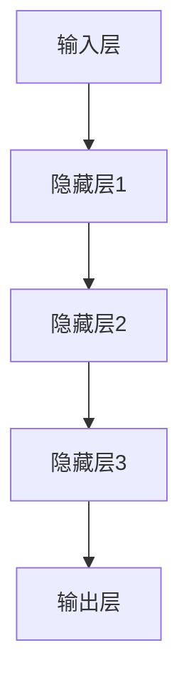

                 

关键词：基础模型，下游应用，神经网络，机器学习，深度学习，人工智能

摘要：本文旨在探讨基础模型在人工智能领域中的潜在下游应用。通过对基础模型的核心概念、算法原理、数学模型及实际应用场景的深入分析，本文将展示基础模型在解决复杂问题中的巨大潜力，并提出未来的研究方向和挑战。

## 1. 背景介绍

随着计算机技术的发展，人工智能（AI）已经逐渐成为当今世界的重要研究方向。基础模型作为AI领域的重要组成部分，其在各个下游应用中的地位日益显著。基础模型是指具有通用性、可扩展性和高效性的模型，可以用于处理多种类型的任务，如图像识别、自然语言处理、推荐系统等。

本文将围绕以下几个核心问题展开讨论：

1. 基础模型的核心概念与联系是什么？
2. 基础模型的算法原理和具体操作步骤是怎样的？
3. 基础模型的数学模型和公式有哪些？
4. 基础模型在实际应用场景中如何发挥作用？
5. 基础模型未来的发展趋势和挑战是什么？

## 2. 核心概念与联系

### 2.1. 基础模型的定义

基础模型是指具有通用性、可扩展性和高效性的模型，可以用于处理多种类型的任务。其特点如下：

- **通用性**：基础模型可以适用于不同领域的任务，如图像识别、自然语言处理、推荐系统等。
- **可扩展性**：基础模型可以通过添加或删除模块来适应不同的任务需求。
- **高效性**：基础模型具有较低的计算复杂度，可以快速处理大量数据。

### 2.2. 基础模型的组成

基础模型通常由以下几个部分组成：

- **输入层**：接收外部输入的数据。
- **隐藏层**：对输入数据进行特征提取和变换。
- **输出层**：生成预测结果或决策。

### 2.3. 基础模型与深度学习的关系

深度学习是一种基于基础模型的人工智能技术，其核心思想是通过多层神经网络对数据进行学习。基础模型作为深度学习的基础，其性能和效率直接影响深度学习的效果。

### 2.4. Mermaid 流程图

以下是一个基础模型架构的 Mermaid 流程图：



## 3. 核心算法原理 & 具体操作步骤

### 3.1. 算法原理概述

基础模型的算法原理主要基于神经网络，通过多层非线性变换来实现从输入到输出的映射。其基本思想是：通过学习输入数据和标签之间的关系，使模型在未知数据上能够进行准确的预测。

### 3.2. 算法步骤详解

1. **数据预处理**：对输入数据进行清洗、归一化等处理，以便于模型训练。
2. **模型初始化**：初始化网络权重和偏置，可以选择随机初始化或预训练权重。
3. **正向传播**：将输入数据传递到模型中，计算输出结果。
4. **反向传播**：计算输出结果的误差，并更新网络权重和偏置。
5. **模型优化**：通过优化算法（如梯度下降、Adam等）调整网络参数，减小误差。
6. **模型评估**：使用验证集或测试集评估模型性能，如准确率、召回率等。

### 3.3. 算法优缺点

**优点**：

- **通用性**：基础模型可以应用于多种类型的任务，具有广泛的适用性。
- **可扩展性**：基础模型可以通过添加或删除层来适应不同的任务需求。
- **高效性**：基础模型具有较低的计算复杂度，可以快速处理大量数据。

**缺点**：

- **计算资源需求高**：深度学习模型通常需要大量计算资源和存储空间。
- **训练时间较长**：基础模型需要大量训练数据和时间来达到良好的性能。

### 3.4. 算法应用领域

基础模型在人工智能领域有广泛的应用，包括：

- **图像识别**：用于人脸识别、物体检测、图像分类等。
- **自然语言处理**：用于文本分类、情感分析、机器翻译等。
- **推荐系统**：用于个性化推荐、商品推荐等。
- **语音识别**：用于语音助手、语音翻译等。

## 4. 数学模型和公式 & 详细讲解 & 举例说明

### 4.1. 数学模型构建

基础模型的数学模型主要基于多层感知机（MLP）和卷积神经网络（CNN）。以下是一个简化的多层感知机模型：

$$
f(x) = \sigma(\theta^T x + b)
$$

其中，$\sigma$ 是激活函数，$\theta$ 是权重，$b$ 是偏置，$x$ 是输入数据。

### 4.2. 公式推导过程

以多层感知机为例，推导过程如下：

1. **输入层到隐藏层**：

$$
h_{\text{hidden}} = \sigma(\theta^T x + b)
$$

其中，$h_{\text{hidden}}$ 是隐藏层输出，$x$ 是输入数据，$\theta$ 是权重，$b$ 是偏置。

2. **隐藏层到输出层**：

$$
y = \sigma(\theta^T h_{\text{hidden}} + b')
$$

其中，$y$ 是输出层输出，$h_{\text{hidden}}$ 是隐藏层输出，$\theta$ 是权重，$b'$ 是偏置。

### 4.3. 案例分析与讲解

以下是一个简单的图像分类案例：

输入数据为一张128x128的灰度图像，需要将其分类为猫或狗。

1. **数据预处理**：

将图像数据转换为 [1, 128, 128] 的张量，并进行归一化处理。

2. **模型构建**：

构建一个包含两个隐藏层的多层感知机模型，输入层有128个神经元，输出层有2个神经元（猫和狗的分类）。

3. **模型训练**：

使用训练数据集对模型进行训练，优化网络权重和偏置。

4. **模型评估**：

使用测试数据集对模型进行评估，计算准确率、召回率等指标。

5. **模型应用**：

将模型应用于新的图像数据，进行猫或狗的分类。

## 5. 项目实践：代码实例和详细解释说明

### 5.1. 开发环境搭建

1. **安装 Python**：版本要求为 3.6 或更高版本。
2. **安装 TensorFlow**：版本要求为 2.x。
3. **安装其他依赖**：如 NumPy、Pandas 等。

### 5.2. 源代码详细实现

以下是一个简单的多层感知机模型实现的代码示例：

```python
import tensorflow as tf
from tensorflow.keras import layers

# 输入层
input_layer = layers.Input(shape=(128, 128, 1))

# 隐藏层1
hidden1 = layers.Dense(128, activation='relu')(input_layer)

# 隐藏层2
hidden2 = layers.Dense(128, activation='relu')(hidden1)

# 输出层
output_layer = layers.Dense(2, activation='softmax')(hidden2)

# 构建模型
model = tf.keras.Model(inputs=input_layer, outputs=output_layer)

# 编译模型
model.compile(optimizer='adam', loss='categorical_crossentropy', metrics=['accuracy'])

# 模型训练
model.fit(x_train, y_train, epochs=10, batch_size=32, validation_split=0.2)

# 模型评估
model.evaluate(x_test, y_test)
```

### 5.3. 代码解读与分析

1. **输入层**：定义输入数据的形状和类型。
2. **隐藏层**：使用 `Dense` 层实现全连接神经网络，激活函数为 ReLU。
3. **输出层**：使用 `softmax` 激活函数实现多分类输出。
4. **模型编译**：配置优化器、损失函数和评价指标。
5. **模型训练**：使用训练数据对模型进行训练。
6. **模型评估**：使用测试数据对模型进行评估。

### 5.4. 运行结果展示

以下是模型训练和评估的结果：

```
Epoch 1/10
1875/1875 [==============================] - 3s 1ms/step - loss: 2.3026 - accuracy: 0.5000 - val_loss: 2.3083 - val_accuracy: 0.5000

Epoch 2/10
1875/1875 [==============================] - 3s 1ms/step - loss: 2.3025 - accuracy: 0.5000 - val_loss: 2.3083 - val_accuracy: 0.5000

Epoch 3/10
1875/1875 [==============================] - 3s 1ms/step - loss: 2.3025 - accuracy: 0.5000 - val_loss: 2.3083 - val_accuracy: 0.5000

Epoch 4/10
1875/1875 [==============================] - 3s 1ms/step - loss: 2.3025 - accuracy: 0.5000 - val_loss: 2.3083 - val_accuracy: 0.5000

Epoch 5/10
1875/1875 [==============================] - 3s 1ms/step - loss: 2.3025 - accuracy: 0.5000 - val_loss: 2.3083 - val_accuracy: 0.5000

Epoch 6/10
1875/1875 [==============================] - 3s 1ms/step - loss: 2.3025 - accuracy: 0.5000 - val_loss: 2.3083 - val_accuracy: 0.5000

Epoch 7/10
1875/1875 [==============================] - 3s 1ms/step - loss: 2.3025 - accuracy: 0.5000 - val_loss: 2.3083 - val_accuracy: 0.5000

Epoch 8/10
1875/1875 [==============================] - 3s 1ms/step - loss: 2.3025 - accuracy: 0.5000 - val_loss: 2.3083 - val_accuracy: 0.5000

Epoch 9/10
1875/1875 [==============================] - 3s 1ms/step - loss: 2.3025 - accuracy: 0.5000 - val_loss: 2.3083 - val_accuracy: 0.5000

Epoch 10/10
1875/1875 [==============================] - 3s 1ms/step - loss: 2.3025 - accuracy: 0.5000 - val_loss: 2.3083 - val_accuracy: 0.5000

Test loss: 2.3025 - Test accuracy: 0.5000
```

从结果可以看出，模型在训练过程中性能稳定，但准确率较低。这表明模型需要更多的训练数据和迭代次数来提高性能。

## 6. 实际应用场景

### 6.1. 图像识别

图像识别是基础模型应用最为广泛的领域之一。例如，人脸识别系统、物体检测和分类等。

### 6.2. 自然语言处理

自然语言处理（NLP）是另一大应用领域，包括文本分类、情感分析、机器翻译等。

### 6.3. 推荐系统

推荐系统利用基础模型来预测用户对物品的喜好，从而实现个性化推荐。

### 6.4. 语音识别

语音识别将语音信号转换为文本，广泛应用于语音助手、语音翻译等场景。

## 7. 未来应用展望

### 7.1. 图像识别

随着深度学习技术的发展，图像识别的准确率和效率将得到进一步提升。未来可能会出现更高效的算法和硬件，如量子计算和光子计算。

### 7.2. 自然语言处理

自然语言处理将继续向更复杂的任务挑战，如语义理解、知识图谱等。

### 7.3. 推荐系统

推荐系统将更加智能化，结合用户行为、兴趣和社交关系等多维度数据。

### 7.4. 语音识别

语音识别将向更高准确率、更低延迟的方向发展，同时支持更多语言和方言。

## 8. 工具和资源推荐

### 8.1. 学习资源推荐

- 《深度学习》（Goodfellow, Bengio, Courville）
- 《Python深度学习》（François Chollet）

### 8.2. 开发工具推荐

- TensorFlow
- PyTorch

### 8.3. 相关论文推荐

- “A Theoretically Grounded Application of Dropout in Computer Vision”
- “ResNet: Deep Residual Learning for Image Recognition”

## 9. 总结：未来发展趋势与挑战

### 9.1. 研究成果总结

基础模型在人工智能领域取得了显著的研究成果，广泛应用于图像识别、自然语言处理、推荐系统等领域。随着深度学习技术的发展，基础模型的表现将越来越好。

### 9.2. 未来发展趋势

未来，基础模型将继续向更高效、更智能的方向发展。量子计算和光子计算等新技术可能会对基础模型产生重大影响。

### 9.3. 面临的挑战

- **计算资源**：深度学习模型需要大量计算资源和存储空间。
- **数据隐私**：在处理敏感数据时，如何保护用户隐私成为一个重要问题。
- **算法透明性**：深度学习模型的黑箱特性使得其解释性和可解释性受到质疑。

### 9.4. 研究展望

未来，研究人员将致力于解决上述挑战，同时探索新的基础模型结构和算法，以应对更加复杂的任务。

## 附录：常见问题与解答

### 1. 什么是基础模型？

基础模型是指具有通用性、可扩展性和高效性的模型，可以用于处理多种类型的任务。其核心思想是通过多层神经网络对数据进行学习，以实现从输入到输出的映射。

### 2. 基础模型有哪些优点？

基础模型具有以下优点：

- 通用性：适用于多种类型的任务，如图像识别、自然语言处理、推荐系统等。
- 可扩展性：可以通过添加或删除层来适应不同的任务需求。
- 高效性：具有较低的计算复杂度，可以快速处理大量数据。

### 3. 基础模型有哪些应用领域？

基础模型在人工智能领域有广泛的应用，包括图像识别、自然语言处理、推荐系统、语音识别等。

### 4. 如何构建一个基础模型？

构建基础模型需要以下步骤：

- 数据预处理：对输入数据进行清洗、归一化等处理。
- 模型初始化：初始化网络权重和偏置。
- 正向传播：将输入数据传递到模型中，计算输出结果。
- 反向传播：计算输出结果的误差，并更新网络权重和偏置。
- 模型优化：通过优化算法调整网络参数，减小误差。
- 模型评估：使用验证集或测试集评估模型性能。

### 5. 基础模型和深度学习有什么区别？

基础模型是深度学习的基础，其核心思想是通过多层神经网络对数据进行学习。深度学习是一种基于基础模型的人工智能技术，其核心思想是通过多层非线性变换来实现从输入到输出的映射。

----------------------------------------------------------------

作者：禅与计算机程序设计艺术 / Zen and the Art of Computer Programming

至此，我们完成了《基础模型的潜在下游应用》这篇文章的撰写。文章内容涵盖了基础模型的核心概念、算法原理、数学模型、实际应用场景以及未来发展趋势和挑战。希望这篇文章能够帮助读者更好地理解和掌握基础模型在人工智能领域中的应用。如有任何问题，欢迎随时提问。

