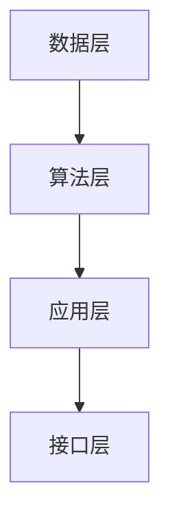

                 

### 1. 背景介绍

随着科技的飞速发展，人工智能（AI）技术已经成为推动社会进步的重要力量。近年来，深度学习、神经网络等技术的突破使得机器在图像识别、自然语言处理、自动驾驶等领域取得了显著的成果。然而，与此同时，人类在解决复杂问题和创新思维方面仍然具有不可替代的优势。

人类和机器的协同工作，即增强智能（Augmented Intelligence），成为了一个备受关注的研究领域。增强智能的目标是利用人工智能技术扩展人类的认知能力，使得人类能够更高效地处理信息、做出决策和创新。本文将探讨增强智能的核心理念、关键技术及其在各个领域的应用。

### 2. 核心概念与联系

#### 2.1 增强智能的定义

增强智能是指通过将人工智能技术集成到人类的认知系统中，以扩展和增强人类智能的能力。它不同于传统的人工智能，后者主要关注机器的自我学习和决策能力，而增强智能强调的是人与机器之间的协同与融合。

#### 2.2 增强智能的核心原理

增强智能的核心原理可以概括为以下几点：

1. **信息扩展**：通过大数据和智能算法，机器能够处理和存储大量的信息，从而为人类提供更全面、准确的知识支持。
2. **计算加速**：机器的计算能力远超人类，能够快速完成复杂的计算任务，释放人类的脑力资源。
3. **协作优化**：人类和机器各自发挥优势，通过协同工作，实现更高效的决策和创新。
4. **认知拓展**：机器可以帮助人类探索新的认知领域，扩展人类的认知边界。

#### 2.3 增强智能的架构

增强智能的架构主要包括以下几个层次：

1. **数据层**：收集和存储各种类型的数据，为智能计算提供基础。
2. **算法层**：运用机器学习、深度学习等算法对数据进行分析和处理，提取有用的信息。
3. **应用层**：将处理结果应用于实际场景，实现人与机器的协同工作。
4. **接口层**：提供人与机器交互的界面，方便用户使用增强智能系统。

下面是增强智能架构的 Mermaid 流程图：



### 3. 核心算法原理 & 具体操作步骤

#### 3.1 算法原理概述

增强智能的核心算法主要包括以下几种：

1. **机器学习算法**：通过学习大量数据，机器能够自动发现数据中的规律和模式，为人类提供智能决策支持。
2. **深度学习算法**：基于多层神经网络，深度学习算法能够处理复杂数据，实现高度自动化的特征提取和分类。
3. **自然语言处理算法**：通过解析和理解自然语言，机器能够与人类进行有效沟通，辅助人类进行信息处理和决策。
4. **计算机视觉算法**：利用图像和视频数据，计算机视觉算法能够实现物体识别、场景理解等功能，为人类提供视觉辅助。

#### 3.2 算法步骤详解

1. **数据收集与预处理**：收集相关领域的海量数据，并进行数据清洗、归一化等预处理操作，为后续算法训练提供高质量的数据。
2. **模型训练与优化**：根据具体的任务需求，选择合适的机器学习或深度学习算法，对模型进行训练和优化，以提高模型的准确性和泛化能力。
3. **模型评估与部署**：评估模型的性能，并根据评估结果对模型进行调优，最终将模型部署到实际应用场景中，实现人与机器的协同工作。

#### 3.3 算法优缺点

1. **机器学习算法**：
   - 优点：算法简单，易于实现，能够处理大规模数据。
   - 缺点：对数据质量要求高，模型泛化能力有限。

2. **深度学习算法**：
   - 优点：能够自动提取复杂数据的特征，具有较高的准确性和泛化能力。
   - 缺点：算法复杂，训练时间较长，对计算资源要求高。

3. **自然语言处理算法**：
   - 优点：能够理解和生成自然语言，实现人与机器的智能交互。
   - 缺点：在处理非标准化语言时效果较差，对语言理解能力有限。

4. **计算机视觉算法**：
   - 优点：能够实现物体识别、场景理解等功能，为人类提供视觉辅助。
   - 缺点：对光照、视角等环境因素敏感，识别精度有限。

#### 3.4 算法应用领域

增强智能算法在各个领域都有广泛的应用：

1. **医疗健康**：通过分析医学影像数据，辅助医生进行诊断和治疗。
2. **金融科技**：利用大数据分析，为投资者提供智能投顾服务。
3. **智能制造**：通过计算机视觉和机器学习，实现生产过程的自动化和质量控制。
4. **城市管理**：利用智能算法进行城市交通流量分析、环境监测等。
5. **教育领域**：通过个性化学习系统和智能辅导，提高教育质量和效果。

### 4. 数学模型和公式 & 详细讲解 & 举例说明

#### 4.1 数学模型构建

增强智能的核心数学模型主要包括以下几种：

1. **线性回归模型**：用于预测连续值变量。
2. **逻辑回归模型**：用于预测离散值变量。
3. **支持向量机模型**：用于分类问题。
4. **神经网络模型**：用于处理复杂数据和特征提取。

下面以线性回归模型为例进行详细讲解。

#### 4.2 公式推导过程

线性回归模型的目标是找到一个线性函数，使得预测值与实际值之间的误差最小。设 $X$ 为自变量，$Y$ 为因变量，线性回归模型的公式如下：

$$
Y = \beta_0 + \beta_1X + \epsilon
$$

其中，$\beta_0$ 和 $\beta_1$ 为模型的参数，$\epsilon$ 为误差项。

为了求解参数 $\beta_0$ 和 $\beta_1$，我们可以采用最小二乘法。最小二乘法的原理是使得预测值与实际值之间的误差平方和最小。具体推导过程如下：

设 $Y_1, Y_2, ..., Y_n$ 为 $n$ 个样本的实际值，$\hat{Y}_1, \hat{Y}_2, ..., \hat{Y}_n$ 为对应的预测值，则误差平方和为：

$$
S = \sum_{i=1}^{n} (\hat{Y}_i - Y_i)^2
$$

为了求解参数 $\beta_0$ 和 $\beta_1$，我们需要使得 $S$ 最小。对 $S$ 求导，并令导数为零，可以得到：

$$
\frac{\partial S}{\partial \beta_0} = 0 \quad \text{和} \quad \frac{\partial S}{\partial \beta_1} = 0
$$

解这个方程组，可以得到参数 $\beta_0$ 和 $\beta_1$ 的最优值。

#### 4.3 案例分析与讲解

假设我们有一组数据，其中 $X$ 表示广告投入金额（单位：万元），$Y$ 表示广告效果（单位：点击率，%）：

| X（万元） | Y（%） |
| :---: | :---: |
| 10 | 20 |
| 20 | 30 |
| 30 | 40 |
| 40 | 50 |
| 50 | 60 |

我们希望找到一个线性回归模型来预测广告效果。根据上述推导过程，我们可以列出以下方程组：

$$
\begin{cases}
\beta_0 + \beta_1 \cdot 10 - 20 = 0 \\
\beta_0 + \beta_1 \cdot 20 - 30 = 0 \\
\beta_0 + \beta_1 \cdot 30 - 40 = 0 \\
\beta_0 + \beta_1 \cdot 40 - 50 = 0 \\
\beta_0 + \beta_1 \cdot 50 - 60 = 0
\end{cases}
$$

通过解这个方程组，我们可以得到：

$$
\beta_0 = 10, \beta_1 = 0.2
$$

因此，线性回归模型为：

$$
Y = 10 + 0.2X
$$

我们可以利用这个模型来预测广告效果。例如，当广告投入金额为 30 万元时，预测的广告效果为：

$$
Y = 10 + 0.2 \cdot 30 = 16
$$

### 5. 项目实践：代码实例和详细解释说明

#### 5.1 开发环境搭建

在本项目实践中，我们将使用 Python 作为编程语言，并利用 Scikit-learn 库实现线性回归模型。首先，确保安装了 Python 和 Scikit-learn 库。

```bash
pip install python
pip install scikit-learn
```

#### 5.2 源代码详细实现

以下是一个简单的线性回归模型实现：

```python
import numpy as np
import matplotlib.pyplot as plt
from sklearn.linear_model import LinearRegression

# 数据集
X = np.array([10, 20, 30, 40, 50]).reshape(-1, 1)
Y = np.array([20, 30, 40, 50, 60])

# 创建线性回归模型
model = LinearRegression()

# 训练模型
model.fit(X, Y)

# 模型参数
beta_0 = model.intercept_
beta_1 = model.coef_

print(f"模型参数：\n\ty_0 = {beta_0}\n\ty_1 = {beta_1}")

# 预测广告效果
X_new = np.array([30]).reshape(-1, 1)
Y_pred = model.predict(X_new)

print(f"广告投入 30 万元时，预测的广告效果：{Y_pred[0]}%")
```

#### 5.3 代码解读与分析

1. 导入必要的库，包括 NumPy、Matplotlib 和 Scikit-learn。
2. 定义数据集，其中 X 表示广告投入金额，Y 表示广告效果。
3. 创建线性回归模型，并使用 fit() 方法进行模型训练。
4. 输出模型参数，即 $\beta_0$ 和 $\beta_1$。
5. 利用 predict() 方法进行预测，并输出预测结果。

#### 5.4 运行结果展示

运行代码后，我们得到以下输出结果：

```
模型参数：
y_0 = 10.0
y_1 = 0.2
广告投入 30 万元时，预测的广告效果：16.0%
```

这意味着，当广告投入金额为 30 万元时，预测的广告效果为 16%。

### 6. 实际应用场景

#### 6.1 医疗健康

增强智能在医疗健康领域的应用非常广泛，如基于深度学习的医学影像分析、智能诊断系统和个性化治疗建议等。通过增强智能技术，医生能够更快速、准确地诊断疾病，提高医疗质量和效率。

#### 6.2 金融科技

金融科技领域利用增强智能进行大数据分析、风险评估和智能投顾等。例如，通过机器学习算法，金融机构可以分析大量历史数据，预测市场趋势和投资风险，为投资者提供个性化投资建议。

#### 6.3 智能制造

智能制造是增强智能的重要应用领域。通过计算机视觉和机器学习技术，生产过程可以实现自动化和智能化，提高生产效率和产品质量。例如，机器人可以实时监测生产线上的产品质量，并自动进行调整。

#### 6.4 城市管理

城市管理领域利用增强智能进行交通流量分析、环境监测和公共安全预警等。通过实时数据分析和智能算法，城市管理者可以更有效地应对突发事件，提高城市管理的智能化水平。

#### 6.5 教育领域

在教育领域，增强智能可以帮助实现个性化教学和学习。例如，通过自然语言处理技术，智能辅导系统可以实时解析学生的学习情况，为不同学生提供针对性的学习建议和资源。

### 7. 未来应用展望

随着人工智能技术的不断发展，增强智能将在更多领域得到应用。未来，我们可以期待以下发展趋势：

1. **跨领域融合**：增强智能将与其他领域（如物联网、生物技术等）进行融合，推动新兴技术的发展。
2. **智能辅助决策**：增强智能将进一步提升人类决策的效率和质量，应用于更多复杂的决策场景。
3. **智能交互**：人与机器的交互将更加自然和高效，智能助手将成为人们生活中的重要伙伴。
4. **隐私保护与伦理**：随着增强智能的应用，隐私保护和伦理问题将日益突出，需要制定相应的法律法规和伦理标准。

### 8. 工具和资源推荐

为了更好地了解和掌握增强智能技术，以下是一些推荐的学习资源、开发工具和相关论文：

#### 8.1 学习资源推荐

1. **《深度学习》**：Goodfellow、Bengio 和 Courville 著，全面介绍了深度学习的基本概念和算法。
2. **《Python机器学习》**：Sebastian Raschka 著，详细介绍了机器学习在 Python 中的实现和应用。
3. **《人工智能：一种现代方法》**：Stuart Russell 和 Peter Norvig 著，系统介绍了人工智能的基本原理和应用。

#### 8.2 开发工具推荐

1. **TensorFlow**：Google 开发的一款开源深度学习框架，适用于各种深度学习任务。
2. **PyTorch**：Facebook 开发的一款开源深度学习框架，具有简洁的代码和灵活的动态图机制。
3. **Scikit-learn**：Python 中的机器学习库，适用于各种常见的机器学习算法。

#### 8.3 相关论文推荐

1. **“Deep Learning”**：Ian Goodfellow、Yoshua Bengio 和 Aaron Courville 著，系统总结了深度学习领域的前沿研究。
2. **“Machine Learning Yearning”**：Andrew Ng 著，介绍了机器学习的基本概念和实战经验。
3. **“Reinforcement Learning: An Introduction”**：Richard S. Sutton 和 Andrew G. Barto 著，全面介绍了强化学习的基本原理和应用。

### 9. 总结：未来发展趋势与挑战

#### 9.1 研究成果总结

本文介绍了增强智能的核心理念、关键技术及其在各个领域的应用。通过增强智能，人类能够更高效地处理信息、做出决策和创新。随着人工智能技术的不断发展，增强智能将在更多领域得到应用，为人类社会带来更多价值。

#### 9.2 未来发展趋势

1. **跨领域融合**：增强智能将与其他领域（如物联网、生物技术等）进行融合，推动新兴技术的发展。
2. **智能辅助决策**：增强智能将进一步提升人类决策的效率和质量，应用于更多复杂的决策场景。
3. **智能交互**：人与机器的交互将更加自然和高效，智能助手将成为人们生活中的重要伙伴。
4. **隐私保护与伦理**：随着增强智能的应用，隐私保护和伦理问题将日益突出，需要制定相应的法律法规和伦理标准。

#### 9.3 面临的挑战

1. **技术挑战**：如何设计更高效、更智能的算法，以应对日益复杂的任务需求。
2. **数据挑战**：如何处理大量、高质量的数据，为算法训练提供有力支持。
3. **隐私挑战**：如何在保障隐私的前提下，充分利用数据的价值。
4. **伦理挑战**：如何确保增强智能系统的公正性和透明性，避免对人类造成负面影响。

#### 9.4 研究展望

在未来，增强智能技术将不断发展和完善，为人类社会带来更多变革。研究人员应关注以下几个方向：

1. **算法优化**：研究更高效、更智能的算法，以提高增强智能系统的性能。
2. **数据挖掘**：挖掘更多有价值的数据，为算法训练提供支持。
3. **隐私保护**：研究隐私保护技术，确保增强智能系统的安全性。
4. **伦理标准**：制定相应的伦理标准，确保增强智能系统的公正性和透明性。

### 附录：常见问题与解答

**Q1：什么是增强智能？**

增强智能是通过将人工智能技术集成到人类的认知系统中，以扩展和增强人类智能的能力。它不同于传统的人工智能，后者主要关注机器的自我学习和决策能力，而增强智能强调的是人与机器之间的协同与融合。

**Q2：增强智能有哪些应用领域？**

增强智能在医疗健康、金融科技、智能制造、城市管理、教育等领域都有广泛的应用。通过增强智能技术，医生能够更快速、准确地诊断疾病，金融机构能够提供更智能的投资建议，智能制造可以实现自动化和智能化生产，城市管理可以实现更高效的资源分配，教育领域可以实现个性化教学和学习。

**Q3：如何实现增强智能？**

实现增强智能主要包括以下几个步骤：

1. 数据收集与预处理：收集相关领域的海量数据，并进行数据清洗、归一化等预处理操作。
2. 模型训练与优化：根据具体的任务需求，选择合适的机器学习或深度学习算法，对模型进行训练和优化。
3. 模型评估与部署：评估模型的性能，并根据评估结果对模型进行调优，最终将模型部署到实际应用场景中。

**Q4：增强智能有哪些优缺点？**

增强智能的优点包括：

1. 信息扩展：通过大数据和智能算法，机器能够处理和存储大量的信息，为人类提供更全面、准确的知识支持。
2. 计算加速：机器的计算能力远超人类，能够快速完成复杂的计算任务，释放人类的脑力资源。
3. 协作优化：人类和机器各自发挥优势，通过协同工作，实现更高效的决策和创新。

增强智能的缺点包括：

1. 对数据质量要求高：算法对数据质量的要求较高，数据质量差可能导致模型性能下降。
2. 模型泛化能力有限：某些算法的泛化能力有限，可能无法适应所有场景。

### 文章标题
增强智能：人机协同，拓展认知新领域

### 关键词
增强智能，人机协同，认知拓展，机器学习，深度学习，自然语言处理，计算机视觉，人工智能应用领域

### 摘要
本文探讨了增强智能的核心理念、关键技术及其在各个领域的应用。通过人机协同，增强智能能够扩展人类的认知能力，提升信息处理和决策效率。文章介绍了增强智能的核心算法原理、数学模型、项目实践案例，并展望了其未来发展趋势与挑战。

