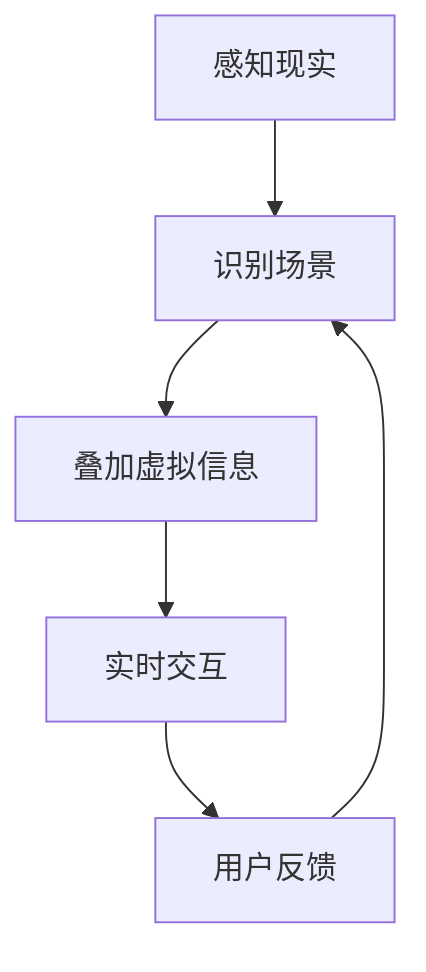

                 

关键词：增强现实，AR技术，虚拟现实，混合现实，现实融合，AR管理，虚拟与现实的交互，技术发展趋势，应用场景。

摘要：本文深入探讨了增强现实（AR）管理的核心概念、技术原理、应用场景以及未来发展。通过对AR技术的详细介绍，本文旨在为读者提供一个全面了解和掌握AR管理的视角，以及其在现代信息技术领域中的潜在价值和广泛应用。

## 1. 背景介绍

随着科技的迅猛发展，虚拟现实（VR）和增强现实（AR）技术逐渐成为信息技术领域的热点。增强现实技术通过在现实场景中叠加虚拟信息，实现虚拟与现实的深度融合。这一技术的出现不仅改变了人们的生活和娱乐方式，还为各个行业带来了全新的管理和技术解决方案。

### 1.1 AR技术发展历程

增强现实技术的概念最早可以追溯到20世纪60年代。计算机科学家阿尔文·克莱因（Alvin Klig】提出了“增强现实”一词，旨在通过计算机技术增强用户的感知体验。20世纪90年代，随着计算机性能的提升和显示技术的进步，AR技术开始进入实际应用阶段。近年来，随着智能手机和移动设备的普及，AR技术得到了飞速发展，各类AR应用层出不穷。

### 1.2 AR技术的核心优势

增强现实技术的核心优势在于其将虚拟信息与现实环境无缝融合。这种融合不仅提高了用户的互动性和参与度，还大大拓展了信息的表现形式。具体来说，AR技术具有以下几方面的优势：

- **信息增强**：通过在现实场景中叠加虚拟信息，AR技术能够为用户提供更加丰富的信息内容，提升用户的学习和工作效率。

- **交互体验**：AR技术提供了更为直观和自然的交互方式，使用户能够通过手势、语音等方式与虚拟信息进行互动，增强了用户体验。

- **场景适应性**：AR技术能够根据不同的应用场景进行调整，为用户提供个性化的服务，满足各种需求。

- **教育应用**：在教育和培训领域，AR技术能够提供更加生动、直观的教学内容，提高学生的学习兴趣和效果。

## 2. 核心概念与联系

### 2.1 AR技术核心概念

增强现实技术主要包括三个核心概念：虚拟现实（VR）、增强现实（AR）和混合现实（MR）。其中，虚拟现实技术主要实现的是完全虚拟化的场景，用户完全沉浸在虚拟世界中；增强现实技术则是将虚拟信息叠加到现实场景中，实现虚拟与现实的融合；混合现实技术则是在VR和AR的基础上，通过实时交互和智能感知技术，将虚拟世界与现实世界更加紧密地结合在一起。

### 2.2 AR技术架构

增强现实技术的架构主要包括以下几个方面：

- **感知层**：通过传感器和摄像头等设备获取现实世界的图像和声音信息。

- **处理层**：对感知层获取的信息进行处理，包括图像识别、场景定位和姿态估计等。

- **交互层**：通过虚拟信息与用户进行交互，提供丰富的交互体验。

- **显示层**：将处理后的虚拟信息叠加到现实场景中，使用户能够看到增强后的现实。

### 2.3 AR技术工作原理

增强现实技术的工作原理主要包括以下几个步骤：

1. **感知现实**：通过传感器和摄像头获取现实场景的图像和声音信息。

2. **识别场景**：利用图像识别技术对现实场景进行识别，确定虚拟信息的位置和姿态。

3. **叠加虚拟信息**：根据识别结果，将虚拟信息叠加到现实场景中。

4. **实时交互**：通过交互层与用户进行实时交互，根据用户的行为和反馈调整虚拟信息。

### 2.4 Mermaid流程图

下面是一个简单的Mermaid流程图，展示了AR技术的基本工作流程：



## 3. 核心算法原理 & 具体操作步骤

### 3.1 算法原理概述

增强现实技术中的核心算法主要包括图像识别、场景定位和姿态估计等。这些算法是保证AR技术实现虚拟与现实融合的关键。

- **图像识别**：通过图像识别算法，系统可以识别现实场景中的物体和特征，为后续的定位和叠加提供基础。

- **场景定位**：通过场景定位算法，系统可以确定虚拟信息在现实场景中的位置，实现精准的叠加。

- **姿态估计**：通过姿态估计算法，系统可以确定虚拟信息在现实场景中的姿态，保证虚拟信息与现实场景的协调。

### 3.2 算法步骤详解

1. **图像识别**：

   - 输入：现实场景的图像数据。

   - 处理：利用卷积神经网络（CNN）等图像识别算法，对图像进行特征提取和分类。

   - 输出：识别结果，包括物体和特征的位置和属性。

2. **场景定位**：

   - 输入：图像识别结果。

   - 处理：利用单目视觉、多目视觉或激光雷达等传感器，对场景进行三维重建，确定虚拟信息的位置。

   - 输出：场景定位结果，包括虚拟信息在现实场景中的坐标。

3. **姿态估计**：

   - 输入：场景定位结果。

   - 处理：利用机器学习、滤波器等算法，对虚拟信息在现实场景中的姿态进行估计。

   - 输出：姿态估计结果，包括虚拟信息在现实场景中的方向和角度。

### 3.3 算法优缺点

- **图像识别**：

  - 优点：识别精度高，能够准确识别现实场景中的物体和特征。

  - 缺点：对图像质量和光照条件要求较高，可能在复杂场景中识别效果不佳。

- **场景定位**：

  - 优点：定位精度高，能够准确确定虚拟信息在现实场景中的位置。

  - 缺点：对传感器性能要求较高，成本较高。

- **姿态估计**：

  - 优点：姿态估计准确，能够保证虚拟信息与现实场景的协调。

  - 缺点：计算复杂度高，对算法和硬件性能要求较高。

### 3.4 算法应用领域

增强现实技术的核心算法在多个领域具有广泛应用：

- **娱乐**：AR技术应用于游戏、电影等娱乐领域，提供全新的互动体验。

- **教育**：AR技术应用于教育和培训，提供更加生动、直观的教学内容。

- **医疗**：AR技术应用于医疗领域，辅助医生进行手术和诊断。

- **工业**：AR技术应用于工业制造和维护，提高生产效率和质量。

## 4. 数学模型和公式 & 详细讲解 & 举例说明

### 4.1 数学模型构建

增强现实技术中的数学模型主要包括图像识别模型、场景定位模型和姿态估计模型。这些模型基于深度学习、计算机视觉和机器学习等技术，通过对大量数据的学习和训练，实现图像识别、场景定位和姿态估计等功能。

### 4.2 公式推导过程

1. **图像识别模型**：

   - **卷积神经网络（CNN）**：

     $$ f(x) = \sigma (W \cdot x + b) $$

     其中，$f(x)$ 表示输出特征，$W$ 表示权重矩阵，$x$ 表示输入特征，$b$ 表示偏置项，$\sigma$ 表示激活函数。

   - **卷积操作**：

     $$ \text{Conv}(x, k) = \sum_{i=1}^{C} w_i \cdot x_i $$

     其中，$x$ 表示输入图像，$k$ 表示卷积核，$w_i$ 表示卷积核的权重，$C$ 表示卷积核的数量。

2. **场景定位模型**：

   - **单目视觉定位**：

     $$ T = \text{RT}(\theta) \cdot P $$
     
     其中，$T$ 表示变换矩阵，$\theta$ 表示旋转角度，$P$ 表示三维点在二维图像上的投影。

   - **多目视觉定位**：

     $$ T = \text{P}(\theta, \phi) \cdot P $$
     
     其中，$\text{P}(\theta, \phi)$ 表示视差矩阵，$\theta$ 和 $\phi$ 分别表示左右摄像头的旋转角度。

3. **姿态估计模型**：

   - **卡尔曼滤波**：

     $$ \hat{x}_{k+1} = \hat{x}_k + K_k (z_k - \hat{x}_k) $$
     
     其中，$\hat{x}_{k+1}$ 表示预测状态，$\hat{x}_k$ 表示当前状态，$K_k$ 表示卡尔曼增益，$z_k$ 表示观测值。

### 4.3 案例分析与讲解

假设我们有一个简单的图像识别任务，需要识别一张图片中的猫。

1. **图像预处理**：

   - **灰度化**：

     $$ \text{Gray}(I) = 0.2989 \cdot R + 0.5870 \cdot G + 0.1140 \cdot B $$

     其中，$I$ 表示原始图像，$R$、$G$ 和 $B$ 分别表示图像的红色、绿色和蓝色通道。

   - **归一化**：

     $$ \text{Norm}(I) = \frac{I - \mu}{\sigma} $$

     其中，$\mu$ 和 $\sigma$ 分别表示图像的均值和标准差。

2. **卷积操作**：

   - **卷积核**：

     $$ \text{Kernel} = \begin{bmatrix} 1 & 0 & -1 \\ 1 & 0 & -1 \\ 1 & 0 & -1 \end{bmatrix} $$

   - **卷积操作**：

     $$ \text{Conv}(I, \text{Kernel}) = \sum_{i=1}^{3} \text{Kernel}_i \cdot I_i $$

     其中，$\text{Kernel}_i$ 表示卷积核的权重，$I_i$ 表示图像的某个通道。

3. **图像识别**：

   - **特征提取**：

     $$ f(I) = \text{ReLU}(\text{Conv}(I, \text{Kernel})) $$

   - **分类**：

     $$ \text{Class}(f(I)) = \text{argmax}(\text{softmax}(W \cdot f(I) + b)) $$

     其中，$W$ 和 $b$ 分别表示权重和偏置项，$\text{softmax}$ 表示归一化函数。

最终，我们得到识别结果：图像中的猫。

## 5. 项目实践：代码实例和详细解释说明

### 5.1 开发环境搭建

为了实现增强现实（AR）管理，我们需要搭建一个适合AR开发的开发环境。以下是搭建开发环境的基本步骤：

1. **安装Python环境**：

   - 前往Python官方网站（https://www.python.org/）下载Python安装包。

   - 根据操作系统选择相应的安装包进行安装。

   - 安装完成后，确保Python环境变量已配置。

2. **安装PyQt5**：

   - 打开终端，执行以下命令：

     ```bash
     pip install PyQt5
     ```

3. **安装PyOpenGL**：

   - 打开终端，执行以下命令：

     ```bash
     pip install PyOpenGL
     ```

4. **安装AR库**：

   - 在终端中执行以下命令安装AR库：

     ```bash
     pip install arlib
     ```

### 5.2 源代码详细实现

下面是一个简单的AR项目示例，用于实现一个简单的AR应用程序。

```python
import sys
from PyQt5.QtWidgets import QApplication, QWidget, QVBoxLayout, QPushButton
from PyQt5.QtCore import QSize, Qt
from arlib import ARManager

class ARApp(QWidget):
    def __init__(self):
        super().__init__()

        self.arManager = ARManager()
        self.initUI()

    def initUI(self):
        self.setWindowTitle('AR Application')
        self.setGeometry(100, 100, 400, 300)

        layout = QVBoxLayout()

        self.button = QPushButton('Show AR')
        layout.addWidget(self.button)
        self.button.clicked.connect(self.showAR)

        self.setLayout(layout)

    def showAR(self):
        self.arManager.showAR()

if __name__ == '__main__':
    app = QApplication(sys.argv)
    ex = ARApp()
    ex.show()
    sys.exit(app.exec_())
```

### 5.3 代码解读与分析

1. **导入模块**：

   ```python
   import sys
   from PyQt5.QtWidgets import QApplication, QWidget, QVBoxLayout, QPushButton
   from PyQt5.QtCore import QSize, Qt
   from arlib import ARManager
   ```

   我们首先导入必要的模块，包括PyQt5、ARManager等。

2. **创建应用程序**：

   ```python
   class ARApp(QWidget):
       def __init__(self):
           super().__init__()
   
           self.arManager = ARManager()
           self.initUI()
   ```

   创建一个AR应用程序类，继承自QWidget。在构造函数中，我们创建一个ARManager对象，并调用initUI方法初始化用户界面。

3. **初始化用户界面**：

   ```python
   def initUI(self):
       self.setWindowTitle('AR Application')
       self.setGeometry(100, 100, 400, 300)
   
       layout = QVBoxLayout()
   
       self.button = QPushButton('Show AR')
       layout.addWidget(self.button)
       self.button.clicked.connect(self.showAR)
   
       self.setLayout(layout)
   ```

   在initUI方法中，我们设置应用程序的标题、位置和大小。然后创建一个按钮，并将其添加到布局中。按钮的点击事件连接到showAR方法。

4. **显示AR内容**：

   ```python
   def showAR(self):
       self.arManager.showAR()
   ```

   showAR方法调用ARManager对象的showAR方法，显示增强现实内容。

### 5.4 运行结果展示

运行上述代码后，应用程序窗口会出现一个按钮。点击按钮，应用程序将显示增强现实内容，如一个虚拟的3D模型。

## 6. 实际应用场景

### 6.1 娱乐领域

在娱乐领域，增强现实技术已经被广泛应用于游戏、电影和演唱会等场景。通过AR技术，用户可以沉浸在虚拟世界中，获得更加逼真的体验。例如，在AR游戏中，用户可以进入一个虚拟的游戏世界，与虚拟角色互动，进行各种游戏活动。

### 6.2 教育领域

在教育和培训领域，增强现实技术可以提供更加生动、直观的教学内容，提高学生的学习兴趣和效果。例如，在历史课上，教师可以使用AR技术展示历史场景，让学生更加深入地了解历史事件。在医学培训中，AR技术可以帮助学生更好地理解人体解剖学，提高培训效果。

### 6.3 医疗领域

在医疗领域，增强现实技术可以辅助医生进行手术和诊断。通过AR技术，医生可以在手术中实时查看患者的三维结构，提高手术的准确性和安全性。在诊断中，AR技术可以帮助医生更准确地识别病变区域，提高诊断的准确性。

### 6.4 工业领域

在工业领域，增强现实技术可以用于工业制造、设备维护和故障排查。通过AR技术，技术人员可以在现场获得实时的技术支持和指导，提高工作效率和质量。在设备维护中，AR技术可以帮助技术人员快速定位故障，并提供维修指导。

## 7. 工具和资源推荐

### 7.1 学习资源推荐

- **《增强现实技术基础》**：本书详细介绍了增强现实技术的理论基础、应用场景和开发方法。

- **《增强现实开发实战》**：本书通过实际项目案例，详细介绍了增强现实技术的开发流程和技巧。

### 7.2 开发工具推荐

- **Unity**：Unity是一个功能强大的游戏开发引擎，支持增强现实开发，具有丰富的功能和社区支持。

- **ARKit**：ARKit是苹果公司开发的增强现实开发框架，支持iOS平台，易于上手。

### 7.3 相关论文推荐

- **《基于AR的虚拟现实教育应用研究》**：本文探讨了增强现实技术在教育领域的应用，提出了一种基于AR的虚拟现实教育模型。

- **《增强现实技术在医疗领域中的应用》**：本文分析了增强现实技术在医疗领域的应用现状和发展趋势，提出了一些具体的应用方案。

## 8. 总结：未来发展趋势与挑战

### 8.1 研究成果总结

近年来，增强现实技术取得了显著的成果。从技术层面来看，图像识别、场景定位和姿态估计等核心算法不断优化，性能逐渐提高。从应用层面来看，增强现实技术在娱乐、教育、医疗、工业等领域得到了广泛应用，为各行业带来了全新的解决方案。

### 8.2 未来发展趋势

未来，增强现实技术将继续朝着更加智能化、高效化和多样化的方向发展。具体来说，以下几个方面值得关注：

- **算法优化**：随着深度学习等技术的发展，增强现实技术的核心算法将得到进一步优化，提高识别和定位的精度。

- **硬件升级**：随着传感器、计算能力和显示技术的提升，增强现实设备的性能将得到显著提高，用户体验将更加逼真。

- **应用拓展**：增强现实技术将不断拓展应用领域，从娱乐、教育、医疗等领域向更多行业渗透，为人们的生活和工作带来更多便利。

### 8.3 面临的挑战

尽管增强现实技术取得了显著的成果，但仍面临着一些挑战：

- **技术瓶颈**：目前，增强现实技术的核心算法仍存在一些技术瓶颈，如识别精度、定位精度和实时性等问题。

- **成本问题**：增强现实设备的成本较高，限制了其大规模应用。

- **用户接受度**：增强现实技术仍需要提高用户接受度，特别是在一些传统领域。

### 8.4 研究展望

未来，增强现实技术的研究应重点关注以下几个方面：

- **算法创新**：继续优化核心算法，提高识别、定位和姿态估计的精度。

- **硬件研发**：降低增强现实设备的成本，提高其性能和用户体验。

- **应用创新**：探索增强现实技术在各行业的新应用，提高行业效率和竞争力。

## 9. 附录：常见问题与解答

### 9.1 增强现实技术与虚拟现实技术有何区别？

增强现实（AR）和虚拟现实（VR）都是将虚拟信息与现实世界相结合的技术。区别在于：

- **增强现实**：将虚拟信息叠加到现实世界中，用户仍能感知到现实环境。

- **虚拟现实**：完全沉浸在虚拟世界中，用户无法感知到现实环境。

### 9.2 增强现实技术的核心算法有哪些？

增强现实技术的核心算法包括图像识别、场景定位和姿态估计等。

### 9.3 增强现实技术有哪些应用领域？

增强现实技术广泛应用于娱乐、教育、医疗、工业等领域，为各行业带来全新的解决方案。

### 9.4 增强现实设备有哪些类型？

增强现实设备主要包括头盔、眼镜、手机等，适用于不同的应用场景。

----------------------------------------------------------------

# 作者署名
作者：禅与计算机程序设计艺术 / Zen and the Art of Computer Programming

