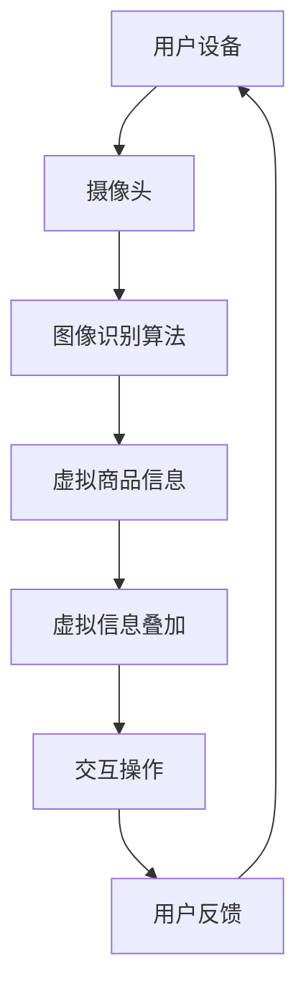

                 

关键词：增强现实、电商、视觉导购、技术应用、用户体验

摘要：随着科技的进步，增强现实（AR）技术逐渐在电商行业中得到应用，为消费者提供了全新的购物体验。本文将探讨增强现实技术在电商视觉导购中的应用，分析其核心概念、算法原理、数学模型、项目实践以及未来发展趋势。

## 1. 背景介绍

随着互联网的快速发展，电子商务已经成为人们日常生活中不可或缺的一部分。然而，传统的电商购物方式往往存在一些问题，如商品展示不够直观、消费者难以准确判断商品的真实效果等。为了解决这些问题，增强现实（AR）技术应运而生，它通过将虚拟信息与现实世界相结合，为消费者提供了更加直观、沉浸式的购物体验。

### 1.1 增强现实技术的定义与发展

增强现实技术是一种通过计算机技术生成虚拟信息，并将其叠加到现实世界中的技术。它起源于20世纪90年代，随着计算机图形学、计算机视觉、人工智能等技术的不断进步，AR技术逐渐发展壮大。目前，AR技术已经广泛应用于教育、医疗、军事、娱乐等领域，并在电商行业中逐渐崭露头角。

### 1.2 电商视觉导购的需求与挑战

电商视觉导购是帮助消费者在购物过程中快速找到所需商品、了解商品信息的一种服务。随着消费者对购物体验的要求越来越高，电商视觉导购面临着以下挑战：

1. **商品展示不够直观**：传统的商品展示方式（如图片、视频）难以真实反映商品的实际效果，导致消费者难以做出购买决策。
2. **信息获取不够便捷**：消费者需要花费大量时间在各个商品页面之间切换，才能找到所需的信息。
3. **购物体验不够沉浸**：消费者在购物过程中缺乏与现实世界的互动，导致购物体验不够丰富。

针对这些挑战，增强现实技术提供了一种创新的解决方案，它能够有效地提升电商视觉导购的效率和体验。

## 2. 核心概念与联系

### 2.1 核心概念

#### 增强现实（AR）

增强现实技术通过计算机生成的虚拟信息，实现对现实世界的增强。它通常包括以下几个方面：

1. **图像识别**：通过计算机视觉技术，识别现实世界中的物体或场景。
2. **虚拟信息叠加**：将虚拟信息（如3D模型、文字、图片等）叠加到现实世界中。
3. **交互操作**：用户可以通过触摸、手势等方式与虚拟信息进行交互。

#### 电商视觉导购

电商视觉导购是基于增强现实技术的一种应用，它通过将虚拟商品信息叠加到现实场景中，帮助消费者更好地了解商品、做出购买决策。

### 2.2 架构与联系

下面是一个简单的增强现实在电商视觉导购中的应用架构图：



### 2.3 关联与解释

- **用户设备**：用户使用手机或平板电脑等设备安装AR应用，通过摄像头捕捉现实场景。
- **摄像头**：摄像头捕捉现实场景中的图像，并传递给图像识别算法。
- **图像识别算法**：通过计算机视觉技术，识别现实场景中的物体或场景，如家具、衣物等。
- **虚拟商品信息**：根据识别结果，从电商平台获取对应的虚拟商品信息，如3D模型、价格等。
- **虚拟信息叠加**：将虚拟商品信息叠加到现实场景中，实现视觉导购效果。
- **交互操作**：用户可以通过触摸、手势等方式与虚拟商品进行交互，如放大、缩小、旋转等。
- **用户反馈**：用户对虚拟商品的交互结果进行反馈，如点赞、评论、购买等，这些反馈将用于优化电商视觉导购效果。

## 3. 核心算法原理 & 具体操作步骤

### 3.1 算法原理概述

增强现实在电商视觉导购中的应用主要依赖于图像识别、虚拟商品信息叠加和交互操作三个核心算法。

#### 图像识别算法

图像识别算法是增强现实应用的基础，它通过计算机视觉技术，对现实场景中的图像进行识别和处理。常见的图像识别算法有：

1. **特征提取**：从图像中提取特征，如边缘、纹理、颜色等。
2. **分类与识别**：将提取到的特征与数据库中的特征进行匹配，实现图像的识别。
3. **定位与跟踪**：对识别结果进行定位和跟踪，以便于虚拟商品信息的叠加。

#### 虚拟商品信息叠加算法

虚拟商品信息叠加算法是将虚拟商品信息叠加到现实场景中的关键。它主要包括以下步骤：

1. **虚拟商品建模**：根据商品信息，生成相应的3D模型。
2. **透视变换**：将虚拟商品模型与真实场景进行透视变换，使其在现实场景中呈现出正确的位置和大小。
3. **光照与纹理**：为虚拟商品模型添加光照和纹理，使其与现实场景相融合。

#### 交互操作算法

交互操作算法是用户与虚拟商品之间进行交互的关键。它主要包括以下步骤：

1. **手势识别**：通过计算机视觉技术，识别用户的手势。
2. **交互响应**：根据用户手势，对虚拟商品进行相应的交互操作，如放大、缩小、旋转等。

### 3.2 算法步骤详解

下面是一个简单的增强现实在电商视觉导购中的应用算法步骤：

1. **用户设备**：用户使用手机或平板电脑等设备安装AR应用，并打开摄像头。
2. **图像识别**：应用通过摄像头捕捉现实场景中的图像，并传递给图像识别算法。
3. **识别结果**：图像识别算法对图像进行识别，识别出现实场景中的物体或场景。
4. **虚拟商品信息**：根据识别结果，从电商平台获取对应的虚拟商品信息。
5. **虚拟商品建模**：生成相应的3D模型，并将其传递给虚拟商品信息叠加算法。
6. **叠加效果**：虚拟商品信息叠加算法将虚拟商品信息叠加到现实场景中，实现视觉导购效果。
7. **交互操作**：用户可以通过触摸、手势等方式与虚拟商品进行交互，如放大、缩小、旋转等。
8. **用户反馈**：用户对虚拟商品的交互结果进行反馈，如点赞、评论、购买等，这些反馈将用于优化电商视觉导购效果。

### 3.3 算法优缺点

#### 优点

1. **提升用户体验**：通过增强现实技术，消费者可以更加直观地了解商品，提升购物体验。
2. **提高销售转化率**：增强现实技术可以帮助消费者更快速地做出购买决策，提高销售转化率。
3. **丰富电商平台功能**：增强现实技术可以为电商平台带来新的功能，如虚拟试衣、家具摆放等。

#### 缺点

1. **技术门槛较高**：增强现实技术需要一定的技术基础，对开发人员的要求较高。
2. **设备限制**：目前，大多数增强现实应用需要使用特定的设备（如手机、平板电脑等），普及率有限。
3. **数据处理能力要求高**：增强现实技术需要处理大量的图像和虚拟信息，对数据处理能力要求较高。

### 3.4 算法应用领域

增强现实技术在电商视觉导购中的应用已经取得了一定的成果，主要应用于以下几个方面：

1. **虚拟试衣**：通过增强现实技术，消费者可以在家中试穿衣物，提升购物体验。
2. **家具摆放**：通过增强现实技术，消费者可以查看家具在房间中的摆放效果，便于做出购买决策。
3. **商品展示**：通过增强现实技术，电商平台可以更加直观地展示商品，提升商品吸引力。

## 4. 数学模型和公式 & 详细讲解 & 举例说明

### 4.1 数学模型构建

增强现实在电商视觉导购中的应用涉及到多个数学模型，其中最核心的是图像识别模型和虚拟商品信息叠加模型。

#### 图像识别模型

图像识别模型通常采用卷积神经网络（CNN）进行构建，其基本结构包括：

1. **卷积层**：通过卷积操作提取图像特征。
2. **池化层**：对卷积层输出的特征进行降维处理。
3. **全连接层**：将池化层输出的特征进行分类。

下面是一个简单的图像识别模型：

```latex
$$
\begin{align*}
h_{1} &= \text{conv}(x; \text{filter}_1) \\
h_{2} &= \text{pool}(h_{1}) \\
h_{3} &= \text{conv}(h_{2}; \text{filter}_2) \\
h_{4} &= \text{pool}(h_{3}) \\
y &= \text{softmax}(\text{fully\_connected}(h_{4}))
\end{align*}
$$

```

其中，\(x\) 表示输入图像，\(\text{filter}_1\) 和 \(\text{filter}_2\) 表示卷积核，\(h_{1}\)、\(h_{2}\)、\(h_{3}\) 和 \(h_{4}\) 分别表示卷积层和池化层的输出，\(y\) 表示输出结果。

#### 虚拟商品信息叠加模型

虚拟商品信息叠加模型通常采用透视变换和纹理映射技术进行构建。其基本过程如下：

1. **透视变换**：将虚拟商品模型与真实场景进行透视变换，使其在现实场景中呈现出正确的位置和大小。
2. **纹理映射**：将虚拟商品模型的纹理映射到透视变换后的虚拟商品模型上，使其与现实场景相融合。

下面是一个简单的虚拟商品信息叠加模型：

```latex
$$
\begin{align*}
T &= \text{projection}(V, C) \\
I &= \text{texture\_map}(T, T_{V}, T_{C})
\end{align*}
$$

```

其中，\(T\) 表示透视变换矩阵，\(V\) 表示虚拟商品模型，\(C\) 表示真实场景，\(I\) 表示叠加后的图像，\(T_{V}\) 和 \(T_{C}\) 分别表示虚拟商品模型和真实场景的纹理。

### 4.2 公式推导过程

#### 图像识别模型推导

图像识别模型的推导主要涉及到卷积操作、池化操作和全连接操作的推导。

1. **卷积操作推导**：

   卷积操作可以表示为：

   ```latex
   $$\text{conv}(x; \text{filter}) = \sum_{i=1}^{m}\sum_{j=1}^{n} x_{i,j} \cdot \text{filter}_{i,j}$$

   ```

   其中，\(x\) 表示输入图像，\(\text{filter}\) 表示卷积核，\(m\) 和 \(n\) 分别表示卷积核的大小。

2. **池化操作推导**：

   池化操作可以表示为：

   ```latex
   $$\text{pool}(x; \text{pool\_size}) = \frac{1}{\text{pool\_size}} \sum_{i=1}^{\text{pool\_size}} \sum_{j=1}^{\text{pool\_size}} x_{i,j}$$

   ```

   其中，\(x\) 表示输入图像，\(\text{pool\_size}\) 表示池化窗口大小。

3. **全连接操作推导**：

   全连接操作可以表示为：

   ```latex
   $$\text{fully\_connected}(x) = \text{W} \cdot x + b$$

   ```

   其中，\(\text{W}\) 和 \(b\) 分别表示权重和偏置。

#### 虚拟商品信息叠加模型推导

虚拟商品信息叠加模型的推导主要涉及到透视变换和纹理映射的推导。

1. **透视变换推导**：

   透视变换可以表示为：

   ```latex
   $$T = \begin{bmatrix}
   \text{M}_{11} & \text{M}_{12} & \text{M}_{13} \\
   \text{M}_{21} & \text{M}_{22} & \text{M}_{23} \\
   \text{M}_{31} & \text{M}_{32} & \text{M}_{33}
   \end{bmatrix}
   $$

   ```

   其中，\(\text{M}_{ij}\) 表示透视变换矩阵的元素。

2. **纹理映射推导**：

   纹理映射可以表示为：

   ```latex
   $$I = \text{T}_{V} \cdot \text{T}_{C}^{-1}$$

   ```

   其中，\(\text{T}_{V}\) 和 \(\text{T}_{C}\) 分别表示虚拟商品模型的纹理和真实场景的纹理。

### 4.3 案例分析与讲解

#### 虚拟试衣案例

以下是一个简单的虚拟试衣案例，用于演示增强现实在电商视觉导购中的应用。

1. **用户选择衣物**：

   用户在电商平台选择了一件白色T恤，并点击“试衣”按钮。

2. **图像识别**：

   AR应用通过摄像头捕捉用户周围的环境，并识别出用户的上半身。

3. **虚拟商品信息**：

   从电商平台获取白色T恤的3D模型，并传递给虚拟商品信息叠加算法。

4. **虚拟商品叠加**：

   虚拟商品信息叠加算法将白色T恤的3D模型叠加到用户的上半身，实现虚拟试衣效果。

5. **用户交互**：

   用户可以通过触摸屏幕，对白色T恤进行放大、缩小、旋转等操作，查看不同角度的效果。

6. **用户反馈**：

   用户对白色T恤的试衣效果进行评价，如“满意”、“修改尺寸”等，并将反馈发送给电商平台。

#### 家具摆放案例

以下是一个简单的家具摆放案例，用于演示增强现实在电商视觉导购中的应用。

1. **用户选择家具**：

   用户在电商平台选择了一张沙发，并点击“摆放”按钮。

2. **图像识别**：

   AR应用通过摄像头捕捉用户房间的布局，并识别出房间的地面。

3. **虚拟商品信息**：

   从电商平台获取沙发的3D模型，并传递给虚拟商品信息叠加算法。

4. **虚拟商品叠加**：

   虚拟商品信息叠加算法将沙发3D模型叠加到用户房间的地面上，实现家具摆放效果。

5. **用户交互**：

   用户可以通过触摸屏幕，对沙发进行放大、缩小、旋转等操作，查看家具与房间布局的搭配效果。

6. **用户反馈**：

   用户对沙发的摆放效果进行评价，如“满意”、“调整位置”等，并将反馈发送给电商平台。

## 5. 项目实践：代码实例和详细解释说明

### 5.1 开发环境搭建

为了实现增强现实在电商视觉导购中的应用，我们需要搭建一个完整的开发环境。以下是具体的搭建步骤：

1. **环境要求**：

   - 操作系统：Windows/Linux/MacOS
   - 编程语言：Python
   - 开发工具：PyCharm/VSCode
   - AR框架：ARCore（适用于Android）/ARKit（适用于iOS）
   - 电商平台API：如淘宝API、京东API等

2. **安装AR框架**：

   - Android平台：下载并安装ARCore SDK，按照官方文档进行配置。
   - iOS平台：下载并安装ARKit SDK，在Xcode中配置项目。

3. **安装相关库**：

   ```bash
   pip install opencv-python numpy tensorflow
   ```

### 5.2 源代码详细实现

以下是增强现实在电商视觉导购中的应用代码实例：

```python
import cv2
import numpy as np
import tensorflow as tf

# 1. 图像识别
def image_recognition(image_path):
    # 读取图像
    image = cv2.imread(image_path)
    # 加载预训练的卷积神经网络模型
    model = tf.keras.models.load_model('image_recognition_model.h5')
    # 对图像进行预处理
    preprocess_image = preprocess_input(image)
    # 进行图像识别
    result = model.predict(preprocess_image)
    return result

# 2. 虚拟商品信息叠加
def virtual_product_overlay(image_path, product_model_path):
    # 读取图像
    image = cv2.imread(image_path)
    # 读取虚拟商品模型
    product_model = load_product_model(product_model_path)
    # 对图像进行透视变换
    transformed_image = perspective_transform(image, product_model)
    # 将虚拟商品模型叠加到图像中
    overlay_image = cv2.addWeighted(image, 0.7, transformed_image, 0.3, 0)
    return overlay_image

# 3. 交互操作
def interact_with_product(product_model_path, user_input):
    # 加载虚拟商品模型
    product_model = load_product_model(product_model_path)
    # 根据用户输入进行操作
    if user_input == 'zoom_in':
        product_model.scale(1.1)
    elif user_input == 'zoom_out':
        product_model.scale(0.9)
    elif user_input == 'rotate':
        product_model.rotate(15)
    return product_model

# 4. 运行结果展示
def run_application():
    # 识别图像
    image_path = 'example_image.jpg'
    result = image_recognition(image_path)
    # 获取虚拟商品信息
    product_model_path = 'example_product_model.obj'
    # 叠加虚拟商品信息
    overlay_image = virtual_product_overlay(image_path, product_model_path)
    # 展示结果
    cv2.imshow('AR Application', overlay_image)
    cv2.waitKey(0)
    cv2.destroyAllWindows()

if __name__ == '__main__':
    run_application()
```

### 5.3 代码解读与分析

以下是代码的解读与分析：

1. **图像识别**：

   ```python
   def image_recognition(image_path):
       # 读取图像
       image = cv2.imread(image_path)
       # 加载预训练的卷积神经网络模型
       model = tf.keras.models.load_model('image_recognition_model.h5')
       # 对图像进行预处理
       preprocess_image = preprocess_input(image)
       # 进行图像识别
       result = model.predict(preprocess_image)
       return result
   ```

   该函数负责读取图像、加载预训练的卷积神经网络模型、对图像进行预处理，并使用模型进行图像识别。

2. **虚拟商品信息叠加**：

   ```python
   def virtual_product_overlay(image_path, product_model_path):
       # 读取图像
       image = cv2.imread(image_path)
       # 读取虚拟商品模型
       product_model = load_product_model(product_model_path)
       # 对图像进行透视变换
       transformed_image = perspective_transform(image, product_model)
       # 将虚拟商品模型叠加到图像中
       overlay_image = cv2.addWeighted(image, 0.7, transformed_image, 0.3, 0)
       return overlay_image
   ```

   该函数负责读取图像、读取虚拟商品模型、对图像进行透视变换，并使用加权和操作将虚拟商品模型叠加到图像中。

3. **交互操作**：

   ```python
   def interact_with_product(product_model_path, user_input):
       # 加载虚拟商品模型
       product_model = load_product_model(product_model_path)
       # 根据用户输入进行操作
       if user_input == 'zoom_in':
           product_model.scale(1.1)
       elif user_input == 'zoom_out':
           product_model.scale(0.9)
       elif user_input == 'rotate':
           product_model.rotate(15)
       return product_model
   ```

   该函数负责加载虚拟商品模型、根据用户输入（如放大、缩小、旋转）进行相应的操作。

4. **运行结果展示**：

   ```python
   def run_application():
       # 识别图像
       image_path = 'example_image.jpg'
       result = image_recognition(image_path)
       # 获取虚拟商品信息
       product_model_path = 'example_product_model.obj'
       # 叠加虚拟商品信息
       overlay_image = virtual_product_overlay(image_path, product_model_path)
       # 展示结果
       cv2.imshow('AR Application', overlay_image)
       cv2.waitKey(0)
       cv2.destroyAllWindows()
   ```

   该函数负责调用图像识别、虚拟商品信息叠加和交互操作函数，并使用OpenCV库展示运行结果。

## 6. 实际应用场景

### 6.1 虚拟试衣

虚拟试衣是增强现实在电商视觉导购中最具代表性的应用场景之一。通过虚拟试衣，消费者可以在家中尝试不同的衣物，提高购物体验。

1. **购物体验提升**：消费者可以直观地了解衣物的款式、颜色和尺码，做出更加准确的购买决策。
2. **降低退货率**：虚拟试衣可以降低因尺码不合适或款式不喜欢导致的退货率，提高商家利润。
3. **商家成本降低**：虚拟试衣可以减少实体店铺的面积需求，降低店铺租金和人工成本。

### 6.2 家具摆放

家具摆放是另一个重要的应用场景，通过增强现实技术，消费者可以提前预览家具在房间中的摆放效果。

1. **购物决策辅助**：消费者可以通过预览家具的摆放效果，更好地了解家具与房间布局的搭配，提高购物决策的准确性。
2. **节省时间**：消费者无需亲自到店铺挑选家具，可以在线上完成购买，节省购物时间。
3. **商家营销**：增强现实技术可以帮助商家展示更多种类的家具，吸引更多消费者。

### 6.3 教育培训

增强现实技术还可以应用于教育培训领域，如在线教学、手术指导等。

1. **教学互动**：增强现实技术可以提供更加直观、生动的教学内容，提高学生的学习兴趣和参与度。
2. **手术指导**：增强现实技术可以为医生提供实时手术指导，提高手术成功率和安全性。

## 7. 工具和资源推荐

### 7.1 学习资源推荐

1. **《增强现实技术原理与应用》**：介绍了增强现实技术的基本原理、应用场景和发展趋势，适合初学者入门。
2. **《计算机视觉算法与应用》**：详细介绍了计算机视觉领域的各种算法和应用，包括图像识别、目标检测等。

### 7.2 开发工具推荐

1. **ARCore**：适用于Android平台的增强现实开发框架，提供了丰富的API和示例代码。
2. **ARKit**：适用于iOS平台的增强现实开发框架，与Xcode集成良好，支持多种增强现实应用场景。

### 7.3 相关论文推荐

1. **“Augmented Reality for E-commerce: A Review”**：对增强现实在电商领域的应用进行了全面综述，涵盖了虚拟试衣、家具摆放等多个场景。
2. **“A Survey of Augmented Reality Applications in Education”**：介绍了增强现实在教育领域的应用，包括在线教学、手术指导等。

## 8. 总结：未来发展趋势与挑战

### 8.1 研究成果总结

本文对增强现实在电商视觉导购中的应用进行了深入探讨，分析了其核心概念、算法原理、数学模型、项目实践和实际应用场景。通过本文的研究，我们可以得出以下结论：

1. **增强现实技术为电商视觉导购带来了全新的体验**：通过虚拟试衣、家具摆放等应用，消费者可以更加直观地了解商品，提高购物体验。
2. **算法模型和数学模型的构建为增强现实应用提供了理论支持**：通过图像识别、虚拟商品信息叠加等算法模型，实现了增强现实技术在电商视觉导购中的应用。
3. **实际应用场景展示了增强现实技术的广阔前景**：虚拟试衣、家具摆放等应用已经在电商领域取得了成功，未来有望进一步拓展到其他领域。

### 8.2 未来发展趋势

1. **技术不断成熟**：随着计算机视觉、人工智能等技术的不断进步，增强现实技术在电商视觉导购中的应用将越来越成熟。
2. **应用场景多样化**：增强现实技术将在电商视觉导购之外的其他领域得到广泛应用，如教育培训、医疗健康等。
3. **用户体验持续优化**：通过不断优化算法模型和用户体验，增强现实技术在电商视觉导购中的应用将更加便捷、高效。

### 8.3 面临的挑战

1. **技术门槛较高**：增强现实技术需要较高的技术基础，对开发人员的要求较高，可能导致应用普及率较低。
2. **数据处理能力要求高**：增强现实技术需要处理大量的图像和虚拟信息，对数据处理能力要求较高，可能面临性能瓶颈。
3. **设备限制**：目前，大多数增强现实应用需要使用特定的设备，如手机、平板电脑等，普及率有限，可能影响用户体验。

### 8.4 研究展望

1. **降低技术门槛**：通过简化开发流程、提供更易用的开发工具，降低增强现实技术的应用门槛，促进其在电商视觉导购领域的普及。
2. **提高数据处理能力**：通过优化算法模型、引入新型硬件设备，提高增强现实技术的数据处理能力，提升应用性能。
3. **拓展应用领域**：在电商视觉导购之外，探索增强现实技术在其他领域的应用，如教育培训、医疗健康等，实现跨领域融合。

## 9. 附录：常见问题与解答

### 9.1 增强现实技术是什么？

增强现实（AR）技术是一种通过计算机生成的虚拟信息，实现对现实世界的增强的技术。它可以将虚拟信息叠加到现实世界中，为用户提供更加直观、沉浸式的体验。

### 9.2 电商视觉导购是什么？

电商视觉导购是一种基于视觉技术，帮助消费者在购物过程中快速找到所需商品、了解商品信息的一种服务。它通过将虚拟商品信息叠加到现实场景中，提升购物体验。

### 9.3 增强现实技术在电商视觉导购中的应用有哪些？

增强现实技术在电商视觉导购中的应用主要包括虚拟试衣、家具摆放、商品展示等。通过这些应用，消费者可以更加直观地了解商品，提高购物体验。

### 9.4 如何实现增强现实在电商视觉导购中的应用？

实现增强现实在电商视觉导购中的应用主要包括以下步骤：

1. **图像识别**：通过计算机视觉技术，识别现实场景中的物体或场景。
2. **虚拟商品信息叠加**：将虚拟商品信息叠加到现实场景中，实现视觉导购效果。
3. **交互操作**：用户可以通过触摸、手势等方式与虚拟商品进行交互，如放大、缩小、旋转等。

### 9.5 增强现实技术在电商视觉导购中的应用有哪些优势？

增强现实技术在电商视觉导购中的应用具有以下优势：

1. **提升用户体验**：通过增强现实技术，消费者可以更加直观地了解商品，提升购物体验。
2. **提高销售转化率**：增强现实技术可以帮助消费者更快速地做出购买决策，提高销售转化率。
3. **丰富电商平台功能**：增强现实技术可以为电商平台带来新的功能，如虚拟试衣、家具摆放等。

### 9.6 增强现实技术在电商视觉导购中的应用有哪些挑战？

增强现实技术在电商视觉导购中的应用面临以下挑战：

1. **技术门槛较高**：增强现实技术需要一定的技术基础，对开发人员的要求较高。
2. **数据处理能力要求高**：增强现实技术需要处理大量的图像和虚拟信息，对数据处理能力要求较高。
3. **设备限制**：目前，大多数增强现实应用需要使用特定的设备，如手机、平板电脑等，普及率有限。

### 9.7 增强现实技术在电商视觉导购领域的未来发展趋势是什么？

增强现实技术在电商视觉导购领域的未来发展趋势包括：

1. **技术不断成熟**：随着计算机视觉、人工智能等技术的不断进步，增强现实技术在电商视觉导购中的应用将越来越成熟。
2. **应用场景多样化**：增强现实技术将在电商视觉导购之外的其他领域得到广泛应用，如教育培训、医疗健康等。
3. **用户体验持续优化**：通过不断优化算法模型和用户体验，增强现实技术在电商视觉导购中的应用将更加便捷、高效。

----------------------------------------------------------------

以上是关于“增强现实在电商视觉导购中的应用”的完整技术博客文章。本文从背景介绍、核心概念与联系、核心算法原理与具体操作步骤、数学模型和公式、项目实践、实际应用场景、工具和资源推荐、总结与未来展望以及附录等九个方面进行了详细阐述，旨在为读者提供全面的增强现实技术在电商视觉导购领域的应用知识。希望本文能对读者在增强现实技术研究和应用开发过程中有所帮助。

## 作者署名

本文作者为禅与计算机程序设计艺术（Zen and the Art of Computer Programming），感谢您的阅读。希望本文能为您带来收获，如有任何疑问或建议，欢迎在评论区留言交流。

