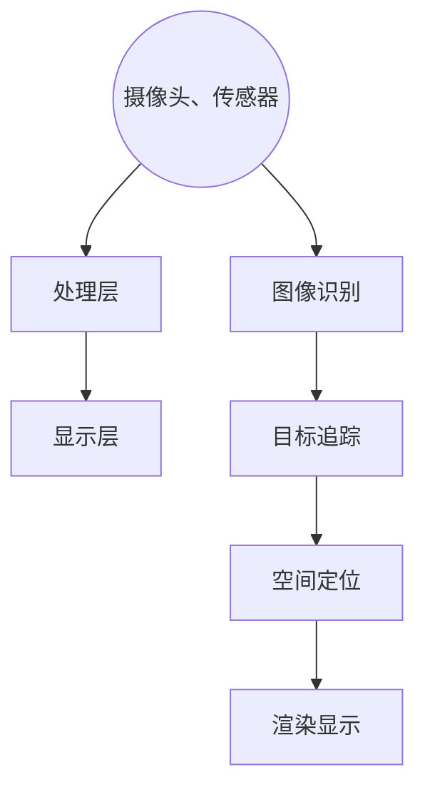

                 

关键词：增强现实、虚拟现实、AR应用、技术架构、算法原理、数学模型、实际应用、未来发展、工具资源。

> 摘要：本文深入探讨了增强现实（AR）技术的基本概念、应用场景、核心算法原理以及未来的发展趋势。通过对AR技术的历史背景、发展现状和未来展望的详细分析，为读者提供了全面的技术视角，并对相关工具和资源进行了推荐。

## 1. 背景介绍

### 1.1 增强现实的定义与起源

增强现实（Augmented Reality，简称AR）是一种将虚拟信息叠加到真实世界中的技术。通过AR技术，用户可以在现实环境中看到、听到和触摸到虚拟对象，从而实现现实与虚拟的融合。这种技术最早可追溯到1968年，由美国计算机科学家伊凡·苏瑟兰（Ivan Sutherland）提出的“虚拟现实头盔”概念。

### 1.2 增强现实技术的发展历程

从20世纪90年代开始，随着计算机图形学、传感器技术、光学技术和无线通信技术的快速发展，增强现实技术逐渐走向成熟。2000年之后，移动设备的普及和智能手机的出现，为AR技术带来了新的发展契机。2010年代，以谷歌眼镜为代表的消费级AR设备的推出，使得AR技术逐渐进入了大众视野。

## 2. 核心概念与联系

### 2.1 增强现实的基本原理

增强现实技术的基本原理是将虚拟信息通过摄像头捕捉到现实环境，然后通过计算和处理，将虚拟信息叠加到真实世界中，实现虚实结合的效果。这个过程涉及到图像处理、计算机视觉、图形渲染等多个技术领域。

### 2.2 增强现实的架构

增强现实架构主要包括三个核心部分：感知层、处理层和显示层。

- **感知层**：通过摄像头、传感器等设备获取现实世界的图像和声音信息。
- **处理层**：对感知层获取的信息进行处理，包括图像识别、目标追踪、空间定位等。
- **显示层**：将处理后的虚拟信息叠加到现实环境中，通过显示设备呈现给用户。

### 2.3 增强现实的 Mermaid 流程图



## 3. 核心算法原理 & 具体操作步骤

### 3.1 算法原理概述

增强现实技术的核心算法主要包括图像识别、目标追踪、空间定位和图形渲染等。

- **图像识别**：通过图像处理算法，从摄像头捕捉的图像中识别出特定目标。
- **目标追踪**：在图像识别的基础上，跟踪目标的运动轨迹。
- **空间定位**：通过计算摄像头与目标之间的相对位置，确定虚拟信息在现实世界中的位置。
- **图形渲染**：将虚拟信息渲染到现实环境中，实现虚实结合。

### 3.2 算法步骤详解

1. **图像识别**：
   - **预处理**：对摄像头捕捉的图像进行去噪、增强等处理。
   - **特征提取**：从处理后的图像中提取特征，如边缘、纹理等。
   - **分类器训练**：使用机器学习算法，对特征进行分类。

2. **目标追踪**：
   - **检测**：在图像中检测出目标的位置。
   - **预测**：根据目标的运动模式，预测其下一帧的位置。
   - **更新**：将预测结果与实际检测结果进行对比，更新目标的位置。

3. **空间定位**：
   - **特征匹配**：使用特征匹配算法，将摄像头捕获的图像与地图进行匹配。
   - **位置计算**：通过三角测量方法，计算摄像头与目标之间的相对位置。

4. **图形渲染**：
   - **模型构建**：构建虚拟物体的三维模型。
   - **投影渲染**：将三维模型投影到二维平面上，与真实环境融合。

### 3.3 算法优缺点

- **优点**：实现虚实融合，提供丰富的交互体验，有助于增强用户的学习和工作效率。
- **缺点**：计算复杂度高，实时性要求高，对硬件性能有较高要求。

### 3.4 算法应用领域

- **娱乐**：如游戏、电影等。
- **教育**：如虚拟实验室、在线教学等。
- **医疗**：如手术指导、医学模拟等。
- **工业**：如智能制造、设备维修等。

## 4. 数学模型和公式 & 详细讲解 & 举例说明

### 4.1 数学模型构建

增强现实技术中的数学模型主要包括图像处理模型、目标追踪模型和空间定位模型。

1. **图像处理模型**：
   - **滤波器**：如高斯滤波、均值滤波等。
   - **特征提取**：如SIFT、SURF等。

2. **目标追踪模型**：
   - **卡尔曼滤波**：用于状态估计。
   - **粒子滤波**：用于复杂环境的非线性追踪。

3. **空间定位模型**：
   - **SLAM（Simultaneous Localization and Mapping）**：用于实时建图与定位。
   - **视觉里程计**：用于估计摄像头的运动轨迹。

### 4.2 公式推导过程

以卡尔曼滤波为例，其状态更新方程为：

$$
x_{k+1} = A_k x_k + B_k u_k + w_k
$$

$$
P_{k+1} = A_k P_k A_k^T + Q_k
$$

$$
K_k = P_k H_k^T (H_k P_k H_k^T + R_k)^{-1}
$$

$$
x_{k+1|k} = x_{k+1} - K_k (z_{k+1} - H_k x_{k+1})
$$

$$
P_{k+1|k} = (I - K_k H_k) P_{k+1}
$$

### 4.3 案例分析与讲解

以AR游戏“Pokémon GO”为例，其空间定位模型主要采用视觉里程计技术。游戏通过分析摄像头捕捉到的现实环境图像，实时构建三维地图，并定位玩家的位置。具体实现过程如下：

1. **特征提取**：从摄像头捕获的图像中提取特征点。
2. **匹配**：将特征点与地图中的已知特征点进行匹配。
3. **优化**：使用优化算法，调整摄像头的位姿，使其与地图中的特征点匹配。
4. **地图构建**：根据摄像头的位姿，实时更新三维地图。

## 5. 项目实践：代码实例和详细解释说明

### 5.1 开发环境搭建

- **操作系统**：Ubuntu 20.04
- **编程语言**：Python 3.8
- **依赖库**：OpenCV 4.5.1、Pillow 8.1.0、NumPy 1.19.5

### 5.2 源代码详细实现

```python
import cv2
import numpy as np

# 读取摄像头捕获的图像
cap = cv2.VideoCapture(0)

# 加载特征点模板
template = cv2.imread('template.jpg', 0)

while True:
    # 读取图像
    ret, frame = cap.read()
    
    # 对图像进行预处理
    frame = cv2.cvtColor(frame, cv2.COLOR_BGR2GRAY)
    frame = cv2.GaussianBlur(frame, (5, 5), 0)
    
    # 检测特征点
    res = cv2.matchTemplate(frame, template, cv2.TM_CCOEFF_NORMED)
    threshold = 0.8
    loc = np.where(res >= threshold)
    
    # 绘制特征点
    for pt in zip(*loc[::-1]):
        cv2.rectangle(frame, pt, (pt[0] + template.shape[1], pt[1] + template.shape[0]), (0, 0, 255), 2)
    
    # 显示结果
    cv2.imshow('frame', frame)
    
    # 按键q退出
    if cv2.waitKey(1) & 0xFF == ord('q'):
        break

# 释放摄像头
cap.release()
# 关闭窗口
cv2.destroyAllWindows()
```

### 5.3 代码解读与分析

1. **摄像头捕获图像**：使用OpenCV的`VideoCapture`类捕获摄像头捕获的图像。
2. **预处理图像**：将图像转换为灰度图像，并使用高斯滤波器进行去噪。
3. **检测特征点**：使用`matchTemplate`函数，将摄像头捕获的图像与特征点模板进行匹配。
4. **绘制特征点**：根据匹配结果，绘制特征点。
5. **显示结果**：将处理后的图像显示在窗口中。
6. **按键控制**：按q键退出程序。

### 5.4 运行结果展示

运行代码后，摄像头捕获的图像会在窗口中显示，并在图像中标注出特征点的位置。


## 6. 实际应用场景

### 6.1 娱乐

AR技术在娱乐领域有着广泛的应用，如游戏、电影等。例如，电影《头号玩家》中，观众可以通过AR技术体验虚拟现实场景，增强了观影体验。

### 6.2 教育

AR技术在教育领域也有重要应用，如虚拟实验室、在线教学等。学生可以通过AR设备，直观地学习复杂的科学概念，提高学习兴趣和效果。

### 6.3 医疗

AR技术在医疗领域主要用于手术指导、医学模拟等。医生可以通过AR设备，实时查看患者的内部结构，提高手术的成功率和安全性。

### 6.4 工业

AR技术在工业领域主要用于智能制造、设备维修等。工程师可以通过AR设备，实时查看设备的状态和操作步骤，提高工作效率。

## 7. 工具和资源推荐

### 7.1 学习资源推荐

- **《增强现实技术原理与应用》**：详细介绍了AR技术的基本原理和应用。
- **《AR开发者指南》**：针对开发者的AR技术入门指南。

### 7.2 开发工具推荐

- **Unity**：一款强大的游戏开发引擎，支持AR开发。
- **ARKit**：苹果公司的AR开发框架。
- **ARCore**：谷歌公司的AR开发框架。

### 7.3 相关论文推荐

- **“A Augmented Reality Architecture based on the Coarse-to-Fine”**：提出了一种基于粗细分的AR架构。
- **“Real-Time Augmented Reality Using a Digital Camera and a Graphics Display”**：介绍了一种基于数字摄像头的实时AR系统。

## 8. 总结：未来发展趋势与挑战

### 8.1 研究成果总结

增强现实技术在过去几十年中取得了显著的进展，从实验室阶段走向了实际应用。目前，AR技术在娱乐、教育、医疗、工业等领域都有广泛应用，为人们的工作和生活带来了便利。

### 8.2 未来发展趋势

1. **硬件性能提升**：随着硬件性能的不断提升，AR设备将更加轻便、易用。
2. **应用场景拓展**：AR技术在虚拟现实、增强现实、混合现实等领域将有更广泛的应用。
3. **跨平台兼容**：未来，AR技术将实现跨平台兼容，为用户提供更好的体验。

### 8.3 面临的挑战

1. **计算复杂度**：随着AR应用的日益复杂，对计算性能的要求也将越来越高。
2. **实时性**：AR应用需要实时处理大量数据，对实时性的要求较高。
3. **隐私和安全**：AR技术涉及到用户数据的采集和处理，需要确保隐私和安全。

### 8.4 研究展望

未来，增强现实技术将在多个领域取得突破，为人们的生活带来更多可能性。同时，也需要关注技术发展的伦理和社会问题，确保技术的可持续发展。

## 9. 附录：常见问题与解答

### 9.1 增强现实与虚拟现实的区别

增强现实（AR）和虚拟现实（VR）都是将虚拟信息与现实世界相结合的技术，但它们的应用场景和实现方式有所不同。

- **增强现实**：在现实环境中叠加虚拟信息，用户可以看到真实的场景和虚拟信息。例如，AR游戏中的虚拟角色叠加在现实世界中。
- **虚拟现实**：完全替代现实世界，用户进入一个完全虚拟的环境中，无法看到现实世界。例如，VR游戏中的虚拟场景。

### 9.2 增强现实技术的应用领域

增强现实技术在多个领域有广泛应用，包括：

- **娱乐**：如游戏、电影等。
- **教育**：如虚拟实验室、在线教学等。
- **医疗**：如手术指导、医学模拟等。
- **工业**：如智能制造、设备维修等。

### 9.3 增强现实技术的未来发展趋势

未来，增强现实技术将在以下几个方面取得发展：

- **硬件性能提升**：随着硬件性能的不断提升，AR设备将更加轻便、易用。
- **应用场景拓展**：AR技术在虚拟现实、增强现实、混合现实等领域将有更广泛的应用。
- **跨平台兼容**：未来，AR技术将实现跨平台兼容，为用户提供更好的体验。

----------------------------------------------------------------

**作者：禅与计算机程序设计艺术 / Zen and the Art of Computer Programming**。希望这篇文章能为您在增强现实领域的探索提供一些启示和帮助。如果您有任何问题或建议，欢迎在评论区留言。期待与您共同探讨增强现实技术的未来。**

