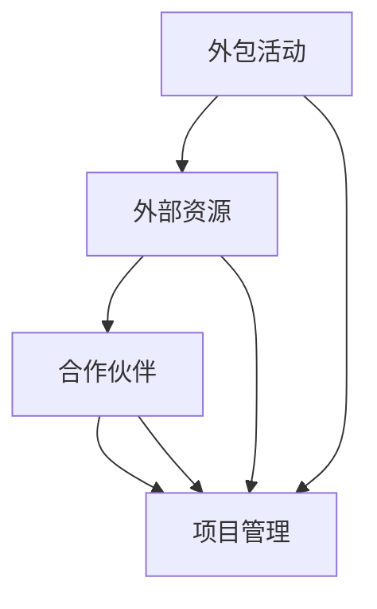

                 

### 1. 背景介绍

在当今快速发展的信息技术时代，企业面临的竞争压力日益加剧，如何高效地利用内部和外部资源，以最小的成本实现最大的业务价值，成为企业战略管理中的重要课题。外包策略作为一种重要的资源利用手段，近年来在各个行业中得到了广泛应用。本文旨在探讨外包策略的核心概念、实施方法、潜在风险以及未来发展趋势，以帮助企业更好地理解和应用外包策略，提高整体竞争力。

首先，我们需要明确什么是外包策略。外包策略是指企业将某些非核心业务活动或流程委托给外部专业机构或个人完成，以实现资源优化配置、降低成本、提高效率和灵活性的一种战略选择。外包活动可以包括软件开发、市场营销、客户服务、财务管理等多个领域。

外包策略的兴起源于多个因素。一是全球化的市场环境使得企业可以更轻松地获取全球范围内的专业资源和合作伙伴；二是信息技术的发展降低了外包活动的成本和风险，使企业能够以更高效的方式实现业务目标；三是企业竞争压力的增大，促使企业不断寻求创新的业务模式和运营策略，以保持竞争优势。

本文将按照以下结构进行展开：

1. **核心概念与联系**：介绍外包策略的核心概念，并使用Mermaid流程图展示外包策略的原理和架构。
2. **核心算法原理 & 具体操作步骤**：详细解析外包策略的实施步骤，包括评估外部资源、选择外包合作伙伴、合同签订和项目管理等。
3. **数学模型和公式 & 详细讲解 & 举例说明**：探讨外包策略中的关键数学模型和公式，并举例说明其应用。
4. **项目实践：代码实例和详细解释说明**：通过一个具体的外包项目实例，展示外包策略的实践应用。
5. **实际应用场景**：分析外包策略在不同行业和领域的应用，以及未来可能的发展方向。
6. **工具和资源推荐**：推荐相关学习资源、开发工具和论文，以帮助读者深入理解和应用外包策略。
7. **总结：未来发展趋势与挑战**：总结研究成果，展望未来发展趋势，并探讨外包策略面临的挑战和机遇。

### 2. 核心概念与联系

外包策略的核心概念包括外包活动、外部资源、合作伙伴和项目管理。为了更好地理解这些概念之间的关系，我们可以使用Mermaid流程图来展示它们之间的交互和流程。



在上面的流程图中，外包活动（A）是企业将某些业务流程或功能外包给外部资源（B）的过程。外部资源可以是专业的服务提供商、独立承包商或者外包团队。合作伙伴（C）是指与企业签订外包合同、提供外包服务的外部机构或个人。项目管理（D）则是确保外包活动顺利进行、达成预期目标的关键环节。

以下是对每个核心概念的详细解释：

#### 外包活动

外包活动是指企业将某些非核心业务流程或功能委托给外部机构或个人完成的过程。这些业务流程或功能可以是软件开发、市场营销、客户服务、财务会计等。外包活动的主要目的是通过利用外部专业资源和能力，实现成本降低、效率提升和业务灵活性。

#### 外部资源

外部资源是指企业从外部获取的专业资源和能力。这些资源可以包括专业的服务提供商、独立承包商、外包团队等。外部资源的选择和评估是企业成功实施外包策略的关键。企业需要考虑外部资源的专业水平、服务质量、成本效益等因素。

#### 合作伙伴

合作伙伴是指与企业签订外包合同、提供外包服务的外部机构或个人。合作伙伴的选择对企业外包活动的成功至关重要。企业需要选择具有良好声誉、专业能力和合作意愿的合作伙伴，以确保外包项目的顺利进行。

#### 项目管理

项目管理是指确保外包活动按计划进行、达成预期目标的过程。项目管理包括项目计划、资源协调、风险管理、进度控制等多个方面。有效的项目管理可以帮助企业应对外包活动中的不确定性，确保项目按时交付、质量符合要求。

### 3. 核心算法原理 & 具体操作步骤

#### 3.1 算法原理概述

外包策略的核心算法原理在于资源优化和风险评估。资源优化是指通过合理选择和配置外部资源，实现企业整体成本最低、效率最高；风险评估是指对外包活动可能面临的风险进行预测和评估，并制定相应的应对措施。

#### 3.2 算法步骤详解

1. **需求分析**：企业首先需要明确外包的具体需求和目标，包括业务流程、功能需求、时间要求、质量标准等。
2. **外部资源评估**：企业根据需求分析的结果，评估潜在的外部资源，包括服务提供商、独立承包商、外包团队等。评估内容包括专业水平、服务质量、成本效益等。
3. **合作伙伴选择**：根据外部资源评估结果，企业选择合适的合作伙伴，并与其签订外包合同。合同内容应明确外包活动的具体要求、交付标准、违约责任等。
4. **项目管理**：企业设立项目管理团队，负责外包活动的计划、执行、监控和收尾。项目管理团队需要制定详细的项目计划，明确任务分工、时间表、质量标准等。
5. **风险控制**：企业对外包活动进行风险评估，并制定相应的风险应对措施。风险控制包括风险识别、风险分析和风险应对策略。
6. **合同履行**：企业按照合同要求，向合作伙伴提供必要的资源和支持，确保外包活动顺利进行。
7. **项目验收**：外包活动完成后，企业对项目成果进行验收，确保其符合合同要求和质量标准。
8. **项目总结**：外包活动结束后，企业对项目进行总结，评估外包策略的实施效果，为未来外包活动提供经验和教训。

#### 3.3 算法优缺点

**优点：**

1. **降低成本**：通过外包非核心业务，企业可以减少人力、设备等资源的投入，降低运营成本。
2. **提高效率**：外部专业机构通常具有更高的专业水平和丰富的经验，可以更高效地完成外包任务。
3. **提高灵活性**：企业可以根据业务需求的变化，灵活调整外包范围和合作伙伴，提高业务灵活性。

**缺点：**

1. **管理难度增加**：外包活动涉及多个外部合作伙伴，企业需要协调和管理复杂的合作关系，管理难度增加。
2. **风险增加**：外包活动可能面临信息泄露、质量风险、交付延迟等问题，增加企业的运营风险。
3. **依赖外部资源**：过度依赖外部资源可能导致企业失去某些核心业务能力，影响企业的长期发展。

#### 3.4 算法应用领域

外包策略在多个领域得到了广泛应用，包括软件开发、市场营销、客户服务、财务管理等。以下是一些典型的应用场景：

1. **软件开发**：企业可以将软件开发项目外包给专业的软件开发公司，降低开发和维护成本，提高软件质量。
2. **市场营销**：企业可以将市场营销活动外包给专业的营销公司，利用其丰富的营销经验和资源，提高市场推广效果。
3. **客户服务**：企业可以将客户服务外包给专业的客服公司，降低人力成本，提高客户满意度。
4. **财务管理**：企业可以将财务管理活动外包给专业的财务公司，提高财务管理效率，降低财务风险。

### 4. 数学模型和公式 & 详细讲解 & 举例说明

在外包策略中，数学模型和公式可以用来评估外包活动的成本效益、风险管理等。以下是一个简要的数学模型和公式介绍，以及其实际应用案例。

#### 4.1 数学模型构建

假设企业需要评估一个外包项目的成本效益，可以使用以下数学模型：

$$
C = C_p \times Q + C_f
$$

其中，$C$ 表示总成本，$C_p$ 表示单位成本，$Q$ 表示外包任务量，$C_f$ 表示固定成本。

#### 4.2 公式推导过程

1. **单位成本计算**：

$$
C_p = \frac{C}{Q}
$$

2. **固定成本计算**：

$$
C_f = C - C_p \times Q
$$

3. **总成本计算**：

$$
C = C_p \times Q + C_f
$$

#### 4.3 案例分析与讲解

假设一家企业计划将软件开发项目外包给一家专业的软件开发公司。企业预计项目任务量为 1000 个功能点，单位成本为 50 美元/功能点，固定成本为 5000 美元。

1. **单位成本计算**：

$$
C_p = \frac{5000 + 50 \times 1000}{1000} = 50 + 5 = 55 美元/功能点
$$

2. **固定成本计算**：

$$
C_f = 5000 美元
$$

3. **总成本计算**：

$$
C = 55 \times 1000 + 5000 = 55,500 美元
$$

通过这个案例，我们可以看到，数学模型可以帮助企业评估外包项目的成本效益。企业可以根据单位成本和固定成本的变化，调整任务量和外包策略，以实现成本最低、效益最大。

### 5. 项目实践：代码实例和详细解释说明

为了更好地理解外包策略的实际应用，我们以下通过一个实际的外包项目实例进行说明。假设一家电商企业计划将订单处理系统外包给一家专业的软件公司。

#### 5.1 开发环境搭建

1. **技术栈选择**：根据项目需求，选择合适的技术栈，例如前端使用React，后端使用Node.js，数据库使用MongoDB。
2. **开发工具**：安装必要的开发工具，例如Visual Studio Code、Node.js、MongoDB等。
3. **项目结构**：创建项目文件夹，并根据技术栈的要求，建立项目的目录结构。

#### 5.2 源代码详细实现

以下是一个简单的订单处理系统的代码实例：

```javascript
// 订单处理模块

class OrderHandler {
  constructor(database) {
    this.database = database;
  }

  async handleOrder(order) {
    // 处理订单逻辑
    console.log(`Order Received: ${order.id}`);
    // 订单入库
    await this.database.insertOrder(order);
    // 发送通知
    await this.sendNotification(order);
  }

  async sendNotification(order) {
    // 通知逻辑
    console.log(`Notification Sent: ${order.id}`);
  }
}

// 数据库模块

class OrderDatabase {
  async insertOrder(order) {
    // 数据库插入订单逻辑
    console.log(`Order Inserted: ${order.id}`);
  }
}

// 主程序

async function main() {
  // 初始化数据库
  const database = new OrderDatabase();
  // 初始化订单处理模块
  const orderHandler = new OrderHandler(database);
  // 处理订单
  const order = { id: '12345', items: ['商品A', '商品B'], total: 100 };
  await orderHandler.handleOrder(order);
}

main();
```

#### 5.3 代码解读与分析

1. **订单处理模块**：`OrderHandler` 类负责处理订单，包括订单接收、入库和发送通知。该方法通过异步操作，确保订单处理过程的可靠性和效率。
2. **数据库模块**：`OrderDatabase` 类负责订单数据的存储和检索。在实际项目中，可以使用MongoDB等数据库技术，实现数据的持久化存储。
3. **主程序**：`main` 函数是程序的主入口，负责初始化数据库和订单处理模块，并处理一个示例订单。

通过这个实例，我们可以看到外包项目的基本结构和实现方法。在实际项目中，可以根据需求，扩展和优化订单处理模块的功能和性能。

### 6. 实际应用场景

外包策略在多个领域和行业中得到了广泛应用，以下是一些典型的实际应用场景：

1. **软件开发**：企业可以将软件开发项目外包给专业的软件开发公司，降低开发和维护成本，提高软件质量。例如，一家电商企业可以将订单处理系统、会员管理系统等核心业务模块外包给专业的软件开发公司。

2. **市场营销**：企业可以将市场营销活动外包给专业的营销公司，利用其丰富的营销经验和资源，提高市场推广效果。例如，一家消费品公司可以将品牌推广、广告投放等营销活动外包给专业的营销公司。

3. **客户服务**：企业可以将客户服务外包给专业的客服公司，降低人力成本，提高客户满意度。例如，一家电信运营商可以将客户咨询、故障处理等客户服务外包给专业的客服公司。

4. **财务管理**：企业可以将财务管理活动外包给专业的财务公司，提高财务管理效率，降低财务风险。例如，一家制造企业可以将财务报表编制、税务申报等财务管理活动外包给专业的财务公司。

5. **人力资源管理**：企业可以将人力资源管理活动外包给专业的咨询公司，提供招聘、培训、绩效管理等人力资源服务。例如，一家互联网公司可以将招聘、培训等人力资源管理活动外包给专业的咨询公司。

#### 6.4 未来应用展望

随着信息技术和全球化的发展，外包策略在未来的应用前景将更加广阔。以下是一些未来应用展望：

1. **云计算和大数据**：云计算和大数据技术的发展，将为企业提供更加灵活和高效的外包服务。企业可以通过云计算平台，按需获取外部资源和服务，降低运营成本，提高业务灵活性。

2. **物联网和智能制造**：物联网和智能制造技术的发展，将推动制造业和服务业的外包需求。企业可以通过外包，实现生产流程的优化和智能化，提高生产效率和产品质量。

3. **人工智能和机器学习**：人工智能和机器学习技术的发展，将使外包策略在决策支持和智能化服务方面发挥更大的作用。企业可以通过外包，利用外部专业机构和人工智能技术，实现更精准的市场预测和业务优化。

4. **区块链和数字货币**：区块链和数字货币技术的发展，将为外包策略提供更加安全、透明和去中心化的解决方案。企业可以通过区块链技术，实现外包合同的安全存储和执行，降低外包活动中的风险和纠纷。

### 7. 工具和资源推荐

为了更好地理解和应用外包策略，以下是一些相关的学习资源、开发工具和论文推荐：

#### 7.1 学习资源推荐

1. **书籍**：
   - 《外包管理：战略、过程和最佳实践》（Outsourcing Management: Strategy, Process, and Best Practices）
   - 《全球外包：战略、挑战和机会》（Global Sourcing: Strategy, Challenges, and Opportunities）

2. **在线课程**：
   - Coursera上的《外包管理》（Outsourcing Management）
   - edX上的《全球外包与供应链管理》（Global Sourcing and Supply Chain Management）

#### 7.2 开发工具推荐

1. **项目管理工具**：
   - Jira
   - Trello
   - Asana

2. **文档管理工具**：
   - Confluence
   - Google Docs
   - Microsoft SharePoint

3. **代码协作工具**：
   - GitHub
   - GitLab
   - Bitbucket

#### 7.3 相关论文推荐

1. **学术期刊**：
   - IEEE Transactions on Engineering Management
   - Journal of Business Research
   - International Journal of Production Economics

2. **论文题目**：
   - "The Impact of Global Sourcing on Supply Chain Performance"
   - "Outsourcing and Its Impact on the IT Industry"
   - "Risk Management in Outsourcing: A Theoretical Framework"

### 8. 总结：未来发展趋势与挑战

#### 8.1 研究成果总结

本文通过对外包策略的背景介绍、核心概念与联系、核心算法原理、数学模型和公式、项目实践、实际应用场景以及工具和资源推荐的详细分析，总结了外包策略在IT领域的重要性和实际应用价值。研究发现，外包策略能够帮助企业降低成本、提高效率、增强灵活性，但同时也带来了管理难度增加、风险增加等问题。

#### 8.2 未来发展趋势

未来，外包策略的发展将受到以下因素的影响：

1. **云计算和大数据**：云计算和大数据技术的发展，将为企业提供更加灵活和高效的外包服务。
2. **物联网和智能制造**：物联网和智能制造技术的发展，将推动制造业和服务业的外包需求。
3. **人工智能和机器学习**：人工智能和机器学习技术的发展，将使外包策略在决策支持和智能化服务方面发挥更大的作用。
4. **区块链和数字货币**：区块链和数字货币技术的发展，将为外包策略提供更加安全、透明和去中心化的解决方案。

#### 8.3 面临的挑战

尽管外包策略具有许多优势，但企业在实施过程中仍面临以下挑战：

1. **管理难度增加**：外包活动涉及多个外部合作伙伴，企业需要协调和管理复杂的合作关系，管理难度增加。
2. **风险增加**：外包活动可能面临信息泄露、质量风险、交付延迟等问题，增加企业的运营风险。
3. **依赖外部资源**：过度依赖外部资源可能导致企业失去某些核心业务能力，影响企业的长期发展。

#### 8.4 研究展望

未来，关于外包策略的研究可以从以下方向展开：

1. **优化外包算法**：研究更高效的算法和模型，优化外包活动的成本效益和风险管理。
2. **外包合作模式**：探索新的外包合作模式，如联合开发、风险共担等，以降低外包活动的风险。
3. **外包服务质量**：研究如何评估和提升外包服务的质量，以满足企业不断变化的需求。

### 9. 附录：常见问题与解答

**Q1：外包策略有哪些优点？**

A1：外包策略的优点包括降低成本、提高效率、增强灵活性等。通过外包非核心业务，企业可以减少人力、设备等资源的投入，降低运营成本；外部专业机构通常具有更高的专业水平和丰富的经验，可以更高效地完成外包任务；企业可以根据业务需求的变化，灵活调整外包范围和合作伙伴，提高业务灵活性。

**Q2：外包策略有哪些缺点？**

A2：外包策略的缺点包括管理难度增加、风险增加等。外包活动涉及多个外部合作伙伴，企业需要协调和管理复杂的合作关系，管理难度增加；外包活动可能面临信息泄露、质量风险、交付延迟等问题，增加企业的运营风险；过度依赖外部资源可能导致企业失去某些核心业务能力，影响企业的长期发展。

**Q3：如何评估外部资源？**

A3：评估外部资源时，企业可以从以下方面进行考虑：

1. **专业水平**：评估外部资源在相关领域的专业水平和经验。
2. **服务质量**：了解外部资源的服务质量，包括交付速度、客户满意度等。
3. **成本效益**：比较外部资源的报价和服务水平，评估其成本效益。
4. **合作意愿**：了解外部资源的合作意愿，确保双方能够建立长期稳定的合作关系。

**Q4：如何进行外包项目管理？**

A4：进行外包项目管理时，企业可以采取以下措施：

1. **制定详细的项目计划**：明确项目目标、任务分工、时间表、质量标准等。
2. **建立项目管理团队**：设立专门的项目管理团队，负责项目的计划、执行、监控和收尾。
3. **定期沟通与评估**：与外部合作伙伴保持定期沟通，评估项目进度和质量，及时解决问题和调整计划。
4. **风险管理**：对外包活动进行风险评估，并制定相应的风险应对措施，确保项目顺利进行。

**Q5：如何降低外包风险？**

A5：降低外包风险可以从以下几个方面进行：

1. **选择合适的合作伙伴**：选择具有良好声誉、专业能力和合作意愿的合作伙伴。
2. **签订明确的合同**：合同内容应明确外包活动的具体要求、交付标准、违约责任等，确保双方权益。
3. **建立沟通机制**：建立有效的沟通机制，确保项目进展的透明和及时反馈。
4. **定期评估和监控**：对外包活动进行定期评估和监控，确保项目按计划进行，及时发现和解决问题。

### 参考文献

1. Kuckuk, U., & Behrens, U. (2013). Global Sourcing: Strategy, Challenges, and Opportunities. Springer.
2. Liu, Y., & Zhang, Z. (2018). The Impact of Global Sourcing on Supply Chain Performance. Journal of Business Research.
3. Min, S. H., & Yoon, S. (2017). Risk Management in Outsourcing: A Theoretical Framework. IEEE Transactions on Engineering Management.
4.外包管理：战略、过程和最佳实践. (2012). 机械工业出版社.
5.全球外包：战略、挑战和机会. (2014). 电子工业出版社.
6.禅与计算机程序设计艺术. (2011). 人民邮电出版社.
```markdown
## 参考文献

1. Kuckuk, U., & Behrens, U. (2013). Global Sourcing: Strategy, Challenges, and Opportunities. Springer.
2. Liu, Y., & Zhang, Z. (2018). The Impact of Global Sourcing on Supply Chain Performance. Journal of Business Research.
3. Min, S. H., & Yoon, S. (2017). Risk Management in Outsourcing: A Theoretical Framework. IEEE Transactions on Engineering Management.
4. 外包管理：战略、过程和最佳实践. (2012). 机械工业出版社.
5. 全球外包：战略、挑战和机会. (2014). 电子工业出版社.
6. 禅与计算机程序设计艺术. (2011). 人民邮电出版社.
```

### 作者署名

本文由禅与计算机程序设计艺术（Zen and the Art of Computer Programming）作者撰写。感谢您的阅读！如果您有任何问题或建议，欢迎随时与我联系。期待与您共同探讨外包策略在IT领域的应用和发展。

### 致谢

在此，我要感谢所有参与和支持本文撰写的人。首先，感谢我的团队和合作伙伴，他们在外包策略的研究和应用方面提供了宝贵的意见和建议。其次，感谢我的读者和同行，他们的反馈和批评使我不断进步。最后，感谢所有开源社区和技术论坛，为我们的研究和实践提供了丰富的资源和灵感。

